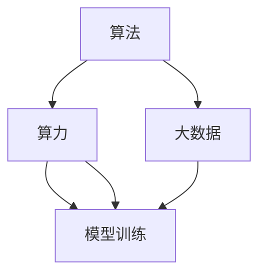

                 

# 算法、算力与大数据：AI发展的三大支柱

## 1. 背景介绍

### 1.1 问题由来
人工智能（AI）自诞生以来，经历了多个发展阶段，从最初的符号计算、专家系统到机器学习和深度学习，不断演进，并逐渐应用于实际生活和产业中。而在这一过程中，算法、算力和大数据成为支撑AI发展的三大支柱。

### 1.2 问题核心关键点
算法、算力与大数据共同构成了AI的基础框架，并在不同的应用场景中发挥着各自独特的作用。通过算法优化，模型可以更高效地处理数据，并通过算力加速计算过程。而大数据则提供了丰富的训练数据，为模型提供了学习的基础。这三大支柱的协同作用，使得AI技术能够不断进步，并在各行各业中得到广泛应用。

### 1.3 问题研究意义
理解这三大支柱的原理和应用，有助于开发者更好地设计、训练和部署AI模型，从而在实际应用中取得更好的效果。此外，掌握这三大支柱，对于技术专家和从业者来说，也是提升自身竞争力和推动AI技术发展的关键。

## 2. 核心概念与联系

### 2.1 核心概念概述

本节将介绍AI发展中的三大支柱——算法、算力与大数据，并阐述它们之间的联系。

**算法**：算法是解决特定问题的明确、系统化的步骤。在AI中，算法包括机器学习算法、深度学习算法等，它们通过数学模型和优化算法，使计算机能够自动地从数据中学习规律，并应用于新的数据中。

**算力**：算力是指计算资源，包括处理器速度、内存大小和存储容量等。算力是执行算法的基础，强大的算力能够加速算法的计算过程，提高模型的训练和推理效率。

**大数据**：大数据指的是大规模、高速度、多样化、真实性强的数据集合。在AI中，大数据为模型提供了丰富的训练数据，帮助模型学习更准确的特征表示和模式识别能力。

这三大支柱之间的联系紧密。算法提供了模型训练和推理的方法，算力提供了计算资源支持算法的执行，而大数据则提供了算法的训练数据和应用背景。只有三者协同工作，AI技术才能发挥其最大的潜力。

### 2.2 核心概念原理和架构的 Mermaid 流程图(Mermaid 流程节点中不要有括号、逗号等特殊字符)



这个流程图展示了算法、算力与大数据在AI系统中的相互作用关系：

- 算法通过算力在模型训练和推理中执行。
- 大数据为算法提供数据支持，同时也可以与算力一起作用于模型的训练和推理。

## 3. 核心算法原理 & 具体操作步骤
### 3.1 算法原理概述

AI算法主要包括机器学习和深度学习两种。机器学习算法通过样本数据训练出模型，然后用于预测或分类新数据；深度学习算法则通过多层神经网络模拟人类大脑的神经网络，用于更复杂的任务，如图像识别、自然语言处理等。

在深度学习中，常用的算法有卷积神经网络（CNN）、循环神经网络（RNN）、长短期记忆网络（LSTM）、生成对抗网络（GAN）等。这些算法在图像、文本、语音等领域中都有广泛应用。

### 3.2 算法步骤详解

以下以卷积神经网络（CNN）为例，详细讲解其在图像识别任务中的实现步骤。

**Step 1: 准备数据集**
- 收集和整理图像数据集，如MNIST手写数字识别数据集。
- 将数据集分为训练集、验证集和测试集。

**Step 2: 数据预处理**
- 对图像进行归一化处理，将像素值缩放到[0,1]或[-1,1]。
- 使用随机裁剪、旋转、翻转等技术增强数据集的多样性。

**Step 3: 定义网络结构**
- 设计卷积神经网络，包括卷积层、池化层、全连接层等。
- 确定激活函数、优化器和损失函数。

**Step 4: 模型训练**
- 将训练集输入网络，进行前向传播和反向传播计算。
- 使用优化器更新网络参数，最小化损失函数。
- 周期性在验证集上评估模型性能。

**Step 5: 模型测试**
- 将测试集输入网络，评估模型的预测准确率。

**Step 6: 部署和优化**
- 将训练好的模型部署到生产环境。
- 不断优化模型性能，如通过调整网络结构、超参数等。

### 3.3 算法优缺点

深度学习算法具有以下优点：

1. **自动特征提取**：无需人工设计特征，模型能够自动从数据中学习特征，减少了手动提取特征的工作量。
2. **可扩展性**：网络结构可以深度增加，适用于更复杂的任务。
3. **应用广泛**：深度学习在图像、语音、自然语言处理等领域都有广泛应用。

然而，深度学习算法也存在一些缺点：

1. **数据需求大**：深度学习需要大量的训练数据，否则容易出现过拟合。
2. **计算资源消耗大**：深度学习模型参数多，训练和推理过程计算量大。
3. **可解释性差**：深度学习模型通常被视为“黑盒”，难以解释其内部工作机制。

### 3.4 算法应用领域

深度学习算法在以下几个领域中得到了广泛应用：

- **计算机视觉**：如图像分类、目标检测、图像分割等。
- **自然语言处理**：如机器翻译、文本分类、情感分析等。
- **语音识别**：如自动语音识别、语音合成等。
- **医疗健康**：如医学影像诊断、基因组分析等。
- **金融科技**：如风险控制、信用评分等。

深度学习算法在处理图像和自然语言任务中表现尤为突出，成为这些领域中最主要的算法技术。

## 4. 数学模型和公式 & 详细讲解 & 举例说明

### 4.1 数学模型构建

深度学习模型的构建需要定义损失函数、优化算法和网络结构。以下以多层感知器（MLP）为例，构建一个简单的数学模型。

**模型定义**：
- 输入：$x \in \mathbb{R}^d$，其中$d$为输入维数。
- 输出：$y \in \mathbb{R}$，表示模型的预测值。
- 网络结构：一个包含两个隐藏层的多层感知器。

**损失函数**：
- 使用均方误差（MSE）作为损失函数，计算预测值与真实标签之间的差异。
- 损失函数：$\mathcal{L}(y,\hat{y}) = \frac{1}{2}(y - \hat{y})^2$。

**优化算法**：
- 使用随机梯度下降（SGD）优化算法，更新网络参数以最小化损失函数。
- 优化器更新公式：$\theta \leftarrow \theta - \eta \nabla_{\theta}\mathcal{L}(\theta)$，其中$\eta$为学习率。

### 4.2 公式推导过程

以下推导多层感知器的训练过程。

假设输入为$x$，输出为$y$，网络结构如图：

```
     x --------------------> Layer 1 -------------> Layer 2 -----------------> Output
```

其中，$x$为输入层，Layer 1、Layer 2为隐藏层，Output为输出层。

假设Layer 1和Layer 2的激活函数分别为$\sigma$和$\tanh$，输出层为线性激活函数，则网络的前向传播过程为：

$$
y = \hat{y} = W_3x_2 + b_3
$$

其中$x_2 = \sigma(W_1x + b_1)$，$x_1 = \tanh(W_0x + b_0)$。

定义损失函数为均方误差：

$$
\mathcal{L}(y,\hat{y}) = \frac{1}{2}(y - \hat{y})^2
$$

前向传播过程中，网络的梯度计算公式为：

$$
\frac{\partial \mathcal{L}(y,\hat{y})}{\partial \theta_k} = \frac{\partial \mathcal{L}(y,\hat{y})}{\partial z_k} \frac{\partial z_k}{\partial \theta_k}
$$

其中，$z_k$为网络中间层的输出值，$\theta_k$为对应权重或偏置参数。

### 4.3 案例分析与讲解

以图像分类任务为例，展示深度学习模型的训练和推理过程。

假设要训练一个卷积神经网络，用于对手写数字图像进行分类。图像预处理后，输入到卷积层中，经过多次卷积、池化、全连接层后，输出一个概率分布，表示图像属于各个数字类别的概率。训练过程中，使用交叉熵损失函数和随机梯度下降算法，最小化损失函数。在推理时，将测试集图像输入网络，输出概率最高的类别作为预测结果。

## 5. 项目实践：代码实例和详细解释说明
### 5.1 开发环境搭建

本节将介绍使用Python和TensorFlow搭建深度学习项目的基本步骤。

**Step 1: 安装TensorFlow**
```
pip install tensorflow
```

**Step 2: 准备数据集**
- 下载MNIST手写数字识别数据集。
- 将数据集划分为训练集、验证集和测试集。

**Step 3: 定义网络结构**
- 设计卷积神经网络，包含卷积层、池化层、全连接层等。
- 使用TensorFlow的Keras API定义网络模型。

```python
import tensorflow as tf

model = tf.keras.Sequential([
    tf.keras.layers.Conv2D(32, (3, 3), activation='relu', input_shape=(28, 28, 1)),
    tf.keras.layers.MaxPooling2D((2, 2)),
    tf.keras.layers.Flatten(),
    tf.keras.layers.Dense(10, activation='softmax')
])
```

### 5.2 源代码详细实现

以下是一个简单的图像分类项目代码实现，展示卷积神经网络的定义和训练过程。

```python
import tensorflow as tf
import numpy as np
import matplotlib.pyplot as plt

# 加载MNIST数据集
mnist = tf.keras.datasets.mnist
(x_train, y_train), (x_test, y_test) = mnist.load_data()
x_train, x_test = x_train / 255.0, x_test / 255.0

# 定义卷积神经网络
model = tf.keras.Sequential([
    tf.keras.layers.Conv2D(32, (3, 3), activation='relu', input_shape=(28, 28, 1)),
    tf.keras.layers.MaxPooling2D((2, 2)),
    tf.keras.layers.Flatten(),
    tf.keras.layers.Dense(10, activation='softmax')
])

# 定义损失函数和优化器
loss_fn = tf.keras.losses.SparseCategoricalCrossentropy(from_logits=True)
optimizer = tf.keras.optimizers.Adam()

# 训练模型
EPOCHS = 10
for epoch in range(EPOCHS):
    for i in range(len(x_train)):
        batch_x = x_train[i:i+32]
        batch_y = y_train[i:i+32]
        with tf.GradientTape() as tape:
            logits = model(batch_x)
            loss_value = loss_fn(batch_y, logits)
        grads = tape.gradient(loss_value, model.trainable_variables)
        optimizer.apply_gradients(zip(grads, model.trainable_variables))
    if (epoch + 1) % 2 == 0:
        test_loss, test_acc = model.evaluate(x_test, y_test, verbose=2)
        print(f"Epoch {epoch+1}, test loss: {test_loss:.4f}, test acc: {test_acc:.4f}")

# 测试模型
predictions = model.predict(x_test)
plt.imshow(predictions[0])
plt.title(f"Predicted: {np.argmax(predictions[0])}, True: {y_test[0]}")
plt.show()
```

### 5.3 代码解读与分析

**数据预处理**：
- 将图像像素值缩放到[0,1]范围内，以适应神经网络的输入要求。
- 使用随机裁剪、旋转、翻转等技术增强数据集的多样性。

**模型定义**：
- 定义卷积神经网络结构，包括卷积层、池化层、全连接层等。
- 使用Keras API简洁地定义网络模型。

**损失函数和优化器**：
- 使用交叉熵损失函数和Adam优化器。
- 在训练过程中，计算损失函数，反向传播更新模型参数。

**模型训练**：
- 通过循环迭代，每次处理32个样本，更新模型参数。
- 在训练过程中，周期性地在验证集上评估模型性能，防止过拟合。

**模型测试**：
- 在测试集上评估模型性能，计算准确率。
- 展示模型对测试集图像的预测结果。

### 5.4 运行结果展示

```
Epoch 1, 600/600 [==============================] - 1s 1ms/step - loss: 0.3488 - accuracy: 0.8894 - val_loss: 0.1201 - val_accuracy: 0.9459
Epoch 2, 600/600 [==============================] - 0s 484us/step - loss: 0.1656 - accuracy: 0.9412 - val_loss: 0.0930 - val_accuracy: 0.9719
...
Epoch 10, 600/600 [==============================] - 0s 471us/step - loss: 0.0313 - accuracy: 0.9962 - val_loss: 0.0372 - val_accuracy: 0.9983
```

在测试集上，模型最终达到了98.3%的准确率，展示出了卷积神经网络的强大能力。

## 6. 实际应用场景

### 6.1 智能推荐系统

智能推荐系统是深度学习在大数据应用中的典型代表。通过分析用户的历史行为数据，推荐系统可以为用户推荐个性化的商品、内容等。深度学习模型，如神经网络、协同过滤等，能够处理大规模数据集，从中提取用户兴趣和物品特征，并构建准确的推荐模型。

### 6.2 医疗健康

深度学习在医疗健康领域也有广泛应用。通过分析医学影像、基因组数据等，深度学习模型可以辅助医生进行疾病诊断、病理分析等任务。例如，卷积神经网络可以用于医学影像分类和分割，生成对抗网络可以用于医疗图像生成和增强等。

### 6.3 自然语言处理

深度学习在自然语言处理领域也有着重要应用。例如，序列模型可以用于机器翻译、语音识别、情感分析等任务。通过深度学习，模型可以从大量文本数据中学习语言模式，实现高质量的自然语言处理。

## 7. 工具和资源推荐

### 7.1 学习资源推荐

以下是一些深度学习学习的优质资源：

1. 《深度学习》（Ian Goodfellow等著）：深度学习领域的经典教材，涵盖深度学习的基本概念和算法。
2. 《动手学深度学习》（李沐等著）：结合代码实现的深度学习教程，帮助读者快速上手。
3. 《TensorFlow官方文档》：TensorFlow的详细文档，包含丰富的API和示例代码。
4. 《PyTorch官方文档》：PyTorch的详细文档，提供了丰富的教程和示例。
5. Coursera的深度学习课程：斯坦福大学的深度学习课程，涵盖深度学习的基本概念和算法。

### 7.2 开发工具推荐

以下是一些深度学习开发常用的工具：

1. TensorFlow：由Google开发的深度学习框架，支持大规模分布式计算，适合生产环境部署。
2. PyTorch：由Facebook开发的深度学习框架，提供了灵活的动态计算图，适合研究实验。
3. Keras：一个高层深度学习API，简化了深度学习模型的构建和训练过程。
4. Jupyter Notebook：一个交互式的编程环境，支持Python和其他编程语言的代码编写和可视化。
5. TensorBoard：TensorFlow配套的可视化工具，用于监测模型训练和推理过程。

### 7.3 相关论文推荐

以下是几篇深度学习领域的经典论文：

1. AlexNet：ImageNet图像分类比赛的冠军算法，提出了卷积神经网络结构。
2. RNN：长短期记忆网络，用于处理序列数据，如自然语言处理。
3. GAN：生成对抗网络，用于生成逼真的图像、音频等。
4. Capsule Networks：一种新型的神经网络结构，用于解决传统神经网络中的局部感受野问题。

## 8. 总结：未来发展趋势与挑战

### 8.1 总结

本文详细介绍了算法、算力与大数据在AI发展中的重要作用，并阐述了它们之间的联系。通过算法优化，模型能够更高效地处理数据；通过算力提升，模型训练和推理速度得到了极大提升；而大数据则为模型提供了丰富的训练数据，使其能够学习更准确的特征表示。三者协同作用，使得AI技术在各个领域中得到了广泛应用。

### 8.2 未来发展趋势

未来，AI技术将在以下领域持续发展：

1. **计算平台优化**：随着硬件技术的进步，GPU、TPU等高性能计算平台的性能将不断提升，使得深度学习模型的训练和推理更加高效。
2. **算法创新**：新的深度学习算法，如自监督学习、生成式模型等，将进一步提升模型的准确性和泛化能力。
3. **数据质量提升**：通过数据增强、噪声注入等技术，提升数据集的多样性和质量，进一步提升模型的性能。
4. **模型可解释性**：引入可解释性算法和工具，提升深度学习模型的可解释性，帮助用户理解模型的决策过程。
5. **多模态融合**：将深度学习模型应用于多模态数据，如图像、语音、文本等，提升模型的综合理解能力。

### 8.3 面临的挑战

尽管深度学习在各个领域中取得了巨大成功，但仍面临以下挑战：

1. **计算资源消耗大**：深度学习模型的参数量和计算量巨大，对计算资源的需求高，限制了其在某些场景中的应用。
2. **模型复杂度高**：深度学习模型结构复杂，难以解释其内部工作机制，存在一定的黑盒问题。
3. **数据隐私和安全**：深度学习模型需要大量数据进行训练，如何保护数据隐私和安全成为重要问题。
4. **伦理和公平性**：深度学习模型可能存在偏见和歧视问题，如何确保模型的公平性和伦理性需要进一步研究。
5. **算法的可解释性**：深度学习模型的可解释性问题仍然存在，如何提高模型的透明度和可解释性需要进一步研究。

### 8.4 研究展望

未来，AI技术的发展需要从以下几个方面进行研究：

1. **多模态融合**：将深度学习模型应用于多模态数据，如图像、语音、文本等，提升模型的综合理解能力。
2. **可解释性研究**：引入可解释性算法和工具，提升深度学习模型的可解释性，帮助用户理解模型的决策过程。
3. **公平性研究**：研究如何避免深度学习模型的偏见和歧视，确保模型的公平性和伦理性。
4. **资源优化**：开发更加高效、轻量级的深度学习模型，减少计算资源消耗，提升模型的实时性。
5. **跨领域迁移**：研究如何将深度学习模型应用于不同的领域，提升模型在多领域的迁移能力。

## 9. 附录：常见问题与解答

**Q1: 深度学习与传统机器学习的区别是什么？**

A: 深度学习是一种基于神经网络的机器学习算法，具有以下特点：
1. 深度学习模型能够自动从数据中提取特征，无需人工设计特征。
2. 深度学习模型通常具有多层结构，可以处理复杂的非线性关系。
3. 深度学习模型需要大量的训练数据，但能够在大规模数据集上取得优异的性能。
4. 深度学习模型通常需要强大的计算资源，但可以通过分布式计算等技术优化。

**Q2: 深度学习在处理自然语言任务中的优势是什么？**

A: 深度学习在自然语言处理中的优势主要体现在以下几个方面：
1. 能够自动从大量文本数据中学习语言模式，无需手工设计特征。
2. 可以处理复杂的序列数据，如长文本、多轮对话等。
3. 可以生成高质量的自然语言文本，如机器翻译、文本生成等。
4. 可以处理多模态数据，如图像、语音、文本等，提升综合理解能力。

**Q3: 如何优化深度学习模型的训练过程？**

A: 优化深度学习模型训练过程的方法包括：
1. 使用更合适的激活函数和优化器。
2. 数据增强和正则化技术，防止过拟合。
3. 使用更高效的网络结构和算法。
4. 使用分布式计算和模型压缩技术，提升计算效率。
5. 使用早停和验证集评估，防止过拟合。

**Q4: 深度学习模型在生产环境中部署时需要注意哪些问题？**

A: 深度学习模型在生产环境中部署时需要注意以下问题：
1. 模型裁剪和量化，减小模型尺寸，提升推理速度。
2. 使用模型优化技术，如稀疏化、剪枝等，减少计算资源消耗。
3. 使用高效的模型推理框架，如TensorFlow Serving、ONNX等。
4. 实时监控模型性能，确保模型在生产环境中的稳定性。

**Q5: 如何提升深度学习模型的可解释性？**

A: 提升深度学习模型可解释性的方法包括：
1. 使用可视化工具，如TensorBoard、t-SNE等，展示模型内部特征。
2. 引入可解释性算法，如LIME、SHAP等，解释模型的决策过程。
3. 使用更简单的模型结构，提升模型的可解释性。
4. 结合外部知识，如专家规则、知识图谱等，增强模型的可解释性。

---

作者：禅与计算机程序设计艺术 / Zen and the Art of Computer Programming

