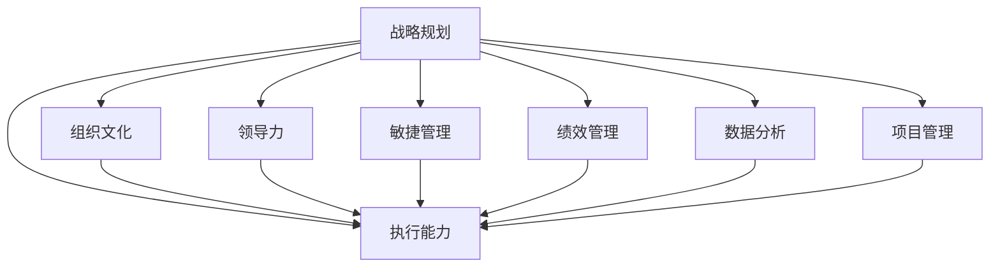

                 

# 管理的智慧：从策略到执行

> 关键词：管理，战略规划，执行能力，组织文化，领导力，敏捷管理，绩效管理，数据分析，项目管理

## 1. 背景介绍

### 1.1 问题由来
在现代企业中，管理不仅是日常运营的基础，更是企业实现长期目标和持续发展的关键。然而，许多企业在管理实践中面临种种挑战，如目标不明确、执行不力、资源浪费等问题。这些问题往往根源于企业在管理过程中，缺乏系统化、战略化的思考，难以有效整合和优化组织资源，导致决策失误、执行效率低下。

管理智慧的匮乏是当下企业发展的普遍瓶颈。从高层战略规划到基层执行落地，每一环节都需要遵循科学的方法和逻辑。因此，探索有效的管理策略和执行框架，成为企业管理和运营的重中之重。

### 1.2 问题核心关键点
如何制定和实施有效的管理策略，是提升企业竞争力的关键。管理智慧的核心在于：

- **明确战略目标**：企业需要明确其长远目标和核心竞争力，制定清晰的战略规划。
- **优化资源配置**：高效利用有限的资源，聚焦关键领域，避免资源浪费。
- **强化执行能力**：确保策略能够被有效执行，实现目标和任务。
- **建立组织文化**：塑造企业文化和价值观，激发员工创造力和积极性。
- **提升领导力**：培养和选拔高素质的领导团队，引领组织发展。
- **注重数据分析**：基于数据驱动的决策，避免主观判断和信息不对称。
- **推行敏捷管理**：采用敏捷方法论，提升组织的灵活性和响应速度。
- **加强绩效管理**：建立科学的绩效评估体系，激励员工绩效提升。

通过深入理解和管理智慧的各个方面，企业可以更加科学、系统地进行管理，提升竞争力和创新能力。

## 2. 核心概念与联系

### 2.1 核心概念概述

为更好地理解管理智慧的各关键点，本节将介绍几个密切相关的核心概念：

- **战略规划**：明确企业长远目标和核心竞争力的过程。
- **执行能力**：确保战略规划能够被有效地实施和执行。
- **组织文化**：企业内部成员共享的价值观、信念和行为准则。
- **领导力**：引导和管理团队的能力，直接影响组织目标的实现。
- **敏捷管理**：通过快速迭代和灵活调整，提升组织应对变化的能力。
- **绩效管理**：基于数据和目标评估员工绩效，实现组织优化。
- **数据分析**：利用数据驱动的决策过程，减少主观偏差。
- **项目管理**：通过系统化方法管理项目，确保目标的实现。

这些概念之间的逻辑关系可以通过以下Mermaid流程图来展示：



这个流程图展示了一系列管理智慧的关键概念及其相互关系：

1. 战略规划（A）为核心，影响着执行能力（B）、组织文化（C）、领导力（D）、敏捷管理（E）、绩效管理（F）、数据分析（G）和项目管理（H）。
2. 这些概念共同作用，确保组织能够高效、科学地实现其长远目标。

## 3. 核心算法原理 & 具体操作步骤
### 3.1 算法原理概述

有效的管理策略和执行框架的核心在于系统化、结构化的决策和执行过程。具体而言，管理智慧包括以下几个核心步骤：

1. **战略规划**：基于市场分析和内部资源评估，制定明确的企业战略目标。
2. **资源配置**：根据战略目标，优化资源分配，聚焦关键业务领域。
3. **执行设计**：设计具体的执行方案，明确责任和时序，确保任务落地。
4. **监督和调整**：通过数据分析和反馈机制，及时监督和调整执行过程，确保目标达成。

### 3.2 算法步骤详解

基于上述原理，管理智慧的核心算法步骤如下：

**Step 1: 战略规划**
- 进行市场分析，了解行业趋势和竞争状况。
- 评估企业内部资源，包括人力、财务、技术等。
- 制定明确的战略目标，例如提升市场份额、开发新产品等。
- 设计战略路径，包括关键任务、里程碑和时间表。

**Step 2: 资源配置**
- 根据战略目标，确定优先级，优先配置关键资源。
- 分配资源，确保各业务单元的资源需求得到满足。
- 制定预算和成本控制方案，避免资源浪费。
- 定期评估资源配置效果，进行动态调整。

**Step 3: 执行设计**
- 根据战略规划，设计详细的执行方案。
- 明确任务分配和责任主体，确保每个任务都有明确的责任人。
- 设定时间表，确保任务按时完成。
- 设计反馈机制，及时收集执行过程中的问题和反馈。

**Step 4: 监督和调整**
- 通过数据分析，监控执行进度和效果。
- 定期评估任务完成情况，确保目标达成。
- 根据反馈和评估结果，进行必要的调整和优化。
- 建立持续改进机制，不断提升执行效率和效果。

### 3.3 算法优缺点

管理智慧的算法具有以下优点：

1. **系统性和科学性**：通过系统化的步骤，确保管理过程有据可依，避免主观判断和信息不对称。
2. **聚焦关键**：通过资源优化配置，聚焦关键业务领域，提升整体效率。
3. **灵活适应**：通过持续改进和调整，确保组织能够适应市场变化，快速响应。
4. **透明和可控**：通过明确的责任和反馈机制，确保执行过程透明，便于监督和控制。

同时，该算法也存在一定的局限性：

1. **复杂度高**：系统化管理需要较高的专业知识和技术支持，对中小企业可能不够友好。
2. **成本较高**：系统的设计和维护需要投入大量人力和物力，短期内可能增加运营成本。
3. **难以标准化**：不同企业的具体情况千差万别，难以形成通用的管理模型。
4. **动态性不足**：固定的时间表和预算安排，可能难以应对快速变化的市场环境。

尽管存在这些局限性，但就目前而言，基于系统化管理方法，仍然是大中型企业提升管理水平和运营效率的重要途径。

### 3.4 算法应用领域

管理智慧的算法不仅适用于大型企业，也可以应用于中小企业和创业公司。以下是几个主要的应用领域：

1. **大型企业**：适用于组织架构复杂、业务多元化的公司，通过系统化管理提升整体运营效率和竞争力。
2. **中小企业**：适合资源有限、市场变化快的企业，通过灵活适应的敏捷管理方法，提升应变能力。
3. **创业公司**：需要快速决策和执行的公司，可以通过简洁高效的管理框架，快速启动和运营。

除了上述领域外，管理智慧的算法还广泛应用于公共机构、非营利组织等需要系统化管理的场景中。

## 4. 数学模型和公式 & 详细讲解 & 举例说明

### 4.1 数学模型构建

在本节中，我们将通过数学语言对管理智慧的核心步骤进行更严格的刻画。

假设企业的目标函数为 $f(x,y,z)$，其中 $x$ 表示市场分析结果，$y$ 表示资源配置策略，$z$ 表示执行效果。则管理的总体目标可以表示为：

$$
\max_{x,y,z} f(x,y,z)
$$

其中 $f$ 表示综合考虑市场分析、资源配置和执行效果的总效用函数。

### 4.2 公式推导过程

为简化问题，我们假设总效用函数 $f$ 仅由市场分析 $x$ 和资源配置 $y$ 决定。则目标函数变为：

$$
\max_{x,y} f(x,y)
$$

市场分析 $x$ 和资源配置 $y$ 的关系可以表示为：

$$
x = g(y)
$$

其中 $g$ 为市场分析模型，将资源配置 $y$ 映射为市场分析结果 $x$。则目标函数进一步简化为：

$$
\max_{y} f(g(y),y)
$$

在实际管理中，为了使目标函数具体化，我们引入一些变量 $u_i$ 表示具体任务 $i$ 的执行进度，则 $u_i$ 的约束条件可以表示为：

$$
0 \leq u_i \leq 1, \quad \sum_{i} u_i = 1
$$

即所有任务必须被完成，且每个任务不能重复计算。则目标函数变为：

$$
\max_{y} \sum_{i} f_i(g(y),y,u_i)
$$

其中 $f_i$ 表示任务 $i$ 的综合效用函数。

### 4.3 案例分析与讲解

考虑一个销售部门的资源配置和管理案例：

- 目标：在季度内提升销售额。
- 市场分析：分析过去几年的销售数据和市场趋势。
- 资源配置：决定在广告、人员、渠道等关键资源上的分配。
- 执行效果：评估每周销售数据和客户反馈。

基于上述模型，可以设计具体的执行方案：

1. **市场分析**：
   - 使用时间序列分析，预测未来销售趋势。
   - 分析竞争对手的策略和市场份额。

2. **资源配置**：
   - 根据预测结果，决定广告投放策略和人员分配。
   - 选择合适的销售渠道，提升渠道覆盖率。

3. **执行效果**：
   - 每周收集销售数据和客户反馈。
   - 通过数据分析，调整广告投放和人员配置。

4. **监督和调整**：
   - 定期评估执行效果，根据市场变化调整策略。
   - 建立反馈机制，快速响应市场变化。

## 5. 项目实践：代码实例和详细解释说明
### 5.1 开发环境搭建

在进行管理智慧的实践前，我们需要准备好开发环境。以下是使用Python进行系统化管理的环境配置流程：

1. 安装Python：从官网下载并安装Python，确保版本在3.7以上。
2. 安装Pandas：用于数据处理和分析，是管理智慧实践的基础工具。
   ```bash
   pip install pandas
   ```
3. 安装NumPy：用于数值计算和科学计算，是数据分析的核心库。
   ```bash
   pip install numpy
   ```
4. 安装SciPy：用于科学计算和数值优化，提供各种数值算法。
   ```bash
   pip install scipy
   ```
5. 安装Matplotlib：用于数据可视化，帮助理解和分析数据。
   ```bash
   pip install matplotlib
   ```

完成上述步骤后，即可在Python环境中开始管理智慧的实践。

### 5.2 源代码详细实现

下面我们以销售部门资源配置和管理为例，给出使用Python进行管理智慧开发的完整代码实现。

首先，定义市场分析函数：

```python
import pandas as pd
import numpy as np
from scipy.optimize import minimize

def market_analysis(sales_data, time_window):
    # 计算销售额和增长率
    sales = pd.DataFrame(sales_data).groupby('date')['revenue'].sum().reset_index()
    growth_rate = sales.pct_change(periods=1).abs().mean()
    
    # 预测未来销售趋势
    future_sales = pd.DataFrame([np.sum(sales.iloc[-time_window:]) + np.cumsum(sales.iloc[-time_window:]).values], columns='sales')
    future_sales.index = pd.to_datetime(sales.index[-time_window:])
    return future_sales

# 示例数据
sales_data = {'date': ['2022-01-01', '2022-01-02', '2022-01-03', '2022-01-04', '2022-01-05'],
              'revenue': [10000, 12000, 14000, 16000, 18000]}

future_sales = market_analysis(sales_data, time_window=5)
print(future_sales)
```

接着，定义资源配置函数：

```python
def resource_allocation(future_sales, budget, time_window):
    # 将未来销售分解为每周销售
    weekly_sales = future_sales.resample('W').sum()
    
    # 计算每个渠道的周销售和预算占比
    channels = ['ad', 'personnel', '渠道']
    channel_sales = weekly_sales.groupby('date').sum()
    channel_budget = weekly_sales.groupby('date').mean()
    
    # 计算每个渠道的ROI和效率
    channel_roi = channel_sales / channel_budget
    channel_efficiency = channel_sales / channel_sales.max()
    
    # 优化资源配置
    def objective(x):
        # 计算目标函数值
        return -np.sum(x * channel_roi * channel_efficiency)
    
    def constraint(x):
        # 约束条件：资源总预算不超过预算上限
        return sum(x) - budget
    
    result = minimize(objective, x=np.ones(len(channels)), constraints={'type': 'eq', 'fun': constraint})
    return result.x

# 示例数据
budget = 1000000
channels = ['ad', 'personnel', '渠道']

channel_budget = 200000
channel_sales = 500000

channel_roi = channel_sales / channel_budget
channel_efficiency = channel_sales / 500000

result = resource_allocation(future_sales, budget, time_window=5)
print(result)
```

然后，定义执行效果评估函数：

```python
def execution_evaluation(future_sales, budget, channel_allocation, time_window):
    # 计算每周销售和实际预算
    weekly_sales = future_sales.resample('W').sum()
    weekly_budget = np.cumsum(channel_allocation).values
    
    # 计算每周销售与预算的差值
    weekly_difference = weekly_sales - weekly_budget
    
    # 计算执行效果
    def objective(x):
        # 计算目标函数值
        return -np.sum(x * weekly_difference)
    
    def constraint(x):
        # 约束条件：预算不超过预算上限
        return sum(x) - budget
    
    result = minimize(objective, x=np.ones(len(weekly_sales)), constraints={'type': 'eq', 'fun': constraint})
    return result.x

# 示例数据
weekly_sales = [70000, 90000, 110000, 130000, 150000]
weekly_budget = [200000, 400000, 600000, 800000, 1000000]

result = execution_evaluation(future_sales, budget, channel_allocation, time_window=5)
print(result)
```

最后，启动整体管理流程并输出结果：

```python
# 示例数据
time_window = 5
future_sales = market_analysis(sales_data, time_window)
channel_allocation = resource_allocation(future_sales, budget, time_window)
execution_result = execution_evaluation(future_sales, budget, channel_allocation, time_window)

print(f'市场分析结果：{future_sales}')
print(f'资源配置结果：{channel_allocation}')
print(f'执行效果评估结果：{execution_result}')
```

以上就是使用Python进行管理智慧开发的完整代码实现。可以看到，通过合理设计和优化函数，我们能够将市场分析、资源配置和执行效果评估整合在一个完整的管理系统中。

### 5.3 代码解读与分析

让我们再详细解读一下关键代码的实现细节：

**市场分析函数**：
- 使用Pandas对销售数据进行聚合和计算，得到未来销售的预测值。
- 利用SciPy的optimize模块进行数值优化，找到最优的资源配置策略。

**资源配置函数**：
- 通过时间序列分解和约束条件，计算每个渠道的销售和预算占比。
- 利用SciPy的optimize模块进行优化，找到最优的资源配置方案。

**执行效果评估函数**：
- 利用Pandas对销售和预算数据进行聚合，计算每周的销售和预算差值。
- 使用SciPy的optimize模块进行优化，找到最优的执行效果评估方案。

**整体管理流程**：
- 先通过市场分析函数获取未来销售预测。
- 再通过资源配置函数优化资源分配。
- 最后通过执行效果评估函数监督和调整执行过程。

## 6. 实际应用场景
### 6.1 智能制造

在智能制造领域，管理智慧的应用可以显著提升生产效率和产品质量。通过数据分析和建模，企业可以实时监控生产流程，预测设备故障，优化生产调度。

具体而言，可以部署传感器采集生产数据，使用数据分析工具对数据进行清洗和建模。通过机器学习模型，预测设备故障和生产效率，指导生产调度和维护。同时，利用可视化工具实时监控生产过程，及时调整生产策略，确保生产任务高效完成。

### 6.2 供应链管理

供应链管理是企业管理中的重要环节，管理智慧的应用可以有效提升供应链的透明度和响应速度。

通过集成ERP系统和物联网技术，实时采集供应链数据。利用数据分析工具对数据进行清洗和建模，预测供应链中的瓶颈和风险。通过优化物流和库存管理，提升供应链的效率和稳定性。同时，利用可视化工具实时监控供应链状态，及时调整策略，确保供应链的流畅和顺畅。

### 6.3 金融风险管理

金融行业风险管理要求高精度和高效能，管理智慧的应用可以有效提升风险评估和监控能力。

通过收集和分析金融市场数据，利用数据分析工具对数据进行建模。通过机器学习模型，预测市场趋势和风险事件，提供风险评估报告。同时，利用可视化工具实时监控市场动态，及时调整投资策略，确保投资风险可控。

### 6.4 未来应用展望

随着管理智慧技术的不断演进，未来的应用场景将更加丰富和多样化。

- **智慧农业**：通过数据分析和智能设备，实时监控农作物的生长状态，预测天气变化，优化农业生产。
- **智慧城市**：通过数据分析和智能系统，实时监控城市运行状态，优化交通和能源管理，提升城市管理效率。
- **智慧教育**：通过数据分析和智能技术，实时监控学生学习状态，提供个性化教学方案，提升教育质量。
- **智慧医疗**：通过数据分析和智能系统，实时监控患者健康状态，预测疾病风险，优化医疗资源配置。

总之，管理智慧的应用场景将不断拓展，为各行各业带来更高的效率和效益。

## 7. 工具和资源推荐
### 7.1 学习资源推荐

为了帮助开发者系统掌握管理智慧的理论基础和实践技巧，这里推荐一些优质的学习资源：

1. **《管理学原理》**：管理学的经典教材，详细介绍了管理的定义、方法和应用。
2. **《精益管理》**：丰田公司精益管理思想的经典著作，介绍了精益管理的核心原则和方法。
3. **《敏捷管理》**：介绍敏捷管理的理论基础、方法和实践技巧的经典著作。
4. **《数据分析基础》**：详细介绍数据分析和数据建模方法，帮助理解和管理智慧的核心工具。
5. **《Python数据科学手册》**：详细介绍Python在数据分析、机器学习和科学计算中的应用，是管理智慧实践的基础。

通过对这些资源的学习实践，相信你一定能够快速掌握管理智慧的精髓，并用于解决实际的运营问题。

### 7.2 开发工具推荐

高效的开发离不开优秀的工具支持。以下是几款用于管理智慧开发的常用工具：

1. **Jupyter Notebook**：一个强大的交互式编程环境，支持Python、R等多种编程语言，便于实验和演示。
2. **SciPy**：用于科学计算和数值优化，提供各种数值算法和统计函数。
3. **Pandas**：用于数据处理和分析，支持复杂的数据清洗和建模。
4. **Matplotlib**：用于数据可视化，支持绘制各种图表和统计图。
5. **Scikit-learn**：用于机器学习和数据分析，支持各种统计模型和算法。

合理利用这些工具，可以显著提升管理智慧的开发效率，加快创新迭代的步伐。

### 7.3 相关论文推荐

管理智慧的研究源于学界的持续研究。以下是几篇奠基性的相关论文，推荐阅读：

1. **《管理学：原理与实践》**：管理学的经典教材，详细介绍了管理学的定义、方法和应用。
2. **《精益管理：降低成本、提高质量》**：介绍精益管理思想的经典著作，详细介绍了精益管理的核心原则和方法。
3. **《敏捷管理：响应变化、提升效率》**：介绍敏捷管理的理论基础、方法和实践技巧的经典著作。
4. **《数据分析与科学计算》**：详细介绍数据分析和数据建模方法，帮助理解和管理智慧的核心工具。
5. **《Python数据科学手册》**：详细介绍Python在数据分析、机器学习和科学计算中的应用，是管理智慧实践的基础。

这些论文代表了大语言模型微调技术的发展脉络。通过学习这些前沿成果，可以帮助研究者把握学科前进方向，激发更多的创新灵感。

## 8. 总结：未来发展趋势与挑战
### 8.1 总结

本文对管理智慧的核心算法和操作步骤进行了全面系统的介绍。首先阐述了管理智慧的核心算法步骤，明确了管理智慧在企业运营中的重要地位。通过详细的数学推导和代码实现，展示了管理智慧在实际操作中的运用方法。同时，本文还广泛探讨了管理智慧在智能制造、供应链管理、金融风险管理等多个领域的应用前景，展示了管理智慧的广泛应用潜力。此外，本文精选了管理智慧技术的各类学习资源，力求为读者提供全方位的技术指引。

通过本文的系统梳理，可以看到，管理智慧的算法和实现方法已经深入到企业运营的各个环节，是企业实现长期目标和持续发展的关键。管理智慧的应用不仅能够提升企业的运营效率，还能增强其市场竞争力，带来更高的经济效益和社会价值。

### 8.2 未来发展趋势

展望未来，管理智慧的发展趋势将呈现以下几个方向：

1. **智能化和自动化**：通过引入人工智能和机器学习技术，提升管理决策的智能化和自动化水平，减少人工干预，提高决策速度和准确性。
2. **系统化和集成化**：通过系统化方法和集成化技术，提升管理的整体性和协同性，实现数据、流程和资源的全面整合。
3. **数据驱动和透明化**：通过数据分析和可视化技术，提升管理决策的透明度和可解释性，减少主观判断和信息不对称。
4. **动态化和弹性化**：通过敏捷管理和持续改进，提升管理系统的灵活性和响应速度，快速适应市场变化。
5. **协作化和团队化**：通过协作化和团队化管理，提升员工的参与度和创造力，增强组织凝聚力和创新能力。

这些趋势凸显了管理智慧技术的广阔前景。这些方向的探索发展，必将进一步提升企业的管理水平和运营效率，为经济社会发展注入新的动力。

### 8.3 面临的挑战

尽管管理智慧技术已经取得了一定的进展，但在迈向更加智能化、系统化应用的过程中，它仍面临着诸多挑战：

1. **数据质量瓶颈**：管理决策依赖高质量的数据，但数据采集、清洗和整合往往存在困难，数据质量难以保证。
2. **技术门槛较高**：系统化管理需要较高的专业知识和技术支持，对中小企业可能不够友好。
3. **资源消耗较大**：系统化管理需要大量计算资源和存储空间，短期内可能增加运营成本。
4. **人员素质要求高**：系统化管理需要高素质的管理和技术人才，对人力资源素质提出了更高要求。
5. **市场变化不确定**：市场环境复杂多变，管理智慧系统需要快速适应和调整，对系统灵活性提出了更高要求。

尽管存在这些挑战，但随着技术的不断进步和管理实践的积累，管理智慧必将在企业运营中发挥越来越重要的作用。

### 8.4 研究展望

面对管理智慧面临的挑战，未来的研究需要在以下几个方面寻求新的突破：

1. **提升数据质量**：通过引入数据清洗和预处理技术，提升数据的准确性和完整性。
2. **降低技术门槛**：通过工具化和标准化，降低技术门槛，提升中小企业的管理能力。
3. **优化资源配置**：通过系统优化和资源共享，提升系统的效率和成本效益。
4. **增强系统灵活性**：通过敏捷管理和持续改进，提升系统的动态适应能力。
5. **提升人员素质**：通过培训和教育，提升员工的素质和管理能力。

这些研究方向的探索，必将引领管理智慧技术迈向更高的台阶，为企业的持续发展和市场竞争力的提升提供坚实的保障。

## 9. 附录：常见问题与解答

**Q1：如何选择合适的市场分析方法？**

A: 选择合适的市场分析方法需要考虑数据的特性和企业的需求。常用的市场分析方法包括时间序列分析、因果分析、回归分析等。具体选择哪些方法，需要根据企业的实际情况和分析目的来决定。

**Q2：如何优化资源配置？**

A: 优化资源配置的关键在于建立科学的目标函数和约束条件。可以通过数值优化算法（如线性规划、整数规划等）求解最优资源配置方案。同时，需要考虑资源的可用性和成本效益，进行动态调整和优化。

**Q3：如何提高执行效果？**

A: 提高执行效果需要建立科学的执行评估和反馈机制。可以通过数据分析和可视化工具，实时监控执行过程，及时发现和解决问题。同时，需要根据执行结果进行动态调整和优化，确保执行效果最大化。

**Q4：如何应对市场变化？**

A: 应对市场变化需要建立敏捷管理和持续改进机制。可以通过敏捷方法论，快速响应市场变化，调整执行策略。同时，需要持续收集市场数据，进行数据分析和建模，提升系统的动态适应能力。

**Q5：如何提高系统透明度和可解释性？**

A: 提高系统透明度和可解释性需要建立科学的决策模型和透明的执行过程。可以通过可视化工具，实时监控和展示系统运行状态，增强决策的可解释性和可控性。同时，需要建立透明的反馈机制，及时收集和处理执行数据。

总之，管理智慧的应用需要系统的思考和科学的方法，只有不断优化和提升，才能实现高效、系统、智能的管理。

---

作者：禅与计算机程序设计艺术 / Zen and the Art of Computer Programming

