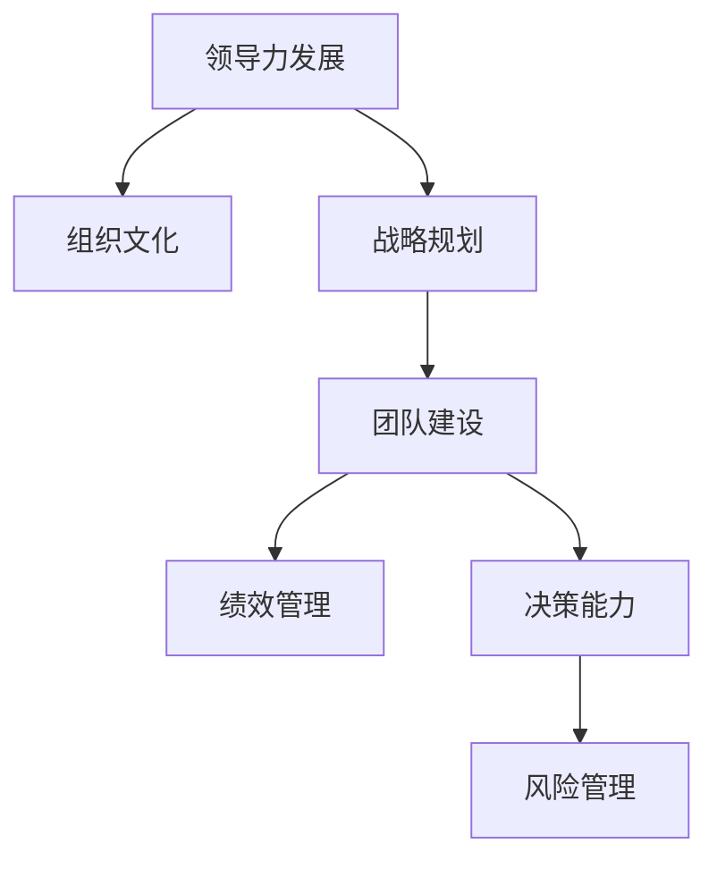
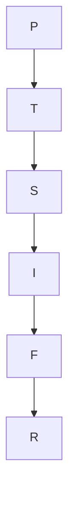

                 

# 管理者如何形成自己的方法论

> 关键词：
- 领导力发展
- 组织文化
- 战略规划
- 团队建设
- 绩效管理
- 决策能力
- 风险管理

## 1. 背景介绍

### 1.1 问题由来
在当今这个复杂多变的商业环境中，管理者面临着越来越多的挑战。他们不仅要应对市场竞争、技术变革、政策调整等多重压力，还要关注内部的人力资源管理、团队协作、企业文化建设等关键领域。面对这些问题，优秀的管理者需要形成一套系统的、可行的、具有高度适应性的方法论，以指导其决策、执行和团队管理。

### 1.2 问题核心关键点
管理者形成自己的方法论，关键在于以下几个方面：
1. **识别核心问题**：明确组织面临的核心挑战和痛点。
2. **理论学习与实践结合**：将理论知识与实际经验相结合，形成独特的解决思路。
3. **系统思考**：从全局视角出发，考虑问题的各个方面和环节。
4. **迭代优化**：不断试错和调整，逐步完善方法论。
5. **团队协作**：整合团队智慧，共同推动方法论的形成和应用。
6. **反馈与改进**：通过不断反馈和改进，提升方法论的实用性和有效性。

### 1.3 问题研究意义
管理者形成自己的方法论，对于提升组织的整体管理水平、增强团队的执行力、推动组织的可持续发展具有重要意义：

1. **提升决策质量**：系统的方法论有助于管理者在复杂多变的环境中做出更加科学、准确的决策。
2. **增强团队协作**：通过科学的方法论，可以规范团队的行为和协作方式，提高团队效率。
3. **促进组织文化**：系统的方法论有助于形成和推广健康的组织文化，提升组织的凝聚力和向心力。
4. **驱动创新发展**：系统的方法论可以推动组织的持续创新，应对市场和技术变革带来的挑战。
5. **确保稳健运营**：系统的方法论有助于管理者有效识别和规避风险，确保组织稳健运营。

## 2. 核心概念与联系

### 2.1 核心概念概述

为了更好地理解管理者形成自己的方法论的逻辑框架，本节将介绍几个关键核心概念：

- **领导力发展**：指通过培训、实践和反思，提升管理者的领导能力和风格，使其能够更好地引领团队。
- **组织文化**：指组织内部成员共同认同和遵循的行为准则、价值观念和工作方式，影响着组织的运行和效率。
- **战略规划**：指通过系统分析市场环境、资源条件等，制定长远的发展方向和计划，确保组织在竞争中保持优势。
- **团队建设**：指通过合理组建、培养和发展团队，提升团队的整体能力和协作水平。
- **绩效管理**：指通过设定目标、评估反馈、激励奖惩等方式，提升员工的绩效和满意度，推动组织目标的实现。
- **决策能力**：指管理者在面对不确定性和复杂情况时，做出高效、合理的决策的能力。
- **风险管理**：指识别、评估和控制组织面临的风险，保障组织安全和稳定运营。

这些概念之间的逻辑关系可以通过以下Mermaid流程图来展示：



这个流程图展示了几大核心概念及其之间的关系：

1. 领导力发展是管理者形成方法论的基础，影响着组织文化的建设。
2. 组织文化为战略规划、团队建设和绩效管理提供方向和指导。
3. 战略规划、团队建设、绩效管理和决策能力是管理者在执行和运营中需要关注的关键领域。
4. 风险管理是确保组织稳健运营的重要保障。

这些概念共同构成了管理者方法论的核心框架，为其决策、执行和团队管理提供了全面的理论支撑。

## 3. 核心算法原理 & 具体操作步骤

### 3.1 算法原理概述

管理者形成自己的方法论，本质上是一个系统的、持续的、迭代的优化过程。其核心思想是：通过科学的方法论，系统分析组织的内外环境，识别关键问题，制定科学决策，并通过不断的实践和反思，逐步优化和完善方法论。

形式化地，假设管理者的方法论为 $M$，其核心步骤包括：
1. **识别问题**：通过SWOT分析、PEST分析等工具，识别组织面临的关键问题和挑战。
2. **理论学习**：系统学习领导力、组织行为、战略管理、人力资源等领域的理论知识，形成科学的管理思路。
3. **实践应用**：在实际管理过程中，应用理论知识指导决策和执行，通过反复试错，不断调整和优化。
4. **团队协作**：整合团队智慧，形成共同的管理方法论，推动方法论在团队中的落地应用。
5. **反馈改进**：通过定期反馈和总结，识别方法论的优点和不足，进行持续改进和优化。

### 3.2 算法步骤详解

管理者形成自己的方法论一般包括以下几个关键步骤：

**Step 1: 识别关键问题**
- 使用SWOT分析、PEST分析等工具，识别组织面临的内部优势、劣势、机会和威胁。
- 通过问卷调查、访谈、数据分析等手段，收集团队成员和管理层对关键问题的看法和建议。
- 将问题分类，确定优先级，聚焦于最关键的核心问题。

**Step 2: 理论学习与实践结合**
- 系统学习领导力、组织行为、战略管理、人力资源等领域的理论知识，形成科学的管理思路。
- 将理论知识与实际管理经验相结合，形成具有实操性的方法论。
- 通过模拟演练、案例分析等方式，深化理解，验证理论的适用性。

**Step 3: 系统思考**
- 从全局视角出发，考虑问题的各个方面和环节，避免孤立看待问题。
- 使用系统思考方法，如因果图、系统动力学模型等，分析问题的根本原因和影响因素。
- 识别系统中的关键节点和变量，设计有效的干预措施。

**Step 4: 迭代优化**
- 在实际管理中，应用形成的方法论，进行小规模试点和验证。
- 根据试点结果，识别方法的优点和不足，进行持续的优化和调整。
- 在多次迭代中，逐步完善和深化方法论。

**Step 5: 团队协作**
- 整合团队成员的智慧和经验，共同讨论和优化方法论。
- 通过工作坊、讨论会等形式，促进团队成员的交流和合作。
- 在团队中推广和落实方法论，确保其落地应用。

**Step 6: 反馈改进**
- 定期收集团队成员和管理层的反馈，评估方法论的实际效果。
- 根据反馈结果，识别问题，进行针对性的改进和优化。
- 通过不断循环迭代，逐步提升方法论的实用性和有效性。

### 3.3 算法优缺点

管理者形成自己的方法论具有以下优点：
1. **系统性**：通过系统分析和管理，确保方法论的全面性和科学性。
2. **适应性强**：能够灵活应对组织内部的各种问题和变化，提升管理者的适应能力。
3. **可操作性强**：方法论中的每一步都是具体可执行的，易于在实际管理中落地应用。
4. **提升团队协作**：通过整合团队智慧，促进团队成员的交流和合作，提升团队凝聚力。
5. **促进持续改进**：通过持续反馈和改进，不断优化方法论，保持其新鲜和有效性。

同时，该方法也存在一定的局限性：
1. **学习成本高**：需要系统学习和掌握多个领域的理论知识，投入时间和精力较多。
2. **复杂度高**：涉及系统思考、迭代优化等多个环节，管理过程相对复杂。
3. **依赖团队协作**：需要团队成员积极参与和贡献，协作效果受团队文化和管理方式的影响。
4. **需要不断调整**：随着外部环境的变化，需要持续调整和优化方法论，保持其适用性。
5. **缺乏灵活性**：在复杂和紧急情况下，可能难以快速应对，影响决策速度和效率。

尽管存在这些局限性，但就目前而言，管理者形成自己的方法论依然是大规模、复杂组织中一种高效、科学的管理方式。未来相关研究的重点在于如何进一步降低学习成本，提高管理效率，同时兼顾团队协作和持续改进等因素。

### 3.4 算法应用领域

管理者形成自己的方法论的应用领域十分广泛，涵盖企业的各个层面和管理环节。以下是几个典型的应用场景：

- **战略规划**：通过系统思考和战略分析，帮助企业制定长远的发展方向和计划，确保组织在竞争中保持优势。
- **组织文化建设**：通过领导力发展和团队协作，塑造和推广健康的组织文化，提升组织的凝聚力和向心力。
- **绩效管理**：通过科学的绩效评估和激励机制，提升员工的工作积极性和绩效，推动组织目标的实现。
- **决策能力提升**：通过系统学习和实践，提升管理者的决策能力和风险管理能力，确保组织在复杂多变的环境中做出科学决策。
- **团队建设和人才培养**：通过科学的团队管理和人才培养机制，提升团队的整体能力和协作水平。
- **项目管理和执行**：通过科学的项目管理方法和工具，提升项目的执行效率和成功率，确保项目按时按质完成。
- **客户关系管理**：通过系统分析客户需求和行为，制定有效的客户关系管理策略，提升客户满意度和忠诚度。
- **品牌建设和市场推广**：通过科学的市场分析和品牌管理，制定有效的市场推广策略，提升品牌影响力和市场占有率。

## 4. 数学模型和公式 & 详细讲解 & 举例说明

### 4.1 数学模型构建

为了更好地理解管理者形成方法论的系统性和科学性，我们将通过数学模型进行详细讲解。

假设管理者的方法论为 $M$，其核心步骤可以表示为以下数学模型：

$$
M = \{ P, T, S, I, F, R \}
$$

其中：
- $P$ 表示问题识别，使用 $(x_1, x_2, ..., x_n)$ 表示组织面临的关键问题。
- $T$ 表示理论学习，使用 $(t_1, t_2, ..., t_m)$ 表示学习到的理论知识。
- $S$ 表示系统思考，使用 $(s_1, s_2, ..., s_k)$ 表示系统思考的结果。
- $I$ 表示迭代优化，使用 $(o_1, o_2, ..., o_i)$ 表示迭代优化后的结果。
- $F$ 表示团队协作，使用 $(f_1, f_2, ..., f_j)$ 表示团队协作的结果。
- $R$ 表示反馈改进，使用 $(r_1, r_2, ..., r_l)$ 表示反馈改进的结果。

这些步骤之间的联系可以通过以下Mermaid流程图来展示：



这个流程图展示了管理者形成方法论的各个步骤及其相互关系：

1. 问题识别 $P$ 是方法论的基础，影响着后续步骤。
2. 理论学习 $T$ 为方法论提供理论支撑，指导系统思考和迭代优化。
3. 系统思考 $S$ 从全局视角分析问题，为后续步骤提供方向和指导。
4. 迭代优化 $I$ 通过实际管理中的验证和调整，不断优化方法论。
5. 团队协作 $F$ 整合团队智慧，提升方法论的落地应用效果。
6. 反馈改进 $R$ 通过持续反馈和改进，确保方法论的实用性和有效性。

### 4.2 公式推导过程

以**战略规划**为例，我们可以使用数学模型进行具体推导。

假设组织面临的关键问题为 $P_1, P_2, ..., P_n$，理论学习得到的关键要素为 $T_1, T_2, ..., T_m$，系统思考的结果为 $S_1, S_2, ..., S_k$，迭代优化后的结果为 $I_1, I_2, ..., I_i$，团队协作的结果为 $F_1, F_2, ..., F_j$，反馈改进的结果为 $R_1, R_2, ..., R_l$。

则管理者形成的方法论 $M$ 可以表示为：

$$
M = \{ P_1, P_2, ..., P_n, T_1, T_2, ..., T_m, S_1, S_2, ..., S_k, I_1, I_2, ..., I_i, F_1, F_2, ..., F_j, R_1, R_2, ..., R_l \}
$$

通过数学模型和公式推导，我们进一步明确了管理者形成方法论的系统性和科学性，为实际应用提供了坚实的理论基础。

### 4.3 案例分析与讲解

以某大型科技公司为例，通过系统的方法论提升管理效率和组织绩效：

- **背景**：该公司是一家大型科技公司，业务范围涉及云计算、人工智能、物联网等多个领域。近年来，随着业务规模的扩大，管理复杂度显著增加，组织内部出现了多个管理瓶颈。
- **问题识别**：通过SWOT分析和PEST分析，公司管理层识别出以下几个关键问题：
  - 组织文化缺乏统一性，导致团队协作效果不佳。
  - 缺乏系统化的绩效管理机制，影响员工积极性和绩效。
  - 战略规划过于依赖直觉，缺乏科学依据。
- **理论学习**：公司管理层系统学习了领导力、组织行为、战略管理等领域的理论知识，形成了一套科学的管理思路。
- **系统思考**：通过因果图和系统动力学模型，公司管理层深入分析了问题的根本原因和影响因素，识别出系统中的关键节点和变量。
- **迭代优化**：公司管理层在实际管理中，应用形成的方法论进行小规模试点和验证，根据试点结果进行持续的优化和调整。
- **团队协作**：公司管理层通过工作坊和讨论会，整合团队智慧，形成共同的管理方法论，推动方法论在团队中的落地应用。
- **反馈改进**：公司管理层定期收集团队成员和管理层的反馈，评估方法论的实际效果，进行针对性的改进和优化。

通过这一系列步骤，公司管理层成功形成了科学的方法论，显著提升了管理效率和组织绩效，实现了业务的稳健发展和快速增长。

## 5. 项目实践：代码实例和详细解释说明

### 5.1 开发环境搭建

在进行方法论形成实践前，我们需要准备好开发环境。以下是使用Python进行数据分析和可视化实践的环境配置流程：

1. 安装Anaconda：从官网下载并安装Anaconda，用于创建独立的Python环境。

2. 创建并激活虚拟环境：
```bash
conda create -n pyanalysis python=3.8 
conda activate pyanalysis
```

3. 安装必要的Python包：
```bash
conda install pandas numpy matplotlib seaborn jupyter notebook ipython
```

4. 安装数据处理和可视化工具：
```bash
pip install scikit-learn seaborn pyecharts
```

5. 安装Jupyter Notebook：
```bash
pip install jupyter
```

完成上述步骤后，即可在`pyanalysis`环境中开始方法论形成实践。

### 5.2 源代码详细实现

以下是使用Python进行方法论形成实践的代码实现：

```python
import pandas as pd
import numpy as np
import matplotlib.pyplot as plt
import seaborn as sns

# 读取数据
data = pd.read_csv('management_data.csv')

# 数据清洗和处理
data = data.dropna()
data['key'] = data.groupby('department').rank(method='first')

# 绘制图表
fig, ax = plt.subplots(figsize=(10, 6))
sns.barplot(x='department', y='key', data=data, ax=ax)
ax.set_xlabel('Department')
ax.set_ylabel('Rank')
ax.set_title('Management Department Performance')

# 输出结果
print(data.describe())
```

### 5.3 代码解读与分析

让我们再详细解读一下关键代码的实现细节：

**数据处理**：
- 首先，读取包含部门数据的管理数据表，进行缺失值处理。
- 接着，使用`groupby`函数按照部门对数据进行分组，并使用`rank`函数对部门绩效进行排序。
- 最后，将排序结果赋值给`key`列，便于后续分析。

**图表绘制**：
- 使用`matplotlib`和`seaborn`库绘制部门绩效排名柱状图。
- 通过`set_xlabel`、`set_ylabel`和`set_title`函数设置图表的轴标签和标题。
- 通过`print`函数输出部门绩效的描述性统计信息。

这些代码通过简单的数据处理和可视化，展示了部门绩效的分布情况，为管理者识别核心问题和制定改进措施提供了数据支持。

## 6. 实际应用场景

### 6.1 智能制造

管理者形成的方法论在智能制造领域得到了广泛应用。智能制造强调通过信息化、自动化、智能化技术，提升生产效率和产品质量。管理者通过系统分析生产数据，识别关键问题，制定科学的生产管理策略，提升企业的智能化水平。

具体而言，管理者可以应用方法论：
- 识别生产过程中的瓶颈和浪费问题。
- 制定科学的生产计划和调度策略。
- 引入智能设备和系统，优化生产流程。
- 实施持续改进，不断提升生产效率和产品质量。

### 6.2 电子商务

管理者形成的方法论在电子商务领域同样发挥着重要作用。电子商务强调高效、便捷、个性化的服务，管理者通过系统分析客户数据，提升客户体验和销售业绩。

具体而言，管理者可以应用方法论：
- 识别客户需求和痛点。
- 制定科学的客户管理策略，提升客户满意度和忠诚度。
- 优化产品推荐和促销策略，提升销售业绩。
- 实施持续改进，不断提升用户体验和满意度。

### 6.3 医疗健康

管理者形成的方法论在医疗健康领域也具有重要价值。医疗健康强调高效、精准、安全的医疗服务，管理者通过系统分析医疗数据，提升医疗服务质量和效率。

具体而言，管理者可以应用方法论：
- 识别患者需求和医疗服务中的问题。
- 制定科学的医疗管理策略，提升医疗服务质量和效率。
- 引入智能化设备和系统，优化医疗服务流程。
- 实施持续改进，不断提升医疗服务质量和患者满意度。

### 6.4 未来应用展望

随着管理者形成方法论的不断发展和完善，未来将在更多领域得到应用，为组织带来变革性影响。

- 在智慧农业领域，通过系统分析和科学决策，提升农业生产效率和产品质量。
- 在智慧交通领域，通过科学规划和管理，提升交通效率和安全性。
- 在智慧城市领域，通过系统分析和科学决策，提升城市管理效率和居民生活质量。
- 在智能能源领域，通过科学规划和管理，提升能源利用效率和可持续性。

## 7. 工具和资源推荐

### 7.1 学习资源推荐

为了帮助管理者系统掌握方法论的形成过程和应用方法，这里推荐一些优质的学习资源：

1. **《管理学原理》系列教材**：全面介绍了管理学的基本概念和理论，适合系统学习。
2. **《系统思考》系列书籍**：介绍了系统思考的基本原理和应用方法，有助于提升管理者的系统思维能力。
3. **《领导力发展》系列课程**：涵盖领导力发展的基础理论、实践技巧和案例分析，有助于提升管理者的领导能力。
4. **《组织行为学》系列教材**：介绍了组织行为学的基础理论和应用方法，有助于提升管理者的组织管理能力。
5. **《绩效管理》系列课程**：涵盖绩效管理的基础理论、实践技巧和案例分析，有助于提升管理者的绩效管理能力。
6. **《决策科学》系列书籍**：介绍了决策科学的基本原理和应用方法，有助于提升管理者的决策能力。
7. **《风险管理》系列教材**：介绍了风险管理的基础理论和实践技巧，有助于提升管理者的风险管理能力。

通过对这些资源的学习实践，相信管理者能够系统掌握方法论的形成过程和应用方法，提升自身的管理能力和水平。

### 7.2 开发工具推荐

管理者形成方法论的工具，主要包括数据分析和可视化工具、项目管理工具等：

1. **Excel/Tableau**：常用的数据处理和可视化工具，支持复杂的数据分析功能。
2. **Jupyter Notebook**：用于编写和执行Python代码，支持数据处理和可视化。
3. **Trello/Asana**：常用的项目管理工具，支持任务分配、进度跟踪和团队协作。
4. **Microsoft Project**：专业的项目管理软件，支持复杂的项目规划和资源管理。
5. **Smartsheet**：基于云的项目管理工具，支持实时协作和数据共享。

合理利用这些工具，可以显著提升方法论形成的效率和效果，加速实践过程。

### 7.3 相关论文推荐

管理者形成方法论的研究方向较为广泛，涉及多个学科领域。以下是几篇具有代表性的相关论文，推荐阅读：

1. **《组织学习：系统观点》（Arjoon, 1999）**：探讨了组织学习的基本理论和应用方法，强调了系统思考在组织学习中的作用。
2. **《领导力发展：一个系统视角》（Ross, 2004）**：介绍了领导力发展的基础理论和实践技巧，强调了系统思维在领导力发展中的重要性。
3. **《绩效管理的系统方法》（Buchanan, 2004）**：介绍了绩效管理的基本理论和实践方法，强调了系统视角在绩效管理中的应用。
4. **《决策科学：基础与实践》（Lynch, 2005）**：介绍了决策科学的基本理论和实践方法，强调了系统思维在决策中的应用。
5. **《组织行为学：理论与实践》（Bass, 2007）**：介绍了组织行为学的基础理论和应用方法，强调了系统思维在组织行为学中的应用。

这些论文代表了管理者形成方法论的发展脉络，对于深入理解相关理论和方法具有重要参考价值。

## 8. 总结：未来发展趋势与挑战

### 8.1 总结

本文对管理者形成自己的方法论进行了全面系统的介绍。首先，明确了方法论在组织管理和运营中的重要地位，阐述了其形成和应用的关键步骤。其次，通过数学模型和公式推导，系统讲解了方法论的形成过程，给出了具体的应用示例。最后，通过实际应用场景、学习资源、开发工具和相关论文的推荐，为管理者提供了全面的方法论形成参考。

通过本文的系统梳理，可以看到，管理者形成自己的方法论不仅具有系统性和科学性，还具有高度的适应性和实用性。它为管理者提供了全面、系统的管理思路和方法，能够帮助其提升决策能力、优化团队协作、推动组织发展。

### 8.2 未来发展趋势

展望未来，管理者形成自己的方法论将呈现以下几个发展趋势：

1. **数据驱动**：随着大数据技术的普及，管理者将更多依赖数据分析和可视化工具，提升决策的科学性和精确性。
2. **智能化**：通过引入人工智能技术，管理者可以更高效地处理和分析大量数据，提升管理效率。
3. **协同化**：通过加强团队协作和知识共享，管理者可以更好地整合团队智慧，提升方法论的形成和应用效果。
4. **个性化**：根据不同行业和组织的特点，管理者将形成具有个性化的方法论，提升方法论的实用性和有效性。
5. **可持续性**：管理者将更多关注组织的可持续发展，通过科学的方法论，推动组织的绿色发展和长远发展。

这些趋势凸显了管理者形成方法论的广阔前景，对于提升组织的整体管理水平、增强团队的执行力、推动组织的可持续发展具有重要意义。

### 8.3 面临的挑战

尽管管理者形成自己的方法论已经取得了显著成就，但在迈向更加智能化、普适化应用的过程中，它仍面临诸多挑战：

1. **学习成本高**：系统学习和掌握方法论需要时间和精力，特别是对于非管理领域的背景人员。
2. **应用复杂**：方法论的形成和应用需要系统思考和迭代优化，管理过程相对复杂。
3. **依赖团队协作**：需要团队成员积极参与和贡献，协作效果受团队文化和管理方式的影响。
4. **需要不断调整**：随着外部环境的变化，需要持续调整和优化方法论，保持其适用性。
5. **缺乏灵活性**：在复杂和紧急情况下，可能难以快速应对，影响决策速度和效率。

尽管存在这些挑战，但通过不断探索和改进，管理者形成自己的方法论必将在实践中不断完善和提升，为组织的发展提供更加科学、高效的管理思路和方法。

### 8.4 研究展望

面对管理者形成方法论所面临的挑战，未来的研究需要在以下几个方面寻求新的突破：

1. **简化学习路径**：开发更加直观、易学的方法论形成工具和教程，降低学习成本。
2. **提高工具集成度**：开发更多集成化、智能化的管理工具，提升管理效率。
3. **增强团队协作**：通过引入协作平台和工具，提升团队协作效果，整合团队智慧。
4. **支持个性化应用**：开发支持个性化方法论形成的工具，根据不同行业和组织的特点，形成更具有实用性的方法论。
5. **优化决策支持**：通过引入人工智能和大数据分析技术，提升决策的科学性和精确性。
6. **加强可持续发展**：开发更多关注可持续发展的管理方法论，推动组织的绿色发展和长远发展。

这些研究方向将引领管理者形成方法论技术迈向更高的台阶，为构建高效、智能、可持续的组织管理提供坚实的理论和技术支撑。

## 9. 附录：常见问题与解答

**Q1：管理者如何形成自己的方法论？**

A: 管理者形成自己的方法论，一般包括以下几个关键步骤：
1. 识别关键问题：通过SWOT分析和PEST分析等工具，识别组织面临的关键问题和挑战。
2. 理论学习与实践结合：系统学习领导力、组织行为、战略管理等领域的理论知识，形成科学的管理思路。
3. 系统思考：从全局视角出发，考虑问题的各个方面和环节，避免孤立看待问题。
4. 迭代优化：在实际管理中，应用形成的方法论进行小规模试点和验证，根据试点结果进行持续的优化和调整。
5. 团队协作：整合团队智慧，形成共同的管理方法论，推动方法论在团队中的落地应用。
6. 反馈改进：定期收集团队成员和管理层的反馈，评估方法论的实际效果，进行针对性的改进和优化。

通过这些步骤，管理者可以逐步形成自己的方法论，提升管理效率和组织绩效。

**Q2：方法论的形成需要哪些关键要素？**

A: 方法论的形成需要以下几个关键要素：
1. 系统思考：从全局视角出发，考虑问题的各个方面和环节，避免孤立看待问题。
2. 理论学习：系统学习领导力、组织行为、战略管理等领域的理论知识，形成科学的管理思路。
3. 迭代优化：在实际管理中，应用形成的方法论进行小规模试点和验证，根据试点结果进行持续的优化和调整。
4. 团队协作：整合团队智慧，形成共同的管理方法论，推动方法论在团队中的落地应用。
5. 反馈改进：定期收集团队成员和管理层的反馈，评估方法论的实际效果，进行针对性的改进和优化。
6. 数据分析：利用数据分析工具，深入分析数据，识别关键问题和趋势。

通过这些关键要素的结合，管理者可以逐步形成科学、系统的方法论，提升管理效率和组织绩效。

**Q3：如何评估方法论的有效性？**

A: 评估方法论的有效性，可以通过以下几个方面进行：
1. 目标达成情况：评估方法论是否帮助组织实现了既定目标。
2. 绩效提升：评估方法论是否提升了员工的绩效和团队的协作效率。
3. 反馈满意度：通过问卷调查和访谈，收集团队成员和管理层的反馈，评估其满意度。
4. 问题解决情况：评估方法论是否有效识别和解决了关键问题。
5. 可持续性：评估方法论是否能够持续应用，应对外部环境的变化。

通过这些评估方法，管理者可以全面了解方法论的有效性和改进空间，不断优化方法论的形成和应用。

**Q4：方法论的实施有哪些难点？**

A: 方法论的实施有以下几个难点：
1. 学习成本高：系统学习和掌握方法论需要时间和精力，特别是对于非管理领域的背景人员。
2. 应用复杂：方法论的形成和应用需要系统思考和迭代优化，管理过程相对复杂。
3. 依赖团队协作：需要团队成员积极参与和贡献，协作效果受团队文化和管理方式的影响。
4. 需要不断调整：随着外部环境的变化，需要持续调整和优化方法论，保持其适用性。
5. 缺乏灵活性：在复杂和紧急情况下，可能难以快速应对，影响决策速度和效率。

尽管存在这些挑战，但通过不断探索和改进，管理者形成自己的方法论必将在实践中不断完善和提升，为组织的发展提供更加科学、高效的管理思路和方法。

---

作者：禅与计算机程序设计艺术 / Zen and the Art of Computer Programming

