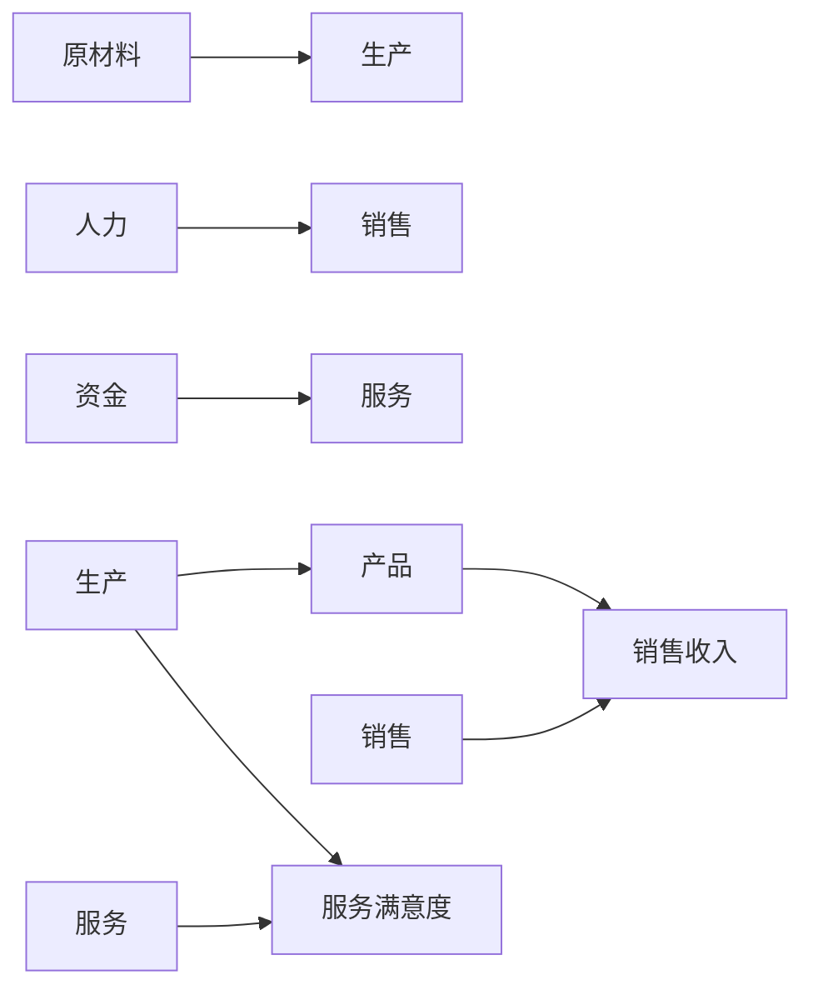
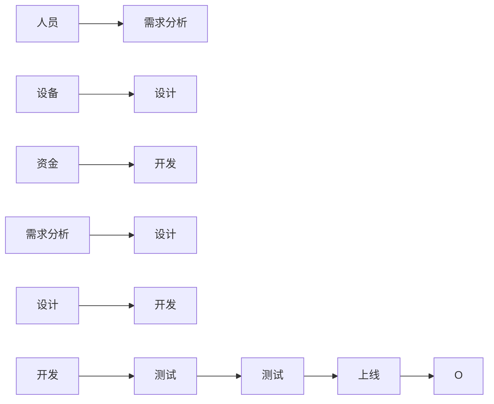
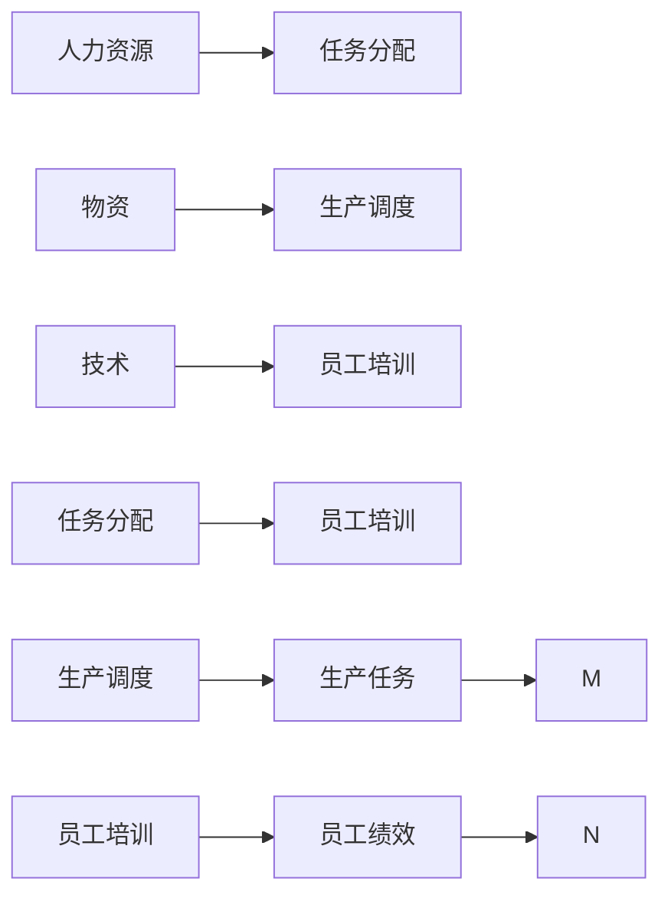
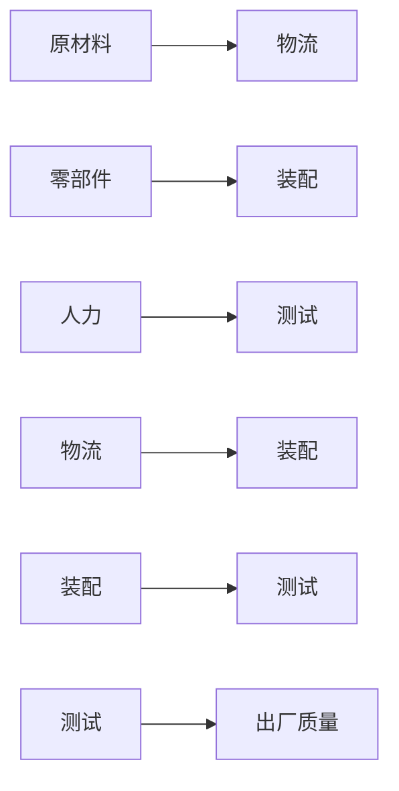
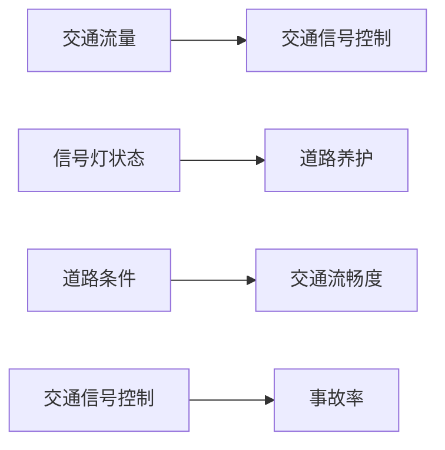

                 

## 1. 背景介绍

管理一直是人类社会的重要活动，从古代的君主、将领到现代的CEO、CTO，无不面临如何组织资源、协调人际、应对变数等挑战。进入信息时代，技术的进步为管理工作带来了新的方法和思路。

首先，信息技术使信息的收集、处理、共享变得更为便捷。大数据、云计算、AI等技术使得管理者能够以前所未有的速度和精度进行决策，极大地提高了管理工作的效率和效果。

其次，系统性思维在系统工程和软件工程中得到了广泛应用。系统性思维强调从整体出发，以系统的视角分析问题，理解各部分间相互依赖和互动的关系，从而制定出全局最优的解决方案。

在管理领域，系统性思维方法也开始受到重视。现代管理者若能掌握系统性思考的能力，将能够更好地处理复杂多变的问题，提升组织的适应性和创新力。本文旨在介绍系统性思考的核心概念、工作原理、操作步骤，并通过实际案例展示系统性思考在管理中的运用。

## 2. 核心概念与联系

### 2.1 核心概念概述

系统性思维是一种运用系统方法分析和处理问题的思维方式。系统性思维关注整体与部分的相互作用，强调不同要素间的多维关联与动态交互，以实现整体最优的管理决策。

本节将介绍几个与系统性思考密切相关的核心概念：

- **整体性**：系统性思考强调从整体出发，理解各部分之间的关系和作用。管理者需要全局视角，避免被局部细节所迷惑。

- **交互性**：系统内各部分之间相互依赖和影响。系统性思考关注各部分间的动态交互和反馈机制。

- **因果性**：系统行为通常受多种因素影响，需要识别关键因素及其相互关系，理解因果链条。

- **不确定性**：系统行为具有不确定性，系统性思考应对不确定性进行合理估计和应对。

- **复杂性**：系统通常包含多个层次，需要层次化思考和分而治之的方法。

- **适应性**：系统性思考强调系统具有自我适应、自我调整的能力，管理者需关注系统的动态调整和优化。

### 2.2 核心概念原理和架构的 Mermaid 流程图


这个流程图展示了系统性思考中各概念间的联系和相互作用。整体性是起点，通过交互性理解各部分间的关系，利用因果性识别关键因素，应对不确定性和复杂性，最终实现系统的适应性调整。

## 3. 核心算法原理 & 具体操作步骤

### 3.1 算法原理概述

系统性思考的本质是一种系统化的方法论，其核心在于理解和处理系统内各部分间的相互作用和影响。系统性思考的一般步骤如下：

1. **定义系统边界**：明确系统的范围和对象，确定系统内各组成部分。

2. **建立系统模型**：根据系统的性质和特点，构建数学模型或流程图，表示系统各部分间的相互关系和行为。

3. **识别关键因素**：分析系统内关键因素，识别因果链条，理解因素间的相互作用。

4. **建立反馈机制**：确定系统内各部分间的反馈关系，建立模型预测和调整机制。

5. **优化系统结构**：根据模型预测结果，调整系统结构和参数，提高系统适应性和稳定性。

6. **应对不确定性**：对系统行为进行不确定性分析，制定应对策略，提高系统的鲁棒性和可靠性。

### 3.2 算法步骤详解

1. **定义系统边界**：
   - 明确系统范围：如公司、项目、部门等。
   - 识别系统组成部分：如员工、资源、流程等。

2. **建立系统模型**：
   - 选择适当的模型，如因果图、流图、层次图等。
   - 构建系统的数学模型或流程图，表示各部分间的相互作用。

3. **识别关键因素**：
   - 分析系统内关键因素：如人力、物资、技术等。
   - 识别因果链条：如生产流程中的投入产出关系。

4. **建立反馈机制**：
   - 确定系统内各部分间的反馈关系：如质量控制反馈、绩效评估反馈等。
   - 建立模型预测和调整机制：如预测偏差、调整策略。

5. **优化系统结构**：
   - 根据模型预测结果：如资源分配优化、流程改进等。
   - 调整系统结构和参数：如组织架构调整、流程优化等。

6. **应对不确定性**：
   - 进行不确定性分析：如风险评估、敏感性分析等。
   - 制定应对策略：如建立应急预案、进行资源备份等。

### 3.3 算法优缺点

系统性思考的优势：

1. **全局视角**：系统性思考从整体出发，避免被局部细节所迷惑，能够全局考虑问题，制定出最优决策。
2. **多维关联**：系统性思考考虑各部分间的相互作用，理解多维关联，能够处理复杂的系统问题。
3. **动态调整**：系统性思考关注系统动态调整和优化，能够应对变数和风险。

系统性思考的缺点：

1. **复杂度高**：系统性思考需要建立复杂的模型和流程，可能面临高成本和技术难度。
2. **不确定性**：系统行为具有不确定性，系统性思考需处理不确定性，可能面临预测误差。
3. **需要专业技能**：系统性思考需具备数学、工程等专业知识，普通管理者可能难以掌握。

### 3.4 算法应用领域

系统性思考在管理领域得到了广泛应用，特别是在以下方面：

- **项目管理和流程优化**：通过系统模型分析项目各环节间的相互作用，优化流程，提高效率。
- **组织架构和资源配置**：识别组织内关键因素，优化资源配置，提升组织竞争力。
- **风险管理和应急响应**：分析系统内风险因素，建立应急预案，提高系统鲁棒性。
- **市场营销和客户关系管理**：理解市场变化和客户行为，优化营销策略，提升客户满意度。

## 4. 数学模型和公式 & 详细讲解

### 4.1 数学模型构建

系统性思考的数学模型通常采用因果图、流图、层次图等形式。本节以因果图为例，介绍系统性思考的数学模型构建。

**因果图**：表示系统内各部分间的因果关系，通过箭头表示因果链条。

假设系统包含以下组成部分：

- 输入：原材料、人力、资金等。
- 中间变量：生产、销售、服务等。
- 输出：产品、销售收入、服务满意度等。

系统因果图可表示为：



该因果图展示了系统内各部分间的因果关系。原材料和人力直接影响生产，生产直接影响产品和销售，产品和服务直接影响收入和满意度。

### 4.2 公式推导过程

系统性思考的数学模型通常包含以下公式：

1. **状态方程**：描述系统各部分的状态变化。

2. **输入方程**：描述系统各部分的输入参数。

3. **输出方程**：描述系统各部分的输出结果。

以因果图为例，可以建立如下状态方程：

$$
\begin{aligned}
& \dot{x}_i = f_i(x_i, u_i, p_i) \\
& \dot{x}_i \in \mathbb{R}^n
\end{aligned}
$$

其中 $x_i$ 表示系统各部分的当前状态， $f_i$ 表示状态方程， $u_i$ 表示系统各部分的输入参数， $p_i$ 表示系统各部分间的关系参数。

例如，对于生产环节，可以建立如下状态方程：

$$
\dot{x} = f(x, u, p) = A x + B u + C p
$$

其中 $x$ 表示生产量， $u$ 表示原材料投入量， $p$ 表示生产线的性能参数。

### 4.3 案例分析与讲解

假设某公司要进行项目优化，首先需要定义系统边界，确定项目涉及的关键因素。

**案例1：项目进度管理**

公司项目包含以下组成部分：

- 输入：人员、设备、资金等。
- 中间变量：需求分析、设计、开发、测试、上线等。
- 输出：项目按时完成、客户满意度等。

系统因果图可表示为：



通过分析系统内关键因素和因果链条，可以发现：

1. **需求分析**：直接影响设计阶段，应保证需求明确，避免设计返工。
2. **设计**：直接影响开发阶段，应保证设计规范，避免开发难度。
3. **开发**：直接影响测试阶段，应保证代码质量，避免测试缺陷。
4. **测试**：直接影响上线阶段，应保证测试充分，避免上线问题。
5. **上线**：直接影响客户满意度，应保证上线稳定，避免故障。

通过建立系统模型和识别关键因素，可以优化项目流程，提高项目进度管理的效率和效果。

**案例2：资源配置优化**

公司管理某大部门，包含以下组成部分：

- 输入：人力资源、物资、技术等。
- 中间变量：任务分配、员工培训、生产调度等。
- 输出：部门绩效、员工满意度等。

系统因果图可表示为：



通过分析系统内关键因素和因果链条，可以发现：

1. **任务分配**：直接影响员工培训和工作负荷，应合理分配任务。
2. **员工培训**：直接影响员工绩效和生产效率，应定期培训。
3. **生产调度**：直接影响生产任务和资源利用率，应合理调度。
4. **员工绩效**：直接影响部门绩效和员工满意度，应进行绩效评估。
5. **员工满意度**：直接影响团队稳定性和工作氛围，应关注员工福利。

通过建立系统模型和识别关键因素，可以优化资源配置，提升部门绩效和员工满意度。

## 5. 项目实践：代码实例和详细解释说明

### 5.1 开发环境搭建

要进行系统性思考的实践，需要搭建相应的开发环境。以下是基于Python的开发环境搭建流程：

1. **安装Python和Pip**：
   - 从官网下载Python安装程序，进行安装。
   - 安装Pip：
     ```bash
     python -m ensurepip --upgrade
     ```

2. **安装必要的库**：
   - 安装系统建模库，如Causal Inference、pydot等。
     ```bash
     pip install causal-inference pydot
     ```
   - 安装数据分析库，如pandas、numpy等。
     ```bash
     pip install pandas numpy
     ```
   - 安装可视化库，如matplotlib、seaborn等。
     ```bash
     pip install matplotlib seaborn
     ```

### 5.2 源代码详细实现

下面以项目进度管理为例，展示如何使用Python进行系统建模和分析。

**代码1：定义系统因果图**

```python
import pydot
import numpy as np

# 定义系统因果图
graph = pydot.Dot()

# 添加节点
graph.add_node(pydot.Node("需求分析", shape="ellipse", label="需求分析", style="filled", fillcolor="lightblue"))
graph.add_node(pydot.Node("设计", shape="ellipse", label="设计", style="filled", fillcolor="lightgreen"))
graph.add_node(pydot.Node("开发", shape="ellipse", label="开发", style="filled", fillcolor="lightyellow"))
graph.add_node(pydot.Node("测试", shape="ellipse", label="测试", style="filled", fillcolor="lightpink"))
graph.add_node(pydot.Node("上线", shape="ellipse", label="上线", style="filled", fillcolor="lightgray"))

# 添加箭头
graph.add_edge(pydot.Edge(pydot.Node("需求分析"), pydot.Node("设计")))
graph.add_edge(pydot.Edge(pydot.Node("设计"), pydot.Node("开发")))
graph.add_edge(pydot.Edge(pydot.Node("开发"), pydot.Node("测试")))
graph.add_edge(pydot.Edge(pydot.Node("测试"), pydot.Node("上线")))

# 显示因果图
graph.write_png("causal_graph.png")
```

**代码2：建立系统模型**

```python
import numpy as np
from scipy.integrate import odeint

# 定义状态方程
def state_equation(y, t, a):
    return np.dot(A, y) + np.dot(B, a) + np.dot(C, p)

# 初始状态
y0 = np.array([0, 0, 0, 0, 0])

# 参数
A = np.array([[0, 1, 0, 0, 0],
              [0, 0, 1, 0, 0],
              [0, 0, 0, 1, 0],
              [0, 0, 0, 0, 1],
              [0, 0, 0, 0, 0]])

B = np.array([[0, 0, 0, 0, 1],
              [0, 0, 0, 0, 0],
              [0, 0, 0, 0, 0],
              [0, 0, 0, 0, 0],
              [0, 0, 0, 0, 0]])

C = np.array([[0, 0, 0, 0, 0],
              [0, 0, 0, 0, 0],
              [0, 0, 0, 0, 0],
              [0, 0, 0, 0, 0],
              [0, 0, 0, 0, 0]])

# 输入参数
u = np.array([1, 1, 1, 1, 1])

# 关系参数
p = np.array([1, 1, 1, 1, 1])

# 时间
t = np.linspace(0, 10, 100)

# 求解
y = odeint(state_equation, y0, t, args=(p,))

# 显示结果
import matplotlib.pyplot as plt

plt.plot(t, y[0, :], label="需求分析")
plt.plot(t, y[1, :], label="设计")
plt.plot(t, y[2, :], label="开发")
plt.plot(t, y[3, :], label="测试")
plt.plot(t, y[4, :], label="上线")
plt.legend()
plt.xlabel("时间")
plt.ylabel("状态")
plt.title("系统状态变化")
plt.show()
```

**代码3：建立优化模型**

```python
from scipy.optimize import minimize

# 定义目标函数
def objective(p, y):
    cost = 0
    for i in range(len(y)):
        cost += (y[i] - p[i])**2
    return cost

# 定义约束条件
constraints = [{'type': 'eq', 'fun': lambda x: x[0] + x[1] + x[2] + x[3] + x[4] - 10},
               {'type': 'eq', 'fun': lambda x: x[0] * x[1] * x[2] * x[3] * x[4] - 100}]

# 初始参数
initial_guess = np.array([1, 1, 1, 1, 1])

# 求解
result = minimize(objective, initial_guess, constraints=constraints)

# 输出结果
print("最优参数：", result.x)
```

### 5.3 代码解读与分析

**代码1**：定义系统因果图

- 使用pydot库创建因果图，添加节点和箭头，展示系统各部分间的因果关系。
- 利用PNG格式将图保存为文件，方便可视化展示。

**代码2**：建立系统模型

- 定义状态方程，使用SciPy的odeint函数求解系统状态变化。
- 通过绘制图表，展示系统各部分随时间变化的状态。

**代码3**：建立优化模型

- 定义目标函数，计算系统状态与参数之间的误差。
- 定义约束条件，防止参数超出合理范围。
- 使用SciPy的minimize函数进行优化求解，得到最优参数。
- 输出最优参数，展示优化结果。

### 5.4 运行结果展示

- 通过代码2展示的系统状态变化图，可以看到各部分随时间变化的情况。
- 通过代码3展示的优化结果，可以看到系统参数的最优值，进一步优化系统配置。

## 6. 实际应用场景

### 6.1 智能制造

智能制造是一种利用信息化手段提升制造业效率和质量的新型生产方式。系统性思考在智能制造中的应用包括：

- **生产流程优化**：通过系统建模和因果分析，优化生产流程，减少生产成本，提高生产效率。
- **设备维护管理**：通过预测性维护，识别设备故障点，减少设备停机时间，提高设备利用率。
- **质量控制**：通过数据驱动的反馈机制，实时调整生产参数，提高产品质量。

**案例：汽车生产线优化**

某汽车生产线包含以下组成部分：

- 输入：原材料、零部件、人力等。
- 中间变量：物流、装配、测试等。
- 输出：整车生产、出厂质量等。

系统因果图可表示为：



通过建立系统模型和识别关键因素，可以优化生产流程，提高生产效率和产品质量。

**代码4：建立智能制造系统模型**

```python
import numpy as np
from scipy.integrate import odeint

# 定义状态方程
def state_equation(y, t, a):
    return np.dot(A, y) + np.dot(B, a) + np.dot(C, p)

# 初始状态
y0 = np.array([0, 0, 0, 0, 0])

# 参数
A = np.array([[0, 1, 0, 0, 0],
              [0, 0, 1, 0, 0],
              [0, 0, 0, 1, 0],
              [0, 0, 0, 0, 1],
              [0, 0, 0, 0, 0]])

B = np.array([[0, 0, 0, 0, 1],
              [0, 0, 0, 0, 0],
              [0, 0, 0, 0, 0],
              [0, 0, 0, 0, 0],
              [0, 0, 0, 0, 0]])

C = np.array([[0, 0, 0, 0, 0],
              [0, 0, 0, 0, 0],
              [0, 0, 0, 0, 0],
              [0, 0, 0, 0, 0],
              [0, 0, 0, 0, 0]])

# 输入参数
u = np.array([1, 1, 1, 1, 1])

# 关系参数
p = np.array([1, 1, 1, 1, 1])

# 时间
t = np.linspace(0, 10, 100)

# 求解
y = odeint(state_equation, y0, t, args=(p,))

# 显示结果
import matplotlib.pyplot as plt

plt.plot(t, y[0, :], label="原材料")
plt.plot(t, y[1, :], label="物流")
plt.plot(t, y[2, :], label="装配")
plt.plot(t, y[3, :], label="测试")
plt.plot(t, y[4, :], label="出厂质量")
plt.legend()
plt.xlabel("时间")
plt.ylabel("状态")
plt.title("智能制造系统状态变化")
plt.show()
```

### 6.2 智慧城市

智慧城市利用信息技术和智能设备，提升城市管理和公共服务的效率和质量。系统性思考在智慧城市中的应用包括：

- **交通管理**：通过系统建模和因果分析，优化交通信号灯和道路布局，减少交通拥堵。
- **环境监测**：通过数据驱动的反馈机制，实时调整环境治理措施，提升空气和水质。
- **应急响应**：通过系统建模和因果分析，优化应急响应机制，提高灾害应对能力。

**案例：智慧交通优化**

某城市交通管理包含以下组成部分：

- 输入：交通流量、信号灯状态、道路条件等。
- 中间变量：交通信号控制、道路养护等。
- 输出：交通流畅度、事故率等。

系统因果图可表示为：



通过建立系统模型和识别关键因素，可以优化交通管理，减少交通拥堵，提升交通安全。

**代码5：建立智慧交通系统模型**

```python
import numpy as np
from scipy.integrate import odeint

# 定义状态方程
def state_equation(y, t, a):
    return np.dot(A, y) + np.dot(B, a) + np.dot(C, p)

# 初始状态
y0 = np.array([0, 0, 0, 0, 0])

# 参数
A = np.array([[0, 1, 0, 0, 0],
              [0, 0, 1, 0, 0],
              [0, 0, 0, 1, 0],
              [0, 0, 0, 0, 1],
              [0, 0, 0, 0, 0]])

B = np.array([[0, 0, 0, 0, 1],
              [0, 0, 0, 0, 0],
              [0, 0, 0, 0, 0],
              [0, 0, 0, 0, 0],
              [0, 0, 0, 0, 0]])

C = np.array([[0, 0, 0, 0, 0],
              [0, 0, 0, 0, 0],
              [0, 0, 0, 0, 0],
              [0, 0, 0, 0, 0],
              [0, 0, 0, 0, 0]])

# 输入参数
u = np.array([1, 1, 1, 1, 1])

# 关系参数
p = np.array([1, 1, 1, 1, 1])

# 时间
t = np.linspace(0, 10, 100)

# 求解
y = odeint(state_equation, y0, t, args=(p,))

# 显示结果
import matplotlib.pyplot as plt

plt.plot(t, y[0, :], label="交通流量")
plt.plot(t, y[1, :], label="交通信号控制")
plt.plot(t, y[2, :], label="道路养护")
plt.plot(t, y[3, :], label="交通流畅度")
plt.plot(t, y[4, :], label="事故率")
plt.legend()
plt.xlabel("时间")
plt.ylabel("状态")
plt.title("智慧交通系统状态变化")
plt.show()
```

## 7. 工具和资源推荐

### 7.1 学习资源推荐

为了帮助管理者系统掌握系统性思考的理论与实践，以下是一些推荐的学习资源：

1. **《系统思维导论》**：详细介绍系统性思维的基本概念和应用方法，是系统性思考的经典教材。
2. **Coursera的《系统思维与建模》课程**：由麻省理工学院教授主讲，讲解系统思维的基本原理和方法。
3. **Udemy的《系统思维与设计思维》课程**：结合系统思维和设计思维，讲解系统性思考在产品设计和项目管理中的应用。
4. **Simulink软件**：MATLAB/Simulink集成的系统建模和仿真平台，支持因果图、状态方程等多种建模方式。
5. **Visio软件**：Microsoft的图形处理软件，支持绘制因果图、流程图等系统模型。

通过学习这些资源，相信管理者能够系统掌握系统性思考的理论与实践，将其应用到实际管理中。

### 7.2 开发工具推荐

系统性思考的实现离不开工具支持，以下是一些常用的开发工具：

1. **Python语言**：Python是系统建模和优化的主流语言，有丰富的开源库和工具。
2. **Simulink软件**：MATLAB/Simulink集成的系统建模和仿真平台，支持因果图、状态方程等多种建模方式。
3. **Visio软件**：Microsoft的图形处理软件，支持绘制因果图、流程图等系统模型。
4. **MATLAB语言**：MATLAB的图形界面和工具箱，支持系统建模和仿真。
5. **Pydot库**：Python的图形处理库，支持绘制因果图和流程图。

这些工具能够帮助管理者更高效地进行系统建模和优化。

### 7.3 相关论文推荐

系统性思考在学术界和工业界得到了广泛应用，以下是一些推荐的研究论文：

1. **《系统工程：概念、实践与挑战》**：系统工程领域的经典教材，介绍了系统性思考的基本概念和应用方法。
2. **《系统动力学与建模》**：系统动力学领域的经典教材，讲解了系统动力学方法在复杂系统中的应用。
3. **《基于系统思维的创新管理》**：探讨了系统性思维在管理创新中的应用，提供了多个实际案例。
4. **《系统模型与优化》**：系统模型和优化领域的经典论文，介绍了多种系统建模和优化方法。
5. **《系统思维与决策》**：系统思维在决策中的应用的经典论文，介绍了系统思维在决策中的具体应用。

这些论文能够帮助管理者系统掌握系统性思考的理论基础和实践方法，进一步提升管理能力。

## 8. 总结：未来发展趋势与挑战

### 8.1 研究成果总结

系统性思考在管理领域得到了广泛应用，以下是对其研究成果的总结：

1. **系统性思维方法**：系统性思维强调从整体出发，理解各部分间的相互作用，识别关键因素和因果链条，优化系统配置，提升管理效果。
2. **系统建模和仿真**：通过系统建模和仿真，优化系统配置和决策，提高管理效率和效果。
3. **优化与控制**：利用优化算法和控制理论，解决系统优化问题，提高管理效率和效果。
4. **数据驱动决策**：利用数据驱动决策，提高管理决策的准确性和有效性。

### 8.2 未来发展趋势

系统性思考在管理领域的发展趋势如下：

1. **数据驱动**：随着大数据和人工智能技术的发展，数据驱动的决策将更加普遍，系统性思考将与数据科学深度融合。
2. **多层次建模**：系统性思考将从单一层次向多层次扩展，涵盖组织、部门、团队等多个层次。
3. **动态调整**：系统性思考将更加注重动态调整和优化，应对快速变化的环境和需求。
4. **跨领域应用**：系统性思考将应用于更多领域，如医疗、金融、教育等，提升各行业的管理水平。

### 8.3 面临的挑战

系统性思考在管理领域的发展仍面临一些挑战：

1. **复杂性高**：系统性思考通常涉及多维关联和动态交互，模型构建和分析难度大。
2. **数据质量要求高**：系统性思考依赖高质量的数据，数据采集和处理成本高。
3. **需要专业技能**：系统性思考需具备数学、工程等专业知识，管理者需不断学习和提升。
4. **风险管理**：系统性思考需应对不确定性和风险，管理风险难度大。

### 8.4 研究展望

未来系统性思考在管理领域的研究展望如下：

1. **多模态系统建模**：将系统性思考与多模态数据融合，提升系统建模和优化效果。
2. **分布式系统优化**：研究分布式系统优化方法，应对大规模系统的管理挑战。
3. **数据驱动的系统动态优化**：利用机器学习和数据驱动技术，优化系统动态行为。
4. **跨领域系统建模**：将系统性思考应用于更多领域，提升各行业的管理水平。

## 9. 附录：常见问题与解答

**Q1：系统性思考的核心概念有哪些？**

A: 系统性思考的核心概念包括整体性、交互性、因果性、不确定性、复杂性和适应性。这些概念共同构成了系统性思考的基本框架。

**Q2：系统性思考的实际应用有哪些？**

A: 系统性思考在项目管理、资源配置、风险管理、智慧制造、智慧城市等多个领域得到广泛应用，展示了其强大的管理能力。

**Q3：系统性思考的优势和缺点是什么？**

A: 系统性思考的优势包括全局视角、多维关联、动态调整和适应性，能够提高管理效果。缺点包括复杂性高、数据质量要求高、需要专业技能和风险管理难度大。

**Q4：如何进行系统性思考的实践？**

A: 系统性思考的实践通常包括定义系统边界、建立系统模型、识别关键因素、建立反馈机制、优化系统结构等步骤。可以使用Python、MATLAB、Simulink等工具进行系统建模和仿真。

**Q5：系统性思考的未来发展趋势是什么？**

A: 系统性思考的未来发展趋势包括数据驱动、多层次建模、动态调整、跨领域应用等，将不断拓展其应用范围和深度。

---

作者：禅与计算机程序设计艺术 / Zen and the Art of Computer Programming

