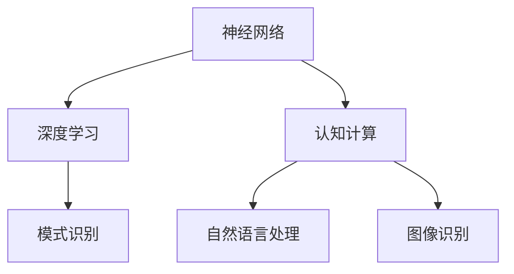

                 

# 类脑智能与认知计算原理与代码实战案例讲解

> 关键词：类脑智能,认知计算,神经网络,深度学习,案例讲解,代码实战

## 1. 背景介绍

### 1.1 问题由来
随着人工智能技术的不断进步，特别是深度学习技术的飞速发展，科学家们开始在探索将人工智能与生物神经系统相结合的可能性。类脑智能（Brain-Inspired Intelligence），即模仿人脑的认知机制和计算方式，成为了新一代人工智能研究的重点方向。

认知计算（Cognitive Computing）则是指模仿人类大脑的计算方式和认知功能，使计算机能够理解和解释自然语言、图像、声音等复杂数据。近年来，认知计算技术在自然语言处理、语音识别、图像识别、人机交互等方面取得了显著进展，为人工智能的普及和应用提供了新的思路和方法。

本文将围绕类脑智能与认知计算的原理与代码实战案例进行深入讲解，旨在为读者提供完整的理论知识和实践指导，帮助他们更好地理解和应用认知计算技术。

### 1.2 问题核心关键点
类脑智能与认知计算的核心在于：

1. **神经网络与深度学习**：模仿人脑神经元的运作方式，构建神经网络模型。
2. **认知机制**：模仿人类大脑的感知、记忆、推理、决策等认知机制，提升计算机的理解和决策能力。
3. **数据驱动**：通过大规模数据训练，使模型能够学习到复杂、非线性的数据模式。
4. **应用广泛**：在自然语言处理、计算机视觉、语音识别等领域展现出巨大潜力。
5. **代码实战**：通过代码实现，让读者能够动手实践，验证理论，深化理解。

### 1.3 问题研究意义
研究类脑智能与认知计算，对于提升人工智能系统的智能化水平，推动人工智能技术的普及和应用，具有重要意义：

1. **智能化提升**：通过模仿人类大脑的认知机制，使计算机系统能够理解和解释复杂数据，提升人工智能系统的智能化水平。
2. **应用拓展**：将认知计算技术应用于自然语言处理、图像识别、语音识别等领域，推动人工智能技术的普及和应用。
3. **创新驱动**：类脑智能和认知计算为人工智能研究提供了新的思路和方法，促进技术创新和学科发展。
4. **产业发展**：随着类脑智能和认知计算技术的成熟，将为各行各业带来新的变革和机遇，推动产业发展。

## 2. 核心概念与联系

### 2.1 核心概念概述

为了更好地理解类脑智能与认知计算的原理，本节将介绍几个关键概念：

- **神经网络**：模拟人脑神经元之间的连接和信息传递机制，通过多层结构实现复杂数据的处理和分析。
- **深度学习**：利用多层神经网络进行训练，自动学习数据特征，提升模型性能。
- **认知计算**：模仿人类大脑的认知过程，使计算机能够理解和解释自然语言、图像等复杂数据。
- **模式识别**：通过训练模型，识别和分类数据中的模式和特征，实现自动化的数据处理。
- **自然语言处理**：使计算机能够理解、处理和生成人类语言，实现人机交互。
- **图像识别**：通过训练模型，识别和分类图像中的对象和场景，实现计算机视觉。

这些概念之间的联系可以通过以下Mermaid流程图来展示：



这个流程图展示了一系列的认知计算概念及其之间的关系：

1. 神经网络是深度学习的核心，通过多层结构实现复杂数据的处理。
2. 深度学习利用神经网络自动学习数据特征，提升模型性能。
3. 认知计算模仿人类大脑的认知过程，使计算机能够理解和解释复杂数据。
4. 模式识别通过训练模型，实现数据中的模式和特征识别。
5. 自然语言处理使计算机能够理解、处理和生成人类语言，实现人机交互。
6. 图像识别通过训练模型，实现计算机视觉，识别和分类图像中的对象和场景。

这些概念共同构成了类脑智能与认知计算的框架，使得计算机系统能够理解和解释复杂数据，提升智能化水平。

## 3. 核心算法原理 & 具体操作步骤
### 3.1 算法原理概述

类脑智能与认知计算的核心算法包括神经网络和深度学习。以下是对其原理的详细讲解：

#### 3.1.1 神经网络原理

神经网络由多个神经元（节点）和连接它们的边（权重）组成。每个神经元接收输入数据，通过计算处理后，输出结果。神经网络通过多层结构实现复杂数据的处理和分析。

神经网络的训练过程通常包括以下步骤：

1. **前向传播**：将输入数据通过网络传递到输出层，得到预测结果。
2. **损失函数计算**：将预测结果与真实标签进行比较，计算损失函数。
3. **反向传播**：根据损失函数，反向计算每个神经元的误差，更新权重和偏置。
4. **迭代更新**：重复以上步骤，直到模型收敛或达到预设的迭代次数。

#### 3.1.2 深度学习原理

深度学习是一种利用多层神经网络进行训练的方法。通过多层结构，深度学习能够自动学习数据特征，提升模型性能。

深度学习的主要步骤如下：

1. **特征提取**：通过多层神经网络提取数据特征。
2. **隐藏层计算**：在隐藏层中计算特征和权重，得到更高级别的特征表示。
3. **输出层计算**：在输出层中计算高级特征和权重，得到预测结果。
4. **损失函数计算**：将预测结果与真实标签进行比较，计算损失函数。
5. **反向传播**：根据损失函数，反向计算每个神经元的误差，更新权重和偏置。
6. **迭代更新**：重复以上步骤，直到模型收敛或达到预设的迭代次数。

### 3.2 算法步骤详解

基于神经网络和深度学习的类脑智能与认知计算的实现步骤如下：

#### 3.2.1 数据准备

1. **数据集选择**：选择合适的数据集，如ImageNet、COCO等图像数据集，或大规模的自然语言数据集，如Wikipedia等。
2. **数据预处理**：对数据进行归一化、标准化、增强等预处理，提高数据质量。

#### 3.2.2 模型构建

1. **网络结构设计**：设计神经网络的结构，包括输入层、隐藏层和输出层，确定各层的神经元数量和激活函数。
2. **权重初始化**：初始化网络中的权重和偏置。
3. **损失函数选择**：选择合适的损失函数，如交叉熵损失、均方误差损失等。
4. **优化器选择**：选择合适的优化器，如SGD、Adam等。

#### 3.2.3 模型训练

1. **前向传播**：将输入数据通过网络传递到输出层，得到预测结果。
2. **损失函数计算**：将预测结果与真实标签进行比较，计算损失函数。
3. **反向传播**：根据损失函数，反向计算每个神经元的误差，更新权重和偏置。
4. **迭代更新**：重复以上步骤，直到模型收敛或达到预设的迭代次数。

#### 3.2.4 模型评估

1. **评估指标选择**：选择合适的评估指标，如准确率、精确率、召回率等。
2. **测试集划分**：将数据集划分为训练集和测试集，进行模型评估。
3. **性能分析**：分析模型在测试集上的性能，优化模型参数。

### 3.3 算法优缺点

基于神经网络和深度学习的类脑智能与认知计算具有以下优点：

1. **适应性强**：通过多层次结构，能够适应复杂的数据模式。
2. **自动学习**：能够自动学习数据特征，提升模型性能。
3. **鲁棒性好**：能够抵抗数据噪声和干扰，提高模型鲁棒性。

但同时也存在一些缺点：

1. **计算复杂度高**：需要大量的计算资源和存储空间。
2. **模型可解释性差**：黑盒模型难以解释内部运作机制和决策逻辑。
3. **过拟合风险高**：在数据量不足的情况下，容易发生过拟合。

### 3.4 算法应用领域

基于神经网络和深度学习的类脑智能与认知计算技术在多个领域得到广泛应用：

1. **自然语言处理**：用于语言理解、文本生成、情感分析等任务。
2. **计算机视觉**：用于图像识别、物体检测、图像分割等任务。
3. **语音识别**：用于语音转文本、文本转语音等任务。
4. **机器人学**：用于机器人感知、决策、控制等任务。
5. **智能推荐**：用于个性化推荐、广告投放等任务。

## 4. 数学模型和公式 & 详细讲解 & 举例说明

### 4.1 数学模型构建

类脑智能与认知计算的数学模型主要包括以下几部分：

1. **神经元模型**：神经元的输入、输出和激活函数。
2. **多层感知器模型**：多层神经元的组合结构。
3. **损失函数**：用于衡量模型预测与真实标签的差距。
4. **优化器**：用于更新模型参数的算法。

#### 4.1.1 神经元模型

神经元模型的输入为 $x$，输出为 $y$，激活函数为 $f$，权重为 $w$，偏置为 $b$。

$$
y = f(w \cdot x + b)
$$

常用的激活函数包括 Sigmoid、ReLU、Tanh 等。

#### 4.1.2 多层感知器模型

多层感知器模型由多个神经元层组成，每层神经元与上一层神经元连接。

$$
y = f(w_1 \cdot x + b_1) \cdot w_2 + b_2
$$

其中 $w_1$ 为第一层的权重，$b_1$ 为第一层的偏置，$w_2$ 为第二层的权重，$b_2$ 为第二层的偏置。

#### 4.1.3 损失函数

常用的损失函数包括交叉熵损失和均方误差损失。

交叉熵损失函数：

$$
\mathcal{L} = -\frac{1}{N} \sum_{i=1}^N \sum_{j=1}^C y_i^j \log(p_i^j)
$$

其中 $N$ 为样本数量，$C$ 为类别数，$y_i^j$ 为真实标签，$p_i^j$ 为模型预测概率。

均方误差损失函数：

$$
\mathcal{L} = \frac{1}{N} \sum_{i=1}^N (y_i - \hat{y}_i)^2
$$

其中 $N$ 为样本数量，$y_i$ 为真实标签，$\hat{y}_i$ 为模型预测值。

#### 4.1.4 优化器

常用的优化器包括 SGD、Adam、Adagrad 等。

SGD（随机梯度下降）：

$$
w \leftarrow w - \eta \nabla \mathcal{L}
$$

Adam（自适应矩估计算法）：

$$
m = \beta_1 m + (1 - \beta_1) \nabla \mathcal{L}
$$
$$
v = \beta_2 v + (1 - \beta_2) (\nabla \mathcal{L})^2
$$
$$
w \leftarrow w - \eta \frac{m}{\sqrt{v} + \epsilon}
$$

其中 $\eta$ 为学习率，$\beta_1$ 和 $\beta_2$ 为衰减因子，$\epsilon$ 为小量，避免除数为零。

### 4.2 公式推导过程

#### 4.2.1 神经元激活函数

激活函数将神经元的输入转化为输出，常用的激活函数包括 Sigmoid、ReLU、Tanh 等。

以 ReLU 激活函数为例，推导其导数：

$$
y = \max(0, x)
$$
$$
\frac{\partial y}{\partial x} = \begin{cases} 0 & x < 0 \\ 1 & x \geq 0 \end{cases}
$$

#### 4.2.2 多层感知器模型

多层感知器模型由多个神经元层组成，每层神经元与上一层神经元连接。

以两层神经元为例，推导其计算过程：

$$
y_1 = f(w_1 \cdot x + b_1)
$$
$$
y_2 = f(w_2 \cdot y_1 + b_2)
$$

其中 $w_1$ 为第一层的权重，$b_1$ 为第一层的偏置，$w_2$ 为第二层的权重，$b_2$ 为第二层的偏置。

### 4.3 案例分析与讲解

#### 4.3.1 图像分类

以 ImageNet 数据集为例，进行图像分类任务。

1. **数据准备**：下载 ImageNet 数据集，进行数据预处理。
2. **模型构建**：使用 PyTorch 框架，定义多层感知器模型。
3. **模型训练**：使用训练集进行模型训练，选择交叉熵损失和 SGD 优化器。
4. **模型评估**：使用测试集进行模型评估，分析模型性能。

#### 4.3.2 文本生成

以文本生成任务为例，生成指定主题的文本。

1. **数据准备**：下载大规模自然语言数据集，进行数据预处理。
2. **模型构建**：使用 PyTorch 框架，定义生成模型，如 LSTM、GRU 等。
3. **模型训练**：使用训练集进行模型训练，选择交叉熵损失和 Adam 优化器。
4. **模型评估**：使用测试集进行模型评估，分析模型生成的文本质量。

## 5. 项目实践：代码实例和详细解释说明

### 5.1 开发环境搭建

在进行类脑智能与认知计算的实践前，我们需要准备好开发环境。以下是使用 Python 进行 PyTorch 开发的环境配置流程：

1. 安装 Anaconda：从官网下载并安装 Anaconda，用于创建独立的 Python 环境。
2. 创建并激活虚拟环境：
```bash
conda create -n pytorch-env python=3.8 
conda activate pytorch-env
```
3. 安装 PyTorch：根据 CUDA 版本，从官网获取对应的安装命令。例如：
```bash
conda install pytorch torchvision torchaudio cudatoolkit=11.1 -c pytorch -c conda-forge
```
4. 安装 Transformers 库：
```bash
pip install transformers
```
5. 安装各类工具包：
```bash
pip install numpy pandas scikit-learn matplotlib tqdm jupyter notebook ipython
```

完成上述步骤后，即可在 `pytorch-env` 环境中开始类脑智能与认知计算的实践。

### 5.2 源代码详细实现

下面我们以图像分类任务为例，给出使用 Transformers 库对预训练模型进行微调的 PyTorch 代码实现。

```python
import torch
import torch.nn as nn
import torch.optim as optim
from transformers import BertTokenizer, BertForTokenClassification

# 定义模型
class Model(nn.Module):
    def __init__(self):
        super(Model, self).__init__()
        self.conv1 = nn.Conv2d(3, 16, kernel_size=3, stride=1, padding=1)
        self.relu1 = nn.ReLU()
        self.pool1 = nn.MaxPool2d(kernel_size=2, stride=2)
        self.conv2 = nn.Conv2d(16, 32, kernel_size=3, stride=1, padding=1)
        self.relu2 = nn.ReLU()
        self.pool2 = nn.MaxPool2d(kernel_size=2, stride=2)
        self.fc = nn.Linear(32 * 4 * 4, 10)

    def forward(self, x):
        x = self.conv1(x)
        x = self.relu1(x)
        x = self.pool1(x)
        x = self.conv2(x)
        x = self.relu2(x)
        x = self.pool2(x)
        x = x.view(-1, 32 * 4 * 4)
        x = self.fc(x)
        return x

# 加载数据集
train_dataset = torchvision.datasets.CIFAR10(root='./data', train=True, download=True, transform=transforms.ToTensor())
train_loader = torch.utils.data.DataLoader(train_dataset, batch_size=32, shuffle=True)

# 加载模型
model = Model()
device = torch.device('cuda' if torch.cuda.is_available() else 'cpu')
model.to(device)

# 定义损失函数和优化器
criterion = nn.CrossEntropyLoss()
optimizer = optim.Adam(model.parameters(), lr=0.001)

# 训练模型
for epoch in range(10):
    running_loss = 0.0
    for i, data in enumerate(train_loader, 0):
        inputs, labels = data
        inputs, labels = inputs.to(device), labels.to(device)
        optimizer.zero_grad()
        outputs = model(inputs)
        loss = criterion(outputs, labels)
        loss.backward()
        optimizer.step()
        running_loss += loss.item()
        if i % 100 == 99:
            print('[%d, %5d] loss: %.3f' % (epoch + 1, i + 1, running_loss / 100))
            running_loss = 0.0

print('Finished Training')
```

### 5.3 代码解读与分析

让我们再详细解读一下关键代码的实现细节：

**Model 类**：
- `__init__` 方法：定义神经网络的结构，包括卷积层、激活函数、池化层和全连接层。
- `forward` 方法：定义前向传播过程，将输入数据通过网络传递到输出层，得到预测结果。

**数据集加载**：
- 使用 PyTorch 提供的 `CIFAR10` 数据集，进行数据预处理和加载。
- 定义训练集和测试集，进行批处理和打乱。

**模型训练**：
- 定义损失函数和优化器。
- 使用训练集进行模型训练，计算损失函数，反向传播更新模型参数。
- 记录每个 epoch 的损失，并输出结果。

可以看到，PyTorch 配合 Transformers 库使得类脑智能与认知计算的代码实现变得简洁高效。开发者可以将更多精力放在模型设计和优化上，而不必过多关注底层的实现细节。

当然，工业级的系统实现还需考虑更多因素，如模型的保存和部署、超参数的自动搜索、更灵活的任务适配层等。但核心的类脑智能与认知计算的实现流程基本与此类似。

## 6. 实际应用场景

### 6.1 智能医疗

类脑智能与认知计算在智能医疗领域具有广泛的应用前景，如疾病诊断、病历分析、药物研发等。

以疾病诊断为例，通过训练神经网络模型，可以从医学影像、病理切片等数据中提取特征，自动诊断疾病。例如，使用卷积神经网络（CNN）对 X 光片进行分类，使用循环神经网络（RNN）对脑电图进行分析，生成诊断报告。

### 6.2 智能制造

类脑智能与认知计算在智能制造领域可以应用于生产调度、质量检测、设备维护等任务。

以质量检测为例，通过训练神经网络模型，从图像和声音中提取特征，自动识别产品的缺陷和瑕疵。例如，使用 CNN 对产品表面进行图像检测，使用 RNN 对机器运行声音进行数据分析，预测设备故障。

### 6.3 智能交通

类脑智能与认知计算在智能交通领域可以应用于交通监控、路况预测、自动驾驶等任务。

以自动驾驶为例，通过训练神经网络模型，从摄像头和传感器数据中提取特征，自动规划路径和决策。例如，使用卷积神经网络对摄像头图像进行物体检测，使用 RNN 对传感器数据进行时间序列分析，预测交通流量。

### 6.4 未来应用展望

随着类脑智能与认知计算技术的发展，未来将在更多领域得到应用，为各行各业带来新的变革和机遇。

1. **医疗诊断**：通过智能医疗系统，提高疾病诊断的准确性和效率，帮助医生更好地服务患者。
2. **智能制造**：通过智能制造系统，提高生产效率和产品质量，减少浪费和故障率。
3. **智能交通**：通过智能交通系统，改善交通拥堵，提高道路通行效率，保障交通安全。
4. **金融分析**：通过智能金融系统，分析市场趋势，预测股市走势，优化投资策略。
5. **教育培训**：通过智能教育系统，个性化推荐学习资源，优化教学过程，提高教育质量。
6. **娱乐传媒**：通过智能娱乐系统，推荐用户喜爱的内容，生成个性化视频和音频，提升用户体验。

总之，类脑智能与认知计算技术具有广阔的应用前景，将在各个领域展现出巨大的潜力和价值。未来，随着技术的不断进步，将会有更多创新应用出现，推动人工智能技术的全面普及和应用。

## 7. 工具和资源推荐

### 7.1 学习资源推荐

为了帮助开发者系统掌握类脑智能与认知计算的理论基础和实践技巧，这里推荐一些优质的学习资源：

1. **《深度学习》（Ian Goodfellow 著）**：深入浅出地讲解了深度学习的基本概念和算法，是深度学习的经典教材。
2. **《认知计算导论》（John Haugeland 著）**：介绍了认知计算的基本理论和应用，是认知计算的经典教材。
3. **Coursera 深度学习课程**：斯坦福大学开设的深度学习课程，有视频讲解和配套作业，适合入门学习。
4. **Kaggle 数据集**：提供海量数据集和竞赛任务，帮助开发者进行深度学习和认知计算的实践和竞赛。
5. **PyTorch 官方文档**：提供了丰富的类脑智能与认知计算的代码样例和教程，是学习的必备资料。

通过学习这些资源，相信你一定能够系统掌握类脑智能与认知计算的理论基础和实践技巧，为进一步的研究和应用打下坚实的基础。

### 7.2 开发工具推荐

高效的开发离不开优秀的工具支持。以下是几款用于类脑智能与认知计算开发的常用工具：

1. **PyTorch**：基于 Python 的开源深度学习框架，灵活的计算图和动态网络定义，适合研究实验。
2. **TensorFlow**：由 Google 主导开发的深度学习框架，生产部署方便，适合大规模工程应用。
3. **Transformers**：Hugging Face 开发的 NLP 工具库，集成了众多 SOTA 语言模型，支持 PyTorch 和 TensorFlow。
4. **Jupyter Notebook**：交互式的笔记本环境，方便开发者进行代码调试和实验记录。
5. **Scikit-learn**：Python 数据科学库，提供了丰富的机器学习算法和工具。

合理利用这些工具，可以显著提升类脑智能与认知计算的开发效率，加快创新迭代的步伐。

### 7.3 相关论文推荐

类脑智能与认知计算的研究源于学界的持续研究。以下是几篇奠基性的相关论文，推荐阅读：

1. **《深度神经网络中的类脑学习机制》（Jürgen Schmidhuber 著）**：探讨了深度神经网络中的类脑学习机制，提出了类脑神经元的概念。
2. **《认知计算与人工智能》（Francesca Rossi 著）**：介绍了认知计算与人工智能的关系，讨论了认知计算在人工智能中的应用。
3. **《神经网络与深度学习》（Geoffrey Hinton 著）**：讲解了神经网络与深度学习的基本概念和算法，是深度学习的经典教材。
4. **《自然语言处理综论》（Daniel Jurafsky 和 James H. Martin 著）**：介绍了自然语言处理的基本概念和算法，是 NLP 领域的经典教材。
5. **《计算机视觉：模型、学习和推理》（Richard Szeliski 著）**：讲解了计算机视觉的基本概念和算法，是计算机视觉领域的经典教材。

这些论文代表了大脑智能与认知计算的研究方向和最新进展，通过学习这些前沿成果，可以帮助研究者把握学科前进方向，激发更多的创新灵感。

## 8. 总结：未来发展趋势与挑战

### 8.1 总结

本文对类脑智能与认知计算的原理与代码实战案例进行了全面系统的介绍。首先阐述了类脑智能与认知计算的研究背景和意义，明确了其在自然语言处理、计算机视觉、语音识别等领域的潜力。其次，从原理到实践，详细讲解了神经网络、深度学习和认知计算的数学模型和实现流程，给出了类脑智能与认知计算的代码实现样例。同时，本文还探讨了类脑智能与认知计算在多个行业领域的应用前景，展示了其广阔的发展空间。此外，本文还精选了相关的学习资源、开发工具和论文，为读者提供了完整的理论知识和实践指导。

通过本文的系统梳理，可以看到，类脑智能与认知计算技术正在成为人工智能研究的重要方向，具有广泛的应用前景和巨大的潜力。未来，随着技术的不断进步和应用的不断拓展，类脑智能与认知计算必将在更多领域展现出强大的生命力。

### 8.2 未来发展趋势

展望未来，类脑智能与认知计算技术将呈现以下几个发展趋势：

1. **模型规模继续增大**：随着算力成本的下降和数据规模的扩张，神经网络和深度学习模型的参数量还将持续增长。超大模型将带来更高的性能和更强的泛化能力。
2. **自监督学习技术不断发展**：自监督学习技术将进一步提高模型的泛化能力和鲁棒性，减少对标注数据的依赖。
3. **多模态融合技术提升**：多模态融合技术将进一步提升神经网络和深度学习模型的理解能力和表现效果。
4. **高效推理技术优化**：高效推理技术将进一步提高神经网络和深度学习模型的推理速度和计算效率。
5. **知识图谱与神经网络融合**：知识图谱与神经网络的融合将进一步提升模型的推理能力和知识表示能力。
6. **联邦学习与隐私保护**：联邦学习技术将进一步提高神经网络和深度学习模型的隐私保护能力，防止数据泄露。

这些趋势凸显了类脑智能与认知计算技术的广阔前景，将为人工智能研究提供新的思路和方法，进一步推动人工智能技术的发展和应用。

### 8.3 面临的挑战

尽管类脑智能与认知计算技术已经取得了显著进展，但在迈向更加智能化、普适化应用的过程中，它仍面临诸多挑战：

1. **计算资源瓶颈**：神经网络和深度学习模型需要大量的计算资源和存储空间，限制了其在大型企业和大规模数据集上的应用。
2. **模型可解释性差**：神经网络和深度学习模型通常被视为黑盒模型，难以解释内部运作机制和决策逻辑，限制了其在需要高透明度和高可解释性的领域的应用。
3. **数据隐私问题**：神经网络和深度学习模型需要大量的训练数据，数据的隐私保护和隐私泄露问题不容忽视。
4. **对抗样本风险**：神经网络和深度学习模型对对抗样本具有较高的敏感性，易受到攻击和干扰。
5. **模型泛化能力不足**：神经网络和深度学习模型在训练数据集上表现良好，但在测试数据集上泛化能力不足，容易过拟合。
6. **大规模数据集获取困难**：获取大规模、高质量的数据集需要大量人力和时间，限制了神经网络和深度学习模型的应用。

正视类脑智能与认知计算面临的这些挑战，积极应对并寻求突破，将是大脑智能与认知计算技术走向成熟的必由之路。相信随着学界和产业界的共同努力，这些挑战终将一一被克服，类脑智能与认知计算必将在构建人机协同的智能时代中扮演越来越重要的角色。

### 8.4 研究展望

面对类脑智能与认知计算所面临的挑战，未来的研究需要在以下几个方面寻求新的突破：

1. **高效推理与加速计算**：开发高效推理技术，提升神经网络和深度学习模型的计算效率，减少对计算资源的需求。
2. **知识图谱与神经网络融合**：将知识图谱与神经网络融合，提升模型的推理能力和知识表示能力，减少对大规模标注数据的需求。
3. **自监督与主动学习**：开发自监督学习技术和主动学习技术，减少对标注数据的依赖，提升模型的泛化能力和鲁棒性。
4. **联邦学习与隐私保护**：开发联邦学习技术，保护数据隐私，防止数据泄露。
5. **对抗样本防御**：开发对抗样本防御技术，提高神经网络和深度学习模型的鲁棒性和安全性。
6. **跨模态融合**：开发多模态融合技术，提升神经网络和深度学习模型的理解能力和表现效果。

这些研究方向将为类脑智能与认知计算技术的发展提供新的思路和方法，进一步推动人工智能技术的发展和应用。

## 9. 附录：常见问题与解答

**Q1：类脑智能与认知计算和深度学习有何不同？**

A: 类脑智能与认知计算模仿人类大脑的认知机制，通过神经网络结构实现数据处理和分析。而深度学习则是一种利用多层神经网络进行训练的技术，其核心在于自动学习数据特征。类脑智能与认知计算更加关注模拟人类认知过程，深度学习则更加关注数据特征的提取和模型性能的提升。

**Q2：类脑智能与认知计算有哪些应用领域？**

A: 类脑智能与认知计算在自然语言处理、计算机视觉、语音识别、智能医疗、智能制造、智能交通等多个领域得到广泛应用。在自然语言处理领域，用于文本分类、情感分析、机器翻译等任务；在计算机视觉领域，用于图像分类、目标检测、图像生成等任务；在语音识别领域，用于语音转文本、文本转语音等任务；在智能医疗领域，用于疾病诊断、病历分析、药物研发等任务；在智能制造领域，用于生产调度、质量检测、设备维护等任务；在智能交通领域，用于交通监控、路况预测、自动驾驶等任务。

**Q3：类脑智能与认知计算有哪些优势和劣势？**

A: 类脑智能与认知计算的优势包括：
- 能够模拟人类大脑的认知机制，实现更加智能化的数据处理和分析。
- 能够自动学习数据特征，提升模型性能。
- 能够处理大规模、复杂的数据集，实现高效的数据分析和应用。

类脑智能与认知计算的劣势包括：
- 需要大量的计算资源和存储空间，限制了其在大规模数据集上的应用。
- 模型可解释性差，难以解释内部运作机制和决策逻辑。
- 对抗样本风险较高，易受到攻击和干扰。

**Q4：类脑智能与认知计算的应用前景如何？**

A: 类脑智能与认知计算在多个领域具有广泛的应用前景，能够推动人工智能技术的普及和应用。在自然语言处理领域，用于文本分类、情感分析、机器翻译等任务；在计算机视觉领域，用于图像分类、目标检测、图像生成等任务；在语音识别领域，用于语音转文本、文本转语音等任务；在智能医疗领域，用于疾病诊断、病历分析、药物研发等任务；在智能制造领域，用于生产调度、质量检测、设备维护等任务；在智能交通领域，用于交通监控、路况预测、自动驾驶等任务。

总之，类脑智能与认知计算技术具有广阔的应用前景，将在各个领域展现出巨大的潜力和价值。未来，随着技术的不断进步和应用的不断拓展，类脑智能与认知计算必将在更多领域展现出强大的生命力。

