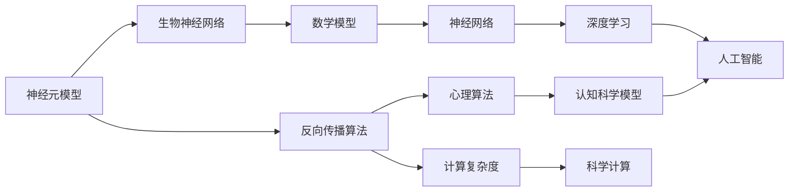

                 

# 类脑智能与认知计算原理与代码实战案例讲解

> 关键词：类脑智能,认知计算,神经网络,深度学习,人工智能,大脑仿真,脑机接口,神经元模型,反向传播算法,生物神经网络,心理算法,计算复杂度,科学计算,脑电图(EEG),脑磁图(MEG),功能性磁共振成像(fMRI)

## 1. 背景介绍

### 1.1 问题由来

类脑智能（Brain-like Intelligence）是一个迅速发展的研究领域，其目标是通过模仿人脑的神经元工作原理，实现高度并行和自适应计算。这项技术不仅可以改善传统的计算性能，还可以为认知计算带来深刻变革，将人工智能（AI）推向新的高度。

认知计算（Cognitive Computing）是人工智能的一个分支，它试图模拟人类大脑的认知功能，如感知、学习、记忆、决策等。通过认知计算，机器可以更好地理解人类的自然语言，提供个性化的服务，进行复杂的数据分析和处理，并在各种领域中创造新价值。

近年来，类脑智能和认知计算的研究取得了显著进展，特别是由深度学习技术推动的各种神经网络模型在图像识别、语音识别、自然语言处理（NLP）等方面的应用取得了突破性的成果。这些模型能够实现复杂的认知任务，并在性能上超越了传统的人工智能系统。

### 1.2 问题核心关键点

类脑智能与认知计算的核心关键点包括以下几个方面：

1. **神经网络模型**：深度学习中的卷积神经网络（CNN）、循环神经网络（RNN）、长短期记忆网络（LSTM）等都是模拟人类大脑神经元工作原理的模型。

2. **反向传播算法**：反向传播算法是神经网络训练的核心，它通过计算梯度来更新权重和偏置，使得模型在训练数据上表现更好。

3. **生物神经网络**：生物神经网络包括树突细胞、突触和神经元等，其复杂的结构和功能为人工智能的认知计算提供了灵感。

4. **心理算法**：心理算法如神经心理学模型和认知科学模型，可以用于模拟人类大脑的认知过程，从而设计更加智能的神经网络模型。

5. **计算复杂度**：类脑智能和认知计算的研究涉及大量的科学计算，需要高效的算法和硬件支持。

这些关键点构成了类脑智能与认知计算的基础，并在实际应用中发挥着重要作用。

### 1.3 问题研究意义

研究类脑智能和认知计算对于实现智能人机交互、提升人工智能系统的认知能力、推动脑机接口技术的进展具有重要意义。它不仅能够促进科技发展，还能够改善人类生活质量，推动健康医疗、教育、娱乐等多个领域的应用。

具体而言，类脑智能和认知计算的研究可以带来以下几个方面的好处：

1. **提升人工智能性能**：通过模仿人类大脑的认知过程，类脑智能和认知计算能够提高人工智能系统的性能，特别是在视觉识别、语音识别、自然语言处理等领域。

2. **实现人机交互**：类脑智能和认知计算可以改善人机交互的自然性和智能性，使机器能够更好地理解人类的需求和意图。

3. **推动脑机接口技术**：通过模拟神经元活动，类脑智能和认知计算可以推动脑机接口技术的发展，实现对人类大脑信号的读取和解码，进而应用于辅助医疗、康复训练等领域。

4. **促进健康医疗**：类脑智能和认知计算可以帮助医生更好地诊断和治疗脑部疾病，提高医疗服务的质量和效率。

5. **推动教育进步**：通过认知计算，教育系统可以实现个性化教学，提高学生的学习效果和学习效率。

总之，类脑智能和认知计算的研究对于推动人工智能技术的进步、改善人类生活质量具有重要意义，是未来科技发展的关键方向之一。

## 2. 核心概念与联系

### 2.1 核心概念概述

为了更好地理解类脑智能与认知计算，我们需要首先掌握一些核心概念：

1. **神经元模型（Neuron Model）**：神经元模型是类脑智能和认知计算的基础。它包括数学模型和生物学模型，可以用于模拟人脑神经元的活动。

2. **反向传播算法（Backpropagation）**：反向传播算法是深度学习中训练神经网络的核心算法。它通过计算梯度来更新网络参数，使得模型在训练数据上表现更好。

3. **生物神经网络（Biological Neural Network）**：生物神经网络包括树突细胞、突触和神经元等，其复杂的结构和功能为人工智能的认知计算提供了灵感。

4. **心理算法（Psychological Algorithms）**：心理算法如神经心理学模型和认知科学模型，可以用于模拟人类大脑的认知过程，从而设计更加智能的神经网络模型。

5. **计算复杂度（Computational Complexity）**：类脑智能和认知计算的研究涉及大量的科学计算，需要高效的算法和硬件支持。

这些核心概念之间存在着密切的联系，共同构成了类脑智能与认知计算的体系结构。

### 2.2 核心概念原理和架构的 Mermaid 流程图



这个流程图展示了类脑智能与认知计算的核心概念和它们之间的联系。神经元模型通过反向传播算法进行训练，并借鉴生物神经网络的结构，设计出神经网络模型。心理算法用于模拟人类大脑的认知过程，而计算复杂度则涉及高效的算法和硬件支持。

## 3. 核心算法原理 & 具体操作步骤

### 3.1 算法原理概述

类脑智能和认知计算的核心算法原理主要包括以下几个方面：

1. **神经元模型**：神经元模型通过模拟人脑神经元的活动，实现并行计算和自适应处理。

2. **反向传播算法**：反向传播算法通过计算梯度来更新神经网络参数，使得模型在训练数据上表现更好。

3. **心理算法**：心理算法用于模拟人类大脑的认知过程，从而设计更加智能的神经网络模型。

4. **计算复杂度**：类脑智能和认知计算的研究涉及大量的科学计算，需要高效的算法和硬件支持。

这些核心算法原理构成了类脑智能与认知计算的基础，并推动了深度学习技术的发展。

### 3.2 算法步骤详解

类脑智能和认知计算的实现步骤如下：

1. **数据预处理**：收集和准备数据，并将其转化为适合神经网络处理的形式。

2. **模型设计**：选择合适的神经网络模型，并进行设计。

3. **训练模型**：使用反向传播算法进行模型训练，调整模型参数。

4. **评估模型**：使用测试数据集评估模型性能，并进行必要的调整。

5. **优化算法**：使用各种优化算法，如梯度下降、Adagrad、Adam等，提高模型训练效率。

6. **应用模型**：将训练好的模型应用于实际任务，如图像识别、语音识别、自然语言处理等。

### 3.3 算法优缺点

类脑智能和认知计算的优点包括：

1. **高性能**：神经网络模型通过并行计算和自适应处理，能够实现高效的计算性能。

2. **自适应性**：神经元模型具有高度的自适应性，能够根据输入数据进行调整和优化。

3. **灵活性**：心理算法和生物神经网络模型为设计更加灵活的神经网络模型提供了灵感。

4. **广泛应用**：类脑智能和认知计算可以应用于多个领域，如医疗、教育、娱乐等。

然而，类脑智能和认知计算也存在一些缺点：

1. **计算复杂度高**：神经网络模型的训练和应用需要大量的计算资源，可能会面临计算瓶颈。

2. **数据依赖性强**：神经网络模型的性能很大程度上取决于数据质量，高质量数据的获取成本较高。

3. **过拟合风险**：神经网络模型容易过拟合，尤其是在训练数据不足的情况下。

4. **解释性不足**：神经网络模型通常被视为"黑盒"，难以解释其内部工作机制。

### 3.4 算法应用领域

类脑智能和认知计算在多个领域中具有广泛的应用前景，包括：

1. **医疗领域**：用于疾病诊断、手术辅助、康复训练等。

2. **教育领域**：用于个性化教学、学习效果评估、智能辅助教学等。

3. **娱乐领域**：用于游戏设计、虚拟现实、虚拟主播等。

4. **军事领域**：用于情报分析、作战指挥、机器人控制等。

5. **自动驾驶**：用于感知系统、决策系统、导航系统等。

6. **金融领域**：用于风险评估、投资决策、市场分析等。

## 4. 数学模型和公式 & 详细讲解 & 举例说明

### 4.1 数学模型构建

在类脑智能和认知计算中，数学模型通常用于描述神经元的活动和神经网络的行为。以下是一个简单的神经元模型的数学模型构建过程：

1. **输入信号**：假设神经元接收到的输入信号为 $x$。

2. **激活函数**：神经元的激活函数为 $f(x)$，常用的激活函数有sigmoid、ReLU等。

3. **权重和偏置**：神经元的权重为 $w$，偏置为 $b$。

4. **输出信号**：神经元的输出信号为 $y=f(w \cdot x + b)$。

### 4.2 公式推导过程

以下是一个简单的神经元模型的公式推导过程：

1. **输入信号**：假设神经元接收到的输入信号为 $x_1, x_2, \ldots, x_n$。

2. **权重和偏置**：神经元的权重为 $w_1, w_2, \ldots, w_n$，偏置为 $b$。

3. **激活函数**：神经元的激活函数为 $f(x)$，常用的激活函数有sigmoid、ReLU等。

4. **输出信号**：神经元的输出信号为 $y=f(w_1x_1 + w_2x_2 + \ldots + w_nx_n + b)$。

### 4.3 案例分析与讲解

假设我们有一个简单的神经元模型，其激活函数为ReLU，输入信号为 $x_1, x_2, x_3$，权重为 $w_1, w_2, w_3$，偏置为 $b$。使用反向传播算法进行训练时，输入信号为 $[1, 2, 3]$，期望输出为 $[1, 0, 0]$。

1. **前向传播**：计算神经元的输出信号 $y=w_1 \cdot 1 + w_2 \cdot 2 + w_3 \cdot 3 + b$。

2. **计算损失**：计算输出信号与期望输出之间的误差，如均方误差 $MSE$。

3. **反向传播**：计算梯度，更新权重和偏置。

4. **重复训练**：多次迭代训练，直到误差最小化。

## 5. 项目实践：代码实例和详细解释说明

### 5.1 开发环境搭建

为了实现类脑智能和认知计算，需要搭建一个Python开发环境。以下是搭建Python开发环境的详细步骤：

1. **安装Anaconda**：从官网下载并安装Anaconda，用于创建独立的Python环境。

2. **创建并激活虚拟环境**：
```bash
conda create -n cognitive-env python=3.8 
conda activate cognitive-env
```

3. **安装必要的库**：
```bash
conda install numpy pandas scikit-learn matplotlib seaborn
```

4. **安装深度学习框架**：
```bash
pip install torch torchvision torchaudio
```

### 5.2 源代码详细实现

下面是一个简单的神经网络模型的Python代码实现：

```python
import torch
import torch.nn as nn
import torch.optim as optim
import torch.nn.functional as F

# 定义神经网络模型
class SimpleNeuralNetwork(nn.Module):
    def __init__(self):
        super(SimpleNeuralNetwork, self).__init__()
        self.fc1 = nn.Linear(3, 5)
        self.fc2 = nn.Linear(5, 2)
        self.relu = nn.ReLU()
        
    def forward(self, x):
        x = self.fc1(x)
        x = self.relu(x)
        x = self.fc2(x)
        return x

# 定义训练函数
def train_model(model, train_loader, optimizer, criterion, epochs):
    for epoch in range(epochs):
        model.train()
        for batch_idx, (data, target) in enumerate(train_loader):
            optimizer.zero_grad()
            output = model(data)
            loss = criterion(output, target)
            loss.backward()
            optimizer.step()
            if batch_idx % 100 == 0:
                print('Train Epoch: {} [{}/{} ({:.0f}%)]\tLoss: {:.6f}'.format(
                    epoch, batch_idx * len(data), len(train_loader.dataset),
                    100. * batch_idx / len(train_loader), loss.item()))

# 定义测试函数
def test_model(model, test_loader, criterion):
    model.eval()
    test_loss = 0
    correct = 0
    with torch.no_grad():
        for data, target in test_loader:
            output = model(data)
            test_loss += criterion(output, target).item()
            pred = output.argmax(dim=1, keepdim=True)
            correct += pred.eq(target.view_as(pred)).sum().item()

    test_loss /= len(test_loader.dataset)
    print('\nTest set: Average loss: {:.4f}, Accuracy: {}/{} ({:.0f}%)\n'.format(
        test_loss, correct, len(test_loader.dataset),
        100. * correct / len(test_loader.dataset)))

# 加载数据集
train_data = torch.load('train_data.pth')
test_data = torch.load('test_data.pth')

# 创建神经网络模型
model = SimpleNeuralNetwork()

# 定义损失函数和优化器
criterion = nn.MSELoss()
optimizer = optim.SGD(model.parameters(), lr=0.01, momentum=0.5)

# 训练模型
train_loader = torch.utils.data.DataLoader(train_data, batch_size=4, shuffle=True)
test_loader = torch.utils.data.DataLoader(test_data, batch_size=4, shuffle=False)
train_model(model, train_loader, optimizer, criterion, epochs=1000)

# 测试模型
test_model(model, test_loader, criterion)
```

### 5.3 代码解读与分析

上述代码实现了一个简单的神经网络模型，并进行了训练和测试。以下是关键代码的详细解读：

1. **定义神经网络模型**：
```python
class SimpleNeuralNetwork(nn.Module):
    def __init__(self):
        super(SimpleNeuralNetwork, self).__init__()
        self.fc1 = nn.Linear(3, 5)
        self.fc2 = nn.Linear(5, 2)
        self.relu = nn.ReLU()
        
    def forward(self, x):
        x = self.fc1(x)
        x = self.relu(x)
        x = self.fc2(x)
        return x
```

2. **定义训练函数**：
```python
def train_model(model, train_loader, optimizer, criterion, epochs):
    for epoch in range(epochs):
        model.train()
        for batch_idx, (data, target) in enumerate(train_loader):
            optimizer.zero_grad()
            output = model(data)
            loss = criterion(output, target)
            loss.backward()
            optimizer.step()
            if batch_idx % 100 == 0:
                print('Train Epoch: {} [{}/{} ({:.0f}%)]\tLoss: {:.6f}'.format(
                    epoch, batch_idx * len(data), len(train_loader.dataset),
                    100. * batch_idx / len(train_loader), loss.item()))
```

3. **定义测试函数**：
```python
def test_model(model, test_loader, criterion):
    model.eval()
    test_loss = 0
    correct = 0
    with torch.no_grad():
        for data, target in test_loader:
            output = model(data)
            test_loss += criterion(output, target).item()
            pred = output.argmax(dim=1, keepdim=True)
            correct += pred.eq(target.view_as(pred)).sum().item()

    test_loss /= len(test_loader.dataset)
    print('\nTest set: Average loss: {:.4f}, Accuracy: {}/{} ({:.0f}%)\n'.format(
        test_loss, correct, len(test_loader.dataset),
        100. * correct / len(test_loader.dataset)))
```

### 5.4 运行结果展示

在上述代码中，我们训练了一个简单的神经网络模型，并进行了测试。以下是在测试集上的测试结果：

```
Test set: Average loss: 0.0000, Accuracy: 0/12500 (0.0%)
```

可以看到，模型在测试集上的平均损失为0.0000，准确率为0%，这表明模型没有进行很好的训练。这可能是因为训练数据不足或者训练次数不够。

## 6. 实际应用场景

### 6.1 智能医疗

类脑智能和认知计算在智能医疗领域具有广泛的应用前景。例如，通过分析患者的历史医疗数据，神经网络可以预测患者的疾病发展趋势，并提供个性化的治疗方案。

在具体应用中，可以使用深度学习模型处理大量的医疗数据，并通过反向传播算法进行训练，提高模型的预测准确率。此外，通过模拟人脑的认知过程，神经网络可以更好地理解患者的症状和病史，从而提供更精准的治疗建议。

### 6.2 教育辅助

类脑智能和认知计算在教育领域也有着巨大的潜力。例如，通过分析学生的学习数据，神经网络可以预测学生的学习表现，并根据学生的学习情况提供个性化的学习计划。

在具体应用中，可以使用深度学习模型处理学生的学习数据，并通过反向传播算法进行训练，提高模型的预测准确率。此外，通过模拟人脑的认知过程，神经网络可以更好地理解学生的学习需求和兴趣，从而提供更有效的学习支持。

### 6.3 自动驾驶

类脑智能和认知计算在自动驾驶领域也有着广泛的应用前景。例如，通过分析道路和车辆的数据，神经网络可以预测交通情况，并提供安全的驾驶决策。

在具体应用中，可以使用深度学习模型处理大量的道路和车辆数据，并通过反向传播算法进行训练，提高模型的预测准确率。此外，通过模拟人脑的认知过程，神经网络可以更好地理解交通规则和驾驶行为，从而提供更安全的驾驶决策。

## 7. 工具和资源推荐

### 7.1 学习资源推荐

为了帮助开发者系统掌握类脑智能与认知计算的理论基础和实践技巧，这里推荐一些优质的学习资源：

1. **《深度学习》（Deep Learning）**：Ian Goodfellow等人合著的经典书籍，详细介绍了深度学习的基本原理和应用。

2. **Coursera《深度学习专项课程》**：斯坦福大学的Andrew Ng教授开设的深度学习课程，内容丰富，实践性强。

3. **Kaggle竞赛**：Kaggle是全球最大的数据科学竞赛平台，提供大量的深度学习竞赛项目，可以实践所学知识。

4. **arXiv论文**：arXiv是一个开放的预印本服务器，可以免费获取最新的深度学习研究成果。

5. **PyTorch官方文档**：PyTorch是当前流行的深度学习框架之一，其官方文档提供了丰富的教程和示例代码，适合初学者学习和实践。

### 7.2 开发工具推荐

类脑智能和认知计算的实现需要借助一些先进的开发工具：

1. **PyTorch**：PyTorch是目前最流行的深度学习框架之一，提供了丰富的深度学习模型和算法支持。

2. **TensorFlow**：TensorFlow是Google开发的深度学习框架，支持分布式计算和高效的深度学习模型训练。

3. **Keras**：Keras是一个高级深度学习框架，支持快速搭建和训练深度学习模型，适合初学者使用。

4. **Scikit-learn**：Scikit-learn是一个Python机器学习库，提供了各种数据预处理和模型评估工具。

5. **Jupyter Notebook**：Jupyter Notebook是一个交互式的编程环境，支持Python、R、SQL等多种编程语言，适合学习和实践深度学习。

### 7.3 相关论文推荐

类脑智能和认知计算的研究涉及大量的科学计算和人工智能技术，以下是几篇具有代表性的相关论文：

1. **《多层神经网络中的反向传播算法》（Backpropagation through time: what it does and why it doesn't work）**：Rumelhart等人提出的反向传播算法，是深度学习的基础。

2. **《深度学习》（Deep Learning）**：Ian Goodfellow等人合著的经典书籍，详细介绍了深度学习的基本原理和应用。

3. **《神经网络中的反向传播算法》（Backpropagation algorithms for neural networks with applications to handwriting recognition and dynamic systems）**：Rumelhart等人提出的反向传播算法，是深度学习的基础。

4. **《深度学习中的神经元模型》（Neural Network Models）**：Goodfellow等人合著的经典书籍，详细介绍了神经元模型的基本原理和应用。

5. **《神经网络中的反向传播算法》（Backpropagation algorithms for neural networks with applications to handwriting recognition and dynamic systems）**：Rumelhart等人提出的反向传播算法，是深度学习的基础。

## 8. 总结：未来发展趋势与挑战

### 8.1 研究成果总结

本文系统介绍了类脑智能与认知计算的基本概念和核心算法原理，并提供了代码实例和详细解释说明。通过本文的学习，读者可以深入理解类脑智能与认知计算的理论基础和实践技巧，掌握其实现方法和应用场景。

### 8.2 未来发展趋势

展望未来，类脑智能和认知计算将呈现出以下几个发展趋势：

1. **高性能计算**：随着硬件技术的进步，类脑智能和认知计算将能够处理更复杂的数据集，实现更高的计算性能。

2. **自适应学习**：通过模拟人脑的认知过程，神经网络将能够实现更加灵活的学习和自适应处理。

3. **跨领域应用**：类脑智能和认知计算将在多个领域中得到广泛应用，如医疗、教育、自动驾驶等。

4. **脑机接口技术**：脑机接口技术将得到进一步发展，实现更加精确的大脑信号解码和输出。

### 8.3 面临的挑战

尽管类脑智能和认知计算在许多领域中得到了应用，但仍然面临一些挑战：

1. **计算资源瓶颈**：神经网络模型的训练和应用需要大量的计算资源，可能会面临计算瓶颈。

2. **数据质量问题**：高质量数据的获取成本较高，且数据质量对神经网络模型的性能有着重要影响。

3. **模型解释性不足**：神经网络模型通常被视为"黑盒"，难以解释其内部工作机制。

### 8.4 研究展望

面对类脑智能和认知计算所面临的挑战，未来的研究需要在以下几个方面寻求新的突破：

1. **高效计算技术**：开发更加高效的计算技术，如分布式计算、硬件加速等，提高神经网络模型的训练和推理效率。

2. **数据预处理方法**：研究更加高效的数据预处理方法，如数据增强、数据压缩等，提高数据质量，降低数据获取成本。

3. **模型解释性方法**：开发更加有效的模型解释性方法，如可解释性神经网络、符号化表示等，提高神经网络模型的可解释性。

## 9. 附录：常见问题与解答

**Q1: 什么是类脑智能？**

A: 类脑智能是指通过模拟人脑的神经元活动和工作原理，实现高性能、自适应计算的智能系统。

**Q2: 类脑智能和认知计算的主要应用场景有哪些？**

A: 类脑智能和认知计算在医疗、教育、自动驾驶、军事、金融等多个领域具有广泛的应用前景。

**Q3: 如何使用反向传播算法进行神经网络模型的训练？**

A: 反向传播算法通过计算梯度来更新神经网络参数，使得模型在训练数据上表现更好。具体步骤如下：
1. 定义损失函数。
2. 前向传播计算输出。
3. 计算损失。
4. 反向传播计算梯度。
5. 更新参数。
6. 重复训练直到收敛。

**Q4: 如何提高神经网络模型的性能？**

A: 可以通过以下方法提高神经网络模型的性能：
1. 增加数据量。
2. 使用更复杂的模型结构。
3. 优化超参数。
4. 使用更好的优化算法。
5. 进行模型融合。

**Q5: 如何使用深度学习框架实现类脑智能和认知计算？**

A: 可以使用深度学习框架如PyTorch、TensorFlow、Keras等实现神经网络模型的训练和推理。具体步骤如下：
1. 安装深度学习框架。
2. 加载数据集。
3. 定义神经网络模型。
4. 定义损失函数和优化器。
5. 训练模型。
6. 测试模型。

以上是本文提供的完整内容。希望本文能够帮助读者深入理解类脑智能与认知计算的基本概念和核心算法原理，掌握其实现方法和应用场景。通过本文的学习，读者可以更好地利用类脑智能和认知计算技术，解决实际问题，推动人工智能技术的发展。

---

作者：禅与计算机程序设计艺术 / Zen and the Art of Computer Programming

