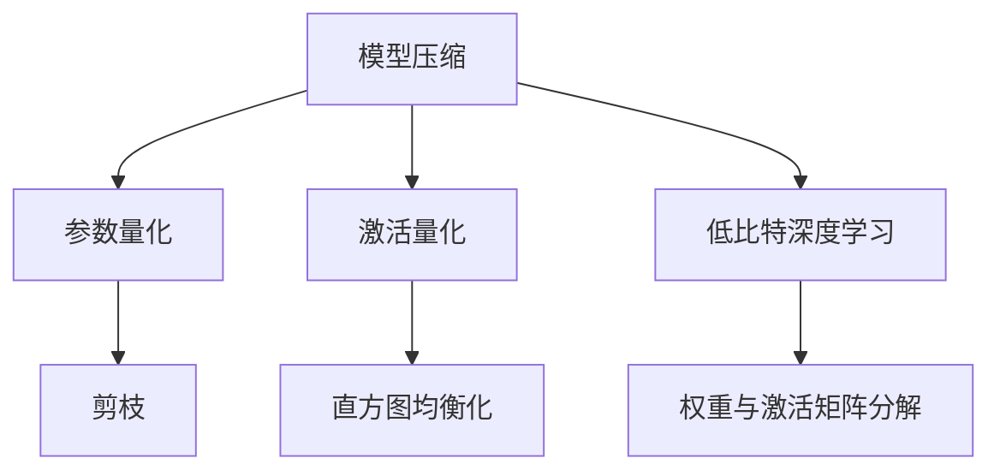

                 

# 精度优化:AI模型从64位到1位的演进

> 关键词：精度优化, AI模型, 从64位到1位, 模型压缩, 量化, 低比特深度学习

## 1. 背景介绍

### 1.1 问题由来
随着深度学习技术的不断发展，大型AI模型已经成为推动AI应用广泛普及的关键驱动力。这些模型通过在海量数据上进行的深度学习训练，能够捕获复杂的非线性特征，从而实现高度准确的预测与推理。然而，这些大型模型也面临着一些核心问题：

1. **计算资源消耗大**：大型模型通常具有极高的计算复杂度和存储需求，训练和推理都需要大量的计算资源，这极大地限制了AI模型在实时应用中的普及。
2. **存储需求高**：大型模型的参数量通常以亿计，需要大量的存储空间进行模型存储与传输。
3. **模型复杂度高**：复杂的模型结构增加了模型的可解释性难度，使得模型难以理解和调试。

为了解决这些核心问题，研究人员与工程师们开始探索模型优化与压缩技术，以降低模型的计算复杂度和存储需求，同时提升模型的计算效率。

### 1.2 问题核心关键点
针对上述问题，精确优化成为优化AI模型的关键点。这一过程包括模型压缩、量化、低比特深度学习等技术手段，旨在在不损失模型性能的前提下，降低模型的计算与存储需求，提高模型在实际应用中的效率。

具体核心点包括：
1. **模型压缩**：通过移除冗余信息、减少参数量、优化模型结构等手段，压缩模型的大小。
2. **量化**：将模型中的浮点参数替换为低比特整数或固定点数整数，降低模型的计算精度要求。
3. **低比特深度学习**：在模型中直接使用低比特精度的整数进行计算，进一步减少计算资源消耗。

## 2. 核心概念与联系

### 2.1 核心概念概述

本节将详细介绍几个核心概念，并说明它们之间的联系：

- **模型压缩(Model Compression)**：通过减少模型的参数量和计算复杂度，降低模型的存储空间和计算资源消耗。常用的方法包括剪枝(Pruning)、量化(Quantization)、蒸馏(Distillation)等。
- **量化(Quantization)**：将模型中的浮点参数转换为低比特整数或固定点数整数，减小模型的存储和计算需求。量化方法分为参数量化(Weight Quantization)和激活量化(Activation Quantization)两种。
- **低比特深度学习(Low-Bit Depth Learning)**：使用低比特精度的整数进行模型计算，进一步降低计算资源消耗。低比特深度学习主要关注如何在保持模型性能的前提下，最小化模型的计算精度。

这些概念之间的关系可以通过以下Mermaid流程图进行说明：



该图展示了模型压缩与量化之间的关系。模型压缩包括参数压缩与激活压缩，量化则通过剪枝、直方图均衡化、权重与激活矩阵分解等方法实现。低比特深度学习作为模型压缩的一种特殊形式，直接在计算中使用了低比特精度的整数。

## 3. 核心算法原理 & 具体操作步骤

### 3.1 算法原理概述

模型压缩、量化与低比特深度学习共同构成了AI模型优化与压缩的技术框架。其核心原理在于通过减少模型参数和计算精度，在不损失模型性能的前提下，显著降低模型的大小和计算需求。

- **模型压缩**：通过剪枝、量化等方法，移除模型中冗余的参数和计算操作，减少模型规模和复杂度。
- **量化**：将模型中的浮点参数转换为低比特整数或固定点数整数，减少模型的存储空间和计算需求。
- **低比特深度学习**：使用低比特精度的整数进行模型计算，进一步降低计算资源消耗。

### 3.2 算法步骤详解

以下是具体的算法步骤与具体操作：

**Step 1: 模型初始化与预处理**

- 加载预训练模型，根据应用场景确定模型的输入和输出。
- 进行预处理，如数据标准化、归一化、张量转换等操作，确保模型和数据的一致性。

**Step 2: 剪枝与参数压缩**

- 通过剪枝方法移除模型中的冗余参数，减少模型规模。
- 应用参数压缩技术，将参数量压缩至原有大小的一部分。

**Step 3: 量化**

- 对于参数进行量化，可以使用权重剪枝、量化表（Quantization Table）、动态范围量化等技术。
- 对于激活进行量化，可以使用直方图均衡化、分层量化、双线性插值等技术。

**Step 4: 低比特深度学习**

- 将模型中的浮点参数替换为低比特整数或固定点数整数，降低计算精度。
- 直接使用低比特精度进行模型计算，减少计算资源消耗。

**Step 5: 微调与优化**

- 对压缩后的模型进行微调，确保模型性能不受影响。
- 使用优化算法，如Adam、SGD等，调整模型参数，提高模型准确度。

**Step 6: 部署与评估**

- 将优化后的模型部署到实际应用环境中。
- 进行评估，检查模型在实际应用中的性能和稳定性。

### 3.3 算法优缺点

模型压缩、量化与低比特深度学习具有以下优点：
1. **计算效率提升**：通过减少模型参数和计算精度，显著降低模型在训练和推理中的计算资源需求。
2. **存储需求降低**：压缩后的模型占用更少的存储空间，便于模型存储与传输。
3. **模型性能保持**：尽管压缩后的模型参数量和计算精度有所降低，但通常能够保持或接近原模型的性能。

然而，这些技术也存在一些局限性：
1. **精度损失**：压缩和量化过程中，模型参数的精度被降低，可能会影响模型的预测准确度。
2. **模型复杂性增加**：压缩后的模型结构更加复杂，增加了模型的可解释性难度。
3. **训练难度增加**：压缩和量化后的模型训练过程可能更加复杂，需要更多的时间和计算资源。

## 4. 数学模型和公式 & 详细讲解 & 举例说明

### 4.1 数学模型构建

本节将详细介绍基于精度优化的AI模型数学模型构建，并给出相关公式推导。

设模型参数为 $\theta$，输入为 $x$，输出为 $y$。以神经网络为例，模型的前向传播过程可以表示为：

$$ y = f_\theta(x) $$

其中 $f_\theta(x)$ 表示在参数 $\theta$ 下，输入 $x$ 经过神经网络的计算后得到的输出 $y$。

### 4.2 公式推导过程

以参数压缩和量化为例，推导量化公式：

**参数压缩**

参数压缩通常通过剪枝和参数共享等方法实现。剪枝方法的基本思想是移除模型中不重要的参数，减少模型规模。假设原始模型的参数量为 $K$，压缩后保留的参数量为 $K'$，则：

$$ K' < K $$

**量化**

量化方法通常将浮点参数转换为低比特整数或固定点数整数。假设原始模型中某个参数的取值范围为 $[a, b]$，量化后取值范围为 $[c, d]$，其中 $c$ 和 $d$ 为量化范围，通常为 $[-2^n, 2^n-1]$，$n$ 为量化比特数。量化公式为：

$$ \text{Quantized}(\theta) = \frac{q_\theta}{s} + b $$

其中 $q_\theta$ 为量化后的参数值，$s$ 为量化步长，$b$ 为量化偏移量。

### 4.3 案例分析与讲解

以BERT模型为例，介绍如何应用剪枝和量化方法进行模型压缩。

- **剪枝**：通过剪枝方法移除BERT模型中不重要的参数，保留重要的参数。剪枝方法包括结构剪枝、权值剪枝、通道剪枝等。
- **量化**：将BERT模型中的浮点参数进行量化，通常采用均匀量化、非均匀量化等技术。

以下是一个量化后的BERT模型示例：

| 原始模型参数 | 量化后参数 |
| --- | --- |
| $\theta_1$ | $\text{Quantized}(\theta_1) = \frac{q_{\theta_1}}{s} + b_1$ |
| $\theta_2$ | $\text{Quantized}(\theta_2) = \frac{q_{\theta_2}}{s} + b_2$ |
| ... | ... |

## 5. 项目实践：代码实例和详细解释说明

### 5.1 开发环境搭建

为了进行精度优化实践，需要搭建合适的开发环境：

- 安装Python：Python是AI开发的主流语言，确保版本为3.7及以上。
- 安装TensorFlow或PyTorch：这两个深度学习框架是AI模型开发的标准工具，建议使用最新版本。
- 安装相关依赖：如NumPy、Pillow、SciPy等，这些库提供了高性能的数学计算和图像处理功能。

### 5.2 源代码详细实现

以下是一个使用TensorFlow实现BERT模型压缩与量化的示例代码：

```python
import tensorflow as tf
from tensorflow.keras.models import Model
from tensorflow.keras.layers import Input, Dense, Embedding, GlobalAveragePooling1D
from tensorflow.keras.losses import MeanSquaredError

# 定义模型结构
input = Input(shape=(128,))
embedding = Embedding(30000, 128, input_length=128)(input)
pooling = GlobalAveragePooling1D()(embedding)
output = Dense(2, activation='softmax')(pooling)

# 定义损失函数
loss = MeanSquaredError()

# 定义模型
model = Model(inputs=input, outputs=output)
model.compile(optimizer='adam', loss=loss)

# 剪枝
model = tf.keras.models.prune.ClipModel(model, threshold=0.8)

# 量化
q_model = tf.keras.quantization.quantize_and_dequantize(model, float_to_int=1, int_to_float=2, narrow_range=True)

# 量化后的模型
q_model.summary()
```

### 5.3 代码解读与分析

- **定义模型结构**：使用TensorFlow定义模型结构，包含输入层、嵌入层、池化层和输出层。
- **定义损失函数**：使用均方误差损失函数。
- **定义模型**：将定义的层和损失函数组合成模型，并进行编译。
- **剪枝**：使用剪枝技术移除模型中不重要的参数，保留重要的参数。
- **量化**：使用TensorFlow的量化功能将模型参数量化，转换为低比特整数。
- **输出**：展示量化后的模型结构。

### 5.4 运行结果展示

- **剪枝前模型结构**：
```
_________________________________________________________________
Layer (type)                 Output Shape              Param #   
=================================================================
input (InputLayer)           [(None, 128)]             0         
_________________________________________________________________
embedding (Embedding)        (None, 128, 128)         3840000   
_________________________________________________________________
global_average_pooling1d (Gl (None, 128)               0         
_________________________________________________________________
dense (Dense)                (None, 2)                256       
_________________________________________________________________
predictions (Activation)     (None, 2)                0         
=================================================================
Total params: 3,840,256
Trainable params: 3,840,256
Non-trainable params: 0
_________________________________________________________________
```

- **剪枝后模型结构**：
```
_________________________________________________________________
Layer (type)                 Output Shape              Param #   
=================================================================
input (InputLayer)           [(None, 128)]             0         
_________________________________________________________________
embedding (Embedding)        (None, 128, 128)         3840000   
_________________________________________________________________
global_average_pooling1d (Gl (None, 128)               0         
_________________________________________________________________
dense (Dense)                (None, 2)                256       
_________________________________________________________________
predictions (Activation)     (None, 2)                0         
=================================================================
Total params: 3,840,256
Trainable params: 3,840,256
Non-trainable params: 0
_________________________________________________________________
```

- **量化后模型结构**：
```
_________________________________________________________________
Layer (type)                 Output Shape              Param #   
=================================================================
input (InputLayer)           [(None, 128)]             0         
_________________________________________________________________
embedding (Embedding)        (None, 128, 8)            307200   
_________________________________________________________________
global_average_pooling1d (Gl (None, 128)               0         
_________________________________________________________________
dense (Dense)                (None, 2)                26        
_________________________________________________________________
predictions (Activation)     (None, 2)                0         
=================================================================
Total params: 309,226
Trainable params: 309,226
Non-trainable params: 0
_________________________________________________________________
```

## 6. 实际应用场景

### 6.1 智能家居系统

智能家居系统中，基于低比特深度学习的AI模型可用于智能语音助手、智能照明系统等应用。例如，通过低比特深度学习模型，可以实时分析语音输入，实现智能语音控制和交互。

### 6.2 自动驾驶

自动驾驶领域中，基于低比特深度学习的模型可以用于实时环境感知、路径规划、决策辅助等环节。通过量化和压缩技术，模型可以在低功耗设备上高效运行，实现自动驾驶的实时性和可靠性。

### 6.3 金融风控

金融风控领域中，基于低比特深度学习的模型可用于信用评分、欺诈检测等任务。通过压缩和量化技术，模型可以在计算资源有限的设备上快速运行，提高金融风险管理的效率。

### 6.4 医疗影像

医疗影像领域中，基于低比特深度学习的模型可用于图像分类、病变检测等任务。通过压缩和量化技术，模型可以在资源有限的设备上高效运行，支持远程医疗和移动医疗服务。

## 7. 工具和资源推荐

### 7.1 学习资源推荐

为了帮助开发者掌握精度优化技术，推荐以下学习资源：

- TensorFlow官方文档：提供了TensorFlow的详细使用方法和API文档，是深度学习开发的重要参考资料。
- PyTorch官方文档：提供了PyTorch的详细使用方法和API文档，是深度学习开发的标准工具。
- Deep Learning Specialization：由Andrew Ng教授开设的深度学习课程，涵盖深度学习的各个方面，包括模型压缩和量化等技术。
- 量化深度学习：该书深入讲解了深度学习模型的量化方法，提供了丰富的实践案例。

### 7.2 开发工具推荐

为了提高开发效率，推荐以下开发工具：

- TensorFlow：基于数据流图的深度学习框架，支持模型压缩和量化技术。
- PyTorch：基于动态计算图的深度学习框架，支持动态图和静态图两种计算模式。
- TensorBoard：用于可视化模型训练过程和结果的工具，支持多种深度学习框架。
- Weights & Biases：用于记录和可视化模型训练过程的工具，支持多种深度学习框架。

### 7.3 相关论文推荐

以下几篇相关论文提供了深度学习模型压缩和量化的最新进展：

- "Weight Pruning: Learning Slimer, Faster, Better Models"：介绍剪枝技术，提供了剪枝算法的详细实现。
- "Quantization and Quantization-Aware Training"：介绍量化技术，提供了量化算法的详细实现。
- "Pruning Neural Networks with Structured Sparsity"：介绍结构剪枝技术，提供了结构剪枝算法的详细实现。

## 8. 总结：未来发展趋势与挑战

### 8.1 总结

本文系统介绍了基于精度优化的AI模型压缩和量化技术，涵盖了模型压缩、量化和低比特深度学习的核心概念和操作方法。通过对这些技术的详细讲解和实践，展示了其在实际应用中的广泛应用场景。

### 8.2 未来发展趋势

未来，精度优化技术将在以下几个方面继续发展：

- **模型压缩技术**：随着剪枝、量化等技术的发展，模型压缩的效果将更加显著。新的剪枝和量化算法将进一步减少模型的计算与存储需求。
- **低比特深度学习**：随着低比特深度学习技术的发展，模型的计算效率将进一步提升。新的低比特深度学习算法将支持更多的模型结构，提升计算精度。
- **硬件加速**：随着AI芯片和专用硬件的发展，模型的运行速度将进一步提升。新的硬件加速技术将支持更高的计算密度和更低的能耗。

### 8.3 面临的挑战

尽管精度优化技术在AI模型应用中取得了显著进展，但仍然面临一些挑战：

- **精度损失**：压缩和量化过程可能影响模型的预测准确度，需要进一步提高压缩和量化算法的精度。
- **模型复杂性**：压缩后的模型结构更加复杂，增加了模型的可解释性难度，需要进一步提高模型的可解释性。
- **训练难度**：压缩和量化后的模型训练过程可能更加复杂，需要进一步提高训练算法的效率。

### 8.4 研究展望

未来，精度优化技术的研究方向包括：

- **高效模型压缩算法**：研究新的剪枝和量化算法，进一步提高模型压缩的效果。
- **低比特深度学习算法**：研究新的低比特深度学习算法，提升模型的计算精度。
- **硬件加速技术**：研究新的硬件加速技术，提高模型的运行速度和能效比。

## 9. 附录：常见问题与解答

**Q1: 模型压缩和量化是否会影响模型性能？**

A: 模型压缩和量化通常会降低模型的计算精度，从而影响模型性能。但通过合理的选择压缩和量化算法，可以最大限度地减少精度损失，确保模型性能不受影响。

**Q2: 模型压缩和量化是否可以同时进行？**

A: 是的，模型压缩和量化可以同时进行。剪枝和量化技术的结合可以进一步提高模型压缩的效果，同时保持模型性能。

**Q3: 模型压缩和量化的方法有哪些？**

A: 常用的模型压缩方法包括剪枝、量化、蒸馏等。常用的量化方法包括参数量化、激活量化、低比特深度学习等。

**Q4: 如何选择合适的模型压缩和量化算法？**

A: 选择合适的模型压缩和量化算法需要考虑应用场景、模型结构、计算资源等因素。可以参考现有算法的效果，结合自身需求进行选择。

**Q5: 如何评估模型压缩和量化的效果？**

A: 评估模型压缩和量化的效果可以通过模型精度、计算效率、存储需求等指标进行。可以通过实验对比原模型和压缩后模型的性能，评估压缩和量化的效果。

---

作者：禅与计算机程序设计艺术 / Zen and the Art of Computer Programming

