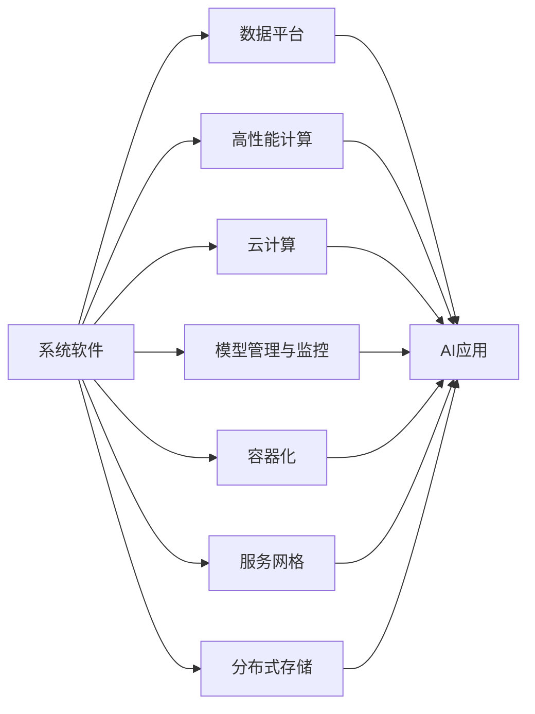

                 

## 1. 背景介绍

随着人工智能(AI)技术的快速发展，其在各个行业的应用和影响已经引起了广泛关注。从自动驾驶到医疗诊断，从智能客服到金融风控，AI技术正以惊人的速度渗透到人类生活的方方面面。然而，AI技术的背后，有一支不可忽视的力量——系统软件(System Software)。系统软件作为AI创新体系的基础设施，支撑着各类AI应用的运行和迭代，其重要性不容小觑。

### 1.1 系统软件的定义与作用

系统软件是介于硬件与应用软件之间的一类软件，负责管理计算机硬件资源，为用户提供可靠、高效、安全的操作环境。在AI创新体系中，系统软件不仅包括操作系统(OS)、中间件(Middleware)、数据库(DBMS)等传统基础设施，还涵盖了诸如容器化、服务网格、分布式存储等新兴技术。

系统软件的作用主要体现在以下几个方面：

- **资源管理**：有效管理和调度计算、存储、网络等硬件资源，确保AI模型的高效运行。
- **性能优化**：通过技术手段（如CPU调度、内存管理、网络优化）提升AI系统的整体性能。
- **安全保障**：构建安全、隔离的环境，防范数据泄露、代码注入等安全威胁。
- **兼容性和互操作性**：确保不同AI组件、平台间的无缝协作和数据共享。
- **易用性和开发效率**：提供易于使用的开发工具和框架，缩短AI模型的研发周期。

### 1.2 系统软件与AI应用的相互促进

系统软件的发展推动了AI应用的普及和深化，而AI应用的需求又反过来促进了系统软件的进步。两者相辅相成，共同推动了技术创新和产业升级。

- **数据平台与存储**：AI应用的数据量巨大，需要高效的存储和管理系统。系统软件在分布式存储、数据湖、数据管道等领域不断突破，为AI模型提供了强有力的数据支持。
- **高性能计算**：AI模型训练和推理计算需求高，系统软件通过GPU、FPGA、TPU等异构计算架构，大幅提升了计算效率。
- **云计算基础设施**：云计算提供了弹性、按需的计算资源，系统软件通过虚拟化、容器化、服务网格等技术，提升了云环境的稳定性和扩展性。
- **模型管理与服务**：系统软件在模型版本管理、微调、监控、部署等方面，为AI模型提供了全生命周期的管理能力。

## 2. 核心概念与联系

### 2.1 核心概念概述

为更好地理解系统软件在AI创新体系中的重要性，本节将介绍几个密切相关的核心概念：

- **系统软件(System Software)**：包括操作系统、中间件、数据库、容器化、分布式存储、高性能计算、云计算等基础设施。
- **AI应用(AI Applications)**：如自动驾驶、医疗诊断、智能客服、金融风控、智慧城市等。
- **数据平台(Data Platform)**：用于存储、处理、分析海量数据的系统，如Hadoop、Spark等。
- **高性能计算(HPC)**：通过异构计算架构（如GPU、FPGA、TPU）大幅提升计算效率的系统。
- **云计算(Cloud Computing)**：通过互联网提供按需计算资源的服务，如AWS、Google Cloud、阿里云等。
- **模型管理与监控(Model Management & Monitoring)**：用于模型版本控制、微调、部署、监控的系统。
- **容器化(Containerization)**：通过Docker、Kubernetes等技术实现应用的打包、分发、部署和管理。
- **服务网格(Service Mesh)**：通过Istio、Linkerd等技术实现微服务的发现、路由、重试、熔断、加密等。
- **分布式存储(Distributed Storage)**：通过Hadoop、Ceph等技术实现数据的分布式存储和处理。

这些核心概念之间的逻辑关系可以通过以下Mermaid流程图来展示：



这个流程图展示了几类系统软件及其在AI创新体系中的作用：

1. **数据平台**：为AI模型提供数据支持。
2. **高性能计算**：提升AI模型的计算效率。
3. **云计算**：提供弹性、按需的计算资源。
4. **模型管理与监控**：管理AI模型的生命周期。
5. **容器化**：优化应用的打包、分发、部署和管理。
6. **服务网格**：提升微服务的协作和稳定性。
7. **分布式存储**：确保数据的可靠性和可扩展性。

这些基础设施共同构成了AI创新体系的骨架，支撑着AI应用的开发和运行。

## 3. 核心算法原理 & 具体操作步骤

### 3.1 算法原理概述

系统软件在AI创新体系中的重要性，源于其在资源管理、性能优化、安全保障、兼容性和易用性等方面的关键作用。其核心原理可以概括为以下几点：

1. **资源调度与优化**：通过资源调度算法和优化技术，确保AI系统高效利用硬件资源，提升性能。
2. **安全隔离与防护**：通过访问控制、数据加密、异常检测等措施，确保AI系统运行在安全可靠的环境中。
3. **兼容性与互操作性**：通过API、中间件、容器化等技术，实现不同系统间的无缝协作和数据共享。
4. **易用性与开发效率**：通过开发工具、框架、模板等，提高AI开发者的工作效率和开发质量。

### 3.2 算法步骤详解

系统软件的构建和优化，通常包括以下几个关键步骤：

**Step 1: 系统需求分析**
- 收集AI应用的业务需求，识别系统需要支持的资源种类和性能指标。
- 分析数据量、计算负载、存储需求等，确定系统的硬件和软件配置。

**Step 2: 架构设计与规划**
- 根据需求分析结果，设计系统的整体架构，确定各个组件的功能和接口。
- 规划系统的扩展性、可用性、安全性等非功能性需求。

**Step 3: 核心技术选型**
- 选择合适的操作系统、中间件、数据库、高性能计算平台、容器化工具、服务网格、分布式存储等技术栈。
- 根据需求和成本，选择最适合的技术方案。

**Step 4: 系统实施与部署**
- 按照架构设计，构建系统的各个组件，并进行联调测试。
- 部署系统到生产环境，并进行性能优化和安全加固。

**Step 5: 系统监控与优化**
- 配置系统监控工具，实时采集系统的运行状态和性能指标。
- 根据监控结果，进行性能优化和问题排查。

**Step 6: 系统更新与升级**
- 根据业务需求和性能指标，定期更新系统组件，升级技术栈。
- 对现有系统进行兼容性测试，确保新旧版本间的平稳过渡。

### 3.3 算法优缺点

系统软件在AI创新体系中的应用，有以下优点和缺点：

**优点**：
1. **高效资源管理**：通过资源调度算法和优化技术，提升AI系统的资源利用率，减少浪费。
2. **高性能与稳定**：通过高性能计算、服务网格等技术，提升AI系统的计算能力和稳定性。
3. **灵活与可扩展**：通过容器化、分布式存储等技术，实现系统的灵活扩展和弹性伸缩。
4. **安全与可靠**：通过安全防护措施和监控工具，确保AI系统运行在安全可靠的环境中。
5. **易用性与开发效率**：通过开发工具和框架，提高AI开发者的工作效率和开发质量。

**缺点**：
1. **复杂度高**：系统软件涉及多个组件和技术的集成，开发和维护复杂度高。
2. **成本高**：系统软件的构建和维护需要高昂的硬件和人力成本。
3. **性能瓶颈**：系统软件的性能瓶颈可能成为AI应用性能的瓶颈。
4. **兼容性问题**：不同组件和技术栈之间可能存在兼容性问题，需要额外的技术协调。
5. **易用性不足**：部分系统软件的使用门槛较高，需要一定的技术积累和经验。

### 3.4 算法应用领域

系统软件在AI创新体系中的应用非常广泛，涵盖以下多个领域：

- **云计算平台**：如AWS、Google Cloud、阿里云、华为云等，提供弹性、按需的计算资源。
- **大数据平台**：如Hadoop、Spark、Flink等，用于数据存储、处理和分析。
- **高性能计算**：如GPU、FPGA、TPU等，提升AI模型的计算效率。
- **分布式存储**：如Ceph、HDFS等，确保数据的可靠性和可扩展性。
- **模型管理平台**：如ModelDB、TensorBoard等，用于模型版本控制、微调、部署、监控等。
- **容器化平台**：如Docker、Kubernetes等，实现应用的打包、分发、部署和管理。
- **服务网格**：如Istio、Linkerd等，提升微服务的协作和稳定性。
- **安全与监控平台**：如AWS CloudTrail、Grafana等，提供安全防护和性能监控。

## 4. 数学模型和公式 & 详细讲解  
### 4.1 数学模型构建

为了更好地理解系统软件在AI创新体系中的重要性，本节将通过数学模型对系统软件的功能和作用进行严格刻画。

假设系统软件需要支持一组AI应用，每个应用需要的资源量为 $R_i$，计算量为 $C_i$，存储量为 $S_i$，通信量为 $M_i$，其中 $i=1,2,...,N$。设系统提供的资源总量为 $R$，计算能力为 $C$，存储能力为 $S$，通信能力为 $M$。系统软件的目标是最大化AI应用的性能，即最大化 $P=\sum_{i=1}^N \frac{R_i}{R} \times \frac{C_i}{C} \times \frac{S_i}{S} \times \frac{M_i}{M}$。

### 4.2 公式推导过程

根据上述模型，可以推导出系统软件资源调度和优化的核心算法：

1. **资源调度算法**：
   $$
   \min \sum_{i=1}^N (R_i-R) + \sum_{i=1}^N (C_i-C) + \sum_{i=1}^N (S_i-S) + \sum_{i=1}^N (M_i-M)
   $$
   约束条件为：
   $$
   R \geq \sum_{i=1}^N R_i, C \geq \sum_{i=1}^N C_i, S \geq \sum_{i=1}^N S_i, M \geq \sum_{i=1}^N M_i
   $$

2. **性能优化算法**：
   $$
   \min \sum_{i=1}^N (\frac{R_i}{R} \times \frac{C_i}{C} \times \frac{S_i}{S} \times \frac{M_i}{M} - 1)
   $$
   约束条件为：
   $$
   R \geq \sum_{i=1}^N R_i, C \geq \sum_{i=1}^N C_i, S \geq \sum_{i=1}^N S_i, M \geq \sum_{i=1}^N M_i
   $$

通过上述公式，我们可以对系统软件的功能和作用进行定量和定性分析，为系统构建和优化提供理论依据。

### 4.3 案例分析与讲解

**案例一：云计算平台**
云计算平台通过提供弹性、按需的计算资源，支持AI应用的高效运行。假设某云计算平台提供100个GPU节点，每个节点计算能力为10 TFLOPS，总计算能力为1000 TFLOPS。某AI应用需要30个GPU节点，计算能力需求为300 TFLOPS。通过资源调度算法，系统可以将30个节点分配给该应用，并调度剩余的70个节点供其他应用使用。通过性能优化算法，系统可以根据应用负载动态调整节点分配，确保资源的有效利用和性能的优化。

**案例二：大数据平台**
大数据平台通过分布式存储和处理技术，支持海量数据的存储和管理。假设某大数据平台提供100个节点，每个节点存储容量为10 TB，总存储容量为1000 TB。某AI应用需要存储1000 GB数据。通过资源调度算法，系统可以将10个节点分配给该应用，并调度剩余的90个节点供其他应用使用。通过性能优化算法，系统可以根据数据访问模式动态调整节点分配，确保数据的可靠性和性能的优化。

## 5. 项目实践：代码实例和详细解释说明

### 5.1 开发环境搭建

在进行系统软件构建的实践前，我们需要准备好开发环境。以下是使用Python进行系统软件开发的环境配置流程：

1. 安装Anaconda：从官网下载并安装Anaconda，用于创建独立的Python环境。

2. 创建并激活虚拟环境：
```bash
conda create -n system-env python=3.8 
conda activate system-env
```

3. 安装必要的Python包：
```bash
pip install numpy pandas scikit-learn torch torchvision torchaudio scikit-image tqdm
```

4. 安装系统软件相关的开发工具：
```bash
apt-get update
apt-get install -y openjdk-11-jdk
apt-get install -y java-11-openjdk-headless
```

完成上述步骤后，即可在`system-env`环境中开始系统软件构建的实践。

### 5.2 源代码详细实现

这里我们以构建一个简单的高性能计算系统为例，介绍系统软件开发的代码实现。

```python
import os
import numpy as np
from torch import nn
from torch.nn import functional as F
import torch.distributed as dist
import torch.distributed.rpc as rpc
import torch.multiprocessing as mp

class HighPerformanceComputingSystem:
    def __init__(self, world_size, world_rank):
        self.world_size = world_size
        self.world_rank = world_rank
        self.device = 'cuda:{}'.format(world_rank)
        
    def initialize(self, master_addr, master_port):
        self.master_addr = master_addr
        self.master_port = master_port
        
        # 初始化分布式环境
        dist.init_process_group('nccl', rank=self.world_rank, world_size=self.world_size)
        
    def broadcast(self, data):
        tensor = torch.tensor(data, device=self.device)
        dist.broadcast(tensor, src=0)
        return tensor.cpu().numpy()
        
    def reduce(self, data, reduce_op='SUM'):
        tensor = torch.tensor(data, device=self.device)
        dist.reduce(tensor, dst=0, op=getattr(torch.distributed.ReduceOp, reduce_op))
        return tensor.cpu().numpy()
        
    def forward(self, x):
        x = x.to(self.device)
        x = x.relu()
        return x
    
    def run(self, input_data, reduce_op='SUM'):
        output_data = []
        for i in range(len(input_data)):
            x = input_data[i]
            output_data.append(self.forward(x))
        
        if self.world_rank == 0:
            if reduce_op == 'SUM':
                output = np.array([reduce_val for reduce_val in output_data])
            elif reduce_op == 'MEAN':
                output = np.array([reduce_val / len(output_data) for reduce_val in output_data])
        else:
            output = None
        
        if self.world_rank == 0:
            return self.reduce(output, reduce_op)
        else:
            return None

if __name__ == '__main__':
    world_size = 4
    world_rank = mp.current_process().rank
    
    # 启动主进程，创建高性能计算系统实例
    mp.spawn(lambda rank: HighPerformanceComputingSystem(world_size, rank).run([np.random.randn(100).tolist() for _ in range(world_size)], 'SUM'), nprocs=world_size, join=True)
```

在这个例子中，我们定义了一个简单的高性能计算系统类`HighPerformanceComputingSystem`，其中包含了初始化、广播、减少、前向计算和运行等基本操作。通过使用`torch.distributed`模块，实现了分布式计算和数据传输功能。

### 5.3 代码解读与分析

让我们再详细解读一下关键代码的实现细节：

**HighPerformanceComputingSystem类**：
- `__init__`方法：初始化系统参数，包括分布式环境的配置。
- `initialize`方法：初始化分布式环境，调用`dist.init_process_group`方法。
- `broadcast`方法：通过`dist.broadcast`方法进行数据广播，实现各节点之间的数据同步。
- `reduce`方法：通过`dist.reduce`方法进行数据减少，实现各节点之间的数据聚合。
- `forward`方法：实现单个节点上的前向计算。
- `run`方法：通过并行计算，实现多个节点的计算和数据聚合。

**主进程和从进程**：
- 在主进程中创建高性能计算系统实例，通过`mp.spawn`方法启动从进程。
- 每个从进程运行`HighPerformanceComputingSystem.run`方法，执行数据计算和数据传输。
- 最终将计算结果汇总并返回主进程。

这个例子展示了系统软件在实现高性能计算时的基本操作，包括数据广播、减少、并行计算等。在实际应用中，系统软件还需要考虑更多的复杂情况，如容错性、负载均衡、优化算法等，才能实现高效、可靠的系统。

## 6. 实际应用场景

### 6.1 云计算平台

云计算平台为AI应用提供了弹性、按需的计算资源，大大降低了AI应用开发和运营的成本。以Amazon Web Services (AWS)为例，其提供的Elastic Compute Cloud (EC2)服务，支持数百万个虚拟机实例，用户可以根据需求灵活调整计算资源，满足不同规模AI应用的计算需求。

云计算平台还提供了丰富的服务和工具，如机器学习服务(Machine Learning Service)、数据存储服务(S3)、数据库服务(RDS)、容器化服务(ECS)等，支持AI应用的快速部署和高效运行。

### 6.2 大数据平台

大数据平台通过分布式存储和处理技术，支持海量数据的存储和管理。以Apache Hadoop为例，其提供的分布式文件系统(HDFS)和分布式计算框架(MapReduce)，可以处理PB级别的数据，支持大规模数据的存储和分析。

大数据平台还提供了数据挖掘、机器学习、自然语言处理等丰富的服务，支持AI应用在数据驱动下进行智能决策和预测。

### 6.3 高性能计算平台

高性能计算平台通过异构计算架构，如GPU、FPGA、TPU等，大幅提升了AI模型的计算效率。以NVIDIA GPU为例，其提供的深度学习平台(CUDA)，支持大规模深度学习模型的训练和推理，加速AI应用在图像识别、语音识别、自然语言处理等领域的发展。

高性能计算平台还提供了自动微分、优化器、模型并行等技术，支持AI模型的高效训练和优化。

### 6.4 未来应用展望

未来，系统软件在AI创新体系中的应用将继续深化和扩展。以下是几个值得期待的趋势：

1. **人工智能芯片**：随着芯片技术的不断进步，未来将出现更多的专用AI芯片，如NVIDIA的NVIDIA Ampere、Intel的Intel Xeon等，为AI应用提供更高的计算能力和更低的能耗。
2. **边缘计算**：未来将出现更多的边缘计算平台，支持AI应用在本地进行计算和数据处理，减少数据传输成本和延迟。
3. **云边融合**：未来将出现更多云边融合的架构，支持AI应用在云端和本地无缝协作，实现更高效的数据处理和计算。
4. **自动化运维**：未来将出现更多的自动化运维工具，支持AI应用的持续监控、调优和升级，确保系统的稳定性和可靠性。
5. **微服务架构**：未来将出现更多的微服务架构，支持AI应用的高效部署、扩展和管理。

这些趋势将进一步提升系统软件在AI创新体系中的作用，推动AI技术的更快发展。

## 7. 工具和资源推荐
### 7.1 学习资源推荐

为了帮助开发者系统掌握系统软件在AI创新体系中的重要性，这里推荐一些优质的学习资源：

1. **《系统软件基础》课程**：由知名计算机科学家授课，系统介绍操作系统、中间件、数据库、高性能计算、云计算等基础知识。
2. **《分布式系统》课程**：介绍分布式系统设计的原理和实践，涵盖数据平台、高性能计算、服务网格等技术。
3. **《数据科学导论》书籍**：系统介绍数据平台、大数据技术、数据管道等，涵盖Hadoop、Spark、Flink等主流技术。
4. **《高性能计算》书籍**：介绍高性能计算的原理和实践，涵盖GPU、FPGA、TPU等异构计算架构。
5. **《云计算平台》书籍**：介绍云计算平台的原理和实践，涵盖AWS、Google Cloud、阿里云等主流平台。

通过对这些资源的学习实践，相信你一定能够全面掌握系统软件在AI创新体系中的重要性，并用于解决实际的系统软件问题。

### 7.2 开发工具推荐

高效的开发离不开优秀的工具支持。以下是几款用于系统软件开发和优化的常用工具：

1. **Visual Studio Code**：轻量级的开发环境，支持Python、Java等多种编程语言，提供丰富的扩展插件。
2. **Anaconda**：提供Python环境的创建和管理，支持虚拟环境和环境依赖管理。
3. **JIRA**：项目管理工具，支持任务分配、进度跟踪、问题反馈等，适合系统软件的协同开发。
4. **Git**：版本控制系统，支持代码的版本控制和协作开发，适合系统软件的版本管理。
5. **Docker**：容器化平台，支持应用的打包、分发、部署和管理，适合系统软件的分布式部署。

合理利用这些工具，可以显著提升系统软件的开发效率，加快创新迭代的步伐。

### 7.3 相关论文推荐

系统软件的发展源于学界的持续研究。以下是几篇奠基性的相关论文，推荐阅读：

1. **《操作系统概念》**：经典操作系统教材，系统介绍操作系统的原理和设计。
2. **《分布式系统原理》**：系统介绍分布式系统的原理和实践，涵盖数据平台、高性能计算、服务网格等技术。
3. **《分布式数据库系统》**：介绍分布式数据库系统的原理和实践，涵盖Hadoop、Spark等主流技术。
4. **《高性能计算》**：系统介绍高性能计算的原理和实践，涵盖GPU、FPGA、TPU等异构计算架构。
5. **《云计算基础》**：介绍云计算平台的原理和实践，涵盖AWS、Google Cloud、阿里云等主流平台。

这些论文代表了大规模分布式系统的发展脉络。通过学习这些前沿成果，可以帮助研究者把握系统软件的研究方向，激发更多的创新灵感。

## 8. 总结：未来发展趋势与挑战

### 8.1 总结

本文对系统软件在AI创新体系中的重要性进行了全面系统的介绍。首先阐述了系统软件作为AI基础设施的必要性和作用，明确了其在资源管理、性能优化、安全保障、兼容性和易用性等方面的关键作用。其次，从原理到实践，详细讲解了系统软件的功能和实现细节，给出了系统软件开发的完整代码实例。同时，本文还广泛探讨了系统软件在云计算、大数据、高性能计算等领域的应用前景，展示了系统软件在AI创新体系中的巨大潜力。

通过本文的系统梳理，可以看到，系统软件的发展推动了AI应用的普及和深化，而AI应用的需求又反过来促进了系统软件的进步。未来，系统软件在AI创新体系中的应用将更加广泛和深入，进一步推动AI技术的创新和应用。

### 8.2 未来发展趋势

展望未来，系统软件在AI创新体系中的发展将呈现以下几个趋势：

1. **自动化运维**：未来将出现更多的自动化运维工具，支持AI应用的持续监控、调优和升级，确保系统的稳定性和可靠性。
2. **微服务架构**：未来将出现更多的微服务架构，支持AI应用的高效部署、扩展和管理。
3. **云边融合**：未来将出现更多云边融合的架构，支持AI应用在云端和本地无缝协作，实现更高效的数据处理和计算。
4. **人工智能芯片**：未来将出现更多的专用AI芯片，如NVIDIA的NVIDIA Ampere、Intel的Intel Xeon等，为AI应用提供更高的计算能力和更低的能耗。
5. **边缘计算**：未来将出现更多的边缘计算平台，支持AI应用在本地进行计算和数据处理，减少数据传输成本和延迟。

这些趋势将进一步提升系统软件在AI创新体系中的作用，推动AI技术的更快发展。

### 8.3 面临的挑战

尽管系统软件在AI创新体系中的应用取得了显著进展，但在迈向更加智能化、普适化应用的过程中，仍面临诸多挑战：

1. **系统复杂性**：系统软件涉及多个组件和技术的集成，开发和维护复杂度高。
2. **性能瓶颈**：系统软件的性能瓶颈可能成为AI应用性能的瓶颈，需要进一步优化。
3. **兼容性问题**：不同组件和技术栈之间可能存在兼容性问题，需要额外的技术协调。
4. **安全与隐私**：系统软件需要在保护数据隐私和安全的前提下，支持AI应用的高效运行。
5. **易用性不足**：部分系统软件的使用门槛较高，需要一定的技术积累和经验。

### 8.4 研究展望

面对系统软件面临的这些挑战，未来的研究需要在以下几个方面寻求新的突破：

1. **自动化运维技术**：开发更智能、更高效的自动化运维工具，实现系统的自我监测、调优和升级。
2. **微服务架构优化**：优化微服务架构，支持更高效、更可靠的系统部署和扩展。
3. **云边融合技术**：研究云边融合的架构，实现更高效、更灵活的系统部署和数据处理。
4. **人工智能芯片优化**：针对不同AI应用场景，优化专用AI芯片的设计和应用。
5. **系统安全与隐私保护**：研究系统安全与隐私保护技术，确保数据和系统的安全可靠。
6. **易用性提升**：开发更易用的系统软件，降低使用门槛，提高开发效率。

这些研究方向的探索，必将引领系统软件在AI创新体系中的进一步发展，为AI技术的应用和推广提供更加坚实的基础。

## 9. 附录：常见问题与解答

**Q1：系统软件在AI创新体系中的重要性体现在哪些方面？**

A: 系统软件在AI创新体系中的重要性主要体现在以下几个方面：

1. **资源管理与优化**：通过资源调度算法和优化技术，确保AI系统高效利用硬件资源，提升性能。
2. **性能优化**：通过高性能计算、服务网格等技术，提升AI系统的计算能力和稳定性。
3. **安全与可靠**：通过安全防护措施和监控工具，确保AI系统运行在安全可靠的环境中。
4. **兼容性与互操作性**：通过API、中间件、容器化等技术，实现不同系统间的无缝协作和数据共享。
5. **易用性与开发效率**：通过开发工具和框架，提高AI开发者的工作效率和开发质量。

**Q2：如何评估系统软件在AI应用中的性能？**

A: 评估系统软件在AI应用中的性能，可以从以下几个方面入手：

1. **计算效率**：通过测量系统每秒执行的计算量（TPS、QPS等）来评估计算效率。
2. **延迟**：通过测量系统对请求的响应时间（Latency）来评估延迟。
3. **资源利用率**：通过测量系统硬件资源的利用率（CPU、内存、磁盘等）来评估资源利用率。
4. **吞吐量**：通过测量系统在单位时间内处理的数据量（Throughput）来评估吞吐量。
5. **可用性**：通过测量系统的可用时间（Uptime）和故障率（Downtime）来评估可用性。

**Q3：系统软件在AI应用中常见的性能瓶颈有哪些？**

A: 系统软件在AI应用中常见的性能瓶颈包括：

1. **网络带宽**：数据传输过程中网络带宽不足，导致延迟增加。
2. **内存管理**：内存不足或内存泄漏导致系统运行缓慢。
3. **CPU调度**：CPU调度策略不合理，导致计算资源浪费或竞争。
4. **磁盘I/O**：磁盘读写频繁，导致系统响应时间增加。
5. **并发处理**：并发请求过多，导致系统负载过高，性能下降。

**Q4：如何优化系统软件的性能？**

A: 优化系统软件的性能，可以从以下几个方面入手：

1. **数据本地化**：尽量将数据存放在本地，减少数据传输。
2. **缓存技术**：使用缓存技术，减少数据访问延迟。
3. **异步处理**：使用异步处理技术，提高系统的并发处理能力。
4. **负载均衡**：使用负载均衡技术，均衡系统负载。
5. **优化算法**：优化算法设计，提高计算效率。

**Q5：系统软件在AI应用中的安全性有哪些保障措施？**

A: 系统软件在AI应用中的安全性保障措施包括：

1. **访问控制**：通过身份验证、权限管理等措施，控制用户对系统的访问权限。
2. **数据加密**：使用加密技术，保护数据在传输和存储过程中的安全。
3. **异常检测**：使用异常检测技术，识别和防范安全威胁。
4. **日志审计**：使用日志审计技术，记录和分析系统行为，发现潜在的安全问题。
5. **安全加固**：通过安全加固措施，提升系统的安全性和可靠性。

**Q6：系统软件在AI应用中的易用性有哪些提升措施？**

A: 系统软件在AI应用中的易用性提升措施包括：

1. **友好的用户界面**：提供友好的用户界面，降低用户的使用门槛。
2. **文档和教程**：提供详细的文档和教程，帮助用户快速上手。
3. **示例代码**：提供示例代码，方便用户快速验证和使用。
4. **社区支持**：建立社区支持，帮助用户解决使用中的问题。
5. **API接口**：提供丰富的API接口，方便用户进行二次开发和集成。

通过提升系统软件的易用性，可以降低AI开发者的使用门槛，提高开发效率，加速AI应用的发展。

---

作者：禅与计算机程序设计艺术 / Zen and the Art of Computer Programming

