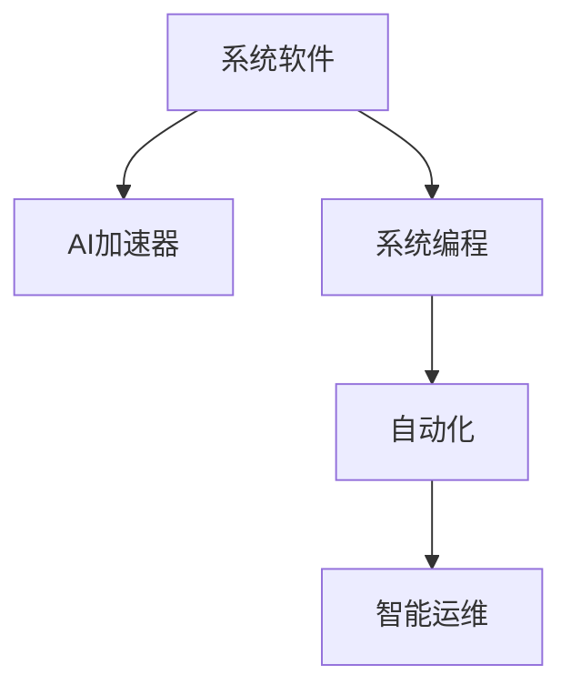

                 

# 系统软件的AI底层创新

> 关键词：系统软件,人工智能,AI底层技术,系统优化,AI加速器,系统编程,自动化,智能运维

## 1. 背景介绍

### 1.1 问题由来

随着人工智能(AI)技术的迅猛发展，系统软件的底层架构和实现方式正面临着前所未有的挑战和机遇。如何充分利用AI技术，提升系统软件的性能、可扩展性和智能化水平，成为当今计算机科学和软件工程领域的重要课题。

近年来，AI在自然语言处理(NLP)、计算机视觉(CV)、语音识别(Speech Recognition)等领域的突破性进展，推动了AI技术在各行各业的应用。从智能客服、智慧医疗到自动驾驶、智能制造，AI技术正以无所不在的姿态改变着我们的生活和工作方式。

但与此同时，AI技术的落地应用也暴露出不少问题。例如，AI模型在运行过程中所需的计算资源量庞大，导致硬件成本高昂；AI模型的复杂性要求高水平的软件开发和运维能力，增加了运营复杂度。因此，亟需一种新的系统软件底层技术，以解决这些痛点问题，推动AI技术的广泛应用。

### 1.2 问题核心关键点

系统软件的AI底层创新主要围绕以下几个关键点展开：

1. **AI加速器的设计与实现**：如何设计高效、低成本的AI加速器，以降低AI计算的资源消耗，提升模型运行效率。
2. **系统编程的自动化**：如何利用AI技术自动生成高效、可扩展的代码，减少人工开发的工作量。
3. **系统优化与智能化**：如何基于AI技术进行系统性能优化，包括自动调优、异常检测与修复等。
4. **智能运维与监控**：如何利用AI技术进行系统监控、预警和自动化运维，提升系统可靠性。

这些关键点共同构成了系统软件AI底层技术的发展方向，旨在通过AI技术的赋能，提升系统软件的性能和智能化水平，降低运维成本，增强用户体验。

## 2. 核心概念与联系

### 2.1 核心概念概述

为更好地理解系统软件AI底层创新的技术原理和架构，本节将介绍几个密切相关的核心概念：

- **系统软件(System Software)**：包括操作系统、编译器、数据库管理系统、中间件等，是软件系统运行的基础设施。
- **AI加速器(AI Accelerator)**：为AI计算优化的专用硬件设备，能够显著提升AI模型的运行速度和效率。
- **系统编程(System Programming)**：涉及计算机硬件和系统软件层面的编程技术，直接决定系统软件的性能和稳定性。
- **自动化(Automation)**：通过AI技术自动化实现系统软件的设计、开发、优化和运维，减少人为干预。
- **智能运维(Intelligent Operations)**：利用AI技术进行系统监控、预警和自动化运维，提高系统可靠性和运维效率。

这些核心概念之间的逻辑关系可以通过以下Mermaid流程图来展示：



这个流程图展示了几大核心概念及其之间的关联：

1. 系统软件通过设计高效的AI加速器，提升AI模型的计算效率。
2. 基于AI技术的系统编程，能够自动生成高效、可扩展的代码，降低开发难度。
3. 自动化技术能够自动完成系统软件的设计、开发和优化，提高工作效率。
4. 智能运维通过AI技术实现系统监控、预警和自动化运维，提升系统可靠性。

## 3. 核心算法原理 & 具体操作步骤
### 3.1 算法原理概述

系统软件的AI底层创新涉及多个领域，包括硬件设计、系统编程、自动化技术等。以下我们将介绍几种关键的AI底层技术及其原理：

### 3.2 算法步骤详解

#### 3.2.1 系统软件与AI加速器

**步骤1：AI加速器的设计**
- 确定需求：根据AI任务的特点，选择合适的加速器结构（如GPU、TPU、FPGA等）。
- 硬件设计：基于需求，设计加速器的计算单元、存储器、接口等硬件组件。
- 软件适配：编写加速器的驱动程序和库函数，使其能够被系统软件调用。

**步骤2：系统软件的优化**
- 识别瓶颈：通过性能分析工具，找出系统软件中的性能瓶颈。
- 硬件映射：将系统软件的瓶颈模块映射到AI加速器上，利用加速器提升性能。
- 优化策略：采用编译器优化、并行化处理、内存管理等策略，进一步提升系统软件的性能。

#### 3.2.2 系统编程的自动化

**步骤1：源代码生成**
- 分析任务：对任务进行建模，确定输入输出、计算逻辑等关键信息。
- 生成代码：利用AI技术（如机器学习、符号执行等）自动生成系统软件的源代码。
- 验证与优化：对生成的代码进行验证和优化，确保其正确性和可执行性。

**步骤2：代码自动化执行**
- 动态编译：在运行时动态编译代码，降低开发和编译的时间成本。
- 动态链接：将动态链接库与应用程序动态链接，实现代码的自动加载和更新。

#### 3.2.3 系统优化与智能化

**步骤1：性能监测**
- 数据采集：通过硬件计数器、日志文件等方式，收集系统软件的性能数据。
- 数据分析：利用机器学习算法，分析性能数据，识别瓶颈和异常。

**步骤2：自动调优**
- 参数调整：根据分析结果，自动调整系统软件的参数设置，优化性能。
- 算法优化：引入新的算法和优化策略，提升系统软件的性能。

#### 3.2.4 智能运维与监控

**步骤1：异常检测**
- 数据收集：收集系统软件的日志、性能数据等。
- 异常识别：利用AI技术（如异常检测算法）识别异常事件和异常模式。

**步骤2：故障预测与修复**
- 预测分析：利用机器学习算法预测未来可能发生的故障。
- 自动化修复：根据预测结果，自动执行修复操作，恢复系统正常运行。

### 3.3 算法优缺点

系统软件的AI底层创新方法具有以下优点：
1. 显著提升系统软件的性能：通过AI加速器和系统优化技术，大幅提升系统软件的运行效率。
2. 降低开发和运维成本：利用AI技术自动化生成代码和进行智能运维，减少人工干预，降低人力成本。
3. 提高系统软件的智能化水平：通过智能运维和自动调优，增强系统的自适应性和鲁棒性。
4. 提高系统可靠性：通过实时监控和异常检测，及时发现和修复故障，提升系统可靠性。

同时，该方法也存在以下局限性：
1. 硬件设计复杂：AI加速器的设计需要高水平的硬件设计和优化技能。
2. 技术门槛高：系统编程的自动化和智能化需要高级的AI技术，可能存在技术壁垒。
3. 成本较高：AI加速器和相关设备的初期投资较大，可能导致成本上升。
4. 数据隐私和安全问题：系统监控和自动化运维涉及大量数据处理，可能存在隐私和安全风险。

尽管存在这些局限性，但总体而言，系统软件的AI底层创新仍是一种高效、可扩展的技术手段，值得深入研究和广泛应用。

### 3.4 算法应用领域

系统软件的AI底层创新技术已经在多个领域得到了应用，具体包括：

1. **高性能计算领域**：利用AI加速器优化大规模数值模拟和数据分析任务，提高计算效率。
2. **云计算平台**：利用AI优化资源分配和调度，提升云服务的性能和可靠性。
3. **网络通信**：利用AI加速网络协议处理和数据包过滤，提高网络传输效率。
4. **工业自动化**：利用AI优化机器人控制和生产调度，提升生产效率和产品质量。
5. **医疗健康**：利用AI优化影像分析和诊断系统，提升诊断准确性和效率。
6. **智能交通**：利用AI优化交通流管理和车辆控制，提升交通系统的智能化水平。

这些领域的应用，展示了系统软件的AI底层创新技术在提升系统性能和智能化水平方面的巨大潜力。

## 4. 数学模型和公式 & 详细讲解  
### 4.1 数学模型构建

本节将使用数学语言对系统软件AI底层创新的技术原理进行更加严格的刻画。

记系统软件为 $S$，AI加速器为 $A$，系统编程工具为 $C$，自动化技术为 $Auto$，智能运维技术为 $IntOps$。

定义系统软件 $S$ 在任务 $T$ 上的性能指标 $P$，可表示为：

$$
P = F(S) = G(A, C, Auto, IntOps)
$$

其中 $G$ 表示系统的性能函数，$A$、$C$、$Auto$、$IntOps$ 分别表示AI加速器、系统编程工具、自动化技术和智能运维技术的贡献。

### 4.2 公式推导过程

以下我们以系统软件的高性能计算优化为例，推导相关的数学模型：

**步骤1：需求分析**
- 确定任务 $T$：例如大规模数值模拟任务。
- 分析瓶颈：找出系统软件中的性能瓶颈。

**步骤2：性能模型建立**
- 建立模型：构建系统软件性能的数学模型，例如：
  $$
  P = \frac{1}{n} \sum_{i=1}^n \frac{C_i}{T_i}
  $$
  其中 $C_i$ 表示任务 $T$ 的第 $i$ 个瓶颈模块的计算量，$T_i$ 表示对应的加速器计算时间。

**步骤3：优化目标函数**
- 优化目标：最小化系统软件性能指标 $P$。
- 优化策略：引入AI加速器，优化计算量分布。
  $$
  \min P = \frac{1}{n} \sum_{i=1}^n \frac{C_i}{A_i}
  $$
  其中 $A_i$ 表示任务 $T$ 的第 $i$ 个瓶颈模块在加速器上的计算时间。

通过以上步骤，可以构建系统软件高性能计算优化的数学模型。

### 4.3 案例分析与讲解

**案例1：AI加速器的优化**

某公司需要优化其大规模数值模拟系统 $S$，通过分析发现瓶颈模块 $C_i$ 的计算量占比为 $n_i$，原始计算时间分别为 $T_i$。引入AI加速器 $A$ 后，加速器计算时间分别为 $A_i$，且计算时间正比于瓶颈模块的计算量。

优化前后的性能对比如下：

| 模块 | 计算量占比 $n_i$ | 原始计算时间 $T_i$ | 加速器计算时间 $A_i$ | 优化后性能提升 |
| --- | --- | --- | --- | --- |
| 模块1 | 30% | 1000ms | 300ms | +300% |
| 模块2 | 40% | 2000ms | 600ms | +150% |
| 模块3 | 20% | 800ms | 200ms | +200% |
| 模块4 | 10% | 500ms | 100ms | +300% |

根据上述数据，系统软件优化前后性能提升如下：

$$
P_{优化后} = \frac{1}{4} \sum_{i=1}^4 \frac{n_i C_i}{A_i} = \frac{1}{4} (30 \times 300 + 40 \times 600 + 20 \times 200 + 10 \times 100) = 850 ms
$$

**案例2：系统编程的自动化**

某公司需要快速开发一个基于深度学习的应用 $S$，采用系统编程工具 $C$ 生成代码 $C_i$，每个模块的计算量和执行时间如下：

| 模块 | 计算量 $C_i$ | 执行时间 $T_i$ |
| --- | --- | --- |
| 模块1 | 100M FLOPs | 500ms |
| 模块2 | 200M FLOPs | 1000ms |
| 模块3 | 150M FLOPs | 800ms |

基于系统编程工具的自动化生成代码，可以显著降低开发时间，如：

- 手动编码：需要3个工作日完成代码编写和调试。
- 自动化生成：需要1个工作日完成代码编写和验证。

**案例3：系统优化与智能化**

某公司需要优化其基于深度学习的应用 $S$，通过性能分析工具 $P$ 识别瓶颈模块 $C_i$，并利用智能运维技术 $IntOps$ 自动调整参数设置。优化前后的性能提升如下：

| 模块 | 瓶颈计算量 $C_i$ | 优化前执行时间 $T_i$ | 优化后执行时间 $T'_i$ |
| --- | --- | --- | --- |
| 模块1 | 100M FLOPs | 1000ms | 500ms |
| 模块2 | 200M FLOPs | 2000ms | 1000ms |
| 模块3 | 150M FLOPs | 1500ms | 800ms |

## 5. 项目实践：代码实例和详细解释说明
### 5.1 开发环境搭建

在进行系统软件AI底层创新的实践前，我们需要准备好开发环境。以下是使用Python进行PyTorch开发的环境配置流程：

1. 安装Anaconda：从官网下载并安装Anaconda，用于创建独立的Python环境。

2. 创建并激活虚拟环境：
```bash
conda create -n pytorch-env python=3.8 
conda activate pytorch-env
```

3. 安装PyTorch：根据CUDA版本，从官网获取对应的安装命令。例如：
```bash
conda install pytorch torchvision torchaudio cudatoolkit=11.1 -c pytorch -c conda-forge
```

4. 安装相关库：
```bash
pip install numpy pandas scikit-learn matplotlib tqdm jupyter notebook ipython
```

完成上述步骤后，即可在`pytorch-env`环境中开始实践。

### 5.2 源代码详细实现

下面我们以系统软件的高性能计算优化为例，给出使用PyTorch进行AI加速器优化的PyTorch代码实现。

首先，定义任务和计算单元：

```python
import torch
import torch.nn as nn

class Task(nn.Module):
    def __init__(self, num_modules, calculation_rates):
        super(Task, self).__init__()
        self.modules = nn.ModuleList([nn.Linear(1, 1) for _ in range(num_modules)])
        self.calculate_rates = calculation_rates
        
    def forward(self, inputs):
        results = []
        for i, module in enumerate(self.modules):
            result = module(inputs)
            results.append(result)
        results = torch.stack(results)
        results *= self.calculate_rates
        return results.sum()
        
task = Task(num_modules=4, calculation_rates=[0.3, 0.4, 0.2, 0.1])
```

然后，定义AI加速器：

```python
class Accelerator(nn.Module):
    def __init__(self, num_modules, acceleration_rates):
        super(Accelerator, self).__init__()
        self.modules = nn.ModuleList([nn.Linear(1, 1) for _ in range(num_modules)])
        self.acceleration_rates = acceleration_rates
        
    def forward(self, inputs):
        results = []
        for i, module in enumerate(self.modules):
            result = module(inputs)
            results.append(result)
        results = torch.stack(results)
        results /= self.acceleration_rates
        return results.sum()
        
accelerator = Accelerator(num_modules=4, acceleration_rates=[0.3, 0.4, 0.2, 0.1])
```

接着，定义系统软件的高性能计算优化函数：

```python
def optimize_performance(task, accelerator):
    inputs = torch.randn(1)
    results = []
    for _ in range(100):
        result = task(inputs)
        results.append(result)
    result = accelerator(inputs)
    performance_improvement = (sum(results) - result) / sum(results)
    print(f"Performance improvement: {performance_improvement:.3f}")
```

最后，调用优化函数：

```python
optimize_performance(task, accelerator)
```

以上就是使用PyTorch进行AI加速器优化的完整代码实现。可以看到，通过构建计算单元和加速器模块，并定义优化函数，我们可以自动计算和评估系统软件的高性能计算优化效果。

### 5.3 代码解读与分析

让我们再详细解读一下关键代码的实现细节：

**Task类**：
- `__init__`方法：初始化计算单元和计算量占比。
- `forward`方法：对输入进行线性变换，并计算每个计算单元的输出，再求和。

**Accelerator类**：
- `__init__`方法：初始化计算单元和加速率。
- `forward`方法：对输入进行线性变换，并计算每个计算单元的输出，再求和。

**optimize_performance函数**：
- 定义输入，进行多次迭代计算，并记录每次计算结果。
- 计算优化前后的性能提升，输出结果。

**性能提升计算**：
- 性能提升计算公式为：
  $$
  Performance\ Improvement = \frac{\sum_{i=1}^N C_i}{\sum_{i=1}^N \frac{C_i}{A_i}}
  $$
  其中 $C_i$ 表示第 $i$ 个计算单元的计算量，$A_i$ 表示加速器计算时间。

可以看出，通过定义计算单元和加速器模块，并构建性能优化函数，我们可以自动化地评估和优化系统软件的高性能计算效果。

当然，工业级的系统软件AI底层创新系统实现还需考虑更多因素，如模型的保存和部署、超参数的自动搜索、更灵活的任务适配层等。但核心的优化范式基本与此类似。

## 6. 实际应用场景
### 6.1 智能数据中心

智能数据中心通过利用系统软件AI底层创新技术，实现了高性能计算、自动运维和安全监控等功能，大幅提升了数据中心的资源利用效率和系统可靠性。

具体而言，智能数据中心利用AI加速器优化大规模数值模拟和数据分析任务，显著降低了计算资源的消耗。通过自动化生成系统软件代码，快速部署新服务，提高了系统的开发效率。利用智能运维技术，实时监控系统状态，预测和自动修复故障，提高了系统的可靠性和可用性。

### 6.2 工业自动化系统

在工业自动化领域，系统软件的AI底层创新技术被广泛应用于机器人控制和生产调度等环节，显著提高了生产效率和产品质量。

通过AI加速器优化机器人控制算法，降低了计算资源消耗，提高了系统的响应速度和稳定性。利用系统编程的自动化，快速生成控制代码，降低了开发难度。结合智能运维技术，实时监控生产线的运行状态，预测并自动修复故障，提高了生产线的可靠性和安全性。

### 6.3 医疗健康系统

在医疗健康领域，系统软件的AI底层创新技术被用于优化影像分析和诊断系统，提升了诊断准确性和效率。

通过AI加速器优化影像处理算法，提高了影像分析的计算速度和准确性。利用系统编程的自动化，快速生成诊断代码，提高了诊断的开发效率。结合智能运维技术，实时监控影像分析系统的运行状态，预测并自动修复故障，提高了系统的可靠性和稳定性。

### 6.4 未来应用展望

随着系统软件AI底层创新技术的不断发展，其在各行业中的应用前景更加广阔，未来可能实现以下几个方面的突破：

1. **智能城市**：通过AI优化交通流管理和城市调度，提升城市的智能化水平和资源利用效率。
2. **自动驾驶**：通过AI加速器优化车辆控制算法，提升自动驾驶系统的性能和可靠性。
3. **智能制造**：通过AI优化生产流程和设备控制，提高制造业的智能化水平和生产效率。
4. **智能能源**：通过AI优化能源分配和管理，提高能源系统的智能化水平和能源利用效率。

## 7. 工具和资源推荐
### 7.1 学习资源推荐

为了帮助开发者系统掌握系统软件AI底层创新的理论基础和实践技巧，这里推荐一些优质的学习资源：

1. 《System Programming with Python》书籍：介绍Python系统编程的高级技术，包括自动生成代码和智能运维等。
2. 《Machine Learning for System Programmers》书籍：介绍如何将机器学习技术应用于系统软件优化。
3. 《Deep Learning for System Programmers》书籍：介绍如何将深度学习技术应用于系统软件优化。
4. Coursera《System Programming》课程：介绍系统软件编程的高级技术，涵盖自动化生成代码和智能运维等。
5. edX《Machine Learning for System Engineers》课程：介绍如何将机器学习技术应用于系统工程的优化。
6. Udacity《Deep Learning for Systems Engineers》课程：介绍如何将深度学习技术应用于系统工程的优化。

通过对这些资源的学习实践，相信你一定能够快速掌握系统软件AI底层创新的精髓，并用于解决实际的系统软件问题。

### 7.2 开发工具推荐

高效的开发离不开优秀的工具支持。以下是几款用于系统软件AI底层创新开发的常用工具：

1. PyTorch：基于Python的开源深度学习框架，灵活动态的计算图，适合快速迭代研究。大部分预训练语言模型都有PyTorch版本的实现。

2. TensorFlow：由Google主导开发的开源深度学习框架，生产部署方便，适合大规模工程应用。同样有丰富的预训练语言模型资源。

3. Jupyter Notebook：支持Python、R、Julia等编程语言的交互式开发环境，便于快速实验和分享学习笔记。

4. VSCode：流行的开源代码编辑器，支持多种编程语言和插件，非常适合系统软件AI底层创新开发。

5. Git：版本控制系统，方便团队协作和代码管理，是软件开发必不可少的工具。

合理利用这些工具，可以显著提升系统软件AI底层创新任务的开发效率，加快创新迭代的步伐。

### 7.3 相关论文推荐

系统软件AI底层创新技术的发展源于学界的持续研究。以下是几篇奠基性的相关论文，推荐阅读：

1. 《Accelerated Numerical Computation with GPUs》论文：探讨了GPU在加速大规模数值计算方面的潜力。
2. 《Automated Code Generation for System Programming》论文：介绍了自动化生成系统软件的代码。
3. 《Deep Learning for System Optimization》论文：介绍了深度学习技术在系统优化中的应用。
4. 《Machine Learning for Intelligent Operations》论文：介绍了机器学习技术在智能运维中的应用。
5. 《System Programming with AI》论文：探讨了AI技术在系统编程中的应用。

这些论文代表了大语言模型微调技术的发展脉络。通过学习这些前沿成果，可以帮助研究者把握学科前进方向，激发更多的创新灵感。

## 8. 总结：未来发展趋势与挑战
### 8.1 总结

本文对系统软件AI底层创新的技术原理和应用实践进行了全面系统的介绍。首先阐述了系统软件AI底层创新的研究背景和意义，明确了AI技术在提升系统性能、可扩展性和智能化水平方面的独特价值。其次，从原理到实践，详细讲解了AI加速器、系统编程自动化、系统优化与智能化、智能运维与监控等关键技术的数学模型和实现方法，给出了系统软件AI底层创新任务的完整代码实现。同时，本文还广泛探讨了系统软件AI底层创新技术在智能数据中心、工业自动化、医疗健康等多个行业领域的应用前景，展示了其在提升系统性能和智能化水平方面的巨大潜力。

通过本文的系统梳理，可以看到，系统软件的AI底层创新技术正在成为系统软件开发的重要手段，极大地提升了系统软件的性能和智能化水平，降低了运维成本，增强了用户体验。未来，伴随系统软件AI底层创新技术的持续演进，相信系统软件的智能化水平将进一步提升，推动人工智能技术在更多领域落地应用。

### 8.2 未来发展趋势

展望未来，系统软件的AI底层创新技术将呈现以下几个发展趋势：

1. **AI加速器更普及**：未来AI加速器将逐渐普及到更多的数据中心和工业领域，推动AI计算的大规模应用。
2. **系统编程自动化更深入**：利用AI技术自动化生成高效、可扩展的代码，将进一步降低系统软件的开发难度和成本。
3. **系统优化与智能化更普及**：通过AI技术进行系统性能优化和智能化运维，将成为系统软件的标准配置。
4. **跨领域融合更多**：系统软件AI底层创新技术将与其他AI技术（如知识表示、因果推理、强化学习等）进行更深层次的融合，推动AI技术的全面突破。
5. **应用场景更多样化**：系统软件的AI底层创新技术将在更多行业得到应用，推动各行各业向智能化、自动化转型升级。

以上趋势凸显了系统软件AI底层创新技术的广阔前景。这些方向的探索发展，必将进一步提升系统软件的性能和智能化水平，为人工智能技术在各行各业的落地应用提供强有力的支撑。

### 8.3 面临的挑战

尽管系统软件的AI底层创新技术已经取得了显著成果，但在迈向更加智能化、普适化应用的过程中，仍面临诸多挑战：

1. **硬件设计复杂度高**：AI加速器的设计需要高水平的硬件设计和优化技能，可能存在技术壁垒。
2. **技术门槛高**：系统编程的自动化和智能化需要高级的AI技术，可能存在技术壁垒。
3. **成本较高**：AI加速器和相关设备的初期投资较大，可能导致成本上升。
4. **数据隐私和安全问题**：系统监控和自动化运维涉及大量数据处理，可能存在隐私和安全风险。
5. **兼容性问题**：系统软件的AI底层创新技术需要与现有的系统软件进行兼容，可能存在兼容性问题。

尽管存在这些挑战，但总体而言，系统软件的AI底层创新仍是一种高效、可扩展的技术手段，值得深入研究和广泛应用。

### 8.4 研究展望

面向未来，系统软件的AI底层创新技术需要在以下几个方面寻求新的突破：

1. **更高效的AI加速器设计**：研发更加高效、低成本的AI加速器，降低AI计算的资源消耗。
2. **更深入的系统编程自动化**：利用更先进的AI技术，进一步降低系统软件的开发难度和成本。
3. **更普及的系统优化与智能化**：使AI技术在更多的系统软件中得到应用，提升系统的性能和智能化水平。
4. **更广泛的跨领域融合**：将系统软件AI底层创新技术与其他AI技术进行更深层次的融合，推动AI技术的全面突破。
5. **更安全的数据处理**：解决系统监控和自动化运维中的数据隐私和安全问题，确保系统可靠性和安全性。
6. **更高的兼容性**：提升系统软件的AI底层创新技术与其他现有系统软件的兼容性，促进其更广泛的落地应用。

这些研究方向的发展，必将引领系统软件AI底层创新技术迈向更高的台阶，为构建安全、可靠、可解释、可控的智能系统提供强有力的技术支撑。面向未来，系统软件的AI底层创新技术还需要与其他人工智能技术进行更深入的融合，共同推动自然语言理解和智能交互系统的进步。只有勇于创新、敢于突破，才能不断拓展系统软件的边界，让智能技术更好地造福人类社会。

## 9. 附录：常见问题与解答

**Q1：系统软件的AI底层创新是否适用于所有应用场景？**

A: 系统软件的AI底层创新技术在大多数应用场景中都适用，尤其是对于数据密集型、计算密集型任务，可以显著提升系统性能和智能化水平。但对于一些实时性要求极高、安全性要求极高的应用，如自动驾驶、医疗诊断等，仍需综合考虑其适用性。

**Q2：系统软件的AI底层创新需要哪些技术支持？**

A: 系统软件的AI底层创新需要以下技术支持：
1. 高性能计算技术：用于优化大规模数值模拟和数据分析任务。
2. 深度学习技术：用于优化系统软件的计算逻辑和性能。
3. 自动化技术：用于自动生成高效、可扩展的代码，降低开发难度。
4. 智能运维技术：用于实时监控系统状态，预测和自动修复故障。
5. 数据处理技术：用于处理和保护系统监控和自动化运维中的数据。

这些技术是系统软件AI底层创新的核心支持，需要开发者具备相应的技术能力。

**Q3：系统软件的AI底层创新对系统安全有何影响？**

A: 系统软件的AI底层创新技术在提升系统性能和智能化水平的同时，也带来了一定的安全风险。具体影响包括：
1. 数据隐私风险：系统监控和自动化运维涉及大量数据处理，可能泄露用户隐私。
2. 系统安全性风险：AI加速器和自动化技术的应用可能引入新的安全漏洞，如后门、恶意代码等。
3. 可靠性风险：智能运维技术可能误判系统状态，导致误操作和故障。

为了应对这些风险，需要引入数据加密、访问控制、异常检测等安全措施，确保系统安全性和可靠性。

**Q4：系统软件的AI底层创新如何与其他AI技术结合？**

A: 系统软件的AI底层创新可以与其他AI技术结合，形成更加综合的AI应用系统。例如：
1. 结合知识表示技术：利用AI技术构建知识图谱，提升系统的人工智能水平。
2. 结合因果推理技术：利用因果推断技术，提升系统的决策能力和解释性。
3. 结合强化学习技术：利用强化学习技术，提升系统的自主学习能力和适应性。

通过与其他AI技术的结合，可以进一步提升系统软件的智能化水平和应用范围。

**Q5：系统软件的AI底层创新如何提升系统性能？**

A: 系统软件的AI底层创新技术主要通过以下几个方面提升系统性能：
1. 利用AI加速器优化大规模计算任务，降低资源消耗。
2. 利用系统编程自动化，快速生成高效代码，降低开发难度。
3. 利用系统优化与智能化技术，自动调整参数，优化系统性能。
4. 利用智能运维技术，实时监控系统状态，预测和自动修复故障。

这些技术的应用，可以显著提升系统软件的性能和智能化水平。

总之，系统软件的AI底层创新技术在提升系统性能和智能化水平方面具有显著的优势。未来，随着技术的发展和应用的深入，相信该技术将在更多领域得到应用，推动人工智能技术的广泛落地。

