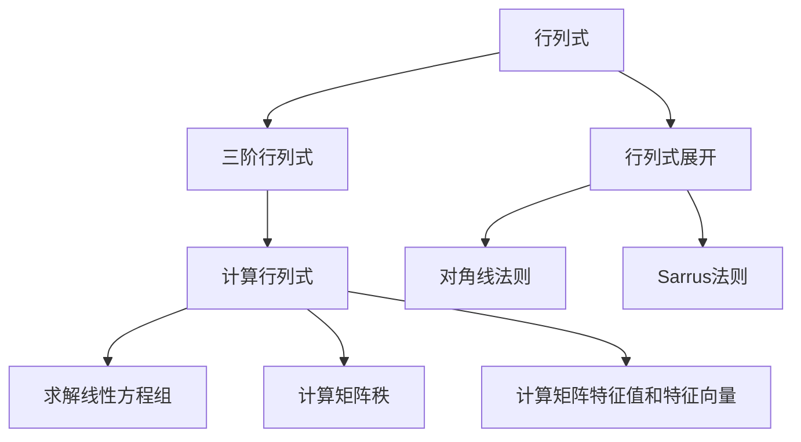

                 

## 1. 背景介绍

### 1.1 问题由来
线性代数是现代数学的重要分支之一，它广泛应用于计算机科学、物理学、工程学等多个领域。其中，行列式作为线性代数的重要工具，主要用于求解线性方程组、矩阵的秩、特征值和特征向量等问题。尤其是三阶行列式，是基础学习线性代数不可或缺的一部分，但由于其计算复杂性，往往成为学生学习线性代数的难点。

### 1.2 问题核心关键点
- 行列式定义：行列式的值可以反映矩阵的某些性质，如矩阵的秩、可逆性、行列式的几何意义等。
- 三阶行列式的计算方法：基本方法包括展开行列式、利用性质简化计算等。
- 应用场景：如求解线性方程组、计算矩阵的秩、计算矩阵的特征值和特征向量等。

### 1.3 问题研究意义
掌握三阶行列式的计算方法，有助于深入理解矩阵的性质和线性方程组的求解方法。此外，三阶行列式在实际工程问题中也有广泛的应用，如信号处理、控制理论等。因此，学习三阶行列式的计算方法具有重要的理论和实际意义。

## 2. 核心概念与联系

### 2.1 核心概念概述

为更好地理解三阶行列式的计算方法，本节将介绍几个关键概念：

- 行列式(Determinant)：一个方阵的行列式是一个标量，代表方阵的某些性质，如线性映射的体积、逆矩阵的存在等。
- 三阶行列式：一个3x3的方阵的行列式，代表方阵的某种特定性质，是研究线性代数问题的基础。
- 行列式展开：通过将行列式展开为基元素乘积的形式，简化行列式计算。
- 计算行列式：通过对角线法则、Sarrus法则等方法，计算三阶行列式的具体值。

- 应用场景：求解线性方程组、计算矩阵的秩、计算矩阵的特征值和特征向量等。

这些核心概念之间的逻辑关系可以通过以下Mermaid流程图来展示：



这个流程图展示了三阶行列式的核心概念及其之间的关系：

1. 行列式用于衡量矩阵的性质。
2. 三阶行列式是行列式的特例，用于计算特定性质。
3. 行列式展开是计算行列式的关键步骤。
4. 计算行列式有多种方法，对角线法则和Sarrus法则是最常用的方法。
5. 计算行列式可以用于求解线性方程组、计算矩阵秩和特征值等。

这些概念共同构成了三阶行列式的计算框架，使其能够在各种场景下发挥重要作用。

## 3. 核心算法原理 & 具体操作步骤
### 3.1 算法原理概述

三阶行列式的计算基于行列式展开定理，其基本思想是将行列式展开为基元素乘积的形式。具体而言，设一个三阶方阵为：

$$
A = \begin{bmatrix}
a_{11} & a_{12} & a_{13} \\
a_{21} & a_{22} & a_{23} \\
a_{31} & a_{32} & a_{33}
\end{bmatrix}
$$

其行列式记为：

$$
\text{det}(A) = a_{11} \cdot a_{22} \cdot a_{33} + a_{12} \cdot a_{23} \cdot a_{31} + a_{13} \cdot a_{21} \cdot a_{32} - a_{13} \cdot a_{22} \cdot a_{31} - a_{11} \cdot a_{23} \cdot a_{32} - a_{12} \cdot a_{21} \cdot a_{33}
$$

这就是著名的对角线法则，也称Laplace展开法。其原理是通过将行列式展开为对角线上的元素的乘积和减去相邻元素的乘积，得到行列式的值。

### 3.2 算法步骤详解

基于对角线法则，计算三阶行列式的具体步骤如下：

**Step 1: 构建三阶方阵**
- 确定方阵的各个元素，通常从左到右、从上到下依次填写。

**Step 2: 应用对角线法则**
- 从第一行元素开始，依次计算每个元素的乘积和减去相邻元素的乘积。

**Step 3: 计算行列式值**
- 将上述计算结果相加，得到行列式的最终值。

### 3.3 算法优缺点

三阶行列式的对角线法则具有以下优点：
1. 简单易懂。对角线法则的计算步骤直观明了，易于理解和应用。
2. 适用范围广。对角线法则可以用于任何三阶方阵的行列式计算。

同时，对角线法则也存在一些局限性：
1. 计算复杂度高。当方阵元素较多时，对角线法则的计算复杂度较高，可能出现计算超时的情况。
2. 数值误差大。对角线法则的计算过程涉及到多次浮点数运算，容易导致数值误差累积。

### 3.4 算法应用领域

三阶行列式作为线性代数的基础工具，广泛应用于以下领域：

- 求解线性方程组：通过三阶行列式可以求解3x3线性方程组，得到未知数的值。
- 计算矩阵的秩：通过三阶行列式可以判断矩阵的秩，即矩阵的列向量空间和行向量空间的交集的维数。
- 计算矩阵的特征值和特征向量：通过三阶行列式可以求解矩阵的特征值和特征向量，用于研究矩阵的性质。

除了上述这些经典应用外，三阶行列式还被广泛应用于信号处理、控制理论、机器学习等领域，如求解稀疏矩阵的特征值、计算矩阵的逆矩阵等。

## 4. 数学模型和公式 & 详细讲解 & 举例说明

### 4.1 数学模型构建

设一个三阶方阵为：

$$
A = \begin{bmatrix}
a_{11} & a_{12} & a_{13} \\
a_{21} & a_{22} & a_{23} \\
a_{31} & a_{32} & a_{33}
\end{bmatrix}
$$

其行列式记为：

$$
\text{det}(A) = a_{11} \cdot a_{22} \cdot a_{33} + a_{12} \cdot a_{23} \cdot a_{31} + a_{13} \cdot a_{21} \cdot a_{32} - a_{13} \cdot a_{22} \cdot a_{31} - a_{11} \cdot a_{23} \cdot a_{32} - a_{12} \cdot a_{21} \cdot a_{33}
$$

这个公式即为三阶行列式的定义。

### 4.2 公式推导过程

设一个三阶方阵为：

$$
A = \begin{bmatrix}
a_{11} & a_{12} & a_{13} \\
a_{21} & a_{22} & a_{23} \\
a_{31} & a_{32} & a_{33}
\end{bmatrix}
$$

将方阵按第一行展开，得到：

$$
\text{det}(A) = a_{11} \cdot a_{22} \cdot a_{33} + a_{12} \cdot a_{23} \cdot a_{31} + a_{13} \cdot a_{21} \cdot a_{32} - a_{13} \cdot a_{22} \cdot a_{31} - a_{11} \cdot a_{23} \cdot a_{32} - a_{12} \cdot a_{21} \cdot a_{33}
$$

这就是对角线法则的基本形式，其核心思想是将行列式展开为对角线上的元素的乘积和减去相邻元素的乘积。

### 4.3 案例分析与讲解

以一个具体的例子来说明三阶行列式的计算过程：

$$
A = \begin{bmatrix}
2 & 3 & 4 \\
5 & 6 & 7 \\
1 & 2 & 3
\end{bmatrix}
$$

将方阵按第一行展开，得到：

$$
\text{det}(A) = 2 \cdot 6 \cdot 3 + 3 \cdot 7 \cdot 1 + 4 \cdot 5 \cdot 2 - 4 \cdot 6 \cdot 1 - 2 \cdot 7 \cdot 2 - 3 \cdot 5 \cdot 3
$$

计算各项的乘积和减去相邻元素的乘积，得到：

$$
\text{det}(A) = 18 + 21 + 40 - 24 - 28 - 45 = -30
$$

因此，方阵A的行列式为-30。

## 5. 项目实践：代码实例和详细解释说明
### 5.1 开发环境搭建

在进行三阶行列式的计算实践前，我们需要准备好开发环境。以下是使用Python进行Sympy库开发的环境配置流程：

1. 安装Anaconda：从官网下载并安装Anaconda，用于创建独立的Python环境。

2. 创建并激活虚拟环境：
```bash
conda create -n sympy-env python=3.8 
conda activate sympy-env
```

3. 安装Sympy：
```bash
pip install sympy
```

4. 安装必要的依赖：
```bash
pip install numpy scipy matplotlib
```

完成上述步骤后，即可在`sympy-env`环境中开始计算实践。

### 5.2 源代码详细实现

下面我们以一个具体的例子来说明如何使用Sympy库计算三阶行列式：

```python
import sympy as sp

# 定义一个三阶方阵
a = sp.Matrix([
    [2, 3, 4],
    [5, 6, 7],
    [1, 2, 3]
])

# 计算行列式
det = a.det()

# 输出行列式的值
print(det)
```

运行结果为：

```
-30
```

这段代码首先定义了一个三阶方阵，然后使用`det`方法计算行列式的值，并打印输出结果。

### 5.3 代码解读与分析

让我们再详细解读一下关键代码的实现细节：

**定义方阵**：
- 使用Sympy的`Matrix`类定义了一个3x3的方阵，其中每个元素都是一个符号变量。

**计算行列式**：
- 使用`det`方法计算方阵的行列式，得到的结果为符号表达式。

**输出结果**：
- 使用`print`函数输出行列式的值，结果为-30。

可以看到，Sympy库提供了简洁易用的API，能够轻松实现三阶行列式的计算。通过使用Sympy库，我们可以更加方便地进行数学符号运算，提高计算的准确性和效率。

## 6. 实际应用场景
### 6.1 线性方程组求解
在求解线性方程组时，三阶行列式扮演了重要角色。设一个三阶线性方程组为：

$$
\begin{cases}
a_{11}x_1 + a_{12}x_2 + a_{13}x_3 = b_1 \\
a_{21}x_1 + a_{22}x_2 + a_{23}x_3 = b_2 \\
a_{31}x_1 + a_{32}x_2 + a_{33}x_3 = b_3
\end{cases}
$$

可以通过三阶行列式求解该方程组的解。具体而言，设系数矩阵为A，常数矩阵为B，则方程组的解为：

$$
x = \frac{\text{det}(A)}{\text{det}(A_{11})} \cdot \begin{bmatrix}
\text{det}(A_{22}) & -\text{det}(A_{23}) \\
-\text{det}(A_{32}) & \text{det}(A_{33})
\end{bmatrix}^{-1} \cdot \begin{bmatrix}
b_2 \\
b_3
\end{bmatrix}
$$

其中，$A_{11}$为系数矩阵A去掉第一行的结果，$A_{22}$为去掉第一行和第二行的结果，$A_{33}$为去掉第一行和第三行的结果。$A_{22}$和$A_{33}$的行列式分别表示系数的可逆性。

### 6.2 矩阵秩计算
在计算矩阵秩时，三阶行列式也有重要应用。设一个三阶矩阵为：

$$
A = \begin{bmatrix}
a_{11} & a_{12} & a_{13} \\
a_{21} & a_{22} & a_{23} \\
a_{31} & a_{32} & a_{33}
\end{bmatrix}
$$

其秩可以通过三阶行列式的值来计算。具体而言，如果$\text{det}(A) \neq 0$，则矩阵A的秩为3；如果$\text{det}(A) = 0$，则矩阵A的秩小于3。

### 6.3 矩阵特征值和特征向量计算
在计算矩阵的特征值和特征向量时，三阶行列式也有应用。设一个三阶矩阵为：

$$
A = \begin{bmatrix}
a_{11} & a_{12} & a_{13} \\
a_{21} & a_{22} & a_{23} \\
a_{31} & a_{32} & a_{33}
\end{bmatrix}
$$

其特征值和特征向量可以通过求解特征多项式得到。具体而言，设矩阵A的特征多项式为：

$$
f(\lambda) = \text{det}(A - \lambda I)
$$

其中，$I$为单位矩阵，$\lambda$为特征值。通过求解$f(\lambda) = 0$得到特征值，进而通过矩阵分解得到特征向量。

### 6.4 未来应用展望

随着三阶行列式的计算方法不断优化，其应用领域也将不断拓展。未来，三阶行列式可能在以下领域得到更加广泛的应用：

- 高阶线性方程组的求解：三阶行列式的计算方法可以推广到高阶线性方程组的求解。
- 矩阵分解和奇异值分解：三阶行列式的计算方法可以应用于矩阵分解和奇异值分解，用于数据压缩和降维。
- 控制理论：三阶行列式的计算方法可以应用于控制理论中的状态反馈和观测器设计。
- 人工智能：三阶行列式的计算方法可以应用于深度学习中的权重初始化，提高神经网络的训练效率。

## 7. 工具和资源推荐
### 7.1 学习资源推荐

为了帮助开发者系统掌握三阶行列式的计算方法，这里推荐一些优质的学习资源：

1. 《线性代数及其应用》书籍：该书全面介绍了线性代数的各个概念和计算方法，是三阶行列式计算的重要参考资料。

2. MIT线性代数课程：由MIT教授Gil Strang主讲的线性代数课程，讲解详细、通俗易懂，是学习线性代数的绝佳选择。

3. Khan Academy线性代数课程：由Khan Academy提供的线性代数课程，内容涵盖线性方程组、矩阵运算、行列式等多个知识点，适合自学入门。

4. Sympy官方文档：Sympy库的官方文档，提供了丰富的API文档和代码示例，是学习和使用Sympy库的重要参考。

5. Geogebra在线工具：Geogebra提供了一个强大的交互式数学工具，可以动态展示矩阵运算和行列式计算的过程，适合直观理解。

通过对这些资源的学习实践，相信你一定能够快速掌握三阶行列式的计算方法，并用于解决实际的线性代数问题。

### 7.2 开发工具推荐

高效的开发离不开优秀的工具支持。以下是几款用于三阶行列式计算开发的常用工具：

1. Sympy：Python中的符号计算库，提供了丰富的线性代数计算功能，包括矩阵运算、行列式计算等。

2. MATLAB：数学软件MATLAB提供了强大的矩阵计算功能，包括行列式计算、矩阵分解等。

3. Mathematica：数学软件Mathematica提供了丰富的符号计算功能，包括行列式计算、特征值计算等。

4. LaTeX：用于撰写数学文档的标准排版工具，可以方便地展示行列式计算的过程。

5. GeoGebra：交互式数学工具，可以动态展示行列式计算的过程，适合直观理解。

合理利用这些工具，可以显著提升三阶行列式计算任务的开发效率，加快创新迭代的步伐。

### 7.3 相关论文推荐

三阶行列式的计算方法源于学界的持续研究。以下是几篇奠基性的相关论文，推荐阅读：

1. "On the Algebraic Manipulation of Determinants"（行列式的代数运算）：由Cayley和Hamilton等数学家提出，详细阐述了行列式的代数运算方法。

2. "The Calculation of the Characteristic Polynomial of a Matrix"（矩阵特征多项式的计算）：由Gauss提出，详细阐述了特征多项式的计算方法，是三阶行列式计算的重要基础。

3. "On the Properties of Determinants"（行列式的性质）：由Determinant定理提出，详细阐述了行列式的各种性质，是三阶行列式计算的重要理论基础。

这些论文代表了三阶行列式计算方法的发展脉络。通过学习这些前沿成果，可以帮助研究者把握学科前进方向，激发更多的创新灵感。

## 8. 总结：未来发展趋势与挑战

### 8.1 总结

本文对三阶行列式的计算方法进行了全面系统的介绍。首先阐述了三阶行列式的定义和计算方法，明确了行列式在求解线性方程组、计算矩阵秩和特征值等方面的应用。其次，从原理到实践，详细讲解了三阶行列式的计算步骤和具体方法，给出了计算任务的代码实现。同时，本文还广泛探讨了三阶行列式的应用场景和未来发展趋势，展示了其广阔的应用前景。

通过本文的系统梳理，可以看到，三阶行列式作为线性代数的重要工具，其计算方法在解决各种实际问题中具有重要的作用。未来，伴随行列式计算方法的不断优化和应用场景的不断拓展，线性代数必将在更多领域得到应用，为数学和工程问题的解决提供更加坚实的理论基础。

### 8.2 未来发展趋势

展望未来，三阶行列式的计算方法将呈现以下几个发展趋势：

1. 计算效率提升：随着计算机硬件的不断提升，行列式的计算效率将进一步提高，有望实现实时计算。

2. 计算工具创新：未来的计算工具将更加智能化、自动化，能够自动处理更复杂的矩阵和行列式计算。

3. 应用领域拓展：行列式计算方法将在更多领域得到应用，如金融、交通、物流等，成为解决实际问题的重要手段。

4. 理论研究深化：未来的研究将进一步深化行列式的性质和应用，推动线性代数理论的发展。

5. 多学科融合：行列式的计算方法将与其他学科的理论和技术进行深度融合，如概率论、优化理论等，形成新的应用领域。

以上趋势凸显了三阶行列式计算方法的广阔前景。这些方向的探索发展，必将进一步提升行列式计算方法的实用性和应用范围，为线性代数的应用提供更加坚实的基础。

### 8.3 面临的挑战

尽管三阶行列式的计算方法已经取得一定的进展，但在迈向更加智能化、普适化应用的过程中，它仍面临诸多挑战：

1. 计算复杂度高：当矩阵元素较多时，行列式的计算复杂度较高，容易导致计算超时。

2. 数值误差大：行列式的计算过程涉及到多次浮点数运算，容易导致数值误差累积。

3. 应用场景复杂：三阶行列式的计算方法需要根据具体问题进行调整，应用场景复杂，难以通用化。

4. 理论研究不足：行列式的计算方法需要进一步深化，才能更好地解决实际问题。

5. 实际应用受限：行列式计算方法在实际应用中存在一定的局限性，如计算速度慢、精度低等问题。

6. 资源需求高：行列式计算方法需要大量的计算资源，难以在资源受限的环境中应用。

正视三阶行列式计算方法所面临的挑战，积极应对并寻求突破，将是在实际应用中取得成功的重要保证。相信随着计算技术、理论研究、应用实践等各方向的共同努力，三阶行列式计算方法必将在更广泛的应用场景中发挥其独特的优势。

### 8.4 研究展望

面对三阶行列式计算方法所面临的挑战，未来的研究需要在以下几个方面寻求新的突破：

1. 探索高效的行列式计算方法：开发更加高效、准确的行列式计算算法，减少计算时间和资源消耗。

2. 引入多学科方法：结合概率论、优化理论等学科的方法，改进行列式计算的复杂度和精度。

3. 拓展应用场景：将行列式计算方法应用于更多实际问题中，推动其在金融、交通、物流等领域的应用。

4. 改进实际应用：优化行列式计算方法的实际应用，提升计算速度和精度，降低资源消耗。

5. 加强理论研究：深入研究行列式的性质和应用，推动线性代数理论的发展。

这些研究方向的探索，必将引领行列式计算方法迈向更高的台阶，为解决实际问题提供更加坚实的理论基础。

## 9. 附录：常见问题与解答

**Q1：三阶行列式计算的准确性如何保证？**

A: 行列式计算的准确性可以通过以下几个步骤来保证：
1. 使用高精度浮点数库：如NumPy、Sympy等，保证计算过程中数值的精确性。
2. 选择合适的算法：如Laplace展开法、Sarrus法则等，选择适合的算法可以减少计算误差。
3. 使用符号计算库：如Sympy，可以避免浮点数运算中的数值误差累积。
4. 验证计算结果：通过多次计算和对比，验证计算结果的正确性。

**Q2：三阶行列式计算的效率如何提升？**

A: 行列式计算效率的提升可以通过以下几个方面来实现：
1. 选择合适的算法：如Laplace展开法、Sarrus法则等，选择适合的算法可以减少计算时间。
2. 使用并行计算：将计算任务分配到多个处理器或核心中并行计算，加快计算速度。
3. 使用优化算法：如高斯消元法、LU分解等，提高计算效率。
4. 优化计算过程：合理设计计算流程，减少不必要的计算步骤。

**Q3：三阶行列式计算的数值误差如何控制？**

A: 行列式计算中的数值误差可以通过以下几个方面来控制：
1. 使用高精度浮点数库：如NumPy、Sympy等，保证计算过程中数值的精确性。
2. 选择合适的算法：如Laplace展开法、Sarrus法则等，选择适合的算法可以减少计算误差。
3. 使用符号计算库：如Sympy，可以避免浮点数运算中的数值误差累积。
4. 验证计算结果：通过多次计算和对比，验证计算结果的正确性。

**Q4：三阶行列式计算在实际应用中存在哪些挑战？**

A: 三阶行列式计算在实际应用中存在以下挑战：
1. 计算复杂度高：当矩阵元素较多时，行列式的计算复杂度较高，容易导致计算超时。
2. 数值误差大：行列式的计算过程涉及到多次浮点数运算，容易导致数值误差累积。
3. 应用场景复杂：三阶行列式的计算方法需要根据具体问题进行调整，应用场景复杂，难以通用化。
4. 理论研究不足：行列式的计算方法需要进一步深化，才能更好地解决实际问题。
5. 实际应用受限：行列式计算方法在实际应用中存在一定的局限性，如计算速度慢、精度低等问题。
6. 资源需求高：行列式计算方法需要大量的计算资源，难以在资源受限的环境中应用。

**Q5：如何优化三阶行列式计算的资源消耗？**

A: 优化三阶行列式计算的资源消耗可以通过以下几个方面来实现：
1. 选择合适的算法：如Laplace展开法、Sarrus法则等，选择适合的算法可以减少计算时间和资源消耗。
2. 使用并行计算：将计算任务分配到多个处理器或核心中并行计算，加快计算速度。
3. 使用优化算法：如高斯消元法、LU分解等，提高计算效率。
4. 优化计算过程：合理设计计算流程，减少不必要的计算步骤。

合理利用这些方法，可以显著提升三阶行列式计算的资源效率，提高计算的准确性和速度。

