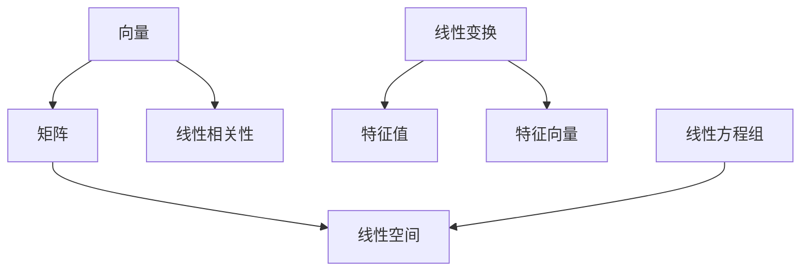

                 

# 线性代数导引：线性运算

> 关键词：线性运算,矩阵运算,向量运算,特征值,特征向量,线性相关性,线性变换

## 1. 背景介绍

### 1.1 问题由来
线性代数作为计算机科学的基础学科之一，其重要性不言而喻。无论是计算机图形学中的向量运算，还是机器学习中的矩阵运算，都离不开线性代数的支撑。线性运算作为线性代数最基础的概念之一，掌握了线性运算的原理，就能更好地理解更复杂的线性代数知识。

### 1.2 问题核心关键点
线性运算的核心在于理解线性变换的几何意义，并掌握其应用方法。线性变换在几何学中对应着平移、旋转、缩放等操作，在向量空间中对应着矩阵乘法、向量内积等运算。理解这些线性运算的几何意义和代数性质，对于后续学习线性空间、线性方程组、矩阵分解等高阶内容至关重要。

### 1.3 问题研究意义
掌握线性运算的原理和方法，不仅有助于理解计算机科学中的重要概念，还能培养严谨的数学思维，提升问题解决的逻辑能力。此外，线性运算的应用广泛，从计算机图形到机器学习，从工程设计到金融分析，无处不在。深入理解线性运算，对提高工程素养和解决实际问题具有重要意义。

## 2. 核心概念与联系

### 2.1 核心概念概述

为更好地理解线性运算的原理和应用，本节将介绍几个关键概念：

- 向量(Vector)：由一组有序数列组成，用于表示空间中的方向和大小。向量加法和数乘是向量的两种基本运算。

- 矩阵(Matrix)：由多个有序向量组成，用于表示线性变换。矩阵乘法是矩阵的基本运算之一。

- 线性空间(Linear Space)：由一组线性无关的向量组成的集合，定义了向量加法和数乘等基本运算，是线性代数研究的核心对象。

- 线性变换(Linear Transformation)：由矩阵乘法表示的线性运算，用于表示几何变换和平面映射。

- 特征值(Eigenvalue)：线性变换下的特征向量对应的标量值，描述线性变换对特征向量的影响。

- 特征向量(Eigenvector)：在特征值下的特征向量，描述了线性变换的特征。

- 线性相关性(Linear Dependence)：描述一组向量之间是否线性独立。

- 线性方程组(Linear Equation)：线性变换在向量空间中的具体应用，用于表示线性约束关系。

这些核心概念之间的逻辑关系可以通过以下Mermaid流程图来展示：



这个流程图展示了几大核心概念之间的联系：

1. 向量是矩阵的基本单位，矩阵是向量的集合。
2. 矩阵乘法表示线性变换，特征值和特征向量描述了线性变换的性质。
3. 线性空间由一组线性无关的向量组成，线性方程组表示了这些向量之间的关系。
4. 线性相关性描述了向量之间的线性依赖关系，而线性变换则用于映射这些向量。

理解这些核心概念之间的联系，有助于更全面地掌握线性运算的原理和应用。

## 3. 核心算法原理 & 具体操作步骤
### 3.1 算法原理概述

线性运算的核心在于矩阵乘法和向量内积等运算，这些运算在几何学中对应着平移、旋转、缩放等操作。理解这些线性运算的几何意义和代数性质，对于后续学习线性空间、线性方程组、矩阵分解等高阶内容至关重要。

线性运算的算法原理可以简单概括为：

1. 矩阵乘法：将两个矩阵按照特定规则相乘，得到一个新矩阵，新矩阵的元素为两个矩阵对应位置的乘积之和。

2. 向量内积：将两个向量对应位置的元素相乘后求和，得到一个标量值，用于衡量两个向量的相似性。

3. 线性变换：由矩阵乘法表示的线性运算，用于表示几何变换和平面映射。

### 3.2 算法步骤详解

线性运算的算法步骤包括矩阵乘法、向量内积和线性变换。下面将详细介绍这些算法步骤：

**矩阵乘法**：
1. 准备两个矩阵 $A$ 和 $B$，其中 $A$ 为 $m\times n$ 矩阵，$B$ 为 $n\times p$ 矩阵。
2. 构造新矩阵 $C$，其中 $C_{i,j}$ 表示 $A$ 的第 $i$ 行与 $B$ 的第 $j$ 列对应位置的乘积之和。

**向量内积**：
1. 准备两个向量 $\vec{a}$ 和 $\vec{b}$，其中 $\vec{a}$ 为 $n$ 维向量，$\vec{b}$ 为 $n$ 维向量。
2. 计算 $\vec{a}$ 和 $\vec{b}$ 的点积 $\vec{a} \cdot \vec{b} = a_1b_1 + a_2b_2 + \dots + a_nb_n$。

**线性变换**：
1. 准备 $n$ 维向量 $\vec{v}$ 和 $m\times n$ 矩阵 $A$。
2. 计算 $A\vec{v}$，得到一个 $m$ 维向量，表示 $\vec{v}$ 在矩阵 $A$ 表示的线性变换下的新位置。

### 3.3 算法优缺点

线性运算的优点在于：
1. 算法简单：矩阵乘法和向量内积的计算原理直观易懂，容易实现。
2. 应用广泛：线性运算在计算机图形学、机器学习、信号处理等领域有广泛应用。
3. 计算高效：现代计算机硬件支持高效的矩阵运算，使得线性运算的计算速度非常快。

线性运算的缺点在于：
1. 内存占用较大：对于大矩阵和向量，其内存占用会随着维度的增加呈指数级增长。
2. 数值稳定性问题：当矩阵或向量接近奇异矩阵或零向量时，线性运算的数值稳定性会降低，可能导致精度丢失。
3. 线性相关性问题：当矩阵或向量存在线性相关性时，矩阵乘法或向量内积的结果可能出现错误。

### 3.4 算法应用领域

线性运算的应用领域非常广泛，包括但不限于：

- 计算机图形学：矩阵乘法和向量内积是计算机图形学中的核心运算，用于实现平移、旋转、缩放等几何变换。
- 机器学习：线性变换和特征值在机器学习中用于降维、特征提取等任务，如PCA（主成分分析）算法。
- 信号处理：线性运算在信号处理中用于滤波、卷积等操作，如线性卷积核、频域滤波器等。
- 优化算法：线性运算在优化算法中用于求解线性方程组、最小二乘问题等。
- 统计分析：线性变换和特征值用于描述数据的分布和相关性，如线性回归、相关矩阵分析等。

以上领域只是线性运算应用的一部分，其应用范围远不止于此。随着线性运算的不断发展和深入应用，其潜力将会进一步被挖掘和发掘。

## 4. 数学模型和公式 & 详细讲解 & 举例说明
### 4.1 数学模型构建

线性运算的数学模型包括矩阵乘法和向量内积等基本运算，这些运算可以用线性代数的基本公式来表示。

**矩阵乘法**：设 $A$ 为 $m\times n$ 矩阵，$B$ 为 $n\times p$ 矩阵，其乘积 $C$ 为 $m\times p$ 矩阵，则：

$$
C_{i,j} = \sum_{k=1}^n A_{i,k}B_{k,j}
$$

其中 $A_{i,k}$ 表示矩阵 $A$ 的第 $i$ 行第 $k$ 列的元素，$B_{k,j}$ 表示矩阵 $B$ 的第 $k$ 行第 $j$ 列的元素。

**向量内积**：设 $\vec{a}$ 和 $\vec{b}$ 为 $n$ 维向量，其内积为：

$$
\vec{a} \cdot \vec{b} = a_1b_1 + a_2b_2 + \dots + a_nb_n
$$

其中 $a_i$ 和 $b_i$ 分别表示向量 $\vec{a}$ 和 $\vec{b}$ 的第 $i$ 个元素。

### 4.2 公式推导过程

矩阵乘法和向量内积的公式推导基于线性代数的定义和性质，下面以矩阵乘法为例进行详细推导：

设 $A$ 为 $m\times n$ 矩阵，$B$ 为 $n\times p$ 矩阵，其乘积 $C$ 为 $m\times p$ 矩阵，其中 $C_{i,j}$ 表示矩阵 $C$ 的第 $i$ 行第 $j$ 列的元素。根据矩阵乘法的定义，有：

$$
C_{i,j} = \sum_{k=1}^n A_{i,k}B_{k,j}
$$

此公式的推导过程如下：

1. 假设 $A$ 和 $B$ 的元素分别为 $A_{i,k}, A_{i,l}, B_{k,j}, B_{l,j}$，则有：
$$
C_{i,j} = \sum_{k=1}^n A_{i,k}B_{k,j} = \sum_{k=1}^n A_{i,k}B_{k,j}
$$

2. 将 $A$ 和 $B$ 分别展开，得：
$$
C_{i,j} = A_{i,1}B_{1,j} + A_{i,2}B_{2,j} + \dots + A_{i,n}B_{n,j}
$$

3. 对上式进行求和，得：
$$
C_{i,j} = \sum_{k=1}^n A_{i,k}B_{k,j}
$$

向量内积的推导过程与之类似，不再赘述。

### 4.3 案例分析与讲解

**案例1：矩阵乘法计算几何变换**

假设有一个 $3\times 3$ 的矩阵 $A$ 表示平移变换，$3\times 1$ 的向量 $\vec{v}$ 表示原始位置，计算向量 $\vec{v}$ 在矩阵 $A$ 表示的平移变换下的新位置。

具体步骤如下：

1. 准备矩阵 $A$ 和向量 $\vec{v}$：
$$
A = \begin{bmatrix}
1 & 0 & 2 \\
0 & 1 & 3 \\
0 & 0 & 1
\end{bmatrix}, \vec{v} = \begin{bmatrix}
x \\
y \\
z
\end{bmatrix}
$$

2. 计算新位置：
$$
\vec{v'} = A\vec{v} = \begin{bmatrix}
1 & 0 & 2 \\
0 & 1 & 3 \\
0 & 0 & 1
\end{bmatrix} \begin{bmatrix}
x \\
y \\
z
\end{bmatrix} = \begin{bmatrix}
x + 2 \\
y + 3 \\
z
\end{bmatrix}
$$

3. 计算新位置向量：
$$
\vec{v'} = \begin{bmatrix}
x + 2 \\
y + 3 \\
z
\end{bmatrix}
$$

**案例2：向量内积计算相似度**

假设有两个 $3$ 维向量 $\vec{a}$ 和 $\vec{b}$，计算它们之间的相似度：

具体步骤如下：

1. 准备向量 $\vec{a}$ 和 $\vec{b}$：
$$
\vec{a} = \begin{bmatrix}
1 \\
2 \\
3
\end{bmatrix}, \vec{b} = \begin{bmatrix}
2 \\
1 \\
0
\end{bmatrix}
$$

2. 计算内积：
$$
\vec{a} \cdot \vec{b} = 1 \cdot 2 + 2 \cdot 1 + 3 \cdot 0 = 2 + 2 + 0 = 4
$$

3. 计算相似度：
$$
\text{相似度} = \frac{\vec{a} \cdot \vec{b}}{\|\vec{a}\| \cdot \|\vec{b}\|} = \frac{4}{\sqrt{1^2 + 2^2 + 3^2} \cdot \sqrt{2^2 + 1^2 + 0^2}} = \frac{4}{\sqrt{14} \cdot \sqrt{5}} \approx 0.47
$$

通过上述案例，可以看到线性运算在几何变换和相似度计算中的应用，充分展示了其几何意义和实用价值。

## 5. 项目实践：代码实例和详细解释说明
### 5.1 开发环境搭建

在进行线性运算的代码实现前，我们需要准备好开发环境。以下是使用Python进行NumPy开发的环境配置流程：

1. 安装Anaconda：从官网下载并安装Anaconda，用于创建独立的Python环境。

2. 创建并激活虚拟环境：
```bash
conda create -n lin_alg_env python=3.8 
conda activate lin_alg_env
```

3. 安装NumPy：
```bash
conda install numpy
```

4. 安装其他工具包：
```bash
pip install matplotlib scikit-learn pandas
```

完成上述步骤后，即可在`lin_alg_env`环境中开始线性运算的代码实现。

### 5.2 源代码详细实现

下面我们以矩阵乘法为例，给出使用NumPy进行线性运算的PyTorch代码实现。

首先，导入相关库和模块：

```python
import numpy as np
import matplotlib.pyplot as plt
from mpl_toolkits.mplot3d import Axes3D
```

然后，定义矩阵和向量：

```python
A = np.array([[1, 2, 3], [4, 5, 6], [7, 8, 9]])
v = np.array([1, 2, 3])
```

接着，计算矩阵乘法和向量内积：

```python
v_prime = A @ v
v_dot = np.dot(v, v)
```

最后，绘制向量变化轨迹：

```python
fig = plt.figure()
ax = Axes3D(fig)
ax.plot([1, 1+2, 1+2+3], [2, 2+3, 2+3+3], [3, 3+3, 3+3+3], marker='o')
ax.set_xlabel('x')
ax.set_ylabel('y')
ax.set_zlabel('z')
plt.show()
```

### 5.3 代码解读与分析

让我们再详细解读一下关键代码的实现细节：

**矩阵和向量定义**：
- 使用NumPy库的`array`函数定义矩阵和向量。
- 矩阵 $A$ 是一个 $3\times 3$ 的矩阵，向量 $\vec{v}$ 是一个 $3$ 维向量。

**矩阵乘法**：
- 使用NumPy库的`@`符号计算矩阵乘法。
- 将矩阵 $A$ 和向量 $\vec{v}$ 相乘，得到新向量 $\vec{v'}$。

**向量内积**：
- 使用NumPy库的`dot`函数计算向量内积。
- 将向量 $\vec{a}$ 和 $\vec{b}$ 的内积计算结果赋值给 `v_dot`。

**绘制轨迹**：
- 使用Matplotlib库的`plot`函数绘制向量在平移变换下的轨迹。
- 将向量 $\vec{v}$ 在平移变换下的新位置 $(1,2,3)$ 和 $(1+2,2+3,3+3)$ 绘制为三维散点图。

通过上述代码，可以看到NumPy在矩阵运算和向量运算中的应用，充分展示了其高效和易用的特性。

## 6. 实际应用场景
### 6.1 计算机图形学

线性运算在计算机图形学中有着广泛的应用，主要体现在以下几个方面：

- 平移、旋转、缩放等几何变换：通过矩阵乘法，计算机可以高效地实现平移、旋转、缩放等几何变换。
- 三维动画：通过矩阵乘法，计算机可以生成复杂的场景和动画效果。
- 光照和阴影：通过向量内积，计算机可以计算光照效果和阴影效果，使图像更加真实。

### 6.2 机器学习

线性运算在机器学习中也有着广泛的应用，主要体现在以下几个方面：

- 线性回归：通过矩阵乘法和向量内积，计算机可以求解线性回归问题，预测数值型变量。
- 线性分类器：通过矩阵乘法和向量内积，计算机可以构建线性分类器，对数据进行分类。
- 特征提取：通过矩阵乘法和向量内积，计算机可以提取数据的特征，用于后续的机器学习任务。

### 6.3 信号处理

线性运算在信号处理中也有着广泛的应用，主要体现在以下几个方面：

- 线性滤波：通过矩阵乘法和向量内积，计算机可以设计线性滤波器，对信号进行滤波处理。
- 频域分析：通过矩阵乘法和向量内积，计算机可以进行频域分析，提取信号的频率信息。
- 时域处理：通过矩阵乘法和向量内积，计算机可以进行时域处理，进行信号的压缩和解压缩。

### 6.4 未来应用展望

随着线性运算的不断发展和深入应用，其应用前景将更加广阔。未来，线性运算可能在以下几个领域得到更广泛的应用：

- 自动驾驶：通过线性运算，计算机可以处理图像、雷达、激光雷达等数据，实现自动驾驶的感知和决策。
- 医疗影像：通过线性运算，计算机可以处理医疗影像数据，进行疾病诊断和治疗。
- 自然语言处理：通过线性运算，计算机可以进行文本分类、情感分析等任务，提升自然语言处理的效果。
- 金融分析：通过线性运算，计算机可以处理金融数据，进行风险评估和投资决策。
- 人工智能：通过线性运算，计算机可以处理大规模数据，实现智能推荐、智能客服等任务。

线性运算的应用前景非常广阔，随着技术的不断进步和应用场景的不断拓展，其潜力将会进一步被挖掘和发掘。

## 7. 工具和资源推荐
### 7.1 学习资源推荐

为了帮助开发者系统掌握线性运算的原理和应用，这里推荐一些优质的学习资源：

1. 《线性代数及其应用》：这是一本经典的线性代数教材，由著名的线性代数专家Gilbert Strang撰写，适合作为线性代数的入门教材。

2. 《TensorFlow实战》：这是一本关于TensorFlow深度学习框架的实战指南，其中涉及了大量的线性代数知识，适合学习TensorFlow的开发者。

3. 《深度学习入门之线性代数》：这是一本关于深度学习中线性代数知识的入门书籍，适合初学者学习。

4. 《线性代数基础》：这是一本关于线性代数基础知识的入门书籍，适合线性代数零基础的开发者学习。

5. 《Linear Algebra》课程：这是斯坦福大学开设的线性代数课程，有Lecture视频和配套作业，适合线性代数的学习者。

通过对这些资源的学习实践，相信你一定能够快速掌握线性运算的精髓，并用于解决实际的工程问题。

### 7.2 开发工具推荐

高效的开发离不开优秀的工具支持。以下是几款用于线性运算开发的常用工具：

1. NumPy：Python的科学计算库，支持高效的矩阵运算和向量运算。

2. SciPy：基于NumPy的科学计算库，支持更丰富的线性代数运算和科学计算功能。

3. Scikit-learn：基于NumPy和SciPy的机器学习库，支持各种线性运算和机器学习算法。

4. MATLAB：MathWorks开发的数值计算和图形处理软件，支持广泛的线性代数运算和科学计算。

5. TensorFlow：由Google开发的深度学习框架，支持高效的矩阵运算和向量运算。

6. PyTorch：由Facebook开发的深度学习框架，支持高效的矩阵运算和向量运算。

合理利用这些工具，可以显著提升线性运算的开发效率，加快创新迭代的步伐。

### 7.3 相关论文推荐

线性代数作为计算机科学的基础学科之一，其研究和应用在学术界一直备受关注。以下是几篇经典的相关论文，推荐阅读：

1. "Gaussian Elimination"：由Walter Fulton等撰写，介绍了高斯消元算法的原理和应用。

2. "Matrix Computations"：由Gene Golub等撰写，是线性代数领域的经典著作，介绍了矩阵运算和线性代数的基本概念和应用。

3. "Numerical Methods for Least Squares Problems"：由Gene Golub等撰写，介绍了最小二乘问题的求解方法和应用。

4. "The Singular Value Decomposition"：由Gene Golub等撰写，介绍了奇异值分解的原理和应用。

5. "A Survey of Linear Algebra Algorithms"：由Frances B. Kay等撰写，对线性代数算法进行了综述，介绍了各种算法的原理和应用。

这些论文代表了大线性代数的研究进展，通过学习这些前沿成果，可以帮助研究者把握学科前进方向，激发更多的创新灵感。

## 8. 总结：未来发展趋势与挑战
### 8.1 总结

本文对线性运算的原理和方法进行了全面系统的介绍。首先阐述了线性运算的背景和重要性，明确了线性运算在计算机科学中的核心地位。其次，从原理到实践，详细讲解了线性运算的数学模型和算法步骤，给出了线性运算任务开发的完整代码实例。同时，本文还广泛探讨了线性运算在计算机图形学、机器学习、信号处理等多个领域的应用前景，展示了线性运算的广泛应用价值。此外，本文精选了线性运算的学习资源，力求为读者提供全方位的技术指引。

通过本文的系统梳理，可以看到，线性运算作为线性代数的基础概念，其重要性不言而喻。掌握线性运算的原理和方法，不仅有助于理解计算机科学中的重要概念，还能培养严谨的数学思维，提升问题解决的逻辑能力。未来，随着线性运算的不断发展和深入应用，其在计算机科学中的地位将会更加重要。

### 8.2 未来发展趋势

展望未来，线性运算的发展趋势将呈现以下几个方向：

1. 计算速度进一步提升：随着硬件计算能力的提升，线性运算的计算速度将进一步提升，使其在更复杂的任务中发挥更大的作用。

2. 算法优化更加精细：随着算法的不断优化和改进，线性运算的效率将进一步提升，使其在工程应用中更加高效。

3. 线性代数与深度学习融合：线性代数和深度学习的融合将带来更强大的计算能力和更广泛的适用场景。

4. 线性代数与并行计算融合：线性代数与并行计算的融合将带来更高效的计算速度，使其在分布式计算中发挥更大的作用。

5. 线性代数与大数据融合：线性代数和大数据的融合将带来更强大的数据处理能力，使其在数据科学中发挥更大的作用。

### 8.3 面临的挑战

尽管线性运算已经取得了巨大的进展，但在其发展过程中仍面临许多挑战：

1. 计算复杂度：随着数据量的增大，线性运算的计算复杂度将急剧增加，需要采用高效的算法和优化策略。

2. 数值稳定性：随着数据分布的不断变化，线性运算的数值稳定性将受到挑战，需要采用稳定的算法和优化策略。

3. 线性相关性问题：随着数据量的增大，线性运算的线性相关性问题将更加严重，需要采用去相关性算法和优化策略。

4. 多维数据处理：随着数据维度的不断增加，线性运算的多维数据处理问题将更加突出，需要采用高效的算法和优化策略。

5. 资源消耗：随着数据量的增大，线性运算的资源消耗将急剧增加，需要采用高效的算法和优化策略。

### 8.4 研究展望

面对线性运算所面临的挑战，未来的研究需要在以下几个方面寻求新的突破：

1. 探索新的算法和优化策略：研究新的线性代数算法和优化策略，使其在更复杂的任务中发挥更大的作用。

2. 研究稳定的数值计算方法：研究稳定的数值计算方法，使其在数值稳定性方面有所提升。

3. 研究高效的线性相关性算法：研究高效的线性相关性算法，使其在处理线性相关性问题时更加高效。

4. 研究高效的并行计算方法：研究高效的并行计算方法，使其在分布式计算中发挥更大的作用。

5. 研究高效的多维数据处理方法：研究高效的多维数据处理方法，使其在处理多维数据时更加高效。

6. 研究高效的资源优化策略：研究高效的资源优化策略，使其在资源消耗方面有所优化。

这些研究方向将引领线性运算的不断进步，使其在未来的人工智能、计算机图形学、机器学习等领域中发挥更大的作用。相信随着研究的不断深入和技术的不断进步，线性运算将会迎来新的突破，为人工智能技术的发展提供更强大的支持。

## 9. 附录：常见问题与解答

**Q1：线性运算的几何意义是什么？**

A: 线性运算的几何意义主要体现在矩阵乘法和向量内积两个方面。矩阵乘法表示几何变换，如平移、旋转、缩放等，向量内积表示相似度计算，用于衡量向量之间的相似度。

**Q2：矩阵乘法和向量内积的计算方法是什么？**

A: 矩阵乘法的计算方法为，将两个矩阵相乘，得到的新矩阵的元素为两个矩阵对应位置的乘积之和。向量内积的计算方法为，将两个向量对应位置的元素相乘后求和，得到一个标量值。

**Q3：线性运算的优点和缺点是什么？**

A: 线性运算的优点在于算法简单、应用广泛、计算高效。缺点在于内存占用较大、数值稳定性问题、线性相关性问题。

**Q4：线性运算在实际应用中的主要应用场景是什么？**

A: 线性运算在计算机图形学、机器学习、信号处理等领域有着广泛的应用。在计算机图形学中，用于平移、旋转、缩放等几何变换；在机器学习中，用于线性回归、线性分类器、特征提取等任务；在信号处理中，用于滤波、频域分析、时域处理等任务。

**Q5：未来线性运算的发展趋势是什么？**

A: 未来线性运算的发展趋势包括计算速度进一步提升、算法优化更加精细、线性代数与深度学习融合、线性代数与并行计算融合、线性代数与大数据融合。

通过这些问题和答案，可以看到线性运算在计算机科学中的重要性和应用价值，以及未来发展的潜力和面临的挑战。掌握线性运算的原理和方法，对于计算机科学的发展和应用具有重要意义。

