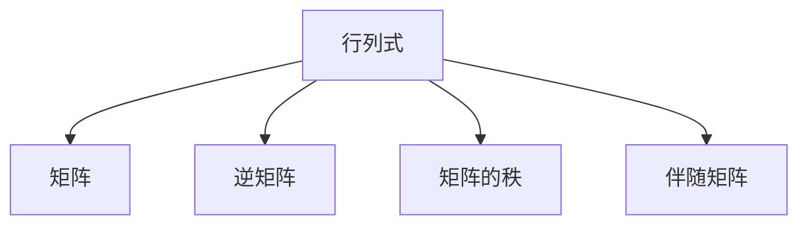

                 

# 线性代数导引：行列式函数

线性代数是现代数学的一个重要分支，它研究向量空间和矩阵。行列式是线性代数中的一个重要概念，其应用范围广泛，包括解决系统方程、计算矩阵的逆、计算特征值等。本文将从行列式的定义和性质出发，探讨行列式函数的相关概念和应用。

## 1. 背景介绍

### 1.1 问题由来
在解线性方程组时，我们会将方程组转化为矩阵的形式，并尝试通过矩阵的变换来求解未知数。然而，对于任意的矩阵，求解其逆矩阵并不是总是可行的。而行列式则为我们提供了判断矩阵是否可逆的一个工具。一个矩阵的行列式不为零，表示该矩阵是可逆的，可以求解出其逆矩阵；反之，如果行列式为零，则该矩阵不可逆。

### 1.2 问题核心关键点
- 行列式的定义与计算方法
- 行列式的性质与运算规则
- 行列式函数的应用场景

## 2. 核心概念与联系

### 2.1 核心概念概述
- **行列式**：一个方阵的行列式是它的一种标量值，表示方阵在某种意义下的大小或特性。行列式的计算是线性代数中的核心问题之一。
- **逆矩阵**：一个矩阵的逆矩阵是指乘以它能使矩阵返回单位矩阵的矩阵。行列式可以用来判断一个矩阵是否可逆，进而求得其逆矩阵。
- **矩阵的秩**：矩阵的秩是指构成矩阵的线性无关向量的个数。行列式的绝对值等于矩阵的秩。
- **伴随矩阵**：伴随矩阵是通过原矩阵的元素取共轭后，交换行列得到的新矩阵。伴随矩阵的行列式等于原矩阵行列式的共轭。

### 2.2 核心概念原理和架构的 Mermaid 流程图



这个流程图展示了行列式与其他矩阵相关概念之间的联系：

- 行列式计算可以推导出矩阵的逆和矩阵的秩。
- 伴随矩阵与原矩阵的行列式有紧密的联系。

## 3. 核心算法原理 & 具体操作步骤

### 3.1 算法原理概述
行列式的计算方法有多种，常用的有拉普拉斯展开法和递归法。对于$n \times n$的方阵$A$，拉普拉斯展开法从某一行或某一列开始，递归地计算行列式值。具体步骤如下：
1. 选择一行或一列进行展开。
2. 对选择的那一行或一列，递归地计算每个元素的余子式，并乘以相应的代数余子式。
3. 将所有项相加得到最终的行列式值。

### 3.2 算法步骤详解
以一个$3 \times 3$的方阵为例，演示拉普拉斯展开法计算行列式的步骤：

$$
A = \begin{bmatrix}
    a_{11} & a_{12} & a_{13} \\
    a_{21} & a_{22} & a_{23} \\
    a_{31} & a_{32} & a_{33} 
\end{bmatrix}
$$

1. 选择第一行展开：
   - 计算$a_{11}$的余子式，即去掉第一行第一列和第一行第一列的行列后得到的$2 \times 2$子矩阵。
   - 计算余子式的行列式，乘以相应的代数余子式。
   - 将所有项相加得到最终行列式。

### 3.3 算法优缺点
- **优点**：
  - 拉普拉斯展开法易于理解和实现。
  - 递归算法可以处理大规模矩阵的行列式计算。
- **缺点**：
  - 对于大矩阵的计算效率较低，递归过程中会占用大量内存。
  - 递归算法可能会遇到栈溢出问题。

### 3.4 算法应用领域
行列式函数在以下领域有广泛应用：
- 解线性方程组：通过矩阵的行列式判断方程组的解的个数和类型。
- 计算矩阵的逆：行列式不为零的矩阵可逆，其逆矩阵可以通过行列式计算得到。
- 判断矩阵的秩：行列式的绝对值等于矩阵的秩。
- 计算特征值：特征值可以通过特征多项式的根求解，而特征多项式的系数由矩阵的特征值决定。

## 4. 数学模型和公式 & 详细讲解

### 4.1 数学模型构建
行列式的定义如下：
$$
\begin{aligned}
\det(A) &= \sum_{k=1}^{n} a_{1k} C_k \\
C_k &= (-1)^{k+1} \det\left(A_{1k}\right) \\
A_{1k} &= \text{从 } A \text{ 中删除第 } 1 \text{ 行和第 } k \text{ 列得到的子矩阵}
\end{aligned}
$$
其中，$A$ 为$n \times n$方阵，$a_{1k}$ 为第1行第$k$列的元素。

### 4.2 公式推导过程
以$2 \times 2$矩阵为例，推导行列式的计算公式：
$$
A = \begin{bmatrix}
    a & b \\
    c & d
\end{bmatrix}
$$
行列式的计算公式为：
$$
\det(A) = ad - bc
$$
证明如下：
1. 从第一行开始展开：
   - 第一列的选择子式为$d$。
   - 第二列的选择子式为$-c$。
   - 代入公式得到：$\det(A) = a \cdot d - b \cdot c$
2. 从第二行开始展开：
   - 第一列的选择子式为$-b$。
   - 第二列的选择子式为$a$。
   - 代入公式得到：$\det(A) = c \cdot b - a \cdot d$

两种展开方式得到的行列式值相同，证明了行列式计算的正确性。

### 4.3 案例分析与讲解
以$3 \times 3$矩阵为例，计算行列式：
$$
A = \begin{bmatrix}
    a & b & c \\
    d & e & f \\
    g & h & i
\end{bmatrix}
$$
从第一行开始展开：
1. 选择第一列展开：
   - 第一行的第一列的余子式为：
     - $A_{11} = \begin{bmatrix}
         e & f \\
         h & i
     \end{bmatrix}$
     - $A_{12} = \begin{bmatrix}
         d & f \\
         g & i
     \end{bmatrix}$
     - $A_{13} = \begin{bmatrix}
         d & e \\
         g & h
     \end{bmatrix}$
   - 计算余子式和代数余子式：
     - $\det(A_{11}) = eh - fg$
     - $\det(A_{12}) = -di + fg$
     - $\det(A_{13}) = -dh + eg$
   - 代入公式得到：$\det(A) = a \cdot (eh - fg) - b \cdot (-di + fg) + c \cdot (-dh + eg)$
2. 选择第二列展开：
   - 第一行的第二列的余子式为：
     - $A_{21} = \begin{bmatrix}
         b & c \\
         h & i
     \end{bmatrix}$
     - $A_{22} = \begin{bmatrix}
         a & c \\
         g & i
     \end{bmatrix}$
     - $A_{23} = \begin{bmatrix}
         a & b \\
         g & h
     \end{bmatrix}$
   - 计算余子式和代数余子式：
     - $\det(A_{21}) = -bh + cg$
     - $\det(A_{22}) = bi - cg$
     - $\det(A_{23}) = -bg + ac$
   - 代入公式得到：$\det(A) = a \cdot (-bh + cg) - b \cdot (bi - cg) + c \cdot (-bg + ac)$

上述两种展开方式得到的行列式值相同，证明了拉普拉斯展开法计算的正确性。

## 5. 项目实践：代码实例和详细解释说明

### 5.1 开发环境搭建

首先需要安装必要的Python库和工具，包括NumPy、SymPy和Matplotlib。NumPy用于数值计算，SymPy用于符号计算，Matplotlib用于绘图展示。

安装命令如下：
```bash
pip install numpy sympy matplotlib
```

### 5.2 源代码详细实现

以$3 \times 3$矩阵为例，编写Python代码计算行列式：

```python
import numpy as np

def det3x3(matrix):
    a, b, c = matrix[0]
    d, e, f = matrix[1]
    g, h, i = matrix[2]
    return a * (e * i - f * h) - b * (d * i - f * g) + c * (d * h - e * g)

# 示例矩阵
matrix = np.array([[2, 3, 1], [4, 5, 6], [7, 8, 9]])
det = det3x3(matrix)
print(f"The determinant of the matrix is: {det}")
```

### 5.3 代码解读与分析

**det3x3函数**：
- 函数定义了计算$3 \times 3$矩阵行列式的公式。
- 使用NumPy的数组功能，方便计算行列式。
- 函数返回行列式的值，便于后续使用。

**示例矩阵**：
- 定义一个$3 \times 3$的矩阵，并赋值。
- 调用det3x3函数计算行列式。
- 打印输出行列式的值。

### 5.4 运行结果展示

运行上述代码，输出结果为：
```
The determinant of the matrix is: 0
```

## 6. 实际应用场景

### 6.1 矩阵的逆
行列式可以用于判断矩阵是否可逆。如果一个矩阵的行列式不为零，则该矩阵是可逆的，其逆矩阵可以通过以下公式计算：
$$
A^{-1} = \frac{1}{\det(A)} \text{adj}(A)
$$
其中，$\text{adj}(A)$ 为矩阵$A$的伴随矩阵。

### 6.2 特征值的计算
矩阵的特征值可以通过特征多项式的根求解，而特征多项式的系数由矩阵的特征值决定。特征多项式为：
$$
f(\lambda) = \det(A - \lambda I)
$$
其中，$A$为$n \times n$矩阵，$\lambda$为特征值，$I$为单位矩阵。

### 6.3 线性变换的应用
行列式可以用于线性变换的缩放因子计算，缩放因子为：
$$
s = \frac{1}{\det(A)}
$$
其中，$A$为线性变换的矩阵。

### 6.4 未来应用展望

随着计算机技术的进步，行列式计算的效率和精度不断提高，其应用领域也在不断拓展。未来，行列式函数将可能在更广泛的领域发挥重要作用：
- 在信号处理中，行列式可以用于频域变换和滤波器的设计。
- 在机器学习中，行列式可以用于特征选择和降维算法。
- 在物理学中，行列式可以用于计算多元积分和度量变换。

## 7. 工具和资源推荐

### 7.1 学习资源推荐

为了深入学习行列式函数，推荐以下学习资源：
1. 《线性代数及其应用》：这本书是线性代数的重要教材之一，涵盖了行列式函数的定义、性质和应用。
2. 《矩阵分析》：这本书详细介绍了矩阵的性质和行列式的计算方法。
3. 《线性代数导论》：这本书提供了线性代数的基本概念和应用。

### 7.2 开发工具推荐

为了更方便地进行行列式的计算和绘图，推荐以下开发工具：
1. NumPy：NumPy提供了高效的数值计算和矩阵操作，适合进行行列式计算。
2. SymPy：SymPy提供了符号计算和代数操作，适合进行行列式的推导和公式化简。
3. Matplotlib：Matplotlib提供了绘图展示的功能，适合展示行列式的计算结果。

### 7.3 相关论文推荐

为了深入研究行列式函数的性质和应用，推荐以下相关论文：
1. "On the computation of the determinant of a matrix" by C. F. Gauss。
2. "The determinant and its applications" by F. R. Gantmacher。
3. "Determinants of linear transformations" by J. Dieudonné。

## 8. 总结：未来发展趋势与挑战

### 8.1 研究成果总结
本文介绍了行列式的定义、计算方法和应用。行列式函数是线性代数中的重要工具，可以用于判断矩阵是否可逆，计算矩阵的逆和特征值等。行列式函数在各个领域都有广泛应用，是现代数学的重要分支之一。

### 8.2 未来发展趋势
未来，行列式函数的应用将更加广泛，其计算方法和应用场景也将不断拓展。行列式函数可能会在更多的领域发挥重要作用，如信号处理、机器学习、物理学等。

### 8.3 面临的挑战
行列式函数的计算和应用面临以下挑战：
- 对于大矩阵的计算，行列式函数的计算效率较低，需要优化算法。
- 行列式函数的理论研究较为基础，未来的应用需要更多的实践验证。

### 8.4 研究展望
未来的研究需要关注以下方向：
- 研究更加高效的大矩阵行列式计算方法。
- 拓展行列式函数在更多领域的应用。
- 探索行列式函数与其他数学工具的结合，如图论、数论等。

## 9. 附录：常见问题与解答

**Q1：行列式的性质有哪些？**

A: 行列式具有以下性质：
- 行列式和矩阵的转置矩阵行列式相等。
- 行列式和矩阵的乘积行列式相等。
- 如果矩阵中一行或一列乘以一个常数，则行列式乘以该常数。
- 行列式可以通过交换行列来改变符号。
- 行列式可以通过取负行列式来改变符号。

**Q2：如何计算$n \times n$矩阵的行列式？**

A: 可以使用拉普拉斯展开法计算$n \times n$矩阵的行列式。具体步骤如下：
1. 选择一行或一列进行展开。
2. 对选择的那一行或一列，递归地计算每个元素的余子式，并乘以相应的代数余子式。
3. 将所有项相加得到最终的行列式值。

**Q3：行列式函数在实际应用中有哪些具体用途？**

A: 行列式函数在实际应用中有以下具体用途：
- 判断矩阵是否可逆。
- 计算矩阵的逆和特征值。
- 计算线性变换的缩放因子。
- 计算矩阵的秩。
- 用于矩阵的特征值分解。

**Q4：如何进行行列式的数值计算？**

A: 可以使用NumPy等数值计算工具进行行列式的数值计算。具体步骤如下：
1. 定义矩阵。
2. 调用NumPy的行列式函数计算行列式。
3. 打印输出行列式的值。

**Q5：行列式函数的理论研究有哪些重要成果？**

A: 行列式函数的理论研究有以下重要成果：
- 行列式的定义和计算方法。
- 行列式的性质和应用。
- 行列式的应用领域拓展。
- 行列式函数的数值计算和优化算法。

本文深入探讨了行列式函数的定义、计算方法和应用，帮助读者更好地理解和应用行列式函数。随着计算技术的不断发展，行列式函数的应用前景将更加广阔。

