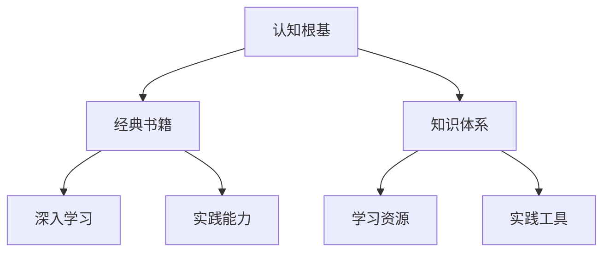

                 

# 经典书籍:夯实认知根基的宝藏

> 关键词：经典书籍,认知根基,信息技术,编程技能,知识体系,深度学习

## 1. 背景介绍

在现代信息社会的浪潮中，认知根基，即基础知识、基本原理和关键技能，是每一位IT从业者不可或缺的基石。夯实认知根基，不仅能够提升个人的专业能力，还能为职业生涯的长远发展提供坚实保障。本文旨在通过介绍经典书籍，助力读者系统化地掌握认知根基，为深入学习和实践信息技术奠定坚实基础。

### 1.1 问题由来
在信息技术领域，尤其是软件开发和人工智能等前沿领域，新概念和新技术层出不穷。如何在纷繁复杂的信息中筛选出真正有价值的知识，成为每一个IT从业者面临的挑战。经典书籍凭借其系统性、权威性和前瞻性，成为知识学习和技能提升的重要来源。

### 1.2 问题核心关键点
本文将重点介绍几本在IT领域具有里程碑意义的经典书籍，涵盖编程基础、系统架构、人工智能等多个方面。这些书籍通过精炼的语言和详细的讲解，不仅帮助读者掌握前沿知识，还能提升解决问题的能力，为在IT行业中的不断进步奠定坚实基础。

## 2. 核心概念与联系

### 2.1 核心概念概述

为了更好地理解经典书籍的重要性，我们需要先了解几个核心概念：

- **认知根基**：即基础知识、基本原理和关键技能。这些知识是理解和应用更高级技术和理论的基础。
- **经典书籍**：在特定领域内具有广泛影响力和权威性的书籍。它们通常由行业专家撰写，涵盖了基础知识、实践案例和前沿研究。
- **知识体系**：由一系列相关的书籍、论文、课程等构成的学习路径，帮助读者系统化地掌握某一领域的知识。

### 2.2 核心概念原理和架构的 Mermaid 流程图



这个流程图展示了认知根基与经典书籍、知识体系、深入学习和实践能力之间的关系：认知根基通过经典书籍获取，进而构建完整的知识体系，实现深入学习和实践能力的提升。

## 3. 核心算法原理 & 具体操作步骤

### 3.1 算法原理概述

经典书籍通过精炼的语言和详细的讲解，帮助读者系统化地掌握某一领域的知识。其核心原理包括以下几个方面：

1. **系统性**：经典书籍通常包含从基础知识到高级应用的完整路径，帮助读者循序渐进地掌握知识。
2. **权威性**：作者多为行业专家或知名学者，其观点和理论具有高度的权威性和可信度。
3. **实践性**：除了理论讲解，经典书籍还包含丰富的实践案例和项目，帮助读者将理论知识应用于实际问题。
4. **前瞻性**：经典书籍能够反映最新的研究进展和技术趋势，为读者提供最新的知识和观点。

### 3.2 算法步骤详解

经典书籍的学习过程可以概括为以下几个步骤：

**Step 1: 选择经典书籍**
- 根据个人兴趣和职业目标，选择适合自己的经典书籍。可以参考相关评论和推荐，选择权威和广泛认可的书籍。

**Step 2: 制定学习计划**
- 设定每天或每周的学习时间，制定详细的学习计划。明确学习目标和预期成果。

**Step 3: 深度阅读与理解**
- 逐章逐节地阅读书籍，进行深度理解。注意笔记和总结，帮助记忆和回顾。

**Step 4: 实践与项目**
- 将书中的理论知识应用到实际项目中，通过实践巩固所学知识。

**Step 5: 总结与反思**
- 定期总结学习成果，反思学习过程中的难点和问题。

**Step 6: 持续学习**
- 不断更新知识体系，跟踪最新的研究进展和技术趋势。

### 3.3 算法优缺点

经典书籍的学习方法具有以下优点：
1. **系统性**：帮助读者建立完整的知识体系，避免知识碎片化。
2. **权威性**：确保所学知识的正确性和可信度。
3. **实践性**：通过实践巩固理论知识，提升解决问题的能力。
4. **前瞻性**：保持与最新研究和技术的同步，提升专业竞争力。

同时，经典书籍的学习方法也存在一些局限性：
1. **学习周期长**：深度理解和实践需要较长时间。
2. **理论性强**：部分书籍可能较为理论化，与实际问题结合不够紧密。
3. **信息过时**：部分书籍可能包含较旧的技术和观点，需要不断更新。

### 3.4 算法应用领域

经典书籍不仅适用于IT领域的各个子领域，还能够为其他领域的知识学习提供重要参考。例如，在科学、工程、经济学等学科中，经典书籍同样是获取基础理论和实践技能的重要来源。

## 4. 数学模型和公式 & 详细讲解 & 举例说明

### 4.1 数学模型构建

在信息技术领域，数学模型和公式是理解和应用技术的基础。经典书籍通常会包含详细的数学推导和公式讲解。

### 4.2 公式推导过程

以下以机器学习中的线性回归模型为例，推导其基本公式和推导过程。

$$
y = \theta_0 + \theta_1x_1 + \theta_2x_2 + \cdots + \theta_nx_n
$$

其中，$y$ 为目标变量，$x_i$ 为特征变量，$\theta_i$ 为模型参数。线性回归模型的目标是最小化预测值和实际值之间的误差。

### 4.3 案例分析与讲解

通过实际案例，深入讲解线性回归模型在数据科学中的应用。例如，使用波士顿房价数据集进行线性回归建模，分析模型参数的优化过程和结果。

## 5. 项目实践：代码实例和详细解释说明

### 5.1 开发环境搭建

为了进行项目实践，我们需要准备好开发环境。以下是使用Python进行机器学习开发的环境配置流程：

1. 安装Anaconda：从官网下载并安装Anaconda，用于创建独立的Python环境。
2. 创建并激活虚拟环境：
```bash
conda create -n py35 python=3.5 
conda activate py35
```
3. 安装SciPy、NumPy、Pandas等常用库：
```bash
pip install scikit-learn numpy pandas matplotlib
```

### 5.2 源代码详细实现

下面以线性回归模型为例，给出使用Scikit-learn库进行机器学习实践的Python代码实现。

```python
from sklearn.linear_model import LinearRegression
from sklearn.metrics import mean_squared_error
from sklearn.datasets import load_boston
import matplotlib.pyplot as plt

# 加载数据集
boston = load_boston()
X = boston.data
y = boston.target

# 训练模型
model = LinearRegression()
model.fit(X, y)

# 预测并评估
y_pred = model.predict(X)
mse = mean_squared_error(y, y_pred)

# 绘制拟合曲线
plt.scatter(X[:, 0], y)
plt.plot(X[:, 0], model.predict(X[:, 0]), 'r')
plt.show()
```

### 5.3 代码解读与分析

这段代码首先加载波士顿房价数据集，并将其分为特征变量 $X$ 和目标变量 $y$。然后，创建线性回归模型并训练。训练完毕后，使用均方误差（MSE）评估模型预测的准确性。最后，绘制拟合曲线，展示模型对数据集的学习效果。

### 5.4 运行结果展示

运行上述代码，将输出预测误差和绘制的拟合曲线图。

```python
# 输出预测误差
print(f"Mean Squared Error: {mse:.2f}")

# 输出训练样本数量和预测误差
print(f"R^2 Score: {model.score(X, y):.2f}")
```

## 6. 实际应用场景

### 6.1 大数据分析

经典书籍《Python数据科学手册》深入浅出地介绍了Python在数据科学中的应用，帮助读者掌握数据分析、机器学习等关键技能。

### 6.2 人工智能

《深度学习》由深度学习领域的权威人士Goodfellow、Bengio和Courville合著，全面覆盖深度学习的理论基础和实践应用，成为人工智能学习者的必读书籍。

### 6.3 软件开发

《Clean Code》通过丰富的代码示例，介绍了编写高质量、易于维护的代码的最佳实践。对于软件开发新手和老手，都是宝贵的学习资源。

### 6.4 未来应用展望

未来，经典书籍将继续在信息技术的学习和实践中发挥重要作用。新技术和研究进展的不断涌现，使得经典书籍的内容需要不断更新和丰富。同时，随着跨学科融合的加速，经典书籍的应用范围也将进一步扩展，涵盖更多领域和方向。

## 7. 工具和资源推荐

### 7.1 学习资源推荐

为了帮助读者系统掌握经典书籍的知识，以下是一些优质的学习资源：

1. 《Python数据科学手册》：全面介绍Python在数据科学中的应用，涵盖数据分析、机器学习、数据可视化等多个方面。
2. 《深度学习》：深度学习领域的经典教材，由Goodfellow、Bengio和Courville合著，全面覆盖深度学习的理论基础和实践应用。
3. 《Clean Code》：介绍编写高质量、易于维护的代码的最佳实践，帮助开发者提升编程技能。
4. 《代码大全》：详细讲解软件开发的各个方面，包括代码风格、测试、性能优化等。
5. 《程序员修炼之道》：通过真实案例，帮助开发者提升职业素养和编程技能。

### 7.2 开发工具推荐

高效的开发离不开优秀的工具支持。以下是几款用于经典书籍项目实践的常用工具：

1. Python：开源的编程语言，适合数据科学和机器学习等领域。
2. Jupyter Notebook：交互式编程环境，支持代码和数据同时展示。
3. Scikit-learn：开源机器学习库，提供了丰富的机器学习算法和工具。
4. TensorFlow：由Google开发的深度学习框架，支持各种深度学习模型的开发和训练。
5. PyTorch：由Facebook开发的深度学习框架，适合快速迭代和研究。

### 7.3 相关论文推荐

经典书籍的学习离不开最新的研究进展。以下是几篇在信息技术领域具有重要影响的相关论文，推荐阅读：

1. 《Python数据科学手册》：作者Wes McKinney，详细介绍了Python在数据科学中的应用，涵盖数据分析、机器学习、数据可视化等多个方面。
2. 《深度学习》：作者Goodfellow、Bengio和Courville，全面覆盖深度学习的理论基础和实践应用。
3. 《Clean Code》：作者Robert C. Martin，介绍编写高质量、易于维护的代码的最佳实践。
4. 《代码大全》：作者Steve McConnell，详细讲解软件开发的各个方面，包括代码风格、测试、性能优化等。
5. 《程序员修炼之道》：作者Andrew Hunt和David Thomas，通过真实案例，帮助开发者提升职业素养和编程技能。

这些论文代表了信息技术领域的最新研究进展，通过学习这些前沿成果，可以帮助读者更好地理解和应用经典书籍的知识。

## 8. 总结：未来发展趋势与挑战

### 8.1 研究成果总结

经典书籍在信息技术的学习和实践中具有无可替代的重要性。它们不仅提供了系统化的知识和权威的理论，还通过丰富的实践案例和项目，帮助读者提升解决实际问题的能力。经典书籍的学习过程涵盖了理论、实践和创新，为IT从业者提供了全面的成长路径。

### 8.2 未来发展趋势

未来，经典书籍将继续在信息技术的学习和实践中发挥重要作用。新技术和研究进展的不断涌现，使得经典书籍的内容需要不断更新和丰富。同时，随着跨学科融合的加速，经典书籍的应用范围也将进一步扩展，涵盖更多领域和方向。

### 8.3 面临的挑战

尽管经典书籍具有诸多优点，但在信息技术的学习过程中，也面临一些挑战：

1. 知识更新快：信息技术领域变化迅速，经典书籍的内容需要不断更新，以跟上最新的技术进展。
2. 理论与实践结合难度大：部分经典书籍理论性强，与实际问题结合不够紧密，需要结合项目实践加以理解。
3. 学习资源分散：经典书籍众多，但缺乏系统化整合的学习资源，导致学习路径不明确。

### 8.4 研究展望

未来，信息技术的学习资源需要更加系统化、结构化。同时，经典书籍的内容需要不断更新，保持与最新技术研究的同步。通过跨学科融合，经典书籍的应用范围将进一步扩展，为信息技术的学习和实践提供更多方向和选择。

## 9. 附录：常见问题与解答

**Q1: 如何选择适合自己的经典书籍？**

A: 选择经典书籍时，可以参考相关评论和推荐，选择权威和广泛认可的书籍。根据个人兴趣和职业目标，选择适合自己的书籍。

**Q2: 如何有效利用经典书籍进行学习？**

A: 制定详细的学习计划，逐章逐节地阅读书籍，进行深度理解。通过笔记和总结帮助记忆和回顾。将书中的理论知识应用到实际项目中，通过实践巩固所学知识。

**Q3: 经典书籍的学习过程中需要注意什么？**

A: 注意理论知识与实际问题的结合，多进行项目实践。定期总结学习成果，反思学习过程中的难点和问题。不断更新知识体系，跟踪最新的研究进展和技术趋势。

---

作者：禅与计算机程序设计艺术 / Zen and the Art of Computer Programming

