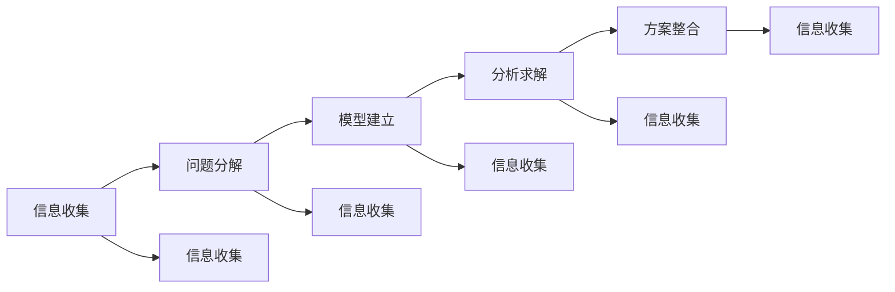

                 

# 结构化思维的应用：从理论到实践

## 1. 背景介绍

### 1.1 问题由来
在当今信息爆炸的时代，面对海量的数据和复杂的问题，结构化思维成为了一种重要的解决方式。结构化思维能够帮助人们从繁杂的信息中提炼出关键要素，制定有效的解决方案，广泛应用于项目规划、数据分析、决策制定等领域。本文旨在深入探讨结构化思维的理论基础和实践方法，帮助读者全面理解结构化思维，并能在实际工作中灵活应用。

### 1.2 问题核心关键点
结构化思维的核心在于将复杂问题分解为一系列可控、有序的子问题，逐一解决，最终形成系统性的解决方案。关键点包括：
1. 分解问题：将大问题拆分为可管理的子问题。
2. 建立模型：为每个子问题建立数学模型或逻辑模型。
3. 分析求解：通过分析求解模型，获取子问题的解。
4. 整合方案：将子问题的解整合为完整问题的解。

### 1.3 问题研究意义
掌握结构化思维，对于提升问题解决能力、增强决策的科学性和准确性、优化项目管理效率具有重要意义。结构化思维的应用，不仅能够提高工作效率，还能有效避免因信息过载而导致的决策失误，使问题解决更加高效、系统。

## 2. 核心概念与联系

### 2.1 核心概念概述

为更好地理解结构化思维的应用，本节将介绍几个关键概念及其相互关系：

- **结构化思维**：一种系统性的思维方法，用于解决复杂问题。通过分解问题、建立模型、分析求解和整合方案等步骤，实现对问题的系统性处理。

- **问题分解**：将复杂问题拆分为若干个可管理的子问题，以便于逐一解决。

- **模型建立**：为每个子问题建立相应的数学模型或逻辑模型，用以表达问题本质和求解过程。

- **分析求解**：对建立的模型进行分析求解，获取子问题的解。

- **方案整合**：将各个子问题的解整合起来，形成对原始问题的完整解答。

- **信息收集**：获取问题背景信息和相关数据，为问题分解和模型建立提供依据。

这些概念之间存在紧密的联系，共同构成结构化思维的逻辑框架。通过理解这些概念，我们可以更好地把握结构化思维的精髓，应用于实际问题的解决。

### 2.2 核心概念原理和架构的 Mermaid 流程图



这个流程图展示了结构化思维的逻辑流程：

1. 首先通过信息收集，理解问题背景和相关数据。
2. 问题分解将复杂问题拆分为若干子问题。
3. 对每个子问题建立模型。
4. 对模型进行分析求解。
5. 将各个子问题的解整合为完整问题的解。

## 3. 核心算法原理 & 具体操作步骤

### 3.1 算法原理概述

结构化思维的核心算法原理是“分解-求解-整合”，即将复杂问题分解为多个子问题，逐一求解，最终整合为对原问题的完整解答。这一过程通过数学模型和逻辑模型来实现，通过系统化的分析求解方法，获取每个子问题的解。

### 3.2 算法步骤详解

结构化思维的应用步骤包括：

1. **信息收集**：获取问题背景信息，收集相关数据，为后续步骤提供依据。
2. **问题分解**：将复杂问题拆分为若干子问题，每个子问题应具备明确的目标和约束条件。
3. **模型建立**：为每个子问题建立相应的数学模型或逻辑模型，用于表达问题本质和求解过程。
4. **分析求解**：使用分析求解方法，对模型进行分析，获取子问题的解。
5. **方案整合**：将各个子问题的解整合起来，形成对原始问题的完整解答。

### 3.3 算法优缺点

结构化思维具有以下优点：
1. **系统性**：能够全面、系统地解决问题，避免因信息过载导致的决策失误。
2. **可控性**：将大问题拆分为可管理的子问题，便于逐一解决。
3. **灵活性**：适用于各种复杂问题的解决，易于适应不同的应用场景。

同时，结构化思维也存在一些局限性：
1. **耗时较长**：分解问题、建立模型和整合方案等步骤可能耗费大量时间和精力。
2. **灵活性不足**：对模型和算法的要求较高，不易应对突发变化。
3. **复杂性**：需要系统化思维和建模能力，对一般用户可能存在一定门槛。

### 3.4 算法应用领域

结构化思维在多个领域都有广泛应用，例如：

1. **项目管理**：通过问题分解和方案整合，提升项目管理的系统性和效率。
2. **数据分析**：利用模型建立和分析求解，实现对数据的系统分析和深入理解。
3. **决策制定**：通过分解问题和整合方案，制定科学、系统的决策策略。
4. **创新设计**：利用分解和整合思维，创新设计产品和服务，提升竞争力。
5. **问题解决**：适用于各种复杂问题的解决，提升问题解决的全面性和科学性。

## 4. 数学模型和公式 & 详细讲解 & 举例说明

### 4.1 数学模型构建

结构化思维的数学模型构建主要分为两类：优化模型和动态模型。

#### 4.1.1 优化模型

优化模型用于求解最优化问题，常见形式为：

$$
\min_{x} f(x) \text{ 或 } \max_{x} f(x)
$$

其中 $f(x)$ 为优化目标函数，$x$ 为优化变量。优化模型的求解方法包括梯度下降、牛顿法、拉格朗日乘子法等。

#### 4.1.2 动态模型

动态模型用于描述系统随时间变化的规律，常见形式为：

$$
\dot{x}(t) = f(x(t),t)
$$

其中 $x(t)$ 为系统状态，$f(x,t)$ 为系统动态方程。动态模型的求解方法包括差分方程求解、离散化处理等。

### 4.2 公式推导过程

以优化模型为例，以最小化一元函数 $f(x)=x^2$ 为例，推导求解过程：

1. **目标函数**：$f(x)=x^2$
2. **导数计算**：$f'(x)=2x$
3. **初始化**：设置初始点 $x_0$
4. **迭代求解**：使用梯度下降算法，每次迭代计算 $\Delta x = -\eta f'(x)$，其中 $\eta$ 为学习率
5. **迭代停止**：当 $\Delta x < \epsilon$ 或达到预设迭代次数时停止迭代，最终得到最优解 $x^*$

### 4.3 案例分析与讲解

假设某公司希望提高销售额，通过分解问题并建立模型，求解最优策略。

**信息收集**：获取公司销售数据、市场分析报告、竞争对手信息等。

**问题分解**：将问题分解为以下几个子问题：
- 产品定位
- 价格策略
- 销售渠道
- 广告投放

**模型建立**：
- 产品定位：建立多产品组合模型，计算最优产品组合
- 价格策略：建立价格弹性模型，计算最优价格区间
- 销售渠道：建立渠道覆盖模型，计算最优渠道布局
- 广告投放：建立广告回报模型，计算最优投放策略

**分析求解**：使用统计分析、优化算法等方法，对各子模型进行分析求解。

**方案整合**：将各子问题的解整合起来，形成完整的销售提升方案。

## 5. 项目实践：代码实例和详细解释说明

### 5.1 开发环境搭建

要进行结构化思维的应用，首先需要搭建合适的开发环境。以下是一个Python环境配置的示例：

1. **安装Python**：从官网下载并安装Python，推荐使用Python 3.8以上版本。
2. **安装必要的库**：使用pip安装NumPy、SciPy、Pandas等科学计算库。

```bash
pip install numpy scipy pandas
```

### 5.2 源代码详细实现

以下是一个简单的数学模型求解示例，通过Python实现梯度下降算法求解最小化问题：

```python
import numpy as np

# 定义目标函数和导数
def f(x):
    return x**2

def df(x):
    return 2*x

# 设置初始值
x = 1

# 设置学习率和停止条件
eta = 0.1
epsilon = 1e-6

# 梯度下降算法
while True:
    grad = df(x)
    if abs(grad) < epsilon:
        break
    x = x - eta * grad

print("最小值点为：", x)
```

### 5.3 代码解读与分析

上述代码实现了一个简单的梯度下降算法，求解一元函数 $f(x)=x^2$ 的最小值点。

1. **目标函数和导数**：定义了函数 $f(x)=x^2$ 及其导数 $df(x)=2x$。
2. **初始化**：设置初始值 $x=1$。
3. **迭代求解**：使用梯度下降算法，每次迭代计算 $\Delta x = -\eta f'(x)$，其中 $\eta$ 为学习率。
4. **停止条件**：当 $\Delta x < \epsilon$ 或达到预设迭代次数时停止迭代。

## 6. 实际应用场景

### 6.1 项目管理

项目管理是结构化思维的重要应用领域之一。通过问题分解和方案整合，项目经理可以系统地管理项目进度、资源分配和风险控制，提高项目成功率。

### 6.2 数据分析

数据分析中，结构化思维可以帮助数据科学家系统地处理数据，提取有价值的信息。通过建立数学模型和逻辑模型，数据科学家可以对数据进行深入分析，揭示数据背后的规律和趋势。

### 6.3 决策制定

决策制定中，结构化思维能够帮助决策者系统性地分析各种决策方案，评估其优劣，最终制定科学、合理的决策。通过分解问题、建立模型和整合方案，决策者可以全面、系统地制定决策策略。

### 6.4 未来应用展望

结构化思维的应用未来将更加广泛和深入，以下是对其未来发展趋势的展望：

1. **智能化**：结合人工智能技术，结构化思维将更加自动化、智能化，提高问题解决效率。
2. **跨领域**：结构化思维将在更多领域得到应用，如金融、医疗、物流等，推动各领域的数字化转型。
3. **开源化**：结构化思维工具和算法将更加开源化，便于开发者快速应用和优化。
4. **可视化**：结构化思维工具将提供更加丰富的可视化功能，帮助用户更好地理解问题解法。

## 7. 工具和资源推荐

### 7.1 学习资源推荐

掌握结构化思维，可以参考以下学习资源：

1. 《结构化思维》系列书籍：详细讲解了结构化思维的基本概念和应用方法。
2. Coursera《结构化思维与项目管理》课程：系统介绍了结构化思维在项目管理中的应用。
3. Udemy《数据分析中的结构化思维》课程：讲解了数据科学中的结构化思维应用。
4. 《数据分析实战》：介绍数据分析中的实际案例，帮助读者理解结构化思维的应用。

### 7.2 开发工具推荐

以下是一些常用的开发工具，有助于结构化思维的应用：

1. Jupyter Notebook：用于编写和运行Python代码，支持丰富的数据可视化和交互功能。
2. Visual Paradigm：一款项目管理工具，支持任务分解、进度跟踪等功能。
3. Tableau：一款数据分析工具，支持数据可视化和分析。
4. Microsoft Project：一款项目管理软件，支持资源分配、进度跟踪等功能。

### 7.3 相关论文推荐

结构化思维的研究已经积累了许多经典成果，以下是几篇推荐阅读的论文：

1. Structured thinking and problem-solving：介绍结构化思维的基本概念和应用方法。
2. A framework for problem solving with structured thinking：提出了一套系统性的问题解决框架。
3. Application of structured thinking in project management：探讨了结构化思维在项目管理中的应用。
4. Data analysis and visualization with structured thinking：讲解了数据科学中的结构化思维应用。

## 8. 总结：未来发展趋势与挑战

### 8.1 总结

本文对结构化思维的应用进行了全面系统的介绍。首先阐述了结构化思维的理论基础和实践方法，明确了其在问题解决和项目管理中的重要性。其次，从原理到实践，详细讲解了结构化思维的核心算法原理和操作步骤，提供了具体的代码实现。同时，本文还探讨了结构化思维在多个实际领域的应用场景，展示了其广泛的应用前景。最后，本文精选了结构化思维的相关学习资源和开发工具，力求为读者提供全方位的技术指引。

### 8.2 未来发展趋势

展望未来，结构化思维的应用将呈现以下几个发展趋势：

1. **智能化**：结合人工智能技术，结构化思维将更加自动化、智能化，提高问题解决效率。
2. **跨领域**：结构化思维将在更多领域得到应用，如金融、医疗、物流等，推动各领域的数字化转型。
3. **开源化**：结构化思维工具和算法将更加开源化，便于开发者快速应用和优化。
4. **可视化**：结构化思维工具将提供更加丰富的可视化功能，帮助用户更好地理解问题解法。

### 8.3 面临的挑战

尽管结构化思维在问题解决和项目管理中具有显著优势，但在实际应用中，也面临一些挑战：

1. **复杂性**：结构化思维需要系统化的思维和建模能力，对一般用户可能存在一定门槛。
2. **时间成本**：分解问题、建立模型和整合方案等步骤可能耗费大量时间和精力。
3. **灵活性不足**：对模型和算法的要求较高，不易应对突发变化。

### 8.4 研究展望

未来，结构化思维的研究需要在以下几个方面寻求新的突破：

1. **智能化和自动化**：开发更多智能化的工具和算法，提升结构化思维的应用效率。
2. **跨领域应用**：拓展结构化思维在更多领域的应用，推动各领域的数字化转型。
3. **可扩展性**：提高结构化思维工具的可扩展性，支持更复杂、更灵活的应用场景。
4. **人机协同**：探索结构化思维与人工智能技术的结合，提升问题解决的科学性和效率。

## 9. 附录：常见问题与解答

**Q1：结构化思维是否适用于所有问题？**

A: 结构化思维适用于大部分复杂问题的解决，但也有一些问题可能不适宜分解为可管理的子问题，如开放性问题或模糊性问题。对于这类问题，可能需要结合其他方法进行解决。

**Q2：如何选择合适的模型和算法？**

A: 选择合适的模型和算法需要考虑问题的性质、数据的特点和实际需求。一般而言，应选择能够准确表达问题本质和求解过程的模型和算法，并进行适当调整和优化。

**Q3：结构化思维和传统问题解决方法有何不同？**

A: 结构化思维强调系统性、可控性和灵活性，将复杂问题分解为可管理的子问题，逐一求解，最终整合为完整问题的解。而传统问题解决方法往往侧重于具体问题的求解，可能缺乏系统性和可控性。

**Q4：结构化思维在项目管理中的应用有哪些？**

A: 结构化思维在项目管理中主要用于任务分解、进度跟踪、资源分配和风险控制。通过系统地分解项目任务，制定详细的工作计划，可以提升项目管理效率和成功率。

**Q5：如何评估结构化思维的效果？**

A: 评估结构化思维的效果通常从问题解决的全面性、科学性和效率三个方面进行。可以通过对比问题解决前后的情况，评估其效果，或者使用指标如时间成本、资源利用率等进行量化评估。

---

作者：禅与计算机程序设计艺术 / Zen and the Art of Computer Programming

