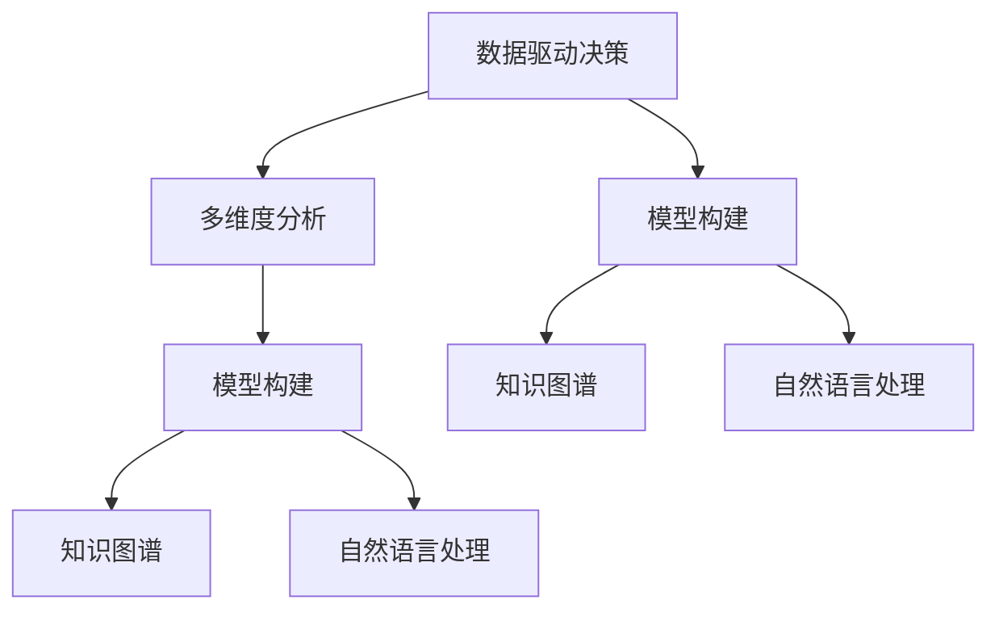

                 

## 1. 背景介绍

在现代信息爆炸的背景下，我们每天接收到的信息成倍增长，如何在海量的信息中快速有效地提取有用信息、做出合理决策，已经成为个人和组织都需要面对的问题。结构化思维（Structured Thinking）作为人工智能领域的一种关键思维方式，在信息处理、决策分析、问题解决等方面展现出巨大的应用潜力。本文将从理论基础到实践应用，详细探讨结构化思维的原理与方法。

## 2. 核心概念与联系

### 2.1 核心概念概述

结构化思维是一种基于逻辑、层次和系统的思维方式，其核心在于将复杂问题分解成可管理、可分析的模块，并通过标准化、系统化的处理方式，快速准确地获得有效结论。结构化思维的应用不仅限于人工智能领域，还在工程、科学、商业等多个行业得到广泛应用。

为更好地理解结构化思维，以下将介绍几个关键概念及其相互联系：

- **数据驱动决策**：基于数据和事实进行决策，减少主观偏见，提升决策的科学性和准确性。
- **多维度分析**：对问题从多个角度进行分析，全面评估各种可能性和影响因素。
- **模型构建**：使用数学模型和算法，对问题进行建模和求解，提升问题解决的效率和效果。
- **知识图谱**：构建知识图谱，整合和关联各类知识，辅助决策和推理。
- **自然语言处理**：使用自然语言处理技术，提取和理解自然语言中的结构化信息。

这些概念之间的联系可以通过以下Mermaid流程图来展示：



这个流程图展示了几类核心概念之间的逻辑关系：

1. 数据驱动决策是从数据出发，经过多维度分析和模型构建，最终获得决策结果。
2. 多维度分析、模型构建、知识图谱和自然语言处理是数据驱动决策中的关键步骤，分别从不同角度进行问题分析和处理。

## 3. 核心算法原理 & 具体操作步骤

### 3.1 算法原理概述

结构化思维的应用基于数据驱动决策，通过模型构建和知识图谱构建，将复杂问题转化为可管理、可量化的形式，并通过多维度分析，全面评估各种可能性和影响因素。以下将以自然语言处理（NLP）中的文本分类任务为例，详细讲解结构化思维的应用原理。

### 3.2 算法步骤详解

**Step 1: 数据准备**
- 收集和预处理文本数据，如清洗、分词、去除停用词等。
- 将文本数据转化为数字向量，如TF-IDF、Word2Vec等。

**Step 2: 模型选择与设计**
- 根据任务需求选择合适的模型，如朴素贝叶斯、支持向量机、深度学习模型等。
- 设计合适的模型结构，如决策树、神经网络等。

**Step 3: 模型训练**
- 使用训练数据集对模型进行训练，调整模型参数。
- 使用验证集对模型进行评估，避免过拟合。

**Step 4: 模型测试与评估**
- 使用测试集对模型进行测试，评估模型性能。
- 根据评估结果调整模型参数，优化模型效果。

**Step 5: 应用部署**
- 将训练好的模型部署到实际应用中，如文本分类、情感分析、命名实体识别等。
- 持续收集数据，定期重新训练模型，以适应数据分布的变化。

### 3.3 算法优缺点

**优点：**
1. 系统性和逻辑性：结构化思维提供了一种系统化、逻辑化的分析方法，减少了主观偏见和决策失误。
2. 高效性：通过模型构建和知识图谱整合，可以高效处理大规模数据，提升问题解决的效率。
3. 可扩展性：结构化思维适用于多种问题，可以通过标准化流程进行复用和扩展。

**缺点：**
1. 复杂度高：结构化思维需要设计和构建多个模块，增加了复杂度和实现难度。
2. 数据依赖性强：结构化思维依赖于高质量的数据和模型，数据质量不高或模型选择不当可能导致结果偏差。
3. 灵活性不足：结构化思维较为严格，难以应对复杂、动态的问题。

### 3.4 算法应用领域

结构化思维在人工智能领域具有广泛的应用，包括但不限于以下几个领域：

- **自然语言处理（NLP）**：文本分类、情感分析、命名实体识别、机器翻译等。
- **机器学习**：模型选择、特征工程、模型评估、模型优化等。
- **知识图谱**：知识抽取、实体关系抽取、知识推理等。
- **计算机视觉**：图像分类、目标检测、图像生成等。
- **推荐系统**：用户兴趣分析、商品推荐、广告投放等。

## 4. 数学模型和公式 & 详细讲解  
### 4.1 数学模型构建

在NLP任务中，我们通常使用向量空间模型（VSM）对文本进行建模，将文本转化为高维向量表示。向量空间模型将文本看作一个向量空间中的点，通过计算文本向量之间的相似度，实现文本分类、相似度计算等功能。

设文本集为 $T = \{t_1, t_2, ..., t_n\}$，文本向量的维度为 $d$，则文本 $t_i$ 的向量表示 $v_i$ 可以表示为：

$$
v_i = (w_{i1}, w_{i2}, ..., w_{id})
$$

其中 $w_{ij}$ 表示文本 $t_i$ 在单词 $j$ 上的权重。

### 4.2 公式推导过程

文本分类任务的目标是将文本分类到预设的类别中，可以使用朴素贝叶斯模型实现。设文本集 $T$ 中共有 $k$ 个类别，则朴素贝叶斯模型的计算公式为：

$$
P(y|t) = \frac{P(t|y)P(y)}{P(t)}
$$

其中 $P(y)$ 为类别 $y$ 的先验概率，$P(t|y)$ 为在类别 $y$ 下文本 $t$ 的条件概率，$P(t)$ 为文本 $t$ 的边际概率。

在NLP任务中，通常使用TF-IDF算法计算文本向量 $v_i$ 的单词权重 $w_{ij}$，其计算公式为：

$$
w_{ij} = \text{TF} \times \text{IDF} = \frac{N_i}{\sum_{k=1}^{N}N_k} \times \log \frac{N}{N_k}
$$

其中 $N_i$ 表示文本 $t_i$ 中单词 $j$ 出现的次数，$N$ 表示所有文本中单词 $j$ 的总出现次数，$N_k$ 表示所有文本中单词 $j$ 出现次数大于等于 $k$ 的次数。

### 4.3 案例分析与讲解

以情感分析为例，假设我们有一个情感分类任务，需要将电影评论分类为正面或负面。我们收集了一千条电影评论，其中正面评论四百条，负面评论六百条。我们使用朴素贝叶斯模型进行分类，首先计算训练集的文本向量表示，然后计算模型参数 $P(y)$ 和 $P(t|y)$。

设 $P(y)$ 为正面的先验概率，$P(t|y)$ 为正面评论在文本向量空间中的分布，则：

$$
P(y) = \frac{400}{1000} = 0.4
$$

$$
P(t|y) = \frac{P(t_1|y)P(t_2|y)...P(t_n|y)}{\sum_{i=1}^{N}P(t_i|y)}
$$

其中 $P(t_i|y)$ 为文本 $t_i$ 在正面评论中的条件概率。

通过计算所有训练样本的条件概率，我们可以得到 $P(t|y)$，然后将 $P(y)$ 和 $P(t|y)$ 代入朴素贝叶斯模型公式，计算出每个测试样本的情感分类概率，选取概率最大的类别作为分类结果。

## 5. 项目实践：代码实例和详细解释说明

### 5.1 开发环境搭建

在进行结构化思维的实践前，我们需要准备好开发环境。以下是使用Python进行Scikit-learn和TensorFlow开发的环境配置流程：

1. 安装Anaconda：从官网下载并安装Anaconda，用于创建独立的Python环境。

2. 创建并激活虚拟环境：
```bash
conda create -n pythontfenv python=3.8 
conda activate pythontfenv
```

3. 安装TensorFlow和Scikit-learn：
```bash
pip install tensorflow scikit-learn
```

4. 安装TensorBoard：
```bash
pip install tensorboard
```

完成上述步骤后，即可在`pythontfenv`环境中开始结构化思维的实践。

### 5.2 源代码详细实现

下面我们以情感分析任务为例，给出使用Scikit-learn进行朴素贝叶斯模型训练的PyTorch代码实现。

```python
from sklearn.feature_extraction.text import TfidfVectorizer
from sklearn.naive_bayes import MultinomialNB
from sklearn.metrics import accuracy_score
import numpy as np
from sklearn.pipeline import make_pipeline

# 示例数据集
texts = ["This is a positive review", "I hate this movie", "I'm happy with the movie"]
labels = [1, 0, 1]

# 构建TF-IDF向量化器
vectorizer = TfidfVectorizer()

# 构建朴素贝叶斯模型
model = MultinomialNB()

# 构建管道
pipeline = make_pipeline(vectorizer, model)

# 训练模型
X = vectorizer.fit_transform(texts)
y = labels
pipeline.fit(X, y)

# 预测新数据
new_texts = ["This movie is great", "I don't like the movie"]
new_X = vectorizer.transform(new_texts)
new_labels = pipeline.predict(new_X)

# 评估模型性能
accuracy = accuracy_score(new_labels, [1, 0])
print(f"Accuracy: {accuracy}")
```

在这个例子中，我们使用Scikit-learn库实现了朴素贝叶斯分类器，并使用TF-IDF算法进行文本向量化。需要注意的是，这里的TF-IDF向量化器是基于词袋模型的，适合处理中文文本的向量化，对于英文文本，可以使用Word2Vec等预训练模型进行向量化。

### 5.3 代码解读与分析

让我们再详细解读一下关键代码的实现细节：

**TfidfVectorizer类**：
- `__init__`方法：初始化TF-IDF向量化器，包括设置停用词、最大文档频率、最小文档频率等参数。
- `fit_transform`方法：对训练数据集进行向量化，并返回向量化后的文本矩阵。

**MultinomialNB类**：
- `fit`方法：对训练数据进行拟合，计算模型参数。
- `predict`方法：对测试数据进行分类，返回分类结果。

**make_pipeline函数**：
- `make_pipeline`函数：将TF-IDF向量化器和朴素贝叶斯模型进行管道封装，自动进行数据传递和参数调整。

在实际应用中，我们还可以使用更复杂的模型结构，如深度学习模型、注意力机制等，通过构建不同层次的特征表示，进一步提升模型性能。需要注意的是，深度学习模型需要更多的计算资源和时间，因此需要根据实际需求进行选择。

## 6. 实际应用场景

### 6.1 金融风控

在金融领域，结构化思维可以应用于信用评估、风险管理、欺诈检测等任务。通过构建结构化思维模型，可以对用户的信用记录、交易行为、社交网络等数据进行分析，预测用户信用风险，识别欺诈行为。

以信用评估为例，我们收集用户的信用记录、银行流水、社交网络等数据，使用结构化思维模型进行特征选择和权重计算，然后将数据输入模型进行分类，判断用户的信用等级。在实际应用中，我们还可以结合更多的外部数据和知识图谱，进一步提升模型的准确性和鲁棒性。

### 6.2 医疗诊断

在医疗领域，结构化思维可以应用于疾病诊断、药物推荐、患者分流等任务。通过构建结构化思维模型，可以对患者症状、检查结果、病史等数据进行分析，判断患者的疾病类型，推荐合适的药物和治疗方案。

以疾病诊断为例，我们收集患者的病史、症状、检查结果等数据，使用结构化思维模型进行特征选择和权重计算，然后将数据输入模型进行分类，判断患者的疾病类型。在实际应用中，我们还可以结合更多的外部数据和知识图谱，进一步提升模型的准确性和鲁棒性。

### 6.3 智能客服

在智能客服领域，结构化思维可以应用于自然语言理解、意图识别、情感分析等任务。通过构建结构化思维模型，可以对用户输入的文本进行分析，识别用户意图，进行情感分析，提供个性化的服务。

以自然语言理解为例，我们收集用户的客服咨询记录，使用结构化思维模型进行文本向量化和特征选择，然后将数据输入模型进行分类，判断用户的意图类型。在实际应用中，我们还可以结合更多的外部数据和知识图谱，进一步提升模型的准确性和鲁棒性。

## 7. 工具和资源推荐

### 7.1 学习资源推荐

为了帮助开发者系统掌握结构化思维的理论基础和实践技巧，这里推荐一些优质的学习资源：

1. 《结构化思维入门》系列博文：由结构化思维专家撰写，深入浅出地介绍了结构化思维的基本概念、应用方法和实践技巧。

2. 《数据驱动决策的艺术》课程：由机器学习专家开设的课程，介绍了数据驱动决策的原理、方法和案例。

3. 《深度学习理论与实践》书籍：涵盖深度学习的基本原理、算法和应用，是入门深度学习的经典教材。

4. 《Python数据科学手册》书籍：介绍了Python在数据科学中的应用，包括数据清洗、数据分析、机器学习等。

5. 《Kaggle竞赛指南》书籍：介绍了Kaggle竞赛的流程、技巧和经验，帮助开发者提升竞赛能力。

通过对这些资源的学习实践，相信你一定能够快速掌握结构化思维的精髓，并用于解决实际的AI问题。

### 7.2 开发工具推荐

高效的开发离不开优秀的工具支持。以下是几款用于结构化思维开发的常用工具：

1. Jupyter Notebook：用于交互式编程，方便开发者快速实验和调试代码。

2. PyCharm：功能强大的Python IDE，支持代码高亮、自动补全、调试等功能。

3. Visual Studio Code：轻量级代码编辑器，支持多种编程语言和扩展。

4. TensorFlow和PyTorch：两个流行的深度学习框架，支持各种深度学习模型和算法。

5. TensorBoard：TensorFlow配套的可视化工具，可实时监测模型训练状态，并提供丰富的图表呈现方式。

6. Weights & Biases：模型训练的实验跟踪工具，可以记录和可视化模型训练过程中的各项指标，方便对比和调优。

合理利用这些工具，可以显著提升结构化思维开发的效率，加快创新迭代的步伐。

### 7.3 相关论文推荐

结构化思维在人工智能领域的发展源于学界的持续研究。以下是几篇奠基性的相关论文，推荐阅读：

1. "A Survey of Scalable Techniques for Feature Engineering"：介绍了特征工程中的各种技术和方法，包括文本向量化、特征选择等。

2. "Structured Feature Learning for Classification"：介绍了结构化特征学习方法，通过构建多层特征表示，提升模型的准确性和鲁棒性。

3. "Knowledge Graph Embeddings for Recommender Systems"：介绍了知识图谱嵌入方法，通过构建知识图谱，提升推荐系统的效果和鲁棒性。

4. "Attention is All You Need"：介绍Transformer模型，通过引入自注意力机制，提升了深度学习模型的性能和效率。

5. "BERT: Pre-training of Deep Bidirectional Transformers for Language Understanding"：提出BERT模型，通过预训练语言模型，提升了自然语言处理任务的效果。

这些论文代表了大语言模型微调技术的发展脉络。通过学习这些前沿成果，可以帮助研究者把握学科前进方向，激发更多的创新灵感。

## 8. 总结：未来发展趋势与挑战

### 8.1 总结

本文对结构化思维的应用进行了全面系统的介绍。首先阐述了结构化思维的理论基础和实践方法，明确了其在大数据时代的重要作用。其次，从数据驱动决策、多维度分析、模型构建等角度，详细讲解了结构化思维的原理和应用流程。最后，探讨了结构化思维在未来技术、商业和社会中的广阔应用前景，指出了当前面临的挑战和未来突破的方向。

通过本文的系统梳理，可以看到，结构化思维作为人工智能领域的一种关键思维方式，正在成为数据科学、机器学习、自然语言处理等领域的核心工具。在未来的发展中，结构化思维将不断融合其他前沿技术，拓展应用边界，为构建智能系统提供新的思路和框架。

### 8.2 未来发展趋势

展望未来，结构化思维的应用将呈现以下几个发展趋势：

1. 数据融合与知识整合：结构化思维将更多地与知识图谱、语义网络等知识形式结合，构建更全面、更复杂的数据表示和知识图谱。

2. 多模态融合：结构化思维将应用于多模态数据融合，通过整合视觉、语音、文本等多模态数据，提升模型的综合能力。

3. 深度学习与结构化融合：结构化思维将与深度学习等技术结合，构建更加复杂、更加高效的模型，提升问题解决的效率和效果。

4. 自动化与智能化：结构化思维将更多地应用于自动化、智能化系统，如智能客服、智能医疗等，提升系统的智能化水平。

5. 伦理与安全性：结构化思维将更多地考虑伦理与安全性问题，避免算法偏见和模型风险，确保系统输出的公正性和安全性。

以上趋势展示了结构化思维的广阔前景，通过不断的技术创新和应用实践，结构化思维必将在未来的数据科学与人工智能领域中发挥更大的作用。

### 8.3 面临的挑战

尽管结构化思维在大数据时代展现出巨大的应用潜力，但在实现过程中仍面临诸多挑战：

1. 数据质量与标注成本：高质量的数据和标注是结构化思维成功的关键，但数据收集和标注成本高昂，如何降低成本、提升数据质量，仍是重要问题。

2. 模型复杂性与可解释性：结构化思维模型往往复杂度高，难以解释其决策过程，如何提升模型的可解释性和透明性，仍需进一步研究。

3. 鲁棒性与泛化能力：结构化思维模型面临过拟合和泛化能力不足等问题，如何在保证模型高效性的同时，提升模型的鲁棒性和泛化能力，仍需更多探索。

4. 技术融合与协同：结构化思维需与其他技术结合，如自然语言处理、知识图谱等，如何实现技术协同和融合，提升整体系统的性能，仍需更多探索。

5. 伦理与安全性：结构化思维模型面临伦理与安全性问题，如何避免算法偏见、数据隐私泄露等风险，确保系统输出符合伦理标准，仍需更多研究。

### 8.4 研究展望

面对结构化思维所面临的种种挑战，未来的研究需要在以下几个方面寻求新的突破：

1. 改进数据质量与标注技术：通过自动化标注、半监督学习等方法，降低数据标注成本，提升数据质量。

2. 增强模型可解释性：通过可视化、可解释性模型等方法，提升模型的可解释性和透明性。

3. 提升模型鲁棒性与泛化能力：通过对抗训练、迁移学习等方法，提升模型的鲁棒性和泛化能力。

4. 探索多模态融合与协同：通过多模态数据融合、知识图谱构建等方法，提升系统的综合能力。

5. 研究伦理与安全性问题：通过伦理评估、安全机制设计等方法，确保系统输出符合伦理标准和安全性要求。

这些研究方向的探索，必将引领结构化思维技术迈向更高的台阶，为构建智能系统提供新的思路和框架。面向未来，结构化思维技术还需要与其他前沿技术进行更深入的融合，如自然语言处理、知识图谱、深度学习等，多路径协同发力，共同推动人工智能技术的发展。

## 9. 附录：常见问题与解答

**Q1: 结构化思维是否可以应用于非结构化数据？**

A: 结构化思维主要应用于结构化数据，但也可以扩展应用于非结构化数据。通过自然语言处理技术，将非结构化数据转化为结构化数据，然后使用结构化思维进行分析和处理。例如，使用词袋模型或TF-IDF算法将文本数据转化为向量，然后进行分类、聚类等处理。

**Q2: 结构化思维是否适用于所有问题？**

A: 结构化思维适用于具有明确目标和可分解结构的问题，如分类、聚类、回归等。但对于一些复杂、动态的问题，结构化思维可能难以完全适用。此时可以结合其他技术，如深度学习、知识图谱等，构建更加复杂、更加灵活的系统。

**Q3: 如何提升结构化思维模型的准确性？**

A: 提升结构化思维模型的准确性需要从多个方面进行优化：

1. 数据质量：收集高质量的数据，并进行数据清洗和预处理，减少噪声和干扰。
2. 特征选择：选择具有代表性的特征，避免冗余和噪声。
3. 模型选择：选择适合问题的模型，并进行参数调整和优化。
4. 模型评估：使用交叉验证、正则化等方法，避免过拟合和欠拟合。
5. 模型融合：通过集成学习、融合模型等方法，提升模型的综合性能。

通过不断优化数据、特征和模型，可以提升结构化思维模型的准确性和鲁棒性。

**Q4: 结构化思维与深度学习的关系是什么？**

A: 结构化思维与深度学习是互补的关系。结构化思维提供了问题分析和处理的逻辑框架，深度学习则提供了高效的特征表示和模型训练方法。在实际应用中，结构化思维和深度学习可以结合使用，通过构建多层次的特征表示和模型，提升问题解决的效率和效果。例如，在自然语言处理中，结构化思维可以用于文本向量化和特征选择，深度学习可以用于构建文本分类模型。

通过不断探索和实践，结构化思维和深度学习将更好地融合，共同推动人工智能技术的发展。

