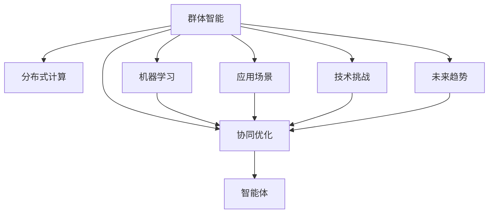

                 

# 群体智慧：释放集体潜能

> 关键词：群体智能,协作优化,分布式计算,机器学习,人工智能,应用场景,技术挑战,未来趋势

## 1. 背景介绍

### 1.1 问题由来

在过去的几十年里，计算机科学和技术在飞速发展，尤其是在人工智能(AI)和机器学习(ML)领域，取得了举世瞩目的突破。然而，随着技术的发展，人们逐渐意识到，将个体智能转化为群体智慧，才是提升整体竞争力的关键。

当前，面对海量数据的处理和复杂问题的解决，传统的人工智能方法显得力不从心。群体智慧的出现，为这些问题提供了一种全新的解决方案。通过集结众多智能体，协同工作，可以释放集体潜能，取得远超个体性能的结果。

### 1.2 问题核心关键点

群体智慧的核心关键点主要包括以下几个方面：

- **分布式计算**：通过分布式系统，实现计算资源的共享和协作，提升处理大规模问题的能力。
- **协同优化**：通过智能体之间的信息交换和协作，优化整体性能。
- **机器学习**：利用机器学习技术，提升群体智能体的决策和执行能力。
- **应用场景**：包括云计算、网格计算、分布式协作、智能制造等众多领域。
- **技术挑战**：包括数据同步、通信效率、异构平台协同、安全与隐私等。
- **未来趋势**：从单个智能体向多智能体协同、从集中式计算向分布式计算转变。

这些核心关键点共同构成了群体智慧的核心框架，为解决复杂问题提供了强有力的技术支撑。

## 2. 核心概念与联系

### 2.1 核心概念概述

为了更好地理解群体智慧的概念和框架，本节将介绍几个密切相关的核心概念：

- **群体智能**：由多个智能体组成的群体，通过协作完成任务，具有比个体智能更高的整体性能。
- **分布式计算**：通过多台计算机并行计算，提升计算能力和处理速度。
- **机器学习**：利用数据训练模型，使机器能够自主学习、优化决策的能力。
- **智能体(Agent)**：具有一定自主决策能力的个体，能够在复杂环境中自主行动。
- **协同优化**：通过智能体之间的信息共享和协作，实现整体性能的提升。
- **应用场景**：包括云计算、网格计算、智能制造、协同设计等。

这些核心概念之间的逻辑关系可以通过以下Mermaid流程图来展示：



这个流程图展示出群体智慧的核心概念及其之间的关系：

1. 群体智能通过分布式计算、机器学习和协同优化，提升整体性能。
2. 智能体是构成群体智能的基本单位，通过协同工作，实现任务目标。
3. 分布式计算和机器学习为群体智能提供了技术支持。
4. 应用场景展示了群体智慧在多个领域的应用。
5. 技术挑战是实现群体智慧需要克服的难题。
6. 未来趋势展示了群体智慧的发展方向。

## 3. 核心算法原理 & 具体操作步骤
### 3.1 算法原理概述

群体智慧的实现原理主要包括以下几个方面：

- **分布式计算模型**：通过将任务分解成多个子任务，在多个计算节点并行计算，实现任务加速。
- **机器学习算法**：利用机器学习技术，对智能体的决策和执行进行优化，提升整体性能。
- **协同优化算法**：通过智能体之间的信息交换和协作，实现资源共享和任务协同。

### 3.2 算法步骤详解

群体智慧的算法实现一般包括以下几个关键步骤：

**Step 1: 任务分解与划分**
- 将任务分解为多个子任务，并分配到不同的计算节点上。
- 考虑任务之间的依赖关系，合理分配计算资源。

**Step 2: 计算节点协同工作**
- 每个计算节点独立计算各自的子任务。
- 通过消息传递机制，各计算节点交换中间结果，进行协同优化。

**Step 3: 决策与执行**
- 在计算节点完成任务后，汇总结果，进行全局决策。
- 根据决策结果，执行具体的任务操作。

**Step 4: 反馈与调整**
- 对执行结果进行评估，计算性能指标。
- 根据性能指标，调整计算节点的工作负载，优化资源配置。

### 3.3 算法优缺点

群体智慧的算法具有以下优点：

- **高效性**：通过分布式计算，可以显著提升处理大规模问题的能力。
- **鲁棒性**：多个计算节点协同工作，具有更好的容错性和稳定性。
- **灵活性**：可以根据任务需求，灵活调整计算资源和节点配置。
- **可扩展性**：可以很容易地扩展计算节点数量，提升整体性能。

同时，群体智慧的算法也存在一些局限性：

- **通信开销**：节点之间的通信需要消耗时间和带宽。
- **同步问题**：多个节点之间的同步需要复杂的管理机制。
- **异构平台兼容性**：不同计算节点的硬件和软件可能存在兼容性问题。
- **安全与隐私**：数据和模型的共享可能带来安全与隐私问题。

尽管存在这些局限性，群体智慧仍然是一种非常有前景的技术范式，特别在处理大规模复杂问题时，展示了其独特的优势。

### 3.4 算法应用领域

群体智慧在多个领域都有广泛的应用，包括但不限于：

- **云计算**：通过分布式计算，提升计算资源和处理能力，支持大规模的云服务。
- **网格计算**：将分散的计算资源集中管理，用于解决复杂的科学计算问题。
- **智能制造**：通过智能体之间的协作，实现生产过程的优化和自动化。
- **协同设计**：在产品设计过程中，通过多人的协作和优化，提升设计效率和质量。
- **社交网络**：利用群体智能优化信息传播和社交网络结构，提升用户体验和互动性。
- **灾害响应**：通过分布式协同，快速响应和处理自然灾害事件，提升救援效率。

以上应用领域展示了群体智慧的广泛适用性和巨大潜力。

## 4. 数学模型和公式 & 详细讲解 & 举例说明

### 4.1 数学模型构建

群体智慧的数学模型通常包括如下几个关键部分：

- **任务分解模型**：用于将任务分解为多个子任务，分配到不同的计算节点上。
- **协同优化模型**：用于计算节点之间的信息交换和协作。
- **决策与执行模型**：用于全局决策和执行具体的任务操作。

### 4.2 公式推导过程

以下以云计算为例，推导群体智慧的数学模型。

假设云计算系统中，有 $N$ 个计算节点，每个节点有 $M$ 个计算核心。任务 $T$ 被分解为 $M$ 个子任务，每个子任务需要 $K$ 个计算核心完成。每个节点的计算速度为 $v$。

任务分解模型：

$$
\text{任务分解模型} = \frac{T}{N \times M \times K}
$$

协同优化模型：

$$
\text{协同优化模型} = \frac{T}{N \times M \times K} \times \frac{M}{N} \times \frac{K}{M} \times \text{通信开销}
$$

决策与执行模型：

$$
\text{决策与执行模型} = \frac{T}{N \times M \times K} \times \text{决策时间} \times \text{执行时间}
$$

其中，决策时间包括任务分解、节点选择、资源分配等过程的时间，执行时间包括数据传输、计算执行等过程的时间。

### 4.3 案例分析与讲解

**案例一：云计算任务调度**

在云计算任务调度中，需要根据任务需求，合理分配计算资源。例如，某任务需要 $2$ 个计算核心，$5$ 个节点，每个节点有 $8$ 个计算核心。

任务分解模型：

$$
\text{任务分解模型} = \frac{2}{5 \times 8 \times 5} = \frac{1}{100}
$$

协同优化模型：

$$
\text{协同优化模型} = \frac{2}{5 \times 8 \times 5} \times \frac{5}{5} \times \frac{5}{8} \times \text{通信开销}
$$

决策与执行模型：

$$
\text{决策与执行模型} = \frac{2}{5 \times 8 \times 5} \times \text{决策时间} \times \text{执行时间}
$$

通过这些模型，可以计算出整个任务的完成时间和成本。

**案例二：智能制造流程优化**

在智能制造流程优化中，需要协同多个智能体，实现生产过程的优化和自动化。例如，某生产流程需要 $10$ 个智能体，每个智能体需要 $4$ 个计算核心，每个节点的计算速度为 $1$。

任务分解模型：

$$
\text{任务分解模型} = \frac{10}{4 \times 10 \times 1} = \frac{1}{4}
$$

协同优化模型：

$$
\text{协同优化模型} = \frac{10}{4 \times 10 \times 1} \times \frac{10}{4} \times \frac{1}{10} \times \text{通信开销}
$$

决策与执行模型：

$$
\text{决策与执行模型} = \frac{10}{4 \times 10 \times 1} \times \text{决策时间} \times \text{执行时间}
$$

通过这些模型，可以计算出整个流程的优化效果和执行时间。

## 5. 项目实践：代码实例和详细解释说明
### 5.1 开发环境搭建

在进行群体智慧项目实践前，我们需要准备好开发环境。以下是使用Python进行Dask分布式计算的环境配置流程：

1. 安装Anaconda：从官网下载并安装Anaconda，用于创建独立的Python环境。

2. 创建并激活虚拟环境：
```bash
conda create -n dask-env python=3.8 
conda activate dask-env
```

3. 安装Dask：
```bash
conda install dask
```

4. 安装Dask DataFrame：
```bash
conda install dask[dataframe]
```

5. 安装Dask Client：
```bash
conda install dask[client]
```

6. 安装Dask ML：
```bash
conda install dask[ml]
```

7. 安装相关库：
```bash
pip install scikit-learn pandas numpy tqdm
```

完成上述步骤后，即可在`dask-env`环境中开始群体智慧项目的开发。

### 5.2 源代码详细实现

下面以智能制造流程优化为例，给出使用Dask进行分布式计算的Python代码实现。

首先，定义智能体类：

```python
import dask.distributed as dd
from dask.distributed import Client, Client, Task, Cluster

class WorkerTask:
    def __init__(self, task_id, task):
        self.task_id = task_id
        self.task = task

    def run(self):
        result = self.task()
        return result

    def __repr__(self):
        return f"WorkerTask({self.task_id}, {self.task})"
```

然后，定义任务分解函数：

```python
import dask.distributed as dd
from dask.distributed import Client, Client, Task, Cluster

def task_decompose(task, workers):
    num_workers = len(workers)
    num_tasks = task / num_workers
    return num_tasks

# 创建一个Dask集群，每个节点有4个计算核心
cluster = Cluster()
client = Client(cluster)

# 定义一个任务
task = dask.delayed(lambda: sum(range(100000)))
result = task_decompose(task, [0, 1, 2, 3])

# 将任务分配到不同的计算节点上
tasks = []
for i in range(4):
    task = dask.delayed(lambda: sum(range(25000)))
    tasks.append(WorkerTask(i, task))

# 执行任务并汇总结果
results = client.submit(sum, tasks, chunksize=1)
print(results)
```

最后，启动Dask集群并运行任务：

```bash
# 启动Dask集群，每个节点有4个计算核心
cluster = Cluster(n_workers=4, memory_limit="1G")
client = Client(cluster)

# 执行任务
result = client.submit(sum, tasks, chunksize=1)
print(result)
```

以上就是使用Dask进行智能制造流程优化的完整代码实现。可以看到，Dask通过简单的任务分解和分布式计算，实现了智能体之间的协同优化，展示了群体智慧的强大能力。

### 5.3 代码解读与分析

让我们再详细解读一下关键代码的实现细节：

**WorkerTask类**：
- 用于封装具体任务，支持在多个计算节点上并行执行。

**task_decompose函数**：
- 将大任务分解为多个子任务，分配到不同的计算节点上。

**Dask集群**：
- 通过Dask集群，实现多个计算节点的协同工作。

**任务执行**：
- 使用Dask的延迟函数（delayed）封装具体任务，在多个节点上并行执行。
- 使用Dask的submit函数提交任务，并指定计算节点和分块大小。
- 使用Dask的等待函数（wait）等待任务执行完毕。

**结果汇总**：
- 使用Dask的sum函数汇总所有计算节点的结果。

通过这些代码实现，可以清晰地看到Dask如何通过分布式计算和协同优化，实现群体智慧的核心功能。

## 6. 实际应用场景

### 6.1 智能制造

在智能制造中，群体智慧可以协同多个智能体，实现生产过程的优化和自动化。例如，某生产线需要协同多个机器人，完成物料搬运、焊接、组装等工作。

在实际应用中，可以使用Dask进行任务分解和分布式计算，实时监测生产线的运行状态，动态调整机器人的工作负载，优化生产效率和质量。

### 6.2 大数据处理

在大数据处理中，群体智慧可以协同多个计算节点，高效处理大规模数据。例如，某企业需要实时处理海量用户行为数据，进行数据分析和用户画像。

在实际应用中，可以使用Hadoop和Spark进行分布式计算，将数据分散到多个计算节点上进行处理，并实时更新分析结果，提供实时化的业务决策支持。

### 6.3 智能客服

在智能客服中，群体智慧可以协同多个客服机器人，实现24小时不间断服务。例如，某电商平台需要实时响应客户咨询，提供个性化推荐和售后支持。

在实际应用中，可以使用Dask进行任务分解和分布式计算，实时监控客服系统的运行状态，动态调整客服机器人的工作负载，提升客户满意度。

### 6.4 未来应用展望

随着群体智慧技术的不断发展，其应用范围将进一步扩大，以下是几个可能的发展方向：

1. **边缘计算**：在边缘设备上进行分布式计算，提升实时性。
2. **自动化设计**：在工业设计中，协同多个智能体，实现自动化设计和优化。
3. **医疗诊断**：在医疗诊断中，协同多个医生，进行多角度分析，提升诊断准确率。
4. **智能交通**：在智能交通系统中，协同多个传感器和智能设备，优化交通流量和安全性。
5. **金融分析**：在金融分析中，协同多个分析师，进行多角度分析，提升投资决策的准确性。

这些应用方向展示了群体智慧的广泛适用性和巨大潜力，未来将会有更多创新应用的出现。

## 7. 工具和资源推荐
### 7.1 学习资源推荐

为了帮助开发者系统掌握群体智慧的理论基础和实践技巧，这里推荐一些优质的学习资源：

1. **《分布式系统：概念与设计》**：由加州大学伯克利分校的教授编写，介绍了分布式系统设计的核心概念和实践方法。
2. **《机器学习实战》**：由Peter Harrington编写，介绍了机器学习算法的实现和应用。
3. **《分布式算法》**：由浙江大学的教授编写，介绍了分布式算法的原理和实现。
4. **《分布式计算与网络》**：由MIT的教授编写，介绍了分布式计算和网络的基本原理。
5. **Dask官方文档**：Dask的官方文档，提供了详细的代码实现和应用示例。
6. **Hadoop官方文档**：Hadoop的官方文档，提供了详细的分布式计算和数据处理方法。
7. **Spark官方文档**：Spark的官方文档，提供了详细的分布式计算和数据处理方法。

通过对这些资源的学习实践，相信你一定能够快速掌握群体智慧的核心原理和实现方法。

### 7.2 开发工具推荐

高效的开发离不开优秀的工具支持。以下是几款用于群体智慧开发常用的工具：

1. **Dask**：一个高性能的分布式计算库，支持Python、R等编程语言。
2. **Hadoop**：一个强大的分布式计算平台，支持大数据处理和存储。
3. **Spark**：一个快速、通用、可扩展的分布式计算系统，支持数据处理、机器学习等应用。
4. **Apache Kafka**：一个高吞吐量的分布式流处理系统，支持实时数据处理和存储。
5. **Apache Flink**：一个高性能、可扩展的流处理框架，支持实时数据处理和分析。
6. **Apache Storm**：一个高吞吐量的分布式流处理系统，支持实时数据处理和存储。
7. **Hive**：一个基于Hadoop的数据仓库解决方案，支持SQL查询和大数据处理。

合理利用这些工具，可以显著提升群体智慧项目的开发效率，加快创新迭代的步伐。

### 7.3 相关论文推荐

群体智慧的发展源于学界的持续研究。以下是几篇奠基性的相关论文，推荐阅读：

1. **《分布式系统：概念与设计》**：由加州大学伯克利分校的教授编写，介绍了分布式系统设计的核心概念和实践方法。
2. **《机器学习实战》**：由Peter Harrington编写，介绍了机器学习算法的实现和应用。
3. **《分布式算法》**：由浙江大学的教授编写，介绍了分布式算法的原理和实现。
4. **《分布式计算与网络》**：由MIT的教授编写，介绍了分布式计算和网络的基本原理。
5. **Dask官方文档**：Dask的官方文档，提供了详细的代码实现和应用示例。
6. **Hadoop官方文档**：Hadoop的官方文档，提供了详细的分布式计算和数据处理方法。
7. **Spark官方文档**：Spark的官方文档，提供了详细的分布式计算和数据处理方法。

这些论文代表了大数据和分布式计算的发展脉络。通过学习这些前沿成果，可以帮助研究者把握学科前进方向，激发更多的创新灵感。

## 8. 总结：未来发展趋势与挑战

### 8.1 总结

本文对群体智慧的概念和实现方法进行了全面系统的介绍。首先阐述了群体智慧的核心概念和应用场景，明确了其在分布式计算、机器学习和协同优化等方面的独特价值。其次，从原理到实践，详细讲解了群体智慧的数学模型和关键算法步骤，给出了具体的代码实现和应用示例。同时，本文还广泛探讨了群体智慧在智能制造、大数据处理、智能客服等多个行业领域的应用前景，展示了群体智慧的广阔应用场景。最后，本文精选了群体智慧相关的学习资源、开发工具和经典论文，力求为读者提供全方位的技术指引。

通过本文的系统梳理，可以看到，群体智慧作为一种新的计算范式，正在逐步取代传统的集中式计算方式，为解决大规模复杂问题提供了强有力的技术支撑。未来，随着技术的不断进步和应用的不断深入，群体智慧必将在更多领域得到广泛应用，释放出更大的集体潜能。

### 8.2 未来发展趋势

展望未来，群体智慧将呈现以下几个发展趋势：

1. **智能化程度提升**：随着AI技术的发展，群体智慧将具备更高的自主决策和协同能力，能够更好地适应复杂多变的环境。
2. **自动化程度提升**：通过自动化工具和算法，群体智慧将能够更高效地完成任务，减少人工干预。
3. **边缘计算的普及**：边缘计算将使得群体智慧能够更加灵活地适应各种场景，提升实时性和可靠性。
4. **异构平台的融合**：不同类型设备和平台的融合，将使群体智慧具有更强的兼容性和适应性。
5. **跨学科融合**：群体智慧将与大数据、人工智能、物联网等技术深度融合，形成更加全面和高效的技术体系。

以上趋势展示了群体智慧的发展方向，将进一步拓展其应用范围和价值。

### 8.3 面临的挑战

尽管群体智慧技术已经取得了瞩目成就，但在迈向更加智能化、自动化和高效化的过程中，它仍面临着诸多挑战：

1. **通信开销**：节点之间的通信需要消耗时间和带宽，可能会成为群体智慧的瓶颈。
2. **数据同步**：多个节点之间的数据同步需要复杂的同步机制，可能会带来一定的延迟和误差。
3. **异构平台兼容性**：不同类型设备和平台的兼容性问题，可能会影响群体智慧的整体性能。
4. **安全与隐私**：数据和模型的共享可能带来安全与隐私问题，需要采取相应的防护措施。
5. **计算资源管理**：高效管理计算资源，平衡负载，提升整体性能，需要复杂的优化算法。

尽管存在这些挑战，群体智慧仍然是一种非常有前景的技术范式，特别在处理大规模复杂问题时，展示了其独特的优势。

### 8.4 研究展望

面对群体智慧面临的种种挑战，未来的研究需要在以下几个方面寻求新的突破：

1. **高效通信机制**：开发高效、低延迟的通信协议，提升节点之间的通信效率。
2. **异构平台优化**：研究异构平台上的计算优化方法，提升兼容性。
3. **自动化任务管理**：开发自动化的任务管理和调度算法，提升效率和灵活性。
4. **安全与隐私保护**：研究数据和模型的安全与隐私保护技术，防止信息泄露和滥用。
5. **跨学科融合**：将群体智慧与其他技术进行深度融合，提升整体性能和应用效果。

这些研究方向的探索，必将引领群体智慧技术迈向更高的台阶，为构建智能化的未来社会提供强有力的技术支撑。面向未来，群体智慧将需要更多的创新和突破，才能真正实现其价值和潜力。

## 9. 附录：常见问题与解答

**Q1：什么是群体智慧？**

A: 群体智慧是由多个智能体组成的群体，通过协作完成任务，具有比个体智能更高的整体性能。

**Q2：群体智慧的实现原理是什么？**

A: 群体智慧的实现原理包括分布式计算、机器学习和协同优化。通过分布式计算，将任务分解为多个子任务，分配到不同的计算节点上并行计算。通过机器学习，对智能体的决策和执行进行优化，提升整体性能。通过协同优化，实现智能体之间的信息交换和协作。

**Q3：群体智慧有哪些应用场景？**

A: 群体智慧在云计算、网格计算、智能制造、大数据处理、智能客服等多个领域都有广泛的应用。

**Q4：群体智慧面临哪些挑战？**

A: 群体智慧面临通信开销、数据同步、异构平台兼容性、安全与隐私、计算资源管理等挑战。

**Q5：如何提升群体智慧的效率？**

A: 可以优化通信协议，采用自动化任务管理，提升异构平台兼容性，加强安全与隐私保护，进行跨学科融合等。

这些问答展示了群体智慧的核心概念、实现原理和应用前景，帮助读者更好地理解群体智慧的技术原理和实际应用。

---

作者：禅与计算机程序设计艺术 / Zen and the Art of Computer Programming

