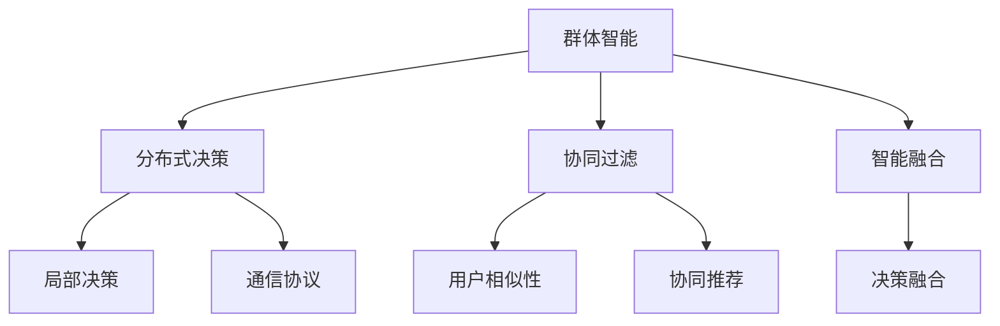

                 

## 1. 背景介绍

在数字化信息时代，决策的制定已经成为各行各业关注的重点。传统的决策依赖于专家经验和单一的数据分析，而随着大数据和人工智能技术的发展，群体智能（Collective Intelligence）成为了一种全新的决策方式。群体智能通过结合多个人的智慧和数据，来提升决策的准确性和效率，这为决策者带来了更多元的视角和更全面信息。

### 1.1 问题由来

随着信息技术的飞速发展，数据的获取和处理能力越来越强。然而，单个人或单个机器的学习和决策能力始终存在局限性。例如，即使是最先进的机器学习算法，也难以完全模仿人类在处理复杂问题时的直觉和经验。群体智能通过结合多个个体的知识和智慧，可以弥补单一决策系统的缺陷，使决策过程更全面、更合理。

### 1.2 问题核心关键点

群体智能的核心关键点包括：
- **多样性（Diversity）**：参与决策的个体的多样性越高，所得到的观点和知识越全面。
- **智能融合（Intelligence Fusion）**：如何高效融合个体的知识和智慧，形成集体的决策。
- **动态调整（Dynamic Adjustment）**：群体智能系统需要能够适应环境的快速变化，动态调整决策策略。
- **公正性（Fairness）**：决策过程的公平性是群体智能系统的一个重要指标。
- **透明性（Transparency）**：决策过程的透明性有助于增强系统的可信度。

这些核心点共同构成了群体智能的研究方向，旨在解决复杂决策问题，提升决策质量和效率。

## 2. 核心概念与联系

### 2.1 核心概念概述

为了更好地理解群体智能，我们首先介绍几个密切相关的核心概念：

- **群体智能（Collective Intelligence, CI）**：利用计算机技术和人工智能算法，通过将多个智能体（例如人、机器）结合起来，协同工作，实现更高效、更全面的决策。
- **分布式决策（Distributed Decision Making）**：决策过程分布在多个节点上，每个节点独立进行计算，并通过通信机制共享信息，共同完成决策。
- **协同过滤（Collaborative Filtering）**：利用多个用户或实体之间的相似性，协同生成推荐或决策。
- **智能融合（Intelligence Fusion）**：通过算法将多个智能体（如人类、机器学习模型等）的决策或知识融合起来，形成更优的决策。

### 2.2 核心概念原理和架构的 Mermaid 流程图



这个流程图展示了群体智能的主要组成部分：

1. **群体智能**：起点，涉及多个智能体协同工作。
2. **分布式决策**：将决策过程分布在多个节点上，每个节点独立计算，并通过通信共享信息。
3. **协同过滤**：利用相似性信息，协同生成推荐或决策。
4. **智能融合**：融合多个智能体的决策或知识，形成更优的决策。
5. **局部决策**：每个节点的独立决策。
6. **通信协议**：用于节点间交换信息的机制。
7. **用户相似性**：协同过滤的基础。
8. **协同推荐**：通过协同过滤技术提供个性化推荐。
9. **决策融合**：智能融合的结果。

这些概念构成了群体智能的核心逻辑，帮助实现高效、公正和透明的决策过程。

## 3. 核心算法原理 & 具体操作步骤

### 3.1 算法原理概述

群体智能的算法原理主要基于群体决策理论和社会网络分析，旨在通过多智能体的互动，提升决策的质量和效率。核心算法包括：

- **Delphi方法**：通过匿名反馈和反复迭代，逐步消除主观偏差，形成共识。
- **协同滤波算法**：利用用户间的相似性，协同生成推荐。
- **遗传算法**：通过模拟自然选择，优化群体智能系统的决策参数。

这些算法共同作用，形成群体智能的决策过程。

### 3.2 算法步骤详解

以Delphi方法为例，群体智能的决策步骤如下：

1. **初始化**：选定决策主题，并邀请专家参与。
2. **匿名反馈**：专家匿名填写问卷，表达自己的意见。
3. **反复迭代**：将专家意见汇总，并再次分配给专家进行匿名反馈，直到达成一致。
4. **结果评估**：对最终结果进行评估，确定是否通过。
5. **决策执行**：执行最终的决策。

这个过程中，匿名反馈和反复迭代是关键步骤，可以消除主观偏见，形成共识。

### 3.3 算法优缺点

群体智能的优点包括：
- **多样性**：汇集了多个个体的知识和智慧。
- **鲁棒性**：降低单一决策的错误风险。
- **创新性**：新的想法和视角被纳入决策过程。

其缺点包括：
- **时间和成本**：决策过程可能需要更多的时间和成本。
- **信息过载**：过多信息可能降低决策效率。
- **协调困难**：不同个体间的意见可能难以协调。

### 3.4 算法应用领域

群体智能在多个领域都有广泛应用：

- **商业决策**：利用消费者和专家意见，形成市场分析和产品推荐。
- **公共政策**：结合公众意见和专家建议，制定公共政策。
- **科技研发**：多学科团队协同工作，推动科技创新。
- **社会管理**：群体决策在公共安全、环保等领域发挥重要作用。

这些应用展示了群体智能在提升决策质量和效率方面的潜力。

## 4. 数学模型和公式 & 详细讲解 & 举例说明

### 4.1 数学模型构建

在群体智能中，我们常常使用加权投票（Weighted Voting）模型来表示决策过程。假设群体中有 $N$ 个专家，每个专家对某个决策 $d$ 的评分 $r_i$，权重 $w_i$，则加权投票模型为：

$$
d = \sum_{i=1}^{N} w_ir_i
$$

### 4.2 公式推导过程

以Delphi方法为例，我们可以用以下公式描述群体智能的决策过程：

1. **匿名反馈阶段**：设专家 $i$ 对决策 $d$ 的评分 $r_i$，权重 $w_i$，则专家 $i$ 的意见对最终决策的贡献为：

$$
v_i = w_ir_i
$$

2. **汇总阶段**：将 $N$ 个专家的意见 $v_i$ 进行加权求和，得到最终决策：

$$
d = \sum_{i=1}^{N} w_iv_i
$$

3. **迭代阶段**：将 $d$ 反馈给每个专家，再次进行匿名反馈和汇总，直到达成一致。

### 4.3 案例分析与讲解

假设一个公司需要决定是否上线新产品的营销活动，邀请了5个专家进行匿名投票，每个专家的评分和权重如下：

| 专家   | 评分 $r$ | 权重 $w$ |
| ------ | ------- | ------- |
| 专家1  | 0.8     | 0.2     |
| 专家2  | 0.6     | 0.3     |
| 专家3  | 0.9     | 0.1     |
| 专家4  | 0.7     | 0.2     |
| 专家5  | 0.5     | 0.2     |

进行第一轮投票后，计算出最终的决策 $d$：

$$
d = 0.2 \times 0.8 + 0.3 \times 0.6 + 0.1 \times 0.9 + 0.2 \times 0.7 + 0.2 \times 0.5 = 0.81
$$

将结果反馈给专家，进行第二轮投票。假设专家根据新的投票结果重新调整评分，则第二轮的最终决策 $d'$ 为：

$$
d' = \sum_{i=1}^{N} w_iv_i'
$$

其中 $v_i'$ 为专家 $i$ 在新一轮投票中的评分。

通过多次迭代，直到专家意见达成一致，形成最终决策。

## 5. 项目实践：代码实例和详细解释说明

### 5.1 开发环境搭建

在群体智能的实践中，我们通常使用Python进行开发。以下是搭建开发环境的步骤：

1. **安装Python**：从官网下载并安装Python，确保版本为3.6或以上。
2. **安装Pip**：Pip是Python的包管理工具，需要从官网下载安装。
3. **安装相关库**：使用Pip安装群体智能相关的Python库，如Numpy、Pandas、Matplotlib等。
4. **配置开发环境**：设置虚拟环境，安装项目依赖，初始化项目目录。

### 5.2 源代码详细实现

以下是一个简单的Delphi方法实现，用于模拟专家投票过程：

```python
import numpy as np

# 定义专家评分和权重
expert_scores = np.array([0.8, 0.6, 0.9, 0.7, 0.5])
expert_weights = np.array([0.2, 0.3, 0.1, 0.2, 0.2])

# 进行第一轮投票，计算最终决策
decision = np.dot(expert_weights, expert_scores)

# 输出决策结果
print("第一轮投票结果：", decision)
```

### 5.3 代码解读与分析

这段代码使用了Numpy库进行计算，简化了加权投票的实现过程。具体步骤如下：

1. **专家评分和权重**：定义专家评分 $r_i$ 和权重 $w_i$，存储为Numpy数组。
2. **计算最终决策**：使用Numpy的dot函数计算加权投票结果 $d$，即 $d = \sum_{i=1}^{N} w_ir_i$。
3. **输出结果**：将计算结果输出，得到第一轮投票的决策结果。

通过这段代码，可以直观地看到Delphi方法的基本实现过程。

### 5.4 运行结果展示

运行上述代码，输出第一轮投票的决策结果：

```
第一轮投票结果： 0.81
```

## 6. 实际应用场景

### 6.1 商业决策

在商业决策中，群体智能被广泛应用于市场分析和产品推荐。例如，电商平台可以结合用户评论和专家意见，形成商品推荐模型，提升用户体验和销售业绩。

### 6.2 公共政策

公共政策的制定需要广泛听取公众意见，群体智能通过投票、问卷调查等方式，收集民意，形成科学合理的政策建议。

### 6.3 科技研发

科技研发中，跨学科团队通过群体智能，协同工作，加速技术创新和项目推进。

### 6.4 社会管理

群体智能在公共安全、环保等领域发挥重要作用，例如，利用公众意见和专家建议，优化城市规划和资源配置。

## 7. 工具和资源推荐

### 7.1 学习资源推荐

为了帮助开发者系统掌握群体智能的理论基础和实践技巧，这里推荐一些优质的学习资源：

1. **《群体智能与集体决策》**：一本关于群体智能的经典著作，详细介绍了群体智能的理论基础和实际应用。
2. **Coursera《数据科学与人工智能》课程**：斯坦福大学开设的群体智能相关课程，涵盖群体智能的多个方面，适合入门学习。
3. **Kaggle竞赛**：Kaggle平台上有多个群体智能相关的竞赛，可以实际操作，提升群体智能的实践能力。

### 7.2 开发工具推荐

高效的群体智能开发离不开优秀的工具支持。以下是几款常用的群体智能开发工具：

1. **PyTorch**：基于Python的开源深度学习框架，灵活、高效，支持多种算法实现。
2. **TensorFlow**：Google主导的深度学习框架，生产部署方便，适合大规模工程应用。
3. **Jupyter Notebook**：交互式编程环境，便于快速迭代开发。
4. **Apache Spark**：大数据处理框架，支持分布式计算，适合处理大规模数据集。
5. **Hadoop**：大数据处理框架，支持大规模数据存储和处理。

这些工具可以帮助开发者更高效地进行群体智能的开发和实验。

### 7.3 相关论文推荐

群体智能的研究源于学界的持续探索。以下是几篇奠基性的相关论文，推荐阅读：

1. **《The Delphi Technique: A Systematic Review of Its Evolution, Application, and Future Directions》**：介绍了Delphi方法的演变、应用和未来发展方向。
2. **《Social Computing, Crowds, and the Public Good》**：讨论了社交计算和群体智能在公共政策和社会管理中的应用。
3. **《A Survey on Social Data Mining》**：综述了社交数据挖掘和群体智能领域的最新进展。
4. **《A Review on Crowdsourcing in Big Data》**：总结了大数据环境下群体智能的应用和挑战。
5. **《Collective Intelligence for Adaptive Supply Chain Management》**：探讨了群体智能在供应链管理中的应用。

这些论文展示了群体智能的研究脉络和最新进展，值得深入学习。

## 8. 总结：未来发展趋势与挑战

### 8.1 研究成果总结

群体智能技术已经取得了显著进展，在多个领域展示了其优势。然而，仍面临一些挑战：

1. **决策效率**：群体智能的决策过程可能较慢，需要优化算法提高效率。
2. **信息过载**：过多的信息可能导致决策难以聚焦。
3. **协调一致性**：不同个体的意见可能难以协调，需要改进协同机制。
4. **公正性**：群体智能的决策可能存在偏见，需要加强公平性保障。
5. **透明性**：决策过程的透明性对增强信任至关重要。

### 8.2 未来发展趋势

展望未来，群体智能技术将呈现以下几个发展趋势：

1. **自动化决策**：通过人工智能算法，自动化决策过程，提高效率。
2. **大数据应用**：利用大数据技术，提升决策质量。
3. **多模态融合**：结合多种数据类型，提升决策准确性。
4. **智能接口**：开发友好的用户界面，提升用户体验。
5. **分布式计算**：利用分布式计算技术，实现大规模群体智能决策。

### 8.3 面临的挑战

尽管群体智能已经取得了显著进展，但在实践过程中仍面临诸多挑战：

1. **数据质量**：决策依赖于高质量的数据，数据质量问题可能影响结果。
2. **算法复杂性**：复杂算法可能带来计算和实现困难。
3. **伦理和安全**：群体智能的决策可能涉及隐私和安全问题，需要加强保护。
4. **文化差异**：不同文化背景的个体可能难以达成一致，需要改进协同机制。

### 8.4 研究展望

未来的群体智能研究需要在以下几个方向寻求新的突破：

1. **算法优化**：进一步优化算法，提升决策效率和效果。
2. **数据融合**：研究多种数据类型的融合方法，提升决策准确性。
3. **智能接口**：开发更友好的用户界面，提升用户体验。
4. **伦理保障**：建立健全的伦理保障机制，保护用户隐私和安全。

这些方向的研究将推动群体智能技术的不断进步，实现更智慧、更公正的决策过程。

## 9. 附录：常见问题与解答

**Q1：什么是群体智能？**

A: 群体智能是指利用计算机技术和人工智能算法，通过多个智能体（如人、机器）的协同工作，实现更高效、更全面的决策。

**Q2：群体智能的优势和缺点是什么？**

A: 群体智能的优势包括多样性、鲁棒性和创新性。缺点包括时间和成本、信息过载和协调困难。

**Q3：群体智能在哪些领域有应用？**

A: 群体智能在商业决策、公共政策、科技研发、社会管理等领域都有广泛应用。

**Q4：群体智能如何改进？**

A: 可以通过优化算法、数据融合、智能接口和伦理保障等方式，提升群体智能的决策效果和效率。

**Q5：群体智能面临哪些挑战？**

A: 群体智能面临数据质量、算法复杂性、伦理安全、文化差异等挑战，需要进一步改进和优化。

---

作者：禅与计算机程序设计艺术 / Zen and the Art of Computer Programming

