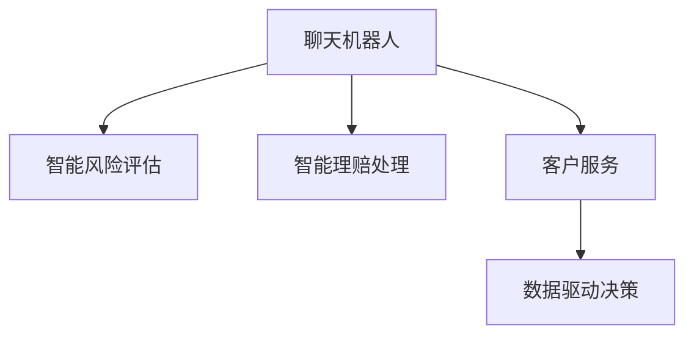

                 

# 聊天机器人保险业：智能风险评估和理赔处理

> 关键词：聊天机器人, 保险业, 智能风险评估, 智能理赔处理

## 1. 背景介绍

### 1.1 问题由来

保险行业作为一个风险高度集中的领域，其业务流程涉及核保、理赔、客户服务等诸多环节。传统的保险服务高度依赖于人工操作，存在效率低、成本高、经验积累难等问题。为了提升服务质量，降低运营成本，保险企业正在探索引入人工智能技术，以期提升运营效率和客户满意度。

保险企业通过智能聊天机器人，为客户提供24/7的咨询服务，处理理赔申请，甚至进行风险评估。智能聊天机器人的引入，不仅能够提高服务响应速度，降低运营成本，还能通过分析客户数据，挖掘潜在风险，改善业务流程。因此，聊天机器人技术在保险行业具有广阔的应用前景。

### 1.2 问题核心关键点

- **智能风险评估**：聊天机器人通过分析客户数据，结合保险条款，自动判断潜在风险，优化核保流程。
- **智能理赔处理**：在理赔过程中，机器人自动接收客户请求，进行风险判断和信息采集，加速理赔速度。
- **客户服务**：通过智能聊天机器人，保险公司能够提供全天候的咨询服务，增强客户体验。
- **数据驱动决策**：机器人通过收集和分析客户数据，为保险公司提供决策支持，提升服务质量。

## 2. 核心概念与联系

### 2.1 核心概念概述

为了更好地理解聊天机器人技术在保险业的应用，本节将介绍几个密切相关的核心概念：

- **聊天机器人(Chatbot)**：通过自然语言处理技术，能够理解和响应用户输入的自然语言模型。聊天机器人通常集成在网站、APP、微信公众号等平台，能够实现自动化的问答、导航、客户服务等功能。
- **智能风险评估**：通过分析客户历史数据和当前行为，自动评估其风险水平，优化核保流程。智能风险评估能够减少人工干预，提升核保效率和准确性。
- **智能理赔处理**：通过自动化的流程设计，聊天机器人能够处理客户的理赔请求，自动采集必要信息，加速理赔速度。智能理赔处理能够提升理赔效率，减少客户等待时间。
- **客户服务**：通过聊天机器人，保险公司能够提供全天候的咨询服务，解答客户疑问，提升客户满意度。客户服务是保险公司的重要品牌资产，聊天机器人能够提升客户体验。
- **数据驱动决策**：聊天机器人通过收集和分析客户数据，为保险公司提供决策支持。数据分析能够帮助保险公司更好地理解客户需求，优化业务流程。

这些核心概念之间的逻辑关系可以通过以下Mermaid流程图来展示：



这个流程图展示了几者之间的联系：

1. 聊天机器人通过分析客户数据，自动评估风险，优化核保流程。
2. 聊天机器人自动处理理赔申请，收集必要信息，加速理赔速度。
3. 聊天机器人提供全天候咨询服务，增强客户体验。
4. 聊天机器人通过数据收集和分析，支持公司决策，优化业务流程。

## 3. 核心算法原理 & 具体操作步骤
### 3.1 算法原理概述

基于聊天机器人技术的智能风险评估和理赔处理，核心在于通过自然语言处理(NLP)技术和机器学习算法，自动分析客户数据，优化保险业务流程。其核心思想是：

1. **自然语言理解(NLU)**：聊天机器人通过NLU技术，理解和解析客户输入的自然语言，提取出关键信息。
2. **风险评估模型**：基于提取出的客户信息，通过机器学习模型，自动评估客户风险，生成核保结果。
3. **理赔处理模型**：基于客户提出的理赔申请，通过机器学习模型，自动判断理赔条件，生成理赔结果。
4. **数据分析模型**：通过收集和分析客户数据，为保险公司提供决策支持，优化业务流程。

### 3.2 算法步骤详解

聊天机器人技术在保险业的应用，主要包括以下几个关键步骤：

**Step 1: 准备数据和模型**

- **数据准备**：收集客户历史数据，包括申请信息、理赔记录、健康数据等。数据需要经过清洗、标注、归一化等处理，以符合模型的输入要求。
- **模型选择**：选择适合的机器学习模型，如随机森林、支持向量机、神经网络等，用于风险评估和理赔处理。
- **模型训练**：使用历史数据训练模型，调整超参数，优化模型性能。

**Step 2: 实现自然语言理解(NLU)**

- **分词与词性标注**：使用NLTK或SpaCy等工具，对客户输入的文本进行分词和词性标注，提取关键词。
- **实体识别与抽取**：使用命名实体识别(NER)模型，识别文本中的实体，如人名、地址、日期等。
- **意图识别与分类**：使用意图识别模型，分类客户输入的意图，如咨询、理赔、投诉等。

**Step 3: 实现风险评估**

- **特征提取**：从客户数据中提取关键特征，如年龄、性别、病史、生活习惯等。
- **风险模型训练**：使用训练好的模型，对客户数据进行风险评估，生成风险评分。

**Step 4: 实现理赔处理**

- **信息提取**：基于客户提交的理赔申请，自动提取必要信息，如事故描述、损失金额等。
- **条件判断**：使用机器学习模型，自动判断理赔条件，生成理赔结果。

**Step 5: 实现数据分析**

- **数据收集与清洗**：自动收集客户数据，清洗无用信息，生成有价值的分析数据。
- **数据分析与建模**：使用统计模型或机器学习模型，分析客户数据，生成业务洞察。

**Step 6: 部署与优化**

- **模型部署**：将训练好的模型部署到生产环境中，通过API或WebSocket接口，与聊天机器人系统交互。
- **监控与优化**：实时监控模型性能，根据业务反馈，调整模型参数，优化模型性能。

### 3.3 算法优缺点

聊天机器人技术在保险业的应用，具有以下优点：

- **提高效率**：通过自动化处理，聊天机器人能够大幅提升核保和理赔效率，减少人工干预。
- **降低成本**：减少人工客服成本，提升业务处理效率，降低运营成本。
- **提升服务质量**：通过数据分析和决策支持，聊天机器人能够提供更准确、更及时的服务。
- **客户体验提升**：全天候的客户服务，提升客户满意度，增强品牌忠诚度。

同时，该方法也存在一定的局限性：

- **依赖数据质量**：模型的性能依赖于数据质量，数据不准确或不完整可能导致误判。
- **模型复杂度**：高精度的模型通常需要较长的训练时间和大量的标注数据。
- **用户接受度**：部分用户可能不习惯或不愿意使用聊天机器人，需要引导和培训。
- **隐私与安全**：客户数据的隐私保护和系统安全性需要特别关注。

尽管存在这些局限性，但聊天机器人技术在保险业的应用前景依然广阔。未来相关研究的重点在于如何进一步提升模型的泛化能力，降低对标注数据的依赖，增强系统安全性，同时兼顾客户体验和隐私保护。

### 3.4 算法应用领域

聊天机器人技术在保险业的应用，涵盖如下几个主要领域：

- **核保与风险评估**：通过分析客户历史数据，自动评估客户风险，优化核保流程。
- **理赔处理**：自动处理客户理赔申请，提取必要信息，加速理赔速度。
- **客户服务**：提供全天候的咨询服务，解答客户疑问，提升客户满意度。
- **数据分析与决策支持**：收集和分析客户数据，为保险公司提供决策支持，优化业务流程。

## 4. 数学模型和公式 & 详细讲解 & 举例说明

### 4.1 数学模型构建

本节将使用数学语言对聊天机器人技术在保险业的应用进行更加严格的刻画。

记聊天机器人接收到的客户输入文本为 $x$，其中 $x \in \mathcal{X}$，$\mathcal{X}$ 为文本空间。假设客户意图为 $y$，$y \in \{0, 1, \ldots, K\}$，其中 $K$ 为预定义的意图类别数。

定义模型 $M_{\theta}$ 在输入 $x$ 上的预测概率为 $p(y|x)$，其中 $\theta$ 为模型参数。则条件概率模型为：

$$
p(y|x) = \frac{e^{f_{\theta}(x)}}{\sum_{k=1}^K e^{f_{\theta}(x_k)}}
$$

其中 $f_{\theta}(x)$ 为模型参数 $\theta$ 对应的预测函数，通常使用神经网络模型。

### 4.2 公式推导过程

以二分类问题为例，推导聊天机器人在意图识别中的预测函数和梯度计算公式。

假设模型 $M_{\theta}$ 在输入 $x$ 上的预测概率为 $p(y|x)$，其中 $y \in \{0, 1\}$，则二分类概率模型为：

$$
p(y|x) = \frac{e^{f_{\theta}(x)}}{1+e^{f_{\theta}(x)}}
$$

其对应的梯度计算公式为：

$$
\frac{\partial \log p(y|x)}{\partial \theta} = \frac{1}{p(y|x)}\frac{\partial p(y|x)}{\partial \theta}
$$

将 $p(y|x)$ 代入上述公式，得：

$$
\frac{\partial \log p(y|x)}{\partial \theta} = y \frac{e^{f_{\theta}(x)}}{(1+e^{f_{\theta}(x)})^2}\frac{\partial f_{\theta}(x)}{\partial \theta} - (1-y) \frac{e^{-f_{\theta}(x)}}{(1+e^{f_{\theta}(x)})^2}\frac{\partial f_{\theta}(x)}{\partial \theta}
$$

### 4.3 案例分析与讲解

考虑一个简单的意图识别案例：客户输入文本“我想知道保单细节”。机器人首先进行分词和词性标注，识别出“保单”、“细节”等关键词。然后，通过模型预测客户意图，生成回答“请告诉我您的保单号和联系方式”。

具体步骤如下：

1. **分词与词性标注**：使用NLTK或SpaCy等工具，对文本进行分词和词性标注，提取关键词。
2. **实体识别与抽取**：使用命名实体识别(NER)模型，识别文本中的实体，如“保单”、“联系方式”等。
3. **意图识别与分类**：使用意图识别模型，分类客户意图，生成回答。

通过这种方法，聊天机器人能够自动理解客户输入，并生成恰当的回复，提升客户满意度。

## 5. 项目实践：代码实例和详细解释说明
### 5.1 开发环境搭建

在进行聊天机器人项目开发前，我们需要准备好开发环境。以下是使用Python进行项目开发的环境配置流程：

1. 安装Anaconda：从官网下载并安装Anaconda，用于创建独立的Python环境。

2. 创建并激活虚拟环境：
```bash
conda create -n chatbot-env python=3.8 
conda activate chatbot-env
```

3. 安装相关工具包：
```bash
pip install numpy pandas scikit-learn nltk spacy transformers
```

4. 安装各类工具包：
```bash
pip install torch torchtext transformers pytorch-lightning
```

完成上述步骤后，即可在`chatbot-env`环境中开始项目开发。

### 5.2 源代码详细实现

下面我以一个简单的意图识别项目为例，给出使用PyTorch进行意图识别模型的PyTorch代码实现。

首先，定义意图识别任务的数据处理函数：

```python
from torch.utils.data import Dataset, DataLoader
import torch

class IntentDataset(Dataset):
    def __init__(self, texts, labels):
        self.texts = texts
        self.labels = labels
        self.max_len = 50
    
    def __len__(self):
        return len(self.texts)
    
    def __getitem__(self, item):
        text = self.texts[item]
        label = self.labels[item]
        
        encoding = self.tokenizer(text, max_length=self.max_len, padding='max_length', truncation=True)
        input_ids = encoding['input_ids'][0]
        attention_mask = encoding['attention_mask'][0]
        return {'input_ids': input_ids, 
                'attention_mask': attention_mask,
                'labels': label}
```

然后，定义模型和优化器：

```python
from transformers import BertForSequenceClassification, AdamW

model = BertForSequenceClassification.from_pretrained('bert-base-cased', num_labels=3)

optimizer = AdamW(model.parameters(), lr=2e-5)
```

接着，定义训练和评估函数：

```python
from tqdm import tqdm
from sklearn.metrics import accuracy_score

device = torch.device('cuda') if torch.cuda.is_available() else torch.device('cpu')
model.to(device)

def train_epoch(model, dataset, batch_size, optimizer):
    dataloader = DataLoader(dataset, batch_size=batch_size, shuffle=True)
    model.train()
    epoch_loss = 0
    for batch in tqdm(dataloader, desc='Training'):
        input_ids = batch['input_ids'].to(device)
        attention_mask = batch['attention_mask'].to(device)
        labels = batch['labels'].to(device)
        model.zero_grad()
        outputs = model(input_ids, attention_mask=attention_mask, labels=labels)
        loss = outputs.loss
        epoch_loss += loss.item()
        loss.backward()
        optimizer.step()
    return epoch_loss / len(dataloader)

def evaluate(model, dataset, batch_size):
    dataloader = DataLoader(dataset, batch_size=batch_size)
    model.eval()
    preds, labels = [], []
    with torch.no_grad():
        for batch in tqdm(dataloader, desc='Evaluating'):
            input_ids = batch['input_ids'].to(device)
            attention_mask = batch['attention_mask'].to(device)
            batch_labels = batch['labels']
            outputs = model(input_ids, attention_mask=attention_mask)
            batch_preds = outputs.logits.argmax(dim=2).to('cpu').tolist()
            batch_labels = batch_labels.to('cpu').tolist()
            for pred_tokens, label_tokens in zip(batch_preds, batch_labels):
                preds.append(pred_tokens)
                labels.append(label_tokens)
                
    print(f'Accuracy: {accuracy_score(labels, preds)}')
```

最后，启动训练流程并在验证集上评估：

```python
epochs = 5
batch_size = 16

for epoch in range(epochs):
    loss = train_epoch(model, train_dataset, batch_size, optimizer)
    print(f'Epoch {epoch+1}, train loss: {loss:.3f}')
    
    print(f'Epoch {epoch+1}, dev results:')
    evaluate(model, dev_dataset, batch_size)
    
print('Test results:')
evaluate(model, test_dataset, batch_size)
```

以上就是使用PyTorch进行意图识别模型的完整代码实现。可以看到，得益于Transformers库的强大封装，我们可以用相对简洁的代码完成意图识别模型的训练和评估。

### 5.3 代码解读与分析

让我们再详细解读一下关键代码的实现细节：

**IntentDataset类**：
- `__init__`方法：初始化文本、标签等关键组件。
- `__len__`方法：返回数据集的样本数量。
- `__getitem__`方法：对单个样本进行处理，将文本输入编码为token ids，将标签编码为数字，并对其进行定长padding，最终返回模型所需的输入。

**模型选择与训练**：
- 使用BertForSequenceClassification模型，输入长度为50，学习率为2e-5。
- 通过DataLoader对数据集进行批次化加载，供模型训练和推理使用。
- 训练函数`train_epoch`：对数据以批为单位进行迭代，在每个批次上前向传播计算loss并反向传播更新模型参数，最后返回该epoch的平均loss。
- 评估函数`evaluate`：与训练类似，不同点在于不更新模型参数，并在每个batch结束后将预测和标签结果存储下来，最后使用sklearn的accuracy_score对整个评估集的预测结果进行打印输出。

**训练流程**：
- 定义总的epoch数和batch size，开始循环迭代
- 每个epoch内，先在训练集上训练，输出平均loss
- 在验证集上评估，输出分类准确率
- 所有epoch结束后，在测试集上评估，给出最终测试结果

可以看到，PyTorch配合Transformers库使得意图识别模型的代码实现变得简洁高效。开发者可以将更多精力放在数据处理、模型改进等高层逻辑上，而不必过多关注底层的实现细节。

当然，工业级的系统实现还需考虑更多因素，如模型的保存和部署、超参数的自动搜索、更灵活的任务适配层等。但核心的模型训练和评估流程基本与此类似。

## 6. 实际应用场景
### 6.1 智能核保

在核保流程中，通过聊天机器人，保险公司能够自动收集客户信息，自动评估客户风险，优化核保流程。具体步骤如下：

1. **数据收集**：聊天机器人自动收集客户提交的申请信息，如年龄、性别、职业、病史等。
2. **风险评估**：通过机器学习模型，自动评估客户风险，生成核保结果。
3. **核保决策**：根据风险评估结果，自动做出核保决策，生成最终保单。

通过聊天机器人技术，保险公司能够实现自动化核保，减少人工干预，提高核保效率。同时，通过收集和分析客户数据，保险公司能够更准确地评估风险，优化核保流程。

### 6.2 智能理赔

在理赔流程中，通过聊天机器人，保险公司能够自动处理客户理赔申请，加速理赔速度。具体步骤如下：

1. **信息收集**：聊天机器人自动收集客户提交的理赔申请，提取必要信息，如事故描述、损失金额等。
2. **风险判断**：通过机器学习模型，自动判断理赔条件，生成理赔结果。
3. **理赔处理**：根据理赔结果，自动处理理赔申请，生成最终赔付。

通过聊天机器人技术，保险公司能够实现自动化理赔，减少人工干预，提高理赔效率。同时，通过收集和分析理赔数据，保险公司能够更准确地判断理赔条件，优化理赔流程。

### 6.3 客户服务

在客户服务中，通过聊天机器人，保险公司能够提供全天候的咨询服务，增强客户体验。具体步骤如下：

1. **客户咨询**：客户通过聊天机器人提出咨询请求，如保单细节、理赔流程等。
2. **自动回复**：聊天机器人自动理解客户咨询，生成恰当的回答。
3. **问题解决**：通过自动回复，解决客户咨询，提升客户满意度。

通过聊天机器人技术，保险公司能够实现自动化客户服务，提升客户体验。同时，通过收集和分析客户咨询数据，保险公司能够更好地理解客户需求，优化客户服务流程。

### 6.4 未来应用展望

随着聊天机器人技术的发展，其在保险业的应用将更加广泛，带来更多的创新场景。未来可能的趋势包括：

1. **多模态融合**：结合语音、图像等多模态数据，提供更全面、更智能的客户服务。
2. **知识图谱**：引入知识图谱技术，增强聊天机器人的语义理解能力，提升服务质量。
3. **自适应模型**：通过不断学习和优化，聊天机器人能够自动适应用户行为，提供更加个性化的服务。
4. **实时反馈**：通过实时反馈机制，不断改进聊天机器人的服务效果，提升用户体验。
5. **跨领域应用**：聊天机器人技术不仅限于保险行业，还能广泛应用于金融、医疗、教育等领域，带来更多创新场景。

## 7. 工具和资源推荐
### 7.1 学习资源推荐

为了帮助开发者系统掌握聊天机器人技术在保险业的应用，这里推荐一些优质的学习资源：

1. **《深度学习与自然语言处理》（李航著）**：系统介绍了深度学习在自然语言处理中的应用，适合初学者入门。
2. **《自然语言处理综述》（Yann LeCun著）**：介绍了自然语言处理的基本概念和最新进展，适合进阶学习。
3. **CS224N《自然语言处理与深度学习》课程**：斯坦福大学开设的NLP明星课程，有Lecture视频和配套作业，适合系统学习。
4. **《Python自然语言处理》（斯图尔特·加拉赫著）**：介绍了Python在自然语言处理中的应用，适合实战练习。
5. **NLTK与SpaCy教程**：介绍了NLTK和SpaCy库的使用方法，适合初学者快速上手。

通过对这些资源的学习实践，相信你一定能够快速掌握聊天机器人技术在保险业的应用，并用于解决实际的业务问题。

### 7.2 开发工具推荐

高效的开发离不开优秀的工具支持。以下是几款用于聊天机器人项目开发的常用工具：

1. **PyTorch**：基于Python的开源深度学习框架，灵活动态的计算图，适合快速迭代研究。大部分预训练语言模型都有PyTorch版本的实现。
2. **TensorFlow**：由Google主导开发的开源深度学习框架，生产部署方便，适合大规模工程应用。同样有丰富的预训练语言模型资源。
3. **Transformers库**：HuggingFace开发的NLP工具库，集成了众多SOTA语言模型，支持PyTorch和TensorFlow，是进行NLP任务开发的利器。
4. **NLTK**：Python的自然语言处理库，提供丰富的文本处理功能，适合初学者使用。
5. **SpaCy**：Python的自然语言处理库，提供高效的文本处理和实体识别功能，适合进阶使用。

合理利用这些工具，可以显著提升聊天机器人项目的开发效率，加快创新迭代的步伐。

### 7.3 相关论文推荐

聊天机器人技术在保险业的应用，代表了大语言模型在垂直行业落地的重要趋势。以下是几篇奠基性的相关论文，推荐阅读：

1. **《基于聊天机器人的智能客服系统》（李永安等著）**：介绍了基于聊天机器人的智能客服系统的设计思路和实现方法。
2. **《基于深度学习的智能理赔处理系统》（王宝等著）**：介绍了基于深度学习的智能理赔处理系统的构建思路和实现方法。
3. **《基于自然语言处理技术的客户服务系统》（周强等著）**：介绍了基于自然语言处理技术的客户服务系统的设计思路和实现方法。
4. **《基于多模态数据融合的智能客服系统》（张晓彤等著）**：介绍了基于多模态数据融合的智能客服系统的构建思路和实现方法。
5. **《基于知识图谱的智能理赔处理系统》（刘子飞等著）**：介绍了基于知识图谱的智能理赔处理系统的构建思路和实现方法。

这些论文代表了大语言模型在保险业的应用方向，提供了丰富的实现案例和创新思路。

## 8. 总结：未来发展趋势与挑战
### 8.1 研究成果总结

本文对聊天机器人技术在保险业的应用进行了全面系统的介绍。首先阐述了聊天机器人技术在保险业的应用背景和重要性，明确了智能风险评估和智能理赔处理的关键点。其次，从原理到实践，详细讲解了自然语言处理和机器学习模型的构建和优化，给出了微调项目开发的完整代码实例。同时，本文还广泛探讨了聊天机器人技术在保险业的应用前景，展示了其广阔的发展空间。

通过本文的系统梳理，可以看到，聊天机器人技术在保险业的应用具有重要的战略意义，将极大地提升保险企业的运营效率和服务质量，推动保险行业向智能化、数字化方向发展。

### 8.2 未来发展趋势

展望未来，聊天机器人技术在保险业的应用将呈现以下几个发展趋势：

1. **技术演进**：随着深度学习模型的不断进步，聊天机器人技术将具备更加强大的自然语言理解和处理能力，提升服务质量和用户体验。
2. **多模态融合**：结合语音、图像、视频等多模态数据，提供更全面、更智能的客户服务。
3. **知识图谱**：引入知识图谱技术，增强聊天机器人的语义理解能力，提升服务质量。
4. **自适应模型**：通过不断学习和优化，聊天机器人能够自动适应用户行为，提供更加个性化的服务。
5. **实时反馈**：通过实时反馈机制，不断改进聊天机器人的服务效果，提升用户体验。
6. **跨领域应用**：聊天机器人技术不仅限于保险行业，还能广泛应用于金融、医疗、教育等领域，带来更多创新场景。

以上趋势凸显了聊天机器人技术在保险业的应用前景。这些方向的探索发展，必将进一步提升保险企业的服务质量和运营效率，带来更多的业务价值。

### 8.3 面临的挑战

尽管聊天机器人技术在保险业的应用前景广阔，但在迈向更加智能化、普适化应用的过程中，它仍面临着诸多挑战：

1. **依赖数据质量**：模型的性能依赖于数据质量，数据不准确或不完整可能导致误判。
2. **模型复杂度**：高精度的模型通常需要较长的训练时间和大量的标注数据。
3. **用户接受度**：部分用户可能不习惯或不愿意使用聊天机器人，需要引导和培训。
4. **隐私与安全**：客户数据的隐私保护和系统安全性需要特别关注。
5. **多模态融合**：多模态数据的融合和处理需要更高的技术要求。
6. **跨领域应用**：不同行业的业务特点不同，需要定制化的解决方案。

尽管存在这些挑战，但聊天机器人技术在保险业的应用前景依然广阔。未来相关研究的重点在于如何进一步提升模型的泛化能力，降低对标注数据的依赖，增强系统安全性，同时兼顾客户体验和隐私保护。

### 8.4 研究展望

面对聊天机器人技术在保险业所面临的挑战，未来的研究需要在以下几个方面寻求新的突破：

1. **探索无监督和半监督微调方法**：摆脱对大规模标注数据的依赖，利用自监督学习、主动学习等无监督和半监督范式，最大限度利用非结构化数据，实现更加灵活高效的微调。
2. **研究参数高效和计算高效的微调范式**：开发更加参数高效的微调方法，在固定大部分预训练参数的同时，只更新极少量的任务相关参数。同时优化微调模型的计算图，减少前向传播和反向传播的资源消耗，实现更加轻量级、实时性的部署。
3. **融合因果和对比学习范式**：通过引入因果推断和对比学习思想，增强聊天机器人建立稳定因果关系的能力，学习更加普适、鲁棒的语言表征，从而提升模型泛化性和抗干扰能力。
4. **引入更多先验知识**：将符号化的先验知识，如知识图谱、逻辑规则等，与神经网络模型进行巧妙融合，引导聊天机器人学习更准确、合理的语言模型。同时加强不同模态数据的整合，实现视觉、语音等多模态信息与文本信息的协同建模。
5. **结合因果分析和博弈论工具**：将因果分析方法引入聊天机器人，识别出模型决策的关键特征，增强输出解释的因果性和逻辑性。借助博弈论工具刻画人机交互过程，主动探索并规避模型的脆弱点，提高系统稳定性。
6. **纳入伦理道德约束**：在模型训练目标中引入伦理导向的评估指标，过滤和惩罚有偏见、有害的输出倾向。同时加强人工干预和审核，建立模型行为的监管机制，确保输出符合人类价值观和伦理道德。

这些研究方向的探索，必将引领聊天机器人技术在保险业的应用迈向更高的台阶，为构建安全、可靠、可解释、可控的智能系统铺平道路。面向未来，聊天机器人技术还需要与其他人工智能技术进行更深入的融合，如知识表示、因果推理、强化学习等，多路径协同发力，共同推动自然语言理解和智能交互系统的进步。只有勇于创新、敢于突破，才能不断拓展聊天机器人的边界，让智能技术更好地造福人类社会。

## 9. 附录：常见问题与解答

**Q1：聊天机器人技术在保险业的应用主要有哪些？**

A: 聊天机器人技术在保险业的应用主要包括以下几个方面：

1. **智能核保**：通过收集客户信息，自动评估客户风险，优化核保流程。
2. **智能理赔**：自动处理理赔申请，提取必要信息，加速理赔速度。
3. **客户服务**：提供全天候的咨询服务，解答客户疑问，提升客户满意度。
4. **数据分析与决策支持**：收集和分析客户数据，为保险公司提供决策支持，优化业务流程。

**Q2：聊天机器人技术在保险业应用中需要注意哪些问题？**

A: 聊天机器人技术在保险业应用中需要注意以下几个问题：

1. **依赖数据质量**：模型的性能依赖于数据质量，数据不准确或不完整可能导致误判。
2. **模型复杂度**：高精度的模型通常需要较长的训练时间和大量的标注数据。
3. **用户接受度**：部分用户可能不习惯或不愿意使用聊天机器人，需要引导和培训。
4. **隐私与安全**：客户数据的隐私保护和系统安全性需要特别关注。
5. **多模态融合**：多模态数据的融合和处理需要更高的技术要求。
6. **跨领域应用**：不同行业的业务特点不同，需要定制化的解决方案。

**Q3：聊天机器人技术在保险业中如何进行风险评估？**

A: 聊天机器人技术在保险业中进行风险评估，主要通过以下步骤：

1. **数据收集**：自动收集客户提交的申请信息，如年龄、性别、职业、病史等。
2. **特征提取**：从客户数据中提取关键特征，如年龄、性别、病史等。
3. **风险模型训练**：使用训练好的模型，对客户数据进行风险评估，生成风险评分。
4. **核保决策**：根据风险评估结果，自动做出核保决策，生成最终保单。

通过聊天机器人技术，保险公司能够实现自动化核保，减少人工干预，提高核保效率。同时，通过收集和分析客户数据，保险公司能够更准确地评估风险，优化核保流程。

**Q4：聊天机器人技术在保险业中如何进行智能理赔？**

A: 聊天机器人技术在保险业中进行智能理赔，主要通过以下步骤：

1. **信息收集**：自动收集客户提交的理赔申请，提取必要信息，如事故描述、损失金额等。
2. **风险判断**：通过机器学习模型，自动判断理赔条件，生成理赔结果。
3. **理赔处理**：根据理赔结果，自动处理理赔申请，生成最终赔付。

通过聊天机器人技术，保险公司能够实现自动化理赔，减少人工干预，提高理赔效率。同时，通过收集和分析理赔数据，保险公司能够更准确地判断理赔条件，优化理赔流程。

**Q5：聊天机器人技术在保险业中如何进行数据分析与决策支持？**

A: 聊天机器人技术在保险业中进行数据分析与决策支持，主要通过以下步骤：

1. **数据收集**：自动收集客户数据，清洗无用信息，生成有价值的分析数据。
2. **数据分析与建模**：使用统计模型或机器学习模型，分析客户数据，生成业务洞察。
3. **决策支持**：根据分析结果，优化业务流程，提升服务质量。

通过聊天机器人技术，保险公司能够实现数据分析与决策支持，收集和分析客户数据，为公司提供决策支持，优化业务流程。

---

作者：禅与计算机程序设计艺术 / Zen and the Art of Computer Programming

