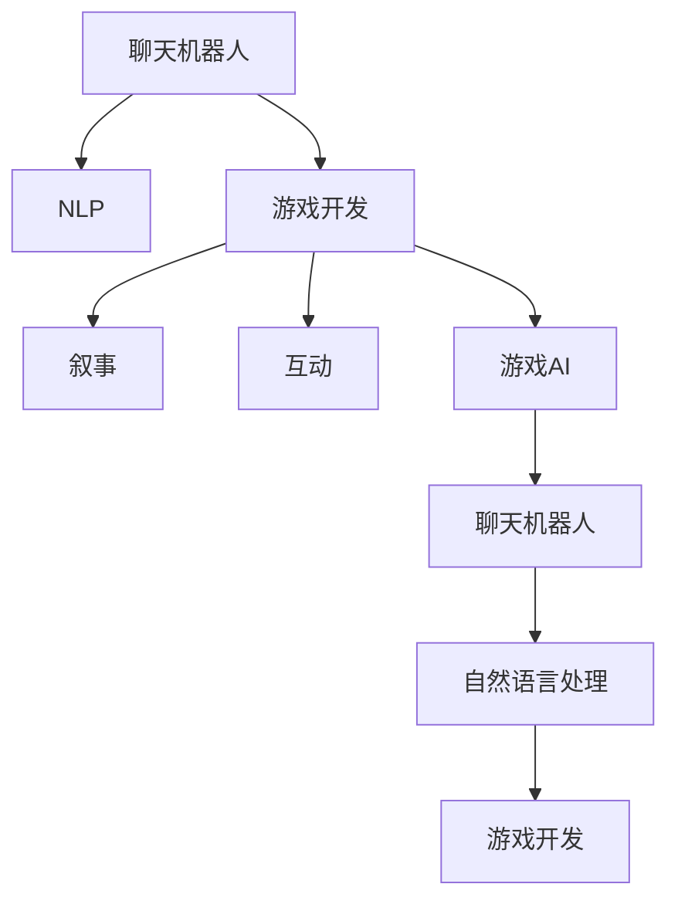

                 

## 1. 背景介绍

### 1.1 问题由来
聊天机器人作为人工智能领域的重要应用，近年来随着深度学习技术的发展，在各个行业中的应用逐渐增多。从传统的客服咨询到智能家居控制，从在线教育辅导到游戏娱乐交互，聊天机器人正以前所未有的速度进入人们的日常生活。然而，尽管有了巨大进步，聊天机器人在与人类交互的复杂性和自然性方面仍存在一定的局限性。

### 1.2 问题核心关键点
聊天机器人在游戏开发中的应用主要集中在互动和叙事方面。一个成功的游戏聊天机器人不仅需要能够与玩家进行流畅的对话，还需要能够构建引人入胜的故事线，从而提升游戏的沉浸感和用户体验。

### 1.3 问题研究意义
开发基于聊天机器人的游戏不仅能够提高游戏的互动性和叙事性，还能够显著降低游戏开发的成本和时间。此外，聊天机器人可以处理大量的玩家对话，使得玩家能够自由探索游戏世界，而不需要过多的引导和干预。

## 2. 核心概念与联系

### 2.1 核心概念概述

为了更好地理解聊天机器人游戏开发的技术和理论，本节将介绍几个关键的概念和它们之间的联系：

- **聊天机器人**：指能够模拟人类对话并根据上下文环境进行实时互动的AI模型。
- **自然语言处理（NLP）**：指让计算机理解、解释和生成人类语言的技术。
- **游戏开发**：指创建和开发电子游戏的过程，涉及游戏设计、编程、美术等多方面的工作。
- **叙事**：指在交互过程中通过对话、情节发展等方式构建故事线，使玩家能够沉浸在游戏世界中的技术。
- **互动**：指游戏角色之间以及玩家与游戏系统之间的对话、行动、反馈等互动元素。
- **游戏AI**：指用于增强游戏智能性的各种AI技术，包括聊天机器人、游戏策略AI等。

这些核心概念之间的逻辑关系可以通过以下Mermaid流程图来展示：



这个流程图展示了几大核心概念之间的关系：

1. 聊天机器人依赖于NLP技术，能够理解并生成自然语言。
2. 聊天机器人在游戏开发中主要用于叙事和互动。
3. 游戏开发包括叙事和互动等元素，需要通过AI技术进行实现。
4. 游戏AI包括聊天机器人，能够提升游戏的智能化水平。
5. 聊天机器人和自然语言处理相互支撑，使游戏更加自然流畅。
6. 游戏开发过程离不开聊天机器人和NLP技术的支持。

这些概念共同构成了聊天机器人游戏开发的技术基础，使得聊天机器人能够在互动和叙事中发挥重要作用。

## 3. 核心算法原理 & 具体操作步骤
### 3.1 算法原理概述

聊天机器人游戏开发的互动和叙事部分主要依赖于NLP技术和游戏AI。其中，NLP技术负责理解和生成自然语言，游戏AI则负责在对话中构建故事线和互动元素。

聊天机器人在游戏中的互动和叙事算法主要包括以下几个步骤：

1. **输入理解**：将玩家输入的自然语言文本转化为机器可理解的形式。
2. **意图识别**：通过NLP模型识别玩家输入的意图和需求。
3. **对话生成**：根据玩家的意图和游戏状态生成合适的回复。
4. **故事构建**：通过聊天机器人的互动逐步构建游戏故事线。
5. **互动响应**：根据玩家的动作和游戏状态调整聊天机器人的回复和行为。

### 3.2 算法步骤详解

以一个简单的游戏场景为例，详细讲解聊天机器人游戏开发的过程：

1. **输入理解**：
   - 当玩家输入“你好，我是玩家”，聊天机器人首先需要将这个文本进行分词和词性标注。
   - 使用Transformer模型等NLP技术将文本转化为向量形式。
   - 通过嵌入层将向量输入到LSTM或其他序列模型中进行处理。

2. **意图识别**：
   - 使用意图分类模型（如RNN、CNN等）对输入文本进行分类，识别出玩家想要进行的操作（如探索、战斗、求助等）。
   - 根据分类结果选择相应的处理流程。

3. **对话生成**：
   - 使用生成模型（如GPT、BERT等）生成合适的回复。
   - 根据上下文环境和游戏状态调整回复的内容和形式。
   - 使用规则模板或生成式方法构建回复文本。

4. **故事构建**：
   - 在玩家和聊天机器人的互动过程中逐步构建游戏故事线。
   - 根据玩家的选择和动作调整故事发展方向。
   - 使用对话管理模块（Dialog Management）控制故事的进程。

5. **互动响应**：
   - 根据玩家的动作和游戏状态更新游戏状态。
   - 调整聊天机器人的回复，以适应玩家的新动作和环境变化。
   - 使用反应模型（Reaction Model）生成玩家反应预测。

### 3.3 算法优缺点

聊天机器人游戏开发的互动和叙事算法具有以下优点：

1. **自然交互**：聊天机器人能够与玩家进行自然的对话，提升游戏体验。
2. **灵活互动**：根据玩家的不同行为和选择，聊天机器人能够动态调整对话和故事线。
3. **多样性**：通过不同的对话生成和故事构建方法，可以创造多样化的游戏体验。
4. **可扩展性**：游戏AI能够根据需求灵活扩展和调整，适用于各种游戏类型和情节。

同时，该算法也存在一定的局限性：

1. **资源消耗**：聊天机器人和游戏AI需要大量的计算资源和存储空间。
2. **模型复杂性**：对话生成和故事构建模型的复杂度较高，需要大量的训练数据和优化。
3. **数据需求**：需要大量标注数据进行训练，数据获取成本较高。
4. **响应速度**：对话生成和故事构建的实时性要求较高，可能需要优化模型结构或算法流程。

尽管存在这些局限性，但聊天机器人游戏开发在提升游戏互动性和叙事性方面已经取得了显著成果，成为游戏开发的一个重要方向。

### 3.4 算法应用领域

聊天机器人游戏开发的互动和叙事算法已经在许多游戏领域中得到了应用，如角色扮演（RPG）、策略模拟、教育游戏等。

1. **角色扮演游戏（RPG）**：聊天机器人能够在游戏中与玩家进行对话，引导玩家完成主线任务和支线任务，提升游戏的沉浸感和可玩性。
2. **策略模拟游戏**：聊天机器人可以提供任务简报、策略建议等功能，帮助玩家制定和执行战术策略。
3. **教育游戏**：聊天机器人能够与学生进行互动，提供学习资源和答疑解惑，辅助学习过程。
4. **模拟经营游戏**：聊天机器人可以提供市场分析和商业建议，帮助玩家管理虚拟企业。

除了这些游戏类型外，聊天机器人游戏开发还拓展到了虚拟现实（VR）和增强现实（AR）等领域，为游戏提供了全新的交互方式和沉浸感。

## 4. 数学模型和公式 & 详细讲解 & 举例说明

### 4.1 数学模型构建

为了更好地理解聊天机器人游戏开发的互动和叙事算法，本节将介绍一些关键的数学模型和公式。

假设玩家输入的文本为 $x$，聊天机器人生成的回复为 $y$。

1. **输入理解模型**：
   - 将文本 $x$ 转化为向量形式 $X$。
   - 使用嵌入层将向量 $X$ 输入到神经网络中。
   - 定义向量 $X$ 与标签 $y$ 之间的关系 $P(Y|X)$。

2. **意图识别模型**：
   - 使用RNN或CNN等模型对文本 $x$ 进行分类。
   - 定义意图 $y$ 的概率分布 $P(Y|X)$。

3. **对话生成模型**：
   - 使用生成模型（如GPT、BERT等）生成回复 $y$。
   - 定义回复 $y$ 的条件概率 $P(Y|X)$。

4. **故事构建模型**：
   - 使用序列模型（如LSTM、GRU等）对游戏状态和玩家行为进行分析。
   - 定义故事线 $s$ 的概率分布 $P(S|X,Y)$。

5. **互动响应模型**：
   - 使用反应模型（如决策树、神经网络等）预测玩家行为。
   - 定义玩家行为 $a$ 的条件概率 $P(A|X,Y)$。

### 4.2 公式推导过程

以生成模型为例，推导生成回复的概率分布 $P(Y|X)$：

设 $P(Y|X)$ 为回复 $Y$ 的条件概率，$P(Y|X)$ 可以表示为：

$$
P(Y|X) = \frac{e^{\sum_{i=1}^{n} log\theta_i \cdot Y_i}}{\sum_{j=1}^{m} e^{\sum_{i=1}^{n} log\theta_i \cdot Y_j}}
$$

其中，$\theta_i$ 为模型的权重参数，$Y_i$ 为输出文本 $Y$ 中的第 $i$ 个单词。

### 4.3 案例分析与讲解

以一个简单的文本生成任务为例，展示生成模型在聊天机器人中的应用：

1. **输入理解**：
   - 输入文本 $x$ = "你好，我想去探险"。
   - 将文本转化为向量 $X$。
   - 输入向量 $X$ 到神经网络中，得到向量 $X'$。

2. **意图识别**：
   - 使用RNN模型对 $X'$ 进行分类，识别出意图为 "探险"。
   - 生成对应的输出概率 $P(Y|X)$。

3. **对话生成**：
   - 使用生成模型生成回复 $y$。
   - 根据上下文环境和游戏状态调整回复内容。

4. **故事构建**：
   - 根据玩家的 "探险" 意图和当前游戏状态，调整故事线。
   - 逐步构建故事线 $s$。

5. **互动响应**：
   - 预测玩家的下一步动作。
   - 根据预测结果调整聊天机器人的回复和行为。

通过上述步骤，聊天机器人可以与玩家进行自然流畅的对话，逐步构建游戏故事线，提升游戏的互动性和叙事性。

## 5. 项目实践：代码实例和详细解释说明

### 5.1 开发环境搭建

在进行聊天机器人游戏开发前，我们需要准备好开发环境。以下是使用Python进行PyTorch开发的环境配置流程：

1. 安装Anaconda：从官网下载并安装Anaconda，用于创建独立的Python环境。

2. 创建并激活虚拟环境：
```bash
conda create -n chatbot-env python=3.8 
conda activate chatbot-env
```

3. 安装PyTorch：根据CUDA版本，从官网获取对应的安装命令。例如：
```bash
conda install pytorch torchvision torchaudio cudatoolkit=11.1 -c pytorch -c conda-forge
```

4. 安装NLP相关库：
```bash
pip install nltk spacy transformers
```

5. 安装游戏引擎相关库：
```bash
pip install pygame pyglet
```

完成上述步骤后，即可在`chatbot-env`环境中开始聊天机器人游戏开发。

### 5.2 源代码详细实现

这里我们以一个简单的基于NLP的聊天机器人游戏为例，展示其在Python中的实现。

首先，定义聊天机器人的NLP模型和游戏场景：

```python
import torch
from transformers import GPT2Tokenizer, GPT2LMHeadModel
from spacy import displacy
import pygame

# 定义游戏场景
class Game:
    def __init__(self):
        self.player_pos = (0, 0)
        self.map = [['Wall', 'Wall', 'Wall'],
                   ['Wall', 'Path', 'Wall'],
                   ['Wall', 'Path', 'Wall']]
        self.state = 'Exploration'

    def update(self):
        # 更新游戏状态
        pass

class Chatbot:
    def __init__(self, model, tokenizer):
        self.model = model
        self.tokenizer = tokenizer

    def process_input(self, input_text):
        # 对输入文本进行理解
        input_ids = self.tokenizer.encode(input_text, return_tensors='pt')
        hidden_states = self.model(input_ids)[0]
        logits = self.model(input_ids)[1]

        # 对输出进行解码
        tokens = self.tokenizer.decode(hidden_states[0].tolist(), skip_special_tokens=True)
        tokens = tokens.replace('<end>', '\n')

        return tokens

# 加载预训练模型
model = GPT2LMHeadModel.from_pretrained('gpt2')
tokenizer = GPT2Tokenizer.from_pretrained('gpt2')
chatbot = Chatbot(model, tokenizer)

# 初始化游戏
game = Game()
```

然后，定义聊天机器人的对话生成函数：

```python
class Chatbot:
    def __init__(self, model, tokenizer):
        self.model = model
        self.tokenizer = tokenizer

    def process_input(self, input_text):
        # 对输入文本进行理解
        input_ids = self.tokenizer.encode(input_text, return_tensors='pt')
        hidden_states = self.model(input_ids)[0]
        logits = self.model(input_ids)[1]

        # 对输出进行解码
        tokens = self.tokenizer.decode(hidden_states[0].tolist(), skip_special_tokens=True)
        tokens = tokens.replace('<end>', '\n')

        return tokens

    def generate_reply(self, player_input):
        # 生成回复
        tokens = self.process_input(player_input)
        reply = tokens.strip()

        return reply
```

接着，定义游戏的主循环函数：

```python
def main():
    pygame.init()
    screen = pygame.display.set_mode((800, 600))
    clock = pygame.time.Clock()

    chatbot = Chatbot(model, tokenizer)
    game = Game()

    while True:
        clock.tick(60)
        for event in pygame.event.get():
            if event.type == pygame.QUIT:
                pygame.quit()
                return

        # 获取玩家输入
        player_input = input('你：')
        
        # 生成回复
        chatbot_reply = chatbot.generate_reply(player_input)

        # 渲染游戏画面
        screen.fill((0, 0, 0))
        displacy.render(chatbot_reply, style='github', word_wrap=True, palette='dark', jupyter=False)
        pygame.display.flip()

        # 更新游戏状态
        game.update()

        pygame.time.delay(16)

    pygame.quit()
    pygame.display.quit()
```

最后，启动游戏循环：

```python
if __name__ == '__main__':
    main()
```

以上就是使用PyTorch和Transformer库进行聊天机器人游戏开发的完整代码实现。可以看到，通过调用预训练模型和NLP库，聊天机器人能够与玩家进行自然流畅的对话，并根据游戏状态和玩家输入生成回复。

### 5.3 代码解读与分析

让我们再详细解读一下关键代码的实现细节：

**Game类**：
- `__init__`方法：初始化游戏场景、玩家位置、地图和状态。
- `update`方法：更新游戏状态，根据玩家动作和环境变化进行调整。

**Chatbot类**：
- `__init__`方法：初始化聊天机器人模型和分词器。
- `process_input`方法：对玩家输入进行理解，生成输出概率分布。
- `generate_reply`方法：根据玩家输入和输出概率分布生成回复文本。

**main函数**：
- 初始化游戏和聊天机器人。
- 主循环中处理玩家输入、生成回复并渲染游戏画面。
- 根据玩家动作和游戏状态更新游戏状态。

通过这个简单的代码示例，可以看到聊天机器人在游戏开发中的应用是如何实现的。通过调用预训练模型和NLP库，聊天机器人能够与玩家进行自然的对话，并根据游戏状态生成合适的回复。

当然，实际的游戏开发中还需要考虑更多因素，如游戏逻辑、图像处理、音效等。但核心的聊天机器人互动和叙事算法基本与此类似。

## 6. 实际应用场景
### 6.1 角色扮演游戏（RPG）

在角色扮演游戏中，聊天机器人可以与玩家进行复杂的对话，引导玩家完成主线任务和支线任务，提升游戏的沉浸感和可玩性。例如，在《巫师3：狂猎》中，玩家可以通过与NPC进行对话，了解游戏世界的故事背景和任务信息。聊天机器人通过NLP技术理解玩家输入，生成合适的回复，构建引人入胜的游戏情节。

### 6.2 策略模拟游戏

在策略模拟游戏中，聊天机器人可以提供任务简报、策略建议等功能，帮助玩家制定和执行战术策略。例如，在《文明6》中，玩家可以通过与AI助手进行对话，获取资源管理、科技研发等建议，优化游戏策略。聊天机器人通过分析玩家的操作和游戏状态，生成合适的回复，提供策略指导。

### 6.3 教育游戏

在教育游戏中，聊天机器人可以与学生进行互动，提供学习资源和答疑解惑，辅助学习过程。例如，在Khan Academy的在线课程中，学生可以通过与虚拟助教进行对话，获取学习资料和答案解析，提高学习效果。聊天机器人通过理解学生的问题和反馈，生成合适的回复，提供学习支持。

### 6.4 未来应用展望

随着NLP技术的不断发展，聊天机器人在游戏开发中的应用将会更加广泛和深入。未来，聊天机器人将不仅仅用于互动和叙事，还将拓展到情感识别、虚拟现实等领域，为游戏带来更多创新和可能性。

1. **情感识别**：通过分析玩家的情绪和行为，聊天机器人可以更好地理解玩家需求，生成更加贴近真实情感的回复。例如，在《最终幻想VII》中，NPC可以根据玩家的情绪变化，调整对话内容和情感表达。

2. **虚拟现实**：在虚拟现实游戏中，聊天机器人可以通过增强现实技术，与玩家进行更加自然的互动。例如，在《Rec Room》中，玩家可以通过虚拟现实设备与聊天机器人进行对话，体验沉浸式的游戏环境。

3. **社会化游戏**：在社会化游戏中，聊天机器人可以模拟真实社交场景，与玩家进行多角色互动。例如，在《Eve Online》中，玩家可以通过与NPC进行对话，参与太空探险和贸易活动，构建复杂的社交网络。

4. **自适应游戏**：通过分析玩家的历史数据和行为模式，聊天机器人可以提供个性化的游戏体验。例如，在《星际争霸2》中，AI对手可以根据玩家的操作和风格，调整策略和对话内容，提升游戏挑战性和趣味性。

## 7. 工具和资源推荐
### 7.1 学习资源推荐

为了帮助开发者系统掌握聊天机器人游戏开发的理论基础和实践技巧，这里推荐一些优质的学习资源：

1. 《Python自然语言处理》书籍：详细介绍了NLP技术的基本原理和应用，涵盖序列模型、生成模型等关键内容。
2. 《Python游戏编程》书籍：介绍了游戏开发的基本概念和实践技巧，包括Pygame、Pyglet等游戏引擎的使用。
3. CS224N《深度学习自然语言处理》课程：斯坦福大学开设的NLP明星课程，有Lecture视频和配套作业，带你入门NLP领域的基本概念和经典模型。
4. CS50《计算机科学导论》课程：哈佛大学开设的计算机科学入门课程，涵盖计算机编程和数据结构等内容，适合初学者学习。
5. Kaggle：提供大量NLP和游戏开发的竞赛数据集和样例代码，帮助开发者练习和提升技能。

通过对这些资源的学习实践，相信你一定能够快速掌握聊天机器人游戏开发的精髓，并用于解决实际的NLP问题。

### 7.2 开发工具推荐

高效的开发离不开优秀的工具支持。以下是几款用于聊天机器人游戏开发的常用工具：

1. PyTorch：基于Python的开源深度学习框架，灵活动态的计算图，适合快速迭代研究。
2. TensorFlow：由Google主导开发的开源深度学习框架，生产部署方便，适合大规模工程应用。
3. Pygame：简单易用的Python游戏引擎，支持2D图形和声音，适合开发小型游戏。
4. Pyglet：基于Python的游戏引擎，支持3D图形和窗口管理，适合开发复杂的交互式应用。
5. NVIDIA GpuToolkit：提供GPU加速和优化工具，支持深度学习模型的训练和推理。

合理利用这些工具，可以显著提升聊天机器人游戏开发的效率，加快创新迭代的步伐。

### 7.3 相关论文推荐

聊天机器人游戏开发的技术发展源于学界的持续研究。以下是几篇奠基性的相关论文，推荐阅读：

1. Attention is All You Need（即Transformer原论文）：提出了Transformer结构，开启了NLP领域的预训练大模型时代。
2. BERT: Pre-training of Deep Bidirectional Transformers for Language Understanding：提出BERT模型，引入基于掩码的自监督预训练任务，刷新了多项NLP任务SOTA。
3. Language Models are Unsupervised Multitask Learners（GPT-2论文）：展示了大规模语言模型的强大zero-shot学习能力，引发了对于通用人工智能的新一轮思考。
4. Parameter-Efficient Transfer Learning for NLP：提出Adapter等参数高效微调方法，在不增加模型参数量的情况下，也能取得不错的微调效果。
5. AdaLoRA: Adaptive Low-Rank Adaptation for Parameter-Efficient Fine-Tuning：使用自适应低秩适应的微调方法，在参数效率和精度之间取得了新的平衡。

这些论文代表了大语言模型微调技术的发展脉络。通过学习这些前沿成果，可以帮助研究者把握学科前进方向，激发更多的创新灵感。

## 8. 总结：未来发展趋势与挑战

### 8.1 总结

本文对聊天机器人游戏开发的互动和叙事算法进行了全面系统的介绍。首先阐述了聊天机器人游戏开发的背景和意义，明确了其在提升游戏互动性和叙事性方面的独特价值。其次，从原理到实践，详细讲解了聊天机器人游戏开发的技术和算法，给出了开发代码示例。同时，本文还广泛探讨了聊天机器人游戏开发在多个行业领域的应用前景，展示了其广阔的应用空间。此外，本文精选了聊天机器人游戏开发的各类学习资源，力求为读者提供全方位的技术指引。

通过本文的系统梳理，可以看到，聊天机器人游戏开发在提升游戏互动性和叙事性方面已经取得了显著成果，成为游戏开发的一个重要方向。得益于NLP技术的不断发展，聊天机器人游戏开发的应用领域还将不断拓展，为游戏带来更多创新和可能性。

### 8.2 未来发展趋势

展望未来，聊天机器人游戏开发将呈现以下几个发展趋势：

1. **情感识别**：聊天机器人将更加注重分析玩家的情感和行为，生成更加贴近真实情感的回复，提升游戏的沉浸感。
2. **虚拟现实**：通过增强现实技术，聊天机器人可以在虚拟现实游戏中提供更加自然、互动的体验，拓展游戏场景。
3. **社交互动**：聊天机器人可以模拟真实社交场景，与玩家进行多角色互动，构建复杂的社交网络。
4. **个性化体验**：通过分析玩家的历史数据和行为模式，聊天机器人可以提供个性化的游戏体验，提升游戏趣味性和挑战性。
5. **多模态互动**：聊天机器人可以结合视觉、听觉等多种模态信息，提供更加丰富和多样化的游戏体验。

这些趋势凸显了聊天机器人游戏开发的广阔前景。未来的研究将在情感识别、虚拟现实、社交互动等方面进行深入探索，使得聊天机器人在游戏开发中发挥更加重要的作用。

### 8.3 面临的挑战

尽管聊天机器人游戏开发已经取得了显著成就，但在迈向更加智能化、普适化应用的过程中，它仍面临着诸多挑战：

1. **资源消耗**：聊天机器人和游戏AI需要大量的计算资源和存储空间。
2. **模型复杂性**：对话生成和故事构建模型的复杂度较高，需要大量的训练数据和优化。
3. **数据需求**：需要大量标注数据进行训练，数据获取成本较高。
4. **响应速度**：对话生成和故事构建的实时性要求较高，可能需要优化模型结构或算法流程。
5. **可解释性**：聊天机器人的决策过程难以解释，需要更多研究和优化。
6. **安全性**：聊天机器人的输出可能存在偏见和有害信息，需要建立监管机制。

尽管存在这些挑战，但通过不断探索和优化，聊天机器人游戏开发必将在未来取得更大的突破，为游戏带来更多的创新和可能。

### 8.4 研究展望

面对聊天机器人游戏开发所面临的挑战，未来的研究需要在以下几个方面寻求新的突破：

1. **无监督和半监督学习**：探索不依赖标注数据的无监督和半监督学习范式，降低数据获取成本，提升模型泛化能力。
2. **计算高效和参数高效**：开发更加计算高效和参数高效的微调方法，提高模型实时性和资源利用效率。
3. **多模态交互**：结合视觉、听觉等多种模态信息，提供更加丰富和多样化的游戏体验。
4. **多任务学习和知识整合**：通过多任务学习和知识整合，提升聊天机器人的通用性和适应性。
5. **安全性保障**：建立聊天机器人的监管机制，确保输出符合伦理道德，避免有害信息的输出。

这些研究方向的探索，必将引领聊天机器人游戏开发技术迈向更高的台阶，为构建更加智能化、可解释、可控的聊天机器人游戏提供支持。面向未来，聊天机器人游戏开发还需要与其他人工智能技术进行更深入的融合，如知识表示、因果推理、强化学习等，多路径协同发力，共同推动游戏技术的进步。

## 9. 附录：常见问题与解答

**Q1：聊天机器人如何理解玩家输入的自然语言？**

A: 聊天机器人通过NLP技术理解玩家输入的自然语言。首先，将文本进行分词和词性标注，然后通过嵌入层将文本转化为向量形式。接着，将向量输入到神经网络中，通过多层结构进行语义理解和特征提取。最后，使用分类器或生成模型对文本进行处理，生成合适的回复。

**Q2：聊天机器人在游戏中的角色有哪些？**

A: 聊天机器人在游戏中的角色主要分为三种：

1. **NPC（Non-Player Character）**：模拟真实角色，与玩家进行对话，提供任务信息和故事背景。
2. **助手**：提供任务简报、策略建议等功能，帮助玩家制定和执行战术策略。
3. **导航器**：通过语音或文本引导玩家进行游戏探索和任务完成，提升游戏体验。

**Q3：如何提升聊天机器人的互动性和叙事性？**

A: 提升聊天机器人的互动性和叙事性需要综合考虑以下几个方面：

1. **多角色互动**：通过设计多角色的对话，增强游戏的社交性和沉浸感。
2. **情节构建**：通过构建复杂的故事情节和任务链，提升游戏的吸引力和可玩性。
3. **实时反馈**：通过及时响应用户操作和反馈，提供个性化的游戏体验。
4. **情感识别**：通过分析玩家的情绪和行为，生成更加贴近真实情感的回复。

**Q4：聊天机器人在游戏开发中的应用局限是什么？**

A: 聊天机器人在游戏开发中的应用存在以下几个局限：

1. **计算资源消耗大**：聊天机器人和游戏AI需要大量的计算资源和存储空间。
2. **数据获取成本高**：需要大量标注数据进行训练，数据获取成本较高。
3. **实时性要求高**：对话生成和故事构建的实时性要求较高，需要优化模型结构或算法流程。
4. **可解释性不足**：聊天机器人的决策过程难以解释，需要更多研究和优化。
5. **安全性问题**：聊天机器人的输出可能存在偏见和有害信息，需要建立监管机制。

通过这些常见问题的解答，相信你能够更好地理解聊天机器人游戏开发的互动和叙事算法，并应用于实际的游戏开发中。

---

作者：禅与计算机程序设计艺术 / Zen and the Art of Computer Programming

