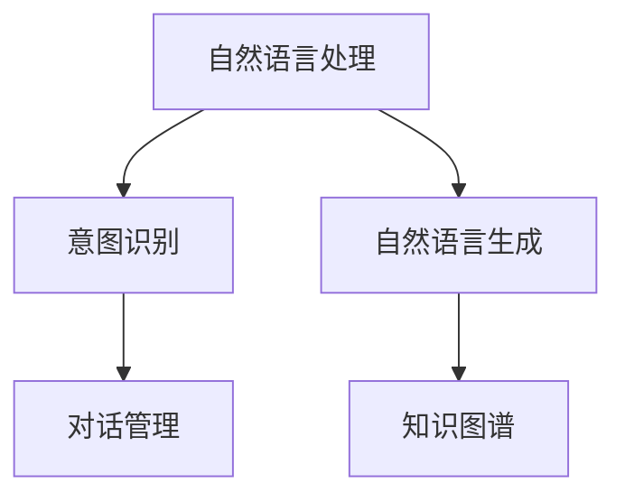

                 

## 1. 背景介绍

### 1.1 问题由来
随着人工智能技术的迅猛发展，客户服务行业正在经历着一场深刻的变革。传统客服模式主要依靠人工坐席，既耗费人力成本，又难以满足全天候服务需求。而聊天机器人作为一种新兴的智能客服工具，通过自然语言处理技术和机器学习算法，实现了对客户咨询的自动理解和处理，极大提升了客户服务效率。

### 1.2 问题核心关键点
聊天机器人（Chatbot）的核心在于通过自然语言处理技术，理解和生成自然语言，与用户进行交互。其核心算法包括：

1. **自然语言理解（NLU）**：识别并理解用户输入的自然语言文本，将其转化为机器可以处理的形式。
2. **自然语言生成（NLG）**：根据理解结果，生成自然语言回复，与用户进行交互。
3. **意图识别（Intent Recognition）**：从用户输入中识别出用户意图，并根据意图进行相应的处理。
4. **对话管理（Dialogue Management）**：维护对话上下文，指导机器人进行合适的对话流程。

这些核心算法构成了一个完整的聊天机器人系统。通过对这些算法的优化和改进，可以实现更加智能化、高效的客户服务。

### 1.3 问题研究意义
聊天机器人在客户服务中的应用，具有以下几方面重要意义：

1. **成本降低**：自动处理大量重复性问题，减少人工客服的需求，从而降低运营成本。
2. **服务效率提升**：24小时不间断服务，快速响应客户咨询，极大提高服务效率。
3. **用户体验优化**：使用自然语言与用户交互，提供更加友好、直观的体验。
4. **知识库扩展**：自动收集和分析用户问题，构建并更新知识库，提升服务质量。
5. **个性化服务**：根据用户历史行为和偏好，提供定制化的服务方案，提升用户满意度。

聊天机器人技术已成为客户服务行业的重要趋势，其应用范围也在不断扩大，涵盖金融、电商、医疗等多个领域。

## 2. 核心概念与联系

### 2.1 核心概念概述

为了更好地理解聊天机器人背后的技术原理和系统架构，本节将介绍几个关键概念及其相互关系：

1. **自然语言处理（NLP）**：指计算机处理、理解和生成自然语言的技术，包括分词、词性标注、句法分析、语义理解等。聊天机器人依赖NLP技术实现与用户的自然语言交互。

2. **机器学习（ML）**：通过数据训练模型，使其具备学习和适应新任务的能力。聊天机器人使用ML技术进行意图识别、对话管理等核心功能。

3. **深度学习（DL）**：基于神经网络等深度学习模型，学习复杂的非线性映射关系。聊天机器人常使用RNN、Transformer等DL模型进行NLP任务的建模。

4. **意图识别（Intent Recognition）**：识别用户输入的意图，如询问信息、提交订单、投诉等，是聊天机器人进行问题分类的基础。

5. **对话管理（Dialogue Management）**：管理对话上下文，指导聊天机器人进行合适的对话流程。对话管理算法常使用状态转移图、决策树等方法实现。

6. **知识图谱（Knowledge Graph）**：用于存储和组织知识，通过实体、关系和属性等信息，为聊天机器人提供丰富的背景知识。

这些核心概念通过自然语言处理和机器学习技术，构成了一个完整的聊天机器人系统，如图：



## 3. 核心算法原理 & 具体操作步骤
### 3.1 算法原理概述

聊天机器人主要基于机器学习和深度学习算法实现。其核心算法包括自然语言理解和自然语言生成。以下以Transformer模型为例，详细说明聊天机器人的工作原理。

### 3.2 算法步骤详解

#### 3.2.1 数据预处理
聊天机器人需要大量标注好的对话数据进行训练。数据预处理包括分词、标注意图、标记对话上下文等步骤。通常使用NLTK、SpaCy等工具库进行数据预处理。

#### 3.2.2 模型选择和训练
选择适合NLP任务的深度学习模型，如BERT、GPT等。使用训练集进行模型训练，通常采用交叉熵损失函数，通过反向传播算法更新模型参数。训练过程中需要定期评估模型性能，防止过拟合。

#### 3.2.3 模型评估和微调
在验证集上评估模型性能，根据评估结果调整模型超参数，如学习率、正则化系数等。可以使用Early Stopping等技术避免过拟合。

#### 3.2.4 部署和上线
将训练好的模型部署到服务器或云平台，提供API接口，供前端系统调用。部署过程中需要考虑服务器的负载均衡、扩展性等问题。

### 3.3 算法优缺点

聊天机器人技术具有以下优点：

1. **效率高**：自动处理大量重复性问题，快速响应客户咨询，极大提高服务效率。
2. **成本低**：减少人工客服的需求，降低运营成本。
3. **全天候服务**：24小时不间断服务，满足客户随时咨询的需求。
4. **个性化服务**：根据用户历史行为和偏好，提供定制化的服务方案。

但聊天机器人也存在一些缺点：

1. **精度不足**：自然语言处理技术尚未达到完美，对话理解仍然存在误差。
2. **上下文管理复杂**：对话管理算法需要处理复杂的多轮对话，维护对话上下文。
3. **知识库更新**：需要定期更新知识库，保持机器人对最新问题的处理能力。
4. **用户接受度**：用户对机器人的信任和接受度仍然需要提高。

### 3.4 算法应用领域

聊天机器人在客户服务、金融、电商、医疗等多个领域有广泛应用，具体如下：

1. **客户服务**：通过自动处理常见问题，提升服务效率和客户满意度。
2. **金融服务**：处理账户查询、交易咨询、风险提示等任务。
3. **电商购物**：提供商品推荐、订单查询、售后支持等服务。
4. **医疗健康**：提供健康咨询、预约挂号、病情分析等服务。

## 4. 数学模型和公式 & 详细讲解  
### 4.1 数学模型构建

聊天机器人的核心算法包括自然语言理解（NLU）和自然语言生成（NLG）。以下以BERT模型为例，构建基于深度学习的聊天机器人系统。

假设输入的自然语言句子为 $x = (x_1, x_2, ..., x_n)$，其表示为词向量形式。使用BERT模型对句子进行编码，得到句子表示向量 $h(x)$。

设意图分类器为 $M_{intent}$，根据 $h(x)$ 输出意图向量 $v_{intent}$。定义意图分类器的损失函数为交叉熵损失：

$$
L_{intent} = -\sum_{i=1}^{N}y_i\log M_{intent}(x_i)
$$

其中 $y_i$ 为真实意图标签。

在自然语言生成过程中，使用另一个BERT模型作为解码器，对 $h(x)$ 进行解码，得到输出文本 $y$。定义生成器的损失函数为负对数似然损失：

$$
L_{NLG} = -\sum_{i=1}^{N}y_i\log M_{NLG}(x_i)
$$

整个模型的总损失函数为：

$$
L_{total} = L_{intent} + \lambda L_{NLG}
$$

其中 $\lambda$ 为平衡因子，用于调整意图分类和文本生成的权重。

### 4.2 公式推导过程

聊天机器人模型在训练过程中，通过反向传播算法计算损失函数的梯度，并根据梯度更新模型参数。以下是基于BERT模型的训练流程：

1. 输入自然语言句子 $x$ 经过BERT编码器，得到句子表示向量 $h(x)$。

2. 将 $h(x)$ 输入意图分类器 $M_{intent}$，输出意图向量 $v_{intent}$。

3. 将 $h(x)$ 输入自然语言生成器 $M_{NLG}$，输出文本 $y$。

4. 计算意图分类的损失函数 $L_{intent}$。

5. 计算自然语言生成的损失函数 $L_{NLG}$。

6. 计算总损失函数 $L_{total}$。

7. 根据损失函数梯度更新BERT编码器和自然语言生成器的参数。

### 4.3 案例分析与讲解

假设我们有一个电商平台的聊天机器人系统，用户可以通过文字与机器人交流，询问产品信息、下订单、查询物流等。我们可以使用上述方法进行训练和部署。

首先，我们需要收集大量的电商用户对话数据，进行标注和预处理。然后，使用BERT模型作为编码器，训练意图分类器和自然语言生成器。最后，将训练好的模型部署到服务器上，提供API接口，供前端系统调用。

## 5. 项目实践：代码实例和详细解释说明
### 5.1 开发环境搭建

在进行聊天机器人开发前，我们需要准备好开发环境。以下是使用Python进行TensorFlow开发的环境配置流程：

1. 安装Anaconda：从官网下载并安装Anaconda，用于创建独立的Python环境。

2. 创建并激活虚拟环境：
```bash
conda create -n chatbot-env python=3.8 
conda activate chatbot-env
```

3. 安装TensorFlow：根据CUDA版本，从官网获取对应的安装命令。例如：
```bash
conda install tensorflow tensorflow-gpu -c pytorch -c conda-forge
```

4. 安装各类工具包：
```bash
pip install numpy pandas scikit-learn tensorflow-hub tensorflow-text
```

完成上述步骤后，即可在`chatbot-env`环境中开始聊天机器人开发的实践。

### 5.2 源代码详细实现

这里我们以一个简单的电商聊天机器人为例，给出使用TensorFlow进行开发的PyTorch代码实现。

首先，定义数据集和数据预处理函数：

```python
import tensorflow_hub as hub
from tensorflow.keras.layers import Embedding, Dense, LSTM, Input
from tensorflow.keras.models import Model
from tensorflow.keras.optimizers import Adam
from tensorflow.keras.preprocessing.text import Tokenizer
from tensorflow.keras.preprocessing.sequence import pad_sequences

# 数据集和标签
train_data = ['这是产品介绍...', '我需要购买...', '产品退货流程...']
train_labels = [0, 1, 2]  # 0: 产品信息, 1: 订单查询, 2: 物流查询

# 分词和标签化
tokenizer = Tokenizer()
tokenizer.fit_on_texts(train_data)
sequences = tokenizer.texts_to_sequences(train_data)
padded_sequences = pad_sequences(sequences, maxlen=10)
labels = pad_sequences(train_labels, maxlen=1)

# 训练集和验证集划分
train_data, val_data, train_labels, val_labels = train_test_split(padded_sequences, labels, test_size=0.2)
```

接着，定义模型和优化器：

```python
# 定义模型
input_layer = Input(shape=(10,), name='input')
embedding_layer = Embedding(input_dim=len(tokenizer.word_index) + 1, output_dim=128)(input_layer)
lstm_layer = LSTM(128)(embedding_layer)
output_layer = Dense(3, activation='softmax')(lstm_layer)

model = Model(inputs=input_layer, outputs=output_layer)

# 定义优化器和损失函数
optimizer = Adam(lr=0.001)
loss_fn = tf.keras.losses.categorical_crossentropy

# 编译模型
model.compile(optimizer=optimizer, loss=loss_fn, metrics=['accuracy'])
```

然后，定义训练和评估函数：

```python
def train_epoch(model, train_data, train_labels, batch_size):
    model.fit(train_data, train_labels, batch_size=batch_size, epochs=10, validation_data=(val_data, val_labels))

def evaluate(model, test_data, test_labels, batch_size):
    test_loss, test_accuracy = model.evaluate(test_data, test_labels, batch_size=batch_size)
    print(f'Test loss: {test_loss}, Test accuracy: {test_accuracy}')
```

最后，启动训练流程并在测试集上评估：

```python
batch_size = 16

# 训练模型
train_epoch(model, train_data, train_labels, batch_size)

# 评估模型
evaluate(model, val_data, val_labels, batch_size)
```

以上就是使用TensorFlow对电商聊天机器人进行开发的完整代码实现。可以看到，借助TensorFlow提供的高级API，我们可以快速构建、训练和评估聊天机器人模型。

### 5.3 代码解读与分析

让我们再详细解读一下关键代码的实现细节：

**Tokenizer类**：
- `fit_on_texts`方法：初始化分词器，进行单词的词汇表构建和编码。
- `texts_to_sequences`方法：将文本转换为数字序列。
- `sequences_to_texts`方法：将数字序列转换为文本。

**LSTM层**：
- 使用TensorFlow的LSTM层进行多轮上下文信息处理，捕捉输入文本中的语义信息。
- 隐藏层大小为128，代表模型的记忆单元数量，影响模型的表达能力。

**输出层**：
- 使用Dense层进行分类输出，共有3个神经元，分别对应产品信息、订单查询、物流查询三种意图。
- 使用softmax激活函数进行多分类输出。

**训练和评估函数**：
- `train_epoch`函数：使用TensorFlow的`fit`方法进行模型训练。
- `evaluate`函数：使用TensorFlow的`evaluate`方法进行模型评估，计算测试集上的损失和精度。

**训练流程**：
- 定义训练数据和标签。
- 使用`Tokenizer`进行分词和标签化。
- 使用`pad_sequences`函数进行序列填充，确保输入数据的长度一致。
- 使用`train_test_split`函数进行训练集和验证集的划分。
- 定义输入层、嵌入层、LSTM层和输出层。
- 定义优化器和损失函数。
- 编译模型，准备训练。
- 定义训练和评估函数。
- 调用`train_epoch`函数进行模型训练。
- 调用`evaluate`函数进行模型评估。

## 6. 实际应用场景
### 6.1 智能客服系统

聊天机器人技术在智能客服系统中的应用，可以显著提升客户服务的效率和质量。传统客服模式主要依靠人工坐席，耗时耗力，难以满足客户随时咨询的需求。而聊天机器人通过自然语言处理技术和机器学习算法，能够自动理解并回答客户问题，减少人工客服的工作负担，提供24小时不间断的服务。

例如，某电商平台可以使用聊天机器人处理客户咨询，包括商品信息查询、订单状态跟踪、售后支持等。用户可以通过网页或移动应用与机器人互动，获取即时响应。对于复杂问题，机器人可以自动转接到人工客服，确保客户需求得到及时解决。

### 6.2 金融服务

聊天机器人在金融服务中的应用，可以提供个性化的金融咨询和理财建议。金融机构可以通过聊天机器人收集客户信息，根据客户的风险偏好、收入水平、消费习惯等数据，推荐适合的理财产品和投资方案。

例如，某银行可以使用聊天机器人处理客户查询，包括账户余额、交易记录、理财咨询等。机器人可以根据客户的互动记录，分析其偏好和需求，提供个性化的理财建议和优惠活动。此外，机器人还可以提醒客户按时还款，预防逾期风险。

### 6.3 电商购物

聊天机器人在电商购物中的应用，可以提供商品推荐、订单查询、售后支持等服务。用户可以通过聊天机器人了解商品信息，查询订单状态，获取物流信息。机器人还可以根据用户的历史购买记录和浏览行为，推荐相关的商品和优惠活动，提升用户购买体验。

例如，某电商平台可以使用聊天机器人处理客户咨询，包括产品信息查询、订单状态跟踪、售后支持等。用户可以通过网页或移动应用与机器人互动，获取即时响应。对于复杂问题，机器人可以自动转接到人工客服，确保客户需求得到及时解决。

### 6.4 医疗健康

聊天机器人在医疗健康中的应用，可以提供健康咨询、预约挂号、病情分析等服务。医疗机构可以通过聊天机器人收集患者信息，根据患者的症状和病史，提供初步的健康建议和诊断意见。

例如，某医院可以使用聊天机器人处理患者咨询，包括健康咨询、预约挂号、病情分析等。机器人可以根据患者的互动记录，分析其病情和症状，提供个性化的健康建议和诊疗方案。此外，机器人还可以提醒患者按时服药，预防病情恶化。

## 7. 工具和资源推荐
### 7.1 学习资源推荐

为了帮助开发者系统掌握聊天机器人技术，这里推荐一些优质的学习资源：

1. **《深度学习与自然语言处理》**：一本详细介绍深度学习在自然语言处理中应用的经典教材，涵盖NLP基础知识和前沿技术。
2. **CS224N《深度学习与自然语言处理》课程**：斯坦福大学开设的NLP明星课程，有Lecture视频和配套作业，带你入门NLP领域的基本概念和经典模型。
3. **《TensorFlow实战自然语言处理》**：一本介绍TensorFlow在NLP中应用的实战书籍，包含丰富的代码示例和实战案例。
4. **自然语言处理与深度学习**：一项包含NLP相关论文的资源库，涵盖NLP领域的最新研究成果和实践经验。
5. **TensorFlow官方文档**：TensorFlow的官方文档，提供了完整的API和示例代码，是学习TensorFlow的重要资源。

通过对这些资源的学习实践，相信你一定能够快速掌握聊天机器人技术的精髓，并用于解决实际的NLP问题。

### 7.2 开发工具推荐

高效的开发离不开优秀的工具支持。以下是几款用于聊天机器人开发的常用工具：

1. **TensorFlow**：基于Python的开源深度学习框架，灵活动态的计算图，适合快速迭代研究。TensorFlow提供了丰富的自然语言处理库，支持NLP任务的建模。
2. **PyTorch**：基于Python的开源深度学习框架，灵活高效，适合NLP任务的开发和研究。
3. **NLTK**：自然语言处理工具包，提供分词、词性标注、句法分析等功能，是NLP任务的基础工具。
4. **SpaCy**：自然语言处理工具包，提供分词、词性标注、依存句法分析等功能，适合高效开发NLP应用。
5. **GPT-3**：OpenAI推出的预训练语言模型，具备强大的自然语言理解和生成能力，适合构建复杂的聊天机器人系统。

合理利用这些工具，可以显著提升聊天机器人开发的效率，加快创新迭代的步伐。

### 7.3 相关论文推荐

聊天机器人技术的发展得益于学界的持续研究。以下是几篇奠基性的相关论文，推荐阅读：

1. **Attention is All You Need**：提出Transformer结构，开启了NLP领域的预训练大模型时代。
2. **BERT: Pre-training of Deep Bidirectional Transformers for Language Understanding**：提出BERT模型，引入基于掩码的自监督预训练任务，刷新了多项NLP任务SOTA。
3. **The Annotated Tatoeba Corpus**：介绍Tatoeba语料库，包含大量双语句对，用于NLP任务的数据增强和语料标注。
4. **The Best of Both Worlds: Transfer Learning for Extractive Question Answering**：提出基于预训练语言模型的提取式问答方法，提升问答系统的精度和召回率。
5. **Salesforce AI**：介绍Salesforce AI平台，通过预训练语言模型和机器学习技术，提供各种NLP应用服务，包括聊天机器人、自动回复等。

这些论文代表了大语言模型和聊天机器人技术的发展脉络。通过学习这些前沿成果，可以帮助研究者把握学科前进方向，激发更多的创新灵感。

## 8. 总结：未来发展趋势与挑战

### 8.1 总结

本文对聊天机器人技术进行了全面系统的介绍。首先阐述了聊天机器人的背景和研究意义，明确了其在提升客户服务效率方面的独特价值。其次，从原理到实践，详细讲解了聊天机器人的数学模型和关键步骤，给出了开发的完整代码示例。同时，本文还探讨了聊天机器人在多个领域的应用前景，展示了其广泛的应用潜力。最后，本文精选了聊天机器人技术的各类学习资源和开发工具，力求为读者提供全方位的技术指引。

通过本文的系统梳理，可以看到，聊天机器人技术在客户服务、金融、电商、医疗等多个领域都有广泛应用，具有显著的效率提升和成本降低优势。未来，伴随技术的不断进步和应用的深入探索，聊天机器人必将在更多场景下发挥重要作用，推动各行各业的智能化转型。

### 8.2 未来发展趋势

展望未来，聊天机器人技术将呈现以下几个发展趋势：

1. **智能化的提升**：通过引入深度学习和自然语言处理技术，聊天机器人将具备更强的自然语言理解能力和生成能力，可以更自然地与用户互动。
2. **情感计算的应用**：聊天机器人将引入情感计算技术，识别用户情绪，提供更加个性化的服务。
3. **多模态交互的发展**：聊天机器人将支持语音、图像、视频等多种交互方式，提供更丰富的用户体验。
4. **上下文管理的优化**：聊天机器人将采用更高级的对话管理算法，维护更丰富的对话上下文，提升用户体验。
5. **知识库的智能化**：聊天机器人将与知识图谱等外部知识库结合，提供更精准的查询和推荐服务。

以上趋势凸显了聊天机器人技术的广阔前景。这些方向的探索发展，必将进一步提升聊天机器人的智能化水平，提供更加友好、高效的客户服务。

### 8.3 面临的挑战

尽管聊天机器人技术已经取得了显著成效，但在迈向更加智能化、普适化应用的过程中，仍面临诸多挑战：

1. **上下文管理复杂**：聊天机器人需要处理复杂的多轮对话，维护对话上下文。对话管理算法需要进一步优化。
2. **数据质量问题**：高质量标注数据对模型的训练至关重要，但获取数据成本高，数据质量难以保证。
3. **模型鲁棒性不足**：聊天机器人在面对噪声数据、多义词等情况时，鲁棒性仍需提升。
4. **隐私和安全性**：用户数据隐私保护和模型安全性是关键问题，需要在设计和部署过程中加以重视。
5. **用户接受度**：用户对聊天机器人的信任和接受度仍需提高，需要提供更多个性化和友好的互动体验。

### 8.4 研究展望

面对聊天机器人面临的挑战，未来的研究需要在以下几个方面寻求新的突破：

1. **上下文管理算法的改进**：引入基于记忆网络的上下文管理算法，提升对话上下文的处理能力。
2. **数据增强技术的应用**：引入数据增强技术，提高模型的泛化能力，减少对标注数据的依赖。
3. **模型鲁棒性的提升**：引入对抗训练、迁移学习等技术，增强模型对噪声数据的鲁棒性。
4. **隐私和安全性设计**：引入差分隐私、联邦学习等技术，保障用户数据隐私和模型安全。
5. **用户接受度提升**：引入个性化推荐、情感计算等技术，提升用户对聊天机器人的信任和接受度。

这些研究方向的探索，必将引领聊天机器人技术迈向更高的台阶，为构建智能、友好的客户服务系统铺平道路。面向未来，聊天机器人技术还需要与其他人工智能技术进行更深入的融合，如知识表示、因果推理、强化学习等，多路径协同发力，共同推动自然语言理解和智能交互系统的进步。

## 9. 附录：常见问题与解答

**Q1：聊天机器人如何处理多轮对话？**

A: 聊天机器人通过对话管理算法维护对话上下文，识别用户的意图和对话历史。常见的对话管理算法包括状态转移图、基于规则的方法、基于记忆网络的方法等。对话管理算法需要处理复杂的多轮对话，确保机器人能够理解上下文，做出合适的响应。

**Q2：聊天机器人的性能如何提升？**

A: 聊天机器人的性能提升主要依赖于模型的训练和优化。以下是一些常用的提升方法：
1. 增加训练数据：收集更多的标注数据，提高模型的泛化能力。
2. 改进模型架构：引入深度学习模型，如Transformer、LSTM等，提升模型的表达能力。
3. 优化超参数：调整学习率、正则化系数等超参数，避免过拟合。
4. 引入数据增强：对训练数据进行噪声注入、回译等操作，增加数据多样性。
5. 使用预训练模型：利用预训练模型进行迁移学习，提升模型的初始化效果。

**Q3：聊天机器人如何处理复杂问题？**

A: 聊天机器人处理复杂问题主要依赖于意图识别和对话管理算法。以下是一些处理复杂问题的方法：
1. 引入上下文信息：通过维护对话上下文，理解用户的背景信息。
2. 使用多轮对话：通过多轮交互，逐步了解用户需求。
3. 引入专家知识库：引入专家知识库，提供更准确的解答。
4. 使用组合方法：结合多种技术手段，如规则、算法、知识库等，提升复杂问题的处理能力。

**Q4：聊天机器人如何保护用户隐私？**

A: 聊天机器人保护用户隐私主要依赖于数据加密和隐私保护技术。以下是一些常用的保护方法：
1. 数据加密：对用户数据进行加密存储和传输，防止数据泄露。
2. 差分隐私：对数据进行噪声注入，保护用户隐私不被泄露。
3. 联邦学习：在分布式环境中训练模型，保护用户数据隐私。
4. 用户授权：在数据收集和使用过程中，获得用户授权，尊重用户隐私。

**Q5：聊天机器人如何提高用户接受度？**

A: 聊天机器人提高用户接受度主要依赖于自然语言理解和生成技术，以及个性化和友好的互动体验。以下是一些提高用户接受度的方法：
1. 引入情感计算：识别用户情绪，提供更加个性化的服务。
2. 优化自然语言生成：使用更加自然、流畅的语言生成技术，提高用户的互动体验。
3. 提供个性化推荐：根据用户的历史行为和偏好，提供个性化的服务方案。
4. 引入多模态交互：支持语音、图像、视频等多种交互方式，提供更丰富的用户体验。

---

作者：禅与计算机程序设计艺术 / Zen and the Art of Computer Programming

