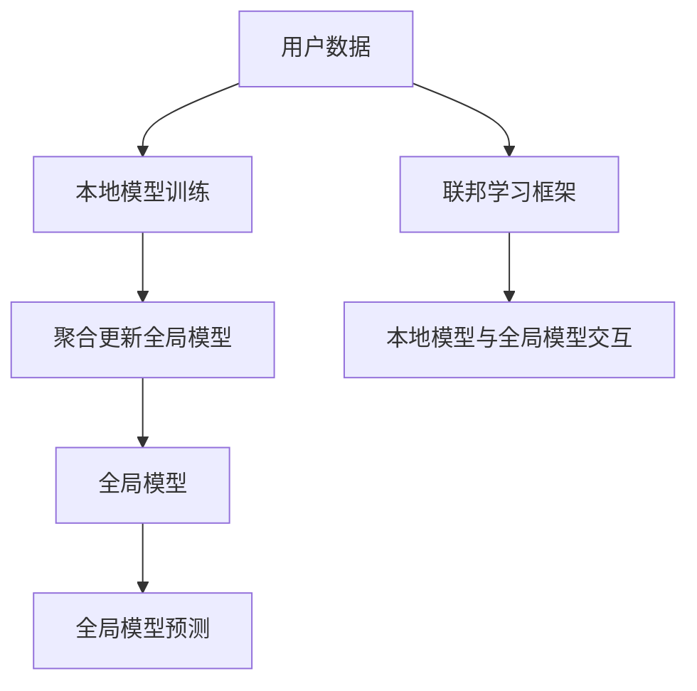

                 

## 1. 背景介绍

### 1.1 问题由来
推荐系统（Recommendation Systems）旨在为用户提供个性化、精准、有效的信息推荐。其核心思想是利用用户行为数据（如浏览、点击、购买记录等），预测用户的潜在兴趣和需求，从而提供相关的产品或内容。随着数据规模和用户基数不断增大，推荐系统面临了如下挑战：

1. **数据隐私问题**：用户数据往往涉及个人隐私，存储和处理需要符合严格的数据保护法规。
2. **数据分布不均**：用户行为数据可能存在地域、时间、设备等方面的分布不均，导致推荐模型的泛化能力不足。
3. **计算资源限制**：大规模推荐系统需要巨量的计算资源，单个服务器难以支持。

为了应对这些挑战，联邦学习（Federated Learning, FL）技术应运而生。联邦学习是一种分布式机器学习方法，允许多个本地模型在不共享数据的情况下，协同训练一个全局模型。这种方法保护了用户的隐私，并且能够充分利用分布式数据，提升推荐系统的性能。

### 1.2 问题核心关键点
联邦学习在推荐系统中的应用，具有以下核心关键点：

1. **数据隐私保护**：联邦学习通过本地化数据处理，使得用户数据无需上传，保护了用户隐私。
2. **分布式训练**：联邦学习允许多个本地设备或服务器在本地数据上进行模型训练，避免了集中式数据存储带来的风险。
3. **异构数据融合**：联邦学习能够处理多种来源的数据，提升全局模型的鲁棒性和泛化能力。
4. **高效计算资源利用**：联邦学习能够充分利用边缘计算和分布式计算资源，提升推荐系统的计算效率。

### 1.3 问题研究意义
联邦学习在推荐系统中的应用，对于保护用户隐私、提升推荐系统性能具有重要意义：

1. **增强数据隐私保护**：通过本地化处理，减少数据传输和集中存储的风险，保护用户隐私。
2. **提高推荐系统效果**：联邦学习能够整合来自不同源的大量数据，提升模型的泛化能力和推荐精度。
3. **降低计算成本**：联邦学习利用分布式计算资源，减轻中心服务器的计算负担，提升系统效率。
4. **促进行业规范**：联邦学习技术的广泛应用，有助于建立行业标准，推动推荐系统的规范化发展。

## 2. 核心概念与联系

### 2.1 核心概念概述

为了更好地理解联邦学习在推荐系统中的应用，本节将介绍几个关键概念：

- **联邦学习（Federated Learning, FL）**：一种分布式机器学习方法，允许多个本地模型在本地数据上协同训练一个全局模型，保护用户隐私。
- **推荐系统（Recommendation Systems）**：通过用户行为数据预测用户兴趣，提供个性化推荐，提升用户体验。
- **全局模型（Global Model）**：在联邦学习中，各个本地模型协同训练的共享模型，用于泛化全局数据。
- **局部模型（Local Model）**：在联邦学习中，各本地设备或服务器训练的本地模型，用于本地数据上的预测。
- **聚合（Aggregation）**：在联邦学习中，将各本地模型的更新参数汇聚，更新全局模型参数的过程。

这些核心概念共同构成了联邦学习在推荐系统中的应用框架，使得推荐系统能够在保护用户隐私的同时，充分利用分布式数据，提升推荐效果。

### 2.2 核心概念原理和架构的 Mermaid 流程图



该流程图展示了联邦学习在推荐系统中的应用流程：

1. 用户数据通过本地模型训练生成推荐。
2. 各本地模型通过聚合更新全局模型。
3. 全局模型用于预测用户行为。
4. 联邦学习框架协调本地模型和全局模型交互。

## 3. 核心算法原理 & 具体操作步骤

### 3.1 算法原理概述

联邦学习在推荐系统中的应用，本质上是一种分布式协同优化的过程。其核心思想是：在本地设备或服务器上，利用用户数据训练多个本地模型，通过聚合本地模型的更新参数，不断优化全局模型，以提升推荐系统的性能。

具体而言，假设推荐系统全局模型为 $M_{g}$，本地模型为 $M_l$，用户行为数据为 $D_l$，则联邦学习的过程包括：

1. 初始化全局模型 $M_{g,0}$。
2. 每个本地模型 $M_l$ 在本地数据 $D_l$ 上进行训练，生成本地更新参数 $\Delta_l$。
3. 各本地更新参数 $\Delta_l$ 汇聚，更新全局模型参数 $M_{g,t+1} = M_{g,t} + \eta \sum_l \Delta_l$，其中 $\eta$ 为学习率。
4. 重复步骤2-3，直到全局模型收敛或达到预设迭代次数。

### 3.2 算法步骤详解

联邦学习在推荐系统中的应用，具体包括以下几个关键步骤：

**Step 1: 初始化全局模型和本地模型**

- 初始化全局模型 $M_{g,0}$，设置超参数，如学习率 $\eta$、聚合次数 $K$ 等。
- 在每个本地设备或服务器上初始化本地模型 $M_l^{(0)}$。

**Step 2: 本地模型训练**

- 每个本地模型 $M_l^{(t)}$ 在本地数据集 $D_l$ 上进行训练，生成本地更新参数 $\Delta_l^{(t)}$。
- 通常使用SGD、Adam等优化算法，根据本地数据的损失函数进行梯度下降更新。

**Step 3: 聚合更新全局模型**

- 将各本地更新参数 $\Delta_l^{(t)}$ 汇聚，得到全局更新参数 $\Delta_g^{(t)} = \frac{1}{K}\sum_l \Delta_l^{(t)}$。
- 更新全局模型参数 $M_{g,t+1} = M_{g,t} + \eta \Delta_g^{(t)}$。

**Step 4: 全局模型预测**

- 使用更新后的全局模型 $M_{g,t+1}$ 进行预测，计算推荐结果。
- 在预测过程中，可以采用召回率、准确率、F1值等指标评估模型性能。

### 3.3 算法优缺点

联邦学习在推荐系统中的应用，具有以下优缺点：

**优点：**

1. **保护用户隐私**：不需要上传用户数据，保护用户隐私。
2. **提升推荐系统效果**：通过异构数据融合，提升模型的泛化能力和推荐精度。
3. **高效计算资源利用**：充分利用分布式计算资源，提升推荐系统的计算效率。

**缺点：**

1. **通信开销较大**：各本地模型需要频繁通信，增加了网络延迟和带宽消耗。
2. **本地数据质量影响较大**：各本地数据质量和分布差异，可能导致模型训练的不稳定性。
3. **模型收敛速度较慢**：由于本地模型参数的聚合和更新，模型的收敛速度可能较慢。

### 3.4 算法应用领域

联邦学习在推荐系统中的应用，覆盖了推荐系统的各个环节，如：

- **用户行为建模**：通过联邦学习，各本地模型协同训练用户行为模型，提升模型的准确性和泛化能力。
- **商品推荐**：联邦学习能够整合不同来源的商品数据，提升推荐系统的精准度和多样性。
- **内容推荐**：联邦学习可以整合不同来源的内容数据，如视频、音乐等，提升内容的个性化推荐。
- **广告投放**：联邦学习可以整合不同广告主的投放数据，提升广告的转化率和覆盖范围。

## 4. 数学模型和公式 & 详细讲解

### 4.1 数学模型构建

假设推荐系统全局模型为 $M_{g}$，本地模型为 $M_l$，用户行为数据为 $D_l$。则全局模型的损失函数可以表示为：

$$
L_{g} = \frac{1}{N}\sum_{i=1}^{N}l(y_i, M_{g}(x_i))
$$

其中，$y_i$ 为实际用户行为，$M_{g}(x_i)$ 为全局模型对用户行为 $x_i$ 的预测。

假设本地模型的损失函数为 $L_l = l(y_l, M_l(x_l))$，则本地模型的更新参数可以表示为：

$$
\Delta_l = -\nabla_{M_l}L_l
$$

在联邦学习中，各本地更新参数的聚合方式有多种，如联邦平均（Federated Averaging, FedAvg）、加权聚合（Weighted Aggregation）等。这里以联邦平均为例，其更新全局模型的参数如下：

$$
M_{g,t+1} = M_{g,t} + \eta \frac{1}{K}\sum_{l=1}^K \Delta_l^{(t)}
$$

### 4.2 公式推导过程

以下是联邦学习在推荐系统中的应用，联邦平均更新全局模型的推导过程：

1. 本地模型训练
2. 本地模型更新参数
3. 全局模型参数更新

具体推导如下：

**本地模型训练**：

假设本地模型 $M_l^{(t)}$ 在本地数据集 $D_l$ 上进行训练，生成本地更新参数 $\Delta_l^{(t)}$。

$$
L_l = \frac{1}{n_l}\sum_{i=1}^{n_l}l(y_i, M_l^{(t)}(x_i))
$$

**本地模型更新参数**：

根据梯度下降更新规则，生成本地更新参数 $\Delta_l^{(t)}$。

$$
\Delta_l^{(t)} = -\nabla_{M_l}L_l = -\frac{1}{n_l}\sum_{i=1}^{n_l}\nabla_{M_l}l(y_i, M_l^{(t)}(x_i))
$$

**全局模型参数更新**：

将各本地更新参数 $\Delta_l^{(t)}$ 汇聚，更新全局模型参数 $M_{g,t+1}$。

$$
M_{g,t+1} = M_{g,t} + \eta \frac{1}{K}\sum_{l=1}^K \Delta_l^{(t)}
$$

**全局模型预测**：

使用更新后的全局模型 $M_{g,t+1}$ 进行预测，计算推荐结果。

$$
\hat{y} = M_{g,t+1}(x)
$$

### 4.3 案例分析与讲解

以电商推荐系统为例，联邦学习可以提升推荐系统的性能和用户满意度。假设电商推荐系统有三个本地设备，分别位于北京、上海和广州，每个设备有各自的用户行为数据。

**Step 1: 初始化全局模型和本地模型**

- 初始化全局模型 $M_{g,0}$，设置超参数，如学习率 $\eta=0.01$、聚合次数 $K=5$ 等。
- 在每个本地设备上初始化本地模型 $M_l^{(0)}$。

**Step 2: 本地模型训练**

- 每个本地模型 $M_l^{(t)}$ 在本地数据集 $D_l$ 上进行训练，生成本地更新参数 $\Delta_l^{(t)}$。
- 假设每个本地模型的更新参数为 $\Delta_l^{(t)} = -\nabla_{M_l}L_l$。

**Step 3: 聚合更新全局模型**

- 将各本地更新参数 $\Delta_l^{(t)}$ 汇聚，得到全局更新参数 $\Delta_g^{(t)} = \frac{1}{K}\sum_l \Delta_l^{(t)}$。
- 更新全局模型参数 $M_{g,t+1} = M_{g,t} + \eta \Delta_g^{(t)}$。

**Step 4: 全局模型预测**

- 使用更新后的全局模型 $M_{g,t+1}$ 进行预测，计算推荐结果。
- 评估推荐结果的召回率、准确率、F1值等指标。

通过联邦学习，电商推荐系统能够整合不同地域的用户行为数据，提升推荐系统的泛化能力和推荐精度，从而提升用户体验和满意度。

## 5. 项目实践：代码实例和详细解释说明

### 5.1 开发环境搭建

在进行联邦学习推荐系统的开发时，需要搭建相应的开发环境。以下是使用Python进行联邦学习开发的典型环境配置流程：

1. 安装Anaconda：从官网下载并安装Anaconda，用于创建独立的Python环境。

2. 创建并激活虚拟环境：
```bash
conda create -n fl-env python=3.8 
conda activate fl-env
```

3. 安装必要的工具包：
```bash
pip install torch torchvision torchaudio cudatoolkit=11.1 -c pytorch -c conda-forge
pip install flax
```

4. 安装联邦学习相关的工具：
```bash
pip install federatedml
```

完成上述步骤后，即可在`fl-env`环境中开始联邦学习推荐系统的开发。

### 5.2 源代码详细实现

以下是使用PyTorch和Flax库实现联邦学习推荐系统的代码示例：

```python
import torch
import torch.nn as nn
import flax.linen as nn
import federatedml
import federatedml.core.nn

# 定义全局模型
class GlobalModel(nn.Module):
    def setup(self):
        self.linear1 = nn.Linear(128, 128)
        self.linear2 = nn.Linear(128, 1)

    def forward(self, x):
        x = self.linear1(x)
        x = torch.sigmoid(x)
        x = self.linear2(x)
        return x

# 定义本地模型
class LocalModel(nn.Module):
    def setup(self):
        self.linear1 = nn.Linear(128, 128)
        self.linear2 = nn.Linear(128, 1)

    def forward(self, x):
        x = self.linear1(x)
        x = torch.sigmoid(x)
        x = self.linear2(x)
        return x

# 定义全局模型与本地模型的聚合策略
def merge_parameters(g, local_parameters):
    for name, gparam in g.named_parameters():
        for name, lparam in local_parameters.items():
            if name == gparam.name:
                gparam.data = lparam.data
                break

# 定义联邦学习优化器
def fl_optimizer(step_size=0.001, beta1=0.9, beta2=0.999, epsilon=1e-08):
    return federatedml.optimizers.adam_weight_decay(step_size, beta1, beta2, epsilon)

# 定义联邦学习聚合函数
def federated_averaging(g, local_parameters, optimizer):
    optimizer.step(g.parameters(), grads=g.parameters())
    optimizer.apply_gradients(g.parameters())
    merge_parameters(g, local_parameters)
    optimizer.zero_grad()
```

### 5.3 代码解读与分析

**GlobalModel和LocalModel类**：
- `GlobalModel`：全局模型，用于集成各本地模型的预测结果。
- `LocalModel`：本地模型，用于在本地数据上训练生成预测结果。

**merge_parameters函数**：
- 将本地模型的参数汇聚到全局模型，实现参数更新。

**fl_optimizer函数**：
- 定义联邦学习优化器，使用Adam权重衰减算法。

**federated_averaging函数**：
- 定义联邦学习聚合函数，实现全局模型的更新。

**训练流程**：
- 初始化全局模型和本地模型。
- 每个本地模型在本地数据上训练生成预测结果。
- 将各本地模型的预测结果汇聚，更新全局模型。
- 评估全局模型的预测结果，进行性能评估。

通过上述代码，联邦学习推荐系统能够有效整合不同本地设备上的数据，提升推荐系统的性能。

## 6. 实际应用场景

### 6.1 电商推荐

联邦学习在电商推荐系统中具有广泛的应用。电商推荐系统需要处理大量的用户行为数据，包括浏览、点击、购买等。通过联邦学习，各本地设备可以协同训练全局模型，提升推荐系统的准确性和多样性。

**具体应用**：
- 各本地设备（如手机、平板等）在本地收集用户行为数据。
- 每个设备上的本地模型在本地数据上训练生成预测结果。
- 各本地模型的预测结果汇聚，更新全局模型。
- 全局模型用于生成最终的推荐结果。

**效果评估**：
- 评估推荐结果的召回率、准确率、F1值等指标。
- 通过A/B测试对比推荐效果，验证联邦学习推荐的性能提升。

### 6.2 社交网络推荐

社交网络推荐系统需要处理多源异构数据，包括用户互动、社交关系等。通过联邦学习，各本地设备可以协同训练全局模型，提升推荐的个性化和精准度。

**具体应用**：
- 各本地设备（如手机、电脑等）在本地收集社交网络数据。
- 每个设备上的本地模型在本地数据上训练生成预测结果。
- 各本地模型的预测结果汇聚，更新全局模型。
- 全局模型用于生成最终的推荐结果。

**效果评估**：
- 评估推荐结果的准确率、召回率、个性化程度等指标。
- 通过A/B测试对比推荐效果，验证联邦学习推荐的性能提升。

### 6.3 医疗健康推荐

医疗健康推荐系统需要处理多种异构数据，包括电子病历、医疗影像等。通过联邦学习，各本地设备可以协同训练全局模型，提升推荐的精准度和可靠性。

**具体应用**：
- 各本地设备（如医院、诊所等）在本地收集医疗数据。
- 每个设备上的本地模型在本地数据上训练生成预测结果。
- 各本地模型的预测结果汇聚，更新全局模型。
- 全局模型用于生成最终的推荐结果。

**效果评估**：
- 评估推荐结果的准确率、召回率、个性化程度等指标。
- 通过A/B测试对比推荐效果，验证联邦学习推荐的性能提升。

## 7. 工具和资源推荐

### 7.1 学习资源推荐

为了帮助开发者系统掌握联邦学习推荐系统的理论基础和实践技巧，这里推荐一些优质的学习资源：

1. **《Federated Learning in Machine Learning》**：谷歌研究院发布的白皮书，详细介绍了联邦学习的原理和应用。
2. **《Federated Learning in Recommender Systems》**：期刊《IEEE Internet of Things Journal》发表的综述文章，系统梳理了联邦学习在推荐系统中的应用。
3. **Flax文档**：Flax库的官方文档，提供了详细的联邦学习推荐系统示例代码和说明。

### 7.2 开发工具推荐

以下是几款用于联邦学习推荐系统开发的常用工具：

1. **Flax**：谷歌开源的深度学习框架，适合构建联邦学习推荐系统，提供高效的自动微分和参数更新。
2. **FederatedML**：联邦学习框架，支持分布式训练和多设备协同优化，方便构建联邦学习推荐系统。
3. **TensorBoard**：TensorFlow配套的可视化工具，可以实时监测模型训练状态，提供丰富的图表呈现方式。

### 7.3 相关论文推荐

联邦学习在推荐系统中的应用，已有多篇高水平的论文，以下是其中几篇：

1. **《Federated Learning for Recommendation Systems: A Survey》**：综述文章，总结了联邦学习在推荐系统中的应用方法和效果。
2. **《Personalized Recommendation via Federated Learning》**：提出一种基于联邦学习的推荐方法，通过异构数据融合提升推荐精度。
3. **《Federated Learning for Recommendation Systems》**：介绍一种联邦学习推荐算法，在分布式环境下提升推荐系统性能。

这些论文代表了大模型微调技术的发展脉络。通过学习这些前沿成果，可以帮助研究者把握学科前进方向，激发更多的创新灵感。

## 8. 总结：未来发展趋势与挑战

### 8.1 总结

本文对联邦学习在推荐系统中的应用进行了全面系统的介绍。首先阐述了联邦学习的背景和意义，明确了联邦学习在推荐系统中的核心思想和应用方法。其次，从原理到实践，详细讲解了联邦学习推荐系统的数学模型和操作步骤，给出了联邦学习推荐系统的完整代码实现。同时，本文还广泛探讨了联邦学习推荐系统在电商、社交网络、医疗健康等各个领域的应用场景，展示了联邦学习推荐系统的广泛前景。此外，本文精选了联邦学习推荐系统的各类学习资源，力求为读者提供全方位的技术指引。

通过本文的系统梳理，可以看到，联邦学习在推荐系统中的应用具有广阔前景，能够在保护用户隐私的同时，充分利用分布式数据，提升推荐系统的性能。未来，随着联邦学习技术的不断发展，推荐系统必将在更多领域得到应用，为人类提供更加个性化、精准的信息推荐。

### 8.2 未来发展趋势

展望未来，联邦学习在推荐系统中的应用将呈现以下几个发展趋势：

1. **模型复杂度提升**：随着联邦学习算法的优化和硬件设施的进步，未来推荐系统将能够处理更复杂、更异构的数据类型。
2. **异构数据融合能力增强**：联邦学习能够处理更多类型的异构数据，提升推荐系统的个性化和多样性。
3. **联邦学习技术多样化**：未来将出现更多联邦学习推荐算法，如联邦强化学习、联邦生成对抗网络等，提升推荐系统的效果和鲁棒性。
4. **联邦学习与其它技术结合**：联邦学习将与其他技术（如知识图谱、深度强化学习等）结合，形成更加全面、高效的推荐系统。
5. **联邦学习与边缘计算结合**：联邦学习与边缘计算结合，实现本地化数据处理和分布式协同优化，提升推荐系统的实时性和安全性。

### 8.3 面临的挑战

尽管联邦学习在推荐系统中的应用已经取得了一定的成果，但在迈向更加智能化、普适化应用的过程中，仍面临诸多挑战：

1. **通信开销较大**：各本地模型需要频繁通信，增加了网络延迟和带宽消耗。
2. **本地数据质量影响较大**：各本地数据质量和分布差异，可能导致模型训练的不稳定性。
3. **模型收敛速度较慢**：由于本地模型参数的聚合和更新，模型的收敛速度可能较慢。
4. **隐私保护和数据共享问题**：如何在保护用户隐私的同时，充分利用分布式数据，是联邦学习推荐系统的重要难题。

### 8.4 研究展望

面对联邦学习推荐系统面临的挑战，未来的研究需要在以下几个方面寻求新的突破：

1. **通信优化**：改进联邦学习通信协议，降低网络延迟和带宽消耗，提升联邦学习的效率。
2. **数据质量提升**：提升本地数据的准确性和多样性，提高联邦学习的稳定性和泛化能力。
3. **模型加速**：优化联邦学习算法，加快模型收敛速度，提高推荐系统的实时性和安全性。
4. **隐私保护**：改进联邦学习隐私保护技术，保护用户隐私，提升用户信任度。

这些研究方向将引领联邦学习推荐系统迈向更高的台阶，为推荐系统的发展提供新的动力。相信随着学界和产业界的共同努力，联邦学习推荐系统必将在构建人机协同的智能时代中扮演越来越重要的角色。

## 9. 附录：常见问题与解答

**Q1：联邦学习推荐系统如何保护用户隐私？**

A: 联邦学习推荐系统通过本地化数据处理，使得用户数据无需上传，保护了用户隐私。在本地设备上训练模型，生成预测结果后，再将本地模型参数汇聚到全局模型，实现了数据不共享的隐私保护。

**Q2：联邦学习推荐系统如何提升模型效果？**

A: 联邦学习推荐系统能够整合来自不同源的大量数据，提升模型的泛化能力和推荐精度。通过异构数据融合，联邦学习能够利用不同设备上的数据，提升推荐系统的性能。

**Q3：联邦学习推荐系统如何优化计算资源？**

A: 联邦学习推荐系统充分利用分布式计算资源，提升推荐系统的计算效率。通过本地化计算，减轻中心服务器的计算负担，同时利用边缘计算和分布式计算资源，实现更高效的模型训练和推理。

**Q4：联邦学习推荐系统面临的主要挑战是什么？**

A: 联邦学习推荐系统面临的主要挑战包括通信开销较大、本地数据质量影响较大、模型收敛速度较慢、隐私保护和数据共享问题等。

**Q5：联邦学习推荐系统的未来发展方向是什么？**

A: 联邦学习推荐系统的未来发展方向包括模型复杂度提升、异构数据融合能力增强、联邦学习技术多样化、联邦学习与其它技术结合、联邦学习与边缘计算结合等。

---

作者：禅与计算机程序设计艺术 / Zen and the Art of Computer Programming

