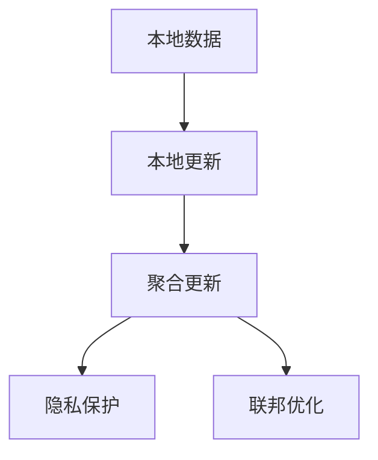

                 

# 联邦学习在金融行业的实践与前景

## 1. 背景介绍

### 1.1 问题由来

金融行业是一个数据密集型行业，数据的安全性、隐私性和可靠性至关重要。传统的集中式训练模式在数据隐私和安全性方面存在诸多问题。一方面，金融机构希望通过共享数据来提升整体行业的金融知识，提升风控、投资、信贷等业务决策的质量；另一方面，数据隐私保护法规如GDPR（通用数据保护条例）和CCPA（加州消费者隐私法案）的严格要求限制了集中式训练的应用。

面对这一挑战，联邦学习（Federated Learning，简称FL）应运而生。联邦学习是一种新兴的分布式机器学习范式，它通过在本地设备上对数据进行模型训练，并在各个设备间进行模型参数的更新和共享，以在保护数据隐私的前提下提升模型的泛化能力。

### 1.2 问题核心关键点

联邦学习主要包括以下几个关键点：

- **本地数据**：所有训练数据都保存在本地设备上，不集中存储，防止数据泄露。
- **本地更新**：模型参数的更新在本地设备上进行，不跨网络传输。
- **聚合更新**：通过聚合算法（如模型参数平均值、加权平均等）在全局服务器上更新模型，确保各个设备间模型参数的同步。
- **隐私保护**：通过差分隐私等技术保护数据隐私，防止模型泄漏敏感信息。
- **联邦优化**：设计高效的联邦优化算法，确保全局模型的收敛和性能。

这些关键点共同构成了联邦学习的核心特性，使其在金融行业等数据敏感场景中具有重要的应用价值。

### 1.3 问题研究意义

联邦学习在金融行业的应用具有重要的意义：

1. **数据保护**：保护数据隐私，防止敏感数据泄露，符合法规要求。
2. **提升模型泛化**：通过本地化数据训练，模型能够更好地适应用户的个性化需求，提升金融服务的质量和效率。
3. **加速业务迭代**：金融机构可以在不集中存储数据的情况下，快速迭代训练模型，应对市场变化和风险。
4. **降低计算成本**：通过分布式计算，减少集中式训练所需的计算资源和通信开销。
5. **增强行业协同**：联邦学习促进了金融机构之间的知识共享，提升了行业整体的知识水平和风险防控能力。

## 2. 核心概念与联系

### 2.1 核心概念概述

联邦学习是一种分布式机器学习范式，旨在通过在本地设备上训练模型，并在各个设备间进行模型参数的聚合和共享，实现全局模型的提升。相较于集中式训练，联邦学习能够更好地保护数据隐私，提升模型泛化能力，同时降低计算成本。

### 2.2 核心概念之间的联系

联邦学习涉及以下几个核心概念：

- **本地数据**：所有训练数据都保存在本地设备上，不集中存储。
- **本地更新**：模型参数的更新在本地设备上进行，不跨网络传输。
- **聚合更新**：通过聚合算法（如模型参数平均值、加权平均等）在全局服务器上更新模型，确保各个设备间模型参数的同步。
- **隐私保护**：通过差分隐私等技术保护数据隐私，防止模型泄漏敏感信息。
- **联邦优化**：设计高效的联邦优化算法，确保全局模型的收敛和性能。

这些概念之间的联系可以通过以下Mermaid流程图来展示：



这个流程图展示了联邦学习的核心流程：

1. 所有训练数据保存在本地设备上，不集中存储。
2. 模型参数的更新在本地设备上进行，不跨网络传输。
3. 通过聚合算法在全局服务器上更新模型，确保各个设备间模型参数的同步。
4. 通过差分隐私等技术保护数据隐私，防止模型泄漏敏感信息。
5. 设计高效的联邦优化算法，确保全局模型的收敛和性能。

## 3. 核心算法原理 & 具体操作步骤
### 3.1 算法原理概述

联邦学习的基本原理是通过在本地设备上训练模型，并在各个设备间进行模型参数的聚合和共享，实现全局模型的提升。其核心步骤如下：

1. **数据划分**：将全局数据集划分为多个子集，分别分配到各个本地设备上。
2. **本地训练**：在本地设备上，使用本地数据集训练模型，更新本地模型参数。
3. **聚合更新**：通过聚合算法（如模型参数平均值、加权平均等）在全局服务器上更新模型，确保各个设备间模型参数的同步。
4. **隐私保护**：采用差分隐私等技术保护数据隐私，防止模型泄漏敏感信息。
5. **联邦优化**：设计高效的联邦优化算法，确保全局模型的收敛和性能。

### 3.2 算法步骤详解

以下是联邦学习在金融行业应用的具体步骤：

1. **数据划分**：将金融机构的数据集划分为多个子集，分别分配到各个本地设备上。例如，可以将各个机构的客户交易数据、风控数据、信贷数据等划分为多个子集。

2. **本地训练**：在本地设备上，使用本地数据集训练模型，更新本地模型参数。例如，可以使用联邦学习算法在本地设备上训练金融风险预测模型，更新模型的权重和偏置参数。

3. **聚合更新**：通过聚合算法（如模型参数平均值、加权平均等）在全局服务器上更新模型，确保各个设备间模型参数的同步。例如，可以使用模型参数平均值算法在全局服务器上更新模型，确保各个设备间模型参数的一致性。

4. **隐私保护**：采用差分隐私等技术保护数据隐私，防止模型泄漏敏感信息。例如，可以使用差分隐私算法在本地设备上更新模型参数，确保数据隐私不被泄露。

5. **联邦优化**：设计高效的联邦优化算法，确保全局模型的收敛和性能。例如，可以使用联邦平均算法（FedAvg）或联邦优化器（FederatedOptimizer）等优化算法，确保全局模型的收敛和性能。

### 3.3 算法优缺点

联邦学习在金融行业的应用具有以下优点：

1. **数据保护**：保护数据隐私，防止敏感数据泄露，符合法规要求。
2. **提升模型泛化**：通过本地化数据训练，模型能够更好地适应用户的个性化需求，提升金融服务的质量和效率。
3. **加速业务迭代**：金融机构可以在不集中存储数据的情况下，快速迭代训练模型，应对市场变化和风险。
4. **降低计算成本**：通过分布式计算，减少集中式训练所需的计算资源和通信开销。
5. **增强行业协同**：联邦学习促进了金融机构之间的知识共享，提升了行业整体的知识水平和风险防控能力。

同时，联邦学习也存在一些缺点：

1. **通信开销**：各个设备间需要频繁进行模型参数的通信和更新，增加了通信开销。
2. **隐私风险**：尽管采用差分隐私等技术保护数据隐私，但攻击者仍有可能通过差分攻击获取敏感信息。
3. **模型收敛慢**：由于模型参数在本地设备上更新，联邦学习模型的收敛速度可能较慢。
4. **数据不均衡**：各本地设备的训练数据可能存在不均衡问题，影响模型性能。
5. **算法复杂性**：联邦学习的算法设计较为复杂，需要考虑多个本地设备间的同步和优化问题。

### 3.4 算法应用领域

联邦学习在金融行业的应用领域包括但不限于：

1. **风险评估**：利用本地设备上的客户交易数据和风险信息，训练风险评估模型，提升风险预测和控制能力。
2. **信贷评分**：通过本地设备上的信贷数据和历史评分信息，训练信贷评分模型，优化贷款审批流程。
3. **反欺诈检测**：利用本地设备上的交易记录和历史欺诈信息，训练反欺诈检测模型，提升欺诈检测效率和准确率。
4. **投资组合管理**：通过本地设备上的市场数据和投资组合信息，训练投资组合管理模型，优化投资策略和资产配置。
5. **信用评分**：利用本地设备上的客户信用历史和社交网络信息，训练信用评分模型，提升信用评估和风险管理能力。

## 4. 数学模型和公式 & 详细讲解 & 举例说明
### 4.1 数学模型构建

假设金融机构共有 $K$ 个本地设备，每个设备上有一个本地数据集 $D_i$，其中 $i \in [1, K]$。定义全局模型参数为 $\theta$，本地模型参数为 $\theta_i$。联邦学习的目标是通过本地设备上的数据训练本地模型，并通过聚合算法更新全局模型参数，使得全局模型参数 $\theta$ 最大化某个目标函数 $L(\theta)$。

### 4.2 公式推导过程

假设本地设备上使用本地数据集 $D_i$ 训练本地模型参数 $\theta_i$，则本地模型更新公式为：

$$
\theta_i = \theta_i - \eta \nabla_{\theta_i} L_i(\theta_i)
$$

其中 $\eta$ 为学习率，$\nabla_{\theta_i} L_i(\theta_i)$ 为本地模型在本地数据集 $D_i$ 上的梯度。

假设全局模型参数的聚合方式为平均聚合，则全局模型更新公式为：

$$
\theta = \frac{1}{K} \sum_{i=1}^K \theta_i
$$

假设全局模型参数采用差分隐私技术进行保护，则每次更新时加入高斯噪声 $\Delta \theta$，则全局模型更新公式为：

$$
\theta_i = \theta_i - \eta \nabla_{\theta_i} L_i(\theta_i) + \Delta \theta
$$

其中 $\Delta \theta \sim \mathcal{N}(0, \sigma^2)$，$\sigma$ 为差分隐私参数，控制噪声的大小。

### 4.3 案例分析与讲解

假设某金融机构有 3 个本地设备，每个设备上有 1000 条交易数据。假设全局模型为风险预测模型，损失函数为平方损失。每个设备在本地训练模型后，通过聚合算法更新全局模型参数。假设每个设备的学习率为 $0.1$，差分隐私参数为 $0.1$，则全局模型更新过程如下：

1. 设备 1 在本地数据集上训练模型，得到本地模型参数 $\theta_1$。
2. 设备 2 在本地数据集上训练模型，得到本地模型参数 $\theta_2$。
3. 设备 3 在本地数据集上训练模型，得到本地模型参数 $\theta_3$。
4. 通过平均聚合算法，计算全局模型参数 $\theta$：

$$
\theta = \frac{1}{3} (\theta_1 + \theta_2 + \theta_3)
$$

5. 每次更新时，加入高斯噪声 $\Delta \theta$，更新全局模型参数：

$$
\theta = \theta - 0.1 \nabla_{\theta} L(\theta) + \Delta \theta
$$

通过上述过程，全局模型参数在保护数据隐私的前提下，不断更新和优化，提升风险预测模型的性能。

## 5. 项目实践：代码实例和详细解释说明
### 5.1 开发环境搭建

在进行联邦学习实践前，我们需要准备好开发环境。以下是使用Python进行PyTorch开发的环境配置流程：

1. 安装Anaconda：从官网下载并安装Anaconda，用于创建独立的Python环境。

2. 创建并激活虚拟环境：
```bash
conda create -n fl-env python=3.8 
conda activate fl-env
```

3. 安装PyTorch：根据CUDA版本，从官网获取对应的安装命令。例如：
```bash
conda install pytorch torchvision torchaudio cudatoolkit=11.1 -c pytorch -c conda-forge
```

4. 安装FedML库：
```bash
pip install fedml
```

5. 安装各类工具包：
```bash
pip install numpy pandas scikit-learn matplotlib tqdm jupyter notebook ipython
```

完成上述步骤后，即可在`fl-env`环境中开始联邦学习实践。

### 5.2 源代码详细实现

这里我们以联邦平均（FedAvg）算法为例，给出使用PyTorch和FedML库进行金融风险预测的联邦学习代码实现。

首先，定义金融风险预测模型的PyTorch实现：

```python
import torch
import torch.nn as nn
import torch.optim as optim
from torch.utils.data import DataLoader

class RiskPredictionModel(nn.Module):
    def __init__(self, input_size, hidden_size, output_size):
        super(RiskPredictionModel, self).__init__()
        self.fc1 = nn.Linear(input_size, hidden_size)
        self.fc2 = nn.Linear(hidden_size, output_size)
        self.relu = nn.ReLU()
        
    def forward(self, x):
        x = self.fc1(x)
        x = self.relu(x)
        x = self.fc2(x)
        return x

model = RiskPredictionModel(input_size=10, hidden_size=20, output_size=1)
```

然后，定义联邦学习的基本流程：

```python
from fedml import federated_settings
from fedml.fedavg.aggregator import FedAvgAggregator
from fedml.fedavg.local import LocalTrainer
from fedml.fedavg.launch import LaunchFedML

# 定义本地设备信息
local_devices = ['device1', 'device2', 'device3']

# 定义全局服务器地址
server = 'server'

# 定义通信协议
protocol = 'tcp'

# 定义聚合算法
aggregator = FedAvgAggregator()

# 定义本地训练器
trainer = LocalTrainer(model=model, optimizer=optim.Adam(model.parameters(), lr=0.01))

# 定义联邦学习配置
config = federated_settings.FedMLConfig(server=server, port=port, local_devices=local_devices, protocol=protocol, aggregator=aggregator, trainer=trainer)

# 启动联邦学习
LaunchFedML(config)
```

上述代码实现了联邦平均算法的核心逻辑，包括本地设备信息、全局服务器地址、通信协议、聚合算法和本地训练器的定义。运行后，联邦学习会通过本地设备上的数据训练模型，并通过聚合算法更新全局模型参数。

### 5.3 代码解读与分析

让我们再详细解读一下关键代码的实现细节：

**RiskPredictionModel类**：
- `__init__`方法：初始化神经网络模型的结构，包括输入层、隐藏层和输出层。
- `forward`方法：定义模型的前向传播过程，接收输入数据，返回模型的输出。

**联邦学习配置**：
- 定义本地设备信息：`local_devices`，包括所有参与联邦学习的设备名称。
- 定义全局服务器地址：`server`，用于存放全局模型参数和聚合算法实现。
- 定义通信协议：`protocol`，用于确定设备间的通信方式。
- 定义聚合算法：`aggregator`，使用FedAvgAggregator进行模型参数的平均聚合。
- 定义本地训练器：`trainer`，使用LocalTrainer进行本地模型训练。

**联邦学习启动**：
- 调用`LaunchFedML`函数，启动联邦学习流程。通过传入的`config`参数，联邦学习会从本地设备上获取数据，进行本地模型训练，并通过聚合算法更新全局模型参数。

以上代码展示了联邦平均算法的核心逻辑，通过简单的几行代码，我们便可以实现联邦学习在金融风险预测模型中的应用。

## 6. 实际应用场景
### 6.1 智能投顾

智能投顾（Robo-Advisors）是一种基于人工智能技术的金融顾问服务，通过分析用户风险偏好和投资目标，自动推荐投资组合。联邦学习可以应用于智能投顾系统，通过各本地设备上的用户行为数据，训练全局模型，实现智能投顾的个性化推荐和动态调整。

具体而言，智能投顾系统可以收集用户的历史交易记录、风险偏好、收益预期等数据，在本地设备上进行模型训练，通过联邦学习算法更新全局模型参数，提升推荐模型的性能。联邦学习可以确保用户数据的安全性和隐私性，同时提升智能投顾的个性化推荐效果。

### 6.2 信用评分

信用评分是金融机构的重要业务，用于评估客户的信用风险。传统的信用评分模型往往依赖集中式训练，存在数据泄露和模型过拟合等问题。联邦学习可以应用于信用评分模型，通过各本地设备上的客户数据，训练全局信用评分模型，提升模型的泛化能力和预测精度。

具体而言，联邦学习可以收集各金融机构客户的信用历史、消费记录、还款记录等数据，在本地设备上进行模型训练，通过联邦学习算法更新全局模型参数，提升信用评分模型的性能。联邦学习可以确保客户数据的安全性和隐私性，同时提升信用评分模型的泛化能力和预测精度。

### 6.3 风险预警

风险预警是金融机构的重要功能，用于实时监测客户的交易行为，及时发现异常交易和潜在的风险。联邦学习可以应用于风险预警系统，通过各本地设备上的交易数据，训练全局风险预警模型，提升风险预警的准确性和及时性。

具体而言，联邦学习可以收集各金融机构客户的交易数据、行为数据、社交数据等，在本地设备上进行模型训练，通过联邦学习算法更新全局模型参数，提升风险预警模型的性能。联邦学习可以确保客户数据的安全性和隐私性，同时提升风险预警模型的泛化能力和准确性。

### 6.4 未来应用展望

随着联邦学习技术的不断发展，其在金融行业的应用前景将更加广阔。未来，联邦学习将在以下方面发挥更大的作用：

1. **数据融合**：联邦学习可以实现不同机构之间的数据融合，提升金融知识共享和风险防控能力。例如，通过联邦学习，各金融机构可以共享市场数据、客户数据等，提升整体的知识水平和风险防控能力。
2. **个性化服务**：联邦学习可以实现更加个性化的金融服务，提升用户体验和满意度。例如，通过联邦学习，智能投顾系统可以根据用户的个性化需求，动态调整投资组合和推荐策略，提升用户体验。
3. **动态调整**：联邦学习可以实现动态调整模型参数，提升模型的实时性和适应性。例如，通过联邦学习，风险预警系统可以实时监测市场变化和客户行为，及时调整模型参数，提升风险预警的准确性和及时性。
4. **隐私保护**：联邦学习可以实现更好的隐私保护，符合法规要求。例如，通过联邦学习，各金融机构可以在不集中存储数据的情况下，共享数据进行模型训练，保护客户数据的隐私和安全。
5. **数据治理**：联邦学习可以实现数据治理和质量控制，提升数据的使用效率。例如，通过联邦学习，各金融机构可以共享数据质量评估结果，提升数据的使用效率和质量。

## 7. 工具和资源推荐
### 7.1 学习资源推荐

为了帮助开发者系统掌握联邦学习在金融行业的应用，这里推荐一些优质的学习资源：

1. 《联邦学习原理与实践》系列博文：由联邦学习专家撰写，深入浅出地介绍了联邦学习的原理、算法和应用，适合初学者和进阶开发者。

2. 《分布式机器学习》课程：由斯坦福大学开设的分布式机器学习课程，介绍了分布式机器学习的核心概念和算法，包括联邦学习。

3. 《Federated Learning for Edge AI》书籍：联邦学习领域的经典书籍，详细介绍了联邦学习的基本原理和应用场景，适合深入学习联邦学习。

4. PyTorch官方文档：PyTorch的官方文档，介绍了联邦学习的实现方法，提供了丰富的样例代码，适合开发者快速上手。

5. FedML官方文档：FedML的官方文档，介绍了联邦学习的核心算法和应用场景，适合开发者深入理解联邦学习。

通过对这些资源的学习实践，相信你一定能够快速掌握联邦学习在金融行业的应用，并用于解决实际的金融问题。

### 7.2 开发工具推荐

高效的开发离不开优秀的工具支持。以下是几款用于联邦学习开发的常用工具：

1. PyTorch：基于Python的开源深度学习框架，灵活动态的计算图，适合快速迭代研究。

2. TensorFlow：由Google主导开发的开源深度学习框架，生产部署方便，适合大规模工程应用。

3. FedML：Federated Learning的实现框架，支持多种聚合算法和本地训练器，适合联邦学习的应用开发。

4. Weights & Biases：模型训练的实验跟踪工具，可以记录和可视化模型训练过程中的各项指标，方便对比和调优。

5. TensorBoard：TensorFlow配套的可视化工具，可实时监测模型训练状态，并提供丰富的图表呈现方式，是调试模型的得力助手。

6. Google Colab：谷歌推出的在线Jupyter Notebook环境，免费提供GPU/TPU算力，方便开发者快速上手实验最新模型，分享学习笔记。

合理利用这些工具，可以显著提升联邦学习任务的开发效率，加快创新迭代的步伐。

### 7.3 相关论文推荐

联邦学习在金融行业的应用源于学界的持续研究。以下是几篇奠基性的相关论文，推荐阅读：

1. 《Federated Learning: Concept and Applications》：介绍了联邦学习的基本概念和应用场景，是联邦学习领域的经典论文。

2. 《Federated Learning for Credit Risk Management》：研究了联邦学习在信用评分中的应用，提出了联邦学习算法和隐私保护技术。

3. 《Federated Learning for Financial Services》：研究了联邦学习在智能投顾和风险预警中的应用，提出了联邦学习算法和模型优化策略。

4. 《Federated Learning for Edge AI》：介绍了联邦学习在边缘计算中的应用，提出了联邦学习算法和联邦优化技术。

5. 《Differential Privacy: Privacy-Preserving Machine Learning in Federated Learning》：研究了差分隐私技术在联邦学习中的应用，提出了差分隐私算法和隐私保护策略。

这些论文代表了大数据技术在金融行业应用的最新进展，通过学习这些前沿成果，可以帮助研究者把握领域发展趋势，激发更多的创新灵感。

## 8. 总结：未来发展趋势与挑战
### 8.1 总结

本文对联邦学习在金融行业的应用进行了全面系统的介绍。首先阐述了联邦学习的背景和核心概念，明确了联邦学习在数据隐私保护和模型泛化方面的独特优势。其次，从原理到实践，详细讲解了联邦学习的数学原理和关键步骤，给出了联邦学习任务开发的完整代码实例。同时，本文还广泛探讨了联邦学习在智能投顾、信用评分、风险预警等多个金融场景中的应用前景，展示了联邦学习技术的巨大潜力。此外，本文精选了联邦学习相关的学习资源和开发工具，力求为读者提供全方位的技术指引。

通过本文的系统梳理，可以看到，联邦学习技术在金融行业的应用前景广阔，能够显著提升数据隐私保护和模型泛化能力，推动金融业务的数字化和智能化转型。

### 8.2 未来发展趋势

展望未来，联邦学习在金融行业的应用将呈现以下几个发展趋势：

1. **数据融合**：联邦学习可以实现不同机构之间的数据融合，提升金融知识共享和风险防控能力。例如，通过联邦学习，各金融机构可以共享市场数据、客户数据等，提升整体的知识水平和风险防控能力。
2. **个性化服务**：联邦学习可以实现更加个性化的金融服务，提升用户体验和满意度。例如，通过联邦学习，智能投顾系统可以根据用户的个性化需求，动态调整投资组合和推荐策略，提升用户体验。
3. **动态调整**：联邦学习可以实现动态调整模型参数，提升模型的实时性和适应性。例如，通过联邦学习，风险预警系统可以实时监测市场变化和客户行为，及时调整模型参数，提升风险预警的准确性和及时性。
4. **隐私保护**：联邦学习可以实现更好的隐私保护，符合法规要求。例如，通过联邦学习，各金融机构可以在不集中存储数据的情况下，共享数据进行模型训练，保护客户数据的隐私和安全。
5. **数据治理**：联邦学习可以实现数据治理和质量控制，提升数据的使用效率。例如，通过联邦学习，各金融机构可以共享数据质量评估结果，提升数据的使用效率和质量。

### 8.3 面临的挑战

尽管联邦学习在金融行业的应用前景广阔，但在实际应用过程中仍面临诸多挑战：

1. **通信开销**：各个设备间需要频繁进行模型参数的通信和更新，增加了通信开销。
2. **隐私风险**：尽管采用差分隐私等技术保护数据隐私，但攻击者仍有可能通过差分攻击获取敏感信息。
3. **模型收敛慢**：由于模型参数在本地设备上更新，联邦学习模型的收敛速度可能较慢。
4. **数据不均衡**：各本地设备的训练数据可能存在不均衡问题，影响模型性能。
5. **算法复杂性**：联邦学习的算法设计较为复杂，需要考虑多个本地设备间的同步和优化问题。

### 8.4 研究展望

未来，联邦学习在金融行业的研究和应用方向包括但不限于：

1. **联邦学习优化算法**：设计高效的联邦学习优化算法，提升模型收敛速度和性能。例如，可以引入分布式优化算法、自适应学习率算法等，提高联邦学习模型的优化效率。
2. **隐私保护技术**：研究更加严格的隐私保护技术，防止差分攻击等威胁。例如，可以引入联邦安全聚合算法、同态加密等技术，提高数据隐私保护能力。
3. **数据融合技术**：研究高效的数据融合技术，提升数据共享和知识共享的效果。例如，可以引入联邦数据融合算法、联邦迁移学习算法等，提升数据融合效果。
4. **联邦学习框架**：开发更加灵活和高效的联邦学习框架，支持更多的联邦学习算法和本地训练器。例如，可以开发基于TensorFlow、PyTorch等框架的联邦学习库，支持更多的联邦学习算法和本地训练器。
5. **联邦学习应用**：探索联邦学习在更多金融场景中的应用，例如贷款审批、反欺诈检测、金融市场预测等，提升金融服务的质量和效率。

这些研究方向将推动联邦学习技术在金融行业的深入应用，推动金融业务的数字化和智能化转型，带来新的商业价值和社会效益。

## 9. 附录：常见问题与解答

**Q1：联邦学习如何保证数据隐私？**

A: 联邦学习通过在本地设备上进行模型训练，并使用差分隐私等技术保护数据隐私。具体而言，联邦学习可以在本地设备上添加噪声，使得攻击者无法通过差分攻击获取敏感信息。例如，联邦学习可以在本地设备上添加高斯噪声，保护用户数据隐私。

**Q2：联邦学习如何进行模型参数更新？**

A: 联邦学习通过聚合算法更新全局模型参数。具体而言，联邦学习可以在本地设备上训练模型，并计算模型参数在本地数据集上的梯度，然后使用聚合算法（如模型参数平均值、加权平均等）更新全局模型参数。例如，联邦学习可以使用联邦平均算法（FedAvg）进行模型参数更新。

**Q3：联邦学习如何处理不均衡数据？**

A: 联邦学习可以通过加权平均等方法处理不均衡数据。具体而言，联邦学习可以在本地设备上根据数据量的大小调整训练权重，使得数据量较小的本地设备在模型更新时给予更大的权重。例如，联邦学习可以使用加权平均算法进行模型参数更新。

**Q4：联邦学习如何进行数据融合？**

A: 联邦学习可以通过联邦数据融合算法进行数据融合。具体而言，联邦学习可以在本地设备上训练模型，并计算模型参数在本地数据集上的梯度，然后使用联邦数据融合算法进行全局模型参数的更新。例如，联邦学习可以使用联邦数据融合算法进行模型参数更新。

**Q5：联邦学习如何进行本地模型训练？**

A: 联邦学习可以通过本地训练器进行本地模型训练。具体而言，联邦学习可以在本地设备上使用本地数据集进行模型训练，并计算模型参数在本地数据集上的梯度。例如，联邦学习可以使用本地训练器进行模型参数更新。

通过这些常见问题的解答，相信你能够更好地理解联邦学习在金融行业的应用，并应用于实际的金融问题解决中。

