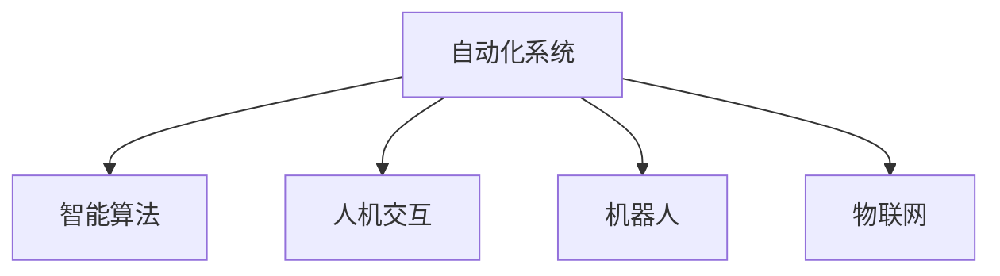

                 

## 1. 背景介绍

### 1.1 问题由来

自动化技术的迅猛发展，尤其是在人工智能（AI）领域的应用，正在改变我们生活的方方面面。从制造业到金融业，从医疗健康到教育服务，自动化技术的应用已经深入到社会的各个角落。自动化技术的核心在于减少或消除人为干预，通过智能算法和自动化系统实现更高效率、更高质量的作业。

### 1.2 问题核心关键点

自动化技术的发展涉及以下几个关键点：

1. **智能算法**：自动化技术依赖于先进的智能算法，如机器学习、深度学习等。这些算法可以处理复杂的决策问题，提供预测和优化解决方案。
2. **自动化系统**：构建高效的自动化系统，实现从数据输入到输出处理的全流程自动化。
3. **数据驱动**：自动化技术依赖于大量的高质量数据，用于训练模型和优化算法。
4. **人机协同**：实现人机协同，即自动化系统与人类操作员的有效合作，提高整体工作效率和质量。
5. **持续优化**：自动化系统需要具备自我学习和优化能力，适应不断变化的环境和需求。

### 1.3 问题研究意义

自动化技术的研究和应用具有重要的现实意义：

1. **效率提升**：自动化技术可以大幅提升生产效率和工作效率，减少人工操作和人为错误。
2. **成本节约**：通过自动化处理重复性高的任务，可以显著降低企业运营成本。
3. **质量控制**：自动化系统能够提供更为精确和一致的输出，提高产品和服务质量。
4. **创新驱动**：自动化技术为各类创新提供了可能，推动新产业和业务的诞生。
5. **安全保障**：自动化系统可以在危险环境中替代人类，确保员工和设备的安全。

## 2. 核心概念与联系

### 2.1 核心概念概述

自动化技术涉及多个核心概念，包括：

- **自动化系统**：通过软件和硬件结合实现任务自动化的系统。
- **智能算法**：用于自动化决策和控制的算法，包括机器学习、深度学习、优化算法等。
- **人机交互**：自动化系统与人类操作员之间的交互方式，如用户界面、远程控制等。
- **机器人**：能够执行特定任务和操作的机械装置，是自动化技术的重要应用形式。
- **物联网（IoT）**：将物理设备连接到互联网，实现设备间的数据交换和协同工作。

这些概念之间的逻辑关系可以通过以下Mermaid流程图来展示：



这个流程图展示了自动化系统的几个关键组成部分及其之间的关系：

1. 自动化系统通过智能算法实现任务自动化。
2. 人机交互实现系统与操作员的协同工作。
3. 机器人作为自动化技术的具体应用形式。
4. 物联网将物理设备连接到网络，实现设备间的数据交换和协同。

## 3. 核心算法原理 & 具体操作步骤

### 3.1 算法原理概述

自动化技术的核心算法主要基于机器学习、深度学习和优化算法。这些算法旨在从数据中学习规律，构建模型，实现自动化决策和控制。

- **机器学习**：通过监督学习、无监督学习和强化学习等方法，构建预测模型。
- **深度学习**：利用神经网络结构处理复杂数据，实现更准确的预测和决策。
- **优化算法**：如梯度下降、遗传算法等，用于模型参数的优化。

### 3.2 算法步骤详解

基于机器学习的自动化系统一般包括以下关键步骤：

1. **数据收集与预处理**：收集训练数据，并进行数据清洗和特征提取。
2. **模型选择与训练**：选择合适的模型，并在训练数据上进行训练，调整模型参数。
3. **验证与调参**：在验证数据集上评估模型性能，根据评估结果调整模型参数。
4. **应用与监控**：将训练好的模型应用于实际场景，并实时监控系统性能和运行状态。

### 3.3 算法优缺点

基于机器学习的自动化算法具有以下优点：

- **高效处理复杂数据**：深度学习算法能够处理高维、非线性的复杂数据。
- **自适应性强**：通过不断学习新数据，自动化系统能够适应环境变化。
- **可扩展性好**：算法的模块化和组件化使得系统易于扩展和升级。

同时，这些算法也存在一些缺点：

- **数据依赖性强**：算法的性能依赖于高质量的训练数据。
- **模型复杂度高**：深度学习模型参数多，训练复杂度高，计算资源消耗大。
- **可解释性差**：算法的决策过程复杂，难以进行解释和调试。

### 3.4 算法应用领域

自动化技术在多个领域都有广泛应用，例如：

- **制造业自动化**：如机器人焊接、自动化装配等。
- **金融自动化**：如风险评估、算法交易等。
- **医疗健康**：如智能诊断、健康监测等。
- **教育服务**：如个性化学习、智能辅导等。
- **物流与仓储**：如自动分拣、仓库管理等。
- **交通管理**：如智能交通系统、自动驾驶等。
- **能源管理**：如智能电网、能源监控等。

## 4. 数学模型和公式 & 详细讲解 & 举例说明

### 4.1 数学模型构建

以制造业自动化中的机器人路径规划为例，构建数学模型：

- **输入**：机器人的起点和终点坐标，以及路径障碍物的坐标。
- **输出**：机器人的最优路径。

使用A*算法进行路径规划，目标函数为：

$$
\min_{\text{path}} \sum_{i=1}^{n} w_i d_i
$$

其中，$w_i$ 为路径上第 $i$ 个点的权重，$d_i$ 为该点到终点路径长度的加权距离。

### 4.2 公式推导过程

A*算法的基本思想是通过启发式搜索，寻找从起点到终点的最短路径。具体步骤如下：

1. 初始化开放列表和关闭列表，开放列表包含所有待扩展节点。
2. 每次从开放列表中选择一个$f$值最小的节点，$f$值为节点到起点的启发式代价与实际代价之和。
3. 扩展该节点，遍历其相邻节点，更新开放列表和关闭列表。
4. 重复步骤2和3，直到找到终点或开放列表为空。

### 4.3 案例分析与讲解

以Fisker公司的自动化汽车生产线为例，分析其应用：

- **数据收集**：生产线上的传感器收集各种生产数据，如温度、压力、振动等。
- **模型训练**：使用机器学习算法，训练预测模型，预测生产异常。
- **应用场景**：将训练好的模型部署在生产线上，实时监控生产状态，自动预警和处理异常。
- **效果评估**：通过实际生产数据，评估模型的准确性和鲁棒性。

## 5. 项目实践：代码实例和详细解释说明

### 5.1 开发环境搭建

开发环境搭建主要包括以下几个步骤：

1. **选择开发语言**：Python是自动化开发的主流语言之一，具有丰富的库和工具支持。
2. **安装相关库**：安装NumPy、Pandas、scikit-learn、TensorFlow等常用库。
3. **配置环境变量**：设置Python环境变量，确保库文件能够正确加载。

### 5.2 源代码详细实现

以下是一个简单的基于机器学习的路径规划代码示例，使用scikit-learn库实现A*算法：

```python
import numpy as np
from sklearn.neighbors import NearestNeighbors

# 定义地图上的障碍物和起点终点坐标
obstacles = np.array([[1, 2], [3, 4], [5, 6], [7, 8]])
start = [0, 0]
goal = [10, 10]

# 定义启发式函数，本示例使用曼哈顿距离
def heuristic(point):
    return abs(point[0] - goal[0]) + abs(point[1] - goal[1])

# 构建邻接矩阵
def build_adjacency_matrix(obstacles):
    n = len(obstacles)
    adjacency = np.zeros((n, n))
    for i in range(n):
        for j in range(n):
            if i != j:
                dist = np.linalg.norm(obstacles[i] - obstacles[j])
                if dist < 1:  # 如果两点相邻，距离为1
                    adjacency[i][j] = 1
    return adjacency

# 实现A*算法
def a_star(start, goal, obstacles, heuristic):
    n = len(obstacles)
    adjacency = build_adjacency_matrix(obstacles)
    open_list = [(0, start)]
    closed_list = set()

    while open_list:
        _, current = min(open_list, key=lambda x: x[0] + heuristic(x[1]))
        open_list.remove((current[0], current[1]))
        closed_list.add(current[1])
        if current[1] == goal:
            return build_path(start, goal, obstacles)

        neighbors = np.where(np.add(adjacency, np.eye(n)) > 0)[0]
        for neighbor in neighbors:
            if neighbor in closed_list:
                continue
            g = current[0] + np.linalg.norm(np.array(start) - np.array(obstacles[neighbor]))
            f = g + heuristic(obstacles[neighbor])
            if (neighbor, f) not in open_list:
                open_list.append((g + f, obstacles[neighbor]))
    return None

# 构建路径
def build_path(start, goal, obstacles):
    path = [goal]
    while path[-1] != start:
        for neighbor in obstacles:
            if neighbor == path[-1]:
                path.append(np.array(start))
                break
    path.reverse()
    return path

# 测试A*算法
start = [0, 0]
goal = [10, 10]
obstacles = np.array([[1, 2], [3, 4], [5, 6], [7, 8]])
path = a_star(start, goal, obstacles, heuristic)
print(path)
```

### 5.3 代码解读与分析

以上代码实现了一个简单的A*路径规划算法，其核心步骤如下：

1. **定义地图和坐标**：使用numpy数组表示障碍物和起点终点坐标。
2. **构建邻接矩阵**：使用np.linalg.norm计算两点之间的曼哈顿距离，构建邻接矩阵。
3. **实现A*算法**：使用while循环和启发式函数，进行路径搜索和优化。
4. **构建路径**：从终点开始，反向构建最优路径。

## 6. 实际应用场景

### 6.1 智能制造

智能制造是自动化技术的重要应用领域之一，通过引入智能算法和自动化系统，提高制造业的生产效率和质量。

- **自动化生产**：机器人自动化生产线，实现装配、焊接、搬运等操作。
- **质量检测**：使用机器视觉和深度学习算法，检测产品质量，实时反馈和调整。
- **预测维护**：使用预测模型，预测设备故障和维护需求，避免停机时间。

### 6.2 智能交通

智能交通系统利用自动化技术，提升交通管理效率，减少交通拥堵和事故发生率。

- **交通监控**：使用摄像头和传感器，实时监控交通状态，自动调节信号灯。
- **自动驾驶**：通过深度学习和感知算法，实现自动驾驶，提升行车安全。
- **交通预测**：使用时间序列模型，预测交通流量，优化交通规划。

### 6.3 智能医疗

智能医疗是自动化技术在医疗健康领域的重要应用，通过智能化手段提升医疗服务质量和效率。

- **智能诊断**：使用深度学习和医学知识图谱，辅助医生进行疾病诊断和治疗方案制定。
- **健康监测**：使用物联网设备和传感器，实时监测患者健康状态，提供个性化医疗服务。
- **医疗机器人**：在手术和护理中，使用机器人执行精确操作，提高手术成功率。

## 7. 工具和资源推荐

### 7.1 学习资源推荐

自动化技术的学习资源推荐如下：

1. **《机器学习》（周志华著）**：经典教材，系统介绍了机器学习的基本原理和算法。
2. **Coursera的《机器学习》课程**：由斯坦福大学教授Andrew Ng讲授，涵盖机器学习的理论和实践。
3. **Udacity的《深度学习专项》**：由Google、Facebook等公司专家讲授，涵盖深度学习的理论和实践。
4. **ArXiv论文库**：收录最新的自动化技术研究论文，了解前沿技术动态。
5. **GitHub代码库**：包含丰富的自动化技术代码和项目，学习和参考。

### 7.2 开发工具推荐

自动化技术的开发工具推荐如下：

1. **Python**：通用编程语言，具有丰富的库和工具支持。
2. **NumPy**：用于科学计算的库，提供高效的数组操作。
3. **Pandas**：用于数据处理和分析的库，支持数据清洗和特征提取。
4. **scikit-learn**：机器学习库，提供各种经典算法和工具。
5. **TensorFlow**：深度学习库，支持模型训练和优化。
6. **PyTorch**：深度学习库，提供动态计算图和易用性。
7. **Jupyter Notebook**：交互式编程环境，支持代码调试和结果展示。

### 7.3 相关论文推荐

自动化技术的最新研究论文推荐如下：

1. **《Deep Reinforcement Learning for Automated Planning》**：使用深度强化学习实现自动化路径规划。
2. **《Automated Planning with Neural Symbolic Architectures》**：使用神经符号结构提升自动化系统的可解释性。
3. **《Autonomous Vehicles and Traffic Systems》**：研究智能交通系统和自动驾驶技术。
4. **《Predictive Maintenance in Manufacturing》**：使用预测模型实现智能维护。

## 8. 总结：未来发展趋势与挑战

### 8.1 研究成果总结

自动化技术的研究成果丰富多样，主要集中在以下几个方面：

- **机器学习**：各类机器学习算法在自动化系统中的应用，提升决策和预测精度。
- **深度学习**：深度神经网络结构在处理复杂数据和自动化任务中的应用。
- **强化学习**：通过学习环境反馈，优化自动化系统的控制策略。
- **智能系统**：人机协同和智能推理的实现，提升自动化系统的灵活性和适应性。
- **边缘计算**：将计算和数据处理任务分散到边缘设备，提升系统响应速度。

### 8.2 未来发展趋势

自动化技术的发展趋势如下：

1. **智能化**：自动化系统将具备更强的智能推理和决策能力，提高自主性和灵活性。
2. **自适应**：系统能够动态调整和优化，适应不断变化的环境和需求。
3. **边缘计算**：将计算任务分布到边缘设备，实现快速响应和低延迟。
4. **人机协同**：实现人机协作，提高系统的可靠性和安全性。
5. **多模态融合**：结合视觉、听觉、触觉等多种模态数据，提升自动化系统的感知和决策能力。

### 8.3 面临的挑战

自动化技术在发展过程中仍面临诸多挑战：

1. **数据获取和处理**：高质量的数据获取和处理是自动化系统性能的基础。
2. **算法复杂性**：复杂的算法模型增加了系统的计算和存储负担。
3. **系统可靠性**：自动化系统在复杂环境中的可靠性和鲁棒性需要进一步提升。
4. **可解释性**：自动化系统的决策过程缺乏解释，难以进行调试和优化。
5. **伦理和安全**：自动化系统需要考虑隐私保护、安全性等问题。

### 8.4 研究展望

自动化技术的研究展望如下：

1. **自适应学习**：研究如何使系统具备自学习能力，自动适应新数据和新任务。
2. **多模态融合**：实现视觉、听觉、触觉等多模态数据的融合，提升自动化系统的感知能力。
3. **人机协同**：研究人机协作的优化方法，提升系统的智能性和可靠性。
4. **边缘计算**：研究边缘计算的优化方法，提升系统的响应速度和低延迟性。
5. **可解释性**：研究自动化系统的可解释性，提高系统的透明性和可信度。

## 9. 附录：常见问题与解答

**Q1：自动化技术的应用前景如何？**

A: 自动化技术在多个领域具有广泛的应用前景，其核心在于通过智能算法和自动化系统提高生产效率、降低成本、提升质量。未来，自动化技术将在制造业、金融、医疗、教育等行业中发挥重要作用，推动各行各业的数字化转型。

**Q2：自动化技术如何提高生产效率？**

A: 自动化技术通过智能化设备和算法，实现任务的自动化和优化，减少人工干预，提高生产效率。例如，使用机器人和自动化设备进行装配、焊接、搬运等操作，使用智能监控和预测模型进行质量检测和设备维护，使用深度学习和优化算法进行生产计划和调度。

**Q3：自动化技术有哪些优势和劣势？**

A: 自动化技术的优势包括：

- **高效**：自动化系统能够快速处理大量数据和任务，提高工作效率。
- **精确**：自动化系统能够提供高度精确的操作和决策，减少人为错误。
- **灵活**：自动化系统能够动态调整和优化，适应不断变化的环境和需求。

劣势包括：

- **成本高**：自动化系统的初始投资和技术门槛较高。
- **复杂性**：自动化系统的设计和维护复杂，需要专业知识和技能。
- **可解释性差**：自动化系统的决策过程复杂，难以进行解释和调试。

**Q4：自动化技术在实际应用中需要注意哪些问题？**

A: 自动化技术在实际应用中需要注意以下问题：

- **数据质量**：自动化系统依赖于高质量的数据，数据质量直接影响系统性能。
- **算法优化**：自动化系统需要定期优化算法和模型，提升性能和效率。
- **系统可靠**：自动化系统需要在复杂环境中保持稳定性和可靠性，避免故障和停机。
- **安全保障**：自动化系统需要考虑安全性和隐私保护，避免数据泄露和系统漏洞。

**Q5：自动化技术未来的发展方向是什么？**

A: 自动化技术未来的发展方向包括：

- **智能化**：自动化系统将具备更强的智能推理和决策能力，提高自主性和灵活性。
- **自适应**：系统能够动态调整和优化，适应不断变化的环境和需求。
- **边缘计算**：将计算任务分布到边缘设备，实现快速响应和低延迟。
- **人机协同**：实现人机协作，提高系统的可靠性和安全性。
- **多模态融合**：实现视觉、听觉、触觉等多种模态数据的融合，提升自动化系统的感知和决策能力。

以上是关于自动化技术的发展与应用的全文内容，希望对您有所帮助。

作者：禅与计算机程序设计艺术 / Zen and the Art of Computer Programming

