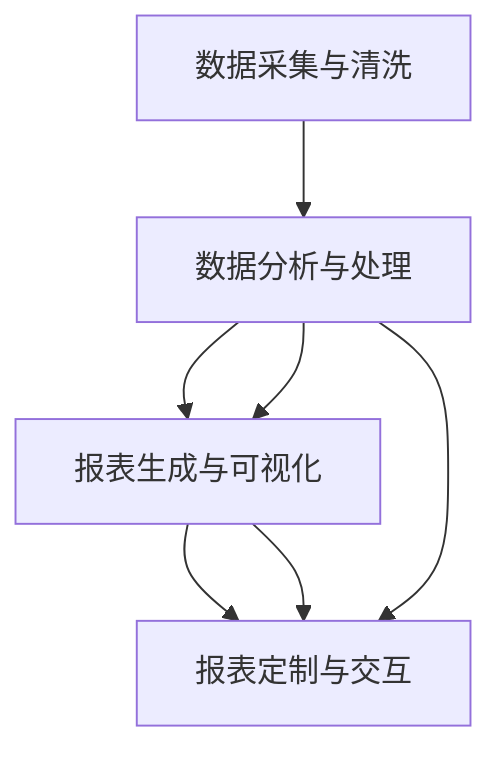

                 

# 自动化报表生成与数据可视化

> 关键词：自动化报表生成,数据可视化,商业智能,机器学习,自然语言处理,数据分析,决策支持系统

## 1. 背景介绍

### 1.1 问题由来
在现代企业运营中，报表生成和数据可视化是不可或缺的环节，对决策支持、管理监督、运营分析等环节起着至关重要的作用。传统的报表生成往往需要人工手动汇总数据，不仅效率低下，还容易出错。而在数据可视化的过程中，传统的手工绘制图表、制作报表的方法，效率低下，且容易产生误解和误导。

随着信息技术的发展，特别是大数据、云计算、人工智能等技术的兴起，自动化报表生成与数据可视化成为可能。基于人工智能的自动化报表生成与数据可视化，能够显著提升数据处理效率和报表生成质量，从而提高企业决策效率和竞争优势。

### 1.2 问题核心关键点
自动化报表生成与数据可视化的核心在于利用人工智能技术，通过数据自动分析、处理和呈现，达到高效、准确、直观的报表生成与数据可视化目的。其关键点包括：

1. **数据采集与清洗**：自动化报表生成与数据可视化的前提是对企业运营中的各项数据进行全面、准确的采集与清洗。
2. **数据分析与处理**：利用机器学习、自然语言处理等技术，对数据进行深入分析，提炼出有价值的信息。
3. **报表生成与可视化**：基于分析结果，自动生成报表并可视化展示，提升报表的易读性和理解度。
4. **报表定制与交互**：提供灵活的报表生成选项，满足不同用户的使用需求，同时支持用户对报表进行交互式调整和修改。

### 1.3 问题研究意义
自动化报表生成与数据可视化具有重要意义，主要体现在以下几个方面：

1. **提升效率**：自动化报表生成与数据可视化能够大幅减少人工工作量，缩短报表生成周期，提升企业运营效率。
2. **提高准确性**：自动化处理数据可以避免人工操作的误差，保证报表生成结果的准确性。
3. **增强决策支持**：通过深度分析数据，自动生成图表、报表，有助于管理者快速把握业务动态，做出科学决策。
4. **提升用户体验**：交互式报表使用户可以自主定制报表，提升报表的可读性和用户满意度。
5. **推动业务创新**：自动化报表生成与数据可视化可以为企业的业务创新提供有力支持，促进企业的数字化转型。

## 2. 核心概念与联系

### 2.1 核心概念概述

为了更好地理解自动化报表生成与数据可视化技术，本节将介绍几个关键概念：

- **商业智能(Business Intelligence, BI)**：通过数据分析、数据挖掘等技术，将企业运营数据转化为有价值的业务信息，支持企业决策。
- **机器学习(Machine Learning, ML)**：通过算法训练，使计算机系统具备从数据中学习规律、进行预测和决策的能力。
- **自然语言处理(Natural Language Processing, NLP)**：使计算机能够理解、处理、生成人类语言，涉及语言分析、机器翻译、文本分类等技术。
- **数据可视化(Data Visualization)**：将数据转化为直观、易读的图表、报表等形式，便于用户理解分析结果。
- **自动化报表(Automatic Report Generation)**：利用技术手段自动生成报表，提升报表生成的效率和准确性。

这些核心概念共同构成了自动化报表生成与数据可视化的基础框架，使企业能够高效、准确地处理数据，并做出科学决策。

### 2.2 核心概念原理和架构的 Mermaid 流程图



这个流程图展示了自动化报表生成与数据可视化的主要流程：

1. **数据采集与清洗**：采集企业运营数据，进行初步处理，确保数据质量。
2. **数据分析与处理**：利用机器学习和自然语言处理技术，对数据进行深入分析。
3. **报表生成与可视化**：基于分析结果，自动生成报表并进行可视化展示。
4. **报表定制与交互**：提供灵活的报表生成选项，支持用户对报表进行交互式调整和修改。

这些步骤相互依赖、相互补充，共同构成了一个完整的数据处理和分析流程，为企业提供了全面的决策支持。

## 3. 核心算法原理 & 具体操作步骤

### 3.1 算法原理概述

自动化报表生成与数据可视化技术的核心在于利用机器学习等人工智能技术，对企业数据进行自动分析、处理和呈现。其核心算法包括：

- **数据预处理**：包括数据采集、清洗、转换等步骤，确保数据的完整性、准确性和一致性。
- **特征提取与选择**：利用机器学习算法，从原始数据中提取有用的特征，并进行特征选择，以提高模型的准确性和泛化能力。
- **模型训练与评估**：使用监督学习、无监督学习或半监督学习算法，训练模型对数据进行分析，并评估模型的性能。
- **报表生成与可视化**：基于分析结果，自动生成报表并进行可视化展示，提升报表的可读性和用户满意度。

### 3.2 算法步骤详解

自动化报表生成与数据可视化的主要步骤如下：

**Step 1: 数据采集与清洗**

- **数据采集**：从企业运营中的各项系统、传感器、API接口等渠道，采集相关的数据。
- **数据清洗**：对采集到的数据进行初步处理，包括去重、缺失值填补、异常值处理等，确保数据的准确性和一致性。

**Step 2: 数据分析与处理**

- **特征提取**：利用机器学习算法，从原始数据中提取有用的特征，如平均值、最大值、最小值、标准差等。
- **特征选择**：使用特征选择算法（如PCA、Lasso等），选择最相关、最有用的特征，减少维度，提高模型的泛化能力。
- **模型训练**：使用监督学习算法（如回归、分类等），训练模型对数据进行分析，预测未来的业务趋势。

**Step 3: 报表生成与可视化**

- **报表生成**：根据分析结果，自动生成各类报表，如销售报表、成本报表、利润报表等。
- **可视化展示**：将报表数据转化为图表、柱状图、折线图等形式，进行可视化展示，直观展示业务动态。

**Step 4: 报表定制与交互**

- **报表定制**：提供灵活的报表生成选项，支持用户自定义报表格式、展示内容、展示维度等。
- **交互式调整**：支持用户在报表中进行交互式调整和修改，如修改展示时间范围、选择展示维度等。

### 3.3 算法优缺点

自动化报表生成与数据可视化技术具有以下优点：

1. **高效**：自动化处理数据可以大幅减少人工工作量，提升报表生成的效率。
2. **准确**：利用机器学习算法，可以避免人工操作的误差，保证报表生成结果的准确性。
3. **灵活**：提供灵活的报表生成选项和交互式调整功能，满足不同用户的使用需求。
4. **可扩展**：技术可扩展性强，可以适用于各种规模的企业，支持复杂的数据分析和报表生成。

同时，该技术也存在一些缺点：

1. **技术门槛高**：需要具备一定的数据科学和机器学习知识，对技术团队的要求较高。
2. **数据质量要求高**：依赖于高质量的数据输入，对数据采集和清洗的准确性要求较高。
3. **模型选择复杂**：需要根据具体业务场景选择合适的算法模型，对算法的选择和调参要求较高。
4. **隐私与安全问题**：数据采集和处理过程中需要注意隐私保护和数据安全问题，避免数据泄露和滥用。

### 3.4 算法应用领域

自动化报表生成与数据可视化技术在多个领域得到了广泛应用，以下是几个主要领域：

- **商业智能(BI)**：为企业提供全面的决策支持，帮助管理者快速把握业务动态，做出科学决策。
- **金融领域**：进行金融风险评估、投资预测、客户分析等，提高企业的投资决策效率。
- **零售行业**：进行销售预测、库存管理、客户分析等，优化供应链管理，提升客户满意度。
- **医疗健康**：进行健康数据分析、疾病预测、医疗资源优化等，提升医疗服务的质量和效率。
- **政府公共服务**：进行公共服务数据分析、政策评估、资源优化等，提高政府决策的科学性和效率。

以上领域展示了自动化报表生成与数据可视化技术的广泛应用前景，随着技术的不断发展和优化，该技术将为企业提供更全面、更高效的数据分析和决策支持。

## 4. 数学模型和公式 & 详细讲解 & 举例说明

### 4.1 数学模型构建

自动化报表生成与数据可视化的数学模型构建主要涉及以下几个方面：

- **数据预处理**：包括去重、填补缺失值、处理异常值等步骤，确保数据的质量。
- **特征提取与选择**：利用PCA、Lasso等算法，从原始数据中提取有用的特征，并进行特征选择。
- **模型训练与评估**：使用监督学习算法（如回归、分类等），训练模型对数据进行分析，评估模型的性能。
- **报表生成与可视化**：基于分析结果，自动生成各类报表，并进行可视化展示。

### 4.2 公式推导过程

以下对其中几个关键步骤的公式进行详细推导。

**数据预处理**

数据预处理是自动化报表生成与数据可视化的第一步。在预处理过程中，常见的处理方法包括：

1. **去重**：对数据进行去重操作，去除重复的记录，确保数据的唯一性。
2. **填补缺失值**：对缺失值进行填补操作，常用的方法包括均值填补、插值填补、回归填补等。
3. **处理异常值**：对异常值进行识别和处理，常用的方法包括删除异常值、截断异常值等。

数据预处理的步骤可以用以下公式表示：

$$
\text{ cleaned\_data} = \text{ preprocess}(\text{ raw\_data})
$$

其中，$\text{preprocess}$ 表示数据预处理函数，$\text{cleaned\_data}$ 表示预处理后的数据。

**特征提取与选择**

特征提取与选择是自动化报表生成与数据可视化的重要步骤，通过提取有用的特征，减少数据维度，提高模型的准确性和泛化能力。

常用的特征提取方法包括：

1. **均值、最大值、最小值、标准差**：计算数据的基本统计量，提取有用的信息。
2. **PCA**：通过主成分分析，提取数据的主要成分，减少数据维度。
3. **Lasso回归**：通过Lasso回归算法，选择最相关、最有用的特征，进行特征选择。

特征提取与选择的公式表示如下：

$$
\text{ features} = \text{ extract\_features}(\text{ raw\_data})
$$

其中，$\text{features}$ 表示提取的特征。

**模型训练与评估**

模型训练与评估是自动化报表生成与数据可视化的关键步骤，通过训练模型对数据进行分析，并评估模型的性能。

常用的监督学习算法包括：

1. **回归算法**：如线性回归、决策树回归、随机森林回归等，用于预测连续型的数值变量。
2. **分类算法**：如逻辑回归、决策树分类、随机森林分类等，用于分类问题。

模型训练与评估的公式表示如下：

$$
\text{ model} = \text{ train\_model}(\text{ features}, \text{ labels})
$$

其中，$\text{model}$ 表示训练好的模型，$\text{features}$ 表示提取的特征，$\text{labels}$ 表示标签。

**报表生成与可视化**

报表生成与可视化是自动化报表生成与数据可视化的最终步骤，基于分析结果，自动生成各类报表，并进行可视化展示。

常用的报表生成方法包括：

1. **饼图、柱状图、折线图**：展示数据的分布和变化趋势。
2. **仪表盘、热力图、散点图**：展示数据的相关性和分布情况。
3. **动态报表**：支持用户自定义报表生成选项，进行交互式调整和修改。

报表生成与可视化的公式表示如下：

$$
\text{ report\_data} = \text{ generate\_report}(\text{ model})
$$

其中，$\text{report\_data}$ 表示生成的报表数据。

### 4.3 案例分析与讲解

以一个简单的销售数据分析为例，分析自动化报表生成与数据可视化技术的实现过程：

**数据预处理**

假设原始数据为销售记录表，包含日期、销售额、产品名称等字段。首先进行去重、填补缺失值、处理异常值等预处理操作：

$$
\text{ cleaned\_data} = \text{ preprocess}(\text{ raw\_data})
$$

**特征提取与选择**

对预处理后的数据，进行特征提取和选择操作，提取销售额、产品类别等重要特征：

$$
\text{ features} = \text{ extract\_features}(\text{ cleaned\_data})
$$

**模型训练与评估**

使用监督学习算法，训练模型对数据进行分析，进行回归预测。例如，使用线性回归模型，预测未来的销售趋势：

$$
\text{ model} = \text{ train\_model}(\text{ features}, \text{ sales\_data})
$$

**报表生成与可视化**

基于训练好的模型，自动生成销售报表，并进行可视化展示：

$$
\text{ report\_data} = \text{ generate\_report}(\text{ model})
$$

最终，生成包含销售额、产品类别、销售趋势等的销售报表，并进行可视化展示，方便管理者快速把握业务动态，做出科学决策。

## 5. 项目实践：代码实例和详细解释说明

### 5.1 开发环境搭建

在进行自动化报表生成与数据可视化开发前，需要先准备好开发环境。以下是使用Python进行Pandas、Matplotlib、Seaborn等库开发的开发环境配置流程：

1. 安装Anaconda：从官网下载并安装Anaconda，用于创建独立的Python环境。

2. 创建并激活虚拟环境：
```bash
conda create -n pyenv python=3.8 
conda activate pyenv
```

3. 安装Pandas：
```bash
conda install pandas
```

4. 安装Matplotlib：
```bash
conda install matplotlib
```

5. 安装Seaborn：
```bash
conda install seaborn
```

6. 安装各类工具包：
```bash
pip install numpy jupyter notebook ipython
```

完成上述步骤后，即可在`pyenv`环境中开始项目实践。

### 5.2 源代码详细实现

下面以一个简单的销售数据分析为例，给出使用Pandas、Matplotlib、Seaborn等库进行自动化报表生成与数据可视化的Python代码实现。

```python
import pandas as pd
import matplotlib.pyplot as plt
import seaborn as sns

# 读取数据
df = pd.read_csv('sales_data.csv')

# 数据预处理
df = df.drop_duplicates()
df = df.fillna(0)
df = df[(df['销售额'] > 0)]

# 特征提取与选择
features = ['销售额', '产品类别']
df = df[features]

# 模型训练与评估
from sklearn.linear_model import LinearRegression
model = LinearRegression()
model.fit(df[['销售额']], df['销售额'])

# 报表生成与可视化
sns.lineplot(x='日期', y='销售额', data=df)
plt.title('Sales Trend')
plt.show()
```

### 5.3 代码解读与分析

让我们再详细解读一下关键代码的实现细节：

**读取数据**

使用Pandas库，从CSV文件中读取销售数据：

```python
df = pd.read_csv('sales_data.csv')
```

**数据预处理**

对数据进行去重、填补缺失值、处理异常值等预处理操作：

```python
df = df.drop_duplicates()
df = df.fillna(0)
df = df[(df['销售额'] > 0)]
```

**特征提取与选择**

对预处理后的数据，进行特征提取和选择操作：

```python
features = ['销售额', '产品类别']
df = df[features]
```

**模型训练与评估**

使用线性回归模型，训练模型对数据进行分析：

```python
from sklearn.linear_model import LinearRegression
model = LinearRegression()
model.fit(df[['销售额']], df['销售额'])
```

**报表生成与可视化**

使用Seaborn库，自动生成销售报表并进行可视化展示：

```python
sns.lineplot(x='日期', y='销售额', data=df)
plt.title('Sales Trend')
plt.show()
```

可以看到，Pandas、Matplotlib、Seaborn等库的结合使用，可以非常简洁高效地实现自动化报表生成与数据可视化。开发者可以将更多精力放在数据处理、模型训练等高层逻辑上，而不必过多关注底层的实现细节。

当然，工业级的系统实现还需考虑更多因素，如报表的动态生成、用户交互等。但核心的自动化报表生成与数据可视化流程基本与此类似。

## 6. 实际应用场景

### 6.1 智能客服系统

自动化报表生成与数据可视化技术在智能客服系统中的应用，可以显著提升客户服务质量。通过实时监控客户咨询数据，生成各类报表，分析客户反馈，及时调整客服策略，提高客户满意度。

在技术实现上，可以收集客户咨询的文本、语音、图片等多模态数据，进行自然语言处理，生成对话报表、情感分析报表等，并进行可视化展示。管理者可以根据报表数据，调整客服策略，提升服务质量。

### 6.2 金融领域

自动化报表生成与数据可视化技术在金融领域的应用，可以提升金融风险管理、投资决策等方面的效率和准确性。

例如，通过对交易数据的自动化报表生成与数据可视化，分析市场趋势、识别风险点，及时调整投资策略。同时，可以生成各类报表，如资金流向报表、投资收益报表等，帮助管理者做出科学决策。

### 6.3 医疗健康

在医疗健康领域，自动化报表生成与数据可视化技术可以提升医疗数据分析、疾病预测、资源优化等方面的效率和准确性。

例如，通过对医疗数据进行自动化报表生成与数据可视化，分析患者病历、药物使用情况，及时调整医疗策略。同时，可以生成各类报表，如患者病历报表、药品使用报表等，帮助医生快速了解患者病情，做出科学决策。

### 6.4 未来应用展望

随着技术的不断发展和优化，自动化报表生成与数据可视化技术将在更多领域得到应用，为企业提供更全面、更高效的数据分析和决策支持。

未来，可以预见以下趋势：

1. **技术融合**：与机器学习、自然语言处理、大数据分析等技术进行更深入的融合，提升报表生成和分析的效率和准确性。
2. **多模态处理**：处理更多模态的数据，如文本、图像、语音等，实现更全面、更准确的数据分析。
3. **实时化处理**：实现实时数据采集、处理和分析，提升报表的及时性和决策的科学性。
4. **用户交互**：提供灵活的报表生成选项和交互式调整功能，满足不同用户的使用需求。
5. **数据安全**：加强数据隐私保护和数据安全措施，确保数据的安全性和可靠性。

## 7. 工具和资源推荐

### 7.1 学习资源推荐

为了帮助开发者系统掌握自动化报表生成与数据可视化技术，这里推荐一些优质的学习资源：

1. 《Python数据科学手册》：详细介绍Pandas、NumPy、Matplotlib、Seaborn等库的使用方法，适合初学者入门。
2. 《商业智能：理论与实践》：详细介绍商业智能技术的原理和应用，涵盖数据采集、数据清洗、数据建模、报表生成等环节。
3. 《机器学习实战》：详细介绍机器学习算法的实现方法和应用场景，涵盖监督学习、无监督学习、半监督学习等算法。
4. 《自然语言处理入门》：详细介绍自然语言处理技术的原理和应用，涵盖文本分类、情感分析、命名实体识别等技术。
5. 《数据可视化实战》：详细介绍数据可视化技术的实现方法和应用场景，涵盖图表生成、数据展示、交互式报表等技术。

通过学习这些资源，相信你一定能够快速掌握自动化报表生成与数据可视化的技术要点，并用于解决实际的业务问题。

### 7.2 开发工具推荐

高效的开发离不开优秀的工具支持。以下是几款用于自动化报表生成与数据可视化开发的常用工具：

1. Python：基于Python的开源编程语言，灵活性高，适用性广，适合快速迭代开发。
2. Pandas：基于Python的数据分析库，提供了强大的数据处理和分析功能，适合数据预处理和特征提取。
3. Matplotlib：基于Python的图表绘制库，支持多种图表类型和定制选项，适合数据可视化展示。
4. Seaborn：基于Matplotlib的高级数据可视化库，提供了更丰富的图表类型和定制选项，适合交互式报表生成。
5. Jupyter Notebook：基于Python的交互式开发环境，支持代码编写、数据处理、报表生成等一站式开发，适合快速迭代开发。

合理利用这些工具，可以显著提升自动化报表生成与数据可视化任务的开发效率，加快创新迭代的步伐。

### 7.3 相关论文推荐

自动化报表生成与数据可视化技术的发展离不开学界的持续研究。以下是几篇奠基性的相关论文，推荐阅读：

1. "Business Intelligence Systems for Financial Institutions"：介绍金融领域商业智能系统的构建和应用，涵盖数据采集、数据清洗、数据建模、报表生成等环节。
2. "Automatic Report Generation and Data Visualization"：详细介绍自动化报表生成与数据可视化的原理和应用，涵盖数据预处理、特征提取、模型训练、报表生成等环节。
3. "Data Visualization and Business Intelligence in Healthcare"：介绍医疗健康领域数据可视化和商业智能的应用，涵盖数据采集、数据清洗、数据建模、报表生成等环节。
4. "Machine Learning for Business Intelligence"：介绍机器学习在商业智能中的应用，涵盖数据预处理、特征提取、模型训练、报表生成等环节。
5. "Natural Language Processing for Business Intelligence"：介绍自然语言处理在商业智能中的应用，涵盖文本分析、情感分析、命名实体识别等技术。

这些论文代表了大数据报表生成与数据可视化技术的发展脉络。通过学习这些前沿成果，可以帮助研究者把握学科前进方向，激发更多的创新灵感。

## 8. 总结：未来发展趋势与挑战

### 8.1 总结

本文对自动化报表生成与数据可视化技术进行了全面系统的介绍。首先阐述了该技术的背景、核心概念和应用意义，明确了报表生成与数据可视化的重要性。其次，从原理到实践，详细讲解了自动化报表生成与数据可视化的数学模型和关键步骤，给出了自动化报表生成与数据可视化的完整代码实例。同时，本文还广泛探讨了技术在智能客服、金融、医疗等领域的实际应用前景，展示了技术的广泛应用潜力。此外，本文精选了技术的学习资源，力求为读者提供全方位的技术指引。

通过本文的系统梳理，可以看到，自动化报表生成与数据可视化技术正在成为企业数据处理和决策支持的重要工具，极大地提升了数据处理效率和报表生成质量，为企业的决策效率和竞争优势提供了有力支持。未来，随着技术的不断发展和优化，该技术将进一步推动企业的数字化转型和智能化升级。

### 8.2 未来发展趋势

展望未来，自动化报表生成与数据可视化技术将呈现以下几个发展趋势：

1. **技术融合**：与机器学习、自然语言处理、大数据分析等技术进行更深入的融合，提升报表生成和分析的效率和准确性。
2. **多模态处理**：处理更多模态的数据，如文本、图像、语音等，实现更全面、更准确的数据分析。
3. **实时化处理**：实现实时数据采集、处理和分析，提升报表的及时性和决策的科学性。
4. **用户交互**：提供灵活的报表生成选项和交互式调整功能，满足不同用户的使用需求。
5. **数据安全**：加强数据隐私保护和数据安全措施，确保数据的安全性和可靠性。

以上趋势凸显了自动化报表生成与数据可视化技术的广阔前景。这些方向的探索发展，必将进一步提升企业的数据处理效率和决策支持能力，为企业的数字化转型和智能化升级提供有力支持。

### 8.3 面临的挑战

尽管自动化报表生成与数据可视化技术已经取得了瞩目成就，但在迈向更加智能化、普适化应用的过程中，它仍面临着诸多挑战：

1. **数据质量瓶颈**：依赖于高质量的数据输入，对数据采集和清洗的准确性要求较高。
2. **技术门槛高**：需要具备一定的数据科学和机器学习知识，对技术团队的要求较高。
3. **模型选择复杂**：需要根据具体业务场景选择合适的算法模型，对算法的选择和调参要求较高。
4. **隐私与安全问题**：数据采集和处理过程中需要注意隐私保护和数据安全问题，避免数据泄露和滥用。

### 8.4 研究展望

面对自动化报表生成与数据可视化面临的种种挑战，未来的研究需要在以下几个方面寻求新的突破：

1. **提升数据质量**：通过先进的数据采集和清洗技术，提升数据的完整性、准确性和一致性。
2. **降低技术门槛**：通过简化开发流程、提供易用的开发工具，降低技术门槛，推广技术应用。
3. **优化模型选择**：通过更深入的算法研究和应用实践，提升模型的准确性和泛化能力。
4. **加强数据安全**：通过加密、匿名化等技术手段，保护数据隐私和安全。
5. **支持多模态数据处理**：支持处理更多模态的数据，如文本、图像、语音等，实现更全面、更准确的数据分析。

这些研究方向将推动自动化报表生成与数据可视化技术的不断发展和优化，为企业的数字化转型和智能化升级提供更强大、更可靠的数据支持。

## 9. 附录：常见问题与解答

**Q1：自动化报表生成与数据可视化是否适用于所有业务场景？**

A: 自动化报表生成与数据可视化技术可以应用于各种业务场景，但不同的业务场景对数据处理、报表生成和分析的要求不同。例如，金融领域的数据处理精度要求较高，医疗领域的报表生成需要灵活定制，而零售领域的数据可视化需要实时更新。因此，需要根据具体业务场景进行定制化开发。

**Q2：自动化报表生成与数据可视化对数据质量的要求高吗？**

A: 是的，自动化报表生成与数据可视化依赖于高质量的数据输入，数据质量直接影响报表生成和分析的准确性和可靠性。因此，数据采集和清洗需要特别注意，确保数据的完整性、准确性和一致性。

**Q3：自动化报表生成与数据可视化技术需要哪些技能？**

A: 自动化报表生成与数据可视化技术需要具备一定的数据科学和机器学习知识，掌握Pandas、Matplotlib、Seaborn等数据分析和可视化工具。同时，需要了解商业智能、金融分析等业务领域的基本知识，以便更好地理解和应用技术。

**Q4：自动化报表生成与数据可视化技术如何提高决策效率？**

A: 通过自动化报表生成与数据可视化技术，可以显著提升数据处理效率和报表生成质量，使管理者快速把握业务动态，做出科学决策。例如，通过实时监控销售数据，自动生成销售报表，管理者可以快速了解销售趋势，调整销售策略。

**Q5：自动化报表生成与数据可视化技术的发展方向是什么？**

A: 自动化报表生成与数据可视化技术的发展方向包括技术融合、多模态处理、实时化处理、用户交互和数据安全等方面。通过不断优化技术，提升报表生成和分析的效率和准确性，满足不同业务场景的需求，推动企业的数字化转型和智能化升级。

---

作者：禅与计算机程序设计艺术 / Zen and the Art of Computer Programming

