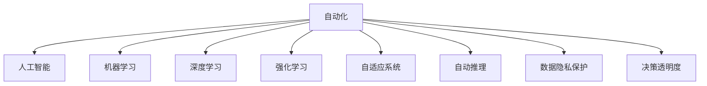
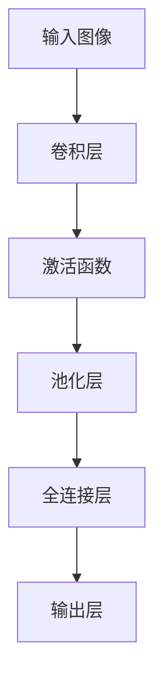
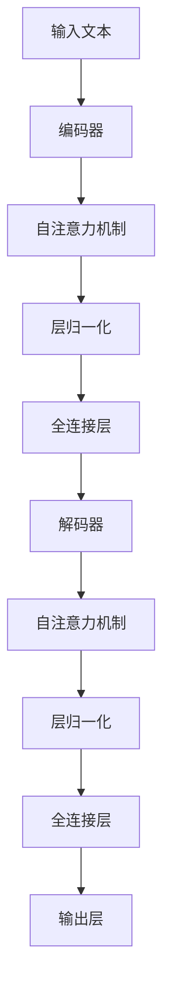

                 

# 自动化的最新发展与挑战

## 1. 背景介绍

### 1.1 问题由来
近年来，自动化技术在各行各业中得到了广泛应用。从制造业的自动化生产线，到医疗领域的智能诊断，再到金融领域的智能投顾，自动化技术正在深刻改变我们的工作和生活方式。然而，自动化技术的快速发展也带来了新的挑战。如何高效、安全地部署自动化系统，如何应对自动化带来的伦理和社会问题，成为当前研究的热点。本文将系统介绍自动化的最新发展与面临的挑战，帮助读者全面了解这一领域的前沿动态。

### 1.2 问题核心关键点
自动化技术的关键在于其智能化和自适应性。通过人工智能、机器学习等前沿技术，自动化系统能够从数据中学习、自我优化，适应不断变化的环境。然而，这同时也带来了模型复杂度增加、数据隐私保护、决策透明度等问题。本文将围绕这些核心问题进行详细探讨。

## 2. 核心概念与联系

### 2.1 核心概念概述

为更好地理解自动化的最新发展，本节将介绍几个关键概念：

- 自动化(Automation)：指通过计算机技术实现的任务自动化，以提升效率、降低成本。常见的自动化技术包括机器视觉、自然语言处理、机器人控制等。
- 人工智能(AI)：一种通过计算机模拟人类智能的高级自动化技术，包括机器学习、深度学习、强化学习等子领域。
- 机器学习(Machine Learning)：一种使计算机从数据中学习并提升性能的技术，是人工智能的重要组成部分。
- 深度学习(Deep Learning)：一种基于多层神经网络的机器学习技术，广泛应用于图像识别、语音识别、自然语言处理等领域。
- 强化学习(Reinforcement Learning)：一种通过奖励信号训练智能体决策的技术，常用于游戏、机器人控制等领域。
- 自适应系统(Adaptive Systems)：能够根据环境变化自我优化、自我适应的系统，如自动驾驶、智能推荐系统等。
- 自动推理(Automatic Reasoning)：一种能够自动推导和验证知识、逻辑的技术，常用于知识图谱构建、自然语言推理等领域。
- 数据隐私保护(Data Privacy Protection)：确保数据在使用过程中不被滥用、泄露，保护用户隐私的技术。
- 决策透明度(Transparency)：确保自动化系统的决策过程可解释、可追溯，增强用户信任的技术。

这些概念之间的逻辑关系可以通过以下Mermaid流程图来展示：



这个流程图展示了自动化技术的相关概念及其之间的关系：

1. 自动化通过人工智能、机器学习等技术实现智能化和自动化。
2. 深度学习和强化学习是人工智能的重要分支，广泛应用在自动化系统开发中。
3. 自适应系统和自动推理技术使得自动化系统具备自我优化和自我适应的能力。
4. 数据隐私保护和决策透明度是自动化应用中需要重视的伦理和安全问题。

## 3. 核心算法原理 & 具体操作步骤
### 3.1 算法原理概述

自动化技术的核心在于算法的设计和优化。其原理通常包括：

1. 数据采集：从现实世界中收集数据，如图像、文本、传感器数据等。
2. 数据预处理：清洗、标注、归一化等预处理步骤，使得数据适合训练模型。
3. 模型训练：选择合适的算法和模型，训练使其能够对数据进行预测、推理等任务。
4. 模型评估：使用测试集评估模型性能，调整参数或选择更好的模型。
5. 模型部署：将训练好的模型部署到实际应用中，实现自动化功能。
6. 模型优化：根据反馈数据不断优化模型，提升性能和稳定性。

### 3.2 算法步骤详解

以下详细介绍自动化技术的核心算法步骤：

**Step 1: 数据采集与预处理**
- 采集现实世界的数据，如摄像头拍摄的图像、麦克风录制的音频、传感器采集的环境数据等。
- 清洗数据，去除噪音、缺失值等。
- 标注数据，如将图像标注为不同的类别、将文本标注为情感等。
- 归一化数据，如将图像数据缩放到固定大小、将文本数据转换为向量等。

**Step 2: 模型选择与训练**
- 选择合适的算法和模型，如卷积神经网络(CNN)、循环神经网络(RNN)、长短期记忆网络(LSTM)、Transformer等。
- 选择合适的损失函数，如交叉熵损失、均方误差损失等。
- 使用优化算法如SGD、Adam等，训练模型使其能够拟合数据。
- 使用正则化技术如L2正则、Dropout等，避免过拟合。
- 使用早停法(Early Stopping)，在验证集上监控性能，提前停止训练。

**Step 3: 模型评估与部署**
- 使用测试集评估模型性能，计算准确率、召回率、F1值等指标。
- 根据评估结果调整模型参数，如学习率、批量大小等。
- 将训练好的模型部署到实际应用中，如计算机视觉中的图像分类、自然语言处理中的文本分类等。
- 实时收集反馈数据，监控模型性能，进行模型优化。

### 3.3 算法优缺点

自动化技术具有以下优点：

1. 高效性：自动化技术能够高效处理大量数据，大幅提升工作效率。
2. 准确性：通过模型训练，自动化系统能够实现高精度的预测和推理。
3. 可扩展性：自动化系统可以通过简单调整参数、模型等扩展功能，适应不同场景。
4. 实时性：自动化系统能够实时处理数据，响应迅速。

同时，该技术也存在以下缺点：

1. 数据依赖：自动化系统的性能高度依赖于数据质量，数据采集、标注等环节容易出现误差。
2. 模型复杂度：自动化系统的模型结构复杂，需要大量的计算资源和存储空间。
3. 透明性不足：自动化系统往往是"黑盒"系统，决策过程难以解释和追溯。
4. 伦理问题：自动化系统可能存在偏见、歧视等伦理问题，需要严格监管和控制。
5. 可解释性差：自动化系统的输出结果缺乏可解释性，用户难以理解和信任。

## 4. 数学模型和公式 & 详细讲解 & 举例说明

### 4.1 数学模型构建

自动化的数学模型通常基于机器学习、深度学习等算法构建。以图像分类任务为例，常用的模型包括卷积神经网络(CNN)。

卷积神经网络的结构如下：



其中，卷积层用于提取图像特征，激活函数用于增加非线性特性，池化层用于降维，全连接层用于分类，输出层用于预测类别。

### 4.2 公式推导过程

以图像分类任务为例，假设输入图像大小为$h \times w$，卷积层卷积核大小为$k \times k$，步长为$s$，则卷积操作的输出大小为：

$$
\text{输出大小} = \left\lfloor \frac{h-k+2p}{s} \right\rfloor \times \left\lfloor \frac{w-k+2p}{s} \right\rfloor
$$

其中$p$为填充大小。卷积操作可以看作是在输入图像上进行滑动窗口操作，计算每个窗口内的卷积核值，得到特征图。

### 4.3 案例分析与讲解

以自然语言处理(NLP)中的文本分类任务为例，常用的模型包括循环神经网络(RNN)、长短期记忆网络(LSTM)、Transformer等。

Transformer模型由自注意力机制和全连接层组成，其结构如下：



其中，编码器负责提取输入文本的特征，解码器负责生成分类结果。自注意力机制能够捕捉文本中不同位置之间的关系，全连接层用于分类。

## 5. 项目实践：代码实例和详细解释说明

### 5.1 开发环境搭建

在进行自动化项目实践前，我们需要准备好开发环境。以下是使用Python进行TensorFlow开发的环境配置流程：

1. 安装Anaconda：从官网下载并安装Anaconda，用于创建独立的Python环境。

2. 创建并激活虚拟环境：
```bash
conda create -n tensorflow-env python=3.8 
conda activate tensorflow-env
```

3. 安装TensorFlow：根据CUDA版本，从官网获取对应的安装命令。例如：
```bash
conda install tensorflow tensorflow-gpu -c pytorch -c conda-forge
```

4. 安装各类工具包：
```bash
pip install numpy pandas scikit-learn matplotlib tqdm jupyter notebook ipython
```

完成上述步骤后，即可在`tensorflow-env`环境中开始自动化实践。

### 5.2 源代码详细实现

这里我们以图像分类任务为例，给出使用TensorFlow进行卷积神经网络(CNN)模型开发的PyTorch代码实现。

首先，定义CNN模型：

```python
import tensorflow as tf
from tensorflow.keras import layers, models

def create_model(input_shape, num_classes):
    model = models.Sequential()
    model.add(layers.Conv2D(32, (3, 3), activation='relu', input_shape=input_shape))
    model.add(layers.MaxPooling2D((2, 2)))
    model.add(layers.Conv2D(64, (3, 3), activation='relu'))
    model.add(layers.MaxPooling2D((2, 2)))
    model.add(layers.Conv2D(64, (3, 3), activation='relu'))
    model.add(layers.Flatten())
    model.add(layers.Dense(64, activation='relu'))
    model.add(layers.Dense(num_classes, activation='softmax'))
    return model
```

然后，定义训练和评估函数：

```python
import numpy as np
import os

def train_model(model, train_data, val_data, epochs, batch_size):
    model.compile(optimizer=tf.keras.optimizers.Adam(),
                  loss=tf.keras.losses.CategoricalCrossentropy(),
                  metrics=[tf.keras.metrics.CategoricalAccuracy()])

    train_dataset = tf.keras.preprocessing.image.ImageDataGenerator(
        rescale=1./255,
        validation_split=0.2,
        horizontal_flip=True)
    
    train_generator = train_dataset.flow_from_directory(
        'train',
        target_size=(32, 32),
        batch_size=batch_size,
        class_mode='categorical')
    
    val_generator = train_dataset.flow_from_directory(
        'val',
        target_size=(32, 32),
        batch_size=batch_size,
        class_mode='categorical',
        subset='validation')
    
    history = model.fit(
        train_generator,
        steps_per_epoch=len(train_generator),
        validation_data=val_generator,
        validation_steps=len(val_generator),
        epochs=epochs)
    
    return history

def evaluate_model(model, test_data):
    test_generator = train_dataset.flow_from_directory(
        'test',
        target_size=(32, 32),
        batch_size=batch_size,
        class_mode='categorical',
        subset='validation')
    
    test_loss, test_acc = model.evaluate(
        test_generator,
        steps=len(test_generator))
    
    return test_loss, test_acc
```

最后，启动训练流程并在测试集上评估：

```python
input_shape = (32, 32, 3)
num_classes = 10
batch_size = 32

model = create_model(input_shape, num_classes)
history = train_model(model, train_dir, val_dir, epochs=10, batch_size=batch_size)

test_loss, test_acc = evaluate_model(model, test_dir)

print('Test loss:', test_loss)
print('Test accuracy:', test_acc)
```

以上就是使用TensorFlow对CNN模型进行图像分类任务微调的完整代码实现。可以看到，得益于TensorFlow的强大封装，我们可以用相对简洁的代码完成模型训练和评估。

### 5.3 代码解读与分析

让我们再详细解读一下关键代码的实现细节：

**create_model函数**：
- 定义了一个包含卷积层、池化层、全连接层的CNN模型。

**train_model函数**：
- 使用了TensorFlow的ImageDataGenerator对数据进行增强和归一化处理。
- 定义了Adam优化器和交叉熵损失函数。
- 通过fit方法训练模型，并在每个epoch结束时保存训练结果。

**evaluate_model函数**：
- 使用了ImageDataGenerator对测试数据进行归一化处理。
- 通过evaluate方法评估模型性能，计算测试集上的损失和准确率。

**训练流程**：
- 定义模型输入形状和类别数量。
- 创建并初始化CNN模型。
- 在训练集上进行训练，保存训练历史。
- 在测试集上评估模型性能，输出测试结果。

可以看到，TensorFlow框架使得CNN模型的开发和训练变得非常简单，开发者可以专注于算法优化和模型改进，而不必过多关注底层细节。

## 6. 实际应用场景

### 6.1 工业自动化系统

工业自动化系统是自动化技术的重要应用领域之一。通过自动化技术，工业生产线可以实现高效、精准、安全的操作，提高生产效率和产品质量。

在实际应用中，可以采集生产线的传感器数据、视频图像等，通过深度学习模型进行异常检测、预测维护、质量控制等任务。例如，通过视频图像识别技术，实时监测生产线上机器的运行状态，检测出故障并进行报警，提前进行维护。

### 6.2 智能交通系统

智能交通系统是自动化技术在交通领域的重要应用。通过自动化技术，可以提高交通系统的安全性和效率，减少交通拥堵和事故。

在实际应用中，可以通过采集车辆位置、速度、轨迹等数据，使用深度学习模型进行路径规划、交通预测、事故预警等任务。例如，通过路径规划算法，优化交通流，减少车辆行驶距离和时间。

### 6.3 智能医疗系统

智能医疗系统是自动化技术在医疗领域的重要应用。通过自动化技术，可以提高医疗服务的效率和质量，改善患者的治疗效果。

在实际应用中，可以通过采集患者的生理数据、病历等，使用深度学习模型进行疾病诊断、治疗方案推荐、智能问诊等任务。例如，通过深度学习模型，自动识别病人的症状和疾病，给出相应的治疗方案，辅助医生进行诊断。

### 6.4 未来应用展望

随着自动化技术的不断发展，未来将会出现更多新的应用场景。以下是几个具有潜力的方向：

1. 自动驾驶：通过深度学习模型，实现无人驾驶车辆的环境感知、路径规划、决策控制等功能。
2. 智能家居：通过自动化技术，实现智能家电的自动控制、语音识别、智能推荐等功能，提升居住体验。
3. 智能城市：通过自动化技术，实现智能交通、智能安防、智能环境监控等功能，提升城市管理效率。

未来，自动化技术将在更多领域得到广泛应用，为人类生活和工作带来深远影响。

## 7. 工具和资源推荐

### 7.1 学习资源推荐

为了帮助开发者系统掌握自动化技术的理论基础和实践技巧，这里推荐一些优质的学习资源：

1. 《深度学习》系列书籍：由Ian Goodfellow等作者所著，全面介绍了深度学习的原理和应用。
2. CS231n《卷积神经网络》课程：斯坦福大学开设的计算机视觉课程，讲解了卷积神经网络的结构和应用。
3. CS224n《自然语言处理》课程：斯坦福大学开设的NLP课程，讲解了自然语言处理的基本概念和算法。
4. TensorFlow官方文档：TensorFlow的官方文档，提供了详细的API文档、示例代码、使用指南等。
5. PyTorch官方文档：PyTorch的官方文档，提供了API文档、示例代码、使用指南等。
6. Coursera深度学习课程：Coursera开设的深度学习课程，由深度学习领域的知名专家授课。

通过对这些资源的学习实践，相信你一定能够快速掌握自动化技术的精髓，并用于解决实际的工程问题。

### 7.2 开发工具推荐

高效的开发离不开优秀的工具支持。以下是几款用于自动化技术开发的常用工具：

1. PyTorch：基于Python的开源深度学习框架，灵活动态的计算图，适合快速迭代研究。
2. TensorFlow：由Google主导开发的开源深度学习框架，生产部署方便，适合大规模工程应用。
3. Keras：基于TensorFlow的高级API，提供了简单易用的接口，适合初学者。
4. Jupyter Notebook：交互式Python环境，支持代码编写、运行、可视化等。
5. Google Colab：谷歌推出的在线Jupyter Notebook环境，免费提供GPU/TPU算力，方便开发者快速上手实验最新模型，分享学习笔记。

合理利用这些工具，可以显著提升自动化技术的开发效率，加快创新迭代的步伐。

### 7.3 相关论文推荐

自动化技术的发展源于学界的持续研究。以下是几篇奠基性的相关论文，推荐阅读：

1. Convolutional Neural Networks for Visual Recognition（即LeNet论文）：提出了卷积神经网络的结构，奠定了深度学习在计算机视觉领域的基础。
2. Natural Language Processing (Comprehensive)（即RNN论文）：提出了循环神经网络的结构，开创了深度学习在自然语言处理领域的应用。
3. Deep Residual Learning for Image Recognition（即ResNet论文）：提出了残差连接的网络结构，显著提升了深度神经网络的训练效率和性能。
4. Attention is All You Need（即Transformer原论文）：提出了Transformer结构，开启了深度学习在自然语言处理领域的预训练范式。
5. Self-Attention with Transformers: An Overview on Model Architectures, Advances and Limitations（即Transformer综述论文）：全面介绍了Transformer的结构和应用，探讨了其在自然语言处理领域的前景和挑战。

这些论文代表了大自动化技术的发展脉络。通过学习这些前沿成果，可以帮助研究者把握学科前进方向，激发更多的创新灵感。

## 8. 总结：未来发展趋势与挑战

### 8.1 总结

本文对自动化技术的最新发展与面临的挑战进行了全面系统的介绍。首先阐述了自动化技术的研究背景和应用场景，明确了其在提升效率、降低成本等方面的重要作用。其次，从原理到实践，详细讲解了自动化技术的核心算法和操作步骤，给出了自动化的代码实现示例。同时，本文还广泛探讨了自动化技术在工业自动化、智能交通、智能医疗等多个行业领域的应用前景，展示了其巨大的应用潜力。此外，本文精选了自动化技术的各类学习资源，力求为读者提供全方位的技术指引。

通过本文的系统梳理，可以看到，自动化技术正在成为各行各业的重要工具，极大地提升了工作效率和质量。未来，伴随算力成本的下降和数据规模的扩张，自动化技术将进一步拓展其应用边界，为人类生活和工作带来更多便利。

### 8.2 未来发展趋势

展望未来，自动化技术将呈现以下几个发展趋势：

1. 模型规模持续增大。随着算力成本的下降和数据规模的扩张，深度学习模型的参数量还将持续增长。超大规模模型蕴含的丰富知识，有望支撑更加复杂多变的自动化任务。
2. 自动化技术日趋多样化。除了传统的深度学习范式，未来会涌现更多参数高效和计算高效的自动化方法，如模型压缩、模型蒸馏等，在保持性能的同时，节省计算资源。
3. 多模态自动化崛起。当前的自动化技术往往局限于单一模态，未来会拓展到视觉、听觉、文本等多模态数据的融合，实现更加全面和精准的自动化。
4. 自动推理和知识图谱的结合。将自动推理与知识图谱技术结合，使得自动化系统具备更加强大的逻辑推理能力，提升系统可解释性和鲁棒性。
5. 自动化系统从离线走向在线。未来的自动化系统将更多地应用于实时任务，如自动驾驶、智能医疗等，需要具备更高的实时性和可靠性。
6. 自动化技术与社会伦理的结合。自动化技术的发展必须关注伦理和法律问题，确保其应用符合社会价值观，避免偏见和歧视。

以上趋势凸显了自动化技术的广阔前景。这些方向的探索发展，必将进一步提升自动化系统的性能和应用范围，为人类生活和工作带来更多便利。

### 8.3 面临的挑战

尽管自动化技术已经取得了瞩目成就，但在迈向更加智能化、普适化应用的过程中，它仍面临着诸多挑战：

1. 数据依赖：自动化系统的性能高度依赖于数据质量，数据采集、标注等环节容易出现误差。如何提高数据质量，减少标注成本，是当前的重要课题。
2. 模型复杂度：自动化系统的模型结构复杂，需要大量的计算资源和存储空间。如何降低模型复杂度，提高计算效率，是未来需要解决的关键问题。
3. 可解释性不足：自动化系统往往是"黑盒"系统，决策过程难以解释和追溯。如何赋予自动化系统更强的可解释性，增强用户信任，是亟待解决的问题。
4. 伦理问题：自动化系统可能存在偏见、歧视等伦理问题，需要严格监管和控制。如何确保自动化系统的公平性和公正性，是重要的研究方向。
5. 实时性要求高：自动化系统需要具备更高的实时性和稳定性，以应对复杂的实时任务。如何提升系统的实时性和可靠性，是未来的技术挑战。

### 8.4 研究展望

面对自动化技术面临的种种挑战，未来的研究需要在以下几个方面寻求新的突破：

1. 探索无监督和半监督自动化方法。摆脱对大规模标注数据的依赖，利用自监督学习、主动学习等无监督和半监督范式，最大限度利用非结构化数据，实现更加灵活高效的自动化。
2. 研究参数高效和计算高效的自动化方法。开发更加参数高效的自动化方法，在固定大部分模型参数的同时，只更新极少量的任务相关参数。同时优化计算图，减少前向传播和反向传播的资源消耗，实现更加轻量级、实时性的部署。
3. 引入更多先验知识。将符号化的先验知识，如知识图谱、逻辑规则等，与神经网络模型进行巧妙融合，引导自动化系统学习更准确、合理的知识。同时加强不同模态数据的整合，实现视觉、语音等多模态信息与文本信息的协同建模。
4. 结合因果分析和博弈论工具。将因果分析方法引入自动化系统，识别出系统决策的关键特征，增强输出解释的因果性和逻辑性。借助博弈论工具刻画人机交互过程，主动探索并规避系统的脆弱点，提高系统稳定性。
5. 纳入伦理道德约束。在自动化系统训练目标中引入伦理导向的评估指标，过滤和惩罚有偏见、有害的输出倾向。同时加强人工干预和审核，建立系统行为的监管机制，确保系统符合社会价值观。

这些研究方向的探索，必将引领自动化技术迈向更高的台阶，为构建安全、可靠、可解释、可控的自动化系统铺平道路。面向未来，自动化技术还需要与其他人工智能技术进行更深入的融合，如知识表示、因果推理、强化学习等，多路径协同发力，共同推动自动化技术的发展。只有勇于创新、敢于突破，才能不断拓展自动化技术的边界，为人类生活和工作带来更多便利。

## 9. 附录：常见问题与解答

**Q1：自动化技术在哪些领域应用广泛？**

A: 自动化技术在各行各业中都有广泛应用。例如，在工业领域，用于提升生产效率和产品质量；在医疗领域，用于疾病诊断和治疗方案推荐；在交通领域，用于智能交通管理和自动驾驶等。

**Q2：自动化技术面临哪些技术挑战？**

A: 自动化技术面临的主要技术挑战包括：
1. 数据依赖：自动化系统的性能高度依赖于数据质量，数据采集、标注等环节容易出现误差。
2. 模型复杂度：自动化系统的模型结构复杂，需要大量的计算资源和存储空间。
3. 可解释性不足：自动化系统往往是"黑盒"系统，决策过程难以解释和追溯。
4. 伦理问题：自动化系统可能存在偏见、歧视等伦理问题，需要严格监管和控制。
5. 实时性要求高：自动化系统需要具备更高的实时性和稳定性，以应对复杂的实时任务。

**Q3：自动化技术的未来发展方向是什么？**

A: 自动化技术的未来发展方向包括：
1. 模型规模持续增大。超大规模模型蕴含的丰富知识，有望支撑更加复杂多变的自动化任务。
2. 自动化技术日趋多样化。未来会涌现更多参数高效和计算高效的自动化方法。
3. 多模态自动化崛起。未来的自动化系统将拓展到视觉、听觉、文本等多模态数据的融合。
4. 自动推理和知识图谱的结合。使得自动化系统具备更加强大的逻辑推理能力。
5. 自动化系统从离线走向在线。未来的自动化系统将更多地应用于实时任务，如自动驾驶、智能医疗等。
6. 自动化技术与社会伦理的结合。确保自动化系统的公平性和公正性。

通过本文的系统梳理，可以看到，自动化技术正在成为各行各业的重要工具，极大地提升了工作效率和质量。未来，伴随算力成本的下降和数据规模的扩张，自动化技术将进一步拓展其应用边界，为人类生活和工作带来更多便利。

---

作者：禅与计算机程序设计艺术 / Zen and the Art of Computer Programming

