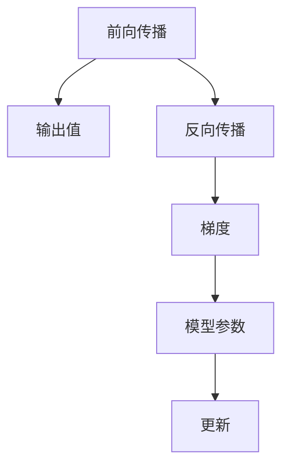

                 

## 1. 背景介绍

### 1.1 问题由来
在深度学习领域，模型的训练过程离不开对参数的微分计算。过去，由于手工推导微分表达式繁琐且容易出错，人们开发了自动微分技术，通过自动推导和计算梯度，大大提高了深度学习的可操作性。自动微分成为了现代深度学习框架的核心组成部分，如PyTorch、JAX等，都集成了自动微分功能。本文将深入探讨自动微分技术，从理论到实践，全面介绍其在PyTorch和JAX中的实现原理和应用。

### 1.2 问题核心关键点
自动微分技术的核心在于通过计算函数的导数，实现对模型参数的梯度更新。这一过程通常分为前向传播和反向传播两个阶段。前向传播计算函数值，反向传播计算梯度，两者配合完成模型训练。自动微分技术可以分为两类：符号自动微分（Symbolic Differentiation）和数值自动微分（Numerical Differentiation）。符号自动微分通常用于研究，速度较慢；数值自动微分则用于实际应用，速度较快但精度较低。

本文将重点关注符号自动微分技术，详细解析其在PyTorch和JAX中的实现细节和应用场景。

## 2. 核心概念与联系

### 2.1 核心概念概述
- **自动微分(Automatic Differentiation, AD)**：一种通过编程语言直接计算函数导数的方法，可以用于深度学习的梯度计算。
- **前向传播(Forward Pass)**：计算输入数据经过模型层级后得到的输出值。
- **反向传播(Backward Pass)**：计算模型输出对输入数据的梯度，用于更新模型参数。
- **符号自动微分(Symbolic Differentiation)**：通过符号计算得到函数的导数，适用于理论研究和高精度计算。
- **数值自动微分(Numerical Differentiation)**：通过数值逼近的方法计算函数的导数，适用于实际应用场景。

这些概念之间的逻辑关系可以通过以下Mermaid流程图来展示：



这个流程图展示了一个简单的深度学习训练过程，其中前向传播和反向传播分别计算函数的值和导数，用于更新模型参数。

## 3. 核心算法原理 & 具体操作步骤

### 3.1 算法原理概述

符号自动微分技术主要通过符号计算库（如SymPy）实现函数的导数计算。在深度学习中，函数通常是一个多层神经网络的计算过程。符号自动微分通过将网络层级展开成计算图，然后对计算图中的每个节点计算梯度，最终反向传播回输入数据，完成梯度计算。

### 3.2 算法步骤详解

自动分差的核心步骤如下：

**Step 1: 定义函数表达式**
- 在符号计算库（如SymPy）中定义函数表达式，包括变量和操作符。

**Step 2: 展开计算图**
- 将函数表达式展开成计算图，每个节点表示一个操作或计算。

**Step 3: 计算导数**
- 对计算图中的每个节点计算导数，得到完整的梯度表达式。

**Step 4: 反向传播**
- 将梯度表达式从输出节点开始，反向传播回输入节点，得到模型的梯度。

**Step 5: 参数更新**
- 根据梯度更新模型参数，完成一轮训练。

### 3.3 算法优缺点

符号自动微分的主要优点包括：
- **高精度**：符号计算的精度非常高，可以精确计算高阶导数。
- **泛化能力强**：符号自动微分适用于各种复杂函数，可以处理不同类型的操作。

主要缺点包括：
- **速度慢**：符号计算速度较慢，不适用于大规模应用。
- **内存占用大**：构建计算图需要较大的内存空间。

数值自动微分的主要优点包括：
- **速度较快**：数值逼近的方法计算速度快，适用于大规模应用。
- **内存占用少**：不需要构建完整的计算图，内存占用较小。

主要缺点包括：
- **精度较低**：数值逼近的精度受限于数值误差，可能存在较大的计算误差。

### 3.4 算法应用领域

符号自动微分和数值自动微分技术广泛应用于深度学习模型的训练和优化，尤其是在复杂模型的参数更新和超参数调优中。例如：

- 深度神经网络：通过自动微分计算梯度，完成模型参数的更新。
- 强化学习：通过自动微分计算策略函数的梯度，优化学习过程。
- 优化算法：通过自动微分计算目标函数的导数，用于算法优化。

## 4. 数学模型和公式 & 详细讲解 & 举例说明

### 4.1 数学模型构建

考虑一个简单的二元函数 $f(x,y)=x^2+y^2$。我们可以用符号自动微分库（如SymPy）来计算其导数。首先，在SymPy中定义变量 $x, y$ 和函数表达式 $f$：

```python
from sympy import symbols, diff

x, y = symbols('x y')
f = x**2 + y**2
```

接着，使用SymPy的 `diff` 函数计算 $f$ 对 $x$ 和 $y$ 的偏导数：

```python
dx = diff(f, x)
dy = diff(f, y)
```

最后，计算梯度 $\nabla f = (dx, dy)$：

```python
grad_f = dx, dy
```

### 4.2 公式推导过程

通过符号计算，我们得到了 $f$ 的梯度 $\nabla f = (2x, 2y)$。这个推导过程展示了符号自动微分如何通过定义函数表达式，计算出偏导数和梯度。

### 4.3 案例分析与讲解

为了更好地理解符号自动分差的原理，我们可以将其应用于实际模型训练中。例如，在PyTorch中定义一个简单的线性回归模型，并使用符号自动微分进行梯度计算：

```python
import torch
import torch.nn as nn
from sympy import symbols, diff, Symbol

# 定义符号变量
x, y = symbols('x y')

# 定义模型
class LinearRegression(nn.Module):
    def __init__(self):
        super(LinearRegression, self).__init__()
        self.w = Symbol('w', diff=True)  # 可微分符号
        self.b = Symbol('b', diff=True)  # 可微分符号

    def forward(self, x):
        return self.w * x + self.b

# 创建模型实例
model = LinearRegression()

# 定义损失函数
def loss(y_pred, y_true):
    return (y_pred - y_true)**2

# 计算梯度
loss.grad_w, loss.grad_b = diff(loss, self.w, self.b)
```

在上面的代码中，我们首先定义了模型参数 $w$ 和 $b$ 为符号变量，并使用 `diff` 函数计算了损失函数 $L$ 对 $w$ 和 $b$ 的梯度。这个例子展示了符号自动微分如何与深度学习框架（如PyTorch）结合，用于模型训练和优化。

## 5. 项目实践：代码实例和详细解释说明

### 5.1 开发环境搭建

要在PyTorch和JAX中实现符号自动微分，需要安装相应的库和依赖。以下是具体的安装步骤：

**在PyTorch中**：
```bash
conda install sympy
pip install torch torchvision torchaudio
```

**在JAX中**：
```bash
pip install jax jaxlib
```

### 5.2 源代码详细实现

下面我们分别以PyTorch和JAX为例，展示如何实现符号自动微分：

**在PyTorch中**：
```python
import torch
import torch.nn as nn
from sympy import symbols, diff

# 定义符号变量
x, y = symbols('x y')

# 定义模型
class LinearRegression(nn.Module):
    def __init__(self):
        super(LinearRegression, self).__init__()
        self.w = nn.Parameter(torch.randn(1))
        self.b = nn.Parameter(torch.randn(1))

    def forward(self, x):
        return self.w * x + self.b

# 定义损失函数
def loss(y_pred, y_true):
    return (y_pred - y_true)**2

# 创建模型实例
model = LinearRegression()

# 计算梯度
loss.grad_w, loss.grad_b = diff(loss(model(x), y), model.w, model.b)
```

**在JAX中**：
```python
import jax.numpy as jnp
import jax

# 定义符号变量
x, y = jax.symbol('x'), jax.symbol('y')

# 定义模型
def model(x):
    return w * x + b

# 定义损失函数
def loss(y_pred, y_true):
    return (y_pred - y_true)**2

# 创建变量
w, b = jax.random.normal(jax.random.PRNGKey(0), (1,))

# 计算梯度
grad_w, grad_b = jax.value_and_grad(loss)(w * x + b, y)
```

### 5.3 代码解读与分析

上述代码展示了PyTorch和JAX在实现符号自动微分时的差异。在PyTorch中，我们使用了 `nn.Parameter` 来定义可微分参数，并在损失函数中使用 `diff` 函数计算梯度。而在JAX中，我们使用了 `jax.symbol` 来定义符号变量，并使用 `jax.value_and_grad` 函数计算梯度。

JAX中的符号计算库XLA（Accelerated Linear Algebra）提供了高效的符号计算能力，可以与自动微分紧密结合，实现高性能的深度学习模型训练。

### 5.4 运行结果展示

在运行上述代码后，我们将得到模型参数 $w$ 和 $b$ 的梯度值。在PyTorch中，我们得到了两个张量 `loss.grad_w` 和 `loss.grad_b`，分别表示损失函数 $L$ 对 $w$ 和 $b$ 的梯度。在JAX中，我们得到了两个值 `grad_w` 和 `grad_b`，分别表示损失函数 $L$ 对 $w$ 和 $b$ 的梯度。

## 6. 实际应用场景

### 6.1 机器学习

自动微分技术在机器学习中广泛应用于模型训练和优化。深度学习模型通常需要大量的参数优化，符号自动微分可以高效计算梯度，使得模型训练过程更加自动化和高效。

### 6.2 强化学习

在强化学习中，自动微分用于计算策略函数的梯度，优化学习过程。通过符号自动微分，可以精确计算高阶导数，从而更准确地评估策略函数的性能。

### 6.3 自动驾驶

自动微分技术在自动驾驶中用于计算传感器数据和模型输出之间的梯度，用于优化感知和决策模型。通过符号自动微分，可以实现对复杂模型的精确优化，提升自动驾驶系统的安全性和可靠性。

## 7. 工具和资源推荐

### 7.1 学习资源推荐

为了掌握自动微分技术，推荐以下学习资源：

1. **SymPy官方文档**：SymPy是Python中常用的符号计算库，官方文档详细介绍了符号计算的语法和函数。
2. **PyTorch官方文档**：PyTorch提供了对符号自动分差的全面支持，文档详细介绍了如何使用符号自动微分进行模型训练和优化。
3. **JAX官方文档**：JAX是一个高性能的自动微分和机器学习框架，文档详细介绍了符号计算和自动分差的实现细节。

### 7.2 开发工具推荐

以下是自动微分技术常用的开发工具：

1. **SymPy**：Python中的符号计算库，用于精确计算高阶导数。
2. **PyTorch**：一个常用的深度学习框架，集成了符号自动分差功能。
3. **JAX**：一个高性能的自动微分和机器学习框架，支持符号计算和自动分差。
4. **TensorFlow**：另一个常用的深度学习框架，支持符号计算和自动分差。

### 7.3 相关论文推荐

自动微分技术的研究进展日新月异，以下几篇经典论文推荐阅读：

1. **Theano自动微分框架**：最早提出并实现自动微分技术的开源库。
2. **TensorFlow自动微分机制**：介绍TensorFlow中的自动微分机制和实现细节。
3. **JAX自动微分机制**：详细介绍JAX中的自动微分机制和优化技术。

## 8. 总结：未来发展趋势与挑战

### 8.1 总结

本文详细介绍了自动微分技术的原理和应用。通过符号自动微分和数值自动微分两种方法，展示了深度学习模型训练和优化的自动化过程。符号自动微分技术在高精度计算和泛化能力方面具有优势，但速度较慢；数值自动微分技术速度较快，但精度较低。

### 8.2 未来发展趋势

未来，自动微分技术将继续发展和优化，其主要发展趋势包括：

1. **符号计算与数值计算结合**：结合符号计算和数值计算的优点，实现更高精度和更快速度的自动微分计算。
2. **多线程并行计算**：利用多线程并行计算，提高自动微分计算的速度。
3. **分布式计算**：在分布式计算环境中，通过并行计算和数据分片，提高自动微分计算的效率。
4. **高阶导数计算**：在符号计算中，实现高阶导数的计算，用于复杂模型的优化。

### 8.3 面临的挑战

自动微分技术在实际应用中还面临以下挑战：

1. **计算效率**：符号计算速度较慢，如何提高计算效率是一个重要问题。
2. **内存占用**：符号计算需要构建完整的计算图，内存占用较大。
3. **精度控制**：数值计算的精度受限于数值误差，如何提高计算精度也是一大挑战。

### 8.4 研究展望

未来的研究需要在以下方向取得突破：

1. **混合计算模型**：结合符号计算和数值计算的优点，实现高效、高精度的自动微分计算。
2. **分布式计算框架**：研究分布式计算框架，提高自动微分计算的效率和可扩展性。
3. **高阶导数计算**：研究高阶导数的计算方法，用于复杂模型的优化。

## 9. 附录：常见问题与解答

**Q1：自动微分技术在深度学习中有什么应用？**

A: 自动微分技术主要用于深度学习模型的训练和优化。通过计算函数导数，可以高效地计算梯度，完成模型参数的更新。

**Q2：符号自动微分和数值自动微分有什么区别？**

A: 符号自动微分通过符号计算得到函数的导数，精度高但速度慢；数值自动微分通过数值逼近的方法计算导数，速度快但精度较低。

**Q3：符号计算的精度如何控制？**

A: 符号计算的精度可以通过引入高阶导数计算来控制。通过计算高阶导数，可以更准确地评估函数的性质。

**Q4：自动微分技术在实际应用中面临哪些挑战？**

A: 自动微分技术在实际应用中面临计算效率、内存占用和精度控制等挑战。需要结合符号计算和数值计算的优点，实现高效、高精度的自动微分计算。

**Q5：自动微分技术在自动驾驶中有什么应用？**

A: 自动微分技术在自动驾驶中用于计算传感器数据和模型输出之间的梯度，用于优化感知和决策模型。通过符号自动微分，可以实现对复杂模型的精确优化，提升自动驾驶系统的安全性和可靠性。

---

作者：禅与计算机程序设计艺术 / Zen and the Art of Computer Programming

