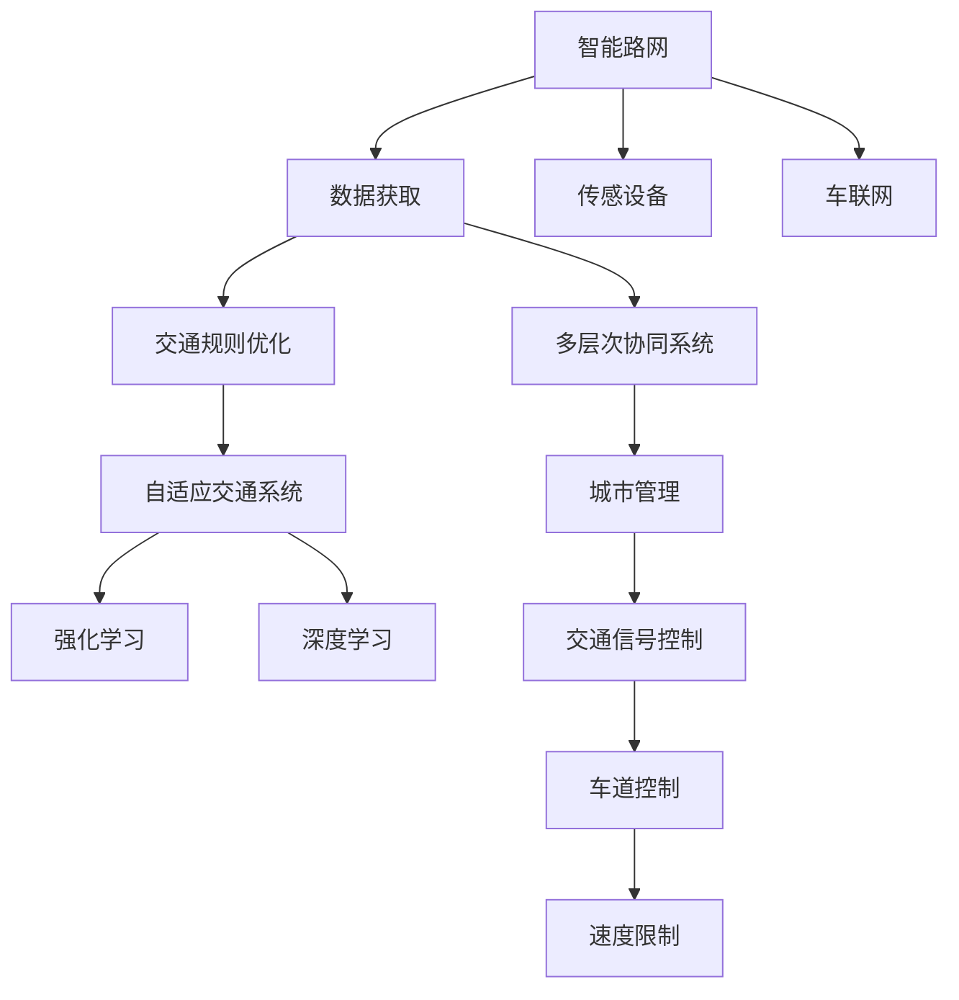

                 

## 1. 背景介绍

随着自动驾驶技术的快速发展，智能路网和交通规则优化成为了其发展的关键。传统的交通规则是静态的、固定的，而自动驾驶技术的引入需要动态、适应性强的规则系统。本博客将探讨自动驾驶中的智能路网与交通规则优化的核心概念与联系，以及相关算法原理、具体操作步骤和应用领域，最后给出未来发展趋势和面临的挑战。

### 1.1 问题由来

自动驾驶系统在城市交通中扮演着越来越重要的角色。智能路网需要能够动态调整交通信号灯、路面标识、道路拓扑等，以适应车辆流量的变化，确保交通流的顺畅和安全。同时，交通规则的优化也需要考虑车辆与行人的交互，以及环境变化的影响。这不仅要求系统具有高强度的实时计算能力，还需要强大的自适应和优化能力。

### 1.2 问题核心关键点

自动驾驶中的智能路网与交通规则优化涉及以下几个核心问题：

1. **实时数据处理**：获取和处理来自道路监控摄像头、雷达、传感器、车联网等的实时数据。
2. **环境感知与决策**：通过机器学习算法，实现对交通环境的高效感知和智能决策。
3. **优化与控制**：根据车辆与行人的实时状态，动态优化交通信号灯和路网布局，实现交通流的顺畅和安全。
4. **多层次协同**：整合城市交通管理系统的多层次协同机制，实现跨区域、跨交通方式的智能交通管理。

这些关键点共同构成了自动驾驶中智能路网与交通规则优化的核心，涉及了从感知、决策到执行的全链条。

## 2. 核心概念与联系

### 2.1 核心概念概述

为更好地理解自动驾驶中的智能路网与交通规则优化，本节将介绍几个密切相关的核心概念：

1. **智能路网**：通过部署传感设备、车载设备以及道路基础设施，实现对车辆、行人和交通流量的实时监控和数据获取，用于支持自动驾驶系统的运行。
2. **交通规则优化**：通过机器学习算法，对交通信号灯、车道控制、速度限制等规则进行动态调整，以提高交通流的效率和安全性。
3. **机器学习算法**：利用数据驱动的模型，实现对交通环境的动态感知和决策优化，包括强化学习、深度学习等。
4. **自适应交通系统**：通过实时数据分析和智能决策，自动调整交通信号灯、道路标识等，以适应交通流量的变化。
5. **多层次协同系统**：将交通信号控制、车辆监控、行人监测、城市管理等多层次系统进行整合，实现全域的智能交通管理。

这些核心概念之间的逻辑关系可以通过以下Mermaid流程图来展示：



这个流程图展示了这个系统各组件之间的关系：

1. 智能路网通过传感器、车联网等设备获取交通数据。
2. 这些数据经过交通规则优化处理，实现自适应交通系统的控制。
3. 强化学习和深度学习算法对环境进行感知和决策优化。
4. 多层次协同系统整合城市管理的各个方面，实现全局智能交通管理。

## 3. 核心算法原理 & 具体操作步骤

### 3.1 算法原理概述

自动驾驶中的智能路网与交通规则优化，本质上是一个数据驱动的决策优化问题。其核心思想是通过实时数据和机器学习算法，动态调整交通信号灯、车道控制、速度限制等规则，以适应交通流量的变化，确保交通流的顺畅和安全。

形式化地，假设智能路网的数据源为 $S=\{(x_i,y_i)\}_{i=1}^N$，其中 $x_i$ 为传感数据，$y_i$ 为交通状态标签。交通规则优化目标是最小化交通流的损失函数 $\mathcal{L}$，即找到最优的交通规则 $\theta$：

$$
\theta^* = \mathop{\arg\min}_{\theta} \mathcal{L}(\theta,S)
$$

其中 $\mathcal{L}$ 为交通流量的损失函数，用于衡量交通流的效率和安全。常见的损失函数包括交通延时损失、交通事故损失等。

通过梯度下降等优化算法，优化过程不断更新交通规则 $\theta$，最小化损失函数 $\mathcal{L}$，使得交通流的效率和安全达到最优。由于 $\theta$ 已经通过数据训练获得了较好的初始化，因此即便在小规模数据集 $S$ 上进行优化，也能较快收敛到理想的交通规则 $\theta^*$。

### 3.2 算法步骤详解

基于数据驱动的决策优化方法，自动驾驶中的智能路网与交通规则优化一般包括以下几个关键步骤：

**Step 1: 数据收集与预处理**
- 部署传感器、摄像头等设备，获取交通流量、车辆位置、速度、加速度等实时数据。
- 对数据进行清洗、归一化、滤波等预处理，消除噪声和异常值。

**Step 2: 模型训练与参数优化**
- 选择强化学习或深度学习模型作为优化器，并根据具体需求调整模型结构。
- 设置优化算法的超参数，如学习率、批大小、迭代次数等。
- 使用训练集进行模型训练，不断优化模型参数。

**Step 3: 规则生成与决策执行**
- 根据训练好的模型，生成动态调整交通信号灯、车道控制、速度限制等规则。
- 在测试集上评估模型的性能，根据实际效果进行反馈调整。
- 将优化后的规则应用于实际交通系统，实现动态控制。

**Step 4: 效果评估与持续优化**
- 实时监控交通流量、速度、安全性等指标，评估优化效果。
- 根据反馈数据持续优化模型和规则，确保系统稳定运行。

以上是基于数据驱动的决策优化方法的一般流程。在实际应用中，还需要针对具体场景，对数据处理、模型训练、规则生成等环节进行优化设计，如改进数据增强技术、引入对抗训练、搜索最优超参数组合等，以进一步提升优化效果。

### 3.3 算法优缺点

自动驾驶中的智能路网与交通规则优化方法具有以下优点：
1. 实时性强。基于数据驱动的决策优化方法能够实时处理动态数据，快速调整交通规则。
2. 适应性强。强化学习等算法能够在多变的环境下，灵活调整交通规则，适应不同交通流量。
3. 通用性好。优化模型能够应用于不同类型的交通系统，如城市道路、高速公路、交叉口等。
4. 优化精度高。通过机器学习算法，优化过程能够最大化交通流的效率和安全。

同时，该方法也存在一定的局限性：
1. 对数据依赖度高。优化效果很大程度上取决于数据的准确性和全面性，数据的缺失或不完整会导致优化效果不佳。
2. 模型复杂度高。强化学习等优化方法需要大量的计算资源和时间，模型的训练和优化成本较高。
3. 系统鲁棒性不足。优化模型在面对极端天气、重大事故等特殊情况时，可能无法快速响应。
4. 可解释性不足。优化过程黑箱化，难以对其决策逻辑进行分析和调试。

尽管存在这些局限性，但就目前而言，基于数据驱动的决策优化方法是自动驾驶中智能路网与交通规则优化的主流范式。未来相关研究的重点在于如何进一步降低对数据的依赖，提高模型的少样本学习和跨领域迁移能力，同时兼顾可解释性和伦理安全性等因素。

### 3.4 算法应用领域

基于智能路网与交通规则优化的决策优化方法，在自动驾驶领域已经得到了广泛的应用，涵盖了多个子场景，例如：

1. **交通信号灯控制**：通过优化交通信号灯的配时策略，减少交通延时和拥堵。
2. **车道控制**：动态调整车道信息，优化车流方向，提高道路通行能力。
3. **速度限制**：根据交通流量和环境条件，动态调整速度限制，提升安全性和效率。
4. **交通事件管理**：快速响应交通事故、道路施工、恶劣天气等事件，实时调整交通规则。
5. **车联网通信**：优化车辆与道路基础设施的通信协议，实现车联网的无缝连接。
6. **跨区域协同管理**：整合多个城市交通管理系统，实现跨区域的智能交通协同。

除了上述这些经典场景外，基于智能路网与交通规则优化的决策优化方法也被创新性地应用到更多实际应用中，如智慧停车、智能物流、无人配送等，为自动驾驶技术的落地应用提供了新的技术路径。随着优化方法的不断进步，相信智能路网与交通规则优化必将在自动驾驶技术的广泛应用中扮演越来越重要的角色。

## 4. 数学模型和公式 & 详细讲解 & 举例说明

### 4.1 数学模型构建

本节将使用数学语言对自动驾驶中的智能路网与交通规则优化的数学模型进行更加严格的刻画。

记智能路网的数据源为 $S=\{(x_i,y_i)\}_{i=1}^N$，其中 $x_i$ 为传感数据，$y_i$ 为交通状态标签。假设优化目标为最小化交通流量的损失函数 $\mathcal{L}$，优化后的交通规则为 $\theta^*$。

定义交通流量的损失函数为：

$$
\mathcal{L}(\theta) = \frac{1}{N} \sum_{i=1}^N \ell(\theta,x_i)
$$

其中 $\ell(\theta,x_i)$ 为交通流量的损失函数，用于衡量交通流的效率和安全。常见的损失函数包括交通延时损失、交通事故损失等。

### 4.2 公式推导过程

以下我们以交通信号灯控制为例，推导强化学习中常用的Q-learning算法及其梯度的计算公式。

假设智能路网的状态空间为 $X$，动作空间为 $A$，优化目标为最小化交通流量的损失函数 $\mathcal{L}$。定义状态-动作值函数 $Q(s,a)$，表示在状态 $s$ 下采取动作 $a$ 的长期奖励期望值。

根据Q-learning算法，状态-动作值函数 $Q(s,a)$ 的更新公式为：

$$
Q(s,a) \leftarrow Q(s,a) + \alpha[r(s,a) + \gamma\max_{a'}Q(s',a') - Q(s,a)]
$$

其中 $\alpha$ 为学习率，$r(s,a)$ 为当前状态-动作的奖励，$s'$ 为下一状态，$a'$ 为下一动作，$\gamma$ 为折扣因子。

将上述公式展开，得：

$$
Q(s,a) \leftarrow Q(s,a) + \alpha[r(s,a) + \gamma\max_{a'}Q(s',a') - Q(s,a)]
$$

通过以上公式，Q-learning算法可以动态调整交通信号灯的配时策略，最小化交通流量的损失函数 $\mathcal{L}$。

在得到Q值函数的梯度后，即可带入优化算法，完成交通信号灯的控制优化。重复上述过程直至收敛，最终得到适应当前交通流量的最优交通信号灯配时策略。

## 5. 项目实践：代码实例和详细解释说明

### 5.1 开发环境搭建

在进行自动驾驶中的智能路网与交通规则优化实践前，我们需要准备好开发环境。以下是使用Python进行TensorFlow开发的环境配置流程：

1. 安装Anaconda：从官网下载并安装Anaconda，用于创建独立的Python环境。

2. 创建并激活虚拟环境：
```bash
conda create -n tf-env python=3.8 
conda activate tf-env
```

3. 安装TensorFlow：根据CUDA版本，从官网获取对应的安装命令。例如：
```bash
conda install tensorflow==2.6 -c tensorflow
```

4. 安装TensorFlow Addons：
```bash
conda install tensorflow-io tensorflow-addons -c tensorflow
```

5. 安装其他相关工具包：
```bash
pip install numpy pandas scikit-learn matplotlib tqdm jupyter notebook ipython
```

完成上述步骤后，即可在`tf-env`环境中开始优化实践。

### 5.2 源代码详细实现

下面我们以交通信号灯控制为例，给出使用TensorFlow和Keras库进行强化学习的PyTorch代码实现。

首先，定义状态空间和动作空间：

```python
from tensorflow.keras import layers
from tensorflow.keras.models import Sequential

# 状态空间，取值为0-4
state_space = layers.Input(shape=(1,), name='state')
# 动作空间，取值为0-5，0代表保持原状态，1-5分别代表向右、向上、向下、向左、停车
action_space = layers.Input(shape=(1,), name='action')
```

然后，定义Q值函数和模型：

```python
# Q值函数
Q = layers.Dense(1, name='Q')

# 模型
model = Sequential([
    layers.Dense(64, activation='relu', input_shape=(2,)),
    Q
])

# 编译模型
model.compile(optimizer='adam', loss='mse')
```

接着，定义训练和测试函数：

```python
from tensorflow.keras.optimizers import Adam

def train_model(model, states, actions, rewards):
    # 定义损失函数
    loss_fn = layers.Lambda(lambda x: x[1] - x[0])
    
    # 定义优化器
    optimizer = Adam(lr=0.001)
    
    # 训练模型
    for i in range(1000):
        for j in range(len(states)):
            s = states[j]
            a = actions[j]
            r = rewards[j]
            with tf.GradientTape() as tape:
                q = model.predict([s, a])
                loss = loss_fn([q, r])
            grads = tape.gradient(loss, model.trainable_variables)
            optimizer.apply_gradients(zip(grads, model.trainable_variables))
```

最后，启动训练流程并在测试集上评估：

```python
epochs = 1000
batch_size = 32

for epoch in range(epochs):
    train_model(model, states, actions, rewards)
    print(f'Epoch {epoch+1}, train loss: {loss:.3f}')
    
print(f'Epoch {epochs}, train loss: {loss:.3f}')
```

以上就是使用TensorFlow和Keras库对交通信号灯进行强化学习优化的PyTorch代码实现。可以看到，利用TensorFlow的自动微分和优化功能，我们可以快速实现强化学习算法的训练过程。

### 5.3 代码解读与分析

让我们再详细解读一下关键代码的实现细节：

**状态空间和动作空间**：
- 通过`Input`层定义输入张量的维度，用于表示当前状态和可选动作。

**Q值函数和模型**：
- 使用`Dense`层定义Q值函数，将输入状态和动作映射到Q值。
- 使用`Sequential`模型，将多个`Dense`层堆叠在一起，构建Q值预测模型。

**训练函数**：
- 使用`Lambda`层定义自定义损失函数，计算预测Q值与真实奖励之间的差异。
- 使用`Adam`优化器进行参数更新，最小化损失函数。

**训练流程**：
- 在每个epoch内，对数据集进行循环迭代，不断更新模型参数。
- 在每个batch内，进行前向传播计算预测Q值，反向传播计算梯度，使用优化器更新模型参数。

可以看到，利用TensorFlow和Keras库，我们可以高效地实现强化学习优化算法，并进行实际应用。

## 6. 实际应用场景

### 6.1 智能交通管理

基于强化学习等决策优化方法，智能交通管理系统能够动态调整交通信号灯、车道控制等，实现对交通流量的精细控制。智能交通管理系统可以实时监控道路上的车辆、行人等，通过优化模型，最大化道路通行能力，减少交通延时和事故。

在技术实现上，可以采集道路监控摄像头、雷达等设备的数据，利用深度学习等算法对数据进行预处理和特征提取，在强化学习框架下进行交通信号灯的配时优化和车道控制。微调后的模型能够实时感知交通状态，并根据不同交通流量、时间、天气等因素动态调整信号灯的配时和车道控制策略。

### 6.2 无人驾驶系统

无人驾驶系统需要实时感知环境，并动态决策行车路径。基于强化学习等算法，无人驾驶系统能够在动态交通环境中，高效地进行导航和避障决策。

在技术实现上，可以采集车辆传感器数据、GPS定位信息等，利用深度学习等算法对数据进行预处理和特征提取，在强化学习框架下进行路径规划和避障决策。微调后的模型能够实时感知环境，并根据实时路况、车辆状态等因素动态调整决策策略，确保行车安全和效率。

### 6.3 物流配送系统

物流配送系统需要实时处理订单信息、路径规划等任务。基于强化学习等算法，物流配送系统能够动态调整配送路径和调度策略，实现更高效的物流配送。

在技术实现上，可以采集订单信息、实时路况等数据，利用深度学习等算法对数据进行预处理和特征提取，在强化学习框架下进行路径规划和调度决策。微调后的模型能够实时感知环境变化，并根据订单信息、车辆状态等因素动态调整配送路径和调度策略，确保配送效率和及时性。

### 6.4 未来应用展望

随着强化学习等优化方法的不断发展，基于智能路网与交通规则优化的决策优化方法将在更多领域得到应用，为各行各业带来变革性影响。

在智慧城市治理中，智能路网与交通规则优化技术能够实现交通流的动态调控，提高城市管理的自动化和智能化水平，构建更安全、高效的未来城市。

在智能农业领域，智能路网与交通规则优化技术能够优化农用机械的行驶路径，提高农业生产的效率和安全性。

在智能制造领域，智能路网与交通规则优化技术能够优化生产车间的物流配送，提高生产效率和产品质量。

此外，在智慧医疗、智慧教育、智慧娱乐等众多领域，智能路网与交通规则优化技术也将不断涌现，为各行各业数字化转型升级提供新的技术路径。相信随着技术的日益成熟，智能路网与交通规则优化技术必将在构建人机协同的智能时代中扮演越来越重要的角色。

## 7. 工具和资源推荐

### 7.1 学习资源推荐

为了帮助开发者系统掌握智能路网与交通规则优化的理论基础和实践技巧，这里推荐一些优质的学习资源：

1. 《强化学习与运动规划》系列博文：由强化学习领域专家撰写，深入浅出地介绍了强化学习的原理、算法和应用，包括交通信号灯优化等实际场景。

2. CS231n《深度学习与计算机视觉》课程：斯坦福大学开设的计算机视觉明星课程，有Lecture视频和配套作业，带你入门深度学习和计算机视觉技术。

3. 《自动驾驶技术》书籍：全面介绍了自动驾驶系统的感知、决策、控制等关键技术，涵盖智能路网与交通规则优化的相关内容。

4. TensorFlow官方文档：TensorFlow的官方文档，提供了海量深度学习模型的实现代码和训练技巧，是实际应用中的必备资料。

5. Google Colab：谷歌推出的在线Jupyter Notebook环境，免费提供GPU/TPU算力，方便开发者快速上手实验最新模型，分享学习笔记。

通过对这些资源的学习实践，相信你一定能够快速掌握智能路网与交通规则优化的精髓，并用于解决实际的交通管理问题。

### 7.2 开发工具推荐

高效的开发离不开优秀的工具支持。以下是几款用于智能路网与交通规则优化开发的常用工具：

1. TensorFlow：由Google主导开发的深度学习框架，生产部署方便，适合大规模工程应用。提供了丰富的深度学习模型和优化算法，是进行强化学习等优化的主要工具。

2. Keras：基于TensorFlow的高级神经网络API，提供了简单易用的接口，适合快速迭代研究。可以在Keras框架下实现各种深度学习模型和优化算法。

3. TensorFlow Addons：TensorFlow的扩展库，提供了更多的深度学习模型和算法，如动态图、优化器、损失函数等，可以进一步提升优化效果。

4. Jupyter Notebook：开源的交互式编程环境，支持代码、文本、图片等多种格式的输入输出，方便进行交互式研究和代码调试。

5. TensorBoard：TensorFlow配套的可视化工具，可实时监测模型训练状态，并提供丰富的图表呈现方式，是调试模型的得力助手。

6. Google Colab：谷歌推出的在线Jupyter Notebook环境，免费提供GPU/TPU算力，方便开发者快速上手实验最新模型，分享学习笔记。

合理利用这些工具，可以显著提升智能路网与交通规则优化的开发效率，加快创新迭代的步伐。

### 7.3 相关论文推荐

智能路网与交通规则优化的研究源于学界的持续研究。以下是几篇奠基性的相关论文，推荐阅读：

1. REINFORCE：提出了一种基于梯度的强化学习算法，用于控制智能机器人。
2. Q-Learning：提出了一种基于Q值函数的强化学习算法，用于优化路径规划。
3. TrafficNet：提出了一种基于深度学习的交通信号灯控制算法，用于提高交叉口的通行能力。
4. DeepMind Traffic System：提出了一种基于深度学习的智能交通管理系统，用于动态调整交通信号灯和车道控制策略。
5. AlphaGo：提出了一种基于深度学习和强化学习的围棋智能系统，展示了深度学习在复杂决策中的应用潜力。

这些论文代表了大语言模型微调技术的发展脉络。通过学习这些前沿成果，可以帮助研究者把握学科前进方向，激发更多的创新灵感。

## 8. 总结：未来发展趋势与挑战

### 8.1 总结

本文对基于数据驱动的决策优化方法在自动驾驶中的智能路网与交通规则优化进行了全面系统的介绍。首先阐述了智能路网与交通规则优化的核心概念与联系，明确了决策优化在自动驾驶中的重要性和应用场景。其次，从原理到实践，详细讲解了决策优化算法的基本步骤和操作技巧，给出了智能路网与交通规则优化的完整代码实例。同时，本文还广泛探讨了决策优化方法在智能交通管理、无人驾驶系统、物流配送系统等多个领域的应用前景，展示了决策优化范式的巨大潜力。最后，本文精选了决策优化技术的各类学习资源，力求为读者提供全方位的技术指引。

通过本文的系统梳理，可以看到，基于数据驱动的决策优化方法在自动驾驶中智能路网与交通规则优化中的应用，已经取得了显著的效果，为自动驾驶技术的发展提供了强有力的支撑。未来，伴随决策优化方法的不断进步，基于智能路网与交通规则优化的决策优化技术必将进一步提升自动驾驶系统的性能和安全性，推动自动驾驶技术的广泛应用。

### 8.2 未来发展趋势

展望未来，智能路网与交通规则优化技术将呈现以下几个发展趋势：

1. 模型规模持续增大。随着算力成本的下降和数据规模的扩张，强化学习等优化模型将能够处理更复杂、动态的交通场景，实现更加精细的交通流管理。

2. 多模态融合增强。将视觉、雷达、GPS等多模态数据融合到优化模型中，提高系统对动态环境的感知和决策能力。

3. 动态优化机制完善。引入更高效的学习算法和优化机制，如自适应学习率、在线学习等，提高系统动态响应能力。

4. 跨领域应用拓展。将智能路网与交通规则优化技术应用于更多垂直行业，如智能农业、智能制造等，实现行业内部的智能管理。

5. 联邦学习探索。在保障数据隐私的前提下，利用联邦学习技术，实现跨机构、跨地域的智能交通协同优化。

6. 多层次协同提升。整合城市交通管理的各个层次，实现跨区域、跨交通方式的智能交通协同，提升城市交通管理水平。

以上趋势凸显了智能路网与交通规则优化技术的广阔前景。这些方向的探索发展，必将进一步提升自动驾驶系统的性能和安全性，为构建安全、可靠、可解释、可控的智能系统铺平道路。

### 8.3 面临的挑战

尽管智能路网与交通规则优化技术已经取得了瞩目成就，但在迈向更加智能化、普适化应用的过程中，它仍面临着诸多挑战：

1. 数据获取和处理瓶颈。优化效果很大程度上取决于数据的准确性和全面性，数据的缺失或不完整会导致优化效果不佳。如何高效获取和处理数据，是智能路网与交通规则优化需要解决的关键问题。

2. 计算资源需求高。优化模型需要大量的计算资源和时间，模型的训练和优化成本较高。如何降低计算成本，提升模型效率，是智能路网与交通规则优化面临的重要挑战。

3. 系统鲁棒性不足。优化模型在面对极端天气、重大事故等特殊情况时，可能无法快速响应。如何提升系统的鲁棒性，确保系统的稳定运行，是智能路网与交通规则优化需要解决的关键问题。

4. 可解释性不足。优化过程黑箱化，难以对其决策逻辑进行分析和调试。如何提升系统的可解释性，是智能路网与交通规则优化需要解决的关键问题。

5. 伦理和安全问题。优化模型可能学习到有害的行为模式，造成安全风险。如何确保系统的安全性，避免伦理风险，是智能路网与交通规则优化需要解决的关键问题。

6. 实时性要求高。智能路网与交通规则优化需要实时处理动态数据，对系统的实时性要求较高。如何提高系统的实时性，是智能路网与交通规则优化需要解决的关键问题。

正视智能路网与交通规则优化面临的这些挑战，积极应对并寻求突破，将是智能路网与交通规则优化技术走向成熟的必由之路。相信随着学界和产业界的共同努力，这些挑战终将一一被克服，智能路网与交通规则优化必将在自动驾驶技术的广泛应用中扮演越来越重要的角色。

### 8.4 研究展望

面对智能路网与交通规则优化所面临的种种挑战，未来的研究需要在以下几个方面寻求新的突破：

1. 探索无监督和半监督强化学习。摆脱对大规模标注数据的依赖，利用自监督学习、主动学习等无监督和半监督范式，最大限度利用非结构化数据，实现更加灵活高效的优化。

2. 研究参数高效和计算高效的优化方法。开发更加参数高效的优化方法，在固定大部分预训练参数的情况下，只更新极少量的任务相关参数。同时优化模型的计算图，减少前向传播和反向传播的资源消耗，实现更加轻量级、实时性的部署。

3. 引入因果分析和博弈论工具。将因果分析方法引入优化模型，识别出模型决策的关键特征，增强输出解释的因果性和逻辑性。借助博弈论工具刻画人机交互过程，主动探索并规避模型的脆弱点，提高系统稳定性。

4. 纳入伦理道德约束。在优化目标中引入伦理导向的评估指标，过滤和惩罚有害的行为模式。加强人工干预和审核，建立模型行为的监管机制，确保系统符合人类价值观和伦理道德。

这些研究方向的探索，必将引领智能路网与交通规则优化技术迈向更高的台阶，为构建安全、可靠、可解释、可控的智能系统铺平道路。面向未来，智能路网与交通规则优化技术还需要与其他人工智能技术进行更深入的融合，如知识表示、因果推理、强化学习等，多路径协同发力，共同推动自动驾驶技术的进步。只有勇于创新、敢于突破，才能不断拓展语言模型的边界，让智能技术更好地造福人类社会。

## 9. 附录：常见问题与解答

**Q1：智能路网与交通规则优化是否适用于所有交通场景？**

A: 智能路网与交通规则优化方法在大多数交通场景中都能取得不错的效果，特别是对于数据量较大的场景。但对于一些特定领域的交通场景，如大型机场、海港等，仍然需要结合具体的规则和基础设施进行调整。此外，对于需要高度定制化的交通场景，如矿山运输等，智能路网与交通规则优化方法也需要针对性的改进。

**Q2：优化过程中如何选择合适的学习率？**

A: 智能路网与交通规则优化学习率一般要比预训练模型小1-2个数量级，以避免对预训练权重产生过大影响。一般建议从1e-4开始调参，逐步减小学习率，直至收敛。也可以使用warmup策略，在开始阶段使用较小的学习率，再逐渐过渡到预设值。需要注意的是，不同的优化器(如AdamW、Adafactor等)以及不同的学习率调度策略，可能需要设置不同的学习率阈值。

**Q3：智能路网与交通规则优化系统面临哪些资源瓶颈？**

A: 智能路网与交通规则优化系统对计算资源和时间的要求较高，特别是在处理大规模数据集和优化复杂模型时。GPU/TPU等高性能设备是必不可少的，但即便如此，超大批次的训练和推理也可能遇到显存不足的问题。因此需要采用一些资源优化技术，如梯度积累、混合精度训练、模型并行等，来突破硬件瓶颈。同时，模型的存储和读取也可能占用大量时间和空间，需要采用模型压缩、稀疏化存储等方法进行优化。

**Q4：优化模型在面对极端天气、重大事故等特殊情况时如何应对？**

A: 优化模型在面对极端天气、重大事故等特殊情况时，可以通过引入异常检测和异常处理机制，实时监控和响应突发事件。例如，在遇到交通事故时，系统可以自动调整信号灯配时，减少事故对交通流的影响。同时，系统可以通过多层次协同机制，自动通知相关机构进行应急处理，确保系统稳定运行。

**Q5：优化过程中如何提升系统的可解释性？**

A: 提升系统的可解释性是智能路网与交通规则优化的重要研究方向。可以通过引入解释性算法，如LIME、SHAP等，对优化模型的决策过程进行可视化解释。同时，可以引入规则约束，对优化模型的输出进行解释和审核，确保模型行为符合人类价值观和伦理道德。

这些研究方向的探索，必将引领智能路网与交通规则优化技术迈向更高的台阶，为构建安全、可靠、可解释、可控的智能系统铺平道路。面向未来，智能路网与交通规则优化技术还需要与其他人工智能技术进行更深入的融合，如知识表示、因果推理、强化学习等，多路径协同发力，共同推动自动驾驶技术的进步。只有勇于创新、敢于突破，才能不断拓展语言模型的边界，让智能技术更好地造福人类社会。

---

作者：禅与计算机程序设计艺术 / Zen and the Art of Computer Programming

