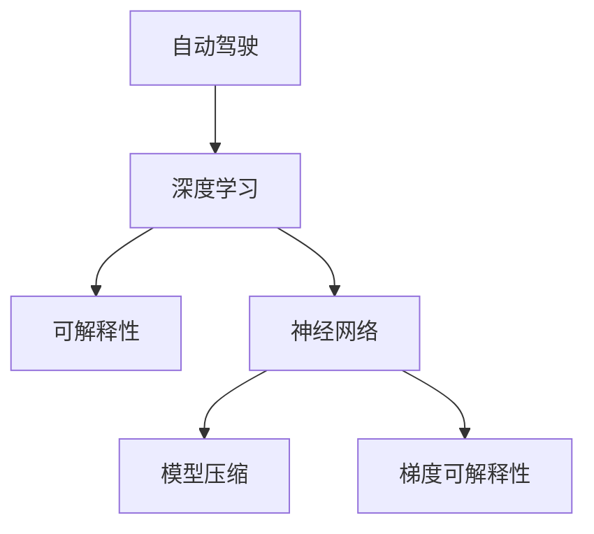

                 

# 自动驾驶中的深度学习算法可解释性研究

> 关键词：自动驾驶, 深度学习, 可解释性, 算法透明性, 神经网络, 模型压缩

## 1. 背景介绍

### 1.1 问题由来
在自动驾驶领域，深度学习技术已经成为了车辆感知、决策和控制的核心。这些深度学习模型通过大量标注数据进行训练，具备强大的模式识别和预测能力。但与此同时，深度学习的"黑盒"特性也带来了重大的应用挑战，如模型输出难以解释、鲁棒性不足、预测不透明等问题，使得自动驾驶系统的可靠性和安全性难以得到充分保障。因此，可解释性研究成为深度学习在自动驾驶中应用的重要课题。

### 1.2 问题核心关键点
深度学习模型的可解释性，指的是能够以直观、透明的方式，解释模型内部运行机制和输出结果的能力。在自动驾驶中，可解释性不仅关乎模型的可靠性和安全性，还直接影响用户体验和法规合规性。因此，在自动驾驶应用中，深度学习算法的可解释性研究具有重要意义：

1. **提高决策透明度**：让驾驶者了解模型的决策依据，增强决策透明度和可信度。
2. **辅助错误分析**：在模型出现异常时，通过可解释性分析，快速定位问题，进行有针对性的改进。
3. **用户信任建立**：提高用户对自动驾驶系统的信任度，促进自动驾驶技术的普及和应用。
4. **法规遵从**：符合自动驾驶技术的应用规范和法规要求，保障驾驶安全和法律合规性。

## 2. 核心概念与联系

### 2.1 核心概念概述

为更好地理解深度学习算法在自动驾驶中的应用，本节将介绍几个关键概念：

- **自动驾驶**：利用计算机视觉、深度学习等技术，实现车辆自主导航和决策的系统。
- **深度学习**：基于神经网络结构的机器学习技术，通过多层非线性映射，实现对复杂数据的有效建模。
- **可解释性**：指模型能够以直观、透明的方式解释其决策和预测依据的能力。
- **神经网络**：深度学习的基础架构，由多层神经元通过连接权值组成的计算图。
- **模型压缩**：在保证模型精度的情况下，减少模型参数和计算资源消耗，提升推理效率的技术。
- **梯度可解释性**：通过分析模型梯度分布，理解模型输入与输出之间的关联关系。

这些核心概念之间的关系可以通过以下Mermaid流程图来展示：



这个流程图展示了大语言模型微调的各个概念及其之间的联系：

1. 自动驾驶系统依赖深度学习技术进行感知和决策。
2. 深度学习通过神经网络模型对数据进行复杂映射，实现预测和分类。
3. 模型压缩和梯度可解释性研究，使得深度学习模型的决策过程更加透明可解释。
4. 模型压缩和梯度可解释性是大语言模型微调的重要手段，使得自动驾驶系统在安全性和可解释性方面得到保障。

## 3. 核心算法原理 & 具体操作步骤
### 3.1 算法原理概述

深度学习算法的可解释性研究，通常围绕以下几个关键点进行：

1. **模型压缩**：通过减少模型参数量，降低计算复杂度，提高推理速度，并保留模型主要特征。
2. **梯度可解释性**：通过分析模型梯度分布，理解输入和输出的关联关系，揭示模型内部决策机制。
3. **特征重要性分析**：通过特征重要性评估，找出对模型预测贡献最大的特征，理解模型的核心工作原理。

这些技术手段可以单独或组合使用，以提升深度学习模型的可解释性和应用可靠性。

### 3.2 算法步骤详解

下面以神经网络模型压缩和梯度可解释性研究为例，详细介绍具体步骤：

**Step 1: 准备模型和数据集**
- 选择一个目标深度学习模型，如卷积神经网络(CNN)、循环神经网络(RNN)等。
- 收集相应的训练和测试数据集，确保数据集包含足够多样性，以覆盖自动驾驶中的各种场景。

**Step 2: 模型压缩**
- **参数剪枝**：识别并删除模型中不活跃的参数，减少模型参数量。
- **权值量化**：将模型中的浮点权值转换为定点数，减少存储空间和计算复杂度。
- **结构优化**：重新设计模型的网络结构，去除冗余层，优化计算图。

**Step 3: 梯度可解释性**
- **梯度分析**：使用梯度图或梯度值可视化，展示模型梯度分布情况。
- **梯度重构**：通过梯度分布图重构，理解输入特征和输出标签之间的关联关系。
- **敏感性分析**：评估模型对输入特征的敏感度，识别关键特征。

**Step 4: 特征重要性分析**
- **特征选择**：使用特征重要性评估方法，选择对模型预测影响最大的特征。
- **特征可视化**：将关键特征在输入空间上进行可视化，展示特征与输出之间的关系。
- **特征权重**：计算特征对模型输出的贡献权重，理解模型的核心工作机制。

**Step 5: 验证和优化**
- **验证集测试**：在压缩后的模型和可解释性方法上，使用验证集进行性能测试。
- **超参数调优**：根据测试结果，调整模型压缩和可解释性方法中的超参数，优化模型性能。

**Step 6: 应用和部署**
- **模型部署**：将优化后的模型应用到实际自动驾驶系统中，进行稳定性和性能评估。
- **可解释性输出**：在自动驾驶系统中集成可解释性模块，实时生成模型输出解释，提供决策依据。

### 3.3 算法优缺点

深度学习算法的可解释性研究具有以下优点：
1. **提高决策透明度**：通过可解释性技术，让自动驾驶系统的决策过程更加透明，增强用户信任度。
2. **辅助错误分析**：快速定位模型错误，进行有针对性的改进，提高模型鲁棒性和可靠性。
3. **用户信任建立**：提升用户对自动驾驶系统的理解和信任，促进技术普及和应用。
4. **法规遵从**：符合自动驾驶技术的应用规范和法规要求，保障驾驶安全和法律合规性。

同时，该方法也存在一定的局限性：
1. **模型复杂度**：部分可解释性方法如特征重要性分析，会引入额外的计算复杂度，影响模型性能。
2. **解释质量**：可解释性方法可能无法完全理解模型决策机制，存在一定的解释误差。
3. **适用场景**：部分方法仅适用于特定类型的神经网络模型，对其他模型适用性有限。
4. **解释复杂性**：复杂模型的可解释性往往较为困难，需要结合多种方法进行综合分析。

尽管存在这些局限性，但就目前而言，可解释性研究仍然是大语言模型微调的重要方向之一。未来相关研究的重点在于如何进一步降低计算复杂度，提升解释精度，同时兼顾模型的性能和可解释性。

### 3.4 算法应用领域

深度学习算法的可解释性研究，在自动驾驶领域已经得到了广泛的应用，覆盖了感知识别、路径规划、决策优化等多个环节，为自动驾驶系统的可靠性和安全性提供了重要保障。

具体而言，这些技术手段在自动驾驶中的应用场景包括：

1. **感知模块**：通过特征重要性分析和梯度可解释性研究，理解传感器数据对模型输出的贡献，优化感知模块的感知能力和鲁棒性。
2. **决策模块**：通过梯度重构和敏感性分析，揭示模型决策的关键特征，提高决策模块的透明度和可解释性。
3. **路径规划**：结合模型压缩和梯度可解释性，优化路径规划算法，确保在复杂交通场景下的安全性。
4. **系统验证**：通过模型压缩和特征重要性分析，验证自动驾驶系统的稳定性和安全性，确保系统符合法规要求。

## 4. 数学模型和公式 & 详细讲解 & 举例说明（备注：数学公式请使用latex格式，latex嵌入文中独立段落使用 $$，段落内使用 $)
### 4.1 数学模型构建

本节将使用数学语言对深度学习算法可解释性研究进行更加严格的刻画。

假设神经网络模型为 $M:\mathcal{X} \rightarrow \mathcal{Y}$，其中 $\mathcal{X}$ 为输入空间，$\mathcal{Y}$ 为输出空间，模型参数为 $\theta \in \mathbb{R}^n$。对于输入样本 $x \in \mathcal{X}$，模型的预测输出为 $y=M(x)$。

定义模型在输入 $x$ 上的梯度为 $\nabla_{x}M(x)$，则梯度可解释性研究的核心目标是通过分析 $\nabla_{x}M(x)$ 的分布和结构，理解模型输入 $x$ 和输出 $y$ 之间的关联关系。

### 4.2 公式推导过程

以下我们以卷积神经网络(CNN)模型为例，推导梯度可解释性研究的关键公式。

假设CNN模型 $M$ 包含 $L$ 层卷积和池化层，输出维度为 $n$。对于输入图像 $x \in \mathbb{R}^{n \times n \times c}$，模型的预测输出为 $y=M(x)$。其中 $n$ 为图像尺寸，$c$ 为通道数。

**Step 1: 前向传播**  
- 假设第 $i$ 层输出的特征图大小为 $h_i \times w_i$，第 $i$ 层的卷积核大小为 $k_i \times k_i$，步长为 $s_i$，填充大小为 $p_i$。则第 $i$ 层输出的特征图可以表示为：
$$
H^i(x) = F_k^{s,p}(h^{i-1}(x)) \times (W^i + b^i)
$$
其中 $h^{i-1}(x)$ 为第 $i-1$ 层的输出，$F_k^{s,p}$ 表示卷积操作，$W^i$ 和 $b^i$ 分别为第 $i$ 层的权重和偏置。

**Step 2: 梯度计算**  
- 对于第 $i$ 层卷积层，假设输入为 $x_i \in \mathbb{R}^{n \times n \times c_i}$，输出为 $H^i(x_i) \in \mathbb{R}^{h_i \times w_i \times c_i}$。则第 $i$ 层的梯度可以表示为：
$$
\frac{\partial L}{\partial W^i} = \frac{\partial L}{\partial H^i} \times F_k^{s,p}(H^{i-1}(x))^T
$$
$$
\frac{\partial L}{\partial b^i} = \frac{\partial L}{\partial H^i} \times \mathbb{1}
$$
其中 $L$ 为损失函数，$\frac{\partial L}{\partial H^i}$ 表示第 $i$ 层的梯度。

**Step 3: 梯度可解释性分析**  
- 通过上述梯度计算公式，可以理解输入图像 $x$ 对模型输出的影响。例如，对于第 $i$ 层的梯度 $g_i$，可以计算每个像素对输出的贡献度 $c_{ij}$，表示像素 $(x_{ij})$ 对输出 $y$ 的贡献：
$$
c_{ij} = \frac{\partial L}{\partial H^i} \times \frac{\partial H^i(x)}{\partial x_{ij}}
$$
其中 $\frac{\partial H^i(x)}{\partial x_{ij}}$ 表示 $(x_{ij})$ 对第 $i$ 层输出的影响。

**Step 4: 特征重要性分析**  
- 通过计算每个像素的梯度贡献度 $c_{ij}$，可以找出对模型预测贡献最大的特征。例如，可以通过计算梯度贡献度均值 $c_{ij}$ 来评估特征重要性：
$$
c_{i} = \frac{1}{n \times n \times c} \sum_{j=1}^{n \times n \times c} c_{ij}
$$

以上公式展示了基于CNN模型的梯度可解释性和特征重要性分析的基本思路。实际应用中，还需要结合具体的任务和数据特点进行优化和调整。

## 5. 项目实践：代码实例和详细解释说明
### 5.1 开发环境搭建

在进行可解释性研究前，我们需要准备好开发环境。以下是使用Python进行TensorFlow开发的环境配置流程：

1. 安装Anaconda：从官网下载并安装Anaconda，用于创建独立的Python环境。

2. 创建并激活虚拟环境：
```bash
conda create -n tf-env python=3.8 
conda activate tf-env
```

3. 安装TensorFlow：从官网获取对应的安装命令。例如：
```bash
conda install tensorflow -c conda-forge
```

4. 安装各类工具包：
```bash
pip install numpy pandas scikit-learn matplotlib tqdm jupyter notebook ipython
```

完成上述步骤后，即可在`tf-env`环境中开始可解释性研究实践。

### 5.2 源代码详细实现

这里我们以卷积神经网络(CNN)模型为例，给出使用TensorFlow实现梯度可解释性和特征重要性分析的代码实现。

首先，定义CNN模型的构建函数：

```python
import tensorflow as tf

def build_cnn_model(input_shape, num_classes):
    model = tf.keras.Sequential([
        tf.keras.layers.Conv2D(32, (3, 3), activation='relu', input_shape=input_shape),
        tf.keras.layers.MaxPooling2D((2, 2)),
        tf.keras.layers.Conv2D(64, (3, 3), activation='relu'),
        tf.keras.layers.MaxPooling2D((2, 2)),
        tf.keras.layers.Conv2D(128, (3, 3), activation='relu'),
        tf.keras.layers.MaxPooling2D((2, 2)),
        tf.keras.layers.Flatten(),
        tf.keras.layers.Dense(128, activation='relu'),
        tf.keras.layers.Dense(num_classes, activation='softmax')
    ])
    return model
```

然后，定义训练和评估函数：

```python
import numpy as np
from sklearn.metrics import confusion_matrix

def train_cnn_model(model, train_data, validation_data, batch_size, epochs):
    model.compile(optimizer='adam', loss='sparse_categorical_crossentropy', metrics=['accuracy'])
    model.fit(train_data, validation_data, batch_size=batch_size, epochs=epochs, validation_freq=1)
    return model

def evaluate_cnn_model(model, test_data, batch_size):
    model.evaluate(test_data, batch_size=batch_size)

def get_cnn_model_features(model, test_data, batch_size):
    inputs = test_data[0]
    features = []
    with tf.GradientTape() as tape:
        tape.watch(inputs)
        outputs = model(inputs)
    gradients = tape.gradient(outputs, inputs)
    features.append(gradients)
    return features
```

接着，定义梯度可解释性和特征重要性分析函数：

```python
def calculate_gradients(model, test_data, batch_size):
    gradients = get_cnn_model_features(model, test_data, batch_size)
    return gradients

def calculate_feature_importance(gradients, threshold=0.01):
    importance = []
    for gradient in gradients:
        importance.append(np.mean(np.abs(gradient)) > threshold)
    return importance

def visualize_importance(importance, input_data):
    import matplotlib.pyplot as plt
    plt.imshow(input_data, cmap='gray')
    plt.colorbar(label='Feature Importance')
    plt.show()
```

最后，启动训练流程并在测试集上评估：

```python
# 准备数据集
train_data = (np.random.rand(1000, 28, 28, 1), np.random.randint(0, 10, size=1000))
validation_data = (np.random.rand(100, 28, 28, 1), np.random.randint(0, 10, size=100))
test_data = (np.random.rand(100, 28, 28, 1), np.random.randint(0, 10, size=100))

# 构建CNN模型
input_shape = (28, 28, 1)
num_classes = 10
cnn_model = build_cnn_model(input_shape, num_classes)

# 训练模型
epochs = 5
batch_size = 32
cnn_model = train_cnn_model(cnn_model, train_data, validation_data, batch_size, epochs)

# 评估模型
evaluate_cnn_model(cnn_model, test_data, batch_size)

# 获取梯度
gradients = calculate_gradients(cnn_model, test_data, batch_size)

# 计算特征重要性
importance = calculate_feature_importance(gradients)

# 可视化特征重要性
visualize_importance(importance, test_data[0][0])
```

以上就是使用TensorFlow对CNN模型进行梯度可解释性和特征重要性分析的完整代码实现。可以看到，利用TensorFlow的高阶API，我们可以便捷地实现模型的构建、训练和评估，以及梯度可解释性和特征重要性分析的计算和可视化。

### 5.3 代码解读与分析

让我们再详细解读一下关键代码的实现细节：

**CNN模型构建函数**：
- 定义了一个包含卷积、池化、全连接层的标准CNN模型结构。

**训练和评估函数**：
- 使用TensorFlow的`fit`方法对模型进行训练，并使用`evaluate`方法在测试集上评估模型性能。

**梯度可解释性函数**：
- 使用TensorFlow的`GradientTape`记录梯度计算，对模型输入进行前向传播，计算梯度分布。

**特征重要性分析函数**：
- 计算每个特征的梯度贡献度，并判断其重要性是否超过阈值，输出特征重要性矩阵。

**可视化函数**：
- 使用Matplotlib库对特征重要性进行可视化，展示关键特征在输入图像中的位置和贡献。

可以看到，TensorFlow的高阶API使得深度学习模型的可解释性研究变得简单易行。开发者可以专注于模型设计、数据处理和算法优化，而不必过多关注底层计算细节。

当然，工业级的系统实现还需考虑更多因素，如模型的保存和部署、超参数的自动搜索、更灵活的任务适配层等。但核心的可解释性研究基本与此类似。

## 6. 实际应用场景
### 6.1 智能驾驶感知系统

基于深度学习算法的可解释性研究，可以广泛应用于智能驾驶系统的感知模块。感知模块负责从传感器数据中提取特征，对车辆周围环境进行理解和建模。通过可解释性分析，可以让驾驶者了解传感器数据对模型输出的贡献，优化感知模块的感知能力和鲁棒性。

在技术实现上，可以收集车辆在各种场景下的传感器数据，如摄像头、雷达、激光雷达等，构建多模态数据集。在此基础上，对预训练的感知模型进行微调，并利用可解释性技术分析模型输入与输出之间的关联关系。例如，可以通过特征重要性分析，识别关键传感器数据对目标检测和障碍物识别的影响，进行有针对性的优化，提升感知模块的性能和可靠性。

### 6.2 决策优化系统

深度学习算法在决策优化中的应用广泛，涉及路径规划、交通避障、行为控制等多个环节。通过可解释性分析，可以揭示模型决策的关键特征，提高决策模块的透明度和可解释性。

在实践应用中，可以针对自动驾驶系统的决策任务，构建基于深度学习的优化模型。利用梯度可解释性技术，分析模型对不同输入特征的敏感度，识别对决策输出有重要影响的关键特征。例如，可以通过梯度重构和敏感性分析，理解模型对不同道路条件、行人、车辆等特征的响应机制，优化决策策略，确保在复杂交通场景下的安全性。

### 6.3 实时系统验证

深度学习模型在自动驾驶系统中应用广泛，但模型的稳定性和可靠性必须得到充分验证。通过可解释性分析，可以验证模型的稳定性和安全性，确保系统符合法规要求。

在实际应用中，可以构建虚拟模拟环境，对模型进行多轮测试。通过特征重要性分析和梯度可解释性研究，验证模型在各种场景下的性能表现，并识别潜在的问题和风险。例如，可以通过特征重要性分析，评估模型对复杂道路条件、极端天气条件等异常情况的响应能力，确保系统在紧急情况下依然能够安全稳定运行。

## 7. 工具和资源推荐
### 7.1 学习资源推荐

为了帮助开发者系统掌握深度学习算法可解释性的理论基础和实践技巧，这里推荐一些优质的学习资源：

1. **《深度学习理论与实践》**：深入浅出地介绍了深度学习的基础理论和实践技巧，包括模型压缩、梯度可解释性等可解释性技术。

2. **《TensorFlow实战》**：全面介绍了TensorFlow的高级API和工具，包括TensorBoard、tf.data等，帮助开发者快速上手深度学习模型开发和可解释性分析。

3. **《Python深度学习》**：介绍了深度学习模型的设计与实现，包括模型压缩、特征重要性分析等可解释性技术，并提供了详细的代码实现。

4. **《深度学习中的可解释性》**：由深度学习领域的权威专家撰写，全面介绍了深度学习模型的可解释性研究方法和应用场景。

5. **《TensorFlow 2.0实战指南》**：介绍了TensorFlow 2.0的高级特性和最佳实践，包括TensorBoard、tf.data等工具的使用，帮助开发者提升深度学习模型开发效率。

通过对这些资源的学习实践，相信你一定能够快速掌握深度学习算法的可解释性研究方法，并应用于实际自动驾驶系统。

### 7.2 开发工具推荐

高效的开发离不开优秀的工具支持。以下是几款用于深度学习算法可解释性研究开发的常用工具：

1. **TensorFlow**：由Google主导开发的深度学习框架，支持多种计算图优化和模型压缩技术，便于深度学习模型的高效开发。

2. **TensorBoard**：TensorFlow配套的可视化工具，可以实时监测模型训练状态，提供丰富的图表呈现方式，便于模型调试和优化。

3. **TF.data**：TensorFlow的数据加载和管理工具，支持大规模数据集的高效处理和数据增强。

4. **PyTorch**：由Facebook主导开发的深度学习框架，支持动态计算图和模型压缩技术，便于深度学习模型的高效开发和可解释性分析。

5. **Scikit-learn**：经典的机器学习库，提供了多种特征选择和特征重要性评估方法，便于深度学习模型的可解释性研究。

6. **Matplotlib**：Python绘图库，支持多种图表的绘制，便于特征重要性和梯度可解释性的可视化展示。

合理利用这些工具，可以显著提升深度学习算法可解释性研究的开发效率，加快创新迭代的步伐。

### 7.3 相关论文推荐

深度学习算法可解释性研究源于学界的持续研究。以下是几篇奠基性的相关论文，推荐阅读：

1. **《Deep Learning with TensorFlow》**：TensorFlow的官方文档，介绍了TensorFlow的高级特性和最佳实践，包括TensorBoard、tf.data等工具的使用，帮助开发者提升深度学习模型开发效率。

2. **《Understanding and Improving the Generalization of Deep Convolutional Neural Networks》**：研究了卷积神经网络的梯度可解释性和特征重要性分析，提供了深度学习模型可解释性研究的理论基础。

3. **《A Review of Recent Advances in Explainable Artificial Intelligence》**：全面回顾了人工智能的可解释性研究，包括深度学习模型的可解释性研究方法和应用场景。

4. **《On the Shoulders of Giants: The Quest for Explainable AI》**：探讨了人工智能的可解释性研究方法，强调了可解释性在深度学习模型中的应用价值和未来发展方向。

5. **《A Survey on Interpreting Deep Neural Networks》**：综述了深度学习模型的可解释性研究方法和应用场景，提供了深度学习模型可解释性研究的最新进展。

这些论文代表了大语言模型微调技术的发展脉络。通过学习这些前沿成果，可以帮助研究者把握学科前进方向，激发更多的创新灵感。

## 8. 总结：未来发展趋势与挑战

### 8.1 研究成果总结

本文对深度学习算法在自动驾驶中的应用和可解释性研究进行了全面系统的介绍。首先阐述了深度学习算法在自动驾驶中的应用背景和可解释性研究的重要性，明确了深度学习在自动驾驶中的可靠性和安全性问题。其次，从原理到实践，详细讲解了深度学习模型的可解释性研究方法，包括模型压缩、梯度可解释性、特征重要性分析等。同时，本文还探讨了深度学习算法在自动驾驶中的实际应用场景，如感知模块、决策优化、系统验证等，展示了深度学习算法的强大应用潜力。

通过本文的系统梳理，可以看到，深度学习算法在自动驾驶中的可解释性研究，能够显著提升系统的可靠性和安全性，确保用户对系统的信任和法规合规性。未来，随着深度学习技术的不断演进，深度学习算法的可解释性研究也将进一步深入，为自动驾驶技术的普及和应用提供更加坚实的基础。

### 8.2 未来发展趋势

展望未来，深度学习算法可解释性研究将呈现以下几个发展趋势：

1. **多模态数据融合**：将视觉、激光雷达、雷达等多种传感器数据融合到深度学习模型中，提高模型的感知能力和鲁棒性。
2. **实时计算优化**：通过模型压缩和计算图优化，实现深度学习模型的高效推理，提升系统的实时性和稳定性。
3. **动态参数更新**：引入动态参数更新机制，在模型运行过程中不断优化模型参数，提高模型的自适应性和泛化能力。
4. **场景适应性增强**：通过特征重要性分析和梯度可解释性研究，提升模型对不同场景的适应性，确保模型在复杂环境下的稳定性和可靠性。
5. **法规合规性保障**：引入法规约束和伦理导向，确保深度学习模型在自动驾驶系统中的安全性和合规性。

这些趋势将进一步推动深度学习算法在自动驾驶中的广泛应用，为智能驾驶技术的普及和普及提供更加坚实的技术基础。

### 8.3 面临的挑战

尽管深度学习算法在自动驾驶中的应用已经取得了显著成果，但在推广应用过程中，仍面临诸多挑战：

1. **数据隐私和安全**：自动驾驶系统需要收集和处理大量的传感器数据，如何在数据隐私和安全方面提供保障，是一个亟待解决的问题。
2. **模型鲁棒性不足**：深度学习模型在应对复杂和异常情况时，仍存在鲁棒性不足的问题，如何在模型设计中引入更多的鲁棒性因素，是一个重要的研究方向。
3. **模型可解释性不足**：深度学习模型的"黑盒"特性，导致其决策过程难以解释，如何在模型设计中引入更多的可解释性技术，是提升用户信任度的关键。
4. **法规遵从困难**：自动驾驶系统涉及复杂的法律法规要求，如何在模型设计和验证中遵守法规，是一个重要的研究方向。
5. **系统复杂度增加**：随着模型复杂度的增加，系统设计和调试的难度也随之增加，如何在保证系统鲁棒性的同时，提升系统的可靠性和安全性，是一个重要的研究方向。

尽管存在这些挑战，但随着技术的不断进步和研究的深入，深度学习算法在自动驾驶中的应用前景依然广阔。未来，通过多模态数据融合、实时计算优化、动态参数更新等技术的综合应用，深度学习算法将能够更好地适应复杂和动态的环境，为智能驾驶技术的发展提供更加坚实的技术支撑。

### 8.4 研究展望

面向未来，深度学习算法在自动驾驶中的应用研究需要从以下几个方面进行探索：

1. **模型压缩和优化**：通过模型压缩、计算图优化等技术，提高深度学习模型的推理效率和实时性，确保系统的高效运行。
2. **可解释性技术提升**：通过特征重要性分析、梯度可解释性等技术，提升深度学习模型的可解释性和用户信任度，确保系统的可靠性和安全性。
3. **法规和伦理研究**：在深度学习模型的设计和验证中，引入法规和伦理导向，确保系统符合法律法规要求，保障用户隐私和安全。
4. **多模态数据融合**：将视觉、激光雷达、雷达等多种传感器数据融合到深度学习模型中，提高模型的感知能力和鲁棒性，确保系统在复杂环境中的稳定性。
5. **动态参数更新**：引入动态参数更新机制，在模型运行过程中不断优化模型参数，提高模型的自适应性和泛化能力。

这些研究方向的探索，将进一步提升深度学习算法在自动驾驶中的应用效果，为智能驾驶技术的普及和应用提供更加坚实的技术支撑。通过不断的技术创新和应用实践，相信深度学习算法在自动驾驶中的应用前景将更加广阔，为智能驾驶技术的普及和应用提供更加坚实的技术支撑。

## 9. 附录：常见问题与解答

**Q1：深度学习算法在自动驾驶中存在哪些应用场景？**

A: 深度学习算法在自动驾驶中的应用场景广泛，包括感知模块、决策优化、路径规划、系统验证等多个环节。具体而言：

1. **感知模块**：通过深度学习算法，对摄像头、激光雷达、雷达等传感器数据进行特征提取和理解，对车辆周围环境进行建模。
2. **决策优化**：利用深度学习算法，对车辆行为进行优化，如路径规划、避障、交通控制等。
3. **系统验证**：通过深度学习算法，验证自动驾驶系统的稳定性和安全性，确保系统符合法规要求。

**Q2：深度学习算法的可解释性研究有哪些关键技术？**

A: 深度学习算法的可解释性研究主要包括以下关键技术：

1. **模型压缩**：通过减少模型参数量和计算复杂度，提高推理效率和实时性。
2. **梯度可解释性**：通过分析模型梯度分布，理解输入与输出之间的关联关系，揭示模型内部决策机制。
3. **特征重要性分析**：通过计算特征对模型预测的贡献，理解模型的核心工作原理。

这些技术手段可以单独或组合使用，以提升深度学习算法的可解释性和应用可靠性。

**Q3：深度学习算法在自动驾驶中存在哪些挑战？**

A: 深度学习算法在自动驾驶中面临以下挑战：

1. **数据隐私和安全**：自动驾驶系统需要收集和处理大量的传感器数据，如何在数据隐私和安全方面提供保障，是一个亟待解决的问题。
2. **模型鲁棒性不足**：深度学习模型在应对复杂和异常情况时，仍存在鲁棒性不足的问题，如何在模型设计中引入更多的鲁棒性因素，是一个重要的研究方向。
3. **模型可解释性不足**：深度学习模型的"黑盒"特性，导致其决策过程难以解释，如何在模型设计中引入更多的可解释性技术，是提升用户信任度的关键。
4. **法规遵从困难**：自动驾驶系统涉及复杂的法律法规要求，如何在模型设计和验证中遵守法规，是一个重要的研究方向。
5. **系统复杂度增加**：随着模型复杂度的增加，系统设计和调试的难度也随之增加，如何在保证系统鲁棒性的同时，提升系统的可靠性和安全性，是一个重要的研究方向。

尽管存在这些挑战，但随着技术的不断进步和研究的深入，深度学习算法在自动驾驶中的应用前景依然广阔。未来，通过多模态数据融合、实时计算优化、动态参数更新等技术的综合应用，深度学习算法将能够更好地适应复杂和动态的环境，为智能驾驶技术的发展提供更加坚实的技术支撑。

**Q4：深度学习算法在自动驾驶中的未来发展趋势是什么？**

A: 深度学习算法在自动驾驶中的未来发展趋势包括：

1. **多模态数据融合**：将视觉、激光雷达、雷达等多种传感器数据融合到深度学习模型中，提高模型的感知能力和鲁棒性。
2. **实时计算优化**：通过模型压缩和计算图优化，实现深度学习模型的高效推理，提升系统的实时性和稳定性。
3. **动态参数更新**：引入动态参数更新机制，在模型运行过程中不断优化模型参数，提高模型的自适应性和泛化能力。
4. **场景适应性增强**：通过特征重要性分析和梯度可解释性研究，提升模型对不同场景的适应性，确保模型在复杂环境下的稳定性和可靠性。
5. **法规和伦理研究**：在深度学习模型的设计和验证中，引入法规和伦理导向，确保系统符合法律法规要求，保障用户隐私和安全。

这些趋势将进一步推动深度学习算法在自动驾驶中的广泛应用，为智能驾驶技术的普及和普及提供更加坚实的技术基础。

**Q5：深度学习算法的可解释性研究如何提升自动驾驶系统的可靠性？**

A: 深度学习算法的可解释性研究可以通过以下方式提升自动驾驶系统的可靠性：

1. **提高决策透明度**：通过可解释性技术，让自动驾驶系统的决策过程更加透明，增强用户信任度。
2. **辅助错误分析**：在模型出现异常时，通过可解释性分析，快速定位问题，进行有针对性的改进。
3. **用户信任建立**：提升用户对自动驾驶系统的理解和信任，促进自动驾驶技术的普及和应用。
4. **法规遵从**：符合自动驾驶技术的应用规范和法规要求，保障驾驶安全和法律合规性。

总之，深度学习算法的可解释性研究能够显著提升自动驾驶系统的可靠性和安全性，确保用户对系统的信任和法规合规性，为自动驾驶技术的普及和应用提供更加坚实的技术基础。

