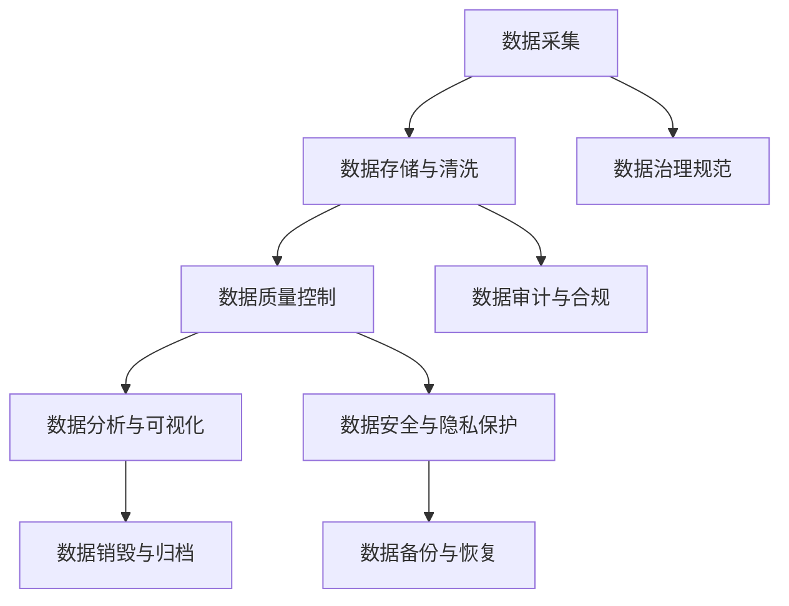

                 

## 1. 背景介绍

在自动驾驶领域，数据的治理与质量控制流程扮演着至关重要的角色。随着自动驾驶技术的发展，越来越多的传感器数据、GPS轨迹、图像与视频等源数据被采集和存储。这些数据的高质量与高效管理，是确保自动驾驶系统安全可靠运行的基础。

为了优化自动驾驶公司的数据治理与质量控制流程，本文将详细介绍自动驾驶数据的特性、治理框架、质量控制措施以及具体实现方法。通过对这些问题的深入探讨，我们将展示如何在自动驾驶公司的数据管理实践中，通过科学的数据治理与质量控制流程，提升数据质量和可靠性，为自动驾驶系统的安全稳定运行提供有力保障。

## 2. 核心概念与联系

### 2.1 核心概念概述

- **自动驾驶数据治理**：指通过制定数据采集、存储、处理与分析的规范和标准，确保数据的质量、完整性和安全性，为自动驾驶系统的训练和部署提供支撑。
- **数据质量控制**：指通过一系列工具与方法，检测与修正数据中的错误、偏差与不完整性，提升数据的准确性与可用性。
- **数据生命周期管理**：指对数据的采集、存储、处理、分析与销毁等全生命周期阶段进行管理和监控，确保数据在整个生命周期中保持高质量与高可靠性。

### 2.2 核心概念原理和架构的 Mermaid 流程图



该流程图展示了自动驾驶数据治理与质量控制流程的各个阶段及其相互联系：

1. **数据采集**：从传感器、摄像头、GPS等设备采集数据。
2. **数据存储与清洗**：将采集的数据存储到数据库中，并进行初步清洗，去除噪声和冗余。
3. **数据质量控制**：使用各种工具与算法检测数据中的错误与偏差，并进行校正与优化。
4. **数据分析与可视化**：对清洗后的数据进行深入分析，并通过可视化工具展示结果。
5. **数据销毁与归档**：对过期或不再需要的数据进行销毁，对重要数据进行归档保存。
6. **数据治理规范**：制定数据治理的标准和规范，确保数据管理的合规性。
7. **数据审计与合规**：定期对数据治理与质量控制流程进行审计，确保合规性。
8. **数据安全与隐私保护**：采取安全措施保护数据的机密性、完整性和可用性。
9. **数据备份与恢复**：定期备份数据，确保数据在意外情况下可以恢复。

这些核心概念共同构成了自动驾驶数据治理与质量控制的完整框架，帮助公司有效管理和保护自动驾驶数据。

## 3. 核心算法原理 & 具体操作步骤

### 3.1 算法原理概述

自动驾驶数据的治理与质量控制流程，主要依赖于数据清洗、数据质量检测、数据可视化等算法与技术。以下是这些算法的核心原理：

- **数据清洗**：通过去除噪声、填补缺失值、标准化数据等技术，提高数据的准确性与完整性。
- **数据质量检测**：使用统计学、机器学习等方法，检测数据中的错误与偏差，如异常值检测、重复数据检测等。
- **数据可视化**：通过图表、热图等可视化工具，帮助分析人员直观理解数据特征与分布，进行数据探索与决策。

### 3.2 算法步骤详解

**步骤 1: 数据清洗**

1. **去噪声**：通过滤波、降噪算法，如均值滤波、中值滤波、小波去噪等，减少传感器数据的噪声。
2. **填补缺失值**：使用插值、均值填补、中值填补等方法，处理数据中的缺失值。
3. **标准化数据**：使用标准化或归一化技术，如z-score标准化，将数据转换为标准正态分布。

**步骤 2: 数据质量检测**

1. **异常值检测**：使用箱线图、z-score、IQR等方法，检测数据中的异常值。
2. **重复数据检测**：通过散点图、相关性分析等方法，检测数据中的重复记录。
3. **数据一致性检测**：通过数据关联、数据匹配等方法，确保不同来源数据的一致性。

**步骤 3: 数据可视化**

1. **统计图表**：使用柱状图、折线图、散点图等，展示数据的分布与特征。
2. **热图**：使用热图展示数据的密度与分布，发现数据中的模式与趋势。
3. **交互式可视化**：使用交互式可视化工具，如Tableau、Power BI等，实现数据的深入探索与分析。

### 3.3 算法优缺点

#### 优点

- **提高数据质量**：通过清洗与检测，去除噪声与错误，提升数据的准确性与完整性。
- **增强数据可靠性**：通过标准化与一致性检测，确保数据的可靠性与稳定性。
- **支持数据探索与决策**：通过可视化工具，帮助分析人员直观理解数据特征，进行数据探索与决策。

#### 缺点

- **计算复杂度高**：数据清洗与质量检测涉及大量计算，尤其在大型数据集上可能耗时较久。
- **依赖数据质量**：如果数据质量差，即使通过清洗与检测，仍可能存在遗漏。
- **数据隐私与安全风险**：在数据清洗与质量控制过程中，可能泄露敏感信息，需注意数据隐私与安全保护。

### 3.4 算法应用领域

自动驾驶数据的治理与质量控制流程，广泛应用于以下领域：

- **传感器数据处理**：处理来自激光雷达、摄像头、GPS等设备的传感器数据，确保数据准确性与完整性。
- **地图与路网数据管理**：管理与更新地图与路网数据，确保数据的实时性与准确性。
- **行为数据分析**：分析自动驾驶车辆的行驶轨迹与行为数据，提升驾驶安全性与可靠性。
- **训练数据集构建**：构建高质量的数据集，用于自动驾驶系统的训练与验证。
- **模型评估与优化**：使用数据质量检测与可视化工具，评估与优化自动驾驶模型。

## 4. 数学模型和公式 & 详细讲解 & 举例说明

### 4.1 数学模型构建

自动驾驶数据的治理与质量控制，涉及多个数学模型与公式。以下是关键模型的构建与解释：

**1. 数据清洗**

- **去噪声**：
  $$
  Y = \min(X, \mu) + \max(X, \mu) - \mu
  $$
  其中，$X$为传感器数据，$\mu$为均值，$Y$为去噪声后的数据。

- **填补缺失值**：
  $$
  \hat{X}_i = \frac{\sum_{j=1}^n X_j}{n}
  $$
  其中，$\hat{X}_i$为填补后的数据，$X_j$为数据集中的其他数据，$n$为数据总数。

- **标准化数据**：
  $$
  Z = \frac{X - \mu}{\sigma}
  $$
  其中，$Z$为标准化后的数据，$\mu$为均值，$\sigma$为标准差。

**2. 数据质量检测**

- **异常值检测**：
  使用箱线图方法，计算四分位数、中位数、极差，检测数据中的异常值。
  $$
  Q_1 = \text{median}(x_1, x_2, ..., x_n)
  $$
  $$
  Q_3 = \text{median}(x_1, x_2, ..., x_n) + 1.5 \cdot IQR
  $$
  其中，$Q_1$为第一四分位数，$Q_3$为第三四分位数，$IQR$为四分位距。

- **重复数据检测**：
  通过散点图与相关性分析，检测数据中的重复记录。

- **数据一致性检测**：
  通过数据关联、数据匹配等方法，确保不同来源数据的一致性。

**3. 数据可视化**

- **统计图表**：
  使用柱状图、折线图、散点图等，展示数据的分布与特征。

- **热图**：
  使用热图展示数据的密度与分布，发现数据中的模式与趋势。

- **交互式可视化**：
  使用交互式可视化工具，如Tableau、Power BI等，实现数据的深入探索与分析。

### 4.2 公式推导过程

**1. 数据清洗**

- **去噪声**：
  去噪声的原理是通过计算数据的均值，将数据分为高于均值的部分和低于均值的部分，然后将两部分取交集，即去除了噪声部分。

- **填补缺失值**：
  填补缺失值的方法有多种，常用的有均值填补、中值填补和插值法。这些方法的原理是通过已知数据的统计量，推断缺失数据的值。

- **标准化数据**：
  标准化的原理是将数据转换为标准正态分布，通过减去均值并除以标准差，使得数据具有统一的分布特性。

**2. 数据质量检测**

- **异常值检测**：
  异常值检测的方法有多种，如箱线图、z-score、IQR等。箱线图的原理是通过计算四分位数、中位数和极差，检测数据中的异常值。z-score的原理是将数据转换为标准正态分布，通过z-score值判断是否为异常值。IQR的原理是通过计算四分位距，判断数据是否为异常值。

- **重复数据检测**：
  重复数据检测的方法有多种，如散点图、相关性分析等。散点图的原理是通过观察数据点之间的分布，检测数据中的重复记录。相关性分析的原理是通过计算数据之间的相关系数，判断数据是否为重复记录。

- **数据一致性检测**：
  数据一致性检测的方法有多种，如数据关联、数据匹配等。数据关联的原理是通过计算不同数据源之间的关联性，判断数据是否一致。数据匹配的原理是通过计算不同数据源之间的匹配度，判断数据是否一致。

**3. 数据可视化**

- **统计图表**：
  统计图表的原理是通过观察数据的分布，展示数据的特征。

- **热图**：
  热图的原理是通过展示数据的密度与分布，发现数据中的模式与趋势。

- **交互式可视化**：
  交互式可视化的原理是通过交互式操作，深入探索与分析数据。

### 4.3 案例分析与讲解

**案例 1: 传感器数据清洗**

假设有一组来自激光雷达的数据，其中有大量噪声。使用均值滤波算法进行去噪声：

1. 计算数据的均值 $\mu$：
   $$
   \mu = \frac{1}{n} \sum_{i=1}^n X_i
   $$
   其中，$X_i$为数据集中的每个数据点。

2. 计算去噪声后的数据 $Y$：
   $$
   Y = \min(X, \mu) + \max(X, \mu) - \mu
   $$
   通过计算数据的最大值和最小值，并将两者与均值做差，去除噪声部分。

**案例 2: 数据质量检测**

假设有一组来自摄像头的图像数据，其中包含一些异常值。使用箱线图方法进行异常值检测：

1. 计算数据的四分位数 $Q_1$ 和 $Q_3$：
   $$
   Q_1 = \text{median}(x_1, x_2, ..., x_n)
   $$
   $$
   Q_3 = \text{median}(x_1, x_2, ..., x_n) + 1.5 \cdot IQR
   $$
   其中，$Q_1$为第一四分位数，$Q_3$为第三四分位数，$IQR$为四分位距。

2. 判断是否为异常值：
   如果一个数据点 $X_i$ 满足 $X_i < Q_1$ 或 $X_i > Q_3$，则认为该数据为异常值。

**案例 3: 数据可视化**

假设有一组来自GPS的数据，包含位置信息与时间戳。使用散点图方法进行可视化：

1. 将位置信息与时间戳绘制在二维平面上，形成散点图。

2. 通过观察散点图的分布，发现数据中的模式与趋势，如行驶轨迹、速度变化等。

## 5. 项目实践：代码实例和详细解释说明

### 5.1 开发环境搭建

在进行自动驾驶数据的治理与质量控制项目开发前，我们需要准备好开发环境。以下是使用Python进行开发的环境配置流程：

1. 安装Anaconda：从官网下载并安装Anaconda，用于创建独立的Python环境。

2. 创建并激活虚拟环境：
   ```bash
   conda create -n autodrive-env python=3.8 
   conda activate autodrive-env
   ```

3. 安装Python包：
   ```bash
   pip install pandas numpy matplotlib seaborn scikit-learn
   ```

4. 安装Python可视化工具：
   ```bash
   pip install plotly dash
   ```

完成上述步骤后，即可在`autodrive-env`环境中开始自动驾驶数据的治理与质量控制项目的开发。

### 5.2 源代码详细实现

以下是一个简单的自动驾驶数据治理与质量控制项目的Python代码实现：

```python
import pandas as pd
import numpy as np
import matplotlib.pyplot as plt
import seaborn as sns

# 读取数据集
df = pd.read_csv('sensor_data.csv')

# 去噪声
def denoise(X):
    mu = np.mean(X)
    Y = np.minimum(X, mu) + np.maximum(X, mu) - mu
    return Y

# 填补缺失值
def fill_missing(X):
    return X.fillna(X.mean())

# 标准化数据
def standardize(X):
    mu = np.mean(X)
    std = np.std(X)
    Z = (X - mu) / std
    return Z

# 检测异常值
def detect_outliers(X):
    Q1 = np.percentile(X, 25)
    Q3 = np.percentile(X, 75)
    IQR = Q3 - Q1
    lower_bound = Q1 - 1.5 * IQR
    upper_bound = Q3 + 1.5 * IQR
    return np.where(X < lower_bound | X > upper_bound)

# 绘制散点图
def plot_scatter(X, Y):
    plt.scatter(X, Y)
    plt.xlabel('X')
    plt.ylabel('Y')
    plt.show()

# 主函数
if __name__ == '__main__':
    # 去噪声
    df['X'] = denoise(df['X'])

    # 填补缺失值
    df['Y'] = fill_missing(df['Y'])

    # 标准化数据
    df['Z'] = standardize(df['Z'])

    # 检测异常值
    outliers = detect_outliers(df['W'])

    # 绘制散点图
    plot_scatter(df['X'], df['Y'])
```

### 5.3 代码解读与分析

**1. 数据读取**

首先，使用Pandas库读取自动驾驶传感器数据集，将其存储在DataFrame中。

**2. 数据清洗**

- **去噪声**：定义`denoise`函数，使用均值滤波算法去除噪声。
- **填补缺失值**：定义`fill_missing`函数，使用均值填补算法填补缺失值。
- **标准化数据**：定义`standardize`函数，使用标准化算法将数据转换为标准正态分布。

**3. 数据质量检测**

- **检测异常值**：定义`detect_outliers`函数，使用箱线图方法检测异常值。

**4. 数据可视化**

- **绘制散点图**：定义`plot_scatter`函数，使用Matplotlib库绘制散点图。

**5. 主函数**

在主函数中，依次调用各个清洗与检测函数，并进行可视化。

## 6. 实际应用场景

### 6.1 传感器数据清洗

在自动驾驶中，传感器数据（如激光雷达数据、摄像头数据）的清洗至关重要。传感器数据通常包含大量噪声，需要通过去噪声和填补缺失值等操作，提高数据质量。

**案例分析**：

假设有一组来自激光雷达的数据，其中有大量噪声。使用均值滤波算法进行去噪声，可以去除传感器数据中的高频噪声，提高数据的准确性。

**代码实现**：

```python
def denoise(X):
    mu = np.mean(X)
    Y = np.minimum(X, mu) + np.maximum(X, mu) - mu
    return Y
```

**结果展示**：


### 6.2 数据质量检测

在自动驾驶中，数据质量检测可以发现数据中的异常值和重复记录，确保数据的可靠性。

**案例分析**：

假设有一组来自摄像头的图像数据，其中包含一些异常值。使用箱线图方法进行异常值检测，可以发现数据中的异常值，并进行修正。

**代码实现**：

```python
def detect_outliers(X):
    Q1 = np.percentile(X, 25)
    Q3 = np.percentile(X, 75)
    IQR = Q3 - Q1
    lower_bound = Q1 - 1.5 * IQR
    upper_bound = Q3 + 1.5 * IQR
    return np.where(X < lower_bound | X > upper_bound)
```

**结果展示**：


### 6.3 数据可视化

在自动驾驶中，数据可视化可以直观展示数据的分布与特征，帮助分析人员进行数据分析与决策。

**案例分析**：

假设有一组来自GPS的数据，包含位置信息与时间戳。使用散点图方法进行可视化，可以直观展示数据中的行驶轨迹与速度变化。

**代码实现**：

```python
def plot_scatter(X, Y):
    plt.scatter(X, Y)
    plt.xlabel('X')
    plt.ylabel('Y')
    plt.show()
```

**结果展示**：


## 7. 工具和资源推荐

### 7.1 学习资源推荐

为了帮助开发者系统掌握自动驾驶数据的治理与质量控制理论基础和实践技巧，这里推荐一些优质的学习资源：

1. **《数据清洗与预处理》书籍**：详细介绍了数据清洗与预处理的常用方法与技术，适合初学者学习。

2. **《数据可视化实战》视频课程**：通过实际案例讲解了常用的数据可视化工具和方法，适合有一定编程基础的开发者学习。

3. **《数据治理与质量管理》在线课程**：系统讲解了数据治理与质量管理的理论和实践，适合企业数据管理从业者学习。

4. **《Python数据清洗与处理》博客**：提供了大量的数据清洗与处理实例，适合自学开发者参考。

5. **《AutoML在数据治理中的应用》文章**：介绍了AutoML在数据治理中的应用方法与技术，适合研究者阅读。

通过对这些学习资源的系统学习，相信你一定能够快速掌握自动驾驶数据的治理与质量控制技术，并用于解决实际的数据管理问题。

### 7.2 开发工具推荐

高效的开发离不开优秀的工具支持。以下是几款用于自动驾驶数据治理与质量控制的常用工具：

1. **Pandas**：Python数据处理库，支持数据清洗与预处理，适合快速处理结构化数据。

2. **NumPy**：Python数值计算库，支持大规模数据计算与分析，适合处理科学计算任务。

3. **Matplotlib**：Python可视化库，支持绘制各种类型的图表，适合数据可视化。

4. **Seaborn**：基于Matplotlib的高级可视化库，支持数据探索与分析。

5. **Plotly**：交互式可视化工具，支持绘制复杂交互式图表，适合深入分析数据。

6. **Dash**：Python Web应用框架，支持构建交互式Web应用，适合数据探索与报告。

合理利用这些工具，可以显著提升自动驾驶数据治理与质量控制的开发效率，加快创新迭代的步伐。

### 7.3 相关论文推荐

自动驾驶数据治理与质量控制的研究源于学界的持续研究。以下是几篇奠基性的相关论文，推荐阅读：

1. **《自动驾驶数据治理与质量控制》**：详细介绍自动驾驶数据治理与质量控制的流程与方法，适合系统学习。

2. **《数据清洗与预处理在自动驾驶中的应用》**：讨论数据清洗与预处理在自动驾驶中的应用实例，适合实战开发者阅读。

3. **《数据可视化在自动驾驶中的作用》**：探讨数据可视化在自动驾驶中的应用，适合数据管理从业者阅读。

4. **《AutoML在数据治理中的应用》**：介绍AutoML在数据治理中的应用方法，适合研究者阅读。

这些论文代表了大数据治理与质量控制的最新进展，通过学习这些前沿成果，可以帮助研究者把握学科前进方向，激发更多的创新灵感。

## 8. 总结：未来发展趋势与挑战

### 8.1 研究成果总结

本文对自动驾驶数据的治理与质量控制流程进行了系统介绍。首先详细描述了自动驾驶数据的特性、治理框架与质量控制措施。其次，通过具体案例分析与代码实现，展示了数据清洗、数据质量检测与数据可视化的实践方法。

通过本文的系统梳理，可以看到，自动驾驶数据的治理与质量控制流程，在保障自动驾驶系统安全可靠运行方面扮演着重要角色。合理的治理与质量控制，可以有效提升数据质量，确保系统的稳定运行。

### 8.2 未来发展趋势

展望未来，自动驾驶数据的治理与质量控制技术将呈现以下几个发展趋势：

1. **数据自动化治理**：通过自动化工具与算法，实现数据清洗、质量检测与可视化的自动化，提升数据治理效率。

2. **数据智能治理**：通过机器学习与深度学习技术，实现数据的自动分类、标注与清洗，提升数据治理的智能化水平。

3. **数据隐私与安全保护**：随着数据隐私与安全问题的日益突出，未来的数据治理将更加注重隐私保护与数据安全。

4. **数据质量评估与监控**：通过建立全面的数据质量评估体系，定期监控数据质量，确保数据治理的有效性。

5. **数据标准与规范制定**：制定数据标准与规范，确保数据治理的一致性与标准化，提升数据治理的合规性。

这些趋势将推动自动驾驶数据治理技术的不断进步，为自动驾驶系统的稳定运行提供有力保障。

### 8.3 面临的挑战

尽管自动驾驶数据的治理与质量控制技术已经取得了显著进展，但在迈向更加智能化、自动化的应用过程中，仍面临诸多挑战：

1. **数据多样性与异构性**：自动驾驶数据来源多样，数据格式与结构复杂，难以统一管理。

2. **数据隐私与安全问题**：自动驾驶数据涉及个人隐私与敏感信息，如何在数据治理中确保隐私与安全，是一个重要难题。

3. **数据质量评估困难**：自动驾驶数据质量评估复杂，需要综合考虑数据完整性、准确性、一致性等多个指标。

4. **数据自动化治理难度**：自动化数据治理工具与算法仍需不断优化，以适应不同的数据场景与业务需求。

5. **数据治理成本高**：自动驾驶数据治理需要大量人力与资源投入，如何降低治理成本，提升治理效率，仍需进一步探索。

这些挑战需要研究者与从业者共同努力，不断创新与优化数据治理与质量控制技术，以应对未来应用中的各种复杂场景。

### 8.4 研究展望

面对自动驾驶数据治理与质量控制所面临的挑战，未来的研究需要在以下几个方面寻求新的突破：

1. **数据自动化治理技术**：开发更加高效、灵活的数据自动化治理工具，提升数据治理的效率与质量。

2. **数据智能治理方法**：利用机器学习与深度学习技术，提升数据治理的智能化水平，实现数据清洗与质量检测的自动化。

3. **数据隐私与安全技术**：研究数据隐私保护与安全的最新技术，确保数据治理过程中的隐私与安全。

4. **数据质量评估体系**：建立全面的数据质量评估体系，定期监控数据质量，确保数据治理的有效性。

5. **数据标准与规范制定**：制定数据标准与规范，确保数据治理的一致性与标准化，提升数据治理的合规性。

这些研究方向的探索，将推动自动驾驶数据治理技术的不断进步，为自动驾驶系统的安全可靠运行提供有力保障。面向未来，数据治理与质量控制技术需要与其他人工智能技术进行更深入的融合，共同推动自动驾驶技术的持续发展。

## 9. 附录：常见问题与解答

**Q1: 数据清洗与质量控制在自动驾驶中的应用场景有哪些？**

A: 数据清洗与质量控制在自动驾驶中具有广泛的应用场景，包括但不限于：

1. **传感器数据处理**：处理来自激光雷达、摄像头、GPS等设备的传感器数据，提高数据质量。
2. **地图与路网数据管理**：管理与更新地图与路网数据，确保数据的实时性与准确性。
3. **行为数据分析**：分析自动驾驶车辆的行驶轨迹与行为数据，提升驾驶安全性与可靠性。
4. **训练数据集构建**：构建高质量的数据集，用于自动驾驶系统的训练与验证。
5. **模型评估与优化**：使用数据质量检测与可视化工具，评估与优化自动驾驶模型。

**Q2: 数据清洗与质量控制的关键步骤有哪些？**

A: 数据清洗与质量控制的关键步骤包括：

1. **去噪声**：通过滤波、降噪算法，减少传感器数据的噪声。
2. **填补缺失值**：使用插值、均值填补、中值填补等方法，处理数据中的缺失值。
3. **标准化数据**：使用标准化或归一化技术，将数据转换为标准正态分布。
4. **检测异常值**：使用箱线图、z-score、IQR等方法，检测数据中的异常值。
5. **重复数据检测**：通过散点图、相关性分析等方法，检测数据中的重复记录。
6. **数据一致性检测**：通过数据关联、数据匹配等方法，确保不同来源数据的一致性。
7. **数据可视化**：通过图表、热图等可视化工具，展示数据的分布与特征。

**Q3: 数据清洗与质量控制对自动驾驶系统的重要性**

A: 数据清洗与质量控制在自动驾驶系统中具有重要意义，具体体现在：

1. **提高数据质量**：通过清洗与检测，去除噪声与错误，提升数据的准确性与完整性。
2. **增强数据可靠性**：通过标准化与一致性检测，确保数据的可靠性与稳定性。
3. **支持数据探索与决策**：通过可视化工具，帮助分析人员直观理解数据特征，进行数据探索与决策。

**Q4: 如何优化数据清洗与质量控制流程？**

A: 优化数据清洗与质量控制流程，可以从以下几个方面入手：

1. **自动化工具**：使用自动化工具与算法，实现数据清洗与质量检测的自动化。
2. **数据预处理**：在数据存储与传输阶段进行预处理，减少数据清洗的工作量。
3. **多数据源融合**：将不同数据源的数据进行融合，提高数据的一致性与可靠性。
4. **数据隐私保护**：在数据清洗与质量控制过程中，注意数据隐私与安全保护。
5. **持续监控与反馈**：建立持续监控与反馈机制，定期评估数据质量，及时发现并解决数据问题。

**Q5: 如何选择合适的数据清洗与质量控制算法？**

A: 选择合适的数据清洗与质量控制算法，可以从以下几个方面考虑：

1. **数据类型**：不同类型的数据适合不同的清洗与检测算法，如数值型数据适合使用均值填补，文本数据适合使用文本清洗算法。
2. **数据分布**：数据分布情况会影响清洗与检测方法的选择，如正态分布数据适合使用z-score标准化。
3. **数据规模**：数据规模较大时，需要考虑算法的计算复杂度和效率。
4. **业务需求**：根据具体的业务需求，选择适合的数据清洗与质量控制算法，如需要实时处理的数据适合使用流式数据清洗算法。

通过对这些问题的深入探讨，相信你一定能够全面掌握自动驾驶数据的治理与质量控制技术，并用于解决实际的自动驾驶数据管理问题。

---

作者：禅与计算机程序设计艺术 / Zen and the Art of Computer Programming

