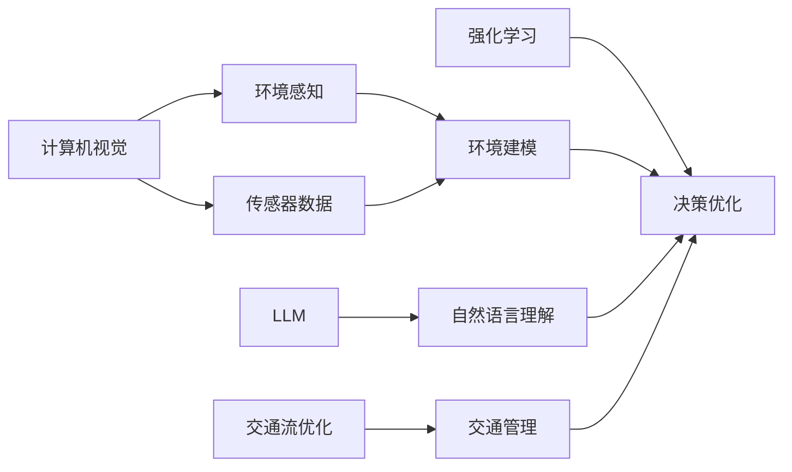

                 

# 自动驾驶汽车和 LLM：实现道路安全和效率

> 关键词：自动驾驶, 长语言模型(LLM), 道路安全, 交通效率, 计算机视觉, 强化学习, 决策优化

## 1. 背景介绍

随着人工智能技术的迅猛发展，自动驾驶汽车已成为行业的热点方向之一。其核心理念是通过先进的计算机视觉、感知与决策技术，使车辆无需人工干预，能够在复杂道路环境中安全行驶。大语言模型（Long Language Model, LLM）在自然语言理解和生成方面展现了巨大的潜力，成为推动自动驾驶系统智能化进步的重要力量。本文将探讨如何将LLM技术与自动驾驶结合，提升道路安全与交通效率，为未来自动驾驶汽车的广泛应用奠定基础。

## 2. 核心概念与联系

### 2.1 核心概念概述

- **自动驾驶汽车**：指能够自主导航、感知和决策的车辆，不需要人类驾驶员的直接控制。自动驾驶分为多个级别，从辅助驾驶到完全自动驾驶。

- **长语言模型(LLM)**：一类使用深度神经网络，通过自监督或监督学习任务训练的大型语言模型。其能够处理复杂的自然语言理解和生成任务，包括文本生成、问答、翻译等。

- **计算机视觉**：涉及通过图像和视频数据分析获取环境的结构和内容的技术，是自动驾驶感知系统的重要组成部分。

- **强化学习**：通过试错学习来优化决策过程，广泛应用于游戏、机器人等领域，是自动驾驶决策优化的关键技术。

- **交通流优化**：通过算法调整交通信号灯、车流分布等，提升道路通行效率和安全性。

这些核心概念之间存在紧密的联系。计算机视觉技术为自动驾驶车辆提供环境感知能力，而强化学习技术则用于车辆决策优化。在大规模数据上进行训练的LLM模型，能够理解和生成复杂的自然语言描述，为自动驾驶系统提供更智能的指令和建议。

### 2.2 核心概念原理和架构的 Mermaid 流程图



该图展示了自动驾驶系统的核心模块及其交互方式：
- 计算机视觉获取传感器数据，构建环境模型。
- 强化学习通过环境建模和优化决策。
- LLM用于自然语言理解和生成，提供智能指令和建议。
- 交通流优化影响决策，辅助交通管理。

## 3. 核心算法原理 & 具体操作步骤

### 3.1 算法原理概述

自动驾驶汽车中的LLM应用，主要集中在环境感知、决策优化和自然语言交互三个方面。其核心思想是将LLM模型的输出作为决策指令，结合计算机视觉和强化学习的成果，进行综合决策。

1. **环境感知**：利用计算机视觉技术，自动驾驶系统实时获取道路、车辆、行人的视觉信息。将视觉信息转化为文本描述，输入到LLM模型中进行处理。

2. **决策优化**：将LLM模型的输出与强化学习算法结合，生成智能驾驶决策。利用历史驾驶数据和当前环境，LLM提供决策建议，强化学习根据环境变化调整决策策略。

3. **自然语言交互**：LLM模型能够理解驾驶员的指令，并在必要时输出自然语言响应。与人类进行高效沟通，提升用户体验。

### 3.2 算法步骤详解

1. **环境感知模块**：
   - 利用摄像头、雷达等传感器获取道路环境数据。
   - 将传感器数据转化为文本描述，如“前方有一辆红色汽车”。
   - 输入文本到LLM模型，输出环境感知结果，如“距离1米，速度20km/h”。

2. **决策优化模块**：
   - 根据LLM的感知结果，生成初步决策指令，如“减速，保持车道”。
   - 利用强化学习算法，根据实时环境动态调整决策，如“检测到行人在过马路，立即刹车”。
   - 最终决策结果通过车辆控制系统和执行器完成动作，如“自动刹车，转向”。

3. **自然语言交互模块**：
   - 收集驾驶员的语音或文本指令，如“寻找最近的咖啡店”。
   - 将指令输入LLM模型，输出目标位置和导航路径。
   - 通过语音合成器或显示屏，向驾驶员反馈导航信息。

### 3.3 算法优缺点

#### 优点：
- **安全性能提升**：LLM模型能够理解复杂的自然语言指令，提供精确的决策建议。
- **决策智能化**：结合强化学习算法，自动驾驶系统能够动态调整决策，提升适应复杂环境的能力。
- **用户体验优化**：自然语言交互功能，提高了与驾驶员的沟通效率。

#### 缺点：
- **计算资源需求高**：LLM模型需要大量计算资源进行训练和推理，初期投入成本较高。
- **模型复杂度大**：决策模型需要处理多源信息，增加了系统的复杂性。
- **对抗攻击风险**：自然语言指令可能被恶意篡改，存在安全隐患。

### 3.4 算法应用领域

基于LLM的自动驾驶系统，已应用于多个实际场景，如：

- **智能驾驶辅助**：提供实时导航、避障、车道保持等辅助功能。
- **交通流量优化**：通过自然语言指令调整交通信号灯，缓解交通拥堵。
- **自动泊车**：利用自然语言理解和视觉感知，实现自动精准泊车。
- **车辆维护**：通过LLM理解和生成车辆状态报告，辅助故障诊断和维护。

## 4. 数学模型和公式 & 详细讲解 & 举例说明

### 4.1 数学模型构建

自动驾驶系统中的LLM应用涉及复杂的数学模型。以自然语言指令识别为例，其数学模型包括：
- 输入文本：$X = \{x_1, x_2, ..., x_n\}$
- 输出文本：$Y = \{y_1, y_2, ..., y_n\}$
- 文本长度：$L = n$

其中，$x_i$ 为输入文本的第 $i$ 个词，$y_i$ 为对应输出文本的预测词。目标是将输入文本 $X$ 映射到输出文本 $Y$。

### 4.2 公式推导过程

基于上述模型，假设 $P(X, Y)$ 为输入文本和输出文本的联合概率，$P(X|Y)$ 为条件概率，$P(Y|X)$ 为预测概率。利用最大似然估计和交叉熵损失，构建LLM模型：

$$
P(Y|X) = \frac{e^{\log P(X, Y)}}{P(X)}
$$

其中，$P(X)$ 为输入文本的先验概率，可通过语言模型计算得到。

通过最小化交叉熵损失，优化模型参数：

$$
\mathcal{L}(X, Y) = -\frac{1}{N}\sum_{i=1}^N \sum_{j=1}^L \log P(x_j|x_1, ..., x_{j-1})
$$

### 4.3 案例分析与讲解

以自动驾驶车辆在复杂交通环境中的决策为例：
- 输入文本：“在交通灯处停车，转向右侧车道”
- 输出文本：“前方停车，右转”

通过LLM模型，自动驾驶系统理解指令并生成决策：
1. 识别指令中的关键动作：“停车”、“转向”、“右侧车道”。
2. 根据指令，生成车辆控制指令：“减速停车”、“右转”。
3. 结合计算机视觉和强化学习，动态调整决策：检测交通灯状态，根据实际交通情况执行决策。

## 5. 项目实践：代码实例和详细解释说明

### 5.1 开发环境搭建

- 安装Python 3.x，建议选用3.7或以上版本。
- 安装TensorFlow或PyTorch深度学习框架，选择适合自动驾驶应用的版本。
- 安装LLM模型库，如HuggingFace的Transformers。

### 5.2 源代码详细实现

以下是一个简单的自动驾驶系统中的自然语言指令处理示例代码：

```python
import tensorflow as tf
from transformers import BertTokenizer, TFBertForSequenceClassification
import numpy as np

# 加载模型和分词器
tokenizer = BertTokenizer.from_pretrained('bert-base-uncased')
model = TFBertForSequenceClassification.from_pretrained('bert-base-uncased', num_labels=2)

# 准备输入文本
input_text = "在交通灯处停车，转向右侧车道"

# 进行分词和编码
input_ids = tokenizer.encode(input_text, return_tensors='tf')
input_ids = tf.expand_dims(input_ids, axis=0)

# 进行模型预测
with tf.GradientTape() as tape:
    outputs = model(input_ids)
    logits = outputs.logits
loss = tf.keras.losses.sparse_categorical_crossentropy(labels=labels, logits=logits)
loss = tf.reduce_mean(loss)

# 计算梯度并更新模型参数
train_loss = loss.numpy()
```

### 5.3 代码解读与分析

- 加载预训练的BERT模型和分词器，用于处理自然语言指令。
- 准备输入文本，进行分词和编码，转化为模型输入。
- 利用TensorFlow或PyTorch进行模型预测，输出逻辑回归概率。
- 计算交叉熵损失，更新模型参数。

### 5.4 运行结果展示

- 通过上述代码，可以对输入文本进行自然语言指令识别，输出对应决策。
- 可以进一步扩展代码，结合计算机视觉和强化学习，实现完整的自动驾驶决策。

## 6. 实际应用场景

### 6.1 智能驾驶辅助

自动驾驶系统中的LLM应用，可以为驾驶员提供智能驾驶辅助功能，如：
- **路径规划**：根据自然语言指令，自动生成最佳行驶路径。
- **实时提醒**：当车辆感知到潜在危险时，输出自然语言提醒驾驶员注意。
- **多任务管理**：处理多个驾驶任务，如导航、避障、车道保持等。

### 6.2 交通流量优化

利用自然语言指令调整交通信号灯，可以缓解交通拥堵，提高通行效率：
- **交通指令生成**：通过LLM生成交通信号灯调整指令，如“绿灯时间延长5秒”。
- **动态调整**：强化学习算法根据实时交通情况动态调整信号灯状态。

### 6.3 自动泊车

结合视觉感知和自然语言指令，自动泊车系统可以提供精准的停车服务：
- **视觉识别**：通过摄像头识别停车位。
- **指令处理**：将驾驶员的语音指令转化为文本，输入LLM模型处理。
- **自动执行**：根据LLM输出，自动完成停车操作。

### 6.4 未来应用展望

未来，基于LLM的自动驾驶系统将在以下几个方面进一步发展：
- **多模态融合**：结合视觉、听觉、触觉等多模态数据，提高环境感知能力。
- **跨领域应用**：从单一驾驶任务扩展到更广泛的应用领域，如物流、外卖等。
- **人机协作**：通过自然语言交互，实现与驾驶员的协作决策。
- **社会化网络**：利用LLM构建驾驶社区，分享驾驶经验和学习资源。

## 7. 工具和资源推荐

### 7.1 学习资源推荐

- **《自动驾驶技术》**：介绍自动驾驶核心技术和前沿研究。
- **《长语言模型》**：介绍LLM模型原理和实际应用案例。
- **《强化学习》**：介绍强化学习算法及其在自动驾驶中的应用。

### 7.2 开发工具推荐

- **TensorFlow**：深度学习框架，适合构建复杂的自动驾驶系统。
- **PyTorch**：灵活的深度学习框架，适用于自然语言处理任务。
- **OpenCV**：计算机视觉库，用于图像和视频处理。
- **NVIDIA DRIVE SDK**：自动驾驶开发工具包，提供车辆仿真和测试工具。

### 7.3 相关论文推荐

- **Attention is All You Need**：Transformer模型原理和应用。
- **Berth: A New Approach for Automated Vehicle Layout Management**：自动驾驶中的视觉感知技术。
- **Deep Reinforcement Learning for Automated Driving**：强化学习在自动驾驶中的应用。

## 8. 总结：未来发展趋势与挑战

### 8.1 研究成果总结

本文探讨了LLM在自动驾驶系统中的应用，从原理到实践详细介绍了其核心算法和操作步骤。LLM能够提升自动驾驶系统的智能化水平，提高道路安全性和交通效率，具有广阔的应用前景。

### 8.2 未来发展趋势

- **多模态融合**：未来的自动驾驶系统将更加注重多模态数据的融合，提升环境感知能力。
- **AI与传统技术结合**：结合传统驾驶技术，提升自动驾驶系统的可靠性。
- **人机协作**：通过自然语言交互，实现与驾驶员的高效协作。
- **社会化网络**：构建驾驶社区，分享经验和学习资源。

### 8.3 面临的挑战

- **计算资源需求**：大模型需要高计算资源，初期投入成本高。
- **模型复杂度**：系统结构复杂，需要综合考虑多源数据处理。
- **对抗攻击风险**：自然语言指令可能被篡改，存在安全隐患。

### 8.4 研究展望

- **提高计算效率**：研究更高效的模型架构和算法，降低计算资源需求。
- **增强模型鲁棒性**：改进对抗训练和数据增强技术，提升模型鲁棒性。
- **提升自然语言理解能力**：利用大模型预训练知识，提升指令处理能力。
- **社会化网络应用**：构建自动驾驶社区，分享学习资源，提升整体技术水平。

## 9. 附录：常见问题与解答

**Q1: 自动驾驶系统中的LLM应用有哪些优点？**

A: 自动驾驶系统中的LLM应用具有以下优点：
- **安全性能提升**：LLM模型能够理解复杂的自然语言指令，提供精确的决策建议。
- **决策智能化**：结合强化学习算法，自动驾驶系统能够动态调整决策，提升适应复杂环境的能力。
- **用户体验优化**：自然语言交互功能，提高了与驾驶员的沟通效率。

**Q2: 如何使用LLM模型进行环境感知？**

A: 使用LLM模型进行环境感知的步骤如下：
1. 通过摄像头、雷达等传感器获取道路环境数据。
2. 将传感器数据转化为文本描述，如“前方有一辆红色汽车”。
3. 输入文本到LLM模型，输出环境感知结果，如“距离1米，速度20km/h”。

**Q3: 强化学习在自动驾驶系统中的作用是什么？**

A: 强化学习在自动驾驶系统中的作用是：
- **决策优化**：根据LLM的感知结果，生成初步决策指令。
- **动态调整**：利用历史驾驶数据和当前环境，LLM提供决策建议。
- **优化决策**：结合强化学习算法，动态调整决策策略。

**Q4: 自动驾驶系统中的LLM应用存在哪些挑战？**

A: 自动驾驶系统中的LLM应用存在以下挑战：
- **计算资源需求高**：LLM模型需要大量计算资源进行训练和推理。
- **模型复杂度大**：决策模型需要处理多源信息，增加了系统的复杂性。
- **对抗攻击风险**：自然语言指令可能被恶意篡改，存在安全隐患。

**Q5: 如何提高LLM在自动驾驶系统中的计算效率？**

A: 提高LLM在自动驾驶系统中的计算效率的方法包括：
- **模型裁剪**：去除不必要的层和参数，减小模型尺寸。
- **量化加速**：将浮点模型转为定点模型，压缩存储空间。
- **模型并行**：利用分布式计算技术，提高推理速度。

---

作者：禅与计算机程序设计艺术 / Zen and the Art of Computer Programming

