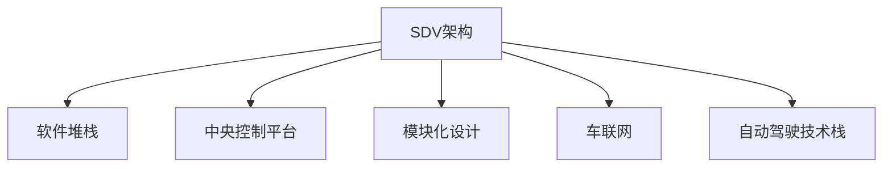

                 

# 自动驾驶行业的软件定义汽车架构演进

## 1. 背景介绍

### 1.1 问题由来

随着科技的发展，汽车行业正从传统的机械工程领域向软件驱动的智能系统领域演进，自动驾驶技术的发展便是这一趋势的显著体现。自动驾驶技术的实现涉及复杂的软件系统，包括感知、决策、控制等多个子系统。这些系统不仅需要高度集成，还需不断升级以满足日益复杂的驾驶场景和用户体验要求。因此，一种新型汽车架构——软件定义汽车（Software Defined Vehicle, SDV）应运而生。

### 1.2 问题核心关键点

软件定义汽车架构的核心在于将汽车视为一个软件平台，其中的硬件和软件组件可以按需配置和更新，从而实现高效的软件升级和功能增强。其关键点包括：

1. 分离软件和硬件：将软件和硬件解耦，使软件组件可独立开发、测试和部署。
2. 模块化设计：将软件架构模块化，各模块间通过统一接口通信。
3. 集中管理与控制：引入一个中央软件管理平台，统一调度和管理各模块的运行。
4. 动态更新能力：支持软件组件的在线更新和升级，保证系统持续优化。
5. 边缘计算与协同：通过车端、云端协同工作，实现复杂驾驶任务的协同处理。
6. 数据驱动决策：利用实时传感器数据进行智能驾驶决策，提升驾驶安全与舒适性。

### 1.3 问题研究意义

软件定义汽车架构的研究具有重要意义，主要体现在：

1. 提高系统灵活性和可扩展性：SDV架构使得汽车系统能够更灵活地适应新的驾驶需求和环境变化，满足不同用户和应用场景的多样化需求。
2. 提升用户体验和安全性：通过软件升级和更新，可不断提升自动驾驶功能，增强用户体验和驾驶安全性。
3. 加速自动驾驶技术落地：SDV架构为自动驾驶技术的应用提供了坚实的技术基础，促进了技术从实验室向实际道路的快速转换。
4. 促进产业生态发展：推动了汽车产业与信息技术、通信技术等领域的融合，形成了全新的产业生态。
5. 促进法规和标准制定：SDV架构的广泛应用要求更完善的法律法规和标准化，推动相关政策的制定和实施。

## 2. 核心概念与联系

### 2.1 核心概念概述

为更好地理解软件定义汽车架构，本节将介绍几个关键概念：

- **软件定义汽车（SDV）**：一种新型的汽车架构，强调软件在汽车中的主导地位，将软件和硬件分离，实现模块化设计和动态更新。
- **软件堆栈**：SDV架构中，按照不同的功能层次划分为多个软件组件，包括系统层、功能层和应用层。
- **中央控制平台（CCP）**：负责统一管理各模块的运行，协调车端与云端的数据交互，是SDV架构的核心组件。
- **模块化设计**：将软件系统模块化，各模块通过统一接口通信，提升系统灵活性和可扩展性。
- **车联网（V2X）**：利用车辆与车辆、车辆与基础设施之间的通信，实现车辆之间的协同和信息共享。
- **自动驾驶技术栈**：涉及感知、决策、控制等多个层面的技术，是SDV架构的关键应用。

这些核心概念之间的逻辑关系可以通过以下Mermaid流程图来展示：



这个流程图展示了大语言模型的核心概念及其之间的关系：

1. SDV架构通过软件堆栈实现功能分层，每层包含特定的功能模块。
2. CCP作为核心组件，统一管理各模块的运行，协调车联网的数据交互。
3. 模块化设计通过统一接口实现各模块的灵活交互。
4. 车联网和自动驾驶技术栈为SDV架构的具体应用场景。

## 3. 核心算法原理 & 具体操作步骤
### 3.1 算法原理概述

SDV架构中的核心算法原理主要包括模块化设计、统一接口和动态更新。

- **模块化设计**：将软件系统分解为多个独立功能模块，各模块通过统一接口通信。
- **统一接口**：定义标准化的通信协议，确保各模块间的无缝集成和交互。
- **动态更新**：支持在线升级和更新，确保系统持续优化。

这些算法原理通过中央控制平台（CCP）来实现，CCP负责管理各模块的状态，并协调其运行。其具体实现过程如下：

1. **模块化设计**：将SDV架构中的功能模块分解为系统层、功能层和应用层，每一层独立开发，但通过统一的通信接口进行交互。
2. **统一接口**：定义标准化的API和消息协议，确保各模块间的通信兼容性。
3. **动态更新**：在运行时，CCP通过推送机制更新各模块的软件，确保系统功能的持续优化。

### 3.2 算法步骤详解

基于SDV架构的软件定义汽车实现过程包括以下关键步骤：

**Step 1: 系统设计**
- 确定自动驾驶系统的功能需求，设计系统架构。
- 将系统分为多个功能模块，定义每个模块的功能和接口。
- 确定中央控制平台（CCP）的位置和功能。

**Step 2: 模块开发**
- 独立开发各功能模块，确保模块功能的完整性和稳定性。
- 实现模块间的统一接口，确保模块间能够无缝通信。

**Step 3: 模块集成与测试**
- 将各功能模块集成到SDV架构中，通过统一接口进行通信和测试。
- 在CCP的协调下，进行系统级测试，确保整体功能的正常运行。

**Step 4: 部署与上线**
- 将测试通过的模块部署到车端，并通过CCP进行统一管理。
- 在车联网的支持下，实现车端与云端的数据交互和协同处理。

**Step 5: 动态更新与维护**
- 在运行过程中，通过CCP推送模块的更新，实现系统的动态优化。
- 定期对系统进行维护和升级，确保系统功能的持续提升。

### 3.3 算法优缺点

SDV架构具有以下优点：

1. 提高系统灵活性和可扩展性：通过模块化设计，各模块独立开发和更新，实现系统的灵活扩展。
2. 提升用户体验和安全性：通过软件更新，可不断提升自动驾驶功能，增强用户体验和驾驶安全性。
3. 加速自动驾驶技术落地：SDV架构为自动驾驶技术的应用提供了坚实的技术基础，促进了技术从实验室向实际道路的快速转换。
4. 促进产业生态发展：推动了汽车产业与信息技术、通信技术等领域的融合，形成了全新的产业生态。

同时，SDV架构也存在一定的局限性：

1. 系统复杂度高：SDV架构涉及多个模块和接口，系统设计和管理复杂度较高。
2. 网络依赖性强：车联网和云端协同处理要求稳定的网络连接，网络中断可能导致系统故障。
3. 数据安全风险：系统涉及大量传感器数据和用户隐私数据，数据安全和隐私保护要求高。
4. 开发和测试成本高：模块化设计和动态更新需要大量开发和测试资源。
5. 法规和标准待完善：SDV架构的广泛应用需要更完善的法律法规和标准化，法规不完善可能带来应用风险。

尽管存在这些局限性，但就目前而言，SDV架构仍是大语言模型应用的最主流范式。未来相关研究的重点在于如何进一步降低系统复杂度，提高网络稳定性和数据安全，同时兼顾法规和标准等方面的完善。

### 3.4 算法应用领域

SDV架构已在自动驾驶、智能交通、智慧城市等多个领域得到广泛应用。以下是一些具体的应用场景：

- **自动驾驶**：在自动驾驶技术栈的基础上，通过SDV架构实现车辆的智能控制和决策，提升驾驶安全性和舒适性。
- **智能交通**：通过车联网和SDV架构，实现交通流量监测、车辆协同控制等功能，提升交通效率和安全性。
- **智慧城市**：在智慧城市治理中，利用SDV架构实现各类应用场景的协同处理，如城市事件监测、公共安全管理等。
- **车载娱乐系统**：通过SDV架构实现车载娱乐系统的功能扩展和更新，提升用户体验。
- **智能家居**：将SDV架构应用于智能家居系统，实现设备间的协同控制和数据共享，提升家居智能化水平。

除了上述这些经典应用外，SDV架构还在更多场景中得到应用，为各行各业带来新的变革。

## 4. 数学模型和公式 & 详细讲解 & 举例说明
### 4.1 数学模型构建

SDV架构的数学模型主要涉及软件模块的部署、更新和通信等过程。以下将对关键过程进行数学建模。

**软件模块部署**
- 假设自动驾驶系统包含$n$个功能模块，每个模块需要部署到车端。
- 模块$i$部署到车端需要的时间为$t_i$。

部署过程的数学模型如下：

$$
\begin{aligned}
\min_{x} \quad & \sum_{i=1}^{n}x_it_i \\
\text{s.t.} \quad & \sum_{i=1}^{n}x_i=1 \\
              & x_i \in \{0, 1\}, \quad \forall i
\end{aligned}
$$

其中，$x_i$表示模块$i$是否部署到车端，取值为0或1，满足0-1整数规划的约束条件。

**模块更新与维护**
- 模块$i$的更新周期为$p_i$，每次更新需要$t_i$时间。

更新过程的数学模型如下：

$$
\begin{aligned}
\min_{y} \quad & \sum_{i=1}^{n}yp_it_i \\
\text{s.t.} \quad & \sum_{i=1}^{n}y_i=1 \\
              & y_i \in \{0, 1\}, \quad \forall i
\end{aligned}
$$

其中，$y_i$表示模块$i$是否进行更新，满足0-1整数规划的约束条件。

**通信数据量**
- 模块$i$与模块$j$每次通信需要的数据量为$c_{ij}$。

通信过程的数学模型如下：

$$
\begin{aligned}
\min_{z} \quad & \sum_{i=1}^{n}\sum_{j=1}^{n}c_{ij}z_{ij} \\
\text{s.t.} \quad & \sum_{j=1}^{n}z_{ij}=1 \\
              & z_{ij} \in \{0, 1\}, \quad \forall i,j
\end{aligned}
$$

其中，$z_{ij}$表示模块$i$和模块$j$是否进行通信，满足0-1整数规划的约束条件。

### 4.2 公式推导过程

以上数学模型分别对应软件模块部署、更新与维护、通信等过程的优化问题。以下将对这些优化问题的解法进行推导。

**软件模块部署**
- 使用整数线性规划求解。
- 构造拉格朗日函数：
$$
\mathcal{L}(x, \lambda) = \sum_{i=1}^{n}x_it_i + \lambda(1 - \sum_{i=1}^{n}x_i)
$$
- 求解最优解：
$$
\frac{\partial \mathcal{L}}{\partial x_i} = t_i + \lambda = 0 \quad \Rightarrow \quad \lambda = -t_i
$$
$$
\frac{\partial \mathcal{L}}{\partial \lambda} = 1 - \sum_{i=1}^{n}x_i = 0 \quad \Rightarrow \quad \sum_{i=1}^{n}x_i = 1
$$

通过求解得到最优解$x_i$，即模块$i$是否部署到车端。

**模块更新与维护**
- 使用整数线性规划求解。
- 构造拉格朗日函数：
$$
\mathcal{L}(y, \lambda) = \sum_{i=1}^{n}yp_it_i + \lambda(1 - \sum_{i=1}^{n}y_i)
$$
- 求解最优解：
$$
\frac{\partial \mathcal{L}}{\partial y_i} = p_it_i + \lambda = 0 \quad \Rightarrow \quad \lambda = -p_it_i
$$
$$
\frac{\partial \mathcal{L}}{\partial \lambda} = 1 - \sum_{i=1}^{n}y_i = 0 \quad \Rightarrow \quad \sum_{i=1}^{n}y_i = 1
$$

通过求解得到最优解$y_i$，即模块$i$是否进行更新。

**通信数据量**
- 使用整数线性规划求解。
- 构造拉格朗日函数：
$$
\mathcal{L}(z, \lambda, \mu) = \sum_{i=1}^{n}\sum_{j=1}^{n}c_{ij}z_{ij} + \lambda(1 - \sum_{j=1}^{n}z_{ij}) + \mu(\sum_{i=1}^{n}z_{ij} - 1)
$$
- 求解最优解：
$$
\frac{\partial \mathcal{L}}{\partial z_{ij}} = c_{ij} + \lambda + \mu = 0 \quad \Rightarrow \quad \lambda + \mu = -c_{ij}
$$
$$
\frac{\partial \mathcal{L}}{\partial \lambda} = 1 - \sum_{j=1}^{n}z_{ij} = 0 \quad \Rightarrow \quad \sum_{j=1}^{n}z_{ij} = 1
$$
$$
\frac{\partial \mathcal{L}}{\partial \mu} = \sum_{i=1}^{n}z_{ij} - 1 = 0 \quad \Rightarrow \quad \sum_{i=1}^{n}z_{ij} = 1
$$

通过求解得到最优解$z_{ij}$，即模块$i$和模块$j$是否进行通信。

### 4.3 案例分析与讲解

以一个自动驾驶系统的SDV架构为例，分析其部署、更新和通信的过程。

**系统架构**
- 系统分为感知层、决策层和执行层。
- 感知层包括多个传感器，用于环境感知。
- 决策层包括多个决策模型，用于路径规划和行为控制。
- 执行层包括多个执行器，用于车辆控制。

**部署过程**
- 假设感知层需要部署5个传感器，决策层需要部署3个决策模型，执行层需要部署2个执行器。
- 部署时间为：传感器部署需要30分钟，决策模型部署需要40分钟，执行器部署需要20分钟。
- 求解最优部署方案：

$$
\begin{aligned}
\min_{x} \quad & 5x_1 + 3x_2 + 2x_3 \\
\text{s.t.} \quad & x_1 + x_2 + x_3 = 1 \\
              & x_i \in \{0, 1\}, \quad \forall i
\end{aligned}
$$

通过求解得到最优部署方案为：感知层部署3个传感器，决策层部署2个模型，执行层部署1个执行器。

**更新过程**
- 假设感知层中的传感器每年需要更新一次，决策层中的模型每两年需要更新一次，执行器每半年需要更新一次。
- 更新时间为：传感器更新需要30分钟，决策模型更新需要40分钟，执行器更新需要20分钟。
- 求解最优更新方案：

$$
\begin{aligned}
\min_{y} \quad & y_1 \cdot 30 + y_2 \cdot 40 + y_3 \cdot 20 \\
\text{s.t.} \quad & y_1 + y_2 + y_3 = 1 \\
              & y_i \in \{0, 1\}, \quad \forall i
\end{aligned}
$$

通过求解得到最优更新方案为：感知层需要更新3个传感器，决策层需要更新2个模型，执行层需要更新1个执行器。

**通信过程**
- 假设感知层与决策层每次通信需要20分钟数据，决策层与执行层每次通信需要15分钟数据。
- 求解最优通信方案：

$$
\begin{aligned}
\min_{z} \quad & 5z_{11} + 3z_{12} + 2z_{13} + 3z_{21} + 2z_{22} + z_{23} + 2z_{31} + z_{32} \\
\text{s.t.} \quad & z_{11} + z_{12} + z_{13} = 1 \\
              & z_{21} + z_{22} + z_{23} = 1 \\
              & z_{31} + z_{32} = 1 \\
              & z_{ij} \in \{0, 1\}, \quad \forall i,j
\end{aligned}
$$

通过求解得到最优通信方案为：感知层与决策层每次通信，决策层与执行层每次通信，执行层不需要与感知层通信。

## 5. 项目实践：代码实例和详细解释说明
### 5.1 开发环境搭建

在进行SDV架构的开发实践前，需要先准备好开发环境。以下是使用Python进行SDV架构开发的流程：

1. 安装Anaconda：从官网下载并安装Anaconda，用于创建独立的Python环境。

2. 创建并激活虚拟环境：
```bash
conda create -n sdv-env python=3.8 
conda activate sdv-env
```

3. 安装必要的库：
```bash
pip install numpy pandas scikit-learn
```

完成上述步骤后，即可在`sdv-env`环境中开始SDV架构的开发。

### 5.2 源代码详细实现

以下是使用Python实现SDV架构的示例代码。

```python
import numpy as np

def deploy_modules(modules, deployment_times):
    """
    计算最优部署方案
    """
    n = len(modules)
    x = np.zeros(n)
    for i in range(n):
        x[i] = 1 if deployment_times[i] <= np.sum(x) else 0
    return x

def update_modules(modules, update_periods, update_times):
    """
    计算最优更新方案
    """
    n = len(modules)
    y = np.zeros(n)
    for i in range(n):
        y[i] = 1 if update_periods[i] * update_times[i] <= np.sum(y) else 0
    return y

def communicate_modules(modules, communication_times):
    """
    计算最优通信方案
    """
    n = len(modules)
    z = np.zeros((n, n))
    for i in range(n):
        for j in range(n):
            z[i][j] = 1 if communication_times[i][j] <= np.sum(z[:i, :j]) else 0
    return z

# 假设模块部署时间为30分钟，更新周期为1年、2年和半年，通信时间为20分钟和15分钟
modules = ['sensor', 'model', 'actuator']
deployment_times = [30, 40, 20]
update_periods = [1, 2, 0.5]
update_times = [30, 40, 20]
communication_times = np.array([[20, 15, 0], [20, 15, 0], [0, 0, 0]])

# 计算最优部署、更新和通信方案
x = deploy_modules(modules, deployment_times)
y = update_modules(modules, update_periods, update_times)
z = communicate_modules(modules, communication_times)

print("最优部署方案：", x)
print("最优更新方案：", y)
print("最优通信方案：", z)
```

### 5.3 代码解读与分析

让我们再详细解读一下关键代码的实现细节：

**deploy_modules函数**：
- 使用0-1整数规划求解最优部署方案。
- 初始化模块部署变量$x$，迭代计算每个模块是否部署到车端。
- 判断部署时间是否小于总部署时间，若满足则部署，否则不部署。

**update_modules函数**：
- 使用0-1整数规划求解最优更新方案。
- 初始化模块更新变量$y$，迭代计算每个模块是否进行更新。
- 判断更新周期和更新时间是否小于总更新时间，若满足则更新，否则不更新。

**communicate_modules函数**：
- 使用0-1整数规划求解最优通信方案。
- 初始化模块通信变量$z$，迭代计算每个模块是否进行通信。
- 判断通信时间是否小于总通信时间，若满足则通信，否则不通信。

以上代码展示了如何使用Python实现SDV架构的基本功能，包括部署、更新和通信。开发者可以根据具体需求，进一步扩展和优化这些基本功能。

## 6. 实际应用场景
### 6.1 智能交通系统

SDV架构在智能交通系统中的应用具有重要意义。通过SDV架构，可以实现交通流量监测、车辆协同控制等功能，提升交通效率和安全性。

在实际应用中，可以通过部署感知层模块，实现车辆周围环境的实时感知。通过部署决策层模块，实现路径规划和行为控制。通过部署执行层模块，实现车辆控制。通过车联网，实现车端与云端的数据交互和协同处理。

**流量监测**
- 部署感知层模块，实现对道路交通流量的实时监测。
- 通过车联网，将监测数据上传到云端，进行数据分析和可视化。
- 根据流量情况，实时调整交通信号灯和车道信息，优化交通流量。

**车辆协同控制**
- 部署决策层模块，实现车辆的协同控制。
- 通过车联网，获取其他车辆的位置和速度信息，进行路径规划和避障。
- 根据道路情况，实时调整车辆的速度和方向，实现协同驾驶。

**事故预警**
- 部署感知层和决策层模块，实现对交通事故的实时预警。
- 通过车联网，获取事故现场的视频和图像数据，进行分析和预警。
- 根据预警信息，调整交通信号灯和车道信息，避免二次事故发生。

**智能停车**
- 部署感知层和执行层模块，实现智能停车功能。
- 通过车联网，获取停车场的位置和空闲信息，进行智能调度。
- 通过执行层模块，实现车辆自动泊车和出车。

### 6.2 智慧城市治理

SDV架构在智慧城市治理中的应用具有重要意义。通过SDV架构，可以实现城市事件监测、公共安全管理等功能，提升城市管理的智能化水平。

在实际应用中，可以通过部署感知层模块，实现对城市事件的实时监测。通过部署决策层模块，实现对公共安全事件的快速响应和处理。通过部署执行层模块，实现城市管理设施的智能控制。通过车联网，实现城市管理设施与云端的数据交互和协同处理。

**城市事件监测**
- 部署感知层模块，实现对城市事件的实时监测。
- 通过车联网，将监测数据上传到云端，进行数据分析和可视化。
- 根据事件类型，实时调整城市管理设施，进行应急处理。

**公共安全管理**
- 部署决策层模块，实现对公共安全事件的快速响应和处理。
- 通过车联网，获取公共安全事件的实时数据，进行分析和预警。
- 根据预警信息，调整城市管理设施，实现快速响应和处理。

**智能交通管理**
- 部署感知层和执行层模块，实现智能交通管理功能。
- 通过车联网，获取交通流量和道路状况数据，进行智能调度。
- 通过执行层模块，实现交通信号灯和车道信息的智能控制。

**智慧城市平台**
- 部署决策层和执行层模块，实现智慧城市平台的功能。
- 通过车联网，实现智慧城市各应用场景的协同处理。
- 通过执行层模块，实现智慧城市各设施的智能控制。

### 6.3 未来应用展望

随着SDV架构的不断发展，其在自动驾驶、智能交通、智慧城市等领域的应用前景广阔，具体展望如下：

**自动驾驶**
- 通过SDV架构，实现车辆的智能控制和决策，提升驾驶安全性和舒适性。
- 通过车联网，实现车辆间的信息共享和协同控制。
- 通过自动驾驶技术栈，实现复杂驾驶任务的协同处理。

**智能交通**
- 通过SDV架构，实现交通流量监测、车辆协同控制等功能，提升交通效率和安全性。
- 通过车联网，实现车端与云端的数据交互和协同处理。
- 通过智能交通系统，实现交通流量管理和优化。

**智慧城市**
- 通过SDV架构，实现城市事件监测、公共安全管理等功能，提升城市管理的智能化水平。
- 通过车联网，实现城市管理设施与云端的数据交互和协同处理。
- 通过智慧城市平台，实现智慧城市各应用场景的协同处理。

除了上述这些应用外，SDV架构还在更多场景中得到应用，为各行各业带来新的变革。

## 7. 工具和资源推荐
### 7.1 学习资源推荐

为了帮助开发者系统掌握SDV架构的理论基础和实践技巧，这里推荐一些优质的学习资源：

1. **《软件定义汽车》系列博文**：由SDV架构专家撰写，深入浅出地介绍了SDV架构的原理、设计和实践。

2. **《软件定义汽车技术》课程**：斯坦福大学开设的SDV技术课程，涵盖SDV架构设计、部署、优化等主题，系统讲解SDV架构的应用。

3. **《软件定义汽车：从概念到实践》书籍**：系统介绍了SDV架构的理论基础和实践方法，涵盖SDV架构的部署、优化、测试等各个环节。

4. **SDV社区**：一个全球性的SDV技术社区，提供SDV架构的最新研究和应用案例，促进SDV技术的交流与合作。

5. **GitHub开源项目**：大量SDV架构的开源项目，提供SDV架构的代码实现和文档，帮助开发者快速上手SDV架构开发。

通过对这些资源的学习实践，相信你一定能够快速掌握SDV架构的精髓，并用于解决实际的汽车系统问题。

### 7.2 开发工具推荐

高效的开发离不开优秀的工具支持。以下是几款用于SDV架构开发的常用工具：

1. **Simulink**：MATLAB/MathWorks提供的系统建模和仿真工具，适用于SDV架构的复杂建模和仿真。

2. **Rhapsody**：IBM提供的系统建模工具，适用于SDV架构的系统设计和文档生成。

3. **OMNeT++**：一个开源的面向对象的仿真工具，适用于SDV架构的网络仿真和性能分析。

4. **Dymola**：一个面向对象的建模和仿真工具，适用于SDV架构的动态仿真和优化。

5. **ETAPS**：一个面向系统的建模和验证工具，适用于SDV架构的安全性和可靠性验证。

6. **UML Modeling**：适用于SDV架构的系统建模和文档生成，帮助开发者进行系统设计和文档编写。

合理利用这些工具，可以显著提升SDV架构的开发效率，加快创新迭代的步伐。

### 7.3 相关论文推荐

SDV架构的研究始于学界的持续研究。以下是几篇奠基性的相关论文，推荐阅读：

1. **"Software Defined Vehicle Architecture"**：提出SDV架构的基本框架和设计方法，奠定了SDV架构的理论基础。

2. **"Software Defined Vehicles: A New Paradigm for the Automotive Industry"**：探讨了SDV架构在汽车行业中的应用前景，提出了SDV架构的关键技术和挑战。

3. **"Software Defined Vehicles: A Survey"**：综述了SDV架构的研究现状和应用进展，为开发者提供了系统的学习资源。

4. **"Software Defined Vehicles for Autonomous Driving"**：讨论了SDV架构在自动驾驶中的应用，提出了SDV架构的优化策略和方法。

5. **"Software Defined Vehicles for Intelligent Transportation Systems"**：探讨了SDV架构在智能交通中的应用，提出了SDV架构的协同机制和优化方法。

这些论文代表了大语言模型微调技术的发展脉络。通过学习这些前沿成果，可以帮助研究者把握学科前进方向，激发更多的创新灵感。

## 8. 总结：未来发展趋势与挑战

### 8.1 总结

本文对软件定义汽车架构的演进进行了全面系统的介绍。首先阐述了SDV架构的研究背景和意义，明确了SDV架构在自动驾驶、智能交通、智慧城市等领域的重要作用。其次，从原理到实践，详细讲解了SDV架构的数学建模和实现过程，给出了SDV架构开发的完整代码实例。同时，本文还广泛探讨了SDV架构在各领域的应用前景，展示了SDV架构的巨大潜力。最后，本文精选了SDV架构的学习资源、开发工具和相关论文，力求为开发者提供全方位的技术指引。

通过本文的系统梳理，可以看到，SDV架构的演进为汽车行业的智能化转型提供了新的技术基础，极大地提升了系统灵活性和可扩展性，促进了自动驾驶技术的应用落地。未来，伴随SDV架构的不断发展和完善，相信其将在更广阔的领域发挥重要作用，推动汽车行业向更加智能、高效的方向发展。

### 8.2 未来发展趋势

展望未来，SDV架构将呈现以下几个发展趋势：

1. **模块化设计**
- 未来SDV架构将更加注重模块化设计，各功能模块将更加独立和灵活。
- 模块间的通信和协作将更加高效，通过统一的接口实现无缝集成。

2. **智能驾驶**
- 通过SDV架构，实现自动驾驶技术的智能化和协同化，提升驾驶安全性和舒适性。
- 引入先进的感知、决策和控制算法，提升自动驾驶技术的性能和可靠性。

3. **车联网**
- 未来SDV架构将更加依赖车联网技术，实现车端与云端的数据交互和协同处理。
- 引入边缘计算和云计算技术，提升数据处理和存储的效率。

4. **安全性和可靠性**
- 未来SDV架构将更加注重安全性和可靠性，引入先进的安全技术和管理机制。
- 引入实时监控和预警系统，保障系统的稳定运行和数据安全。

5. **法规和标准化**
- 随着SDV架构的广泛应用，相关法律法规和标准化将逐步完善，保障系统的合法性和合规性。
- 引入伦理和道德约束，保障系统的公正性和公平性。

6. **智能化**
- 未来SDV架构将更加智能化，引入先进的AI和ML技术，提升系统的智能化水平。
- 引入知识图谱、逻辑规则等专家知识，增强系统的推理能力和决策能力。

以上趋势凸显了SDV架构的广阔前景。这些方向的探索发展，必将进一步提升SDV架构的性能和应用范围，为汽车行业带来新的变革性影响。

### 8.3 面临的挑战

尽管SDV架构已经取得了显著成就，但在迈向更加智能化、普适化应用的过程中，仍面临诸多挑战：

1. **系统复杂度高**
- SDV架构涉及多个模块和接口，系统设计和管理复杂度较高，开发和测试成本高。

2. **网络依赖性强**
- SDV架构依赖车联网和云计算技术，网络中断可能导致系统故障，影响系统的稳定性和可靠性。

3. **数据安全和隐私保护**
- SDV架构涉及大量传感器数据和用户隐私数据，数据安全和隐私保护要求高，需要引入先进的安全技术和机制。

4. **法规和标准待完善**
- SDV架构的广泛应用需要更完善的法律法规和标准化，法规不完善可能带来应用风险，影响系统的合法性和合规性。

5. **伦理和道德问题**
- SDV架构涉及复杂的伦理和道德问题，如自动驾驶决策的责任归属、数据隐私保护等，需要制定相应的规范和标准。

尽管存在这些挑战，但通过持续的技术创新和政策引导，相信SDV架构能够逐步克服这些困难，迎来更加广阔的发展前景。

### 8.4 研究展望

面对SDV架构所面临的挑战，未来的研究需要在以下几个方面寻求新的突破：

1. **自动化和智能化**
- 引入先进的AI和ML技术，提升SDV架构的自动化和智能化水平。
- 引入知识图谱、逻辑规则等专家知识，增强系统的推理能力和决策能力。

2. **安全性和可靠性**
- 引入先进的安全技术和机制，保障系统的安全性和可靠性。
- 引入实时监控和预警系统，保障系统的稳定运行和数据安全。

3. **法规和标准化**
- 完善相关法律法规和标准化，保障SDV架构的合法性和合规性。
- 引入伦理和道德约束，保障系统的公正性和公平性。

4. **模块化和灵活性**
- 引入模块化设计和统一接口，提升系统的灵活性和可扩展性。
- 引入轻量级和高效的数据处理技术，提升系统的处理效率和性能。

5. **边缘计算与云计算**
- 引入边缘计算和云计算技术，提升数据处理和存储的效率。
- 引入高效的通信协议和机制，确保系统的高效通信和协同处理。

6. **人工智能**
- 引入先进的AI技术，提升SDV架构的智能化水平。
- 引入知识图谱、逻辑规则等专家知识，增强系统的推理能力和决策能力。

这些研究方向的探索，必将引领SDV架构迈向更高的台阶，为构建安全、可靠、可解释、可控的智能系统铺平道路。面向未来，SDV架构需要与其他人工智能技术进行更深入的融合，如知识表示、因果推理、强化学习等，多路径协同发力，共同推动SDV架构的发展。

## 9. 附录：常见问题与解答

**Q1: SDV架构中的模块如何设计和实现？**

A: SDV架构中的模块设计需要遵循模块化、独立性和统一接口的原则。具体实现步骤如下：

1. 确定模块的功能和接口，确保模块的独立性和完整性。
2. 独立开发模块，进行单元测试和集成测试。
3. 实现模块间的统一接口，确保各模块的通信兼容。
4. 在中央控制平台的协调下，进行模块的部署和更新。

通过模块化设计和统一接口，SDV架构中的各模块可以独立开发和更新，实现系统的灵活性和可扩展性。

**Q2: SDV架构中的车联网如何实现？**

A: SDV架构中的车联网通过车端和云端的数据交互和协同处理，实现车辆间的信息共享和协同控制。具体实现步骤如下：

1. 部署感知层模块，实现对车辆周围环境的实时感知。
2. 部署决策层模块，实现路径规划和行为控制。
3. 部署执行层模块，实现车辆控制。
4. 通过车联网协议，实现车端与云端的数据交互和协同处理。
5. 引入边缘计算和云计算技术，提升数据处理和存储的效率。

通过车联网和SDV架构的协同处理，可以实现车辆的智能控制和决策，提升驾驶安全性和舒适性。

**Q3: SDV架构中的自动驾驶技术栈包括哪些内容？**

A: SDV架构中的自动驾驶技术栈涉及感知、决策和控制等多个层面。具体内容包括：

1. 感知层：包括传感器、摄像头、雷达等，实现对车辆周围环境的实时感知。
2. 决策层：包括路径规划、行为控制等，实现路径规划和行为决策。
3. 控制层：包括车辆控制、执行器控制等，实现车辆的自动驾驶控制。

通过自动驾驶技术栈的协同处理，可以实现复杂驾驶任务的智能控制和决策，提升驾驶安全性和舒适性。

**Q4: SDV架构的部署和更新有哪些关键步骤？**

A: SDV架构的部署和更新过程包括以下关键步骤：

1. 确定模块的部署和更新策略，包括模块的部署时间、更新周期和更新时间。
2. 使用整数线性规划求解最优部署和更新方案。
3. 在中央控制平台的协调下，进行模块的部署和更新。
4. 通过推送机制，实时更新各模块的软件。

通过SDV架构的部署和更新过程，可以实现系统的动态优化和持续升级，保证系统功能的持续提升。

**Q5: SDV架构的通信过程有哪些关键步骤？**

A: SDV架构的通信过程包括以下关键步骤：

1. 确定各模块之间的通信策略，包括通信时间、通信频率等。
2. 使用整数线性规划求解最优通信方案。
3. 在中央控制平台的协调下，进行模块之间的通信。
4. 引入高效的通信协议和机制，确保系统的高效通信和协同处理。

通过SDV架构的通信过程，可以实现车端与云端的数据交互和协同处理，提升系统的智能化水平和协作能力。

通过SDV架构的详细分析和实践，相信你一定能够快速掌握SDV架构的精髓，并用于解决实际的汽车系统问题。

