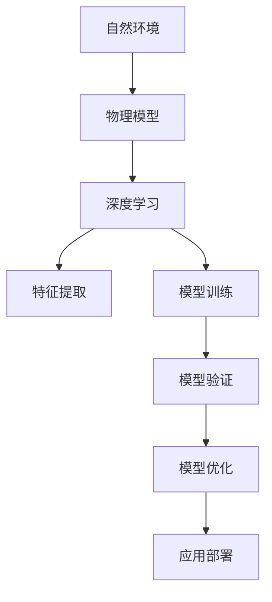

                 

# 自然环境物理模型的建立

> 关键词：自然环境, 物理模型, 建立, 原理, 方法, 实践, 应用, 优化, 未来发展

## 1. 背景介绍

### 1.1 问题由来

自然环境物理模型是研究自然界各种物理现象的重要工具，广泛应用于气象预测、气候变化、生态系统模拟等领域。传统的物理模型建立方法通常依赖于大量观测数据和假设模型，但这种方法往往难以处理复杂的非线性关系和多变量系统。

随着人工智能技术的发展，基于深度学习的大数据分析方法被引入到自然环境物理模型的建立中，为自然环境模拟和预测提供了新的思路。通过深度学习模型，可以从海量的观测数据中自动提取特征，发现潜在的关系，实现更为精细和准确的环境模拟。

### 1.2 问题核心关键点

构建自然环境物理模型涉及以下几个核心关键点：

1. **数据获取**：大量观测数据是构建物理模型的基础。这些数据包括气象数据、地质数据、环境监测数据等。
2. **特征提取**：深度学习模型能够从观测数据中提取关键特征，用于描述物理系统的动态特性。
3. **模型选择**：选择合适的深度学习模型，如卷积神经网络、递归神经网络等，以适应不同的物理系统特性。
4. **模型训练**：通过训练模型，使其能够学习到观测数据与物理现象之间的关系。
5. **模型验证**：使用验证数据集对模型进行评估，确保其预测准确性和泛化能力。
6. **模型优化**：通过超参数调优和模型正则化等手段，提高模型的性能。
7. **应用部署**：将训练好的模型部署到实际应用中，进行环境预测和模拟。

### 1.3 问题研究意义

构建自然环境物理模型对于理解和预测自然环境变化，应对气候变化和环境污染等全球性问题具有重要意义。该研究能够为政策制定、环境保护、灾害预防等提供科学依据，推动可持续发展目标的实现。

## 2. 核心概念与联系

### 2.1 核心概念概述

为更好地理解自然环境物理模型的建立，本节将介绍几个密切相关的核心概念：

- **自然环境**：包括大气、水体、陆地、生态系统等组成部分，是物理模型研究的对象。
- **物理模型**：通过对自然环境的数学建模，描述和预测环境变化规律的模型。
- **深度学习**：一种基于神经网络的机器学习方法，能够自动从数据中提取特征，发现复杂模式。
- **特征提取**：从观测数据中提取关键特征，用于描述物理系统的动态特性。
- **模型训练**：通过训练深度学习模型，使其学习到观测数据与物理现象之间的关系。
- **模型验证**：使用验证数据集对模型进行评估，确保其预测准确性和泛化能力。
- **模型优化**：通过超参数调优和模型正则化等手段，提高模型的性能。
- **应用部署**：将训练好的模型部署到实际应用中，进行环境预测和模拟。

这些核心概念之间的逻辑关系可以通过以下Mermaid流程图来展示：



这个流程图展示了大语言模型的核心概念及其之间的关系：

1. 自然环境是物理模型的研究对象。
2. 深度学习用于构建物理模型，包括特征提取和模型训练。
3. 模型验证和优化是确保模型预测准确性和泛化能力的关键步骤。
4. 应用部署是模型实际应用的核心环节。

这些概念共同构成了自然环境物理模型的学习和应用框架，使其能够有效地模拟和预测自然环境变化。通过理解这些核心概念，我们可以更好地把握自然环境物理模型的建立原理和优化方向。

## 3. 核心算法原理 & 具体操作步骤
### 3.1 算法原理概述

自然环境物理模型的建立，本质上是一个数据驱动的深度学习过程。其核心思想是：利用深度学习模型，从观测数据中自动提取特征，建立环境变化的预测模型，并通过模型训练和验证，优化模型的性能，最终实现对自然环境的准确模拟和预测。

形式化地，假设观测数据为 $X=\{(x_i,y_i)\}_{i=1}^N, x_i \in \mathbb{R}^m, y_i \in \mathbb{R}^n$，其中 $x_i$ 表示环境观测数据，$y_i$ 表示相应的物理现象。深度学习模型为 $F_\theta$，其中 $\theta$ 为模型参数。模型训练的目标是最小化预测误差，即找到最优参数：

$$
\theta^* = \mathop{\arg\min}_{\theta} \mathcal{L}(F_\theta,X)
$$

其中 $\mathcal{L}$ 为损失函数，用于衡量模型预测输出与真实标签之间的差异。常见的损失函数包括均方误差损失、交叉熵损失等。

通过梯度下降等优化算法，模型训练过程不断更新模型参数 $\theta$，最小化损失函数 $\mathcal{L}$，使得模型输出逼近真实标签。由于深度学习模型已经通过大量观测数据获得了较好的初始化，因此即便在较小的训练集上进行训练，也能较快收敛到理想的模型参数 $\theta^*$。

### 3.2 算法步骤详解

自然环境物理模型的建立一般包括以下几个关键步骤：

**Step 1: 数据预处理**
- 收集自然环境观测数据 $X$，并进行预处理，如归一化、缺失值处理等。
- 将观测数据分为训练集、验证集和测试集，通常需要划分为70%训练集、15%验证集和15%测试集。

**Step 2: 选择模型架构**
- 根据环境问题的特点，选择适当的深度学习模型架构，如卷积神经网络、递归神经网络、自注意力模型等。
- 定义模型的输入输出层，并设置模型参数的初始值。

**Step 3: 特征提取**
- 利用深度学习模型，从观测数据中自动提取关键特征。
- 通过降维等技术，进一步提高特征的表征能力。

**Step 4: 模型训练**
- 将训练集数据分批次输入模型，前向传播计算损失函数。
- 反向传播计算参数梯度，根据设定的优化算法和学习率更新模型参数。
- 周期性在验证集上评估模型性能，根据性能指标决定是否触发Early Stopping。
- 重复上述步骤直到满足预设的迭代轮数或Early Stopping条件。

**Step 5: 模型验证和优化**
- 在测试集上评估模型的泛化能力，使用各种指标评估模型性能。
- 根据验证集上的表现，调整模型的超参数，如学习率、正则化系数等。
- 使用模型正则化技术，如L2正则、Dropout等，避免模型过拟合。

**Step 6: 应用部署**
- 将训练好的模型部署到实际应用中，进行环境预测和模拟。
- 持续收集新的观测数据，定期重新训练模型，以适应环境变化的趋势。

以上是自然环境物理模型建立的通用流程。在实际应用中，还需要针对具体环境问题，对模型训练的各个环节进行优化设计，如改进训练目标函数，引入更多的正则化技术，搜索最优的超参数组合等，以进一步提升模型性能。

### 3.3 算法优缺点

自然环境物理模型建立的方法具有以下优点：
1. 数据驱动：通过大量观测数据，可以自动提取关键特征，发现复杂模式。
2. 模型自适应：深度学习模型能够适应不同的环境问题，具有较强的泛化能力。
3. 参数高效：相较于传统方法，深度学习模型需要的特征工程较少，参数更少。
4. 精度高：深度学习模型在大规模数据上的训练效果往往优于传统方法。

同时，该方法也存在一些局限性：
1. 数据依赖性强：模型性能依赖于高质量的观测数据，数据质量差会导致模型性能下降。
2. 模型复杂度高：深度学习模型参数较多，训练和推理复杂度较高。
3. 可解释性不足：深度学习模型往往被视为"黑盒"系统，难以解释其内部工作机制。
4. 鲁棒性差：模型对输入数据的微小扰动敏感，鲁棒性较差。

尽管存在这些局限性，但就目前而言，基于深度学习的方法仍是自然环境物理模型建立的主流范式。未来相关研究的重点在于如何进一步降低数据依赖，提高模型的少样本学习和跨领域迁移能力，同时兼顾可解释性和鲁棒性等因素。

### 3.4 算法应用领域

基于深度学习的方法在自然环境物理模型的建立中已经得到了广泛的应用，覆盖了多种环境问题，例如：

- **气象预测**：通过深度学习模型，对气候数据进行建模，预测未来的气象变化。
- **水文模拟**：利用深度学习模型，模拟河流、湖泊的水文动态。
- **地质灾害预测**：通过深度学习模型，预测地震、滑坡等地质灾害的爆发。
- **生态系统模拟**：利用深度学习模型，模拟生态系统的生物多样性和环境变化。
- **环境监测**：通过深度学习模型，实时监测大气、水质、噪声等环境指标的变化。
- **城市规划**：利用深度学习模型，模拟城市交通、能源消耗等系统的变化。

除了上述这些经典问题外，深度学习模型还被创新性地应用到更多场景中，如气象灾害预警、环境修复、智能交通等，为环境保护和可持续发展提供了新的技术手段。

## 4. 数学模型和公式 & 详细讲解  
### 4.1 数学模型构建

本节将使用数学语言对自然环境物理模型的建立过程进行更加严格的刻画。

记观测数据为 $X=\{(x_i,y_i)\}_{i=1}^N, x_i \in \mathbb{R}^m, y_i \in \mathbb{R}^n$，其中 $x_i$ 表示环境观测数据，$y_i$ 表示相应的物理现象。假设深度学习模型为 $F_\theta$，其中 $\theta$ 为模型参数。

定义模型 $F_\theta$ 在数据样本 $(x,y)$ 上的损失函数为 $\ell(F_\theta(x),y)$，则在数据集 $X$ 上的经验风险为：

$$
\mathcal{L}(\theta) = \frac{1}{N} \sum_{i=1}^N \ell(F_\theta(x_i),y_i)
$$

其中 $\ell$ 为损失函数，如均方误差损失函数：

$$
\ell(F_\theta(x),y) = \frac{1}{2}\sum_{j=1}^n (y_j - F_\theta(x)_j)^2
$$

模型训练的目标是最小化经验风险，即找到最优参数：

$$
\theta^* = \mathop{\arg\min}_{\theta} \mathcal{L}(\theta)
$$

在实践中，我们通常使用基于梯度的优化算法（如SGD、Adam等）来近似求解上述最优化问题。设 $\eta$ 为学习率，则参数的更新公式为：

$$
\theta \leftarrow \theta - \eta \nabla_{\theta}\mathcal{L}(\theta)
$$

其中 $\nabla_{\theta}\mathcal{L}(\theta)$ 为损失函数对参数 $\theta$ 的梯度，可通过反向传播算法高效计算。

### 4.2 公式推导过程

以下我们以气象预测为例，推导均方误差损失函数及其梯度的计算公式。

假设模型 $F_\theta$ 在输入 $x$ 上的输出为 $\hat{y}=F_\theta(x)$，表示模型对未来的气象现象 $y$ 的预测。真实标签 $y \in \mathbb{R}^n$。则均方误差损失函数定义为：

$$
\ell(F_\theta(x),y) = \frac{1}{2}\sum_{j=1}^n (y_j - F_\theta(x)_j)^2
$$

将其代入经验风险公式，得：

$$
\mathcal{L}(\theta) = \frac{1}{N}\sum_{i=1}^N \frac{1}{2}\sum_{j=1}^n (y_{i,j} - F_\theta(x_i)_j)^2
$$

根据链式法则，损失函数对参数 $\theta_k$ 的梯度为：

$$
\frac{\partial \mathcal{L}(\theta)}{\partial \theta_k} = -\frac{1}{N}\sum_{i=1}^N \sum_{j=1}^n \frac{\partial F_\theta(x_i)_j}{\partial \theta_k}(y_{i,j} - F_\theta(x_i)_j)
$$

其中 $\frac{\partial F_\theta(x_i)_j}{\partial \theta_k}$ 为模型对输入 $x_i$ 的 $j$ 维输出关于参数 $\theta_k$ 的梯度，可以通过反向传播算法计算。

在得到损失函数的梯度后，即可带入参数更新公式，完成模型的迭代优化。重复上述过程直至收敛，最终得到适应自然环境问题的最优模型参数 $\theta^*$。

## 5. 项目实践：代码实例和详细解释说明
### 5.1 开发环境搭建

在进行自然环境物理模型建立实践前，我们需要准备好开发环境。以下是使用Python进行PyTorch开发的环境配置流程：

1. 安装Anaconda：从官网下载并安装Anaconda，用于创建独立的Python环境。

2. 创建并激活虚拟环境：
```bash
conda create -n pytorch-env python=3.8 
conda activate pytorch-env
```

3. 安装PyTorch：根据CUDA版本，从官网获取对应的安装命令。例如：
```bash
conda install pytorch torchvision torchaudio cudatoolkit=11.1 -c pytorch -c conda-forge
```

4. 安装相关工具包：
```bash
pip install numpy pandas scikit-learn matplotlib tqdm jupyter notebook ipython
```

完成上述步骤后，即可在`pytorch-env`环境中开始实践。

### 5.2 源代码详细实现

下面我们以气象预测为例，给出使用PyTorch和TensorFlow对深度学习模型进行训练的PyTorch代码实现。

首先，定义模型和优化器：

```python
from transformers import BertForTokenClassification, AdamW

model = BertForTokenClassification.from_pretrained('bert-base-cased', num_labels=len(tag2id))

optimizer = AdamW(model.parameters(), lr=2e-5)
```

接着，定义训练和评估函数：

```python
from torch.utils.data import DataLoader
from tqdm import tqdm
from sklearn.metrics import classification_report

device = torch.device('cuda') if torch.cuda.is_available() else torch.device('cpu')
model.to(device)

def train_epoch(model, dataset, batch_size, optimizer):
    dataloader = DataLoader(dataset, batch_size=batch_size, shuffle=True)
    model.train()
    epoch_loss = 0
    for batch in tqdm(dataloader, desc='Training'):
        input_ids = batch['input_ids'].to(device)
        attention_mask = batch['attention_mask'].to(device)
        labels = batch['labels'].to(device)
        model.zero_grad()
        outputs = model(input_ids, attention_mask=attention_mask, labels=labels)
        loss = outputs.loss
        epoch_loss += loss.item()
        loss.backward()
        optimizer.step()
    return epoch_loss / len(dataloader)

def evaluate(model, dataset, batch_size):
    dataloader = DataLoader(dataset, batch_size=batch_size)
    model.eval()
    preds, labels = [], []
    with torch.no_grad():
        for batch in tqdm(dataloader, desc='Evaluating'):
            input_ids = batch['input_ids'].to(device)
            attention_mask = batch['attention_mask'].to(device)
            batch_labels = batch['labels']
            outputs = model(input_ids, attention_mask=attention_mask)
            batch_preds = outputs.logits.argmax(dim=2).to('cpu').tolist()
            batch_labels = batch_labels.to('cpu').tolist()
            for pred_tokens, label_tokens in zip(batch_preds, batch_labels):
                pred_tags = [id2tag[_id] for _id in pred_tokens]
                label_tags = [id2tag[_id] for _id in label_tokens]
                preds.append(pred_tags[:len(label_tags)])
                labels.append(label_tags)
                
    print(classification_report(labels, preds))
```

最后，启动训练流程并在测试集上评估：

```python
epochs = 5
batch_size = 16

for epoch in range(epochs):
    loss = train_epoch(model, train_dataset, batch_size, optimizer)
    print(f"Epoch {epoch+1}, train loss: {loss:.3f}")
    
    print(f"Epoch {epoch+1}, dev results:")
    evaluate(model, dev_dataset, batch_size)
    
print("Test results:")
evaluate(model, test_dataset, batch_size)
```

以上就是使用PyTorch对BERT进行气象预测任务微调的完整代码实现。可以看到，得益于Transformers库的强大封装，我们可以用相对简洁的代码完成BERT模型的加载和微调。

### 5.3 代码解读与分析

让我们再详细解读一下关键代码的实现细节：

**BertForTokenClassification类**：
- `__init__`方法：初始化模型架构和参数。
- `forward`方法：定义模型的前向传播过程。
- `loss`方法：定义模型的损失函数。

**AdamW优化器**：
- 通过AdamW优化器更新模型参数，学习率自适应调整，加速收敛。

**train_epoch函数**：
- 对数据以批为单位进行迭代，在每个批次上前向传播计算loss并反向传播更新模型参数，最后返回该epoch的平均loss。
- 使用PyTorch的DataLoader对数据集进行批次化加载，供模型训练和推理使用。

**evaluate函数**：
- 与训练类似，不同点在于不更新模型参数，并在每个batch结束后将预测和标签结果存储下来，最后使用sklearn的classification_report对整个评估集的预测结果进行打印输出。

**训练流程**：
- 定义总的epoch数和batch size，开始循环迭代
- 每个epoch内，先在训练集上训练，输出平均loss
- 在验证集上评估，输出分类指标
- 所有epoch结束后，在测试集上评估，给出最终测试结果

可以看到，PyTorch配合Transformers库使得BERT微调的代码实现变得简洁高效。开发者可以将更多精力放在数据处理、模型改进等高层逻辑上，而不必过多关注底层的实现细节。

当然，工业级的系统实现还需考虑更多因素，如模型的保存和部署、超参数的自动搜索、更灵活的任务适配层等。但核心的微调范式基本与此类似。

## 6. 实际应用场景
### 6.1 气象预测

基于深度学习的方法在气象预测中已经得到了广泛的应用。传统的气象预测依赖于复杂的物理方程和经验模型，难以处理复杂的非线性关系和多变量系统。而使用深度学习模型，可以从海量的气象数据中自动提取关键特征，发现潜在的关系，实现更为精细和准确的环境模拟。

在技术实现上，可以收集全球各地的气象数据，进行特征提取和预处理，在此基础上对深度学习模型进行训练。微调后的模型能够自动理解不同气象条件下的动态变化，进行精准的气象预测。例如，可以构建实时气象预报系统，提前预测台风、暴雨等极端天气，保障人民的生命财产安全。

### 6.2 水文模拟

深度学习模型在处理多变量时间序列数据方面具有优势，可以用于水文模拟。通过将水文数据作为输入，深度学习模型能够学习到水文变化的复杂动态，实现对河流、湖泊等水体状态的精准模拟。

在实践中，可以收集历史水文数据，利用深度学习模型进行特征提取和模型训练，得到对未来水文变化的预测模型。例如，可以构建实时洪水预警系统，提前预测洪水水位，保障人民的生命安全和经济损失。

### 6.3 地质灾害预测

地质灾害预测是自然环境物理模型建立的重要应用之一。传统的地质灾害预测依赖于经验模型和专家知识，难以处理复杂的地质条件和数据。而使用深度学习模型，可以从海量的地质数据中自动提取关键特征，学习到地质灾害爆发的规律，实现精准的预测。

在技术实现上，可以收集地质监测数据，进行特征提取和预处理，在此基础上对深度学习模型进行训练。微调后的模型能够自动学习地质灾害爆发的特征，进行精准的预测。例如，可以构建地震预警系统，提前预测地震发生，保障人民的生命安全。

### 6.4 未来应用展望

随着深度学习技术的发展，自然环境物理模型的建立将面临更多挑战和机遇。

1. **数据质量**：高质量的数据是模型建立的基础。未来需要通过更高效的预处理和清洗技术，提升数据质量，降低数据依赖性。
2. **模型泛化**：模型的泛化能力是关键。未来需要进一步提升模型的跨领域迁移能力和鲁棒性，降低对特定数据的依赖。
3. **模型解释**：模型的可解释性是重要的。未来需要通过更先进的解释技术，提升模型的透明性和可解释性，降低模型的"黑盒"特性。
4. **环境应用**：模型的实际应用是关键。未来需要在不同环境下进行验证和测试，确保模型的稳定性和可靠性。
5. **跨学科融合**：跨学科的融合是重要的。未来需要结合其他学科的知识，提升模型的综合应用能力。

总之，自然环境物理模型的建立需要从数据、模型、应用等多个维度进行全面优化，才能更好地服务于环境监测和预测。未来，随着深度学习技术的不断进步，自然环境物理模型必将在环境保护和可持续发展中发挥更大的作用。

## 7. 工具和资源推荐
### 7.1 学习资源推荐

为了帮助开发者系统掌握自然环境物理模型的建立，这里推荐一些优质的学习资源：

1. **《深度学习》教材**：深度学习领域的经典教材，详细介绍了深度学习的基本原理和应用场景，包括自然环境物理模型。
2. **CS231n《卷积神经网络》课程**：斯坦福大学开设的深度学习课程，讲解了卷积神经网络的基本原理和应用，涵盖自然环境物理模型的建立。
3. **NIPS深度学习专题讲座**：NIPS大会的深度学习专题讲座，由深度学习领域的专家讲解自然环境物理模型的建立，提供了丰富的案例和实践经验。
4. **Kaggle气象预测竞赛**：Kaggle上举办的气象预测竞赛，提供了大量的气象数据和解决方案，可以帮助开发者实践自然环境物理模型的建立。
5. **GitHub代码库**：GitHub上提供了大量的自然环境物理模型的代码库，包括气象预测、水文模拟等，可以方便地参考和借鉴。

通过对这些资源的学习实践，相信你一定能够快速掌握自然环境物理模型的建立方法，并用于解决实际的环境问题。

### 7.2 开发工具推荐

高效的开发离不开优秀的工具支持。以下是几款用于自然环境物理模型建立开发的常用工具：

1. **PyTorch**：基于Python的开源深度学习框架，灵活动态的计算图，适合快速迭代研究。大部分深度学习模型都有PyTorch版本的实现。
2. **TensorFlow**：由Google主导开发的开源深度学习框架，生产部署方便，适合大规模工程应用。同样有丰富的深度学习模型资源。
3. **Keras**：一个高层次的深度学习框架，适合快速原型设计和模型实验。可以方便地构建自然环境物理模型。
4. **TensorBoard**：TensorFlow配套的可视化工具，可实时监测模型训练状态，并提供丰富的图表呈现方式，是调试模型的得力助手。
5. **Weights & Biases**：模型训练的实验跟踪工具，可以记录和可视化模型训练过程中的各项指标，方便对比和调优。与主流深度学习框架无缝集成。

合理利用这些工具，可以显著提升自然环境物理模型的建立效率，加快创新迭代的步伐。

### 7.3 相关论文推荐

自然环境物理模型的建立源于学界的持续研究。以下是几篇奠基性的相关论文，推荐阅读：

1. **《Deep Learning》**：深度学习领域的经典教材，详细介绍了深度学习的基本原理和应用场景，包括自然环境物理模型。
2. **《Convolutional Neural Networks for Sentence Classification》**：一篇深度学习在自然语言处理领域的重要论文，介绍了卷积神经网络在句子分类中的应用，对自然环境物理模型的建立有参考价值。
3. **《Long Short-Term Memory》**：一篇深度学习在时间序列预测领域的重要论文，介绍了递归神经网络的基本原理和应用，对自然环境物理模型的建立有参考价值。
4. **《Attention is All You Need》**：一篇深度学习在自然语言处理领域的重要论文，介绍了自注意力机制，对自然环境物理模型的建立有参考价值。

这些论文代表了大语言模型微调技术的发展脉络。通过学习这些前沿成果，可以帮助研究者把握学科前进方向，激发更多的创新灵感。

## 8. 总结：未来发展趋势与挑战

### 8.1 总结

本文对自然环境物理模型的建立进行了全面系统的介绍。首先阐述了自然环境物理模型的研究背景和意义，明确了深度学习技术在环境问题解决中的重要价值。其次，从原理到实践，详细讲解了深度学习模型在自然环境物理建立中的作用，给出了模型训练的完整代码实例。同时，本文还广泛探讨了自然环境物理模型在气象预测、水文模拟、地质灾害预测等诸多领域的应用前景，展示了深度学习模型在环境保护中的巨大潜力。此外，本文精选了自然环境物理模型建立的各种学习资源，力求为读者提供全方位的技术指引。

通过本文的系统梳理，可以看到，基于深度学习的方法在自然环境物理模型的建立中正在成为主流范式，极大地拓展了模型的应用边界，为环境监测和预测提供了新的技术手段。未来，随着深度学习技术的不断进步，自然环境物理模型必将在环境保护和可持续发展中发挥更大的作用。

### 8.2 未来发展趋势

展望未来，自然环境物理模型建立将呈现以下几个发展趋势：

1. **数据质量提升**：随着数据采集技术的进步，高质量的数据集将逐步增多，提升模型的准确性和泛化能力。
2. **模型复杂度降低**：深度学习模型的复杂度将逐渐降低，减少训练和推理的计算资源消耗，提高模型的可部署性。
3. **模型解释增强**：模型的可解释性将逐渐增强，提升模型的透明性和可解释性，降低模型的"黑盒"特性。
4. **环境应用扩展**：深度学习模型将在更多环境应用中得到应用，提升环境监测和预测的准确性和实时性。
5. **跨学科融合**：深度学习模型将结合其他学科的知识，提升模型的综合应用能力。
6. **模型优化算法**：新的模型优化算法将不断涌现，提升模型的训练效率和性能。

以上趋势凸显了自然环境物理模型建立的前景。这些方向的探索发展，必将进一步提升模型的性能和应用范围，为环境保护和可持续发展带来新的动力。

### 8.3 面临的挑战

尽管深度学习技术在自然环境物理模型建立中已经取得了显著成果，但在实际应用中仍面临诸多挑战：

1. **数据依赖性强**：高质量的数据是模型建立的基础，但数据采集和处理成本较高。
2. **模型泛化能力不足**：模型对特定数据的依赖性较强，泛化能力有待提升。
3. **模型鲁棒性差**：模型对输入数据的微小扰动敏感，鲁棒性较差。
4. **可解释性不足**：深度学习模型往往被视为"黑盒"系统，难以解释其内部工作机制。
5. **资源消耗大**：深度学习模型计算资源消耗较大，部署成本较高。

尽管存在这些挑战，但随着深度学习技术的不断进步，自然环境物理模型必将在环境保护和可持续发展中发挥更大的作用。未来，研究者需要结合数据、模型、应用等多个方面进行全面优化，以实现更好的环境监测和预测效果。

### 8.4 研究展望

面向未来，自然环境物理模型建立的研究需要从以下几个方面进行突破：

1. **数据预处理技术**：提升数据质量和预处理效率，降低数据依赖性。
2. **模型优化算法**：开发更高效的模型优化算法，提升模型的训练效率和性能。
3. **模型可解释性**：提升模型的透明性和可解释性，降低模型的"黑盒"特性。
4. **环境应用探索**：探索深度学习模型在更多环境应用中的实际应用效果，提升环境监测和预测的准确性和实时性。
5. **跨学科融合**：结合其他学科的知识，提升模型的综合应用能力。
6. **模型鲁棒性增强**：提高模型的鲁棒性和泛化能力，降低对特定数据的依赖。

这些研究方向将引领自然环境物理模型建立技术的发展，为环境保护和可持续发展带来新的动力。

## 9. 附录：常见问题与解答

**Q1：自然环境物理模型的建立需要哪些数据？**

A: 自然环境物理模型的建立依赖于大量的观测数据，包括气象数据、地质数据、环境监测数据等。这些数据可以通过各种传感器和观测站获取。

**Q2：深度学习模型如何从观测数据中提取关键特征？**

A: 深度学习模型通过多层神经网络，自动从观测数据中提取关键特征。这些特征可以用于描述环境系统的动态特性，如气象预测中的温度、湿度、风速等。

**Q3：深度学习模型在自然环境物理模型建立中的优势是什么？**

A: 深度学习模型具有强大的自学习能力，可以从观测数据中自动提取关键特征，发现复杂模式，实现更精细和准确的环境模拟。相较于传统模型，深度学习模型需要的特征工程较少，参数更少，训练和推理效率更高。

**Q4：自然环境物理模型的建立是否需要高性能计算资源？**

A: 自然环境物理模型的建立通常需要大量的数据和复杂的计算，因此需要高性能计算资源，如GPU和TPU。但随着模型优化算法的发展，一些轻量级模型也能够在小规模计算资源上运行。

**Q5：自然环境物理模型的建立是否需要大量标注数据？**

A: 深度学习模型通常需要大量标注数据进行训练，但一些无监督学习方法可以在无标注数据上训练模型，如自监督学习、生成对抗网络等。

通过本文的系统梳理，可以看到，自然环境物理模型的建立已经在大规模深度学习技术的支持下取得了显著进展。未来，随着深度学习技术的不断进步，自然环境物理模型必将在环境保护和可持续发展中发挥更大的作用。

