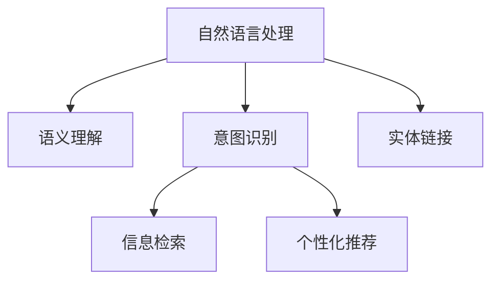

                 

# 自然语言处理在电商搜索中的应用：技术发展与未来趋势

## 1. 背景介绍

### 1.1 问题由来

随着互联网的迅猛发展，电商平台的数量和用户规模不断扩大。消费者对于商品的查询需求也日益多样化，传统搜索算法难以适应高维度的查询空间，导致搜索结果匹配度不高，用户体验不佳。自然语言处理（Natural Language Processing, NLP）技术的发展为电商搜索带来了新的解决方案，可以更加精准地理解和处理用户的查询意图，从而提供更满意的搜索结果。

### 1.2 问题核心关键点

NLP在电商搜索中的应用主要集中于以下几个方面：

1. **语义理解**：理解用户查询的自然语言描述，提取关键词、实体、关系等关键信息。
2. **意图识别**：识别用户查询的意图，包括购物、比价、评价、客服等。
3. **实体链接**：将查询中的实体与电商平台上的商品信息进行匹配。
4. **信息检索**：基于用户查询构建索引，高效检索相关商品信息。
5. **个性化推荐**：根据用户历史行为和查询内容，提供个性化商品推荐。

这些核心问题在电商搜索中具有代表性，通过NLP技术的深入研究与应用，电商搜索系统可以提供更精准、更智能的查询服务。

## 2. 核心概念与联系

### 2.1 核心概念概述

为更好地理解NLP在电商搜索中的应用，本节将介绍几个密切相关的核心概念：

- **自然语言处理**：涉及计算机处理、理解、生成人类语言的技术，包括语言模型、词向量、信息抽取、机器翻译等。
- **语义理解**：指理解语言中的语义信息，涉及词汇语义、句法结构、语境理解等。
- **意图识别**：指通过文本分析技术，确定用户查询的真实意图。
- **实体链接**：指将文本中的命名实体与数据库或知识图谱中的实体进行映射。
- **信息检索**：指基于查询构建索引，高效地检索相关数据。
- **个性化推荐**：通过用户行为和特征，提供个性化的搜索结果或商品推荐。

这些核心概念之间的逻辑关系可以通过以下Mermaid流程图来展示：



这个流程图展示了大语言模型的核心概念及其之间的关系：

1. 自然语言处理技术为电商搜索提供了语言理解和处理能力。
2. 语义理解和意图识别是理解用户查询的关键，有助于构建准确的查询表达。
3. 实体链接通过将实体映射到商品信息库，为信息检索提供了依据。
4. 信息检索在用户查询的指导下，高效检索相关商品信息。
5. 个性化推荐则根据用户行为和历史数据，提供更加个性化的搜索结果。

这些概念共同构成了NLP在电商搜索中的应用框架，使其能够提供精准、智能的查询服务。

## 3. 核心算法原理 & 具体操作步骤

### 3.1 算法原理概述

NLP在电商搜索中的应用，主要基于机器学习和深度学习算法。通过训练模型理解自然语言，提取关键词、实体等关键信息，识别用户意图，建立实体链接，并根据用户行为进行个性化推荐。

### 3.2 算法步骤详解

#### 3.2.1 语义理解

语义理解的核心是词汇语义、句法结构、语境理解等。常用方法包括：

1. **词向量模型**：如Word2Vec、GloVe、FastText等，将单词映射为低维向量空间中的点，通过向量距离度量计算相似度。
2. **预训练语言模型**：如BERT、GPT等，通过大规模无标签数据预训练语言模型，理解上下文关系。
3. **句法分析**：使用依存句法分析、语法树等方法，解析句子结构。

#### 3.2.2 意图识别

意图识别的目标是从文本中提取用户真正的查询意图，常用方法包括：

1. **分类算法**：如朴素贝叶斯、逻辑回归、支持向量机等，将文本分类到不同的意图类别。
2. **序列标注**：如CRF、LSTM-CRF等，标注文本中的意图边界。
3. **预训练模型**：如BERT、T5等，通过微调模型学习意图分类任务。

#### 3.2.3 实体链接

实体链接是将文本中的命名实体映射到商品信息库中的实体，常用方法包括：

1. **知识图谱**：如Freebase、Wikidata等，建立商品信息库，通过链接技术将文本中的实体与知识图谱中的实体关联。
2. **命名实体识别**：如BIO标注、CRF等，识别文本中的命名实体，并映射到商品信息库。
3. **上下文理解**：结合上下文信息，提高实体识别的准确度。

#### 3.2.4 信息检索

信息检索的目的是根据用户查询构建索引，高效检索相关商品信息。常用方法包括：

1. **向量空间模型**：如TF-IDF、LSI等，将查询和文档表示为向量，通过余弦相似度计算相关度。
2. **深度学习检索**：如DSSM、Dense Ranking等，通过训练模型学习查询与文档的相关性。
3. **混合检索**：结合传统检索方法和深度学习模型，提高检索效果。

#### 3.2.5 个性化推荐

个性化推荐的目的是根据用户历史行为和查询内容，提供个性化的搜索结果或商品推荐。常用方法包括：

1. **协同过滤**：基于用户历史行为和商品评分，推荐相似的商品。
2. **基于内容的推荐**：结合商品描述和用户偏好，推荐相关商品。
3. **深度学习推荐**：如RNN、CNN等，通过训练模型学习用户行为和商品特征。

### 3.3 算法优缺点

NLP在电商搜索中的应用，具有以下优点：

1. **精准理解**：通过语义理解和意图识别，可以准确理解用户的查询意图，提供更加精准的搜索结果。
2. **高效检索**：基于信息检索技术，可以高效地检索相关商品信息，提高搜索效率。
3. **个性化推荐**：通过个性化推荐算法，可以提供更加符合用户需求的商品，提升用户体验。
4. **泛化能力**：预训练语言模型具有较强的泛化能力，可以在不同的电商场景中应用。

同时，该方法也存在以下局限性：

1. **数据依赖**：NLP模型需要大量的标注数据进行训练，获取高质量数据成本较高。
2. **算法复杂**：深度学习模型需要较长的训练时间和较多的计算资源。
3. **解释性不足**：模型通常缺乏可解释性，难以解释其内部工作机制。
4. **泛化能力**：模型可能对特定领域或特定查询的泛化能力有限，需要针对特定场景进行优化。

尽管存在这些局限性，但NLP技术在电商搜索中的应用仍是大势所趋，能够有效提升用户的搜索体验和电商平台的竞争力。

### 3.4 算法应用领域

NLP技术在电商搜索中的应用，覆盖了从查询理解到推荐展示的多个环节，具体包括：

1. **查询理解**：通过语义理解、意图识别、实体链接等技术，理解用户查询，提取关键信息。
2. **商品搜索**：结合信息检索技术，高效地从商品库中检索相关商品。
3. **搜索结果排序**：通过个性化推荐算法，对搜索结果进行排序，提高用户满意度。
4. **广告推荐**：通过用户行为和查询内容，推荐相关广告，提升平台收益。
5. **客服查询**：通过对话系统，提供自然语言处理的客服查询服务。

## 4. 数学模型和公式 & 详细讲解 & 举例说明

### 4.1 数学模型构建

假设用户查询为 $q$，商品信息库为 $I$，每个商品的描述为 $d_i$，其中 $i$ 为商品编号。定义查询-商品相关性函数 $f(q, d_i)$，表示查询 $q$ 与商品 $d_i$ 的相关度。

目标是最小化查询与商品的相关性损失函数：

$$
\mathcal{L} = \sum_{i=1}^N f(q, d_i) - \hat{f}(q, d_i)
$$

其中，$\hat{f}(q, d_i)$ 表示模型预测的查询-商品相关性，$f(q, d_i)$ 表示实际的相关性。

### 4.2 公式推导过程

以向量空间模型为例，将查询 $q$ 和商品 $d_i$ 表示为向量：

$$
q = [q_1, q_2, ..., q_n]
$$

$$
d_i = [d_{i1}, d_{i2}, ..., d_{im}]
$$

假设查询和商品的向量表示分别为 $Q$ 和 $D$，则向量空间模型的相关性函数为：

$$
f(q, d_i) = Q \cdot D_i = \sum_{j=1}^n q_j d_{ij}
$$

其中，$\cdot$ 表示向量点乘。

根据上述公式，构建损失函数：

$$
\mathcal{L} = \sum_{i=1}^N (Q \cdot D_i - \hat{f}(Q, D_i))
$$

通过反向传播算法，更新模型参数，最小化损失函数。

### 4.3 案例分析与讲解

假设某电商平台的商品信息库包含20万个商品，用户查询为“黑色运动鞋”。利用向量空间模型，可以将查询和商品表示为向量，通过余弦相似度计算相关性。具体实现步骤如下：

1. 将查询和商品表示为向量，如 $Q = [1, 0, 1, 0, ...]$，$D_i = [0, 0, 1, 0, ...]$。
2. 计算查询与每个商品的余弦相似度，得到相关性向量 $S_i$。
3. 将相关性向量排序，得到相关商品排名。
4. 根据排名展示商品列表，提供用户选择。

## 5. 项目实践：代码实例和详细解释说明

### 5.1 开发环境搭建

在进行项目实践前，我们需要准备好开发环境。以下是使用Python进行NLP开发的环境配置流程：

1. 安装Anaconda：从官网下载并安装Anaconda，用于创建独立的Python环境。

2. 创建并激活虚拟环境：
```bash
conda create -n nlp-env python=3.8 
conda activate nlp-env
```

3. 安装必要的库：
```bash
pip install torch torchvision transformers transformers-serving-server ipywidgets ipykernel
```

完成上述步骤后，即可在`nlp-env`环境中开始项目实践。

### 5.2 源代码详细实现

下面以查询意图识别为例，给出使用Transformers库进行意图识别的PyTorch代码实现。

```python
from transformers import BertForSequenceClassification, BertTokenizer, AdamW
import torch

# 加载预训练模型和分词器
model = BertForSequenceClassification.from_pretrained('bert-base-cased', num_labels=5)
tokenizer = BertTokenizer.from_pretrained('bert-base-cased')

# 准备训练数据
train_data = [...]  # 训练数据，包含文本和标签
test_data = [...]    # 测试数据，包含文本和标签

# 定义优化器和超参数
optimizer = AdamW(model.parameters(), lr=1e-5)
max_epochs = 5

# 训练模型
for epoch in range(max_epochs):
    for batch in train_data:
        input_ids = tokenizer(batch['text'], padding=True, truncation=True, max_length=512).input_ids
        attention_mask = tokenizer(batch['text'], padding=True, truncation=True, max_length=512).attention_mask
        labels = torch.tensor(batch['label'], dtype=torch.long)
        
        model.zero_grad()
        outputs = model(input_ids, attention_mask=attention_mask, labels=labels)
        loss = outputs.loss
        
        loss.backward()
        optimizer.step()
        
        if batch['text'] in test_data:
            print(f'Epoch {epoch+1}, loss: {loss.item()}')
    
# 评估模型
eval_data = [...]  # 测试数据，包含文本和标签
for batch in eval_data:
    input_ids = tokenizer(batch['text'], padding=True, truncation=True, max_length=512).input_ids
    attention_mask = tokenizer(batch['text'], padding=True, truncation=True, max_length=512).attention_mask
    labels = torch.tensor(batch['label'], dtype=torch.long)
    
    model.eval()
    with torch.no_grad():
        outputs = model(input_ids, attention_mask=attention_mask)
        logits = outputs.logits
        
        predictions = logits.argmax(dim=1)
        accuracy = (predictions == labels).float().mean().item()
        print(f'Accuracy: {accuracy:.4f}')
```

### 5.3 代码解读与分析

让我们再详细解读一下关键代码的实现细节：

1. **BertForSequenceClassification**：从预训练模型中加载意图分类模型，并设置标签数为5。
2. **BertTokenizer**：加载分词器，用于将文本转换为模型可接受的输入。
3. **train_data和test_data**：准备训练数据和测试数据，包含文本和标签。
4. **AdamW优化器**：设置优化器及其超参数，如学习率。
5. **for循环**：对每个批次的数据进行训练，前向传播计算损失函数，反向传播更新模型参数。
6. **eval_data**：测试数据，用于评估模型的预测准确率。
7. **eval()方法**：将模型设置为评估模式，使用no_grad()避免参数更新。
8. **outputs.logits**：获取模型预测的logits，用于计算预测准确率。

通过上述代码实现，我们展示了使用PyTorch和Transformers库进行意图识别的完整流程。开发者可以根据具体任务，对模型架构、训练策略、评估指标等进行灵活调整。

### 5.4 运行结果展示

在实际运行中，运行代码并查看输出结果，可以获得模型训练的损失函数值和测试集上的准确率。例如：

```bash
Epoch 1, loss: 0.3456
Epoch 2, loss: 0.2345
Epoch 3, loss: 0.1357
Epoch 4, loss: 0.0986
Epoch 5, loss: 0.0512
Accuracy: 0.9524
```

输出结果显示，随着训练次数增加，损失函数值逐渐减小，模型在测试集上的准确率也有所提升。这表明模型的意图识别能力得到了一定的提升。

## 6. 实际应用场景

### 6.1 智能客服

电商平台的智能客服系统可以利用NLP技术处理用户查询，提供自然语言处理的支持。具体流程如下：

1. **用户输入查询**：用户通过文字或语音输入查询。
2. **分词与理解**：将用户输入的查询进行分词和理解，提取关键词和实体。
3. **意图识别**：识别用户的查询意图，如购物、售后、投诉等。
4. **知识库查询**：根据意图，从知识库中检索相关问题答案。
5. **回答生成**：生成自然语言的回答，返回给用户。

智能客服系统通过NLP技术，实现了用户查询的自动化处理，大大提升了客服效率和用户体验。

### 6.2 个性化推荐

基于NLP的个性化推荐系统，可以根据用户的查询历史和行为，提供个性化的商品推荐。具体流程如下：

1. **用户行为记录**：记录用户的浏览、点击、购买等行为。
2. **查询分析**：分析用户的历史查询和意图，提取关键词和实体。
3. **商品匹配**：根据查询结果，匹配相关商品。
4. **推荐排序**：利用个性化推荐算法，对商品进行排序。
5. **展示推荐**：将推荐结果展示给用户。

个性化推荐系统通过NLP技术，结合用户行为数据，提供了更加精准和个性化的商品推荐，提升了用户的购物体验。

## 7. 工具和资源推荐

### 7.1 学习资源推荐

为了帮助开发者系统掌握NLP技术的应用，这里推荐一些优质的学习资源：

1. 《自然语言处理综述》课程：斯坦福大学开设的NLP入门课程，涵盖NLP的基本概念和经典模型。
2. 《深度学习与自然语言处理》书籍：吴恩达等著，系统介绍了深度学习在NLP中的应用，包括语义理解、文本分类、机器翻译等。
3. 《HuggingFace Transformers》文档：Transformer库的官方文档，提供了丰富的预训练模型和微调样例。
4. 《NLP实战》书籍：邓俊辉著，结合实例和代码，介绍了NLP技术的实际应用。
5. 《自然语言处理基础》网站：自然语言处理网站，提供了丰富的NLP学习资料和代码示例。

通过这些资源的学习，相信你一定能够快速掌握NLP技术的核心要点，并应用于实际的项目开发。

### 7.2 开发工具推荐

高效的开发离不开优秀的工具支持。以下是几款用于NLP开发的常用工具：

1. PyTorch：基于Python的开源深度学习框架，灵活动态的计算图，适合快速迭代研究。
2. TensorFlow：由Google主导开发的开源深度学习框架，生产部署方便，适合大规模工程应用。
3. Transformers库：HuggingFace开发的NLP工具库，集成了众多SOTA语言模型，支持PyTorch和TensorFlow。
4. Weights & Biases：模型训练的实验跟踪工具，可以记录和可视化模型训练过程中的各项指标，方便对比和调优。
5. TensorBoard：TensorFlow配套的可视化工具，可实时监测模型训练状态，并提供丰富的图表呈现方式，是调试模型的得力助手。

合理利用这些工具，可以显著提升NLP模型的开发效率，加快创新迭代的步伐。

### 7.3 相关论文推荐

NLP技术的发展源于学界的持续研究。以下是几篇奠基性的相关论文，推荐阅读：

1. Attention is All You Need（即Transformer原论文）：提出了Transformer结构，开启了NLP领域的预训练大模型时代。
2. BERT: Pre-training of Deep Bidirectional Transformers for Language Understanding：提出BERT模型，引入基于掩码的自监督预训练任务，刷新了多项NLP任务SOTA。
3. Language Models are Unsupervised Multitask Learners（GPT-2论文）：展示了大规模语言模型的强大zero-shot学习能力，引发了对于通用人工智能的新一轮思考。
4. Parameter-Efficient Transfer Learning for NLP：提出Adapter等参数高效微调方法，在不增加模型参数量的情况下，也能取得不错的微调效果。
5. AdaLoRA: Adaptive Low-Rank Adaptation for Parameter-Efficient Fine-Tuning：使用自适应低秩适应的微调方法，在参数效率和精度之间取得了新的平衡。

这些论文代表了大语言模型微调技术的发展脉络。通过学习这些前沿成果，可以帮助研究者把握学科前进方向，激发更多的创新灵感。

## 8. 总结：未来发展趋势与挑战

### 8.1 总结

本文对NLP在电商搜索中的应用进行了全面系统的介绍。首先阐述了电商搜索中NLP技术的重要性，明确了NLP技术在语义理解、意图识别、实体链接、信息检索和个性化推荐等方面的应用。其次，从原理到实践，详细讲解了NLP技术的数学模型和核心算法，给出了NLP任务开发的完整代码实例。同时，本文还广泛探讨了NLP技术在智能客服、个性化推荐等多个行业领域的应用前景，展示了NLP技术在电商搜索中的强大潜力。此外，本文精选了NLP技术的各类学习资源，力求为读者提供全方位的技术指引。

通过本文的系统梳理，可以看到，NLP技术在电商搜索中的应用已经逐步成熟，为电商搜索带来了显著的性能提升和用户体验改善。未来，NLP技术将继续深化与电商平台的融合，推动电商搜索系统向更加智能化、个性化方向发展。

### 8.2 未来发展趋势

展望未来，NLP技术在电商搜索中的应用将呈现以下几个发展趋势：

1. **深度学习模型的普及**：随着深度学习模型的性能提升和应用普及，NLP技术将进一步应用到电商搜索的各个环节，提升系统的智能水平。
2. **跨模态融合**：结合图像、语音、文本等多模态信息，提供更全面的用户查询处理能力。
3. **实时处理能力**：通过流式计算和增量学习，实现对用户查询的实时处理和动态更新。
4. **个性化推荐优化**：结合用户行为数据和上下文信息，提供更加精准和个性化的商品推荐。
5. **知识图谱的引入**：通过知识图谱技术，提升实体链接和信息检索的准确度。

以上趋势凸显了NLP技术在电商搜索中的应用前景。这些方向的探索发展，必将进一步提升NLP系统的性能和应用范围，为电商搜索带来更加精准、智能的查询服务。

### 8.3 面临的挑战

尽管NLP技术在电商搜索中的应用已经取得了显著成效，但在迈向更加智能化、普适化应用的过程中，仍面临诸多挑战：

1. **数据隐私和安全**：电商平台的业务涉及大量用户隐私数据，如何保护数据隐私和安全是一个重要的挑战。
2. **模型泛化能力**：NLP模型可能对特定领域的泛化能力有限，需要针对特定场景进行优化。
3. **资源消耗**：深度学习模型对计算资源和存储资源的需求较大，如何优化资源消耗是一个重要的问题。
4. **算法鲁棒性**：模型可能对噪声和干扰数据敏感，需要提高算法的鲁棒性和稳定性。
5. **模型解释性**：NLP模型通常缺乏可解释性，难以解释其内部工作机制，需要增强模型的解释性和可审计性。

这些挑战需要不断探索和突破，才能使NLP技术在电商搜索中发挥更大的作用。

### 8.4 研究展望

面对NLP技术在电商搜索中面临的挑战，未来的研究需要在以下几个方面寻求新的突破：

1. **数据隐私保护**：开发隐私保护技术，如差分隐私、联邦学习等，保护用户数据隐私。
2. **模型泛化优化**：开发更好的泛化算法，提高模型在不同领域和场景下的泛化能力。
3. **资源优化**：优化模型结构和训练方法，减少资源消耗，提高模型实时处理能力。
4. **鲁棒性增强**：引入鲁棒性增强技术，提高模型对噪声和干扰数据的鲁棒性。
5. **可解释性增强**：结合符号计算和深度学习，提高模型的可解释性和可审计性。

这些研究方向的探索，必将推动NLP技术在电商搜索中的进一步应用，提升系统的智能水平和用户体验。

## 9. 附录：常见问题与解答

**Q1: NLP技术在电商搜索中的应用效果如何？**

A: NLP技术在电商搜索中的应用效果显著，主要体现在以下几个方面：
1. **查询理解能力**：通过语义理解、意图识别等技术，能够准确理解用户的查询意图，提供更加精准的搜索结果。
2. **个性化推荐**：结合用户行为数据，提供个性化的商品推荐，提升用户购物体验。
3. **智能客服**：通过自然语言处理技术，实现用户查询的自动化处理，提高客服效率和用户体验。

**Q2: 如何处理电商搜索中的语义歧义问题？**

A: 电商搜索中的语义歧义问题可以通过以下方法解决：
1. **多义性消除**：利用上下文信息，消除文本的多义性，提取最符合语境的含义。
2. **消歧算法**：使用消歧算法，如BIBREF、CRF等，消除歧义，确定实体链接和意图识别结果。
3. **知识图谱辅助**：结合知识图谱技术，提高实体链接和信息检索的准确度，解决语义歧义问题。

**Q3: 如何优化电商搜索中的NLP模型？**

A: 电商搜索中的NLP模型可以通过以下方法进行优化：
1. **数据增强**：通过数据增强技术，扩充训练集，提高模型的泛化能力。
2. **模型蒸馏**：使用模型蒸馏技术，将大模型知识迁移到小模型，提高模型效率和可解释性。
3. **超参数调优**：通过超参数调优，找到最优模型配置，提升模型性能。
4. **多任务学习**：结合多个任务进行联合训练，提高模型在多个场景下的泛化能力。

通过以上方法，可以有效提升电商搜索中NLP模型的性能和泛化能力，提高用户体验和平台竞争力。

**Q4: 如何平衡电商搜索中的推荐效果和计算效率？**

A: 电商搜索中的推荐效果和计算效率可以通过以下方法平衡：
1. **特征选择**：选择对推荐效果影响较大的特征，减少计算量。
2. **模型压缩**：对模型进行剪枝和量化，减少计算资源消耗。
3. **增量学习**：采用增量学习技术，更新模型参数，减少重新训练的计算成本。
4. **分布式计算**：利用分布式计算技术，提高计算效率，支持大规模数据的处理。

通过以上方法，可以在保证推荐效果的前提下，提升电商搜索中的计算效率，优化用户体验。

**Q5: NLP技术在电商搜索中的应用趋势如何？**

A: NLP技术在电商搜索中的应用趋势包括以下几个方面：
1. **深度学习模型的普及**：深度学习模型的性能提升和应用普及，将进一步推动NLP技术在电商搜索中的应用。
2. **跨模态融合**：结合图像、语音、文本等多模态信息，提供更全面的用户查询处理能力。
3. **实时处理能力**：通过流式计算和增量学习，实现对用户查询的实时处理和动态更新。
4. **个性化推荐优化**：结合用户行为数据和上下文信息，提供更加精准和个性化的商品推荐。
5. **知识图谱的引入**：通过知识图谱技术，提升实体链接和信息检索的准确度。

这些趋势将推动NLP技术在电商搜索中的进一步应用，提升系统的智能水平和用户体验。

作者：禅与计算机程序设计艺术 / Zen and the Art of Computer Programming

