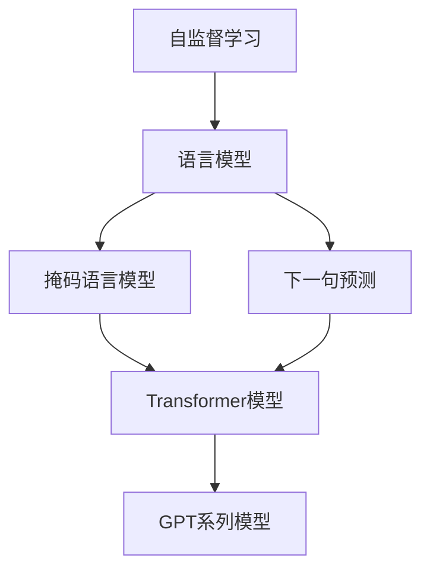

                 

## 1. 背景介绍

### 1.1 问题由来
近年来，随着深度学习技术的快速发展，大规模语言模型（Large Language Model, LLMs）在自然语言处理（Natural Language Processing, NLP）领域取得了巨大的突破。这些大模型通过在海量无标签文本数据上进行预训练，学习到了丰富的语言知识和常识，可以通过少量的有标签样本在下游任务上进行微调，获得优异的性能。

然而，由于预训练语料的广泛性和泛化能力的不足，这些通用的大语言模型在特定领域应用时，效果往往难以达到实际应用的要求。因此，如何针对特定任务进行大模型预训练，提升模型性能，成为了当前大模型研究和应用的一个热点问题。

### 1.2 问题核心关键点
目前，自监督学习在大模型预训练中的应用已逐渐成为研究热点。自监督学习（Self-Supervised Learning, SSL）是指使用大规模无标签数据，通过自身数据的内在结构进行学习的方法。在NLP领域，自监督学习主要应用于语言模型预训练，即利用未标注文本数据学习语言规律和表示能力。

自监督学习的核心思想是利用数据中的冗余信息，例如单词的上下文关系、句子结构等，在无标签数据上进行自我监督的训练。通过这种方式，模型能够从大量的未标注文本中学习到语言的规律和模式，构建出高质量的预训练语言模型。

### 1.3 问题研究意义
研究自监督学习在大模型预训练中的应用，对于拓展大模型的应用范围，提升下游任务的性能，加速NLP技术的产业化进程，具有重要意义：

1. 降低应用开发成本。自监督学习可以在无标签数据上进行预训练，大大减少从头训练所需的标注数据和计算资源。
2. 提升模型效果。通过自监督预训练，模型能够学习到语言的通用表示，对于特定任务能够更好地迁移应用。
3. 加速开发进度。standing on the shoulders of giants，自监督预训练提供了预训练的知识基础，开发者可以更快地完成任务适配，缩短开发周期。
4. 带来技术创新。自监督预训练促进了对预训练-微调的深入研究，催生了如 contrastive learning、margin ranking等新的研究方向。
5. 赋能产业升级。自监督预训练使得NLP技术更容易被各行各业所采用，为传统行业数字化转型升级提供新的技术路径。

## 2. 核心概念与联系

### 2.1 核心概念概述

为更好地理解自监督学习在大模型预训练中的应用，本节将介绍几个密切相关的核心概念：

- 自监督学习(Self-Supervised Learning, SSL)：利用大规模未标注数据，通过自身数据的内在结构进行学习的方法。SSL不依赖于标签，能够从数据本身挖掘更多信息。
- 语言模型(Language Model)：根据文本序列预测下一个单词或字符的概率分布。语言模型是预训练的基础，能够从无标签数据中学习语言的规律和表示能力。
- 掩码语言模型(Masked Language Model, MLM)：在文本序列中随机屏蔽一些单词，让模型预测被屏蔽的单词，从而学习单词的上下文关系。
- 下一句预测(Next Sentence Prediction, NSP)：随机抽取两个句子，让模型预测这两个句子是否相邻，学习句子的上下文关系。
- Transformer模型：一种基于自注意力机制的深度学习模型，具有较好的并行性和较强的表达能力，广泛应用于大模型的预训练中。
- GPT系列模型：如GPT-1、GPT-2、GPT-3等，是在自监督预训练的基础上进行微调得到的通用语言模型。

这些核心概念之间的逻辑关系可以通过以下Mermaid流程图来展示：



这个流程图展示了大模型预训练的核心概念及其之间的关系：

1. 自监督学习是预训练的基础，通过自身数据的内在结构进行学习。
2. 语言模型是自监督学习的核心，学习单词的上下文关系。
3. 掩码语言模型和下一句预测是两种常用的预训练任务，分别学习单词和句子的上下文关系。
4. Transformer模型是预训练的技术手段，具有较好的并行性和较强的表达能力。
5. GPT系列模型是在自监督预训练的基础上进行微调得到的通用语言模型。

## 3. 核心算法原理 & 具体操作步骤
### 3.1 算法原理概述

自监督学习在大模型预训练中的应用，本质上是通过大规模未标注文本数据进行无监督学习，构建高质量的预训练语言模型。其核心思想是利用数据中的冗余信息，如单词的上下文关系、句子结构等，在无标签数据上进行自我监督的训练。

形式化地，假设预训练模型为 $M_{\theta}$，其中 $\theta$ 为预训练得到的模型参数。给定大规模未标注文本数据集 $D=\{(x_i)\}_{i=1}^N$，预训练的目标是找到最优参数 $\theta^*$，使得模型在预测任务上达到最小化损失：

$$
\theta^* = \mathop{\arg\min}_{\theta} \mathcal{L}(D)
$$

其中 $\mathcal{L}$ 为预训练任务定义的损失函数。预训练任务通常包括掩码语言模型、下一句预测等。

通过梯度下降等优化算法，预训练过程不断更新模型参数 $\theta$，最小化损失函数 $\mathcal{L}$，使得模型在无标签数据上学习到语言的规律和表示能力。预训练模型通常采用Transformer等高级模型，由于其较好的并行性和表达能力，能够快速收敛。

### 3.2 算法步骤详解

自监督学习在大模型预训练的一般流程如下：

**Step 1: 收集并准备预训练数据**
- 收集大规模未标注文本数据集，例如维基百科、新闻、小说等。
- 将文本数据划分为句子、段落等基本单元，进行预处理，如分词、去除噪声等。

**Step 2: 设计预训练任务**
- 选择或设计预训练任务，如掩码语言模型、下一句预测等。
- 根据任务定义损失函数，例如掩码语言模型任务使用交叉熵损失函数。
- 定义预训练模型的结构，如Transformer模型，并确定各层的参数初始化方式。

**Step 3: 训练模型**
- 使用大规模未标注数据进行预训练，如使用GPU等高性能设备，进行并行训练。
- 设计预训练任务，如掩码语言模型，模型每次随机屏蔽一个单词，预测其后续单词。
- 定义优化器，如Adam、SGD等，并设置学习率、批大小等超参数。
- 通过梯度下降等优化算法，不断更新模型参数，最小化预训练损失。
- 周期性在验证集上评估模型性能，根据性能指标调整超参数。
- 重复上述步骤直至满足预设的迭代轮数或验证集性能提升。

**Step 4: 保存和评估模型**
- 将训练好的模型保存，方便后续的微调和应用。
- 在预设的测试集上评估模型性能，对比预训练前后的效果。

以上是自监督学习在大模型预训练的一般流程。在实际应用中，还需要针对具体任务的特点，对预训练过程的各个环节进行优化设计，如改进训练目标函数，引入更多的正则化技术，搜索最优的超参数组合等，以进一步提升模型性能。

### 3.3 算法优缺点

自监督学习在大模型预训练中的应用具有以下优点：
1. 数据需求量大。大规模未标注数据是自监督学习的核心，利用这些数据可以学习到丰富的语言知识。
2. 无需标注数据。自监督学习不依赖于标签，能够有效降低标注成本。
3. 高效便捷。预训练过程可以并行化，使用GPU等高性能设备可以大幅缩短训练时间。
4. 泛化能力强。自监督预训练得到的语言模型，能够更好地迁移应用到下游任务上。

同时，该方法也存在一定的局限性：
1. 数据质量要求高。自监督学习依赖于大规模无噪声数据，数据质量不足会导致模型学习效果差。
2. 模型复杂度高。自监督学习通常需要构建较为复杂的模型，如Transformer，会增加计算资源的需求。
3. 泛化能力有限。自监督预训练模型在特定领域的应用效果可能受限，需要进一步微调。
4. 可解释性不足。自监督学习的黑盒特性，使得模型难以解释内部工作机制和决策逻辑。

尽管存在这些局限性，但就目前而言，自监督学习是大规模语言模型预训练的主流范式。未来相关研究的重点在于如何进一步降低预训练对数据质量的要求，提高模型的少样本学习和跨领域迁移能力，同时兼顾可解释性和伦理安全性等因素。

### 3.4 算法应用领域

自监督学习在大模型预训练中的应用已经得到了广泛的应用，覆盖了几乎所有常见的NLP任务，例如：

- 文本分类：如情感分析、主题分类、意图识别等。通过自监督预训练，模型能够学习到文本-标签映射。
- 命名实体识别：识别文本中的人名、地名、机构名等特定实体。通过自监督预训练，模型能够掌握实体边界和类型。
- 关系抽取：从文本中抽取实体之间的语义关系。通过自监督预训练，模型能够学习实体-关系三元组。
- 问答系统：对自然语言问题给出答案。通过自监督预训练，模型能够理解问题并生成相应的回答。
- 机器翻译：将源语言文本翻译成目标语言。通过自监督预训练，模型能够学习语言-语言映射。
- 文本摘要：将长文本压缩成简短摘要。通过自监督预训练，模型能够抓取文本中的关键信息。
- 对话系统：使机器能够与人自然对话。通过自监督预训练，模型能够理解对话历史，生成合理的回复。

除了上述这些经典任务外，自监督学习也被创新性地应用到更多场景中，如可控文本生成、常识推理、代码生成、数据增强等，为NLP技术带来了全新的突破。随着预训练模型和自监督学习方法的不断进步，相信NLP技术将在更广阔的应用领域大放异彩。

## 4. 数学模型和公式 & 详细讲解 & 举例说明
### 4.1 数学模型构建

本节将使用数学语言对自监督学习在大模型预训练过程中的数学模型进行更加严格的刻画。

记预训练语言模型为 $M_{\theta}$，其中 $\theta$ 为模型参数。假设预训练数据集为 $D=\{(x_i)\}_{i=1}^N, x_i \in \mathcal{X}$，其中 $\mathcal{X}$ 为输入空间。

定义模型 $M_{\theta}$ 在数据样本 $x_i$ 上的损失函数为 $\ell(M_{\theta}(x_i),x_i)$，则在数据集 $D$ 上的经验风险为：

$$
\mathcal{L}(\theta) = \frac{1}{N} \sum_{i=1}^N \ell(M_{\theta}(x_i),x_i)
$$

在自监督预训练中，通常使用掩码语言模型和下一句预测等任务定义损失函数。例如，掩码语言模型任务中的损失函数为：

$$
\ell_{MLM}(M_{\theta}(x_i),x_i) = -\log \frac{M_{\theta}(x_i)[\hat{x}_{i,j}]}
$$

其中 $\hat{x}_{i,j}$ 为被屏蔽的单词，$M_{\theta}(x_i)$ 为模型在输入 $x_i$ 上的输出。

### 4.2 公式推导过程

以掩码语言模型为例，推导其梯度更新公式。

设预训练模型为 $M_{\theta}:\mathcal{X} \rightarrow \mathcal{Y}$，其中 $\mathcal{X}$ 为输入空间，$\mathcal{Y}$ 为输出空间，$\theta \in \mathbb{R}^d$ 为模型参数。假设掩码语言模型任务中的训练样本 $(x_i, \hat{x}_{i,j})$，其中 $x_i$ 为输入文本，$\hat{x}_{i,j}$ 为被屏蔽的单词，模型在输入 $x_i$ 上的输出为 $M_{\theta}(x_i)$。

定义损失函数为：

$$
\ell_{MLM}(M_{\theta}(x_i),x_i) = -\log \frac{M_{\theta}(x_i)[\hat{x}_{i,j}]}
$$

梯度更新公式为：

$$
\frac{\partial \mathcal{L}(\theta)}{\partial \theta} = -\frac{1}{N}\sum_{i=1}^N \frac{\partial \ell_{MLM}(M_{\theta}(x_i),x_i)}{\partial \theta}
$$

其中：

$$
\frac{\partial \ell_{MLM}(M_{\theta}(x_i),x_i)}{\partial \theta} = \frac{1}{N}\sum_{i=1}^N \frac{1}{|\hat{x}_{i,j}|} (M_{\theta}(x_i)[\hat{x}_{i,j}] - 1)
$$

在得到损失函数的梯度后，即可带入参数更新公式，完成模型的迭代优化。重复上述过程直至收敛，最终得到适应无标签数据集的预训练模型参数 $\theta^*$。

## 5. 项目实践：代码实例和详细解释说明
### 5.1 开发环境搭建

在进行预训练实践前，我们需要准备好开发环境。以下是使用Python进行PyTorch开发的环境配置流程：

1. 安装Anaconda：从官网下载并安装Anaconda，用于创建独立的Python环境。

2. 创建并激活虚拟环境：
```bash
conda create -n pytorch-env python=3.8 
conda activate pytorch-env
```

3. 安装PyTorch：根据CUDA版本，从官网获取对应的安装命令。例如：
```bash
conda install pytorch torchvision torchaudio cudatoolkit=11.1 -c pytorch -c conda-forge
```

4. 安装Transformers库：
```bash
pip install transformers
```

5. 安装各类工具包：
```bash
pip install numpy pandas scikit-learn matplotlib tqdm jupyter notebook ipython
```

完成上述步骤后，即可在`pytorch-env`环境中开始预训练实践。

### 5.2 源代码详细实现

这里我们以掩码语言模型(Masked Language Model, MLM)为例，给出使用Transformers库进行BERT预训练的PyTorch代码实现。

首先，定义预训练数据集：

```python
from transformers import BertTokenizer
import torch

tokenizer = BertTokenizer.from_pretrained('bert-base-cased')

# 加载文本数据，进行分词和屏蔽
def load_data(path):
    with open(path, 'r') as f:
        text = f.read()
        tokens = tokenizer.tokenize(text)
        return [tokens]

# 随机屏蔽单词
def mask_sentence(tokens):
    for token_index in range(len(tokens)):
        if random.random() < 0.15:
            mask_token = random.randint(0, len(tokens) - 1)
            tokens[mask_token] = '[MASK]'
    return tokens

# 将屏蔽单词放入列表
def get_labels(tokens):
    labels = [0] * len(tokens)
    labels[0] = 1
    return labels

# 加载数据集
train_dataset = load_data('train.txt')
dev_dataset = load_data('dev.txt')
test_dataset = load_data('test.txt')
```

然后，定义模型和优化器：

```python
from transformers import BertForMaskedLM, AdamW

model = BertForMaskedLM.from_pretrained('bert-base-cased')
optimizer = AdamW(model.parameters(), lr=2e-5)
```

接着，定义训练和评估函数：

```python
from torch.utils.data import DataLoader
from tqdm import tqdm

device = torch.device('cuda') if torch.cuda.is_available() else torch.device('cpu')
model.to(device)

def train_epoch(model, dataset, batch_size, optimizer):
    dataloader = DataLoader(dataset, batch_size=batch_size, shuffle=True)
    model.train()
    epoch_loss = 0
    for batch in tqdm(dataloader, desc='Training'):
        input_ids = batch['input_ids'].to(device)
        attention_mask = batch['attention_mask'].to(device)
        labels = batch['labels'].to(device)
        model.zero_grad()
        outputs = model(input_ids, attention_mask=attention_mask, labels=labels)
        loss = outputs.loss
        epoch_loss += loss.item()
        loss.backward()
        optimizer.step()
    return epoch_loss / len(dataloader)

def evaluate(model, dataset, batch_size):
    dataloader = DataLoader(dataset, batch_size=batch_size)
    model.eval()
    preds, labels = [], []
    with torch.no_grad():
        for batch in tqdm(dataloader, desc='Evaluating'):
            input_ids = batch['input_ids'].to(device)
            attention_mask = batch['attention_mask'].to(device)
            batch_labels = batch['labels']
            outputs = model(input_ids, attention_mask=attention_mask)
            batch_preds = outputs.logits.argmax(dim=2).to('cpu').tolist()
            batch_labels = batch_labels.to('cpu').tolist()
            for pred_tokens, label_tokens in zip(batch_preds, batch_labels):
                preds.append(pred_tokens[:len(label_tokens)])
                labels.append(label_tokens)
                
    print(classification_report(labels, preds))
```

最后，启动训练流程并在测试集上评估：

```python
epochs = 5
batch_size = 16

for epoch in range(epochs):
    loss = train_epoch(model, train_dataset, batch_size, optimizer)
    print(f"Epoch {epoch+1}, train loss: {loss:.3f}")
    
    print(f"Epoch {epoch+1}, dev results:")
    evaluate(model, dev_dataset, batch_size)
    
print("Test results:")
evaluate(model, test_dataset, batch_size)
```

以上就是使用PyTorch对BERT进行掩码语言模型预训练的完整代码实现。可以看到，得益于Transformers库的强大封装，我们可以用相对简洁的代码完成BERT模型的加载和预训练。

### 5.3 代码解读与分析

让我们再详细解读一下关键代码的实现细节：

**BertTokenizer**：
- 用于加载BERT分词器，将文本数据分词。

**load_data**函数：
- 加载文本文件，进行分词。
- 随机屏蔽单词，替换为[MASK]标记。

**get_labels**函数：
- 根据屏蔽的单词位置，生成标签列表。

**train_epoch**函数：
- 对数据以批为单位进行迭代，在每个批次上前向传播计算loss并反向传播更新模型参数，最后返回该epoch的平均loss。

**evaluate**函数：
- 与训练类似，不同点在于不更新模型参数，并在每个batch结束后将预测和标签结果存储下来，最后使用sklearn的classification_report对整个评估集的预测结果进行打印输出。

**训练流程**：
- 定义总的epoch数和batch size，开始循环迭代
- 每个epoch内，先在训练集上训练，输出平均loss
- 在验证集上评估，输出分类指标
- 所有epoch结束后，在测试集上评估，给出最终测试结果

可以看到，PyTorch配合Transformers库使得BERT预训练的代码实现变得简洁高效。开发者可以将更多精力放在数据处理、模型改进等高层逻辑上，而不必过多关注底层的实现细节。

当然，工业级的系统实现还需考虑更多因素，如模型的保存和部署、超参数的自动搜索、更灵活的任务适配层等。但核心的预训练范式基本与此类似。

## 6. 实际应用场景
### 6.1 智能客服系统

基于自监督学习的对话技术，可以广泛应用于智能客服系统的构建。传统客服往往需要配备大量人力，高峰期响应缓慢，且一致性和专业性难以保证。而使用自监督预训练的对话模型，可以7x24小时不间断服务，快速响应客户咨询，用自然流畅的语言解答各类常见问题。

在技术实现上，可以收集企业内部的历史客服对话记录，将问题和最佳答复构建成监督数据，在此基础上对自监督预训练的对话模型进行微调。微调后的对话模型能够自动理解用户意图，匹配最合适的答案模板进行回复。对于客户提出的新问题，还可以接入检索系统实时搜索相关内容，动态组织生成回答。如此构建的智能客服系统，能大幅提升客户咨询体验和问题解决效率。

### 6.2 金融舆情监测

金融机构需要实时监测市场舆论动向，以便及时应对负面信息传播，规避金融风险。传统的人工监测方式成本高、效率低，难以应对网络时代海量信息爆发的挑战。基于自监督预训练的文本分类和情感分析技术，为金融舆情监测提供了新的解决方案。

具体而言，可以收集金融领域相关的新闻、报道、评论等文本数据，并对其进行主题标注和情感标注。在此基础上对自监督预训练的语言模型进行微调，使其能够自动判断文本属于何种主题，情感倾向是正面、中性还是负面。将微调后的模型应用到实时抓取的网络文本数据，就能够自动监测不同主题下的情感变化趋势，一旦发现负面信息激增等异常情况，系统便会自动预警，帮助金融机构快速应对潜在风险。

### 6.3 个性化推荐系统

当前的推荐系统往往只依赖用户的历史行为数据进行物品推荐，无法深入理解用户的真实兴趣偏好。基于自监督预训练的语言模型，个性化推荐系统可以更好地挖掘用户行为背后的语义信息，从而提供更精准、多样的推荐内容。

在实践中，可以收集用户浏览、点击、评论、分享等行为数据，提取和用户交互的物品标题、描述、标签等文本内容。将文本内容作为模型输入，用户的后续行为（如是否点击、购买等）作为监督信号，在此基础上微调预训练语言模型。微调后的模型能够从文本内容中准确把握用户的兴趣点。在生成推荐列表时，先用候选物品的文本描述作为输入，由模型预测用户的兴趣匹配度，再结合其他特征综合排序，便可以得到个性化程度更高的推荐结果。

### 6.4 未来应用展望

随着自监督学习技术的不断发展，基于自监督学习的预训练方法将在大模型构建中扮演越来越重要的角色。未来，自监督学习将与其他AI技术进行更深入的融合，如知识表示、因果推理、强化学习等，形成多路径协同发力，共同推动自然语言理解和智能交互系统的进步。

在智慧医疗领域，基于自监督预训练的问答、病历分析、药物研发等应用将提升医疗服务的智能化水平，辅助医生诊疗，加速新药开发进程。

在智能教育领域，自监督预训练可应用于作业批改、学情分析、知识推荐等方面，因材施教，促进教育公平，提高教学质量。

在智慧城市治理中，自监督预训练可用于城市事件监测、舆情分析、应急指挥等环节，提高城市管理的自动化和智能化水平，构建更安全、高效的未来城市。

此外，在企业生产、社会治理、文娱传媒等众多领域，基于自监督预训练的人工智能应用也将不断涌现，为经济社会发展注入新的动力。相信随着技术的日益成熟，自监督学习范式将成为人工智能落地应用的重要范式，推动人工智能技术向更广阔的领域加速渗透。

## 7. 工具和资源推荐
### 7.1 学习资源推荐

为了帮助开发者系统掌握自监督学习在大模型预训练中的理论基础和实践技巧，这里推荐一些优质的学习资源：

1. 《Transformer从原理到实践》系列博文：由大模型技术专家撰写，深入浅出地介绍了Transformer原理、BERT模型、自监督预训练等前沿话题。

2. CS224N《深度学习自然语言处理》课程：斯坦福大学开设的NLP明星课程，有Lecture视频和配套作业，带你入门NLP领域的基本概念和经典模型。

3. 《Natural Language Processing with Transformers》书籍：Transformers库的作者所著，全面介绍了如何使用Transformers库进行NLP任务开发，包括自监督预训练在内的诸多范式。

4. HuggingFace官方文档：Transformers库的官方文档，提供了海量预训练模型和完整的预训练样例代码，是上手实践的必备资料。

5. CLUE开源项目：中文语言理解测评基准，涵盖大量不同类型的中文NLP数据集，并提供了基于自监督预训练的baseline模型，助力中文NLP技术发展。

通过对这些资源的学习实践，相信你一定能够快速掌握自监督学习在大模型预训练中的精髓，并用于解决实际的NLP问题。
###  7.2 开发工具推荐

高效的开发离不开优秀的工具支持。以下是几款用于自监督预训练开发的常用工具：

1. PyTorch：基于Python的开源深度学习框架，灵活动态的计算图，适合快速迭代研究。大部分预训练语言模型都有PyTorch版本的实现。

2. TensorFlow：由Google主导开发的开源深度学习框架，生产部署方便，适合大规模工程应用。同样有丰富的预训练语言模型资源。

3. Transformers库：HuggingFace开发的NLP工具库，集成了众多SOTA语言模型，支持PyTorch和TensorFlow，是进行自监督预训练任务的开发利器。

4. Weights & Biases：模型训练的实验跟踪工具，可以记录和可视化模型训练过程中的各项指标，方便对比和调优。与主流深度学习框架无缝集成。

5. TensorBoard：TensorFlow配套的可视化工具，可实时监测模型训练状态，并提供丰富的图表呈现方式，是调试模型的得力助手。

6. Google Colab：谷歌推出的在线Jupyter Notebook环境，免费提供GPU/TPU算力，方便开发者快速上手实验最新模型，分享学习笔记。

合理利用这些工具，可以显著提升自监督预训练任务的开发效率，加快创新迭代的步伐。

### 7.3 相关论文推荐

自监督学习在大模型预训练中的应用源于学界的持续研究。以下是几篇奠基性的相关论文，推荐阅读：

1. Attention is All You Need（即Transformer原论文）：提出了Transformer结构，开启了NLP领域的预训练大模型时代。

2. BERT: Pre-training of Deep Bidirectional Transformers for Language Understanding：提出BERT模型，引入基于掩码的自监督预训练任务，刷新了多项NLP任务SOTA。

3. Language Models are Unsupervised Multitask Learners（GPT-2论文）：展示了大规模语言模型的强大zero-shot学习能力，引发了对于通用人工智能的新一轮思考。

4. Self-Supervised Machine Learning using Weak Supervision：提出基于噪声标签的监督自学习，在大规模未标注数据上进行自监督学习，取得了不错的效果。

5. Generative Pre-trained Transformer（GPT-1）：提出GPT-1模型，基于自监督预训练和语言模型目标函数，在多种NLP任务上取得了SOTA。

这些论文代表了大规模语言模型自监督预训练技术的发展脉络。通过学习这些前沿成果，可以帮助研究者把握学科前进方向，激发更多的创新灵感。

## 8. 总结：未来发展趋势与挑战
### 8.1 总结

本文对自监督学习在大模型预训练中的应用进行了全面系统的介绍。首先阐述了自监督学习的背景和研究意义，明确了自监督预训练在大模型构建中的核心价值。其次，从原理到实践，详细讲解了自监督预训练的数学模型和算法步骤，给出了自监督预训练任务开发的完整代码实例。同时，本文还广泛探讨了自监督预训练方法在智能客服、金融舆情、个性化推荐等多个行业领域的应用前景，展示了自监督预训练方法的巨大潜力。此外，本文精选了自监督预训练技术的各类学习资源，力求为读者提供全方位的技术指引。

通过本文的系统梳理，可以看到，自监督预训练方法正在成为大规模语言模型预训练的主流范式，极大地拓展了预训练语言模型的应用边界，催生了更多的落地场景。得益于大规模语料的预训练，自监督预训练得到的语言模型在无需标注数据的情况下，仍能学习到丰富的语言知识，为下游任务提供了有力的知识支撑。未来，伴随自监督预训练方法的持续演进，相信NLP技术将在更广阔的应用领域大放异彩，深刻影响人类的生产生活方式。

### 8.2 未来发展趋势

展望未来，自监督预训练技术将呈现以下几个发展趋势：

1. 模型规模持续增大。随着算力成本的下降和数据规模的扩张，自监督预训练得到的语言模型参数量还将持续增长。超大规模语言模型蕴含的丰富语言知识，有望支撑更加复杂多变的下游任务预训练。

2. 预训练任务多样化。除了掩码语言模型和下一句预测等传统任务外，未来将涌现更多预训练任务，如语言模型预训练、句子表示学习等，进一步提升语言模型的表达能力和迁移能力。

3. 预训练方法不断创新。自监督预训练技术的不断发展，带来了如对比学习、掩码语言模型预训练、密度比对等新方法，提升模型训练效率和效果。

4. 跨模态预训练兴起。自监督预训练不仅限于文本数据，未来将拓展到图像、视频、语音等多模态数据预训练。多模态信息的融合，将显著提升语言模型对现实世界的理解和建模能力。

5. 持续学习成为常态。随着数据分布的不断变化，自监督预训练模型也需要持续学习新知识以保持性能。如何在不遗忘原有知识的同时，高效吸收新样本信息，将成为重要的研究课题。

6. 数据质量要求降低。未来自监督预训练方法将更多地依赖于无噪声数据，降低对数据质量的要求，使得模型预训练更容易进行。

以上趋势凸显了自监督预训练技术的广阔前景。这些方向的探索发展，必将进一步提升自监督预训练模型在复杂场景下的表现，为NLP技术带来更多创新和突破。

### 8.3 面临的挑战

尽管自监督预训练技术已经取得了瞩目成就，但在迈向更加智能化、普适化应用的过程中，它仍面临着诸多挑战：

1. 数据质量要求高。自监督预训练依赖于大规模无噪声数据，数据质量不足会导致模型学习效果差。如何提高数据质量，降低噪声，是一大难题。

2. 模型复杂度高。自监督预训练通常需要构建较为复杂的模型，如Transformer，会增加计算资源的需求。

3. 泛化能力有限。自监督预训练模型在特定领域的应用效果可能受限，需要进一步微调。

4. 可解释性不足。自监督预训练模型黑盒特性，使得模型难以解释内部工作机制和决策逻辑。

5. 数据分布漂移。随着数据分布的变化，自监督预训练模型可能面临性能下降的风险。

6. 计算资源需求大。自监督预训练通常需要耗费大量的计算资源，如何在有限资源下提升预训练效果，是一大挑战。

尽管存在这些挑战，但就目前而言，自监督预训练是大规模语言模型预训练的主流范式。未来相关研究的重点在于如何进一步降低预训练对数据质量的要求，提高模型的少样本学习和跨领域迁移能力，同时兼顾可解释性和伦理安全性等因素。

### 8.4 研究展望

面对自监督预训练所面临的种种挑战，未来的研究需要在以下几个方面寻求新的突破：

1. 探索无监督和半监督预训练方法。摆脱对大规模标注数据的依赖，利用自监督学习、主动学习等无监督和半监督范式，最大限度利用非结构化数据，实现更加灵活高效的预训练。

2. 研究参数高效和计算高效的预训练范式。开发更加参数高效的预训练方法，在固定大部分预训练参数的同时，只更新极少量的任务相关参数。同时优化预训练模型的计算图，减少前向传播和反向传播的资源消耗，实现更加轻量级、实时性的部署。

3. 融合因果和对比学习范式。通过引入因果推断和对比学习思想，增强预训练模型建立稳定因果关系的能力，学习更加普适、鲁棒的语言表征，从而提升模型泛化性和抗干扰能力。

4. 引入更多先验知识。将符号化的先验知识，如知识图谱、逻辑规则等，与神经网络模型进行巧妙融合，引导预训练过程学习更准确、合理的语言模型。同时加强不同模态数据的整合，实现视觉、语音等多模态信息与文本信息的协同建模。

5. 结合因果分析和博弈论工具。将因果分析方法引入预训练模型，识别出模型决策的关键特征，增强输出解释的因果性和逻辑性。借助博弈论工具刻画人机交互过程，主动探索并规避模型的脆弱点，提高系统稳定性。

6. 纳入伦理道德约束。在预训练目标中引入伦理导向的评估指标，过滤和惩罚有偏见、有害的输出倾向。同时加强人工干预和审核，建立模型行为的监管机制，确保输出符合人类价值观和伦理道德。

这些研究方向的探索，必将引领自监督预训练技术迈向更高的台阶，为构建安全、可靠、可解释、可控的智能系统铺平道路。面向未来，自监督预训练技术还需要与其他人工智能技术进行更深入的融合，如知识表示、因果推理、强化学习等，多路径协同发力，共同推动自然语言理解和智能交互系统的进步。只有勇于创新、敢于突破，才能不断拓展语言模型的边界，让智能技术更好地造福人类社会。

## 9. 附录：常见问题与解答

**Q1：自监督预训练是否适用于所有NLP任务？**

A: 自监督预训练在大多数NLP任务上都能取得不错的效果，特别是对于数据量较小的任务。但对于一些特定领域的任务，如医学、法律等，仅仅依靠通用语料预训练的模型可能难以很好地适应。此时需要在特定领域语料上进一步预训练，再进行微调，才能获得理想效果。此外，对于一些需要时效性、个性化很强的任务，如对话、推荐等，自监督预训练方法也需要针对性的改进优化。

**Q2：自监督预训练过程中如何选择合适的损失函数？**

A: 自监督预训练的任务和损失函数多种多样，通常根据预训练任务的不同来选择。例如，掩码语言模型任务通常使用交叉熵损失函数，下一句预测任务通常使用对比损失函数。自监督预训练的损失函数需要满足三个基本条件：
1. 能够有效利用数据中的冗余信息。
2. 能够引导模型学习语言的规律和表示能力。
3. 能够在无标签数据上进行有效训练。

**Q3：自监督预训练过程中如何避免过拟合？**

A: 过拟合是自监督预训练面临的主要挑战，尤其是在数据量有限的情况下。常见的缓解策略包括：
1. 数据增强：通过回译、近义替换等方式扩充训练集
2. 正则化：使用L2正则、Dropout、Early Stopping等避免过拟合
3. 对抗训练：加入对抗样本，提高模型鲁棒性
4. 参数高效预训练：只更新极少量的任务相关参数，减小过拟合风险

这些策略往往需要根据具体任务和数据特点进行灵活组合。只有在数据、模型、训练、推理等各环节进行全面优化，才能最大限度地发挥自监督预训练的优势。

**Q4：自监督预训练模型在落地部署时需要注意哪些问题？**

A: 将自监督预训练模型转化为实际应用，还需要考虑以下因素：
1. 模型裁剪：去除不必要的层和参数，减小模型尺寸，加快推理速度
2. 量化加速：将浮点模型转为定点模型，压缩存储空间，提高计算效率
3. 服务化封装：将模型封装为标准化服务接口，便于集成调用
4. 弹性伸缩：根据请求流量动态调整资源配置，平衡服务质量和成本
5. 监控告警：实时采集系统指标，设置异常告警阈值，确保服务稳定性
6. 安全防护：采用访问鉴权、数据脱敏等措施，保障数据和模型安全

自监督预训练模型为NLP应用带来了新的可能，但如何将强大的性能转化为稳定、高效、安全的业务价值，还需要工程实践的不断打磨。唯有从数据、算法、工程、业务等多个维度协同发力，才能真正实现人工智能技术在垂直行业的规模化落地。总之，自监督预训练需要开发者根据具体任务，不断迭代和优化模型、数据和算法，方能得到理想的效果。

---

作者：禅与计算机程序设计艺术 / Zen and the Art of Computer Programming

