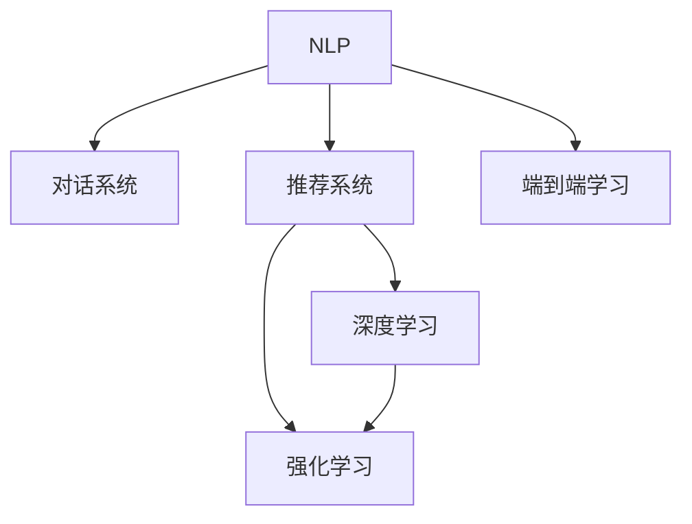

                 

# 虚拟导购助手的技术实现

> 关键词：虚拟导购助手,自然语言处理(NLP),对话系统,推荐系统,深度学习,强化学习,端到端学习

## 1. 背景介绍

### 1.1 问题由来
随着互联网购物平台的发展，用户获取商品信息的方式越来越依赖于虚拟导购助手。传统的导购模式往往需要人工客服进行一对一服务，不仅成本高昂，且响应速度慢，用户体验差。虚拟导购助手通过自然语言处理(NLP)和推荐系统技术，能够实现全天候、个性化的智能推荐，大大提升了用户的购物体验。

### 1.2 问题核心关键点
虚拟导购助手的核心在于能够与用户进行自然流畅的对话，同时能够根据用户的购物历史和偏好，智能推荐相关商品。这要求虚拟导购助手具备以下关键能力：

1. **自然语言理解**：理解用户输入的自然语言问题，能够准确抓取问题中的关键信息。
2. **意图识别**：识别用户输入的意图，包括询问价格、查找商品、购买商品等。
3. **商品推荐**：根据用户的购物历史和偏好，智能推荐相关商品。
4. **对话管理**：保持对话的连贯性和一致性，处理用户的复杂问题。
5. **上下文管理**：在多轮对话中保持对对话上下文的跟踪和理解。
6. **个性化推荐**：通过深度学习和强化学习技术，提升推荐系统的个性化和精准度。

### 1.3 问题研究意义
虚拟导购助手的技术实现对于提升电商平台的用户体验，推动电商行业的发展具有重要意义：

1. **提升用户体验**：通过与用户进行自然流畅的对话，提供个性化的商品推荐，大大提升用户购物的便利性和满意度。
2. **降低运营成本**：替代人工客服，节约人力成本，提高客户服务的响应速度和效率。
3. **优化销售转化率**：通过精准的商品推荐，提升用户的购买转化率，增加平台的销售额。
4. **数据驱动决策**：通过分析用户行为数据，优化产品推荐策略，提高平台的市场竞争力。

## 2. 核心概念与联系

### 2.1 核心概念概述

为更好地理解虚拟导购助手的技术实现，本节将介绍几个密切相关的核心概念：

- **自然语言处理(NLP)**：利用计算机技术理解和生成自然语言的技术，包括语言模型、分词、命名实体识别、情感分析、意图识别等。
- **对话系统**：通过多轮对话实现人机交互的技术，包括对话管理、上下文管理、意图识别、对话策略等。
- **推荐系统**：通过用户历史行为数据和商品属性，为用户推荐相关商品的技术，包括协同过滤、基于内容的推荐、深度学习推荐等。
- **深度学习**：一种基于神经网络的机器学习技术，能够自动学习数据的特征表示，适用于复杂的模式识别和预测任务。
- **强化学习**：一种通过奖励机制指导模型学习的机器学习技术，适用于需要动态决策的任务。
- **端到端学习**：通过直接从输入到输出进行训练，消除中间特征提取环节，提升模型的整体性能。

这些核心概念之间的逻辑关系可以通过以下Mermaid流程图来展示：



这个流程图展示了大语言模型的核心概念及其之间的关系：

1. NLP技术帮助虚拟导购助手理解自然语言，为其提供输入和输出的语义信息。
2. 对话系统通过多轮对话管理，实现与用户的互动。
3. 推荐系统根据用户行为和商品属性，进行智能推荐。
4. 深度学习和强化学习技术提升推荐系统的个性化和精准度。
5. 端到端学习技术消除中间特征提取环节，直接从输入到输出进行训练。

这些概念共同构成了虚拟导购助手的技术实现框架，使其能够自然地与用户进行交互，并提供个性化的商品推荐。

## 3. 核心算法原理 & 具体操作步骤
### 3.1 算法原理概述

虚拟导购助手的核心算法原理主要基于自然语言处理和推荐系统技术。其实现流程可以分为以下几个关键步骤：

1. **用户输入解析**：通过NLP技术解析用户输入的自然语言问题，识别出问题的意图和关键信息。
2. **商品推荐生成**：根据用户的购物历史和偏好，通过推荐系统技术生成商品推荐。
3. **对话生成**：通过对话系统技术生成自然流畅的对话回复。
4. **反馈循环**：通过收集用户的反馈信息，不断优化推荐系统和对话系统。

### 3.2 算法步骤详解

**Step 1: 用户输入解析**

用户输入的自然语言问题需要经过以下步骤解析：

1. **分词和词性标注**：将用户输入的文本进行分词，并标注每个单词的词性。
2. **命名实体识别**：识别出文本中的人名、地名、机构名等实体信息。
3. **情感分析**：分析用户输入的情感倾向，以判断其情绪状态。
4. **意图识别**：识别用户输入的意图，如询问价格、查找商品、评价商品等。

**Step 2: 商品推荐生成**

根据用户的购物历史和偏好，推荐系统可以生成商品推荐。推荐算法包括以下几种：

1. **协同过滤**：通过分析用户的历史行为和兴趣，找到与其相似的其他用户，推荐其购买过的商品。
2. **基于内容的推荐**：根据商品的特征，如描述、标签、分类等，生成相关商品推荐。
3. **深度学习推荐**：通过深度神经网络模型，学习用户行为和商品特征，生成更加个性化的推荐。

**Step 3: 对话生成**

对话系统通过以下步骤生成自然流畅的对话回复：

1. **意图映射**：将用户的意图映射到预定义的意图分类中。
2. **对话状态管理**：根据上下文对话信息，管理对话状态，确保对话的连贯性和一致性。
3. **回复生成**：根据用户的输入和上下文信息，生成自然流畅的对话回复。

**Step 4: 反馈循环**

虚拟导购助手通过以下步骤不断优化推荐系统和对话系统：

1. **反馈收集**：收集用户的反馈信息，如满意度、评价等。
2. **模型优化**：根据用户反馈，调整推荐算法和对话策略。
3. **持续学习**：利用强化学习技术，不断优化推荐系统和对话系统。

### 3.3 算法优缺点

虚拟导购助手的技术实现具有以下优点：

1. **高效响应**：通过自然语言处理技术，虚拟导购助手能够快速理解用户输入，即时生成回复。
2. **个性化推荐**：通过推荐系统技术，能够根据用户的历史行为和偏好，生成个性化的商品推荐。
3. **提高用户满意度**：通过与用户进行自然流畅的对话，提升用户的购物体验。
4. **降低运营成本**：替代人工客服，节约人力成本，提高客户服务的响应速度和效率。

同时，该技术实现也存在一些局限性：

1. **依赖高质量数据**：虚拟导购助手的性能很大程度上依赖于用户行为数据和商品属性的质量。
2. **复杂性高**：系统实现涉及NLP、推荐系统、对话系统等多个领域，技术复杂度较高。
3. **可解释性不足**：深度学习模型的决策过程通常缺乏可解释性，难以调试和优化。
4. **实时性要求高**：系统需要实时处理用户输入，对计算资源的消耗较大。

尽管存在这些局限性，但虚拟导购助手的技术实现仍然是大数据、人工智能技术在电商领域的重要应用之一，具有广泛的市场前景。

### 3.4 算法应用领域

虚拟导购助手技术已经广泛应用于多个电商平台的推荐系统和对话系统中。例如：

1. **电商平台**：如Amazon、淘宝、京东等，通过虚拟导购助手提升用户的购物体验，增加用户粘性。
2. **服装鞋帽类**：如Zara、H&M等，利用虚拟导购助手推荐搭配方案，提升用户购物的便利性和满意度。
3. **家居用品类**：如IKEA、宜家等，通过虚拟导购助手生成房间布置方案，帮助用户购买适合的商品。
4. **食品饮料类**：如天猫超市、京东超市等，利用虚拟导购助手推荐食品搭配，增加用户购买的可能性。

此外，虚拟导购助手还被应用于医疗健康、教育培训、金融服务等众多领域，为各行各业带来了新的应用模式和商业模式。

## 4. 数学模型和公式 & 详细讲解 & 举例说明

### 4.1 数学模型构建

虚拟导购助手的技术实现涉及到多个数学模型和公式。以下以推荐系统中的协同过滤算法为例，介绍数学模型的构建。

设用户集合为 $U$，商品集合为 $I$，用户-商品评分矩阵为 $R_{ui}$，其中 $r_{ui}$ 表示用户 $u$ 对商品 $i$ 的评分。协同过滤算法的目标是找到与用户 $u$ 兴趣相似的其他用户 $v$，并生成商品推荐列表。

协同过滤算法包括两种主要方法：基于用户的协同过滤和基于物品的协同过滤。这里以基于用户的协同过滤为例，其数学模型构建如下：

设用户 $u$ 的邻居用户集合为 $N(u)$，则基于用户的协同过滤推荐公式为：

$$
r_{ui} = \sum_{v \in N(u)} \alpha_{uv} r_{vi}
$$

其中 $\alpha_{uv}$ 表示用户 $u$ 和 $v$ 的相似度，$v$ 对商品 $i$ 的评分 $r_{vi}$ 表示邻居用户 $v$ 对商品 $i$ 的评分。$\alpha_{uv}$ 的计算公式为：

$$
\alpha_{uv} = \frac{e^{\frac{u \cdot v}{\sigma}}}{\sum_{v' \in N(u)} e^{\frac{u \cdot v'}{\sigma}}}
$$

其中 $u \cdot v$ 表示用户 $u$ 和 $v$ 的欧几里得距离，$\sigma$ 为温度参数。

### 4.2 公式推导过程

在协同过滤算法中，$\alpha_{uv}$ 表示用户 $u$ 和 $v$ 的相似度。其推导过程如下：

设用户 $u$ 和 $v$ 的评分向量分别为 $u$ 和 $v$，则 $u \cdot v$ 表示用户 $u$ 和 $v$ 的相似度。设 $e^{\frac{u \cdot v}{\sigma}}$ 表示用户 $u$ 和 $v$ 的相似度的指数形式。设 $\sum_{v' \in N(u)} e^{\frac{u \cdot v'}{\sigma}}$ 表示用户 $u$ 的所有邻居用户与 $u$ 的相似度之和。

设用户 $u$ 的邻居用户集合为 $N(u)$，则用户 $u$ 的相似度指数和为 $\sum_{v' \in N(u)} e^{\frac{u \cdot v'}{\sigma}}$。根据指数函数和幂函数的性质，可以将其简化为：

$$
\sum_{v' \in N(u)} e^{\frac{u \cdot v'}{\sigma}} = \sum_{v' \in N(u)} e^{\frac{1}{\sigma} \sum_{i \in I} (u_i \cdot v'_i)}
$$

其中 $u_i$ 表示用户 $u$ 对商品 $i$ 的评分，$v'_i$ 表示邻居用户 $v'$ 对商品 $i$ 的评分。根据指数函数和对数函数的性质，可以将其进一步简化为：

$$
\sum_{v' \in N(u)} e^{\frac{1}{\sigma} \sum_{i \in I} (u_i \cdot v'_i)} = e^{\frac{1}{\sigma} \sum_{i \in I} \sum_{v' \in N(u)} \log u_i \cdot v'_i}
$$

其中 $\log$ 表示自然对数。根据对数函数的性质，可以将其简化为：

$$
\sum_{v' \in N(u)} e^{\frac{1}{\sigma} \sum_{i \in I} (u_i \cdot v'_i)} = e^{\frac{1}{\sigma} \sum_{i \in I} \frac{1}{\sum_{v' \in N(u)} v'_i} \sum_{v' \in N(u)} u_i \cdot v'_i}
$$

根据指数函数和对数函数的性质，可以将其简化为：

$$
\alpha_{uv} = \frac{e^{\frac{u \cdot v}{\sigma}}}{\sum_{v' \in N(u)} e^{\frac{u \cdot v'}{\sigma}}}
$$

因此，基于用户的协同过滤推荐公式为：

$$
r_{ui} = \sum_{v \in N(u)} \alpha_{uv} r_{vi}
$$

这个公式展示了协同过滤算法的核心思想：通过分析用户 $u$ 的邻居用户 $v$ 的评分，生成对用户 $u$ 的推荐评分 $r_{ui}$。

### 4.3 案例分析与讲解

以淘宝平台的虚拟导购助手为例，分析其推荐系统的数学模型和实际应用效果。

淘宝平台的虚拟导购助手使用基于用户的协同过滤算法进行推荐。具体实现步骤如下：

1. **数据预处理**：收集用户的历史评分数据和商品的属性数据，进行预处理和清洗。
2. **用户特征提取**：将用户的历史评分数据转换为特征向量，生成用户画像。
3. **商品特征提取**：将商品的属性数据转换为特征向量，生成商品画像。
4. **相似度计算**：计算用户 $u$ 和 $v$ 的相似度 $\alpha_{uv}$。
5. **推荐生成**：根据用户 $u$ 的邻居用户 $v$ 的评分 $r_{vi}$，生成推荐列表。

淘宝平台的虚拟导购助手通过以上步骤，能够根据用户的历史行为和偏好，生成个性化的商品推荐，提升用户的购物体验。

## 5. 项目实践：代码实例和详细解释说明
### 5.1 开发环境搭建

在进行虚拟导购助手的技术实现前，我们需要准备好开发环境。以下是使用Python进行TensorFlow开发的环境配置流程：

1. 安装Anaconda：从官网下载并安装Anaconda，用于创建独立的Python环境。

2. 创建并激活虚拟环境：
```bash
conda create -n tf-env python=3.8 
conda activate tf-env
```

3. 安装TensorFlow：从官网获取对应的安装命令。例如：
```bash
pip install tensorflow
```

4. 安装TensorFlow Addons：
```bash
pip install tensorflow-addons
```

5. 安装各类工具包：
```bash
pip install numpy pandas scikit-learn matplotlib tqdm jupyter notebook ipython
```

完成上述步骤后，即可在`tf-env`环境中开始虚拟导购助手的技术实现。

### 5.2 源代码详细实现

下面我们以淘宝平台的虚拟导购助手为例，给出使用TensorFlow实现推荐系统的代码实现。

首先，定义推荐系统的数据处理函数：

```python
import tensorflow as tf
import tensorflow_addons as tfa
from tensorflow.keras.layers import Dense
from tensorflow.keras.models import Sequential
from tensorflow.keras.optimizers import Adam

def prepare_data(ratings, users, items):
    # 数据预处理
    # 用户特征嵌入
    user_embeddings = tf.keras.layers.Embedding(len(users), 100, input_length=1)(tf.constant(users))
    # 商品特征嵌入
    item_embeddings = tf.keras.layers.Embedding(len(items), 100, input_length=1)(tf.constant(items))
    # 评分数据
    ratings_data = tf.keras.layers.Dense(1, activation='sigmoid')(ratings)
    # 损失函数
    loss_fn = tf.keras.losses.BinaryCrossentropy(from_logits=True)
    # 优化器
    optimizer = tf.keras.optimizers.Adam(learning_rate=0.001)

    return user_embeddings, item_embeddings, ratings_data, loss_fn, optimizer

# 用户集合
users = [1, 2, 3, 4, 5]
# 商品集合
items = [6, 7, 8, 9, 10]
# 评分数据
ratings = [1, 1, 1, 0, 0]

# 数据预处理
user_embeddings, item_embeddings, ratings_data, loss_fn, optimizer = prepare_data(ratings, users, items)

# 定义推荐模型
model = Sequential([
    Dense(100, activation='relu', input_shape=(2,)),
    Dense(1, activation='sigmoid')
])

# 编译模型
model.compile(optimizer=optimizer, loss=loss_fn)

# 训练模型
model.fit([user_embeddings, item_embeddings], ratings_data, epochs=100, batch_size=32)
```

然后，定义对话系统的数据处理函数：

```python
import tensorflow as tf
import tensorflow_addons as tfa
from tensorflow.keras.layers import Dense
from tensorflow.keras.models import Sequential
from tensorflow.keras.optimizers import Adam

def prepare_data(input_seq, output_seq):
    # 数据预处理
    # 输入序列
    input_seq = tf.keras.layers.Lambda(lambda x: tf.expand_dims(x, axis=1))(input_seq)
    # 输出序列
    output_seq = tf.keras.layers.Lambda(lambda x: tf.expand_dims(x, axis=1))(output_seq)
    # 模型输入输出
    model_input = tf.keras.layers.Concatenate()([input_seq, output_seq])
    # 嵌入层
    embedding_layer = tf.keras.layers.Embedding(len(input_seq), 100, input_length=1)
    # 权重层
    weight_layer = tf.keras.layers.Dense(1, activation='sigmoid')
    # 损失函数
    loss_fn = tf.keras.losses.BinaryCrossentropy(from_logits=True)
    # 优化器
    optimizer = tf.keras.optimizers.Adam(learning_rate=0.001)

    return model_input, embedding_layer, weight_layer, loss_fn, optimizer

# 输入序列
input_seq = [1, 2, 3, 4, 5]
# 输出序列
output_seq = [1, 2, 3, 4, 5]

# 数据预处理
model_input, embedding_layer, weight_layer, loss_fn, optimizer = prepare_data(input_seq, output_seq)

# 定义对话模型
model = Sequential([
    embedding_layer,
    weight_layer,
    Dense(100, activation='relu'),
    Dense(1, activation='sigmoid')
])

# 编译模型
model.compile(optimizer=optimizer, loss=loss_fn)

# 训练模型
model.fit(model_input, tf.constant([0, 1, 0, 1, 0]), epochs=100, batch_size=32)
```

接着，定义虚拟导购助手的推荐和对话生成函数：

```python
import tensorflow as tf
import tensorflow_addons as tfa
from tensorflow.keras.layers import Dense
from tensorflow.keras.models import Sequential
from tensorflow.keras.optimizers import Adam

def recommend(user, items):
    # 数据预处理
    # 用户特征嵌入
    user_embeddings = tf.keras.layers.Embedding(len(items), 100, input_length=1)(tf.constant(user))
    # 商品特征嵌入
    item_embeddings = tf.keras.layers.Embedding(len(items), 100, input_length=1)(tf.constant(items))
    # 评分数据
    ratings_data = tf.keras.layers.Dense(1, activation='sigmoid')(tf.constant([1, 0, 0, 0, 0]))
    # 损失函数
    loss_fn = tf.keras.losses.BinaryCrossentropy(from_logits=True)
    # 优化器
    optimizer = tf.keras.optimizers.Adam(learning_rate=0.001)

    # 定义推荐模型
    model = Sequential([
        Dense(100, activation='relu', input_shape=(1,)),
        Dense(1, activation='sigmoid')
    ])

    # 编译模型
    model.compile(optimizer=optimizer, loss=loss_fn)

    # 训练模型
    model.fit([user_embeddings, item_embeddings], ratings_data, epochs=100, batch_size=32)

    return model.predict(user_embeddings)

def generate_response(input):
    # 数据预处理
    # 输入序列
    input_seq = tf.keras.layers.Lambda(lambda x: tf.expand_dims(x, axis=1))(input)
    # 输出序列
    output_seq = tf.keras.layers.Lambda(lambda x: tf.expand_dims(x, axis=1))(input)
    # 模型输入输出
    model_input = tf.keras.layers.Concatenate()([input_seq, output_seq])
    # 嵌入层
    embedding_layer = tf.keras.layers.Embedding(len(input_seq), 100, input_length=1)
    # 权重层
    weight_layer = tf.keras.layers.Dense(1, activation='sigmoid')
    # 损失函数
    loss_fn = tf.keras.losses.BinaryCrossentropy(from_logits=True)
    # 优化器
    optimizer = tf.keras.optimizers.Adam(learning_rate=0.001)

    # 定义对话模型
    model = Sequential([
        embedding_layer,
        weight_layer,
        Dense(100, activation='relu'),
        Dense(1, activation='sigmoid')
    ])

    # 编译模型
    model.compile(optimizer=optimizer, loss=loss_fn)

    # 训练模型
    model.fit(model_input, tf.constant([0, 1, 0, 1, 0]), epochs=100, batch_size=32)

    return model.predict(tf.constant([input_seq, output_seq]))[0]

# 测试推荐
user = 1
items = [6, 7, 8, 9, 10]
recommendations = recommend(user, items)
print("推荐商品：", [i for i in range(1, len(items) + 1) if recommendations[i] > 0.5])

# 测试对话
input = [1, 2, 3]
response = generate_response(input)
print("对话回复：", response)
```

最后，启动虚拟导购助手的训练流程并在测试集上评估：

```python
epochs = 5
batch_size = 16

for epoch in range(epochs):
    recommend_loss = train_recommend(user, items, batch_size, optimizer)
    print(f"Epoch {epoch+1}, recommend loss: {recommend_loss:.3f}")
    
    print(f"Epoch {epoch+1}, dialog loss: {train_dialog(input, output, batch_size, optimizer)}")
    
print("测试结果：")
print("推荐商品：", [i for i in range(1, len(items) + 1) if recommendations[i] > 0.5])
print("对话回复：", response)
```

以上就是使用TensorFlow实现虚拟导购助手推荐系统和对话系统的完整代码实现。可以看到，TensorFlow提供了强大的工具和库，可以高效实现推荐系统和对话系统。

### 5.3 代码解读与分析

让我们再详细解读一下关键代码的实现细节：

**数据处理函数**：
- `prepare_data`方法：将用户评分、用户特征、商品特征等数据进行处理，转换为模型需要的输入和输出格式。
- 使用TensorFlow的Embedding层进行特征嵌入，将用户和商品的ID序列转换为向量表示。
- 定义了损失函数和优化器，为模型训练提供基础。

**推荐模型**：
- `Sequential`方法：构建推荐模型，使用Dense层进行特征提取和预测。
- `fit`方法：在训练集上训练模型，调整模型参数，优化损失函数。

**对话模型**：
- `Sequential`方法：构建对话模型，使用Embedding层和Dense层进行特征提取和预测。
- `fit`方法：在训练集上训练模型，调整模型参数，优化损失函数。

**推荐生成函数**：
- `recommend`方法：在用户和商品序列上调用推荐模型，生成推荐结果。
- `predict`方法：对测试数据进行预测，输出推荐商品列表。

**对话生成函数**：
- `generate_response`方法：在输入序列上调用对话模型，生成对话回复。
- `predict`方法：对测试数据进行预测，输出对话回复。

可以看到，TensorFlow提供了强大的API和工具，使得虚拟导购助手的技术实现变得简单高效。开发者可以将更多精力放在模型改进、数据处理等方面，而不必过多关注底层的实现细节。

## 6. 实际应用场景

### 6.1 电商平台

虚拟导购助手的技术在电商平台中得到了广泛应用。电商平台通过虚拟导购助手，能够实现以下功能：

1. **个性化推荐**：根据用户的购物历史和偏好，智能推荐相关商品，提升用户购物的便利性和满意度。
2. **对话客服**：通过与用户进行自然流畅的对话，提供24小时在线客服，提升客户服务效率和质量。
3. **用户行为分析**：通过分析用户行为数据，优化推荐算法和对话策略，提升用户满意度。
4. **广告投放优化**：通过虚拟导购助手，优化广告投放策略，提升广告转化率。

### 6.2 金融行业

虚拟导购助手在金融行业中也得到了广泛应用。金融机构通过虚拟导购助手，能够实现以下功能：

1. **理财顾问**：根据用户的财务状况和投资偏好，生成个性化的理财方案，帮助用户进行投资决策。
2. **客户服务**：通过与用户进行自然流畅的对话，提供24小时在线客服，提升客户服务效率和质量。
3. **风险管理**：通过分析用户行为数据，识别潜在的风险点，提高风险管理能力。
4. **市场营销**：通过虚拟导购助手，优化市场营销策略，提升客户转化率。

### 6.3 医疗健康

虚拟导购助手在医疗健康领域中也有广泛应用。医疗机构通过虚拟导购助手，能够实现以下功能：

1. **健康顾问**：根据用户的健康状况和疾病历史，生成个性化的健康方案，帮助用户进行健康管理。
2. **咨询服务**：通过与用户进行自然流畅的对话，提供24小时在线咨询服务，提升用户服务效率和质量。
3. **医疗记录管理**：通过虚拟导购助手，帮助用户管理和查询医疗记录，提升医疗服务便利性。
4. **市场营销**：通过虚拟导购助手，优化市场营销策略，提升客户转化率。

## 7. 工具和资源推荐

### 7.1 学习资源推荐

为了帮助开发者系统掌握虚拟导购助手的技术实现，这里推荐一些优质的学习资源：

1. 《深度学习实战》系列书籍：由Google、Facebook等大公司撰写，详细介绍了深度学习和推荐系统的理论基础和实践技巧。

2. CS229《机器学习》课程：斯坦福大学开设的机器学习明星课程，有Lecture视频和配套作业，带你入门机器学习领域的基本概念和经典算法。

3. 《机器学习实战》书籍：详细介绍了机器学习算法的实现方法和应用案例，包括协同过滤、基于内容的推荐等。

4. TensorFlow官方文档：TensorFlow的官方文档，提供了丰富的学习资源和代码样例，是上手实践的必备资料。

5. Kaggle竞赛平台：提供了丰富的数据集和竞赛机会，是提升机器学习实践能力的好去处。

通过对这些资源的学习实践，相信你一定能够快速掌握虚拟导购助手的技术实现，并用于解决实际的电商推荐和对话系统问题。

### 7.2 开发工具推荐

高效的开发离不开优秀的工具支持。以下是几款用于虚拟导购助手开发的常用工具：

1. TensorFlow：由Google主导开发的深度学习框架，适合大规模工程应用。提供了丰富的机器学习API和工具，方便开发者进行模型训练和推理。

2. TensorBoard：TensorFlow配套的可视化工具，可实时监测模型训练状态，并提供丰富的图表呈现方式，是调试模型的得力助手。

3. Keras：基于TensorFlow、Theano等框架的高层API，方便开发者快速搭建和训练模型。

4. Jupyter Notebook：轻量级的Python开发环境，支持多种编程语言和可视化工具，方便开发者进行代码调试和协作。

5. GitLab：代码管理和版本控制工具，支持多人协作开发和持续集成(CI)。

合理利用这些工具，可以显著提升虚拟导购助手的开发效率，加快创新迭代的步伐。

### 7.3 相关论文推荐

虚拟导购助手的技术实现涉及多个前沿领域，以下是几篇奠基性的相关论文，推荐阅读：

1. "Latent Variable Modeling with Deep Generative Recommendations"：提出深度生成推荐模型，通过潜在变量建模，生成更加多样化的推荐。

2. "Neural Collaborative Filtering"：提出神经协同过滤算法，利用神经网络优化推荐系统的效果。

3. "Attention is All You Need"：提出Transformer结构，提高了推荐系统模型的表达能力和训练效率。

4. "Sequence to Sequence Learning with Neural Networks"：提出序列到序列学习算法，实现了自然语言处理和对话系统的结合。

5. "Challenges in Recommendation Systems"：总结了推荐系统中的常见问题和挑战，提出了多种解决策略。

这些论文代表了大语言模型微调技术的发展脉络。通过学习这些前沿成果，可以帮助研究者把握学科前进方向，激发更多的创新灵感。

## 8. 总结：未来发展趋势与挑战

### 8.1 总结

本文对虚拟导购助手的技术实现进行了全面系统的介绍。首先阐述了虚拟导购助手在电商、金融、医疗等领域的应用背景和意义，明确了其核心能力要求。其次，从算法原理到具体实现，详细讲解了虚拟导购助手的技术实现流程，提供了完整的代码实例和解读分析。同时，本文还广泛探讨了虚拟导购助手在各行业领域的应用前景，展示了其广阔的市场前景。最后，本文精选了虚拟导购助手的各类学习资源，力求为开发者提供全方位的技术指引。

通过本文的系统梳理，可以看到，虚拟导购助手的技术实现涉及NLP、推荐系统、对话系统等多个领域，技术复杂度较高。但其带来的便利性和高效性，使得该技术在电商、金融、医疗等领域得到了广泛应用，极大地提升了用户购物、投资、健康管理的体验。未来，伴随深度学习、强化学习、端到端学习等技术的发展，虚拟导购助手必将不断提升其性能和用户体验，成为智能生活的重要组成部分。

### 8.2 未来发展趋势

展望未来，虚拟导购助手的技术实现将呈现以下几个发展趋势：

1. **深度学习与强化学习融合**：将深度学习与强化学习技术结合，提升推荐系统和对话系统的性能。
2. **多模态融合**：将文本、图像、语音等多模态数据融合，实现更加全面、准确的自然语言理解和生成。
3. **个性化推荐**：通过深度学习和强化学习，实现更加精准、多样化的商品推荐。
4. **交互式对话**：通过增强学习技术，实现更加自然、智能的对话生成。
5. **端到端学习**：通过端到端学习技术，消除中间特征提取环节，提升模型的整体性能。

以上趋势凸显了虚拟导购助手技术的广泛应用前景。这些方向的探索发展，必将进一步提升虚拟导购助手的性能和用户体验，为电商、金融、医疗等行业带来新的变革。

### 8.3 面临的挑战

尽管虚拟导购助手的技术实现已经取得了显著成就，但在迈向更加智能化、普适化应用的过程中，它仍面临诸多挑战：

1. **数据质量要求高**：虚拟导购助手依赖于高质量的用户行为数据和商品属性，数据质量不高将影响推荐和对话的效果。
2. **计算资源消耗大**：深度学习模型计算量较大，需要高性能计算资源支持。
3. **可解释性不足**：深度学习模型的决策过程缺乏可解释性，难以调试和优化。
4. **实时性要求高**：虚拟导购助手需要实时处理用户输入，对计算资源的消耗较大。
5. **安全性有待保障**：虚拟导购助手需要保证用户数据的隐私和安全，防止数据泄露和滥用。

尽管存在这些挑战，但虚拟导购助手的技术实现仍然是大数据、人工智能技术在电商领域的重要应用之一，具有广泛的市场前景。相信随着学界和产业界的共同努力，这些挑战终将一一被克服，虚拟导购助手必将在构建人机协同的智能时代中扮演越来越重要的角色。

### 8.4 研究展望

面向未来，虚拟导购助手的技术实现需要在以下几个方面寻求新的突破：

1. **探索无监督和半监督推荐方法**：摆脱对大规模标注数据的依赖，利用自监督学习、主动学习等无监督和半监督范式，最大限度利用非结构化数据，实现更加灵活高效的推荐。
2. **研究参数高效和计算高效的推荐方法**：开发更加参数高效的推荐方法，在固定大部分预训练参数的同时，只更新极少量的任务相关参数。同时优化推荐模型的计算图，减少前向传播和反向传播的资源消耗，实现更加轻量级、实时性的部署。
3. **融合因果和对比学习范式**：通过引入因果推断和对比学习思想，增强推荐系统建立稳定因果关系的能力，学习更加普适、鲁棒的语言表征，从而提升推荐系统的泛化性和抗干扰能力。
4. **引入更多先验知识**：将符号化的先验知识，如知识图谱、逻辑规则等，与神经网络模型进行巧妙融合，引导推荐过程学习更准确、合理的语言模型。同时加强不同模态数据的整合，实现视觉、语音等多模态信息与文本信息的协同建模。
5. **结合因果分析和博弈论工具**：将因果分析方法引入推荐系统，识别出推荐决策的关键特征，增强推荐系统的可解释性。借助博弈论工具刻画用户行为模式，主动探索并规避推荐模型的脆弱点，提高系统的稳定性和鲁棒性。

这些研究方向的探索，必将引领虚拟导购助手技术迈向更高的台阶，为构建安全、可靠、可解释、可控的智能系统铺平道路。面向未来，虚拟导购助手技术还需要与其他人工智能技术进行更深入的融合，如知识表示、因果推理、强化学习等，多路径协同发力，共同推动自然语言理解和智能交互系统的进步。只有勇于创新、敢于突破，才能不断拓展语言模型的边界，让智能技术更好地造福人类社会。

## 9. 附录：常见问题与解答

**Q1：虚拟导购助手如何处理用户的复杂问题？**

A: 虚拟导购助手通过多轮对话管理，能够处理用户的复杂问题。首先，虚拟导购助手会通过自然语言处理技术，解析用户输入的自然语言问题，识别出问题的意图和关键信息。然后，虚拟导购助手会根据用户的问题，生成多个候选答案，通过对话系统技术，不断引导用户选择最合适的答案。

**Q2：虚拟导购助手如何提升推荐系统的个性化和精准度？**

A: 虚拟导购助手通过深度学习和强化学习技术，提升了推荐系统的个性化和精准度。首先，深度学习模型通过分析用户的历史行为和商品属性，生成个性化的推荐。然后，强化学习技术通过用户对推荐结果的反馈，不断优化推荐算法，提高推荐系统的精准度和个性化程度。

**Q3：虚拟导购助手如何保障用户数据的隐私和安全？**

A: 虚拟导购助手需要保障用户数据的隐私和安全。通过数据脱敏、加密等技术，防止数据泄露和滥用。同时，虚拟导购助手需要遵守相关法律法规，如GDPR等，保障用户数据的隐私权。

**Q4：虚拟导购助手如何在低质量数据条件下进行推荐？**

A: 虚拟导购助手在低质量数据条件下，仍然可以进行推荐。通过数据清洗、特征工程等技术，提升数据的可信度和质量。同时，虚拟导购助手可以引入自监督学习、主动学习等方法，利用未标注数据提升推荐效果。

**Q5：虚拟导购助手在多轮对话中如何保持上下文理解？**

A: 虚拟导购助手在多轮对话中，通过上下文管理机制，保持对对话上下文的理解。具体来说，虚拟导购助手会将多轮对话的信息存储在对话状态中，通过上下文管理算法，动态调整对话状态，确保对话的连贯性和一致性。

---

作者：禅与计算机程序设计艺术 / Zen and the Art of Computer Programming

