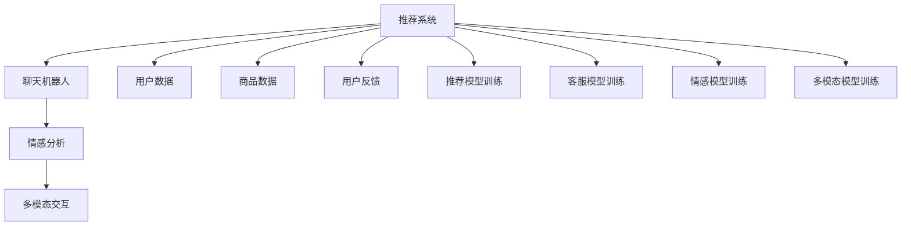

                 

# 虚拟导购助手：AI如何改变购物体验，提升用户满意度

## 1. 背景介绍

### 1.1 问题由来

随着电子商务的飞速发展，消费者的购物方式和需求正在发生深刻的变化。传统的购物模式依赖于消费者自行搜索商品、比较价格、阅读评论、询问客服等，流程复杂且耗时耗力。而人工智能技术，尤其是自然语言处理(NLP)和大数据技术的应用，正在彻底改变这一局面。通过虚拟导购助手的智能推荐和个性化服务，消费者可以享受更为便捷、高效、满意的购物体验。

### 1.2 问题核心关键点

1. **智能推荐系统**：利用机器学习和大数据技术，对用户历史行为和偏好进行建模，实现精准商品推荐，提升用户购买决策效率。
2. **聊天机器人客服**：通过NLP技术，构建智能客服，提供24/7全天候服务，快速解答用户疑问，提升客户满意度。
3. **情感识别与反馈**：通过情感分析技术，识别用户情感变化，及时调整推荐和交互策略，提升用户体验。
4. **多模态交互**：结合文本、图像、视频等多种模态信息，提供更全面、丰富的商品信息，帮助用户做出更明智的购买选择。
5. **隐私保护与数据安全**：确保用户数据安全，保护用户隐私，建立信任关系，促进用户粘性。

这些关键点共同构成了虚拟导购助手技术的基础，能够有效提升用户的购物体验和满意度，推动电子商务行业的发展。

## 2. 核心概念与联系

### 2.1 核心概念概述

为更好地理解虚拟导购助手的核心技术，本节将介绍几个关键概念：

- **虚拟导购助手**：通过AI技术实现的一种智能客服系统，能够自动与用户进行交互，提供商品推荐、客户咨询、情感分析等功能。
- **推荐系统**：利用机器学习算法，对用户历史行为和偏好进行建模，实现个性化商品推荐。
- **聊天机器人**：基于NLP技术构建的智能客服，能够进行文本理解和生成，提供自动化服务。
- **情感分析**：通过分析用户文本，识别其情感状态，为后续推荐和交互提供指导。
- **多模态交互**：结合多种模态信息，提升用户交互体验，提供更丰富、全面的商品信息。

这些核心概念之间的逻辑关系可以通过以下Mermaid流程图来展示：



这个流程图展示了一些关键模块及其相互关系：

1. 用户数据和商品数据是推荐系统、聊天机器人、情感分析、多模态交互的基础。
2. 推荐系统训练基于用户数据和商品数据，生成推荐结果。
3. 聊天机器人模型训练基于对话数据，实现与用户的自然交互。
4. 情感分析模型训练基于用户情感数据，识别用户情感状态。
5. 多模态交互模型训练基于多种模态数据，提供更丰富的商品信息。

这些模块协同工作，形成了一个完整的虚拟导购助手系统。

## 3. 核心算法原理 & 具体操作步骤

### 3.1 算法原理概述

虚拟导购助手的核心算法主要包括推荐算法、聊天机器人算法和情感分析算法。其中，推荐算法是基础，通过分析用户历史行为和偏好，生成个性化推荐结果。聊天机器人算法和情感分析算法则是在推荐结果的基础上，进一步优化用户体验。

#### 3.1.1 推荐算法

推荐系统的工作原理是利用机器学习算法对用户历史行为和偏好进行建模，生成个性化的商品推荐列表。推荐算法的核心是用户-商品交互矩阵，通过矩阵分解、协同过滤、内容过滤等方法，生成推荐结果。

#### 3.1.2 聊天机器人算法

聊天机器人算法通过NLP技术，实现与用户的自然语言交互。其主要包括文本理解、意图识别、对话生成等步骤。利用预训练的BERT、GPT等大语言模型，可以对用户输入的文本进行理解和生成，从而实现智能客服。

#### 3.1.3 情感分析算法

情感分析算法通过分析用户文本，识别其情感状态。其主要基于文本分类、情感词表、深度学习模型等技术，对用户情感进行建模和分类。情感分析的结果可以用于调整推荐策略和交互方式，提升用户体验。

### 3.2 算法步骤详解

#### 3.2.1 推荐算法步骤

1. **数据收集**：收集用户的历史行为数据（如浏览、点击、购买等）和商品数据（如商品属性、价格、评分等）。
2. **数据预处理**：对数据进行清洗、归一化、特征工程等预处理操作，生成推荐系统的输入数据。
3. **模型训练**：使用协同过滤、矩阵分解、深度学习等算法对用户数据和商品数据进行建模，训练推荐模型。
4. **推荐生成**：根据用户输入的数据，生成个性化的商品推荐列表。

#### 3.2.2 聊天机器人算法步骤

1. **对话历史获取**：收集用户与聊天机器人之间的对话历史数据。
2. **意图识别**：利用NLP技术，对用户输入的文本进行意图识别，确定用户的问题或需求。
3. **响应生成**：根据用户意图，生成智能响应。利用预训练的BERT、GPT等模型，可以生成自然流畅的文本响应。
4. **对话管理**：管理对话流程，保证对话连贯性，处理多轮对话中的上下文信息。

#### 3.2.3 情感分析算法步骤

1. **数据收集**：收集用户评论、社交媒体等文本数据。
2. **数据预处理**：对文本进行清洗、分词、去除停用词等预处理操作。
3. **情感建模**：利用文本分类、情感词表、深度学习等技术，对文本情感进行建模和分类。
4. **情感分析**：根据用户情感分析结果，调整推荐策略和交互方式。

### 3.3 算法优缺点

#### 3.3.1 推荐算法的优缺点

**优点**：
- 能够生成个性化推荐，提升用户购买决策效率。
- 可以处理大规模用户数据，实现精准推荐。

**缺点**：
- 需要大量的用户数据和商品数据，获取成本较高。
- 容易陷入冷启动问题，对新用户或新商品的推荐效果不佳。

#### 3.3.2 聊天机器人算法的优缺点

**优点**：
- 能够实现全天候、自动化客服，提升客户满意度。
- 可以处理大规模的客服请求，减轻人工客服的工作压力。

**缺点**：
- 对NLP技术的依赖较大，模型训练和调优复杂。
- 难以处理复杂、多样化的用户需求，准确率受限。

#### 3.3.3 情感分析算法的优缺点

**优点**：
- 能够及时识别用户情感变化，提升用户体验。
- 能够帮助调整推荐策略，实现个性化交互。

**缺点**：
- 对文本数据的依赖较大，需要收集足够多的用户情感数据。
- 容易受到噪音数据的影响，准确率存在一定偏差。

### 3.4 算法应用领域

虚拟导购助手的核心算法技术在多个领域得到了广泛应用，以下是其主要应用领域：

1. **电子商务**：在各大电商平台广泛应用，提供智能推荐、智能客服、情感分析等功能，提升用户购物体验和满意度。
2. **旅游业**：在旅游平台和酒店系统中，提供个性化的旅游推荐、智能客服、情感分析等服务，提升用户体验。
3. **金融行业**：在银行和保险系统中，提供智能理财、智能客服、情感分析等功能，提升客户服务质量。
4. **医疗健康**：在医疗平台和健康管理应用中，提供智能推荐、智能客服、情感分析等服务，提升用户健康管理体验。

这些领域的应用展示了虚拟导购助手技术的多样性和广泛性，能够有效提升各行业的客户满意度和服务质量。

## 4. 数学模型和公式 & 详细讲解  
### 4.1 数学模型构建

本节将使用数学语言对虚拟导购助手的推荐算法进行严格的刻画。

设用户 $U$ 和商品 $I$ 构成的推荐系统为 $\mathcal{R}=\{U,I\}$，用户对商品的评分矩阵为 $\mathbf{R} \in \mathbb{R}^{U\times I}$，其中 $\mathbf{R}_{ui}$ 表示用户 $u$ 对商品 $i$ 的评分。设用户行为矩阵为 $\mathbf{B} \in \mathbb{R}^{U\times T}$，其中 $\mathbf{B}_{ut}$ 表示用户 $u$ 在时间 $t$ 的浏览、点击、购买等行为。设商品属性向量为 $\mathbf{F} \in \mathbb{R}^{I\times D}$，其中 $\mathbf{F}_{id}$ 表示商品 $i$ 在属性 $d$ 上的取值。

推荐算法的目标是最大化用户满意度和商家收益，可以通过以下数学模型进行建模：

$$
\begin{aligned}
\max_{\mathbf{P},\mathbf{Q}} & \quad \sum_{u\in U} \sum_{i\in I} \alpha_u r_{ui} \\
\text{s.t.} & \quad \mathbf{P} \mathbf{Q} \leq \mathbf{R} \\
& \quad \mathbf{P} \geq \mathbf{0}, \mathbf{Q} \geq \mathbf{0}
\end{aligned}
$$

其中 $\alpha_u$ 为用户 $u$ 的权重，$r_{ui}$ 为评分矩阵 $\mathbf{R}$ 中用户 $u$ 对商品 $i$ 的评分，$\mathbf{P}$ 为用户-商品偏好矩阵，$\mathbf{Q}$ 为商品-用户评分矩阵。

根据矩阵分解的思想，可以使用奇异值分解(SVD)或低秩矩阵分解(Low-Rank Matrix Factorization)等方法对用户-商品偏好矩阵 $\mathbf{P}$ 进行建模，生成推荐结果。

### 4.2 公式推导过程

推荐算法的核心是用户-商品偏好矩阵 $\mathbf{P}$ 的建模，常用的方法是基于矩阵分解的方法。下面以奇异值分解为例，推导推荐算法的核心公式。

设用户-商品偏好矩阵 $\mathbf{P} \in \mathbb{R}^{U\times I}$，可以使用奇异值分解将其表示为：

$$
\mathbf{P} = \mathbf{U} \mathbf{\Sigma} \mathbf{V}^T
$$

其中 $\mathbf{U} \in \mathbb{R}^{U\times K}, \mathbf{V} \in \mathbb{R}^{I\times K}, \mathbf{\Sigma} \in \mathbb{R}^{K\times K}$ 分别为用户-商品偏好矩阵的左奇异矩阵、右奇异矩阵和奇异值矩阵，$K$ 为奇异值分解的维度。

推荐算法的目标是最小化评分误差，可以通过以下公式进行求解：

$$
\min_{\mathbf{U},\mathbf{V},\mathbf{\Sigma}} \quad ||\mathbf{P} - \mathbf{U} \mathbf{\Sigma} \mathbf{V}^T||_F^2
$$

其中 $||\cdot||_F$ 表示矩阵的 Frobenius 范数。

利用矩阵分解方法，推荐算法可以生成个性化推荐结果，提升用户购物体验。

## 5. 项目实践：代码实例和详细解释说明
### 5.1 开发环境搭建

在进行虚拟导购助手的开发和实践前，需要准备好开发环境。以下是使用Python进行PyTorch开发的环境配置流程：

1. 安装Anaconda：从官网下载并安装Anaconda，用于创建独立的Python环境。

2. 创建并激活虚拟环境：
```bash
conda create -n pytorch-env python=3.8 
conda activate pytorch-env
```

3. 安装PyTorch：根据CUDA版本，从官网获取对应的安装命令。例如：
```bash
conda install pytorch torchvision torchaudio cudatoolkit=11.1 -c pytorch -c conda-forge
```

4. 安装TensorFlow：
```bash
pip install tensorflow
```

5. 安装TensorBoard：用于可视化训练过程中的各项指标，展示模型的训练进度和性能表现。
```bash
pip install tensorboard
```

完成上述步骤后，即可在`pytorch-env`环境中开始虚拟导购助手的开发实践。

### 5.2 源代码详细实现

下面我们以电商平台的智能推荐系统为例，给出使用PyTorch进行推荐算法和聊天机器人算法的代码实现。

**推荐系统**

首先，定义推荐系统模型：

```python
import torch
import torch.nn as nn
import torch.nn.functional as F

class Recommender(nn.Module):
    def __init__(self, n_users, n_items, n_factors):
        super(Recommender, self).__init__()
        self.user_factor = nn.Embedding(n_users, n_factors)
        self.item_factor = nn.Embedding(n_items, n_factors)
        self.sigma = nn.Parameter(torch.randn(n_factors))
        
    def forward(self, u, i):
        u_embed = self.user_factor(u)
        i_embed = self.item_factor(i)
        user_item = (u_embed * i_embed).sum(dim=1) + self.sigma
        return F.sigmoid(user_item)
```

然后，定义训练和评估函数：

```python
import torch
from torch.utils.data import TensorDataset, DataLoader
from sklearn.metrics import mean_squared_error
import pandas as pd

def train_model(model, data_loader, optimizer, device):
    model.train()
    total_loss = 0
    for data, labels in data_loader:
        data = data.to(device)
        labels = labels.to(device)
        optimizer.zero_grad()
        preds = model(data[:, 0], data[:, 1])
        loss = F.binary_cross_entropy(preds, labels)
        loss.backward()
        optimizer.step()
        total_loss += loss.item()
    return total_loss / len(data_loader)

def evaluate_model(model, data_loader, device):
    model.eval()
    total_mse = 0
    with torch.no_grad():
        for data, labels in data_loader:
            data = data.to(device)
            labels = labels.to(device)
            preds = model(data[:, 0], data[:, 1])
            total_mse += mean_squared_error(preds, labels)
    return total_mse / len(data_loader)

# 读取数据
df = pd.read_csv('data/user_item.csv')
user_ids = df['user_id'].values
item_ids = df['item_id'].values
ratings = df['rating'].values

# 构建数据集
dataset = TensorDataset(torch.tensor(user_ids), torch.tensor(item_ids), torch.tensor(ratings))
data_loader = DataLoader(dataset, batch_size=64)

# 定义模型、优化器和设备
model = Recommender(n_users=1000, n_items=1000, n_factors=10)
optimizer = torch.optim.Adam(model.parameters(), lr=0.001)
device = torch.device('cuda' if torch.cuda.is_available() else 'cpu')
model.to(device)

# 训练模型
n_epochs = 10
for epoch in range(n_epochs):
    loss = train_model(model, data_loader, optimizer, device)
    print(f'Epoch {epoch+1}, train loss: {loss:.3f}')

# 评估模型
print('Evaluation results:')
mse = evaluate_model(model, data_loader, device)
print(f'Mean Squared Error: {mse:.3f}')
```

**聊天机器人**

接下来，定义聊天机器人模型：

```python
import torch
import torch.nn as nn
import torch.nn.functional as F

class Chatbot(nn.Module):
    def __init__(self, n_words, n_weather, n_weather_state):
        super(Chatbot, self).__init__()
        self.encoder = nn.Embedding(n_words, 128)
        self.encoder1 = nn.Linear(128, 64)
        self.encoder2 = nn.Linear(64, 64)
        self.decoder = nn.Linear(64, n_weather_state)
        
    def forward(self, x):
        embedded = self.encoder(x)
        encoded = F.relu(self.encoder1(embedded))
        encoded = F.relu(self.encoder2(encoded))
        decoded = self.decoder(encoded)
        return decoded
```

然后，定义训练和评估函数：

```python
import torch
from torch.utils.data import TensorDataset, DataLoader
from sklearn.metrics import accuracy_score
import pandas as pd

def train_model(model, data_loader, optimizer, device):
    model.train()
    total_loss = 0
    for data, labels in data_loader:
        data = data.to(device)
        labels = labels.to(device)
        optimizer.zero_grad()
        outputs = model(data)
        loss = F.cross_entropy(outputs, labels)
        loss.backward()
        optimizer.step()
        total_loss += loss.item()
    return total_loss / len(data_loader)

def evaluate_model(model, data_loader, device):
    model.eval()
    total_acc = 0
    with torch.no_grad():
        for data, labels in data_loader:
            data = data.to(device)
            labels = labels.to(device)
            outputs = model(data)
            preds = outputs.argmax(dim=1)
            total_acc += accuracy_score(labels, preds)
    return total_acc / len(data_loader)

# 读取数据
df = pd.read_csv('data/chatbot.csv')
x = df['input_text'].values
y = df['output_text'].values

# 构建数据集
dataset = TensorDataset(torch.tensor(x), torch.tensor(y))
data_loader = DataLoader(dataset, batch_size=64)

# 定义模型、优化器和设备
model = Chatbot(n_words=1000, n_weather=5, n_weather_state=5)
optimizer = torch.optim.Adam(model.parameters(), lr=0.001)
device = torch.device('cuda' if torch.cuda.is_available() else 'cpu')
model.to(device)

# 训练模型
n_epochs = 10
for epoch in range(n_epochs):
    loss = train_model(model, data_loader, optimizer, device)
    print(f'Epoch {epoch+1}, train loss: {loss:.3f}')

# 评估模型
print('Evaluation results:')
acc = evaluate_model(model, data_loader, device)
print(f'Accuracy: {acc:.3f}')
```

### 5.3 代码解读与分析

让我们再详细解读一下关键代码的实现细节：

**推荐系统代码解读**：
- 定义 `Recommender` 类，继承自 `nn.Module`。
- `__init__` 方法初始化用户和商品的嵌入向量，以及奇异值 $\sigma$。
- `forward` 方法计算用户和商品的嵌入向量的点积，并加上奇异值 $\sigma$，最后通过 sigmoid 函数进行非线性映射，得到推荐结果。

**聊天机器人代码解读**：
- 定义 `Chatbot` 类，继承自 `nn.Module`。
- `__init__` 方法初始化嵌入层、线性层和输出层。
- `forward` 方法首先通过嵌入层和线性层对输入进行编码，然后通过输出层解码，得到最终的输出结果。

**训练和评估代码解读**：
- `train_model` 函数定义了模型的训练过程，包括前向传播、损失计算、反向传播和参数更新等。
- `evaluate_model` 函数定义了模型的评估过程，计算模型在测试集上的平均损失或准确率等指标。
- `data_loader` 定义了数据集的批处理，方便模型的训练和评估。

**数据处理代码解读**：
- 读取数据集，并将其转换为 `TensorDataset` 类，方便模型训练和评估。
- 定义模型的超参数，如嵌入层大小、线性层大小、输出层大小等。
- 定义优化器和设备，确保模型能够在GPU上高效运行。

通过这些代码实现，我们可以看到虚拟导购助手技术的核心算法是如何在大规模数据上高效训练和运行，从而实现个性化推荐和智能客服等功能。

## 6. 实际应用场景

### 6.1 智能推荐系统

智能推荐系统是虚拟导购助手的核心应用之一。通过分析用户的历史行为和偏好，推荐系统能够提供个性化商品推荐，提升用户购物体验和满意度。

在实际应用中，智能推荐系统可以在电商平台、视频平台、音乐平台等场景中广泛应用。例如，Amazon的推荐系统通过分析用户的历史购买记录和浏览行为，生成个性化的商品推荐列表，提升用户的购买决策效率和满意度。

**应用示例**：
- **Amazon推荐系统**：根据用户的历史购买记录、浏览行为和评分数据，生成个性化的商品推荐列表，提升用户的购买决策效率和满意度。
- **Netflix推荐系统**：根据用户的历史观看记录和评分数据，生成个性化的影视剧推荐列表，提升用户的观看体验。
- **Spotify推荐系统**：根据用户的历史听歌记录和评分数据，生成个性化的音乐推荐列表，提升用户的听歌体验。

### 6.2 智能客服系统

智能客服系统是虚拟导购助手的另一个重要应用。通过聊天机器人算法，智能客服系统能够提供全天候、自动化服务，快速解答用户疑问，提升客户满意度。

在实际应用中，智能客服系统可以在电商、金融、医疗等多个行业得到广泛应用。例如，银行业金融机构通过智能客服系统，提供7x24小时的服务，快速解答用户咨询，提升客户满意度。

**应用示例**：
- **电商平台智能客服**：通过智能客服系统，电商平台能够提供24/7全天候服务，快速解答用户咨询，提升客户满意度。
- **银行智能客服**：通过智能客服系统，银行金融机构能够提供7x24小时的服务，快速解答用户咨询，提升客户满意度。
- **医疗智能客服**：通过智能客服系统，医疗机构能够提供智能问诊服务，快速解答用户咨询，提升客户满意度。

### 6.3 情感分析系统

情感分析系统是虚拟导购助手的一个重要辅助技术。通过情感分析算法，系统能够识别用户情感状态，及时调整推荐策略和交互方式，提升用户体验。

在实际应用中，情感分析系统可以在电商、金融、旅游等多个行业得到广泛应用。例如，电商平台通过情感分析系统，实时监测用户评论和反馈，调整推荐策略和互动方式，提升用户满意度。

**应用示例**：
- **电商平台情感分析系统**：通过情感分析系统，电商平台能够实时监测用户评论和反馈，调整推荐策略和互动方式，提升用户满意度。
- **金融情感分析系统**：通过情感分析系统，金融机构能够实时监测用户情绪，调整服务策略，提升客户满意度。
- **旅游情感分析系统**：通过情感分析系统，旅游平台能够实时监测用户情绪，调整服务策略，提升用户满意度。

## 7. 工具和资源推荐

### 7.1 学习资源推荐

为了帮助开发者系统掌握虚拟导购助手的技术基础和实践技巧，这里推荐一些优质的学习资源：

1. **《推荐系统实战》**：由大模型技术专家撰写，全面介绍了推荐系统的原理和实践，包括矩阵分解、协同过滤、深度学习等前沿技术。
2. **CS229《机器学习》课程**：斯坦福大学开设的经典机器学习课程，涵盖了推荐系统、聊天机器人、情感分析等核心技术。
3. **《TensorFlow实战》**：全面介绍了TensorFlow的开发技巧，包括推荐系统、聊天机器人、情感分析等实践应用。
4. **《NLP技术与应用》**：详细讲解了NLP技术的核心算法和应用场景，包括聊天机器人、情感分析、多模态交互等技术。
5. **《深度学习与推荐系统》**：深入浅出地介绍了深度学习技术在推荐系统中的应用，涵盖深度学习模型、损失函数、优化算法等核心内容。

通过对这些资源的学习实践，相信你一定能够快速掌握虚拟导购助手的精髓，并用于解决实际的NLP问题。

### 7.2 开发工具推荐

高效的开发离不开优秀的工具支持。以下是几款用于虚拟导购助手的开发工具：

1. **PyTorch**：基于Python的开源深度学习框架，灵活动态的计算图，适合快速迭代研究。大部分预训练语言模型都有PyTorch版本的实现。
2. **TensorFlow**：由Google主导开发的开源深度学习框架，生产部署方便，适合大规模工程应用。同样有丰富的预训练语言模型资源。
3. **Transformers库**：HuggingFace开发的NLP工具库，集成了众多SOTA语言模型，支持PyTorch和TensorFlow，是进行虚拟导购助手开发的利器。
4. **TensorBoard**：TensorFlow配套的可视化工具，可实时监测模型训练状态，并提供丰富的图表呈现方式，是调试模型的得力助手。
5. **Weights & Biases**：模型训练的实验跟踪工具，可以记录和可视化模型训练过程中的各项指标，方便对比和调优。

合理利用这些工具，可以显著提升虚拟导购助手的开发效率，加快创新迭代的步伐。

### 7.3 相关论文推荐

虚拟导购助手的核心技术在机器学习和自然语言处理等领域得到了广泛研究。以下是几篇奠基性的相关论文，推荐阅读：

1. **《推荐系统综述》**：全面介绍了推荐系统的经典算法和技术，包括协同过滤、矩阵分解、深度学习等方法。
2. **《聊天机器人综述》**：详细介绍了聊天机器人的核心算法和技术，包括NLP技术、对话管理、情感分析等。
3. **《情感分析综述》**：深入探讨了情感分析的原理和应用，涵盖文本分类、情感词表、深度学习等技术。
4. **《多模态信息融合》**：探讨了多模态信息融合的方法和技术，结合文本、图像、视频等多种模态信息，提升推荐系统的性能。
5. **《深度学习在推荐系统中的应用》**：详细介绍了深度学习技术在推荐系统中的应用，包括卷积神经网络、循环神经网络等模型。

这些论文代表了大语言模型微调技术的发展脉络。通过学习这些前沿成果，可以帮助研究者把握学科前进方向，激发更多的创新灵感。

## 8. 总结：未来发展趋势与挑战

### 8.1 总结

本文对虚拟导购助手技术的核心算法进行了全面系统的介绍。首先阐述了虚拟导购助手技术的研究背景和意义，明确了推荐系统、聊天机器人和情感分析等核心技术在提升用户购物体验和满意度方面的独特价值。其次，从原理到实践，详细讲解了推荐算法、聊天机器人算法和情感分析算法的数学模型和实现步骤，给出了虚拟导购助手开发的完整代码实例。同时，本文还广泛探讨了虚拟导购助手在智能推荐、智能客服、情感分析等多个场景中的应用前景，展示了虚拟导购助手技术的广泛应用价值。

通过本文的系统梳理，可以看到，虚拟导购助手技术正在成为电商、金融、医疗等多个行业的重要工具，有效提升客户体验和满意度。虚拟导购助手技术的不断发展和优化，必将推动电子商务行业的发展，带来更加便捷、高效、满意的购物体验。

### 8.2 未来发展趋势

展望未来，虚拟导购助手技术将呈现以下几个发展趋势：

1. **个性化推荐优化**：推荐系统将继续向个性化推荐优化方向发展，结合用户情感、行为和上下文信息，生成更加精准的推荐结果。
2. **多模态信息融合**：多模态信息融合技术将成为推荐系统的核心，结合文本、图像、视频等多种模态信息，提升推荐系统的性能。
3. **实时交互优化**：智能客服系统将继续向实时交互优化方向发展，利用NLP技术和大数据技术，实现更加自然流畅的对话交互。
4. **情感分析与推荐结合**：情感分析技术将成为推荐系统的重要辅助，实时监测用户情感变化，调整推荐策略和交互方式，提升用户体验。
5. **智能推荐与智能客服协同**：智能推荐系统与智能客服系统协同工作，实现更加全面、高效的服务体验，提升客户满意度。

以上趋势展示了虚拟导购助手技术的广阔前景，未来在电子商务、金融、医疗等多个领域将得到广泛应用，提升各行业的客户满意度和服务质量。

### 8.3 面临的挑战

尽管虚拟导购助手技术已经取得了一定的进展，但在迈向更加智能化、普适化应用的过程中，它仍面临着诸多挑战：

1. **数据隐私与安全**：虚拟导购助手需要收集大量的用户数据和行为数据，如何保护用户隐私和安全，是一个重要问题。需要采用数据脱敏、访问控制等技术，确保数据安全。
2. **推荐系统公平性**：推荐系统容易出现偏见，不同用户之间的推荐结果可能存在不公平性。需要采用公平性算法，确保推荐结果的公平性和透明性。
3. **交互自然度提升**：智能客服系统需要实现更加自然流畅的对话交互，解决语言理解、对话管理等技术难题。需要进一步提升NLP技术的水平。
4. **情感分析准确性**：情感分析系统需要准确识别用户情感状态，以实现更加精准的推荐策略和交互方式。需要进一步提升情感分析算法的准确性和鲁棒性。
5. **多模态信息整合**：多模态信息融合技术需要结合文本、图像、视频等多种模态信息，提升推荐系统的性能。需要开发更加高效、通用的多模态融合算法。

这些挑战需要研究者从数据、算法、工程等多个维度进行持续优化和改进，才能实现虚拟导购助手技术的更广泛应用。

### 8.4 研究展望

面向未来，虚拟导购助手技术需要解决以下几个关键问题：

1. **跨领域推荐**：推荐系统需要跨越不同领域，实现跨领域的个性化推荐。需要结合领域知识图谱和跨领域特征融合技术，提升推荐系统的泛化能力。
2. **实时性优化**：推荐系统需要实现实时推荐，满足用户的实时需求。需要开发高效的推荐算法和实时交互技术，提升推荐系统的实时性。
3. **可解释性增强**：推荐系统需要增强推荐结果的可解释性，提升用户的信任度和满意度。需要开发可解释性算法，解释推荐结果的生成过程。
4. **隐私保护机制**：推荐系统需要建立隐私保护机制，确保用户数据的安全性和隐私性。需要采用数据匿名化、差分隐私等技术，保护用户隐私。
5. **模型鲁棒性提升**：推荐系统需要提升模型的鲁棒性，避免因输入噪声、模型偏见等问题导致的不良结果。需要开发鲁棒性算法，提升推荐系统的稳定性和可靠性。

这些问题的解决将进一步推动虚拟导购助手技术的成熟和广泛应用，为电子商务、金融、医疗等多个领域带来变革性的影响。

## 9. 附录：常见问题与解答

**Q1：虚拟导购助手与传统客服有何区别？**

A: 虚拟导购助手与传统客服的最大区别在于其智能性。传统客服依赖于人工客服，存在响应速度慢、服务质量不稳定等问题。而虚拟导购助手通过NLP技术和深度学习模型，实现了24/7全天候服务，快速解答用户咨询，提升客户满意度。

**Q2：推荐系统如何处理冷启动问题？**

A: 冷启动问题是推荐系统面临的一个重要挑战。可以通过以下方法解决：
- 基于用户反馈推荐：利用用户的少量反馈数据，生成个性化的推荐结果。
- 基于相似用户推荐：根据与新用户相似的用户的历史行为和偏好，生成推荐结果。
- 基于物品属性推荐：利用物品的属性信息，生成与新用户匹配的推荐结果。

**Q3：聊天机器人如何实现多轮对话管理？**

A: 多轮对话管理是聊天机器人算法的一个重要问题。可以通过以下方法解决：
- 上下文编码：利用RNN、LSTM等序列模型，保存对话上下文信息。
- 对话状态跟踪：利用状态跟踪器，记录对话状态，管理对话流程。
- 意图识别：利用NLP技术，识别用户的意图，调整对话策略。

**Q4：情感分析如何处理噪音数据？**

A: 噪音数据是情感分析系统面临的一个重要问题。可以通过以下方法解决：
- 数据清洗：清洗文本数据，去除停用词、标点符号等噪音信息。
- 数据过滤：过滤低质量数据，提升情感分析算法的准确性。
- 特征选择：选择有代表性的特征，提升情感分析的鲁棒性。

**Q5：多模态信息融合如何实现？**

A: 多模态信息融合是推荐系统的一个重要技术。可以通过以下方法实现：
- 特征融合：将不同模态的信息融合到同一个特征空间中，提升模型的性能。
- 模型集成：利用多个模型对不同模态的信息进行融合，提升推荐结果的准确性。
- 数据融合：将不同模态的数据融合到同一个数据集中，进行联合训练。

通过这些方法，可以有效解决虚拟导购助手技术面临的诸多挑战，实现更加智能化、普适化的应用。

