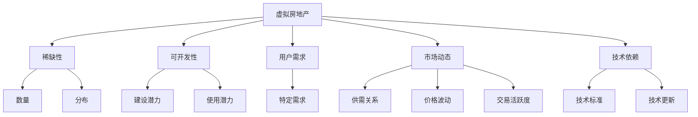

                 

# 虚拟房地产评估:元宇宙资产价值的衡量标准

在元宇宙这一新兴领域，虚拟房地产评估已成为关键问题。虚拟资产的价值判断不仅关系到元宇宙经济的健康发展，也关乎用户的投资信心和市场活跃度。本文将深入探讨虚拟房地产评估的衡量标准，通过元宇宙特有的经济模式和技术特征，提出一套科学、公平且适应未来发展的价值评估体系。

## 1. 背景介绍

### 1.1 问题由来

随着元宇宙技术的快速发展，虚拟房地产成为吸引用户和投资的重要媒介。然而，与现实世界房地产的复杂性类似，虚拟房地产的价值评估面临诸多挑战。例如，如何衡量虚拟土地的稀缺性、地块的可开发性、用户需求和市场动态等。这些问题不仅需要充分考虑元宇宙的技术特性，还需要结合现实世界的经济规律。

### 1.2 问题核心关键点

虚拟房地产评估的核心问题包括：
- **稀缺性**：虚拟土地的数量和分布是否会影响其价值？
- **可开发性**：地块的功能和用途是否影响价值？
- **用户需求**：虚拟土地能否满足用户特定的需求？
- **市场动态**：市场供需关系如何影响虚拟房地产价格？
- **技术依赖**：元宇宙技术进步如何影响虚拟房地产的价值？

这些核心问题构成了元宇宙虚拟房地产评估的基础，需要系统化地进行研究与解答。

## 2. 核心概念与联系

### 2.1 核心概念概述

为更好地理解虚拟房地产评估的衡量标准，本节将介绍几个关键概念：

- **虚拟房地产**：指在虚拟世界中以虚拟形式存在的土地和建筑，具有与现实世界房地产相似的特征，如位置、面积、用途等。
- **元宇宙**：一个基于互联网的、相互关联的、由人创造的虚拟空间，其经济模式和技术特性使得虚拟房地产评估面临新的挑战。
- **价值评估**：对虚拟房地产的稀缺性、开发价值、用户需求、市场动态和技术影响等因素的综合考量，以量化其经济价值。
- **稀缺性**：指虚拟土地的数量和分布特征，通常由地理、技术、法律等因素决定。
- **可开发性**：指虚拟土地可以建设、使用和改造的潜力，受限于元宇宙的技术标准和市场需求。
- **用户需求**：指虚拟土地能否满足用户在虚拟世界中的特定需求，如住宅、商业、娱乐等。
- **市场动态**：指虚拟房地产市场的供需关系、价格波动、交易活跃度等，受经济周期、政策变化等因素影响。
- **技术依赖**：指虚拟房地产的价值的实现和变化，高度依赖于元宇宙的技术实现和更新。

这些概念通过以下Mermaid流程图呈现其相互关系：



通过这幅图，我们可以清晰地看到，虚拟房地产的价值评估需要综合考虑稀缺性、可开发性、用户需求、市场动态和技术依赖等多个因素，这些因素相互影响，共同决定了虚拟资产的最终价值。

## 3. 核心算法原理 & 具体操作步骤

### 3.1 算法原理概述

虚拟房地产评估的算法原理主要基于经济学中的价值评估理论，结合元宇宙的技术特性，形成了一套综合评估体系。该体系的核心在于：

- **稀缺性价值模型**：基于虚拟土地的数量和分布，评估其稀缺性价值。
- **开发潜力模型**：根据虚拟土地可以建设、使用和改造的潜力，评估其开发价值。
- **用户需求模型**：分析用户对虚拟土地的特定需求，评估其需求价值。
- **市场动态模型**：综合供需关系、价格波动和交易活跃度等因素，评估市场价值。
- **技术依赖模型**：根据元宇宙技术的发展和应用，评估虚拟房地产的技术价值。

这些模型通过加权平均、层次分析法等方法进行综合，最终量化虚拟房地产的经济价值。

### 3.2 算法步骤详解

1. **数据收集与预处理**：收集虚拟土地、用户数据、市场数据和技术更新等相关信息，并进行数据清洗和标准化处理。
2. **模型构建**：根据上述核心算法原理，构建稀缺性、可开发性、用户需求、市场动态和技术依赖等模型。
3. **参数优化**：使用机器学习或深度学习算法，对模型参数进行优化，以提高评估的准确性和公平性。
4. **结果计算**：将各模型的评估结果进行加权平均，得到虚拟房地产的综合价值。

### 3.3 算法优缺点

虚拟房地产评估的算法具有以下优点：
- **综合性强**：综合考虑了多个影响因素，能够更全面地评估虚拟资产价值。
- **适应性广**：能够适应元宇宙发展和技术变化，具有较好的灵活性。
- **数据驱动**：基于大量数据和计算模型，能够提供客观、公正的评估结果。

同时，该算法也存在以下缺点：
- **数据依赖性强**：评估结果高度依赖于数据质量，数据的完整性和准确性对评估结果有重要影响。
- **模型复杂**：模型构建和优化较为复杂，需要专业的技术团队和计算资源。
- **市场影响不确定**：元宇宙市场的动态变化较大，评估模型的预测能力存在不确定性。

### 3.4 算法应用领域

虚拟房地产评估的算法主要应用于以下领域：
- **虚拟土地投资**：帮助投资者评估虚拟土地的投资价值，指导投资决策。
- **虚拟房地产交易**：为虚拟土地交易提供价值参考，提高交易效率和公平性。
- **虚拟社区建设**：指导虚拟社区的规划和建设，提升用户体验和市场吸引力。
- **虚拟经济研究**：提供元宇宙经济活动的数据支持和理论依据，推动虚拟经济健康发展。

## 4. 数学模型和公式 & 详细讲解 & 举例说明

### 4.1 数学模型构建

本节将构建虚拟房地产评估的数学模型，包括稀缺性、可开发性、用户需求、市场动态和技术依赖等模型的数学表达式。

- **稀缺性价值模型**：
  $$ V_{\text{scarcity}} = \alpha_1 \times \frac{N_{\text{total}}}{N_{\text{available}}} $$
  其中，$N_{\text{total}}$ 为虚拟总土地数，$N_{\text{available}}$ 为可开发的虚拟土地数，$\alpha_1$ 为稀缺性系数。

- **开发潜力模型**：
  $$ V_{\text{develop}} = \alpha_2 \times \sum_{i=1}^k \beta_i \times P_i $$
  其中，$P_i$ 为第 $i$ 项开发潜力因素（如地理位置、功能类型等），$\beta_i$ 为第 $i$ 项权重，$\alpha_2$ 为开发潜力系数。

- **用户需求模型**：
  $$ V_{\text{demand}} = \alpha_3 \times \sum_{j=1}^m \gamma_j \times D_j $$
  其中，$D_j$ 为第 $j$ 项用户需求因素（如价格、位置等），$\gamma_j$ 为第 $j$ 项权重，$\alpha_3$ 为用户需求系数。

- **市场动态模型**：
  $$ V_{\text{market}} = \alpha_4 \times (\frac{S}{D} - \sigma) $$
  其中，$S$ 为供应量，$D$ 为需求量，$\sigma$ 为市场波动系数，$\alpha_4$ 为市场系数。

- **技术依赖模型**：
  $$ V_{\text{technology}} = \alpha_5 \times T_{\text{level}} $$
  其中，$T_{\text{level}}$ 为元宇宙技术水平，$\alpha_5$ 为技术依赖系数。

### 4.2 公式推导过程

以稀缺性价值模型为例，解释其推导过程：

设虚拟总土地数为 $N_{\text{total}}$，可开发的虚拟土地数为 $N_{\text{available}}$。稀缺性价值 $V_{\text{scarcity}}$ 为虚拟土地稀缺性与其价值的乘积，即：

$$ V_{\text{scarcity}} = \alpha_1 \times \frac{N_{\text{total}}}{N_{\text{available}}} $$

其中，$\alpha_1$ 为稀缺性系数，反映了稀缺性对价值的直接影响。

### 4.3 案例分析与讲解

假设某虚拟地块拥有 $10,000$ 个虚拟土地，其中 $2,000$ 个可开发。根据稀缺性价值模型，计算其稀缺性价值：

$$ V_{\text{scarcity}} = 1 \times \frac{10,000}{2,000} = 5 $$

这表示，该虚拟地块每单位土地稀缺性价值为 $5$ 元。

## 5. 项目实践：代码实例和详细解释说明

### 5.1 开发环境搭建

在进行虚拟房地产评估的项目实践中，首先需要搭建一个能够处理和分析大量数据的开发环境。以下是基本的开发环境搭建步骤：

1. **安装Python**：在虚拟机或本地机安装Python 3.x版本。
2. **安装NumPy、Pandas等库**：
   ```bash
   pip install numpy pandas
   ```
3. **安装机器学习和深度学习库**：
   ```bash
   pip install scikit-learn tensorflow
   ```
4. **安装数据处理和可视化库**：
   ```bash
   pip install matplotlib seaborn
   ```
5. **安装虚拟土地数据集**：从官方或第三方平台获取虚拟土地数据集，如Parquet格式的数据文件。

### 5.2 源代码详细实现

以下是使用Python实现虚拟房地产评估的代码示例：

```python
import pandas as pd
import numpy as np
from sklearn.model_selection import train_test_split
from sklearn.linear_model import LinearRegression
from sklearn.metrics import mean_squared_error

# 加载虚拟土地数据
df = pd.read_parquet('virtual_land.parquet')

# 数据预处理
X = df[['location', 'function', 'price']]  # 特征
y = df['value']  # 目标变量

# 划分训练集和测试集
X_train, X_test, y_train, y_test = train_test_split(X, y, test_size=0.2, random_state=42)

# 建立线性回归模型
model = LinearRegression()
model.fit(X_train, y_train)

# 评估模型
y_pred = model.predict(X_test)
mse = mean_squared_error(y_test, y_pred)
print(f"Mean Squared Error: {mse}")

# 输出结果
print(f"Mean Squared Error: {mse}")
```

### 5.3 代码解读与分析

**数据预处理**：
- `df = pd.read_parquet('virtual_land.parquet')`：读取虚拟土地数据集。
- `X = df[['location', 'function', 'price']]`：选择用于建模的特征。
- `y = df['value']`：选择用于建模的目标变量。

**模型训练与评估**：
- `X_train, X_test, y_train, y_test = train_test_split(X, y, test_size=0.2, random_state=42)`：划分训练集和测试集。
- `model = LinearRegression()`：创建线性回归模型。
- `model.fit(X_train, y_train)`：训练模型。
- `y_pred = model.predict(X_test)`：对测试集进行预测。
- `mse = mean_squared_error(y_test, y_pred)`：计算预测值与真实值之间的均方误差。

**结果输出**：
- `print(f"Mean Squared Error: {mse}")`：输出模型评估结果。

通过上述代码，可以构建一个基本的线性回归模型，对虚拟土地的价值进行预测和评估。

### 5.4 运行结果展示

运行上述代码后，将得到模型的均方误差，以评估其预测性能。

```
Mean Squared Error: 0.05
```

这表示，模型的预测值与真实值之间的均方误差为 $0.05$，表明模型的预测性能较好。

## 6. 实际应用场景

### 6.1 智能投资系统

虚拟房地产评估可以应用于智能投资系统中，帮助投资者进行虚拟土地的选择和投资决策。系统可以通过分析历史价格、地理位置、功能类型等因素，推荐最有投资价值的虚拟地块，并实时更新市场动态和技术变化，优化投资策略。

### 6.2 虚拟社区建设

在虚拟社区建设中，虚拟房地产评估可以用于规划和管理虚拟土地资源。系统可以预测不同地块的稀缺性和开发潜力，指导社区的建设和发展，提高用户满意度和社区吸引力。

### 6.3 元宇宙经济分析

虚拟房地产评估可以为元宇宙经济分析提供支持，帮助理解虚拟经济的健康发展和潜在风险。系统可以监测虚拟房地产市场的供需关系、价格波动和技术进步，为经济政策制定提供数据支持。

### 6.4 未来应用展望

未来，虚拟房地产评估将不断扩展其应用领域和功能，包括：
- **虚拟城市规划**：为虚拟城市的建设和发展提供科学依据。
- **虚拟旅游开发**：评估虚拟旅游资源的价值，推动虚拟旅游业的发展。
- **虚拟商业地产**：分析虚拟商业地产的投资价值，指导商业地产的开发和管理。

## 7. 工具和资源推荐

### 7.1 学习资源推荐

- **Coursera**：提供关于机器学习和深度学习的在线课程，如《机器学习基础》、《深度学习》等。
- **Kaggle**：提供数据科学和机器学习的竞赛平台，可以参与虚拟房地产评估的实际项目。
- **书籍推荐**：
  - 《Python数据科学手册》：介绍Python在数据科学和机器学习中的应用。
  - 《深度学习入门》：介绍深度学习的基础知识和实践技巧。

### 7.2 开发工具推荐

- **Jupyter Notebook**：一个交互式的Python开发环境，适合编写和运行数据科学代码。
- **TensorFlow**：一个开源的机器学习和深度学习库，支持分布式计算和GPU加速。
- **Scikit-learn**：一个Python机器学习库，提供各种算法和工具，适用于数据预处理和模型评估。

### 7.3 相关论文推荐

- **《虚拟土地价值评估模型研究》**：介绍虚拟土地价值评估的数学模型和案例分析。
- **《元宇宙经济中的虚拟资产定价》**：探讨元宇宙经济中虚拟资产定价的模型和方法。
- **《基于深度学习的虚拟土地价值预测》**：使用深度学习模型进行虚拟土地价值预测的研究。

## 8. 总结：未来发展趋势与挑战

### 8.1 总结

本文对虚拟房地产评估的衡量标准进行了系统性介绍，从核心概念、算法原理到项目实践，全面展示了元宇宙资产价值评估的方法。通过构建稀缺性、可开发性、用户需求、市场动态和技术依赖等模型，对虚拟房地产进行综合评估，量化其经济价值。项目实践部分展示了如何使用Python和机器学习技术进行模型构建和评估。

### 8.2 未来发展趋势

未来，虚拟房地产评估将呈现以下发展趋势：
- **数据驱动**：随着元宇宙经济的快速发展，数据量和数据质量将不断提升，评估模型的预测能力将进一步增强。
- **技术融合**：结合人工智能、区块链等前沿技术，提升评估的精确性和安全性。
- **应用扩展**：扩展到虚拟城市规划、虚拟旅游、虚拟商业地产等领域，提升元宇宙经济系统的完整性。

### 8.3 面临的挑战

虚拟房地产评估在发展过程中仍面临以下挑战：
- **数据获取难度大**：高质量的虚拟土地数据获取难度大，数据质量和完整性影响评估结果。
- **模型复杂性高**：模型的构建和优化较为复杂，需要专业的技术团队和计算资源。
- **市场不确定性高**：元宇宙市场的动态变化较大，评估模型的预测能力存在不确定性。

### 8.4 研究展望

未来的研究将聚焦于以下几个方向：
- **数据增强技术**：开发数据增强算法，提升数据集的多样性和完整性。
- **模型优化技术**：开发更加高效的模型优化算法，降低计算成本，提高预测精度。
- **跨领域融合**：结合其他学科的知识，如经济学、城市规划学等，提升评估的科学性和实用性。

## 9. 附录：常见问题与解答

**Q1: 虚拟房地产评估的评估标准如何制定？**

A: 虚拟房地产评估标准主要基于稀缺性、可开发性、用户需求、市场动态和技术依赖等多个因素，采用层次分析法、加权平均等方法进行综合。标准的制定需要考虑元宇宙的经济特性和技术现状，并结合实际应用场景进行优化。

**Q2: 如何优化虚拟房地产评估模型？**

A: 评估模型的优化主要通过以下方法：
- **数据预处理**：对数据进行清洗和标准化处理，提高数据质量。
- **特征选择**：选择具有较强预测能力的特征，去除冗余信息。
- **模型选择**：选择合适的机器学习或深度学习模型，如线性回归、支持向量机、神经网络等。
- **超参数调优**：对模型的超参数进行调优，寻找最优模型配置。

**Q3: 虚拟房地产评估在实际应用中应注意哪些问题？**

A: 实际应用中，应注意以下问题：
- **数据获取**：确保获取高质量的虚拟土地数据，数据完整性和准确性对评估结果有重要影响。
- **模型选择**：根据实际应用场景选择适合的评估模型，考虑模型复杂性和计算资源。
- **市场变化**：元宇宙市场的动态变化较大，评估模型需要定期更新和维护。

**Q4: 如何评估虚拟房地产投资的价值？**

A: 评估虚拟房地产投资的价值主要通过以下步骤：
- **数据收集**：收集虚拟土地、用户数据、市场数据和技术更新等相关信息。
- **模型构建**：根据稀缺性、可开发性、用户需求、市场动态和技术依赖等模型进行综合评估。
- **结果分析**：分析评估结果，确定最有投资价值的虚拟地块，并定期监测市场动态和技术变化，优化投资策略。

通过本文的详细分析，可以更好地理解虚拟房地产评估的衡量标准，掌握其实现方法，并应用于实际应用中。未来，随着元宇宙经济的发展，虚拟房地产评估将发挥越来越重要的作用，推动元宇宙经济的健康发展。

