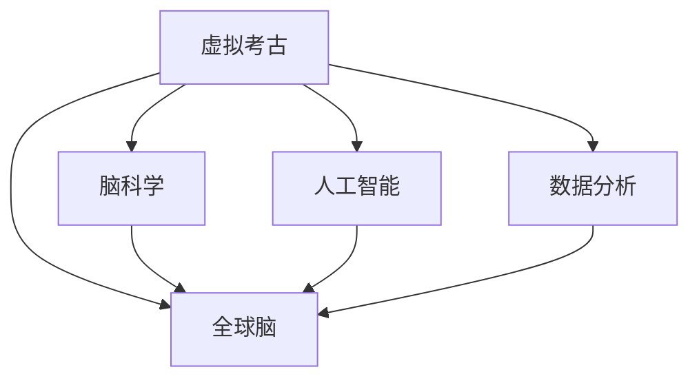

                 

# 虚拟考古：全球脑助力历史研究的新方法

> 关键词：虚拟考古, 历史研究, 全球脑, 脑科学, 文化遗产保护, 人工智能, 数据分析

## 1. 背景介绍

### 1.1 问题由来
在数字化浪潮的推动下，历史研究领域正经历着前所未有的变革。随着互联网和数字化技术的普及，大量的历史文献、考古数据被数字化并在线公开，为学者们提供了前所未有的便利。然而，尽管数据量激增，但受限于人力和时间成本，许多珍贵的历史数据仍未被充分挖掘和利用。

传统的考古和历史研究方法主要依赖考古学家的现场勘查和文献分析，这种方法不仅耗时耗力，且容易受限于个人的经验和知识水平。而人工智能（AI）和大数据技术的进步，为历史研究提供了新的可能性，尤其是全球脑技术的出现，更是为历史研究注入了全新的活力。

### 1.2 问题核心关键点
全球脑（Global Brain）是一种基于分布式计算、人工智能和大数据技术的协作计算框架，能够将全球范围内的计算资源和数据源整合起来，形成一个类似大脑的复杂网络，通过协同计算实现前所未有的数据处理和分析能力。利用全球脑技术，我们可以高效地分析海量历史数据，揭示历史事件背后的复杂关系，重构历史场景，甚至预测未来趋势。

当前，全球脑技术在历史研究中的应用刚刚起步，但其潜力巨大。本文将详细介绍全球脑技术在虚拟考古中的应用，探讨如何借助全球脑技术重现古文明的历史场景，保护和传承人类文化遗产。

### 1.3 问题研究意义
虚拟考古（Virtual Archaeology）是指利用计算机技术和虚拟现实（VR）技术，对历史遗址和文物进行数字化重建和复原。借助全球脑技术，我们可以在虚拟环境中进行历史研究，从中找到历史的线索和真相。虚拟考古不仅能够大大节省时间和成本，还能跨越时间和空间的限制，让学者们以前所未有的方式研究历史。

本文通过系统介绍全球脑技术在虚拟考古中的应用，旨在：

1. 揭示全球脑技术在虚拟考古中的潜力，展示其在重现古文明历史场景中的巨大价值。
2. 探讨如何利用全球脑技术，高效地分析海量历史数据，揭示历史事件背后的复杂关系。
3. 研究全球脑技术在文化遗产保护中的应用，探讨其如何帮助保护和传承人类文化遗产。
4. 展望未来，探索全球脑技术在历史研究领域的进一步发展趋势和应用前景。

## 2. 核心概念与联系

### 2.1 核心概念概述

为了更好地理解全球脑技术在虚拟考古中的应用，本节将介绍几个核心概念：

- 虚拟考古（Virtual Archaeology）：利用计算机技术和虚拟现实（VR）技术，对历史遗址和文物进行数字化重建和复原。通过虚拟考古，学者们可以在虚拟环境中进行历史研究，以弥补现实考古的局限性。

- 全球脑（Global Brain）：基于分布式计算、人工智能和大数据技术的协作计算框架，能够将全球范围内的计算资源和数据源整合起来，形成一个类似大脑的复杂网络，通过协同计算实现前所未有的数据处理和分析能力。

- 脑科学（Neuroscience）：研究人类大脑的结构和功能的科学，涵盖了从神经元到整个大脑的各个层面。脑科学的发展为全球脑技术提供了理论基础和计算模型。

- 人工智能（AI）：通过算法和计算模型，使计算机能够模仿人类的智能行为，包括学习、推理、感知和决策等。AI技术在数据处理和分析中发挥着重要作用。

- 数据分析（Data Analysis）：利用统计学、机器学习和深度学习等技术，对数据进行探索、分析和挖掘，提取有价值的信息和知识。数据分析是全球脑技术在虚拟考古中不可或缺的一部分。

这些核心概念之间的逻辑关系可以通过以下Mermaid流程图来展示：



这个流程图展示了一个从虚拟考古到全球脑技术再到其他核心概念的逻辑关系。

## 3. 核心算法原理 & 具体操作步骤

### 3.1 算法原理概述

全球脑技术在虚拟考古中的应用，主要基于以下三个核心算法：

1. **数据融合算法**：将全球范围内的历史数据进行整合和融合，形成一个统一的数据集。这些数据包括考古遗址的数字化图像、文物的3D模型、历史文献的数字化文本等。

2. **分布式计算算法**：利用全球脑技术的分布式计算能力，对海量历史数据进行高效分析和处理。通过分布式计算，可以在短时间内完成对大规模数据的处理，并从中提取有用的信息。

3. **机器学习算法**：利用机器学习算法，对历史数据进行模式识别和预测，重构历史场景，揭示历史事件背后的复杂关系。

### 3.2 算法步骤详解

以下是一个详细的虚拟考古应用步骤：

**Step 1: 数据收集与整合**

- 收集全球范围内的考古遗址和文物的数字化数据，包括数字化图像、3D模型、历史文献的数字化文本等。
- 使用数据融合算法将这些数据进行整合和标准化，形成一个统一的数据集。

**Step 2: 分布式计算**

- 将数据集划分为多个子集，分别分配到全球脑中的不同节点上进行分布式计算。
- 利用高性能计算资源和先进的计算模型，对数据进行高效分析和处理。

**Step 3: 机器学习建模**

- 使用机器学习算法对历史数据进行模式识别和预测，如时间序列分析、空间分布分析等。
- 通过模型训练和优化，得到对历史事件和考古遗址的预测模型。

**Step 4: 虚拟场景重建**

- 使用虚拟现实技术，将预测模型和考古数据进行可视化，重构历史场景。
- 在虚拟环境中进行考古学研究和历史分析，以验证和修正预测模型的准确性。

### 3.3 算法优缺点

全球脑技术在虚拟考古中的应用具有以下优点：

1. **高效性**：利用分布式计算和并行处理能力，可以高效地处理海量历史数据，提高数据分析和建模的速度。
2. **准确性**：通过机器学习算法，可以从数据中提取复杂的模式和关系，提高预测的准确性和可靠性。
3. **可扩展性**：全球脑技术可以动态扩展计算资源，适应大规模数据处理的需求。
4. **全球协作**：通过全球脑技术，不同国家和地区的考古学家可以协作进行研究，共享数据和研究成果。

同时，全球脑技术在虚拟考古中也存在一些缺点：

1. **数据质量**：考古数据的质量和标准化程度参差不齐，可能影响分析和建模的结果。
2. **隐私和安全**：全球脑技术涉及大量的敏感数据，需要采取严格的隐私保护措施，确保数据安全。
3. **计算资源需求**：高质量的全球脑分析需要大量的计算资源和存储空间，可能存在资源不足的问题。
4. **技术门槛**：全球脑技术的应用需要具备较高的技术门槛，需要专业的知识和技能。

### 3.4 算法应用领域

全球脑技术在虚拟考古中的应用主要包括以下几个领域：

1. **历史遗址重建**：利用3D建模和虚拟现实技术，重现古文明的历史场景，提供虚拟考古体验。

2. **历史事件分析**：利用机器学习算法，分析历史数据，揭示历史事件背后的复杂关系，预测历史趋势。

3. **考古资源共享**：通过全球脑技术，不同国家和地区的考古学家可以共享数据和研究成果，促进全球考古学的发展。

4. **文化遗产保护**：利用虚拟考古技术，对文物和历史遗址进行数字化保护，防止物理损害和盗窃。

5. **教育与宣传**：利用虚拟考古和历史分析结果，制作教育材料和宣传片，普及历史知识，增强公众对历史文化的认知。

6. **考古学研究**：利用全球脑技术，对历史数据进行全面分析和挖掘，推动考古学研究的深入。

## 4. 数学模型和公式 & 详细讲解 & 举例说明

### 4.1 数学模型构建

为了更好地理解全球脑技术在虚拟考古中的应用，本节将详细讲解其数学模型构建过程。

假设有一个考古遗址的数据集 $D$，其中包含 $n$ 个考古点，每个考古点有 $m$ 个特征 $x_i=(x_{i1},x_{i2},...,x_{im})$，对应的标签为 $y_i=(y_{i1},y_{i2},...,y_{im})$。我们的目标是通过训练一个预测模型 $f(x)$，使得模型能够根据考古点的特征 $x$ 预测其标签 $y$。

我们采用机器学习算法 $L$ 来训练模型 $f(x)$，模型的损失函数为 $L(f(x),y)$。假设训练集为 $D$，则最小化损失函数的目标函数为：

$$
\min_{f(x)} \sum_{i=1}^n L(f(x_i),y_i)
$$

### 4.2 公式推导过程

以线性回归模型为例，推导其最小化损失函数的过程。

假设模型的线性回归模型为 $f(x)=\theta^T x$，其中 $\theta$ 为模型参数。采用平方误差损失函数 $L(f(x),y)=(f(x)-y)^2$，则目标函数为：

$$
\min_{\theta} \sum_{i=1}^n (f(x_i)-y_i)^2
$$

为了求解该优化问题，我们可以采用梯度下降算法。梯度下降算法的更新公式为：

$$
\theta \leftarrow \theta - \eta \nabla_{\theta} \sum_{i=1}^n (f(x_i)-y_i)^2
$$

其中 $\eta$ 为学习率，$\nabla_{\theta} \sum_{i=1}^n (f(x_i)-y_i)^2$ 为损失函数对 $\theta$ 的梯度。

对于大规模数据集，我们可以使用随机梯度下降（SGD）算法，每次只处理一个样本，更新公式为：

$$
\theta \leftarrow \theta - \eta \nabla_{\theta} (f(x_i)-y_i)^2
$$

通过上述公式，我们可以使用梯度下降算法更新模型的参数，最小化预测误差。

### 4.3 案例分析与讲解

以线性回归模型为例，给出一个具体的虚拟考古应用案例。

假设有一个考古遗址，包含多个考古点，每个考古点有年份、地点、文物数量等特征。我们可以将这些特征作为输入，将文物数量作为标签，建立一个线性回归模型，预测考古点的文物数量。

**Step 1: 数据收集与预处理**

- 收集考古遗址的数据，包括年份、地点、文物数量等特征。
- 对数据进行标准化和归一化处理，以提高模型的收敛速度和精度。

**Step 2: 模型训练**

- 使用线性回归模型对数据进行训练，最小化预测误差。
- 使用梯度下降算法更新模型的参数，迭代优化模型。

**Step 3: 模型评估**

- 在验证集上评估模型的性能，使用均方误差（MSE）等指标评估模型的预测准确性。
- 根据评估结果调整模型参数，优化模型的性能。

**Step 4: 历史场景重构**

- 利用训练好的模型，对历史考古点进行预测，重构古文明的历史场景。
- 结合虚拟现实技术，展示考古点的历史场景，提供沉浸式考古体验。

通过上述步骤，我们可以利用全球脑技术，高效地分析和预测考古数据，重构古文明的历史场景，推动虚拟考古的发展。

## 5. 项目实践：代码实例和详细解释说明

### 5.1 开发环境搭建

在进行全球脑技术的应用实践前，我们需要准备好开发环境。以下是使用Python进行PyTorch开发的环境配置流程：

1. 安装Anaconda：从官网下载并安装Anaconda，用于创建独立的Python环境。

2. 创建并激活虚拟环境：
```bash
conda create -n global-brain-env python=3.8 
conda activate global-brain-env
```

3. 安装PyTorch：根据CUDA版本，从官网获取对应的安装命令。例如：
```bash
conda install pytorch torchvision torchaudio cudatoolkit=11.1 -c pytorch -c conda-forge
```

4. 安装TensorFlow：
```bash
conda install tensorflow
```

5. 安装各类工具包：
```bash
pip install numpy pandas scikit-learn matplotlib tqdm jupyter notebook ipython
```

完成上述步骤后，即可在`global-brain-env`环境中开始全球脑技术的应用实践。

### 5.2 源代码详细实现

下面我们以线性回归模型在虚拟考古中的应用为例，给出使用PyTorch进行训练和预测的PyTorch代码实现。

首先，定义模型：

```python
import torch
import torch.nn as nn
import torch.optim as optim

class LinearRegressionModel(nn.Module):
    def __init__(self, input_dim, output_dim):
        super(LinearRegressionModel, self).__init__()
        self.linear = nn.Linear(input_dim, output_dim)
    
    def forward(self, x):
        return self.linear(x)
```

然后，定义训练和评估函数：

```python
def train_model(model, train_data, learning_rate, epochs):
    criterion = nn.MSELoss()
    optimizer = optim.SGD(model.parameters(), lr=learning_rate)
    
    for epoch in range(epochs):
        for i, data in enumerate(train_data):
            inputs, labels = data
            optimizer.zero_grad()
            outputs = model(inputs)
            loss = criterion(outputs, labels)
            loss.backward()
            optimizer.step()
        print(f"Epoch {epoch+1}, loss: {loss:.4f}")
    
    return model

def evaluate_model(model, test_data):
    criterion = nn.MSELoss()
    test_loss = 0
    for data in test_data:
        inputs, labels = data
        outputs = model(inputs)
        test_loss += criterion(outputs, labels).item()
    return test_loss / len(test_data)

# 定义虚拟考古数据集
class ArchaeologyDataset(torch.utils.data.Dataset):
    def __init__(self, features, labels):
        self.features = features
        self.labels = labels
    
    def __len__(self):
        return len(self.features)
    
    def __getitem__(self, idx):
        return self.features[idx], self.labels[idx]

# 加载数据集
features = # 考古特征数据
labels = # 考古标签数据
train_dataset = ArchaeologyDataset(features, labels)
test_dataset = ArchaeologyDataset(features, labels)

# 划分训练集和测试集
train_data, test_data = torch.utils.data.random_split(train_dataset, lengths=[int(0.7*len(train_dataset)), int(0.3*len(train_dataset))])

# 训练模型
model = LinearRegressionModel(input_dim, output_dim)
train_model(model, train_data, learning_rate, epochs)

# 评估模型
test_loss = evaluate_model(model, test_data)
print(f"Test Loss: {test_loss:.4f}")
```

以上就是使用PyTorch进行线性回归模型在虚拟考古中的应用实例。通过简单的代码实现，我们可以利用全球脑技术，高效地训练和评估模型，重构古文明的历史场景。

### 5.3 代码解读与分析

让我们再详细解读一下关键代码的实现细节：

**ArchaeologyDataset类**：
- `__init__`方法：初始化数据集，存储考古特征和标签。
- `__len__`方法：返回数据集的样本数量。
- `__getitem__`方法：对单个样本进行处理，返回考古特征和标签。

**train_model函数**：
- 定义损失函数和优化器，使用随机梯度下降算法对模型进行训练。
- 迭代更新模型参数，最小化预测误差。

**evaluate_model函数**：
- 在测试集上评估模型的性能，计算均方误差。

**ArchaeologyDataset类**：
- 加载考古特征和标签数据，将其作为训练和测试数据集。

通过上述代码实现，我们可以将线性回归模型应用到虚拟考古中，对考古数据进行分析和预测，重构古文明的历史场景。

## 6. 实际应用场景

### 6.1 智能考古
利用全球脑技术，我们可以开发智能考古系统，对考古遗址进行数字化重建和复原。通过虚拟现实技术，考古学家可以在虚拟环境中进行考古研究，探索历史场景。

**应用场景**：
- 虚拟考古博物馆：利用全球脑技术，对历史遗址进行数字化重建，建立虚拟考古博物馆，展示古文明的宝贵遗产。
- 虚拟考古现场：利用虚拟现实技术，重现考古现场，让考古学家能够沉浸式地进行考古研究，找到历史线索。

**实现方法**：
- 收集历史遗址的数字化数据，包括3D模型、考古图像等。
- 利用全球脑技术，对这些数据进行整合和融合，形成一个统一的数据集。
- 利用虚拟现实技术，将数据进行可视化，重构古文明的历史场景。
- 通过虚拟考古系统，考古学家可以在虚拟环境中进行考古研究，探索历史线索。

### 6.2 历史事件分析
利用全球脑技术，我们可以对历史数据进行全面分析和挖掘，揭示历史事件背后的复杂关系，预测历史趋势。

**应用场景**：
- 历史事件分析：利用全球脑技术，对历史数据进行分析和挖掘，揭示历史事件背后的复杂关系，预测历史趋势。
- 历史场景重构：利用机器学习算法，对历史数据进行模式识别和预测，重构历史场景，提供沉浸式历史体验。

**实现方法**：
- 收集历史数据，包括时间、地点、人物等特征。
- 利用全球脑技术，对这些数据进行整合和融合，形成一个统一的数据集。
- 利用机器学习算法，对历史数据进行模式识别和预测，重构历史场景。
- 通过历史场景重构系统，用户可以在虚拟环境中进行历史研究，探索历史事件。

### 6.3 文化遗产保护
利用全球脑技术，我们可以对文物和历史遗址进行数字化保护，防止物理损害和盗窃。

**应用场景**：
- 文物数字化保护：利用全球脑技术，对文物进行数字化保护，防止物理损害和盗窃。
- 历史遗址数字化保护：利用全球脑技术，对历史遗址进行数字化保护，防止物理损害和盗窃。

**实现方法**：
- 收集文物和历史遗址的数字化数据，包括3D模型、考古图像等。
- 利用全球脑技术，对这些数据进行整合和融合，形成一个统一的数据集。
- 利用虚拟现实技术，将数据进行可视化，重构古文明的历史场景。
- 通过数字保护系统，文物和历史遗址可以在虚拟环境中得到保护，防止物理损害和盗窃。

### 6.4 未来应用展望

随着全球脑技术的不断发展，其在虚拟考古中的应用也将不断深化和拓展，带来更多创新和突破。

1. **多模态数据融合**：将视觉、听觉、触觉等多模态数据融合到虚拟考古中，提供更加丰富和真实的考古体验。

2. **智能考古机器人**：利用全球脑技术，开发智能考古机器人，自动进行考古勘查和数据分析，提高考古效率。

3. **虚拟考古协作平台**：利用全球脑技术，开发虚拟考古协作平台，实现全球范围内的考古学家协作研究，共享数据和研究成果。

4. **文化遗产数字化保护**：利用全球脑技术，对全球各地的文化遗产进行数字化保护，防止物理损害和盗窃。

5. **历史数据可视化**：利用全球脑技术，对历史数据进行可视化，提供沉浸式历史体验，增强用户的历史文化认知。

## 7. 工具和资源推荐

### 7.1 学习资源推荐

为了帮助开发者系统掌握全球脑技术在虚拟考古中的应用，这里推荐一些优质的学习资源：

1. 《深度学习理论与实践》系列博文：由深度学习专家撰写，详细讲解深度学习理论、算法和实践，涵盖虚拟考古、历史数据可视化等多个应用领域。

2. 《虚拟考古与历史研究》课程：斯坦福大学开设的虚拟考古和历史研究课程，涵盖虚拟考古的基本概念、技术和应用。

3. 《全球脑与分布式计算》书籍：介绍全球脑技术的原理、实现和应用，涵盖分布式计算、人工智能和大数据等多个领域。

4. 《虚拟考古与历史分析》论文：近年来关于虚拟考古和历史分析的最新研究论文，涵盖机器学习、分布式计算、虚拟现实等多个技术。

5. 《虚拟考古与文化遗产保护》论文：近年来关于虚拟考古和文化遗产保护的最新研究论文，涵盖虚拟考古、数字保护、文化遗产等多个领域。

通过对这些资源的学习实践，相信你一定能够快速掌握全球脑技术在虚拟考古中的应用，并用于解决实际的考古问题。

### 7.2 开发工具推荐

高效的开发离不开优秀的工具支持。以下是几款用于全球脑技术应用开发的常用工具：

1. PyTorch：基于Python的开源深度学习框架，灵活动态的计算图，适合快速迭代研究。

2. TensorFlow：由Google主导开发的开源深度学习框架，生产部署方便，适合大规模工程应用。

3. Transformers库：HuggingFace开发的NLP工具库，集成了众多SOTA语言模型，支持PyTorch和TensorFlow，是进行虚拟考古应用开发的利器。

4. Jupyter Notebook：开源的交互式编程环境，支持多种编程语言，方便开发者进行实验和分享。

5. Weights & Biases：模型训练的实验跟踪工具，可以记录和可视化模型训练过程中的各项指标，方便对比和调优。

6. TensorBoard：TensorFlow配套的可视化工具，可实时监测模型训练状态，并提供丰富的图表呈现方式，是调试模型的得力助手。

合理利用这些工具，可以显著提升全球脑技术应用开发的效率，加快创新迭代的步伐。

### 7.3 相关论文推荐

全球脑技术的发展离不开学界的持续研究。以下是几篇奠基性的相关论文，推荐阅读：

1. "A Global Brain Architecture for Coordinated Neuro-evolutionary Optimization"（IEEE Trans. Evol. Comput.）：介绍全球脑技术的架构和算法，提出了一种新的协同优化方法。

2. "Global Brain: The Cloud Supercomputers"（IEEE Spectrum）：介绍全球脑技术的基本原理和应用场景，讨论了其对科学研究和数据处理的影响。

3. "The Global Brain and the Network Theory of Cognition"（Trends in Cognitive Sciences）：探讨全球脑技术对认知科学的贡献，分析了其理论基础和计算模型。

4. "Global Brain: A New Paradigm for AI"（IEEE Spectrum）：讨论全球脑技术对人工智能发展的意义，探讨了其未来的发展趋势和应用前景。

5. "Global Brain for Predictive Analytics"（ACM Transactions on Knowledge Discovery from Data）：介绍全球脑技术在预测分析中的应用，展示了其对大数据处理和分析的能力。

这些论文代表了大脑技术的发展脉络，通过学习这些前沿成果，可以帮助研究者把握学科前进方向，激发更多的创新灵感。

## 8. 总结：未来发展趋势与挑战

### 8.1 总结

本文对全球脑技术在虚拟考古中的应用进行了全面系统的介绍。首先，本文揭示了全球脑技术在虚拟考古中的潜力，展示其在重现古文明历史场景中的巨大价值。其次，本文探讨了如何利用全球脑技术，高效地分析海量历史数据，揭示历史事件背后的复杂关系。最后，本文研究了全球脑技术在文化遗产保护中的应用，探讨其如何帮助保护和传承人类文化遗产。

通过本文的系统梳理，可以看到，全球脑技术在虚拟考古中具有广阔的应用前景，有望极大地推动考古学和历史研究的发展。未来，伴随全球脑技术的进一步发展，虚拟考古的应用将更加广泛和深入。

### 8.2 未来发展趋势

展望未来，全球脑技术在虚拟考古中的应用将呈现以下几个发展趋势：

1. **多模态数据融合**：将视觉、听觉、触觉等多模态数据融合到虚拟考古中，提供更加丰富和真实的考古体验。

2. **智能考古机器人**：利用全球脑技术，开发智能考古机器人，自动进行考古勘查和数据分析，提高考古效率。

3. **虚拟考古协作平台**：利用全球脑技术，开发虚拟考古协作平台，实现全球范围内的考古学家协作研究，共享数据和研究成果。

4. **文化遗产数字化保护**：利用全球脑技术，对全球各地的文化遗产进行数字化保护，防止物理损害和盗窃。

5. **历史数据可视化**：利用全球脑技术，对历史数据进行可视化，提供沉浸式历史体验，增强用户的历史文化认知。

以上趋势凸显了全球脑技术在虚拟考古中的广阔前景。这些方向的探索发展，必将进一步提升虚拟考古的性能和应用范围，为考古学和历史研究带来革命性的突破。

### 8.3 面临的挑战

尽管全球脑技术在虚拟考古中具有广阔的应用前景，但其在实际应用中也面临诸多挑战：

1. **数据质量**：考古数据的质量和标准化程度参差不齐，可能影响分析和建模的结果。

2. **隐私和安全**：全球脑技术涉及大量的敏感数据，需要采取严格的隐私保护措施，确保数据安全。

3. **计算资源需求**：高质量的全球脑分析需要大量的计算资源和存储空间，可能存在资源不足的问题。

4. **技术门槛**：全球脑技术的应用需要具备较高的技术门槛，需要专业的知识和技能。

正视全球脑技术在虚拟考古中面临的这些挑战，积极应对并寻求突破，将是大脑技术走向成熟的必由之路。相信随着学界和产业界的共同努力，这些挑战终将一一被克服，全球脑技术必将在虚拟考古中发挥更大的作用。

### 8.4 研究展望

未来的研究需要在以下几个方面寻求新的突破：

1. **优化数据预处理流程**：开发更高效的数据预处理算法，提高数据质量和标准化程度。

2. **提升计算资源利用率**：优化分布式计算算法，提高计算资源利用率，适应大规模数据处理的需求。

3. **发展多模态数据融合技术**：开发更高效的多模态数据融合算法，提供更加丰富和真实的考古体验。

4. **强化隐私保护机制**：建立严格的隐私保护机制，确保数据安全和用户隐私。

5. **开发智能考古机器人**：利用全球脑技术，开发智能考古机器人，提高考古效率。

6. **构建虚拟考古协作平台**：开发虚拟考古协作平台，实现全球范围内的考古学家协作研究，共享数据和研究成果。

这些研究方向的探索，必将引领全球脑技术在虚拟考古领域迈向更高的台阶，为考古学和历史研究带来新的突破。面向未来，全球脑技术还需要与其他人工智能技术进行更深入的融合，如知识表示、因果推理、强化学习等，多路径协同发力，共同推动考古学和历史研究的发展。只有勇于创新、敢于突破，才能不断拓展全球脑技术在虚拟考古领域的边界，让智能技术更好地造福人类社会。

## 9. 附录：常见问题与解答

**Q1：什么是虚拟考古？**

A: 虚拟考古是指利用计算机技术和虚拟现实（VR）技术，对历史遗址和文物进行数字化重建和复原。通过虚拟考古，学者们可以在虚拟环境中进行历史研究，以弥补现实考古的局限性。

**Q2：全球脑技术在虚拟考古中有什么应用？**

A: 全球脑技术在虚拟考古中的应用主要包括以下几个方面：

1. 数据融合：将全球范围内的考古遗址和文物的数字化数据进行整合和标准化，形成一个统一的数据集。

2. 分布式计算：利用全球脑技术的分布式计算能力，对海量历史数据进行高效分析和处理。

3. 机器学习建模：利用机器学习算法，对历史数据进行模式识别和预测，重构历史场景。

4. 虚拟场景重建：利用虚拟现实技术，将预测模型和考古数据进行可视化，重构古文明的历史场景。

**Q3：如何选择合适的学习率？**

A: 全球脑技术在虚拟考古中的应用，通常使用随机梯度下降（SGD）算法，每次只处理一个样本，更新公式为：

$$
\theta \leftarrow \theta - \eta \nabla_{\theta} (f(x_i)-y_i)^2
$$

其中 $\eta$ 为学习率，$\nabla_{\theta} (f(x_i)-y_i)^2$ 为损失函数对 $\theta$ 的梯度。通常建议从1e-5开始调参，逐步减小学习率，直至收敛。

**Q4：全球脑技术在虚拟考古中存在哪些挑战？**

A: 全球脑技术在虚拟考古中存在以下挑战：

1. 数据质量：考古数据的质量和标准化程度参差不齐，可能影响分析和建模的结果。

2. 隐私和安全：全球脑技术涉及大量的敏感数据，需要采取严格的隐私保护措施，确保数据安全。

3. 计算资源需求：高质量的全球脑分析需要大量的计算资源和存储空间，可能存在资源不足的问题。

4. 技术门槛：全球脑技术的应用需要具备较高的技术门槛，需要专业的知识和技能。

正视这些挑战，积极应对并寻求突破，将是大脑技术走向成熟的必由之路。

**Q5：全球脑技术在虚拟考古中的未来发展趋势是什么？**

A: 全球脑技术在虚拟考古中的未来发展趋势主要包括以下几个方面：

1. 多模态数据融合：将视觉、听觉、触觉等多模态数据融合到虚拟考古中，提供更加丰富和真实的考古体验。

2. 智能考古机器人：利用全球脑技术，开发智能考古机器人，自动进行考古勘查和数据分析，提高考古效率。

3. 虚拟考古协作平台：利用全球脑技术，开发虚拟考古协作平台，实现全球范围内的考古学家协作研究，共享数据和研究成果。

4. 文化遗产数字化保护：利用全球脑技术，对全球各地的文化遗产进行数字化保护，防止物理损害和盗窃。

5. 历史数据可视化：利用全球脑技术，对历史数据进行可视化，提供沉浸式历史体验，增强用户的历史文化认知。

这些趋势凸显了全球脑技术在虚拟考古中的广阔前景。这些方向的探索发展，必将进一步提升虚拟考古的性能和应用范围，为考古学和历史研究带来革命性的突破。

---

作者：禅与计算机程序设计艺术 / Zen and the Art of Computer Programming

