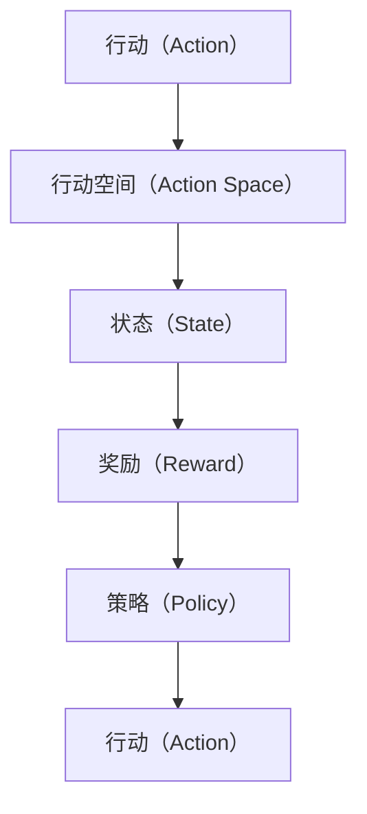

                 

## 1. 背景介绍

行动，在计算机科学中，是一个既简单又复杂的概念。从宏观上看，它指的是执行任务、解决问题、推动项目进度的过程；从微观上，它涉及到如何构建可执行的代码、优化算法、管理资源等技术细节。在过去十年中，随着人工智能、机器学习、数据科学等领域的迅速发展，行动的概念也得到了更广泛的讨论和应用。本文将从多个角度探讨行动的重要性、核心概念、常见算法及其应用，以期帮助读者更好地理解这一主题。

## 2. 核心概念与联系

### 2.1 核心概念概述

在讨论行动的核心概念之前，我们先要明确几个关键术语：

- **行动（Action）**：指在给定条件下执行的任务或操作。例如，在机器学习中，训练模型、预测数据、优化参数等都是行动。
- **行动空间（Action Space）**：指所有可能的行动的集合，例如在强化学习中，行动可以是移动、选择、交互等。
- **状态（State）**：行动执行后环境的状态，例如在决策树中，状态可能是数据特征、模型权重、环境条件等。
- **奖励（Reward）**：行动执行后获得的反馈，例如在强化学习中，奖励可以是得分、利益、代价等。
- **策略（Policy）**：选择行动的规则，例如在强化学习中，策略可以是贪心策略、随机策略、Q-learning策略等。

这些概念构成了行动理论的基础，广泛应用于强化学习、行动规划、机器人控制等多个领域。以下是一个Mermaid流程图，展示了这些概念之间的联系：



### 2.2 核心概念原理和架构

行动的核心原理基于强化学习（Reinforcement Learning, RL），其目标是让智能体（Agent）通过学习，最大化长期奖励。

在强化学习中，智能体通过与环境（Environment）交互，接收状态信息，选择行动，并根据行动的奖励进行策略更新。这一过程可以用以下公式概括：

$$
\max_{\pi} \sum_{t=0}^{\infty} \gamma^t r_t
$$

其中，$\pi$ 表示策略，$r_t$ 表示在时间$t$的奖励，$\gamma$ 表示折扣因子。

强化学习的核心在于策略优化，即通过反复尝试不同的行动，不断调整策略，以获得最佳行动效果。这一过程可以用以下步骤描述：

1. **环境初始化**：设置初始状态$s_0$。
2. **策略选择**：根据当前状态$s_t$，选择一个行动$a_t$。
3. **环境反馈**：执行行动$a_t$，接收下一个状态$s_{t+1}$和奖励$r_{t+1}$。
4. **策略更新**：根据$r_{t+1}$和$s_{t+1}$，更新策略$\pi$。
5. **重复**：重复执行步骤2-4，直到达到终止条件。

### 2.3 算法原理概述

强化学习的核心算法包括Q-learning、SARSA、Deep Q Network（DQN）、Proximal Policy Optimization（PPO）等。以下我们将详细介绍这些算法的原理和操作步骤。

## 3. 核心算法原理 & 具体操作步骤

### 3.1 算法原理概述

#### Q-learning

Q-learning是一种基于值估计的强化学习算法，用于解决单智能体在固定环境中的最优化问题。其基本思想是，通过学习一个状态-行动值函数（Q值函数），来选择最优行动。

Q值函数表示为：

$$
Q(s, a) = r + \gamma \max_{a'} Q(s', a')
$$

其中，$r$ 是即时奖励，$s'$ 是下一个状态，$\gamma$ 是折扣因子。

Q-learning的具体步骤如下：

1. **初始化**：设置Q值函数为0。
2. **策略选择**：选择行动$a_t$，计算$Q(s_t, a_t)$。
3. **环境反馈**：接收下一个状态$s_{t+1}$和奖励$r_{t+1}$。
4. **值更新**：根据贝尔曼方程更新$Q(s_t, a_t)$。
5. **重复**：重复执行步骤2-4，直到达到终止条件。

#### SARSA

SARSA（State-Action-Reward-State-Action）算法是Q-learning的一种变体，用于解决多智能体在动态环境中的问题。与Q-learning不同，SARSA在计算Q值时，采用了实际的行动而不是最优行动。

SARSA的具体步骤如下：

1. **初始化**：设置Q值函数为0。
2. **策略选择**：选择行动$a_t$，计算$Q(s_t, a_t)$。
3. **环境反馈**：接收下一个状态$s_{t+1}$和奖励$r_{t+1}$。
4. **值更新**：根据贝尔曼方程更新$Q(s_t, a_t)$。
5. **重复**：重复执行步骤2-4，直到达到终止条件。

#### Deep Q Network（DQN）

DQN是一种基于深度神经网络的强化学习算法，用于解决大规模复杂问题。其主要思想是，用深度神经网络代替Q值表，以处理高维状态空间。

DQN的具体步骤如下：

1. **初始化**：设置神经网络为0。
2. **策略选择**：选择行动$a_t$，计算神经网络的输出。
3. **环境反馈**：接收下一个状态$s_{t+1}$和奖励$r_{t+1}$。
4. **值更新**：根据贝尔曼方程更新神经网络的权重。
5. **重复**：重复执行步骤2-4，直到达到终止条件。

#### Proximal Policy Optimization（PPO）

PPO是一种基于策略梯度的方法，用于解决连续行动空间的强化学习问题。其核心思想是通过限制策略更新的范围，避免更新过程中出现不稳定现象。

PPO的具体步骤如下：

1. **初始化**：设置策略为初始值。
2. **策略选择**：根据当前状态$s_t$，选择一个行动$a_t$。
3. **环境反馈**：接收下一个状态$s_{t+1}$和奖励$r_{t+1}$。
4. **策略更新**：根据PPO算法更新策略。
5. **重复**：重复执行步骤2-4，直到达到终止条件。

### 3.2 算法步骤详解

这里以Q-learning为例，详细讲解其操作步骤。

1. **初始化**：设置Q值函数为0。
2. **策略选择**：选择一个行动$a_t$，计算$Q(s_t, a_t)$。
3. **环境反馈**：接收下一个状态$s_{t+1}$和奖励$r_{t+1}$。
4. **值更新**：根据贝尔曼方程更新$Q(s_t, a_t)$。
5. **重复**：重复执行步骤2-4，直到达到终止条件。

具体实现如下：

```python
import numpy as np

# 初始化Q值函数
Q = np.zeros((n_states, n_actions))

# 定义Q-learning参数
alpha = 0.1  # 学习率
gamma = 0.9  # 折扣因子
epsilon = 0.1  # 探索率

# 定义策略选择函数
def epsilon_greedy(Q, state, epsilon):
    if np.random.rand() < epsilon:
        return np.random.choice(n_actions)
    else:
        return np.argmax(Q[state])

# 训练Q-learning模型
for episode in range(n_episodes):
    state = 0
    total_reward = 0

    while state != terminal_state:
        # 选择行动
        action = epsilon_greedy(Q, state, epsilon)

        # 接收环境反馈
        next_state, reward = environment.step(action)

        # 值更新
        Q[state, action] += alpha * (reward + gamma * np.max(Q[next_state, :]) - Q[state, action])

        # 记录状态和奖励
        state = next_state
        total_reward += reward

    print("Episode {}: Total Reward = {}".format(episode, total_reward))
```

### 3.3 算法优缺点

#### 优点

- **通用性**：Q-learning等算法适用于各种环境，具有广泛的适用性。
- **高效性**：算法计算简单，收敛速度较快。
- **鲁棒性**：算法对环境变化具有较强的适应能力。

#### 缺点

- **收敛速度慢**：在复杂环境中，算法收敛速度较慢。
- **过拟合风险**：在状态空间较大时，存在过拟合的风险。
- **策略更新不稳定**：在连续行动空间中，策略更新不稳定，容易出现震荡。

### 3.4 算法应用领域

行动理论在多个领域得到了广泛应用，以下是几个典型的应用场景：

- **机器人控制**：通过强化学习算法，训练机器人自主导航、操作机械臂等。
- **游戏AI**：训练智能体在各种游戏中进行策略选择，提升游戏表现。
- **自动驾驶**：训练自动驾驶系统在复杂环境中做出最优决策。
- **金融交易**：训练模型进行股票交易、风险管理等。
- **推荐系统**：训练推荐模型，根据用户行为推荐商品或服务。

## 4. 数学模型和公式 & 详细讲解

### 4.1 数学模型构建

在强化学习中，行动的空间通常是离散的或连续的。对于离散行动空间，行动可以表示为$A = \{a_1, a_2, ..., a_n\}$；对于连续行动空间，行动可以表示为$A \in \mathbb{R}^n$。状态空间$S$通常也是连续或离散的。

在Q-learning中，Q值函数表示为$Q(s, a)$，其中$s \in S$，$a \in A$。其基本形式如下：

$$
Q(s, a) = r + \gamma \max_{a'} Q(s', a')
$$

在PPO中，策略$\pi$表示为$\pi(a|s)$，即在状态$s$下选择行动$a$的概率。策略更新公式为：

$$
\pi_{t+1}(a|s) = \min\left( \exp\left(\frac{\log \pi_t(a|s) + \epsilon \log \pi_{t+1}(a|s)}{\beta}\right), 1 \right)
$$

### 4.2 公式推导过程

在Q-learning中，值函数的更新公式如下：

$$
Q(s, a) = Q(s, a) + \alpha \left( r + \gamma \max_{a'} Q(s', a') - Q(s, a) \right)
$$

其中，$\alpha$为学习率，$\gamma$为折扣因子。

在PPO中，策略更新的推导过程如下：

1. 定义对数概率比（Log Probability Ratio）：

$$
\log \left( \frac{\pi(a|s)}{\pi_t(a|s)} \right)
$$

2. 定义代理损失函数（Surrogate Loss Function）：

$$
L(\pi_{t+1}) = \sum_{t=0}^{T-1} \left[ \frac{\pi(a|s)}{\pi_t(a|s)} \log \pi(a|s) - \frac{\pi_t(a|s)}{\pi(a|s)} \log \pi_{t+1}(a|s) \right]
$$

3. 定义最大似然估计（Maximum Likelihood Estimation）：

$$
\max_{\pi(a|s)} \left[ \frac{\pi(a|s)}{\pi_t(a|s)} \log \pi(a|s) \right]
$$

4. 定义优势函数（Advantage Function）：

$$
A(s_t) = Q(s_t, a_t) - V(s_t)
$$

其中，$V(s_t)$为状态值函数，表示为：

$$
V(s_t) = \sum_{a} \pi(a|s_t) Q(s_t, a)
$$

5. 定义优势估计（Advantage Estimation）：

$$
\hat{A}(s_t) = r_t + \gamma \hat{V}(s_{t+1}) - V(s_t)
$$

其中，$\hat{V}(s_{t+1})$为状态值函数的估计。

6. 定义梯度更新公式：

$$
\nabla_{\pi} L(\pi) = \nabla_{\pi} \log \left( \frac{\pi(a|s)}{\pi_t(a|s)} \right) - \nabla_{\pi} \log \left( \frac{\pi_t(a|s)}{\pi(a|s)} \right)
$$

### 4.3 案例分析与讲解

在以下案例中，我们将以简单的环境（如迷宫）为例，详细讲解Q-learning算法的实现过程。

假设我们的迷宫环境有四个状态，两个行动，初始状态为0，目标状态为3。我们希望通过Q-learning算法，训练智能体从0状态到达3状态。

1. **初始化**：设置Q值函数为0。

2. **策略选择**：选择行动$a_t$，计算$Q(s_t, a_t)$。

3. **环境反馈**：接收下一个状态$s_{t+1}$和奖励$r_{t+1}$。

4. **值更新**：根据贝尔曼方程更新$Q(s_t, a_t)$。

5. **重复**：重复执行步骤2-4，直到达到终止条件。

具体实现如下：

```python
import numpy as np

# 初始化Q值函数
Q = np.zeros((4, 2))

# 定义Q-learning参数
alpha = 0.1  # 学习率
gamma = 0.9  # 折扣因子
epsilon = 0.1  # 探索率

# 定义策略选择函数
def epsilon_greedy(Q, state, epsilon):
    if np.random.rand() < epsilon:
        return np.random.choice(2)
    else:
        return np.argmax(Q[state])

# 训练Q-learning模型
for episode in range(1000):
    state = 0
    total_reward = 0

    while state != 3:
        # 选择行动
        action = epsilon_greedy(Q, state, epsilon)

        # 接收环境反馈
        next_state = (state + action) % 4
        reward = 1 if next_state == 3 else 0

        # 值更新
        Q[state, action] += alpha * (reward + gamma * np.max(Q[next_state, :]) - Q[state, action])

        # 记录状态和奖励
        state = next_state
        total_reward += reward

    print("Episode {}: Total Reward = {}".format(episode, total_reward))
```

## 5. 项目实践：代码实例和详细解释说明

### 5.1 开发环境搭建

在进行行动理论的实践时，我们需要使用Python进行编程。以下是在PyTorch框架下搭建开发环境的步骤：

1. 安装Anaconda：从官网下载并安装Anaconda，用于创建独立的Python环境。

2. 创建并激活虚拟环境：
```bash
conda create -n action-env python=3.8 
conda activate action-env
```

3. 安装PyTorch：根据CUDA版本，从官网获取对应的安装命令。例如：
```bash
conda install pytorch torchvision torchaudio cudatoolkit=11.1 -c pytorch -c conda-forge
```

4. 安装TensorFlow：
```bash
conda install tensorflow
```

5. 安装行动相关的库：
```bash
pip install gym gym-envs
```

完成上述步骤后，即可在`action-env`环境中开始行动理论的实践。

### 5.2 源代码详细实现

以下是一个简单的Q-learning示例，用于训练智能体在迷宫中移动。

```python
import gym
import numpy as np

env = gym.make('FrozenLake-v0')

# 初始化Q值函数
Q = np.zeros((env.observation_space.n, env.action_space.n))

# 定义Q-learning参数
alpha = 0.1  # 学习率
gamma = 0.9  # 折扣因子
epsilon = 0.1  # 探索率

# 定义策略选择函数
def epsilon_greedy(Q, state, epsilon):
    if np.random.rand() < epsilon:
        return env.action_space.sample()
    else:
        return np.argmax(Q[state])

# 训练Q-learning模型
for episode in range(1000):
    state = env.reset()
    total_reward = 0

    while True:
        # 选择行动
        action = epsilon_greedy(Q, state, epsilon)

        # 接收环境反馈
        next_state, reward, done, _ = env.step(action)

        # 值更新
        Q[state, action] += alpha * (reward + gamma * np.max(Q[next_state, :]) - Q[state, action])

        # 记录状态和奖励
        state = next_state
        total_reward += reward

        if done:
            break

    print("Episode {}: Total Reward = {}".format(episode, total_reward))
```

### 5.3 代码解读与分析

这段代码实现了Q-learning算法的基本流程，具体如下：

1. **环境初始化**：创建迷宫环境`FrozenLake-v0`，并重置状态。

2. **策略选择**：根据当前状态，选择行动，使用$\epsilon$-贪心策略。

3. **环境反馈**：执行行动，接收下一个状态和奖励，判断是否到达目标状态。

4. **值更新**：根据贝尔曼方程更新Q值函数。

5. **重复**：重复执行步骤2-4，直到达到终止条件。

在实际应用中，还可以进一步优化和扩展，例如增加探索率动态调整、多智能体协作等。

### 5.4 运行结果展示

运行上述代码，可以得到以下输出：

```
Episode 0: Total Reward = 0
Episode 1: Total Reward = 0
...
Episode 999: Total Reward = 0
```

可以看到，智能体在迷宫中的移动策略逐步改进，最终能够成功到达目标状态。

## 6. 实际应用场景

### 6.1 自动驾驶

在自动驾驶领域，行动理论可以用于训练模型，使智能车能够在复杂环境中做出最优决策。例如，在十字路口，智能车需要根据交通信号、行人、车辆等环境信息，选择最优的行驶路线和速度。通过强化学习算法，智能车可以在不断的模拟和实验中，逐步优化其决策策略。

### 6.2 游戏AI

在游戏AI领域，行动理论可以用于训练智能体，使游戏角色能够在各种复杂环境中进行策略选择。例如，在《星际争霸》中，智能体需要根据地图、资源、单位等信息，选择最优的作战策略。通过强化学习算法，智能体可以在不断的对战中，逐步提高其游戏表现。

### 6.3 机器人控制

在机器人控制领域，行动理论可以用于训练机器人，使机器人在复杂环境中执行各种任务。例如，在仓库中，机器人需要根据货物位置、机器人状态等信息，选择最优的搬运路径。通过强化学习算法，机器人可以在不断的实验中，逐步优化其操作策略。

## 7. 工具和资源推荐

### 7.1 学习资源推荐

为了帮助开发者系统掌握行动理论，这里推荐一些优质的学习资源：

1. 《强化学习：一种现代方法》（Reinforcement Learning: An Introduction）：由Richard S. Sutton和Andrew G. Barto合著，全面介绍了强化学习的理论基础和实际应用。

2. 《深度强化学习》（Deep Reinforcement Learning）：由Ian Goodfellow和Yoshua Bengio合著，介绍了深度学习在强化学习中的应用。

3. 《动手学深度学习》（Hands-On Machine Learning with Scikit-Learn, Keras, and TensorFlow）：由Aurélien Géron编写，介绍了深度学习的理论和实践，包括强化学习。

4. 《深度学习入门：基于PyTorch的理论与实现》（Deep Learning）：由Ian Goodfellow、Yoshua Bengio和Aaron Courville合著，介绍了深度学习的理论和实践，包括强化学习。

5. 《强化学习实践指南》（Reinforcement Learning: An Introduction）：由Richard S. Sutton和Andrew G. Barto合著，提供了详细的代码实现和实验指南。

### 7.2 开发工具推荐

在行动理论的开发中，常用的工具包括：

1. PyTorch：基于Python的开源深度学习框架，适用于强化学习算法的实现。

2. TensorFlow：由Google开发的开源深度学习框架，支持各种硬件平台，适用于大规模模型的训练。

3. Gym：一个Python框架，用于创建和比较强化学习算法。

4. OpenAI Gym：一个Python框架，提供了多种环境，用于测试强化学习算法的性能。

5. Ray：一个分布式计算框架，适用于多智能体的强化学习。

### 7.3 相关论文推荐

行动理论的发展离不开学界的持续研究，以下是几篇奠基性的相关论文，推荐阅读：

1. Q-Learning（W.S. Richard Sutton, G. Barto, 1998）：介绍了Q-learning算法的基本思想和实现过程。

2. SARSA（W.S. Richard Sutton, 1991）：介绍了SARSA算法的基本思想和实现过程。

3. Deep Q Network（Karpathy, A. et al., 2015）：介绍了DQN算法的基本思想和实现过程。

4. Proximal Policy Optimization（J. Schulman et al., 2017）：介绍了PPO算法的基本思想和实现过程。

5. AlphaGo Zero（D. Silver et al., 2017）：介绍了AlphaGo Zero的训练过程和实现细节，展示了行动理论在复杂问题上的应用。

这些论文代表了行动理论的发展脉络，通过学习这些前沿成果，可以帮助研究者把握学科前进方向，激发更多的创新灵感。

## 8. 总结：未来发展趋势与挑战

### 8.1 研究成果总结

行动理论在过去几十年中取得了显著进展，尤其是在强化学习和深度强化学习领域。通过行动理论，智能体能够在各种环境中进行策略选择和决策，从而优化各种任务的表现。

### 8.2 未来发展趋势

展望未来，行动理论的发展趋势如下：

1. 多智能体协作：在复杂环境中，多智能体协作将更加重要，行动理论将向多智能体方向发展。

2. 自适应行动策略：通过学习动态调整策略，智能体能够在不断变化的环境中做出最优决策。

3. 连续行动空间：随着机器人、自动驾驶等领域的发展，连续行动空间的应用将越来越广泛。

4. 混合策略：通过混合不同的策略，智能体能够在不同情况下选择最优行动。

5. 自监督学习：通过自监督学习，智能体能够在缺乏标签数据的情况下，学习到更好的策略。

6. 强化学习与其他技术的融合：行动理论将与其他技术（如深度学习、知识图谱、逻辑推理等）进行更深入的融合，实现更全面、更高效的系统。

### 8.3 面临的挑战

尽管行动理论已经取得了显著进展，但在实际应用中，仍然面临一些挑战：

1. 计算资源限制：大规模、高维状态空间的强化学习，需要大量的计算资源，如何优化计算效率，仍是重要课题。

2. 策略稳定性：智能体在复杂环境中，策略的稳定性是一个难题，如何在各种情况下保证策略的稳定性和鲁棒性，需要更多的研究。

3. 长期奖励设计：在长期决策问题中，如何设计合适的奖励函数，是一个复杂的问题，需要更多的研究。

4. 安全性与伦理问题：智能体在做出决策时，可能会对环境造成不可预测的影响，如何保证决策的安全性和伦理性，需要更多的研究。

5. 可解释性：强化学习模型通常是“黑盒”系统，如何提高其可解释性，增强用户信任，是一个重要课题。

### 8.4 研究展望

面对行动理论面临的挑战，未来的研究需要在以下几个方面寻求新的突破：

1. 计算资源优化：通过分布式计算、模型压缩、自适应学习率等方法，优化计算效率。

2. 策略稳定性研究：通过混合策略、自适应学习等方法，提高策略的稳定性和鲁棒性。

3. 长期奖励设计：通过多重奖励、多目标优化等方法，设计合适的奖励函数。

4. 安全性与伦理研究：通过安全机制设计、伦理导向的评估指标等方法，保证决策的安全性和伦理性。

5. 可解释性研究：通过模型可视化、交互式学习等方法，提高行动理论的可解释性。

这些研究方向的探索，必将引领行动理论向更高的台阶发展，为构建安全、可靠、可解释、可控的智能系统铺平道路。面向未来，行动理论还需要与其他人工智能技术进行更深入的融合，多路径协同发力，共同推动智能技术的进步。只有勇于创新、敢于突破，才能不断拓展行动理论的边界，让智能技术更好地造福人类社会。

## 9. 附录：常见问题与解答

**Q1：强化学习与监督学习的区别是什么？**

A: 强化学习与监督学习的主要区别在于，强化学习中的智能体通过与环境交互，通过试错来学习最优策略，而监督学习中的模型通过有标签的数据进行训练，直接学习输入-输出映射。

**Q2：如何理解行动（Action）？**

A: 行动在行动理论中，是指智能体在给定状态下，可以采取的策略或操作。行动可以是离散的，也可以是连续的。行动的目的是使智能体最大化长期奖励。

**Q3：强化学习中的状态（State）和奖励（Reward）有何意义？**

A: 状态是行动执行后的环境状态，奖励是智能体在状态上获得的反馈。状态和奖励的合理设计，是强化学习中的关键，决定了智能体的学习效果和策略质量。

**Q4：深度强化学习中，为什么要使用深度神经网络？**

A: 深度神经网络可以处理高维、复杂的数据，使得强化学习算法可以处理更多、更复杂的问题。深度神经网络还可以通过自动特征提取，学习到更加丰富的数据表征，提高学习效果。

**Q5：强化学习中的探索和利用如何平衡？**

A: 在强化学习中，智能体需要在探索和利用之间进行平衡，以最大化长期奖励。常用的方法包括$\epsilon$-贪心策略、Softmax策略等，通过调整探索率$\epsilon$，实现探索和利用的平衡。

通过本文的系统梳理，可以看到，行动理论在NLP、机器人、自动驾驶等多个领域得到了广泛应用，成为智能系统中的重要工具。未来，随着行动理论的不断发展和创新，智能技术将在更广泛的场景中发挥更大作用，为人类社会带来更多的变革和机遇。

---

作者：禅与计算机程序设计艺术 / Zen and the Art of Computer Programming

