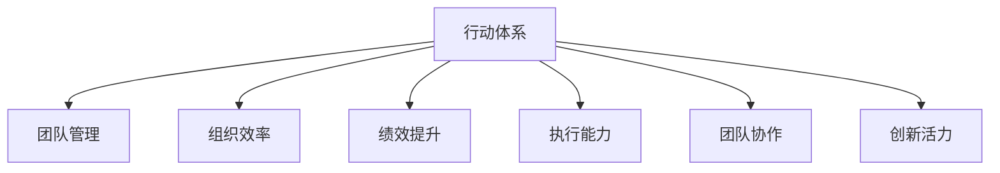

                 

# 行动体系对团队管理的重要性

> 关键词：行动体系,团队管理,组织效率,绩效提升,目标设定,执行能力,团队协作,创新活力

## 1. 背景介绍

### 1.1 问题由来
在当今高度竞争、快速变化的市场环境中，企业要想获得持续的竞争优势，必须依靠高效的团队运作。然而，许多企业在团队管理中面临种种挑战，包括目标不一致、执行不力、沟通不畅、协作困难等问题。这些问题不仅影响了团队的效率，还阻碍了企业的发展。

### 1.2 问题核心关键点
团队管理的关键在于构建一套有效的行动体系，以确保团队成员朝着共同目标协同工作，提高整体执行能力和创新活力。一个健全的行动体系不仅能提升团队效率，还能增强企业的市场竞争力。

### 1.3 问题研究意义
构建科学的行动体系对团队管理至关重要，可以帮助企业提升组织效率、增强员工执行力和创新能力，从而在激烈的市场竞争中占据优势。

## 2. 核心概念与联系

### 2.1 核心概念概述

为了更好地理解行动体系在团队管理中的作用，我们需要了解以下几个关键概念：

- **行动体系**：一套由目标、策略、执行路径、绩效评估和反馈机制构成的管理体系。
- **团队管理**：通过规划、组织、领导和控制，最大化团队成员的工作效率和创造力，实现组织目标。
- **组织效率**：指企业内部资源配置的有效性，包括人力、物力和财力的合理利用。
- **绩效提升**：通过优化管理流程和提升员工能力，提高企业业绩。
- **执行能力**：团队在计划、执行和调整过程中展现出的能力，包括响应速度、执行力和执行力。
- **团队协作**：团队成员间通过沟通、合作和协调，达成共同目标的过程。
- **创新活力**：团队在解决复杂问题和推动技术进步方面展现出的活力和创造性。

这些核心概念之间的逻辑关系可以通过以下Mermaid流程图来展示：



这个流程图展示了行动体系与团队管理的各个核心概念之间的联系。行动体系作为管理体系的骨架，贯穿团队管理的各个环节，从目标设定到绩效评估，每一步都依赖于科学的行动体系。

## 3. 核心算法原理 & 具体操作步骤
### 3.1 算法原理概述

构建行动体系的本质是将目标、策略和资源转化为具体的执行路径和绩效指标，确保团队成员明确任务和责任，高效协同工作。行动体系的核心在于目标一致性和过程标准化，通过科学的管理流程和有效的绩效评估，提升团队的整体执行力和创新能力。

### 3.2 算法步骤详解

一个高效的行动体系通常包括以下关键步骤：

**Step 1: 明确目标与战略**
- 与团队成员共同讨论并明确企业的战略目标，确保目标具有可衡量性、可达成性和相关性。
- 将总体目标分解为具体的里程碑和任务，便于跟踪和评估。

**Step 2: 设计执行路径**
- 基于目标和资源，设计详细的执行计划，包括任务分配、时间节点和资源配置。
- 使用甘特图、任务清单等工具进行可视化管理，确保执行过程透明和可控。

**Step 3: 制定绩效指标**
- 根据执行路径设定明确的绩效指标，如任务完成率、质量标准、时间节点等。
- 建立定期的绩效评估机制，如KPI（关键绩效指标）、OKR（目标与关键结果）等，确保目标的实现。

**Step 4: 实施执行与监控**
- 通过项目管理工具，如Trello、Asana、Jira等，实时监控执行进度和绩效表现。
- 使用敏捷方法，如Scrum、Kanban等，促进快速迭代和持续改进。

**Step 5: 反馈与优化**
- 定期收集团队反馈，评估执行效果，找出不足之处。
- 根据反馈信息进行调整和优化，确保行动体系的持续改进。

### 3.3 算法优缺点

行动体系具有以下优点：
1. 系统化管理：通过目标设定、策略规划和绩效评估，形成系统化管理流程，提高组织效率。
2. 透明协作：明确任务和责任，使团队成员了解各自角色，促进协作。
3. 绩效驱动：通过绩效指标和评估机制，激励团队成员努力提升业绩。
4. 持续改进：定期反馈和优化，保持行动体系的有效性和适应性。

但同时，行动体系也存在以下局限性：
1. 复杂度高：需要较高的管理和技术投入，设计复杂的管理流程。
2. 灵活性不足：固定的执行路径和绩效指标，难以应对突发情况和变化。
3. 文化冲突：不同文化背景的团队成员可能需要适应统一的行动体系。
4. 技术依赖：依赖项目管理工具和数据分析工具，需要一定的技术支持。

### 3.4 算法应用领域

行动体系的应用领域非常广泛，适用于各种类型的组织，包括企业、非营利组织、学术机构等。具体应用场景包括：

- 项目管理：通过行动体系设计项目执行路径，确保项目按时高质量完成。
- 产品开发：制定产品迭代计划和质量标准，提升产品竞争力。
- 组织变革：通过明确的变革目标和执行路径，推动组织转型和升级。
- 团队培训：设定明确的培训目标和评估标准，提升团队成员的能力和绩效。
- 客户服务：制定客户服务流程和绩效指标，提高客户满意度和忠诚度。

## 4. 数学模型和公式 & 详细讲解 & 举例说明

### 4.1 数学模型构建

假设一个企业的行动体系由 $A$ 个目标、$T$ 项任务和 $P$ 个绩效指标组成。构建行动体系的数学模型可以表示为：

$$
\text{Action System} = \{ \text{Goals}, \text{Tasks}, \text{Metrics} \}
$$

其中，目标集合 $\text{Goals} = \{G_1, G_2, ..., G_A\}$，任务集合 $\text{Tasks} = \{T_1, T_2, ..., T_T\}$，绩效指标集合 $\text{Metrics} = \{M_1, M_2, ..., M_P\}$。

### 4.2 公式推导过程

以一个典型的项目管理场景为例，可以构建以下数学模型：

$$
\text{Project Plan} = (G, T, P)
$$

其中，$G$ 表示项目目标，$T$ 表示项目任务，$P$ 表示项目绩效指标。

### 4.3 案例分析与讲解

假设一个软件开发团队的项目计划如下：

- 目标：在三个月内开发一个新功能，提升用户满意度。
- 任务：任务1：需求分析，任务2：设计方案，任务3：编码实现，任务4：测试验证，任务5：部署上线。
- 绩效指标：完成率（完成任务数量/总任务数量），质量标准（缺陷率），时间节点（每个任务完成时间）。

可以构建如下数学模型：

$$
\text{Project Plan} = \{ \text{提高用户满意度}, \{\text{需求分析}, \text{设计方案}, \text{编码实现}, \text{测试验证}, \text{部署上线}\}, \{\text{完成率}, \text{质量标准}, \text{时间节点}\}
$$

## 5. 项目实践：代码实例和详细解释说明
### 5.1 开发环境搭建

进行行动体系构建的实践前，需要准备好相应的开发环境：

1. 安装Jira或Trello等项目管理工具，创建项目计划。
2. 安装Python、R等数据分析工具，进行数据处理和分析。
3. 搭建Git版本控制系统，记录和追踪代码变更。
4. 配置Agile开发框架，如Scrum、Kanban等，支持敏捷开发。

### 5.2 源代码详细实现

以下是使用Jira工具构建项目管理行动体系的示例代码：

```python
from jira import JIRA
import requests

class JiraProject:
    def __init__(self, jira_url, jira_api_key):
        self.jira = JIRA(jira_url, auth=(jira_api_key, ''))
        
    def create_project(self, project_name):
        project = {
            'name': project_name,
            'self': 'https://your-jira.com/rest/api/3/project/' + project_name,
            'projectCategory': None,
            'key': project_name.upper(),
            'projectTypeKey': 'software'
        }
        response = self.jira.create_project(project)
        print('Project created successfully:', response)

    def create_task(self, project_key, task_title):
        task = {
            'self': 'https://your-jira.com/rest/api/3/issue/' + project_key + '/' + task_title,
            'key': project_key + '-' + task_title,
            'fields': {
                'project': {
                    'self': 'https://your-jira.com/rest/api/3/project/' + project_key
                },
                'summary': task_title,
                'labels': ['bug', 'task'],
                'issuetype': {
                    'self': 'https://your-jira.com/rest/api/3/issuetype/1'
                },
                'priority': {
                    'self': 'https://your-jira.com/rest/api/3/priority/2'
                },
                'status': {
                    'self': 'https://your-jira.com/rest/api/3/status/1'
                }
            }
        }
        response = self.jira.create_issue(project_key, task)
        print('Task created successfully:', response)

    def update_task(self, project_key, task_id, task_state):
        task = {
            'status': {
                'self': 'https://your-jira.com/rest/api/3/status/' + str(task_state)
            }
        }
        self.jira.update_issue(project_key, task_id, task)

# 实例化JiraProject类，构建项目和任务
jira = JiraProject('https://your-jira.com', 'your-jira-api-key')
jira.create_project('my-project')
jira.create_task('my-project', '需求分析')
jira.create_task('my-project', '设计方案')
jira.create_task('my-project', '编码实现')
jira.create_task('my-project', '测试验证')
jira.create_task('my-project', '部署上线')
```

### 5.3 代码解读与分析

在上述代码中，我们使用了Jira工具来创建和管理项目和任务。通过Jira，我们可以方便地跟踪项目进度，评估任务完成情况，并进行项目调整和优化。

**JiraProject类**：
- `__init__`方法：初始化Jira连接，准备使用Jira API。
- `create_project`方法：创建新的项目，并返回创建结果。
- `create_task`方法：创建新的任务，并返回创建结果。
- `update_task`方法：更新任务状态，将任务标记为完成或待处理。

**Jira连接配置**：
- 配置Jira URL和API Key，通过这些信息连接Jira服务器。

**项目和任务创建**：
- 通过Jira API创建项目和任务，指定项目名称、任务标题、任务类型、优先级和状态。

**任务更新**：
- 根据项目进度和任务状态，使用Jira API更新任务状态，确保任务按时完成。

### 5.4 运行结果展示

通过Jira项目管理工具，我们可以实时监控项目进展和任务状态。以下是使用Jira的仪表盘示例：


## 6. 实际应用场景

### 6.1 智能制造

在智能制造领域，行动体系可以用于生产线的优化和升级。通过设定具体的生产目标和执行路径，企业可以实时监控生产进度，及时发现和解决生产中的问题。

### 6.2 金融风控

在金融风控领域，行动体系可以用于风险评估和预警。通过设定风险指标和监控策略，企业可以及时识别和应对潜在的金融风险，保障资金安全。

### 6.3 智慧医疗

在智慧医疗领域，行动体系可以用于病患数据的分析和处理。通过设定数据分析目标和执行路径，医疗机构可以实时监测病患健康状态，及时调整治疗方案。

### 6.4 未来应用展望

未来，行动体系将在更多领域得到应用，为各类组织提供高效的管理工具：

- 政府管理：通过设定公共政策目标和执行路径，提高政府效率和公共服务水平。
- 教育培训：通过设定培训目标和评估标准，提升教育培训效果和教师能力。
- 环境保护：通过设定环保目标和执行路径，促进环境保护和可持续发展。

## 7. 工具和资源推荐
### 7.1 学习资源推荐

为了帮助开发者掌握行动体系构建的理论基础和实践技巧，这里推荐一些优质的学习资源：

1. 《敏捷项目管理：构建行动体系》系列博文：深入介绍敏捷管理方法，帮助理解行动体系的核心思想。
2. 《OKR管理》课程：讲解OKR（目标与关键结果）方法，提升目标设定和管理能力。
3. 《Scrum敏捷开发》书籍：介绍Scrum敏捷开发流程，提升项目执行和团队协作能力。
4. 《项目管理》在线课程：提供全面的项目管理知识，包括目标设定、执行路径和绩效评估。
5. 《行动体系构建》项目实践指南：详细说明行动体系构建的步骤和工具使用。

通过对这些资源的学习实践，相信你一定能够系统掌握行动体系的构建方法，并将其应用到实际工作中。

### 7.2 开发工具推荐

高效的开发离不开优秀的工具支持。以下是几款用于行动体系构建开发的常用工具：

1. Jira：项目管理工具，支持任务分配、进度跟踪和绩效评估。
2. Trello：团队协作工具，支持任务可视化管理。
3. Asana：任务管理和协作平台，支持多团队协作。
4. Agile冒号：敏捷开发框架，支持Scrum、Kanban等敏捷方法。
5. GitHub：版本控制系统，支持代码变更记录和团队协作。

合理利用这些工具，可以显著提升行动体系构建的开发效率，加快创新迭代的步伐。

### 7.3 相关论文推荐

行动体系构建的研究源于学界的持续探索。以下是几篇奠基性的相关论文，推荐阅读：

1. "A Framework for Action Systems in Project Management"：提出行动体系的概念和构建框架，系统化描述行动体系的设计和管理。
2. "OKR: The Ultimate Method for Turning Strategy into Results"：介绍OKR方法，帮助设定明确的目标和关键结果。
3. "Scrum: The Scaling Framework for Agile Development"：介绍Scrum敏捷开发框架，提升团队协作和项目执行能力。
4. "JIRA Implementation: A Comprehensive Guide"：提供Jira工具的详细使用指南，帮助构建高效的行动体系。
5. "Trello for Project Management: Tips and Tricks"：提供Trello工具的使用技巧，提升项目管理效率。

这些论文代表了几十年来行动体系构建技术的发展脉络。通过学习这些前沿成果，可以帮助研究者把握学科前进方向，激发更多的创新灵感。

## 8. 总结：未来发展趋势与挑战
### 8.1 总结

本文对行动体系在团队管理中的作用进行了全面系统的介绍。首先阐述了行动体系构建的背景和意义，明确了其在提升组织效率、增强执行力和创新能力方面的独特价值。其次，从原理到实践，详细讲解了行动体系的核心步骤和工具使用，给出了具体的代码实现和运行结果。最后，探讨了行动体系在多个行业领域的应用前景，并推荐了相关的学习资源和开发工具。

通过本文的系统梳理，可以看到，行动体系作为团队管理的重要工具，其设计和实施对企业的高效运营和创新能力的提升具有重要意义。未来，伴随行动体系构建技术的持续演进，相信其将在更多领域发挥重要作用，成为企业数字化转型的关键支撑。

### 8.2 未来发展趋势

展望未来，行动体系构建技术将呈现以下几个发展趋势：

1. 智能化管理：通过引入AI和数据分析技术，提升行动体系的智能决策能力，优化管理流程。
2. 个性化定制：根据不同组织的特点，定制化的构建行动体系，提升适应性和灵活性。
3. 集成化应用：将行动体系与其他管理工具和平台进行集成，实现一体化管理。
4. 实时监控：引入实时数据和AI算法，动态调整行动体系，增强灵活性和响应速度。
5. 多模态协同：将行动体系与其他信息管理系统进行整合，实现多模态数据的协同管理。

这些趋势凸显了行动体系构建技术的广阔前景。这些方向的探索发展，将进一步提升企业管理的智能化和协同化水平，为数字化转型提供有力支持。

### 8.3 面临的挑战

尽管行动体系构建技术已经取得了显著成就，但在迈向更加智能化、协同化应用的过程中，它仍面临诸多挑战：

1. 复杂度提升：随着组织规模和业务复杂度的增加，行动体系的设计和管理也变得更加复杂。
2. 数据安全：在引入AI和数据分析技术时，数据安全和隐私保护成为新的挑战。
3. 技术整合：将不同的管理工具和平台进行集成，需要克服技术兼容性和接口标准问题。
4. 文化差异：不同文化背景的组织成员需要适应统一的行动体系，可能面临文化冲突和沟通障碍。
5. 系统更新：行动体系需要不断更新和调整，以适应外部环境的变化和内部需求的升级。

### 8.4 研究展望

面对行动体系构建技术所面临的挑战，未来的研究需要在以下几个方面寻求新的突破：

1. 引入AI技术：通过机器学习和数据分析，优化行动体系的设计和管理，提升其智能化和自适应能力。
2. 解决数据安全问题：引入数据加密和隐私保护技术，确保行动体系在处理敏感数据时的安全性。
3. 优化技术整合：开发标准化的接口和协议，促进不同管理工具和平台的互操作性。
4. 促进文化融合：在行动体系设计和管理过程中，充分考虑不同文化背景的组织成员的需求和习惯，实现文化融合和协同工作。
5. 持续优化迭代：通过持续的反馈和评估，不断优化行动体系的设计和执行，提高其适应性和有效性。

这些研究方向的探索，将引领行动体系构建技术迈向更高的台阶，为构建高效、智能、协同的企业管理平台铺平道路。面向未来，行动体系构建技术还需要与其他管理技术和工具进行更深入的融合，共同推动企业管理的现代化和智能化。

## 9. 附录：常见问题与解答

**Q1：如何构建科学的行动体系？**

A: 构建科学的行动体系需要遵循以下步骤：
1. 明确目标：设定具体、可衡量、可达成、相关性强（SMART）的目标。
2. 设计执行路径：制定详细的执行计划，包括任务分配、时间节点和资源配置。
3. 设定绩效指标：根据执行路径设定明确的绩效指标，如任务完成率、质量标准、时间节点等。
4. 实时监控与反馈：通过项目管理工具，如Jira、Trello等，实时监控项目进展和任务状态，定期收集反馈进行优化。

**Q2：如何提升团队执行力和创新能力？**

A: 提升团队执行力和创新能力需要以下措施：
1. 设定明确的目标和任务，使团队成员了解各自角色和责任。
2. 使用敏捷方法，如Scrum、Kanban等，促进快速迭代和持续改进。
3. 提供培训和发展机会，提升团队成员的专业技能和创新能力。
4. 创建开放的沟通渠道，鼓励团队成员分享观点和建议。
5. 建立奖惩机制，激励团队成员努力提升业绩和创新成果。

**Q3：行动体系在多模态协同中如何发挥作用？**

A: 行动体系在多模态协同中发挥作用的方法如下：
1. 设定多模态协同目标：明确不同数据类型（文本、图像、语音等）的协同任务。
2. 设计多模态执行路径：制定详细的执行计划，包括数据采集、处理和融合步骤。
3. 设定多模态绩效指标：根据执行路径设定明确的绩效指标，如数据融合准确率、协同响应时间等。
4. 实时监控与反馈：通过多模态数据管理系统，实时监控协同过程和数据融合效果，定期收集反馈进行优化。

**Q4：行动体系构建过程中需要注意哪些问题？**

A: 行动体系构建过程中需要注意的问题包括：
1. 目标一致性：确保团队成员对目标的理解一致，避免目标冲突。
2. 执行路径合理：根据组织实际情况，制定合理的执行路径，避免执行障碍。
3. 绩效指标科学：设定科学合理的绩效指标，确保可衡量性和可达成性。
4. 实时监控有效：通过项目管理工具，实时监控执行进度和绩效表现，确保透明和可控。
5. 反馈与优化：定期收集团队反馈，评估执行效果，找出不足之处，并进行优化调整。

**Q5：行动体系构建技术的未来发展方向是什么？**

A: 行动体系构建技术的未来发展方向包括：
1. 智能化管理：引入AI和数据分析技术，提升行动体系的智能决策能力。
2. 个性化定制：根据不同组织的特点，定制化的构建行动体系。
3. 集成化应用：将行动体系与其他管理工具和平台进行集成，实现一体化管理。
4. 实时监控：引入实时数据和AI算法，动态调整行动体系。
5. 多模态协同：将行动体系与其他信息管理系统进行整合，实现多模态数据的协同管理。

这些方向将进一步提升行动体系构建技术的智能化、协同化和适应性，为企业的数字化转型提供更全面的支持。

---

作者：禅与计算机程序设计艺术 / Zen and the Art of Computer Programming

