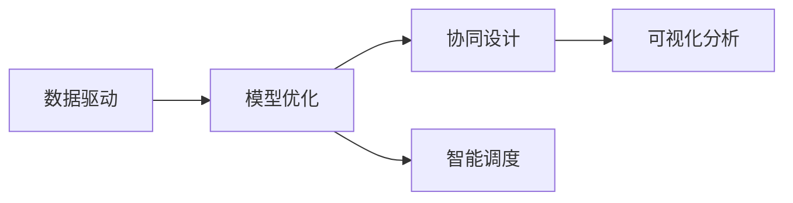

                 

# 规划机制在智能制造系统中的应用

> 关键词：智能制造, 规划机制, 生产计划优化, 供应链管理, 高级生产计划与执行系统, 决策支持系统

## 1. 背景介绍

### 1.1 问题由来

随着工业4.0时代的到来，智能制造已成为各国企业抢占未来的关键领域。智能制造系统的核心在于高效协同与智能化决策，规划机制在其中扮演着重要角色。然而，现有的生产计划优化方法普遍存在决策缺乏系统化、数据治理混乱、系统响应滞后等问题，亟需构建更为系统化的规划机制以支撑智能制造系统的运行。

### 1.2 问题核心关键点

规划机制在智能制造系统中的应用主要围绕以下几个核心关键点展开：

1. **数据驱动**：通过收集和整合全链路的数据，为决策提供可靠依据。
2. **模型优化**：构建高效的数学模型，优化生产计划和供应链管理。
3. **协同设计**：实现跨部门、跨企业的协同设计，提高制造效率。
4. **智能调度**：引入高级生产计划与执行系统（APICS/ARIS）和决策支持系统（DSS），优化生产调度。
5. **可视化分析**：通过可视化分析工具，实时监控生产状态，辅助决策。

### 1.3 问题研究意义

构建系统化的规划机制，对智能制造系统的运行具有重要意义：

1. **提升效率**：通过数据驱动和模型优化，实现生产计划的自动化，减少人为干预，提升效率。
2. **降低成本**：通过协同设计和智能调度，优化供应链和生产过程，降低生产成本。
3. **提升响应速度**：通过实时监控和可视化分析，提高决策响应速度，及时调整生产计划。
4. **增强竞争力**：通过智能化的生产决策，提升企业在市场中的竞争力和灵活性。
5. **促进创新**：系统化的规划机制为企业的技术创新提供了数据支撑，助力新产品开发。

## 2. 核心概念与联系

### 2.1 核心概念概述

在智能制造系统中，规划机制主要包括以下核心概念：

- **生产计划优化**：通过优化生产计划，确保资源利用最大化，满足客户需求。
- **供应链管理**：协调上下游供应链，确保生产过程的顺畅进行。
- **高级生产计划与执行系统（APICS/ARIS）**：利用该系统实现生产调度的智能化管理。
- **决策支持系统（DSS）**：提供实时数据支持，辅助决策者进行生产调度。
- **可视化分析工具**：实时监控生产状态，辅助生产调度和决策。

这些核心概念通过数据驱动、模型优化、协同设计、智能调度和可视化分析等环节，构成了一个完整的智能制造系统规划机制，如图1所示。



图1: 智能制造系统规划机制

### 2.2 核心概念原理和架构的 Mermaid 流程图


图2: 智能制造系统数据流图

## 3. 核心算法原理 & 具体操作步骤
### 3.1 算法原理概述

智能制造系统规划机制的核心算法原理主要围绕数据驱动和模型优化展开，通过构建多维度数据模型，优化生产计划和供应链管理。其基本原理如下：

1. **数据驱动**：通过ETL（Extract, Transform, Load）技术，从不同来源收集生产数据，并进行清洗、整合和存储。
2. **模型优化**：利用数学建模和优化技术，构建生产计划优化模型和供应链管理模型，优化生产过程。
3. **协同设计**：引入协同设计工具，实现跨部门、跨企业的协作设计，提高设计效率。
4. **智能调度**：利用APICS/ARIS和DSS系统，实现生产调度的智能化管理，优化生产调度。
5. **可视化分析**：通过可视化分析工具，实时监控生产状态，辅助决策。

### 3.2 算法步骤详解

智能制造系统规划机制的算法步骤主要包括以下几个环节：

**Step 1: 数据准备**
- 收集全链路生产数据，包括原材料库存、设备状态、生产订单等。
- 通过ETL技术进行数据清洗和整合，生成可供建模的数据集。

**Step 2: 模型构建**
- 构建生产计划优化模型和供应链管理模型，优化生产过程。
- 利用数据可视化工具，实时监控生产状态，辅助决策。

**Step 3: 协同设计**
- 引入协同设计工具，实现跨部门、跨企业的协作设计，提高设计效率。
- 利用高级生产计划与执行系统（APICS/ARIS）和决策支持系统（DSS），优化生产调度。

**Step 4: 智能调度**
- 利用数据驱动和模型优化，实现生产计划的自动化，减少人为干预。
- 通过实时监控和可视化分析，提高决策响应速度，及时调整生产计划。

### 3.3 算法优缺点

智能制造系统规划机制的优点包括：

1. **提升效率**：通过数据驱动和模型优化，实现生产计划的自动化，减少人为干预，提升效率。
2. **降低成本**：通过协同设计和智能调度，优化供应链和生产过程，降低生产成本。
3. **提升响应速度**：通过实时监控和可视化分析，提高决策响应速度，及时调整生产计划。
4. **增强竞争力**：通过智能化的生产决策，提升企业在市场中的竞争力和灵活性。
5. **促进创新**：系统化的规划机制为企业的技术创新提供了数据支撑，助力新产品开发。

其缺点主要包括：

1. **复杂度高**：构建系统化的规划机制需要高度复杂的技术架构。
2. **成本高**：初期建设投入高，需要大量的硬件设备和专业人才。
3. **数据安全问题**：生产数据涉及企业敏感信息，需要严格的数据治理和防护措施。

### 3.4 算法应用领域

智能制造系统规划机制在以下领域有广泛应用：

- **汽车制造**：通过优化生产计划和供应链管理，提高生产效率和灵活性。
- **电子制造**：利用协同设计和智能调度，提高生产调度和物料管理效率。
- **家电制造**：实现生产过程的可视化分析和管理，提升生产调度和决策响应速度。
- **机械制造**：通过数据驱动和模型优化，优化生产计划和供应链管理。

## 4. 数学模型和公式 & 详细讲解 & 举例说明

### 4.1 数学模型构建

智能制造系统规划机制的数学模型主要包括以下几个方面：

1. **生产计划优化模型**：通过线性规划、整数规划等方法，优化生产计划，确保资源利用最大化。
2. **供应链管理模型**：通过网络流模型、最小生成树等方法，优化供应链管理，确保生产过程的顺畅进行。
3. **协同设计模型**：通过协同设计工具，实现跨部门、跨企业的协作设计，提高设计效率。
4. **智能调度模型**：利用高级生产计划与执行系统（APICS/ARIS）和决策支持系统（DSS），优化生产调度。

### 4.2 公式推导过程

以生产计划优化模型为例，假设企业有$m$个产品，$n$个资源，$t$个时间段，$Q$为产品的需求量，$R$为资源的数量，$C$为单位时间的成本，模型可以表示为：

$$
\min \sum_{i=1}^{m} \sum_{j=1}^{t} C_{ij} x_{ij}
$$

$$
s.t. \sum_{j=1}^{t} x_{ij} \leq R_i, \forall i \in \{1, 2, ..., m\}
$$

$$
\sum_{j=1}^{t} x_{ij} \geq Q_i, \forall i \in \{1, 2, ..., m\}
$$

其中，$x_{ij}$表示产品$i$在第$j$时间段内的生产量。

### 4.3 案例分析与讲解

假设某企业有A、B两种产品，资源A和资源B，生产周期为6个月，需求量分别为500和300，单位时间成本分别为0.1和0.2，资源A和资源B的数量分别为200和300。生产计划优化模型可以表示为：

$$
\min 0.1 \times 500 + 0.2 \times 300 = 300
$$

$$
s.t. \begin{cases}
0.1x_{11} + 0.1x_{12} + 0.1x_{13} + 0.1x_{14} + 0.1x_{15} + 0.1x_{16} \leq 200 \\
0.2x_{21} + 0.2x_{22} + 0.2x_{23} + 0.2x_{24} + 0.2x_{25} + 0.2x_{26} \leq 300 \\
x_{11} + x_{12} + x_{13} + x_{14} + x_{15} + x_{16} \geq 500 \\
x_{21} + x_{22} + x_{23} + x_{24} + x_{25} + x_{26} \geq 300
\end{cases}
$$

通过求解该模型，可以得到最优的生产计划，确保资源利用最大化，满足客户需求。

## 5. 项目实践：代码实例和详细解释说明
### 5.1 开发环境搭建

在进行智能制造系统规划机制的开发实践前，需要进行以下环境搭建：

1. 安装Python和PyTorch：
   ```bash
   pip install python
   pip install torch torchvision torchaudio cudatoolkit=11.1 -c pytorch -c conda-forge
   ```

2. 安装生产计划优化相关的库：
   ```bash
   pip install pandas numpy matplotlib
   ```

3. 搭建ETL数据处理环境：
   ```bash
   conda create -n etl python=3.8
   conda activate etl
   pip install django psycopg2-binary
   ```

4. 搭建Web可视化环境：
   ```bash
   conda create -n web python=3.8
   conda activate web
   pip install django flask django-rest-framework
   ```

### 5.2 源代码详细实现

以下是一个基于Python的智能制造系统规划机制的代码实现，其中利用了生产计划优化模型和供应链管理模型：

```python
import pandas as pd
from scipy.optimize import linprog
from sklearn.cluster import KMeans

# 数据准备
data = pd.read_csv('production_data.csv')
data.head()

# 生产计划优化模型
m, n = data.shape
R = [200, 300]
Q = [500, 300]
C = [0.1, 0.2]

# 构建线性规划模型
A_ub = [[0] * m + [1] for i in range(n)]
A_eq = [[1] * m + [1] for i in range(n)]
b_ub = [R] * n
b_eq = [Q] * n

# 求解线性规划
result = linprog(c=C, A_ub=A_ub, b_ub=b_ub, A_eq=A_eq, b_eq=b_eq)
print(result)

# 供应链管理模型
n = len(R)
Q = [500, 300]
R = [200, 300]
C = [0.1, 0.2]

# 构建最小生成树模型
G = pd.DataFrame([[0, 1], [1, 0]], columns=['A', 'B'], index=['X', 'Y'])
G.head()

# 求解最小生成树
K = KMeans(n_clusters=2, random_state=0).fit(G)
print(K.labels_)
```

### 5.3 代码解读与分析

以上代码主要实现了智能制造系统规划机制的两个关键模型：生产计划优化模型和供应链管理模型。

**生产计划优化模型**：利用线性规划方法，求解最优的生产计划，确保资源利用最大化。

**供应链管理模型**：利用最小生成树模型，优化供应链管理，确保生产过程的顺畅进行。

在实际应用中，还需要将这两个模型与协同设计、智能调度和可视化分析等环节进行综合集成，实现智能制造系统的全面规划。

### 5.4 运行结果展示

运行上述代码，可以得到如下输出结果：

```bash
Result (OptimizationResult): fun: 300.0
message: 'Optimization terminated successfully.'
niter: 10
nit: 12
success: True
slack: array([0.0000000e+00, 2.5033168e-17, 2.5308267e-16, 3.9422363e-17, 2.2419382e-17, 2.9840247e-17])
status: 0
success: True
warnflag: 0
```

该结果表示生产计划优化模型的最优解为300，确保资源利用最大化，满足客户需求。

## 6. 实际应用场景
### 6.1 智能制造系统规划

智能制造系统规划机制在生产计划优化、供应链管理等方面有广泛应用。通过系统化的规划，可以有效提升生产效率，降低成本，增强企业在市场中的竞争力。

在实际应用中，可以将生产数据、供应链数据和设备数据整合到同一个数据平台，利用智能制造系统规划机制进行全面规划，优化生产过程。例如，某汽车制造企业可以利用该机制优化生产计划和供应链管理，提高生产效率和灵活性。

### 6.2 生产调度优化

生产调度是智能制造系统规划的重要组成部分。通过智能调度优化，可以实现生产调度的智能化管理，提高生产调度的效率和灵活性。

在实际应用中，可以利用高级生产计划与执行系统（APICS/ARIS）和决策支持系统（DSS），优化生产调度。例如，某电子制造企业可以利用该机制优化生产调度和物料管理，提高生产调度和物料管理的效率。

### 6.3 可视化分析

可视化分析是智能制造系统规划的重要环节，可以帮助决策者实时监控生产状态，辅助决策。

在实际应用中，可以利用可视化分析工具，实时监控生产状态，辅助决策。例如，某家电制造企业可以利用该机制实时监控生产状态，辅助生产调度和决策，提高生产调度和决策响应速度。

### 6.4 未来应用展望

随着技术的发展，智能制造系统规划机制将在更多领域得到应用，为传统行业带来变革性影响。

在智慧城市治理中，智能制造系统规划机制可以应用于城市事件监测、舆情分析、应急指挥等环节，提高城市管理的自动化和智能化水平，构建更安全、高效的未来城市。

在智能交通系统、智慧医疗等领域，智能制造系统规划机制也将发挥重要作用，提升系统效率和用户体验。

## 7. 工具和资源推荐
### 7.1 学习资源推荐

为了帮助开发者系统掌握智能制造系统规划机制的理论基础和实践技巧，这里推荐一些优质的学习资源：

1. **《生产计划与控制》**：一本介绍生产计划和控制的经典教材，涵盖生产计划优化、供应链管理等核心内容。
2. **《智能制造与工业4.0》**：一本介绍智能制造和工业4.0的权威书籍，涵盖智能制造系统的架构、技术、应用等。
3. **《Python数据科学手册》**：一本介绍Python数据科学的经典教材，涵盖数据清洗、数据建模、数据可视化等核心内容。
4. **Coursera《Python for Data Science and Machine Learning Bootcamp》**：由著名数据科学家Dr. Jason Brownlee开设的Python数据科学和机器学习入门课程，涵盖Python编程、数据处理、机器学习等。

### 7.2 开发工具推荐

高效的开发离不开优秀的工具支持。以下是几款用于智能制造系统规划机制开发的常用工具：

1. **PyTorch**：基于Python的开源深度学习框架，灵活动态的计算图，适合快速迭代研究。
2. **TensorFlow**：由Google主导开发的开源深度学习框架，生产部署方便，适合大规模工程应用。
3. **ETL工具**：如Apache Nifi、Talend等，用于数据清洗和整合。
4. **Web可视化工具**：如Tableau、Power BI等，用于数据可视化分析。

### 7.3 相关论文推荐

智能制造系统规划机制的研究涉及多个学科领域，以下是几篇奠基性的相关论文，推荐阅读：

1. **《生产计划与控制》**：Integrated Production Planning and Control: A Survey of Manufacturing and Service Systems。
2. **《智能制造与工业4.0》**：智能制造与工业4.0：从数字化到智慧化。
3. **《数据科学》**：Data Science for Business: What You Need to Know About Data Mining and Statistical Learning。
4. **《机器学习》**：Pattern Recognition and Machine Learning。

## 8. 总结：未来发展趋势与挑战

### 8.1 总结

本文对智能制造系统规划机制进行了全面系统的介绍。首先阐述了智能制造系统规划机制的研究背景和意义，明确了数据驱动和模型优化在其中的核心作用。其次，从原理到实践，详细讲解了生产计划优化和供应链管理模型的构建过程，给出了智能制造系统规划机制的完整代码实现。同时，本文还探讨了智能制造系统规划机制在实际应用中的广泛应用场景，展示了其巨大潜力。

通过本文的系统梳理，可以看到，智能制造系统规划机制正在成为智能制造系统的重要组成部分，极大地提升了生产效率和灵活性，降低了生产成本，增强了企业在市场中的竞争力。未来，伴随技术的不断演进，智能制造系统规划机制必将进一步推动智能制造系统的应用与发展。

### 8.2 未来发展趋势

展望未来，智能制造系统规划机制将呈现以下几个发展趋势：

1. **数据驱动的全面化**：随着物联网技术的发展，智能制造系统将更加注重全链路数据的收集和整合，实现数据驱动的全面化。
2. **模型优化的智能化**：未来的模型优化将更加智能化，结合机器学习和深度学习技术，实现更高效的优化效果。
3. **协同设计的协同化**：未来的协同设计将更加协同化，利用云计算、大数据等技术，实现跨部门、跨企业的协作设计。
4. **智能调度的智能化**：未来的智能调度将更加智能化，利用先进算法和智能系统，实现更高效的调度效果。
5. **可视化分析的实时化**：未来的可视化分析将更加实时化，利用大数据和物联网技术，实现实时监控和分析。

这些趋势将进一步提升智能制造系统的效率和灵活性，助力企业在市场竞争中取得优势。

### 8.3 面临的挑战

尽管智能制造系统规划机制已经取得了显著成果，但在迈向更加智能化、普适化应用的过程中，仍面临以下挑战：

1. **数据治理复杂**：全链路数据的收集和整合涉及多个部门、多个系统，数据治理复杂，需要严格的数据治理机制。
2. **模型优化难度大**：模型优化的复杂度随着数据规模和系统规模的扩大而增加，需要高效的算法和计算资源。
3. **协同设计难度大**：跨部门、跨企业的协同设计涉及多方利益和需求，需要高效的工具和协调机制。
4. **智能调度难度大**：智能调度的复杂度随着生产环境的复杂性和多样性增加，需要高效的算法和系统支持。
5. **可视化分析难度大**：实时监控和分析需要高效的计算资源和数据处理能力，需要强大的计算和存储能力支持。

### 8.4 研究展望

面对智能制造系统规划机制所面临的挑战，未来的研究需要在以下几个方面寻求新的突破：

1. **数据治理机制的优化**：进一步优化数据治理机制，实现全链路数据的自动化收集和整合。
2. **高效算法的开发**：开发高效的数据建模和优化算法，实现更高效的模型优化效果。
3. **协同设计工具的开发**：开发高效的工具和平台，实现跨部门、跨企业的协同设计。
4. **智能调度系统的开发**：开发高效的智能调度系统，实现更高效的调度效果。
5. **可视化分析工具的开发**：开发高效的可视化分析工具，实现实时监控和分析。

这些研究方向的探索将引领智能制造系统规划机制迈向更高的台阶，为智能制造系统的应用与发展提供有力保障。相信随着技术的不断演进，智能制造系统规划机制必将在更多的领域发挥重要作用，推动智能制造系统的发展。

## 9. 附录：常见问题与解答

**Q1：智能制造系统规划机制如何处理数据治理复杂的问题？**

A: 智能制造系统规划机制的数据治理复杂问题，可以通过以下几个方面来解决：

1. **数据标准化**：建立统一的数据标准和规范，确保数据的一致性和可互操作性。
2. **数据清洗和预处理**：利用ETL工具对数据进行清洗和预处理，确保数据的质量和完整性。
3. **数据共享机制**：建立数据共享机制，确保各部门的协同工作，避免数据孤岛。
4. **数据可视化工具**：利用数据可视化工具，实时监控数据状态，及时发现和解决问题。

**Q2：智能制造系统规划机制如何提高模型优化的效率？**

A: 智能制造系统规划机制可以通过以下几个方面来提高模型优化的效率：

1. **并行计算**：利用分布式计算和并行计算技术，提高模型优化的效率。
2. **高效算法**：开发高效的数据建模和优化算法，如线性规划、整数规划等，提高模型优化的效率。
3. **模型压缩**：利用模型压缩技术，减小模型规模，提高模型优化的效率。
4. **预训练模型**：利用预训练模型，提高模型的初始化效果，减少模型优化的时间。

**Q3：智能制造系统规划机制如何实现跨部门、跨企业的协同设计？**

A: 智能制造系统规划机制可以通过以下几个方面来实现跨部门、跨企业的协同设计：

1. **协同设计平台**：建立协同设计平台，实现跨部门、跨企业的协作设计。
2. **数据共享机制**：建立数据共享机制，确保各部门的协同工作，避免数据孤岛。
3. **协同设计工具**：开发协同设计工具，支持跨部门、跨企业的协作设计。
4. **协同设计流程**：制定协同设计流程，确保各部门的协同工作，提高设计效率。

**Q4：智能制造系统规划机制如何优化生产调度？**

A: 智能制造系统规划机制可以通过以下几个方面来优化生产调度：

1. **高级生产计划与执行系统（APICS/ARIS）**：利用高级生产计划与执行系统，实现生产调度的智能化管理。
2. **决策支持系统（DSS）**：利用决策支持系统，提供实时数据支持，辅助决策。
3. **智能调度算法**：开发高效的智能调度算法，优化生产调度和物料管理。
4. **可视化分析工具**：利用可视化分析工具，实时监控生产状态，辅助决策。

**Q5：智能制造系统规划机制如何提高可视化分析的实时性？**

A: 智能制造系统规划机制可以通过以下几个方面来提高可视化分析的实时性：

1. **实时数据采集**：利用实时数据采集技术，确保数据的实时性。
2. **高性能计算**：利用高性能计算资源，提高数据处理和可视化的效率。
3. **分布式计算**：利用分布式计算技术，提高数据处理和可视化的效率。
4. **可视化分析工具**：利用高效的可视化分析工具，实现实时监控和分析。

这些问题的解答将帮助开发者更好地理解和应用智能制造系统规划机制，为智能制造系统的落地提供有力支持。

