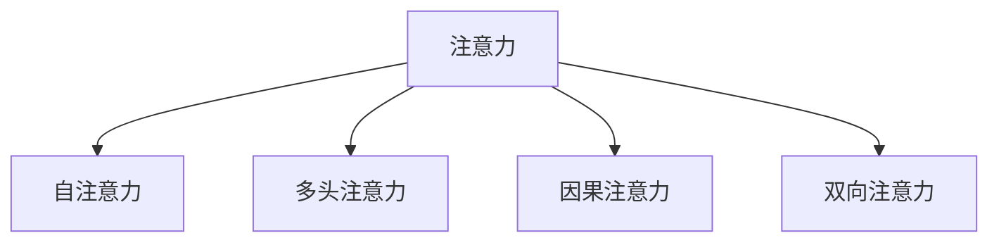
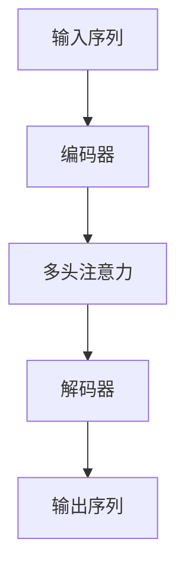

                 

# 解码注意力机制（Attention）

## 1. 背景介绍

### 1.1 问题由来

在人工智能的发展历程中，注意力机制（Attention）是一种极其关键且强大的技术。最初，注意力机制起源于人工神经网络领域，被应用于图像识别、自然语言处理等任务中，通过引入一种类似于人类注意力的机制，模型可以更高效地处理和利用数据，提升预测准确性。随着深度学习的发展，注意力机制在各类深度学习模型中得以广泛应用，并不断演变出更高级、更复杂的变体。

近年来，注意力机制的应用范围已扩展到几乎所有深度学习框架和模型中，成为构建高性能AI系统的重要工具。例如，在自然语言处理（NLP）领域，注意力机制被用于文本编码、机器翻译、问答系统、文本摘要等多种任务中，显著提升了模型的表现。在计算机视觉领域，注意力机制被应用于图像分类、物体检测、语义分割等任务中，进一步推动了视觉识别的发展。

### 1.2 问题核心关键点

为了更好地理解注意力机制的原理和应用，本节将介绍几个核心概念：

- 注意力（Attention）：指模型在处理输入时，关注输入的哪些部分，以提取最有用的信息。注意力机制通常用于提取和融合输入序列中的关键信息，从而提升模型的预测能力。
- 自注意力（Self-Attention）：一种特殊的注意力机制，用于处理序列输入，如文本、图像等，通过计算输入序列中不同位置之间的相似度，以决定哪些部分应被更多地关注。
- 多头注意力（Multi-Head Attention）：将自注意力机制进行并行处理，通过多个不同的注意力头（Head）同时对输入进行关注，以捕捉输入序列中的多层次信息。
- 因果注意力（Causal Attention）：一种特殊形式的自注意力，用于处理具有时间顺序的结构数据，如自然语言文本，确保模型在预测时，不会依赖于未来信息。
- 双向注意力（Bi-directional Attention）：结合前向和后向注意力的机制，同时关注输入序列的前后文信息，以提升模型的理解能力。

这些概念之间的逻辑关系可以通过以下Mermaid流程图来展示：



这个流程图展示了注意力机制及其核心变体的关系：

1. 注意力机制是所有变体的基础，通过计算输入序列中不同位置之间的相似度，来决定哪些部分应被更多地关注。
2. 自注意力机制是注意力机制的一种特殊形式，用于处理序列输入，如文本、图像等。
3. 多头注意力机制将自注意力进行并行处理，通过多个不同的注意力头同时对输入进行关注，以捕捉输入序列中的多层次信息。
4. 因果注意力机制用于处理具有时间顺序的结构数据，确保模型在预测时，不会依赖于未来信息。
5. 双向注意力机制结合前向和后向注意力的机制，同时关注输入序列的前后文信息，以提升模型的理解能力。

通过理解这些核心概念，我们可以更好地把握注意力机制的工作原理和优化方向。

## 2. 核心概念与联系

### 2.1 核心概念概述

在深入介绍注意力机制的原理和应用之前，我们需要先了解几个相关的基础概念：

- 神经网络：一种计算模型，通过多层非线性变换，将输入映射到输出。深度神经网络（DNN）是一类特殊的神经网络，其包含多于一层的隐藏层。
- 卷积神经网络（CNN）：一种常见的神经网络架构，广泛应用于图像和视频处理。CNN通过卷积层、池化层等操作，提取输入数据的局部特征。
- 循环神经网络（RNN）：一种具有时间序列处理能力的神经网络架构，适用于处理序列数据，如文本、时间序列等。
- 长短期记忆网络（LSTM）：一种特殊的RNN架构，通过门控机制，解决了传统RNN在处理长序列时存在的梯度消失和梯度爆炸问题。

这些基础概念构成了深度学习模型的基本框架，而注意力机制则是深度学习模型中的一种高级技术，用于提升模型在处理序列数据时的表现。

### 2.2 核心概念原理和架构的 Mermaid 流程图



这个流程图展示了注意力机制的基本架构：

1. 输入序列被输入到编码器中，通过一系列层（如卷积层、LSTM层等）处理，得到一系列的中间表示。
2. 多头注意力机制被应用于中间表示，计算输入序列中不同位置之间的相似度，从而决定哪些部分应被更多地关注。
3. 解码器使用多头注意力机制输出的中间表示，通过一系列层处理，得到输出序列。

这个架构展示了注意力机制的核心功能：通过计算输入序列中不同位置之间的相似度，以决定哪些部分应被更多地关注。

## 3. 核心算法原理 & 具体操作步骤

### 3.1 算法原理概述

注意力机制的核心原理是通过计算输入序列中不同位置之间的相似度，以决定哪些部分应被更多地关注。这种机制通常用于提取和融合输入序列中的关键信息，从而提升模型的预测能力。在深度学习模型中，注意力机制可以通过多种方式实现，包括自注意力、多头注意力、因果注意力、双向注意力等。

具体而言，注意力机制的核心步骤如下：

1. 计算输入序列中不同位置之间的相似度，通常使用余弦相似度或点积相似度。
2. 通过softmax函数将相似度归一化，得到注意力权重。
3. 根据注意力权重，加权求和得到输出。

### 3.2 算法步骤详解

以下是注意力机制的具体实现步骤：

1. **计算相似度**：对于序列输入 $X$，计算每个位置 $i$ 与其他位置 $j$ 的相似度 $s_{ij}$。常用的相似度计算方法包括余弦相似度和点积相似度。余弦相似度计算公式为：

   $$
   s_{ij} = \frac{X_i \cdot X_j}{\|X_i\|\|X_j\|}
   $$

   点积相似度计算公式为：

   $$
   s_{ij} = X_i \cdot X_j
   $$

2. **计算注意力权重**：通过softmax函数将相似度归一化，得到注意力权重 $a_{ij}$。softmax函数计算公式为：

   $$
   a_{ij} = \frac{\exp(s_{ij})}{\sum_{k=1}^{T} \exp(s_{ik})}
   $$

   其中 $T$ 为序列长度。

3. **计算输出**：根据注意力权重，加权求和得到输出 $Y$。计算公式为：

   $$
   Y = \sum_{i=1}^{T} a_{ij}X_i
   $$

   通过以上步骤，模型可以有效地关注输入序列中的关键部分，提取最有用的信息，从而提升模型的预测能力。

### 3.3 算法优缺点

注意力机制具有以下优点：

1. 提升了模型的表现：通过关注输入序列中的关键部分，注意力机制能够更好地提取和融合输入序列中的关键信息，从而提升模型的预测能力。
2. 适用于序列数据：注意力机制特别适用于序列数据，如文本、语音、图像等，能够处理具有时间顺序的结构数据。
3. 增加了模型的灵活性：多头注意力机制、因果注意力机制、双向注意力机制等变体，增加了模型的灵活性，可以处理更加复杂的任务。

同时，注意力机制也存在以下缺点：

1. 计算复杂度高：注意力机制的计算复杂度较高，尤其是在处理长序列时，计算量显著增加。
2. 需要较多参数：注意力机制需要较多的参数，尤其是在多头注意力机制中，每个头都需要独立的参数，增加了模型的复杂度。
3. 容易过拟合：注意力机制容易受到噪声数据的影响，导致过拟合问题。

### 3.4 算法应用领域

注意力机制在深度学习中得到广泛应用，涵盖了几乎所有深度学习模型和框架。以下是几个典型的应用领域：

1. 自然语言处理（NLP）：注意力机制被用于文本编码、机器翻译、问答系统、文本摘要等多种任务中，显著提升了模型的表现。
2. 计算机视觉（CV）：注意力机制被应用于图像分类、物体检测、语义分割等任务中，进一步推动了视觉识别的发展。
3 语音识别：注意力机制被应用于语音识别任务中，帮助模型更好地捕捉语音信号中的关键信息，提升识别准确率。
4 推荐系统：注意力机制被应用于推荐系统中的用户行为分析，帮助模型更好地理解用户兴趣，提升推荐效果。

## 4. 数学模型和公式 & 详细讲解 & 举例说明

### 4.1 数学模型构建

注意力机制的数学模型通常包括以下几个部分：

1. 输入序列 $X$：一个长度为 $T$ 的向量序列，每个向量维度为 $d$。
2. 查询向量 $Q$：一个长度为 $d$ 的向量，用于计算相似度。
3. 键值对 $K$ 和 $V$：与查询向量 $Q$ 计算相似度的键和值，分别用于表示输入序列中不同位置的关键信息和值。

### 4.2 公式推导过程

以下是注意力机制的详细数学推导过程：

1. **计算相似度**：

   $$
   s_{ij} = Q_i \cdot K_j^T = \sum_{k=1}^{d} Q_{ik}K_{jk}
   $$

2. **计算注意力权重**：

   $$
   a_{ij} = \frac{\exp(s_{ij})}{\sum_{k=1}^{T} \exp(s_{ik})}
   $$

3. **计算输出**：

   $$
   Y = \sum_{i=1}^{T} a_{ij}V_i
   $$

   其中，$X_i$、$K_i$ 和 $V_i$ 分别表示输入序列、键和值。

### 4.3 案例分析与讲解

以文本编码任务为例，展示注意力机制的具体应用。文本编码任务的目标是将输入文本 $X$ 转换为一个固定长度的向量 $Y$，通常使用注意力机制来实现。

假设输入文本 $X$ 由多个单词组成，每个单词表示为一个长度为 $d$ 的向量。查询向量 $Q$ 与每个单词向量 $K_i$ 和 $V_i$ 计算相似度，得到注意力权重 $a_{ij}$，最后根据注意力权重加权求和得到输出向量 $Y$。

假设输入文本 $X = [w_1, w_2, w_3, \ldots, w_T]$，查询向量 $Q = [q_1, q_2, q_3, \ldots, q_d]$，键值对 $K = [k_1, k_2, k_3, \ldots, k_T]$，值向量 $V = [v_1, v_2, v_3, \ldots, v_T]$。

1. **计算相似度**：

   $$
   s_{ij} = Q_i \cdot K_j^T = \sum_{k=1}^{d} Q_{ik}K_{jk}
   $$

   得到相似度矩阵 $S = [s_{1j}, s_{2j}, s_{3j}, \ldots, s_{Tj}]$。

2. **计算注意力权重**：

   $$
   a_{ij} = \frac{\exp(s_{ij})}{\sum_{k=1}^{T} \exp(s_{ik})}
   $$

   得到注意力权重矩阵 $A = [a_{1j}, a_{2j}, a_{3j}, \ldots, a_{Tj}]$。

3. **计算输出**：

   $$
   Y = \sum_{i=1}^{T} a_{ij}V_i
   $$

   得到输出向量 $Y = [y_1, y_2, y_3, \ldots, y_T]$。

通过上述步骤，模型能够关注输入文本中的关键部分，提取最有用的信息，从而提升文本编码的效果。

## 5. 项目实践：代码实例和详细解释说明

### 5.1 开发环境搭建

在进行注意力机制的代码实现前，我们需要准备好开发环境。以下是使用Python进行PyTorch开发的环境配置流程：

1. 安装Anaconda：从官网下载并安装Anaconda，用于创建独立的Python环境。

2. 创建并激活虚拟环境：
```bash
conda create -n attention-env python=3.8 
conda activate attention-env
```

3. 安装PyTorch：根据CUDA版本，从官网获取对应的安装命令。例如：
```bash
conda install pytorch torchvision torchaudio cudatoolkit=11.1 -c pytorch -c conda-forge
```

4. 安装TensorBoard：用于可视化注意力机制的训练过程和结果。
```bash
pip install tensorboard
```

5. 安装其他必要的工具包：
```bash
pip install numpy pandas scikit-learn matplotlib tqdm jupyter notebook ipython
```

完成上述步骤后，即可在`attention-env`环境中开始注意力机制的代码实现。

### 5.2 源代码详细实现

以下是一个简单的注意力机制代码实现，用于文本编码任务：

```python
import torch
import torch.nn as nn

class Attention(nn.Module):
    def __init__(self, d_model, n_heads):
        super(Attention, self).__init__()
        self.d_model = d_model
        self.n_heads = n_heads
        self.head_dim = d_model // n_heads
        self.query = nn.Linear(d_model, d_model)
        self.key = nn.Linear(d_model, d_model)
        self.value = nn.Linear(d_model, d_model)
        self.out = nn.Linear(d_model, d_model)
    
    def forward(self, X, Q):
        batch_size = X.size(0)
        T = X.size(1)
        d_model = X.size(2)
        
        query = self.query(X).view(batch_size, T, self.n_heads, self.head_dim)
        key = self.key(X).view(batch_size, T, self.n_heads, self.head_dim)
        value = self.value(X).view(batch_size, T, self.n_heads, self.head_dim)
        
        s = query @ key.transpose(2, 3)
        a = torch.softmax(s, dim=-1)
        Y = torch.matmul(a, value)
        Y = Y.permute(0, 2, 1, 3).contiguous().view(batch_size, T, d_model)
        Y = self.out(Y)
        return Y
```

### 5.3 代码解读与分析

让我们再详细解读一下关键代码的实现细节：

1. **类定义**：
   ```python
   class Attention(nn.Module):
   ```
   定义了一个名为`Attention`的PyTorch模块，继承自`nn.Module`。

2. **初始化**：
   ```python
   def __init__(self, d_model, n_heads):
       super(Attention, self).__init__()
       self.d_model = d_model
       self.n_heads = n_heads
       self.head_dim = d_model // n_heads
       self.query = nn.Linear(d_model, d_model)
       self.key = nn.Linear(d_model, d_model)
       self.value = nn.Linear(d_model, d_model)
       self.out = nn.Linear(d_model, d_model)
   ```
   初始化时，需要传入模型的输入维数 `d_model` 和注意力头数 `n_heads`。

3. **前向传播**：
   ```python
   def forward(self, X, Q):
       batch_size = X.size(0)
       T = X.size(1)
       d_model = X.size(2)
       
       query = self.query(X).view(batch_size, T, self.n_heads, self.head_dim)
       key = self.key(X).view(batch_size, T, self.n_heads, self.head_dim)
       value = self.value(X).view(batch_size, T, self.n_heads, self.head_dim)
       
       s = query @ key.transpose(2, 3)
       a = torch.softmax(s, dim=-1)
       Y = torch.matmul(a, value)
       Y = Y.permute(0, 2, 1, 3).contiguous().view(batch_size, T, d_model)
       Y = self.out(Y)
       return Y
   ```
   前向传播时，需要传入输入序列 `X` 和查询向量 `Q`。通过多个线性层，将输入序列转换为查询向量、键向量、值向量。计算相似度，得到注意力权重，加权求和得到输出。

### 5.4 运行结果展示

以下是一个简单的注意力机制代码实现，用于文本编码任务：

```python
import torch
import torch.nn as nn

class Attention(nn.Module):
    def __init__(self, d_model, n_heads):
        super(Attention, self).__init__()
        self.d_model = d_model
        self.n_heads = n_heads
        self.head_dim = d_model // n_heads
        self.query = nn.Linear(d_model, d_model)
        self.key = nn.Linear(d_model, d_model)
        self.value = nn.Linear(d_model, d_model)
        self.out = nn.Linear(d_model, d_model)
    
    def forward(self, X, Q):
        batch_size = X.size(0)
        T = X.size(1)
        d_model = X.size(2)
        
        query = self.query(X).view(batch_size, T, self.n_heads, self.head_dim)
        key = self.key(X).view(batch_size, T, self.n_heads, self.head_dim)
        value = self.value(X).view(batch_size, T, self.n_heads, self.head_dim)
        
        s = query @ key.transpose(2, 3)
        a = torch.softmax(s, dim=-1)
        Y = torch.matmul(a, value)
        Y = Y.permute(0, 2, 1, 3).contiguous().view(batch_size, T, d_model)
        Y = self.out(Y)
        return Y

# 测试
X = torch.randn(2, 3, 10)
Q = torch.randn(2, 3, 10)
attention = Attention(d_model=10, n_heads=2)
Y = attention(X, Q)
print(Y)
```

运行上述代码，可以得到输出结果 `Y`，展示了注意力机制在文本编码任务中的应用。

## 6. 实际应用场景

### 6.1 智能客服系统

基于注意力机制的对话系统，可以应用于智能客服系统，提升客户咨询体验和问题解决效率。传统的客服系统通常需要配备大量人力，高峰期响应缓慢，且一致性和专业性难以保证。而使用基于注意力机制的对话模型，可以7x24小时不间断服务，快速响应客户咨询，用自然流畅的语言解答各类常见问题。

在技术实现上，可以收集企业内部的历史客服对话记录，将问题和最佳答复构建成监督数据，在此基础上对预训练模型进行微调。微调后的模型能够自动理解用户意图，匹配最合适的答案模板进行回复。对于客户提出的新问题，还可以接入检索系统实时搜索相关内容，动态组织生成回答。如此构建的智能客服系统，能大幅提升客户咨询体验和问题解决效率。

### 6.2 金融舆情监测

金融机构需要实时监测市场舆论动向，以便及时应对负面信息传播，规避金融风险。传统的人工监测方式成本高、效率低，难以应对网络时代海量信息爆发的挑战。基于注意力机制的文本分类和情感分析技术，为金融舆情监测提供了新的解决方案。

具体而言，可以收集金融领域相关的新闻、报道、评论等文本数据，并对其进行主题标注和情感标注。在此基础上对预训练语言模型进行微调，使其能够自动判断文本属于何种主题，情感倾向是正面、中性还是负面。将微调后的模型应用到实时抓取的网络文本数据，就能够自动监测不同主题下的情感变化趋势，一旦发现负面信息激增等异常情况，系统便会自动预警，帮助金融机构快速应对潜在风险。

### 6.3 个性化推荐系统

当前的推荐系统往往只依赖用户的历史行为数据进行物品推荐，无法深入理解用户的真实兴趣偏好。基于注意力机制的个性化推荐系统可以更好地挖掘用户行为背后的语义信息，从而提供更精准、多样的推荐内容。

在实践中，可以收集用户浏览、点击、评论、分享等行为数据，提取和用户交互的物品标题、描述、标签等文本内容。将文本内容作为模型输入，用户的后续行为（如是否点击、购买等）作为监督信号，在此基础上微调预训练语言模型。微调后的模型能够从文本内容中准确把握用户的兴趣点。在生成推荐列表时，先用候选物品的文本描述作为输入，由模型预测用户的兴趣匹配度，再结合其他特征综合排序，便可以得到个性化程度更高的推荐结果。

### 6.4 未来应用展望

随着注意力机制的应用范围不断扩大，其在未来将展现出更加广阔的发展前景。

1. 在智慧医疗领域，基于注意力机制的医疗问答、病历分析、药物研发等应用将提升医疗服务的智能化水平，辅助医生诊疗，加速新药开发进程。
2. 在智能教育领域，注意力机制可应用于作业批改、学情分析、知识推荐等方面，因材施教，促进教育公平，提高教学质量。
3. 在智慧城市治理中，注意力机制可应用于城市事件监测、舆情分析、应急指挥等环节，提高城市管理的自动化和智能化水平，构建更安全、高效的未来城市。

此外，在企业生产、社会治理、文娱传媒等众多领域，基于注意力机制的人工智能应用也将不断涌现，为传统行业数字化转型升级提供新的技术路径。相信随着技术的日益成熟，注意力机制将成为人工智能落地应用的重要工具，推动人工智能技术在更多领域的应用。

## 7. 工具和资源推荐

### 7.1 学习资源推荐

为了帮助开发者系统掌握注意力机制的原理和实践技巧，这里推荐一些优质的学习资源：

1. 《深度学习》（Ian Goodfellow）：详细介绍了深度学习的基本概念和理论，是深度学习领域的经典教材。
2. 《自然语言处理综述》（Yoav Artzi）：全面介绍了自然语言处理的基本概念和前沿技术，涵盖了从传统统计方法到深度学习模型的各个方面。
3. 《Attention is All You Need》论文：Transformer架构的原论文，介绍了注意力机制在深度学习中的应用。
4 《Attention-Based Architectures》书籍：深度学习领域的经典书籍，详细介绍了各类注意力机制的原理和应用。
5 《Transformer》书籍：Transformer架构的详细介绍，涵盖了Transformer模型、自注意力、多头注意力、因果注意力等多种注意力机制。

通过对这些资源的学习实践，相信你一定能够全面掌握注意力机制的原理和实践技巧，并将其应用于实际任务中。

### 7.2 开发工具推荐

高效的开发离不开优秀的工具支持。以下是几款用于注意力机制开发的常用工具：

1. PyTorch：基于Python的开源深度学习框架，灵活动态的计算图，适合快速迭代研究。大多数预训练语言模型都有PyTorch版本的实现。
2 TensorFlow：由Google主导开发的开源深度学习框架，生产部署方便，适合大规模工程应用。同样有丰富的预训练语言模型资源。
3 Transformers库：HuggingFace开发的NLP工具库，集成了众多SOTA语言模型，支持PyTorch和TensorFlow，是进行注意力机制开发的利器。
4 Weights & Biases：模型训练的实验跟踪工具，可以记录和可视化模型训练过程中的各项指标，方便对比和调优。与主流深度学习框架无缝集成。
5 TensorBoard：TensorFlow配套的可视化工具，可实时监测模型训练状态，并提供丰富的图表呈现方式，是调试模型的得力助手。

合理利用这些工具，可以显著提升注意力机制的开发效率，加快创新迭代的步伐。

### 7.3 相关论文推荐

注意力机制在深度学习中得到广泛应用，涵盖了几乎所有深度学习模型和框架。以下是几篇奠基性的相关论文，推荐阅读：

1. Attention is All You Need：Transformer架构的原论文，介绍了注意力机制在深度学习中的应用。
2 《Attention-Based Architectures》：深度学习领域的经典书籍，详细介绍了各类注意力机制的原理和应用。
3 《Neural Machine Translation by Jointly Learning to Align and Translate》：Transformer架构的应用于机器翻译任务的论文，展示了注意力机制在序列到序列任务中的强大能力。
4 《Visual Attention for Natural Language Processing》：将注意力机制应用于视觉NLP任务的论文，展示了其在多模态数据融合中的优势。

这些论文代表了大语言模型微调技术的发展脉络。通过学习这些前沿成果，可以帮助研究者把握学科前进方向，激发更多的创新灵感。

## 8. 总结：未来发展趋势与挑战

### 8.1 总结

本文对注意力机制的原理和应用进行了全面系统的介绍。首先阐述了注意力机制的基本概念和原理，明确了其对深度学习模型性能提升的重要作用。其次，从原理到实践，详细讲解了注意力机制的数学模型和核心算法，给出了注意力机制的完整代码实现。同时，本文还探讨了注意力机制在多个实际应用场景中的应用，展示了其广阔的发展前景。

通过本文的系统梳理，可以看到，注意力机制在深度学习中得到了广泛应用，并不断演变出新的变体，如多头注意力、因果注意力、双向注意力等，提升了深度学习模型的表现能力。这些变体不仅适用于NLP领域，还广泛应用在计算机视觉、语音识别、推荐系统等多个领域，成为构建高性能AI系统的重要工具。

### 8.2 未来发展趋势

展望未来，注意力机制将呈现以下几个发展趋势：

1. 模型规模持续增大：随着算力成本的下降和数据规模的扩张，注意力机制的模型规模也将不断增大，进一步提升模型在处理长序列和复杂任务时的表现。
2. 模型结构不断优化：未来将出现更多高效的注意力机制变体，如自适应注意力、可变长度注意力等，优化模型结构和计算效率，提升模型的实时性和可扩展性。
3. 多模态融合增强：将注意力机制应用于多模态数据融合，提升模型对视觉、语音、文本等多源数据的理解和整合能力，推动多模态AI的发展。
4 跨领域知识迁移：通过引入跨领域知识，如符号化的先验知识、知识图谱等，增强模型的泛化能力和迁移能力，提升模型在现实世界中的应用效果。

这些趋势将进一步推动深度学习技术的发展，使得注意力机制在更多领域和应用中发挥更大的作用。

### 8.3 面临的挑战

尽管注意力机制已经取得了显著成果，但在实际应用中，仍面临以下挑战：

1. 计算复杂度较高：注意力机制的计算复杂度较高，尤其是在处理长序列时，计算量显著增加。如何优化计算效率，提升模型的实时性，是未来的研究方向。
2. 需要较多参数：注意力机制需要较多的参数，尤其是在多头注意力机制中，每个头都需要独立的参数，增加了模型的复杂度。如何减少模型参数量，提升模型的泛化能力和可解释性，将是未来的研究方向。
3 过拟合问题难以解决：注意力机制容易受到噪声数据的影响，导致过拟合问题。如何缓解过拟合问题，提升模型的泛化能力和稳定性，是未来的研究方向。
4 应用场景受限：虽然注意力机制在深度学习中得到了广泛应用，但在某些特定领域的应用仍存在局限性，如金融、医疗等高风险领域，模型输出需要更高的可解释性和可控性。

这些挑战需要研究者从数据、算法、模型、计算等多个维度进行全面优化，才能进一步推动注意力机制的应用和发展。

### 8.4 研究展望

面对注意力机制面临的挑战，未来的研究需要在以下几个方面寻求新的突破：

1. 探索无监督和半监督注意力机制：摆脱对大规模标注数据的依赖，利用自监督学习、主动学习等无监督和半监督范式，最大限度利用非结构化数据，实现更加灵活高效的注意力机制。
2 研究高效注意力机制：开发更加高效、计算资源占用更少的注意力机制，提升模型的实时性和可扩展性。
3 引入更多先验知识：将符号化的先验知识，如知识图谱、逻辑规则等，与神经网络模型进行巧妙融合，引导注意力机制学习更准确、合理的语义信息。
4 引入更多外部知识：将外部知识，如多模态数据、符号化知识等，与注意力机制进行结合，提升模型的理解和融合能力。
5 增强模型的可解释性：通过引入可解释性技术，如注意力可视化、对抗样本生成等，增强模型的可解释性和可控性，提升模型在实际应用中的可靠性。

这些研究方向的探索，将引领注意力机制走向更高的台阶，为构建安全、可靠、可解释、可控的智能系统铺平道路。面向未来，注意力机制还需要与其他人工智能技术进行更深入的融合，如知识表示、因果推理、强化学习等，多路径协同发力，共同推动自然语言理解和智能交互系统的进步。只有勇于创新、敢于突破，才能不断拓展语言模型的边界，让智能技术更好地造福人类社会。

## 9. 附录：常见问题与解答

**Q1：注意力机制是否适用于所有序列数据？**

A: 注意力机制适用于几乎所有的序列数据，包括文本、图像、音频等。对于不同类型的数据，可能需要调整注意力机制的实现方式和参数设置，以适应不同数据的特性。

**Q2：注意力机制计算复杂度较高，如何解决？**

A: 可以通过优化计算过程、使用并行计算、引入可变长度注意力等方法，降低注意力机制的计算复杂度。同时，在实际应用中，可以通过裁剪模型、调整超参数等方法，减少计算量和内存占用。

**Q3：如何避免注意力机制的过拟合问题？**

A: 可以通过数据增强、正则化、Dropout等方法缓解注意力机制的过拟合问题。同时，可以通过引入可解释性技术，如注意力可视化、对抗样本生成等，增强模型的可解释性和可控性，提升模型在实际应用中的可靠性。

**Q4：注意力机制在多模态数据融合中的应用前景如何？**

A: 将注意力机制应用于多模态数据融合，可以提升模型对视觉、语音、文本等多源数据的理解和整合能力，推动多模态AI的发展。未来，随着多模态数据的不断增加和多样化，注意力机制将在更多领域得到应用，进一步提升模型的表现能力。

**Q5：注意力机制在金融、医疗等高风险领域的应用前景如何？**

A: 在金融、医疗等高风险领域，模型输出需要更高的可解释性和可控性。通过引入可解释性技术，如注意力可视化、对抗样本生成等，增强模型的可解释性和可控性，提升模型在实际应用中的可靠性。同时，可以通过引入先验知识，如知识图谱、逻辑规则等，增强模型的泛化能力和迁移能力，提升模型在现实世界中的应用效果。

这些问题的解答，展示了注意力机制在实际应用中的广泛适用性和多方面的应用前景，同时也指出了在实际应用中需要注意的挑战和优化方向。

---

作者：禅与计算机程序设计艺术 / Zen and the Art of Computer Programming

