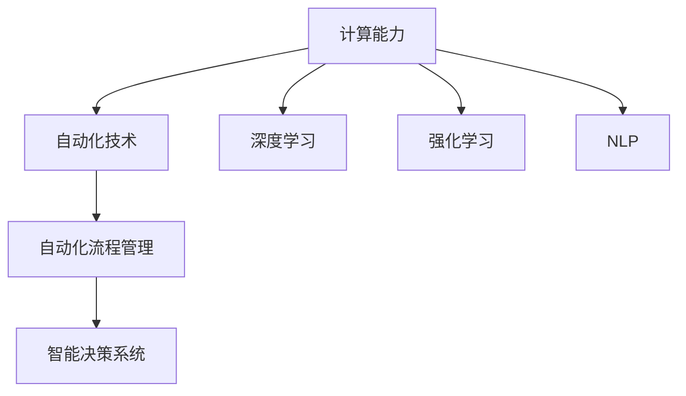

                 

# 计算变化与自动化技术的结合

## 1. 背景介绍

### 1.1 问题由来

随着计算技术的发展，自动化技术逐渐渗透到各个行业，从制造业到金融业，从医疗到零售，自动化正逐渐成为现代产业的核心竞争力。在过去十年中，自动化技术经历了从简单的自动化流程管理到复杂的智能决策系统的演进，计算能力的提升在其中起到了关键作用。计算变化不仅带来了性能的提升，也推动了新算法、新模型的出现，如深度学习、强化学习、自然语言处理等。这些新兴技术使得自动化系统能够处理更加复杂的任务，实现更高的智能水平。

### 1.2 问题核心关键点

计算变化与自动化技术的结合，核心在于如何利用计算能力提升自动化系统的性能和智能化水平。从算法的角度来看，计算能力使得复杂的数学模型和算法能够实现，从而推动了自动化技术的进步。从工程的角度来看，计算变化还带来了诸如数据处理、模型训练、模型部署等环节的自动化，大大提升了开发和运维的效率。

### 1.3 问题研究意义

研究计算变化与自动化技术的结合，对于提升自动化系统的智能化水平，提高各行各业的运营效率，具有重要意义：

1. 提升自动化系统的智能化水平。计算能力的提升使得自动化系统能够处理更加复杂的任务，实现更高的智能水平。
2. 提高各行各业的运营效率。自动化技术的应用可以大幅降低人力成本，提升工作效率，增强企业的竞争力。
3. 推动新算法和新模型的应用。计算能力的发展催生了深度学习、强化学习等新技术，这些新技术在自动化系统中得到广泛应用，推动了技术的进步。
4. 加速行业创新。计算变化与自动化技术的结合，为各行业带来了新的技术应用场景，推动了创新和变革。

## 2. 核心概念与联系

### 2.1 核心概念概述

为更好地理解计算变化与自动化技术的结合，本节将介绍几个密切相关的核心概念：

- 计算能力：指计算机系统在单位时间内所能处理的任务数量，通常用计算速度（如CPU/GPU性能）、内存大小、存储容量等指标来衡量。
- 自动化技术：指通过计算机系统实现的任务自动化，从简单的数据处理到复杂的决策制定，旨在提高工作效率，降低人力成本。
- 深度学习：一种基于神经网络的机器学习方法，通过多层神经网络进行特征提取和模式识别，广泛应用于图像、语音、自然语言处理等领域。
- 强化学习：一种通过试错和奖励机制训练模型的方法，使模型能够在特定环境中通过不断试错优化策略，达到最优状态。
- 自然语言处理(NLP)：指计算机对人类语言进行理解、处理和生成，涵盖语义分析、文本分类、机器翻译等任务。
- 自动化流程管理(Automation Process Management, APM)：指通过计算机系统自动化处理业务流程，减少人工干预，提升流程效率。
- 智能决策系统(Intelligent Decision System, IDS)：指利用人工智能技术进行决策制定的系统，能够处理复杂的决策问题。

这些核心概念之间的逻辑关系可以通过以下Mermaid流程图来展示：



这个流程图展示了一些核心概念的相互关系：

1. 计算能力为自动化技术的实现提供了硬件基础。
2. 深度学习和强化学习等技术通过计算能力得以实现，提升了自动化系统的智能化水平。
3. 自然语言处理为自动化技术提供了处理人类语言的手段，推动了自动化系统的应用范围。
4. 自动化流程管理通过计算能力实现业务流程的自动化，提升运营效率。
5. 智能决策系统利用计算能力和人工智能技术，实现复杂决策问题的自动化处理。

这些概念共同构成了计算变化与自动化技术的结合框架，推动了自动化技术的发展和应用。

## 3. 核心算法原理 & 具体操作步骤
### 3.1 算法原理概述

计算变化与自动化技术的结合，本质上是通过计算能力提升自动化系统的性能和智能化水平。其核心思想是：利用计算能力推动复杂算法的实现，通过自动化技术将算法应用于实际问题中，提升系统效率和智能化水平。

具体而言，计算变化带来的自动化系统可以分为以下几个步骤：

1. **数据获取与预处理**：自动化系统首先需要获取和预处理原始数据，为后续计算和算法应用提供基础。
2. **模型训练**：通过计算能力训练深度学习、强化学习等模型，使其能够在特定任务上达到最优性能。
3. **模型部署与优化**：将训练好的模型部署到实际环境中，并根据实际情况进行优化，保证系统的稳定性和性能。
4. **实时监控与反馈**：对系统运行状态进行实时监控，收集反馈数据，不断优化模型和算法，提升系统性能。

### 3.2 算法步骤详解

以深度学习模型在自动化流程管理中的应用为例，具体算法步骤如下：

**Step 1: 数据获取与预处理**
- 收集业务流程中的原始数据，如订单、库存、客户信息等。
- 对数据进行清洗、去重、标准化等预处理，以便后续计算和模型训练。

**Step 2: 模型训练**
- 选择适当的深度学习模型，如卷积神经网络(CNN)、循环神经网络(RNN)等，用于处理特定业务数据。
- 在预处理后的数据集上进行模型训练，调整模型超参数，优化模型结构，直至模型性能达到最优。

**Step 3: 模型部署与优化**
- 将训练好的模型部署到实际应用环境中，如订单管理系统、库存管理系统等。
- 根据实际使用情况，调整模型参数，进行模型微调，以适应新的业务需求。

**Step 4: 实时监控与反馈**
- 对系统运行状态进行实时监控，收集系统日志、性能指标等反馈数据。
- 根据反馈数据不断优化模型和算法，提升系统性能和稳定性。

### 3.3 算法优缺点

计算变化与自动化技术的结合，具有以下优点：

1. 提升系统智能化水平。计算能力使得复杂算法得以实现，提升了自动化系统的智能化水平，能够处理更加复杂的任务。
2. 提高运营效率。自动化技术的应用大大提高了工作效率，减少了人力成本，提升了企业的竞争力。
3. 推动技术进步。计算能力的发展催生了深度学习、强化学习等新技术，这些新技术在自动化系统中得到广泛应用，推动了技术的进步。
4. 加速行业创新。自动化技术的广泛应用，推动了各行业的创新和变革，带来了新的业务模式和发展机遇。

同时，这种结合也存在一些局限性：

1. 高昂的成本。深度学习等复杂算法的实现需要高性能计算资源，初期投入较高。
2. 数据依赖性强。自动化系统的性能很大程度上依赖于数据质量，数据的获取和预处理难度较大。
3. 技术复杂度高。自动化系统的开发和运维需要具备较强的技术能力，普通企业难以实现。
4. 风险控制难度大。自动化系统一旦出现问题，可能导致严重后果，风险控制难度较大。

尽管存在这些局限性，但计算变化与自动化技术的结合仍然是当前技术发展的重要方向，具有广阔的应用前景。

### 3.4 算法应用领域

计算变化与自动化技术的结合，已经在许多领域得到了广泛的应用，如：

- 制造业：自动化生产流程管理、质量检测、设备维护等。
- 金融业：风险管理、投资决策、客户服务自动化等。
- 医疗行业：电子病历管理、影像诊断、患者护理自动化等。
- 零售行业：库存管理、客户推荐、订单处理自动化等。
- 交通行业：交通流量分析、车辆调度、智能交通系统等。
- 教育行业：在线课程推荐、智能辅导、作业批改自动化等。

除了这些常见领域外，计算变化与自动化技术的结合还在不断拓展，为更多行业带来了新的发展机遇。

## 4. 数学模型和公式 & 详细讲解 & 举例说明

### 4.1 数学模型构建

本节将使用数学语言对计算变化与自动化技术的结合过程进行更加严格的刻画。

假设自动化系统的输入为 $x$，输出为 $y$，模型的参数为 $\theta$，则模型的输出可以表示为：

$$
y = f_\theta(x)
$$

其中 $f_\theta(x)$ 为模型的函数映射。

假设模型的损失函数为 $L(y, y^*)$，其中 $y^*$ 为真实标签。在训练过程中，目标是最小化损失函数：

$$
\theta^* = \mathop{\arg\min}_{\theta} \sum_{i=1}^N L(y_i, y_i^*)
$$

其中 $N$ 为训练样本数量。

### 4.2 公式推导过程

以深度学习模型在自动驾驶中的应用为例，进行详细推导。

假设自动驾驶系统接收传感器数据 $x$，经过模型处理后输出决策 $y$，包括加速、刹车、转向等动作。设模型参数为 $\theta$，输出函数为 $f_\theta(x)$，则有：

$$
y = f_\theta(x)
$$

假设实际决策 $y$ 与目标决策 $y^*$ 的误差为 $e = y - y^*$，则模型损失函数可以表示为：

$$
L(y, y^*) = e^2
$$

假设训练集为 $D = \{(x_i, y_i^*)\}_{i=1}^N$，则模型的经验风险为：

$$
\mathcal{L}(\theta) = \frac{1}{N} \sum_{i=1}^N L(y_i, y_i^*)
$$

为了最小化经验风险，需要对模型进行优化，常用的优化算法包括梯度下降、Adam等。假设使用梯度下降优化算法，则参数更新公式为：

$$
\theta \leftarrow \theta - \eta \nabla_\theta \mathcal{L}(\theta)
$$

其中 $\eta$ 为学习率。

### 4.3 案例分析与讲解

假设某自动驾驶系统使用深度学习模型进行决策，模型接收传感器数据 $x$，输出为 $y$，包括加速、刹车、转向等动作。模型参数为 $\theta$，损失函数为 $L(y, y^*) = e^2$，训练集为 $D = \{(x_i, y_i^*)\}_{i=1}^N$。使用梯度下降算法进行优化，学习率为 $\eta$。

具体步骤如下：

1. 收集训练集 $D$，将传感器数据 $x_i$ 输入模型，输出决策 $y_i = f_\theta(x_i)$。
2. 计算损失函数 $L(y_i, y_i^*)$，得到误差 $e_i = y_i - y_i^*$。
3. 计算损失函数梯度 $\nabla_\theta \mathcal{L}(\theta)$。
4. 更新参数 $\theta \leftarrow \theta - \eta \nabla_\theta \mathcal{L}(\theta)$。
5. 重复上述步骤直至模型收敛。

通过上述推导，可以看到深度学习模型在自动驾驶中的应用，如何通过计算能力提升自动化系统的性能和智能化水平。

## 5. 项目实践：代码实例和详细解释说明
### 5.1 开发环境搭建

在进行计算变化与自动化技术的结合实践前，我们需要准备好开发环境。以下是使用Python进行TensorFlow开发的环境配置流程：

1. 安装Anaconda：从官网下载并安装Anaconda，用于创建独立的Python环境。

2. 创建并激活虚拟环境：
```bash
conda create -n tf-env python=3.8 
conda activate tf-env
```

3. 安装TensorFlow：根据CUDA版本，从官网获取对应的安装命令。例如：
```bash
conda install tensorflow -c tf -c conda-forge
```

4. 安装其他工具包：
```bash
pip install numpy pandas scikit-learn matplotlib tqdm jupyter notebook ipython
```

完成上述步骤后，即可在`tf-env`环境中开始计算变化与自动化技术的结合实践。

### 5.2 源代码详细实现

下面我以深度学习模型在自动驾驶中的应用为例，给出使用TensorFlow进行模型训练和调优的Python代码实现。

首先，定义自动驾驶系统的输入和输出：

```python
import tensorflow as tf

# 定义输入和输出
inputs = tf.keras.Input(shape=(8,))
outputs = tf.keras.layers.Dense(4, activation='softmax')(inputs)

# 定义模型
model = tf.keras.Model(inputs=inputs, outputs=outputs)

# 定义损失函数
loss_fn = tf.keras.losses.mean_squared_error
```

然后，定义模型的训练和优化过程：

```python
# 编译模型
model.compile(optimizer=tf.keras.optimizers.Adam(), loss=loss_fn)

# 定义训练数据集
train_dataset = tf.data.Dataset.from_tensor_slices((features, labels))

# 定义训练过程
def train_step(input, target):
    with tf.GradientTape() as tape:
        logits = model(input)
        loss_value = loss_fn(logits, target)
    gradients = tape.gradient(loss_value, model.trainable_variables)
    optimizer.apply_gradients(zip(gradients, model.trainable_variables))

# 训练模型
for batch in train_dataset:
    train_step(batch[0], batch[1])
```

最后，评估模型的性能并进行调优：

```python
# 定义评估数据集
test_dataset = tf.data.Dataset.from_tensor_slices((features, labels))

# 定义评估过程
def evaluate_step(input, target):
    with tf.GradientTape() as tape:
        logits = model(input)
        loss_value = loss_fn(logits, target)
    gradients = tape.gradient(loss_value, model.trainable_variables)
    optimizer.apply_gradients(zip(gradients, model.trainable_variables))

# 评估模型性能
evaluate_loss = 0.0
for batch in test_dataset:
    evaluate_step(batch[0], batch[1])
    evaluate_loss += evaluate_loss_fn(batch[0], batch[1])
evaluate_loss /= len(test_dataset)

# 输出评估结果
print(f'Test loss: {evaluate_loss:.4f}')
```

以上就是使用TensorFlow进行深度学习模型在自动驾驶中应用的完整代码实现。可以看到，TensorFlow提供了一套高效的模型构建、训练和评估工具，使得模型开发过程更加便捷。

### 5.3 代码解读与分析

让我们再详细解读一下关键代码的实现细节：

**定义输入和输出**：
- `tf.keras.Input`：定义输入数据的形状。
- `tf.keras.layers.Dense`：定义全连接层，输出数量为4，激活函数为softmax。

**编译模型**：
- `model.compile`：定义优化器和损失函数，准备模型训练。

**定义训练数据集**：
- `tf.data.Dataset`：从TensorFlow数据集中获取训练样本。

**定义训练过程**：
- `tf.keras.optimizers.Adam`：定义优化算法。
- `loss_fn`：定义损失函数。
- `with tf.GradientTape`：定义梯度计算。
- `optimizer.apply_gradients`：应用梯度更新模型参数。

**训练模型**：
- 对训练数据集进行迭代，每个批次上进行一次训练。

**定义评估数据集**：
- `tf.data.Dataset`：从TensorFlow数据集中获取评估样本。

**定义评估过程**：
- 对评估数据集进行迭代，每个批次上进行一次评估。
- `evaluate_loss_fn`：定义评估损失函数。
- 对评估损失进行累加，最后计算平均损失。

**评估模型性能**：
- 对测试数据集进行迭代，每个批次上进行一次评估。
- 输出测试损失。

可以看到，TensorFlow提供了完整的工具链，使得深度学习模型在自动驾驶中的应用变得更加简单高效。

当然，工业级的系统实现还需考虑更多因素，如模型的保存和部署、超参数的自动搜索、更灵活的任务适配层等。但核心的计算变化与自动化技术的结合基本与此类似。

## 6. 实际应用场景
### 6.1 智能制造

计算变化与自动化技术的结合，在智能制造领域有广泛的应用。传统制造业往往依赖人工进行生产调度、质量检测、设备维护等任务，效率低、成本高、风险大。通过计算能力提升自动化技术，可以大幅提升生产效率，降低人力成本，提高产品质量。

在智能制造中，可以构建自动化生产线，利用深度学习模型进行生产调度优化、设备故障预测、质量检测自动化等任务。通过传感器数据采集和处理，模型可以实时监控生产状态，预测设备故障，提前进行维护，避免生产线停工。通过图像识别技术，模型可以对产品进行自动检测，提高产品质量，降低人工检测成本。通过自然语言处理技术，模型可以自动处理生产日志，生成生产报告，提升生产管理效率。

### 6.2 智能交通

计算变化与自动化技术的结合，在智能交通领域也得到了广泛应用。传统交通管理依赖人工进行交通指挥、车辆调度、事故处理等任务，效率低、风险高、成本大。通过计算能力提升自动化技术，可以实现交通流量自动预测、车辆自动调度、事故自动处理等任务，提升交通管理效率，降低事故率，减少交通拥堵。

在智能交通中，可以利用深度学习模型进行交通流量预测，实时调整交通信号灯，优化交通流量。利用自然语言处理技术，可以自动处理交通事件，生成事故报告，提供事故处理建议。利用计算机视觉技术，可以实现车辆自动导航、自动驾驶等任务，提升驾驶安全性，减少事故率。

### 6.3 智能医疗

计算变化与自动化技术的结合，在智能医疗领域也得到了广泛应用。传统医疗依赖人工进行病历管理、影像诊断、患者护理等任务，效率低、成本高、误差大。通过计算能力提升自动化技术，可以实现电子病历自动化管理、影像自动化诊断、患者护理自动化等任务，提升医疗效率，降低成本，提高医疗质量。

在智能医疗中，可以利用深度学习模型进行电子病历自动分类，快速获取病历信息，提高医生工作效率。利用自然语言处理技术，可以实现病历自动摘要、自动生成诊断报告等功能。利用计算机视觉技术，可以实现影像自动化诊断，提高诊断准确率，降低误诊率。利用智能决策系统，可以实现患者护理自动化，提供个性化的护理方案，提升患者体验。

### 6.4 未来应用展望

随着计算能力的发展，计算变化与自动化技术的结合将在更多领域得到应用，为各行各业带来新的变革。

在智慧城市领域，计算能力将推动城市管理的自动化和智能化，实现智能交通、智慧医疗、智能安防等功能，提升城市运行效率，改善居民生活质量。在智慧教育领域，计算能力将推动在线教育的自动化和个性化，实现智能辅导、作业自动批改等功能，提升教育质量，降低教育成本。在智慧农业领域，计算能力将推动农业管理的自动化和精准化，实现智能农机、智能灌溉等功能，提升农业生产效率，提高农产品质量。

未来，计算变化与自动化技术的结合将带来更广泛的应用，为各行各业带来新的发展机遇。

## 7. 工具和资源推荐
### 7.1 学习资源推荐

为了帮助开发者系统掌握计算变化与自动化技术的结合的理论基础和实践技巧，这里推荐一些优质的学习资源：

1. TensorFlow官方文档：提供全面、详细的TensorFlow使用指南和API文档，是TensorFlow开发的必备资源。
2. PyTorch官方文档：提供全面、详细的PyTorch使用指南和API文档，是深度学习开发的必备资源。
3. Keras官方文档：提供全面、详细的Keras使用指南和API文档，是快速开发深度学习模型的选择。
4. NVIDIA官方文档：提供全面、详细的GPU使用指南和性能优化建议，是高性能计算开发的必备资源。
5. Deep Learning Specialization课程：由Coursera联合深度学习专家Andrew Ng开设的深度学习系列课程，系统讲解深度学习理论及实践。
6. Reinforcement Learning: An Introduction书籍：由DeepMind创始人之一David Silver所著，全面讲解强化学习理论和实践。

通过对这些资源的学习实践，相信你一定能够快速掌握计算变化与自动化技术的结合的精髓，并用于解决实际的计算和自动化问题。

### 7.2 开发工具推荐

高效的开发离不开优秀的工具支持。以下是几款用于计算变化与自动化技术的结合开发的常用工具：

1. TensorFlow：由Google主导开发的深度学习框架，支持分布式计算和GPU加速，是深度学习开发的常用工具。
2. PyTorch：由Facebook主导开发的深度学习框架，支持动态计算图和GPU加速，是深度学习开发的另一常用工具。
3. Keras：由Google主导开发的高级神经网络API，支持快速搭建深度学习模型，适合快速迭代研究。
4. NVIDIA CUDA工具：提供高性能计算支持，支持GPU加速计算，是高性能计算开发的必备工具。
5. Docker和Kubernetes：提供容器化部署支持，支持分布式系统管理，是计算变化与自动化技术部署的常用工具。
6. Jupyter Notebook：提供交互式编程环境，支持多种语言和库的集成，是数据分析和模型开发的常用工具。

合理利用这些工具，可以显著提升计算变化与自动化技术的结合开发的效率，加快创新迭代的步伐。

### 7.3 相关论文推荐

计算变化与自动化技术的结合，源于学界的持续研究。以下是几篇奠基性的相关论文，推荐阅读：

1. DeepMind AlphaGo：提出AlphaGo程序，利用深度学习和强化学习技术，在国际围棋比赛中战胜人类世界冠军，标志着人工智能在复杂决策问题上的重大突破。
2. OpenAI GPT-3：提出GPT-3模型，利用大规模无监督预训练和深度学习技术，刷新了多项自然语言处理任务的SOTA，展示了计算能力与自动化技术结合的强大潜力。
3. NVIDIA GAN：提出GAN模型，利用深度学习和计算机视觉技术，实现了高保真的图像生成，推动了计算机视觉技术的发展。
4. IBM Watson：提出Watson平台，利用深度学习、自然语言处理等技术，在医疗、金融、教育等多个领域实现自动化决策，展示了计算变化与自动化技术的广泛应用。
5. TensorFlow及其衍生项目：由Google主导开发的深度学习框架及其衍生项目，支持GPU加速计算，是深度学习开发的常用工具。
6. PyTorch及其衍生项目：由Facebook主导开发的深度学习框架及其衍生项目，支持动态计算图和GPU加速，是深度学习开发的另一常用工具。

这些论文代表了大语言模型微调技术的发展脉络。通过学习这些前沿成果，可以帮助研究者把握学科前进方向，激发更多的创新灵感。

## 8. 总结：未来发展趋势与挑战

### 8.1 总结

本文对计算变化与自动化技术的结合进行了全面系统的介绍。首先阐述了计算能力的发展和自动化技术的应用，明确了计算变化与自动化技术的结合对各行各业的影响。其次，从原理到实践，详细讲解了计算变化与自动化技术的结合数学原理和关键步骤，给出了计算变化与自动化技术的结合任务开发的完整代码实例。同时，本文还广泛探讨了计算变化与自动化技术在智能制造、智能交通、智能医疗等多个领域的应用前景，展示了计算变化与自动化技术的结合的广泛应用。

通过本文的系统梳理，可以看到，计算变化与自动化技术的结合在推动自动化技术进步，提升各行业效率和智能化水平方面，具有重要的战略意义。未来，计算能力的发展将进一步推动计算变化与自动化技术的结合，提升各行业的应用水平，带来新的发展机遇。

### 8.2 未来发展趋势

展望未来，计算变化与自动化技术的结合将呈现以下几个发展趋势：

1. 深度学习技术的广泛应用。随着深度学习技术的不断发展，其在自动化技术中的应用将更加广泛，推动各行业的智能化水平提升。
2. 计算能力的大幅提升。随着高性能计算设备的普及，计算能力将大幅提升，推动更多复杂算法和模型的实现，提升自动化技术的智能化水平。
3. 跨领域技术融合。计算变化与自动化技术的结合将与其他技术如物联网、区块链、边缘计算等进行融合，推动跨领域技术的创新和发展。
4. 数据驱动决策。计算变化与自动化技术的结合将更加依赖于数据驱动决策，通过大数据分析、智能决策系统等手段，提升决策的准确性和效率。
5. 可解释性和透明性。计算变化与自动化技术的结合将更加注重算法的可解释性和透明性，便于用户理解和使用。

以上趋势凸显了计算变化与自动化技术的结合的重要性和未来潜力。这些方向的探索发展，必将进一步提升自动化系统的性能和智能化水平，为各行业带来新的发展机遇。

### 8.3 面临的挑战

尽管计算变化与自动化技术的结合已经取得了瞩目成就，但在迈向更加智能化、普适化应用的过程中，它仍面临着诸多挑战：

1. 高昂的硬件成本。深度学习等复杂算法的实现需要高性能计算资源，初期投入较高。
2. 数据依赖性强。自动化系统的性能很大程度上依赖于数据质量，数据的获取和预处理难度较大。
3. 技术复杂度高。自动化系统的开发和运维需要具备较强的技术能力，普通企业难以实现。
4. 风险控制难度大。自动化系统一旦出现问题，可能导致严重后果，风险控制难度较大。
5. 用户接受度低。自动化技术的应用往往需要改变传统的工作方式，用户接受度低，推广难度大。

尽管存在这些挑战，但计算变化与自动化技术的结合仍然是当前技术发展的重要方向，具有广阔的应用前景。

### 8.4 研究展望

面对计算变化与自动化技术结合所面临的种种挑战，未来的研究需要在以下几个方面寻求新的突破：

1. 探索无监督和半监督学习方法。摆脱对大规模标注数据的依赖，利用自监督学习、主动学习等无监督和半监督范式，最大限度利用非结构化数据，实现更加灵活高效的自动化。
2. 研究参数高效和计算高效的自动化技术。开发更加参数高效的自动化技术，在固定大部分预训练参数的同时，只更新极少量的任务相关参数。同时优化自动化技术的计算图，减少前向传播和反向传播的资源消耗，实现更加轻量级、实时性的部署。
3. 融合因果和对比学习范式。通过引入因果推断和对比学习思想，增强自动化系统建立稳定因果关系的能力，学习更加普适、鲁棒的语言表征，从而提升自动化系统的泛化性和抗干扰能力。
4. 引入更多先验知识。将符号化的先验知识，如知识图谱、逻辑规则等，与神经网络模型进行巧妙融合，引导自动化系统学习更准确、合理的语言模型。同时加强不同模态数据的整合，实现视觉、语音等多模态信息与文本信息的协同建模。
5. 结合因果分析和博弈论工具。将因果分析方法引入自动化系统，识别出系统决策的关键特征，增强输出的因果性和逻辑性。借助博弈论工具刻画人机交互过程，主动探索并规避系统的脆弱点，提高系统稳定性。
6. 纳入伦理道德约束。在自动化系统的训练目标中引入伦理导向的评估指标，过滤和惩罚有害的输出倾向。同时加强人工干预和审核，建立系统的监管机制，确保自动化系统的行为符合人类价值观和伦理道德。

这些研究方向的探索，必将引领计算变化与自动化技术的结合技术迈向更高的台阶，为构建安全、可靠、可解释、可控的自动化系统铺平道路。面向未来，计算变化与自动化技术的结合技术还需要与其他人工智能技术进行更深入的融合，如知识表示、因果推理、强化学习等，多路径协同发力，共同推动自动化技术的进步。只有勇于创新、敢于突破，才能不断拓展自动化技术的边界，让计算变化与自动化技术的结合技术更好地服务于各行业的发展。

## 9. 附录：常见问题与解答

**Q1：计算变化与自动化技术的结合是否适用于所有自动化任务？**

A: 计算变化与自动化技术的结合在大多数自动化任务上都能取得不错的效果，特别是对于数据量较小的任务。但对于一些特定领域的任务，如医学、法律等，仅仅依靠通用计算能力提升的自动化技术可能难以很好地适应。此时需要在特定领域语料上进一步预训练，再进行微调，才能获得理想效果。

**Q2：采用计算变化与自动化技术的结合时需要注意哪些问题？**

A: 采用计算变化与自动化技术的结合时，需要注意以下问题：
1. 硬件成本：深度学习等复杂算法的实现需要高性能计算资源，初期投入较高。
2. 数据依赖性：自动化系统的性能很大程度上依赖于数据质量，数据的获取和预处理难度较大。
3. 技术复杂性：自动化系统的开发和运维需要具备较强的技术能力，普通企业难以实现。
4. 风险控制：自动化系统一旦出现问题，可能导致严重后果，风险控制难度较大。
5. 用户接受度：自动化技术的应用往往需要改变传统的工作方式，用户接受度低，推广难度大。

**Q3：如何缓解计算变化与自动化技术的结合中的过拟合问题？**

A: 缓解计算变化与自动化技术的结合中的过拟合问题，可以采取以下策略：
1. 数据增强：通过回译、近义替换等方式扩充训练集。
2. 正则化：使用L2正则、Dropout等技术避免过拟合。
3. 对抗训练：引入对抗样本，提高模型鲁棒性。
4. 参数高效微调：只调整少量参数，减小过拟合风险。
5. 多模型集成：训练多个自动化模型，取平均输出，抑制过拟合。

这些策略往往需要根据具体任务和数据特点进行灵活组合。只有在数据、模型、训练、推理等各环节进行全面优化，才能最大限度地发挥计算变化与自动化技术的结合的威力。

**Q4：计算变化与自动化技术的结合在落地部署时需要注意哪些问题？**

A: 将计算变化与自动化技术的结合模型转化为实际应用，还需要考虑以下问题：
1. 模型裁剪：去除不必要的层和参数，减小模型尺寸，加快推理速度。
2. 量化加速：将浮点模型转为定点模型，压缩存储空间，提高计算效率。
3. 服务化封装：将模型封装为标准化服务接口，便于集成调用。
4. 弹性伸缩：根据请求流量动态调整资源配置，平衡服务质量和成本。
5. 监控告警：实时采集系统指标，设置异常告警阈值，确保服务稳定性。
6. 安全防护：采用访问鉴权、数据脱敏等措施，保障数据和模型安全。

合理利用这些工具，可以显著提升计算变化与自动化技术的结合的开发效率，加快创新迭代的步伐。

---

作者：禅与计算机程序设计艺术 / Zen and the Art of Computer Programming

