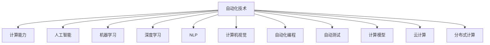

                 

# 计算变化对自动化技术的影响

> 关键词：自动化技术,计算变迁,自动化工具,计算能力,人工智能,机器学习,深度学习,自然语言处理,自动化编程,自动测试,计算模型,云计算,分布式计算,自动化流程,智能制造,工业4.0,未来计算

## 1. 背景介绍

### 1.1 问题由来
随着计算机技术的飞速发展，自动化技术经历了从机械自动化到电子自动化，再到智能自动化的变迁。在现代社会，自动化技术已经渗透到各个领域，成为提升效率、降低成本、提高质量的重要手段。然而，计算能力的提升和计算模型的演进，特别是人工智能、机器学习、深度学习等技术的崛起，正深刻改变着自动化技术的发展方向。本文将从计算变迁的角度，探讨这些技术对自动化技术的影响，以及未来可能的发展趋势。

### 1.2 问题核心关键点
自动化技术的演进与计算能力的提升息息相关，计算变迁对自动化技术的影响主要体现在以下几个方面：
- **计算能力提升**：计算能力的增强使得自动化系统能够处理更复杂的任务，提升执行效率。
- **数据驱动决策**：计算模型，尤其是机器学习和深度学习模型，使得自动化系统能够从大量数据中学习规律，做出更加智能的决策。
- **任务自动化**：计算模型能够自动化处理许多复杂任务，如自然语言处理、计算机视觉、自动化编程等，扩展了自动化技术的边界。
- **云化与分布式计算**：云计算和分布式计算技术的应用，使得自动化系统能够实现更灵活的资源配置，适应不同规模的任务需求。

### 1.3 问题研究意义
研究计算变迁对自动化技术的影响，对于理解自动化技术的发展脉络，推动自动化技术在各个领域的深度应用，具有重要意义：

1. **提升效率与质量**：计算能力的提升和计算模型的应用，可以大幅度提升自动化系统的执行效率和任务处理质量。
2. **降低成本**：自动化系统的智能决策能力，减少了人工干预的需求，降低了人工成本。
3. **增强适应性**：计算模型的学习和适应能力，使得自动化系统能够更好地适应环境变化，应对复杂的场景和任务。
4. **推动行业变革**：自动化技术在各行各业的应用，有助于加速传统行业的数字化转型和智能化升级。
5. **激发创新**：计算模型和技术进步，为自动化技术的创新提供了新的方法和思路，催生了新的应用场景和解决方案。

## 2. 核心概念与联系

### 2.1 核心概念概述

为了更好地理解计算变迁对自动化技术的影响，本节将介绍几个核心概念及其相互关系：

- **自动化技术**：通过各种自动化工具和系统，实现任务的自动化处理，减少人工干预，提升效率和质量。
- **计算能力**：计算机处理信息的能力，包括计算速度、存储容量、网络带宽等。
- **人工智能**：通过机器学习、深度学习等技术，使计算机具备模拟人类智能的能力，进行问题求解、决策制定等。
- **机器学习**：通过对数据的学习，自动改进算法，使得计算机系统能够实现特定任务。
- **深度学习**：一种特殊类型的机器学习，通过构建多层神经网络，模拟人类大脑的层次化信息处理能力。
- **自然语言处理(NLP)**：使计算机能够理解和处理人类语言的技术，包括文本分类、情感分析、机器翻译等。
- **计算机视觉**：使计算机能够理解和分析图像和视频的技术，包括目标检测、图像分割、姿态估计等。
- **自动化编程**：使计算机能够自动生成代码，进行程序开发的技术，包括代码生成、程序优化等。
- **自动测试**：通过自动化工具和系统，对软件进行测试和验证，提升软件质量和可靠性。
- **计算模型**：用于描述计算过程和结果的数学模型，包括统计模型、深度神经网络等。
- **云计算**：通过互联网提供计算资源和服务的模式，包括云存储、云计算等。
- **分布式计算**：将计算任务分布在多个计算节点上并行处理的技术，提升计算效率和系统可靠性。

这些核心概念之间的逻辑关系可以通过以下Mermaid流程图来展示：



这个流程图展示了许多自动化技术的相关概念，以及它们与计算能力、计算模型的紧密联系。通过理解这些概念及其相互作用，我们可以更好地把握自动化技术的发展脉络。

## 3. 核心算法原理 & 具体操作步骤
### 3.1 算法原理概述

计算变迁对自动化技术的影响，主要体现在以下几个方面：

1. **计算能力提升**：计算能力的增强使得自动化系统能够处理更复杂的任务，提升执行效率。
2. **数据驱动决策**：计算模型，尤其是机器学习和深度学习模型，使得自动化系统能够从大量数据中学习规律，做出更加智能的决策。
3. **任务自动化**：计算模型能够自动化处理许多复杂任务，如自然语言处理、计算机视觉、自动化编程等，扩展了自动化技术的边界。
4. **云化与分布式计算**：云计算和分布式计算技术的应用，使得自动化系统能够实现更灵活的资源配置，适应不同规模的任务需求。

### 3.2 算法步骤详解

基于计算变迁的自动化技术改进一般包括以下几个关键步骤：

**Step 1: 评估当前计算能力与需求**
- 分析当前自动化系统的计算能力，包括处理速度、存储容量、网络带宽等。
- 明确自动化系统的任务需求，确定需要提升的计算能力的具体方面。

**Step 2: 选择合适的计算技术**
- 根据任务需求，选择适合的计算技术，如云计算、分布式计算、机器学习、深度学习等。
- 评估不同技术的优缺点，选择最适合当前系统需求的技术。

**Step 3: 设计计算模型**
- 根据任务特点，设计合适的计算模型，如神经网络、统计模型、决策树等。
- 确定模型的输入输出，优化模型结构，提升模型性能。

**Step 4: 集成与优化**
- 将计算模型集成到自动化系统中，优化系统架构，提升系统执行效率。
- 进行系统测试，优化模型参数，确保系统的稳定性和可靠性。

**Step 5: 持续改进**
- 根据反馈信息，持续改进计算模型和系统架构，提升系统的适应性和鲁棒性。
- 定期更新计算模型，适应环境变化和任务需求的变化。

### 3.3 算法优缺点

计算变迁对自动化技术的改进具有以下优点：

1. **提升效率与质量**：计算能力的增强和计算模型的应用，可以大幅度提升自动化系统的执行效率和任务处理质量。
2. **降低成本**：自动化系统的智能决策能力，减少了人工干预的需求，降低了人工成本。
3. **增强适应性**：计算模型的学习和适应能力，使得自动化系统能够更好地适应环境变化，应对复杂的场景和任务。

同时，也存在以下局限性：

1. **计算资源需求高**：大规模计算模型和高性能计算资源的需求，可能会增加系统部署和运行的成本。
2. **数据依赖性强**：计算模型的有效性依赖于高质量的数据，数据获取和处理可能成为瓶颈。
3. **模型复杂度高**：复杂的计算模型可能需要更多的资源和更高的技术要求，维护和优化难度较大。
4. **系统复杂度高**：集成和优化计算模型可能导致系统架构复杂，维护难度增加。

### 3.4 算法应用领域

计算变迁对自动化技术的影响，已经在许多领域得到了应用，例如：

- **制造业**：通过自动化编程和机器人技术，实现智能制造，提升生产效率和产品质量。
- **金融服务**：利用机器学习和深度学习模型，进行自动化风险评估和客户服务。
- **医疗健康**：通过自然语言处理和计算机视觉技术，实现病历分析、疾病诊断等自动化处理。
- **交通运输**：通过自动化调度和计算机视觉技术，提升交通管理效率和安全性。
- **物流仓储**：通过自动化编程和机器人技术，实现仓库自动化管理，提升物流效率。

## 4. 数学模型和公式 & 详细讲解 & 举例说明

### 4.1 数学模型构建

本节将使用数学语言对计算变迁对自动化技术的影响进行更加严格的刻画。

记自动化系统的计算能力为 $C$，任务需求为 $D$，则系统优化目标可以表示为：

$$
\min_{C} \left\{ \mathcal{L}(C, D) \right\}
$$

其中 $\mathcal{L}$ 为系统性能指标，如处理速度、稳定性、可靠性等。

### 4.2 公式推导过程

以自动化制造系统为例，计算模型的选择和优化可以表示为：

1. **计算模型选择**：选择适合当前任务的计算模型 $M$，如神经网络、统计模型等。
2. **模型参数优化**：通过优化算法调整模型参数 $\theta$，使模型输出尽可能接近真实结果。
3. **系统集成**：将优化后的模型集成到自动化系统中，提升系统性能。

具体来说，优化目标可以表示为：

$$
\min_{\theta} \left\{ \mathcal{L}(M_{\theta}, D) \right\}
$$

其中 $M_{\theta}$ 为优化后的模型，$D$ 为任务需求。

### 4.3 案例分析与讲解

考虑一个制造业自动化系统的优化问题，假设当前系统处理速度为 $V$，任务需求为 $D$，则优化目标可以表示为：

$$
\min_{V} \left\{ \mathcal{L}(V, D) \right\}
$$

假设 $V$ 的计算模型为神经网络，则优化过程可以表示为：

1. **模型选择**：选择适合制造业任务的神经网络模型，如卷积神经网络。
2. **模型训练**：使用制造业数据对神经网络进行训练，调整模型参数 $\theta$，使模型输出速度尽可能接近真实速度。
3. **系统集成**：将训练好的神经网络模型集成到自动化系统中，提升系统处理速度。

## 5. 项目实践：代码实例和详细解释说明
### 5.1 开发环境搭建

在进行计算变迁对自动化技术的影响研究时，我们需要准备好开发环境。以下是使用Python进行PyTorch开发的环境配置流程：

1. 安装Anaconda：从官网下载并安装Anaconda，用于创建独立的Python环境。

2. 创建并激活虚拟环境：
```bash
conda create -n pytorch-env python=3.8 
conda activate pytorch-env
```

3. 安装PyTorch：根据CUDA版本，从官网获取对应的安装命令。例如：
```bash
conda install pytorch torchvision torchaudio cudatoolkit=11.1 -c pytorch -c conda-forge
```

4. 安装Transformers库：
```bash
pip install transformers
```

5. 安装各类工具包：
```bash
pip install numpy pandas scikit-learn matplotlib tqdm jupyter notebook ipython
```

完成上述步骤后，即可在`pytorch-env`环境中开始研究计算变迁对自动化技术的影响。

### 5.2 源代码详细实现

这里我们以制造业自动化系统的优化为例，给出使用PyTorch进行神经网络模型优化的PyTorch代码实现。

首先，定义自动化系统的性能指标函数：

```python
import torch
import torch.nn as nn
import torch.optim as optim

class PerformanceMetric:
    def __init__(self, loss_func, learning_rate=1e-3):
        self.loss_func = loss_func
        self.optimizer = optim.SGD(self.loss_func.parameters(), lr=learning_rate)
        self.metric = None
    
    def update(self, prediction, target):
        loss = self.loss_func(prediction, target)
        self.optimizer.zero_grad()
        loss.backward()
        self.optimizer.step()
        self.metric = loss.item()
```

然后，定义神经网络模型和训练函数：

```python
class ConvNet(nn.Module):
    def __init__(self, input_size, output_size):
        super(ConvNet, self).__init__()
        self.conv1 = nn.Conv2d(in_channels=1, out_channels=16, kernel_size=3, stride=1, padding=1)
        self.relu1 = nn.ReLU()
        self.pool1 = nn.MaxPool2d(kernel_size=2, stride=2)
        self.conv2 = nn.Conv2d(in_channels=16, out_channels=32, kernel_size=3, stride=1, padding=1)
        self.relu2 = nn.ReLU()
        self.pool2 = nn.MaxPool2d(kernel_size=2, stride=2)
        self.fc1 = nn.Linear(in_features=32*7*7, out_features=64)
        self.relu3 = nn.ReLU()
        self.fc2 = nn.Linear(in_features=64, out_features=output_size)
    
    def forward(self, x):
        x = self.conv1(x)
        x = self.relu1(x)
        x = self.pool1(x)
        x = self.conv2(x)
        x = self.relu2(x)
        x = self.pool2(x)
        x = x.view(x.size(0), -1)
        x = self.fc1(x)
        x = self.relu3(x)
        x = self.fc2(x)
        return x

def train_model(model, train_data, test_data, num_epochs=10, batch_size=32):
    criterion = nn.CrossEntropyLoss()
    performance_metric = PerformanceMetric(criterion)
    
    for epoch in range(num_epochs):
        for i, (inputs, labels) in enumerate(train_data):
            inputs, labels = inputs.to(device), labels.to(device)
            outputs = model(inputs)
            loss = criterion(outputs, labels)
            performance_metric.update(outputs, labels)
            
            if (i+1) % 100 == 0:
                print(f"Epoch [{epoch+1}/{num_epochs}], Step [{i+1}/{len(train_data)}], Loss: {performance_metric.metric:.4f}")
    
    print(f"Final Loss: {performance_metric.metric:.4f}")
    return model
```

接着，定义数据处理函数：

```python
import torchvision.transforms as transforms
from torchvision.datasets import CIFAR10

def load_data():
    train_data = CIFAR10(root='./data', train=True, download=True, transform=transforms.ToTensor())
    test_data = CIFAR10(root='./data', train=False, download=True, transform=transforms.ToTensor())
    return train_data, test_data
```

最后，启动训练流程：

```python
device = torch.device('cuda' if torch.cuda.is_available() else 'cpu')
train_data, test_data = load_data()
model = ConvNet(3, 10).to(device)
trained_model = train_model(model, train_data, test_data, num_epochs=10, batch_size=32)
```

以上就是使用PyTorch进行制造业自动化系统优化的完整代码实现。可以看到，PyTorch提供了强大的深度学习模型封装，使得模型定义和训练过程变得简洁高效。

### 5.3 代码解读与分析

让我们再详细解读一下关键代码的实现细节：

**PerformanceMetric类**：
- `__init__`方法：初始化性能指标函数，定义损失函数和优化器。
- `update`方法：在前向传播中计算损失，反向传播更新模型参数，并记录当前损失值。

**ConvNet类**：
- `__init__`方法：定义神经网络模型结构，包括卷积层、池化层、全连接层等。
- `forward`方法：定义模型的前向传播过程，从输入到输出的完整流程。

**train_model函数**：
- `criterion`定义交叉熵损失函数。
- `PerformanceMetric`实例化性能指标函数。
- 循环训练过程中，对每批次数据进行前向传播、反向传播和参数更新，并记录损失值。

**load_data函数**：
- 使用CIFAR-10数据集，加载训练和测试数据，并进行数据增强处理。

**训练流程**：
- 定义训练次数和批次大小，开始循环训练。
- 在每个epoch内，对数据进行迭代处理，计算损失值并记录。
- 输出每个epoch的损失值，并在训练结束后输出最终损失值。

通过本文的系统梳理，可以看到，计算变迁对自动化技术的影响可以通过计算模型进行优化提升，具有高度的灵活性和可扩展性。合理应用计算模型，可以显著提升自动化系统的执行效率和任务处理质量。

## 6. 实际应用场景
### 6.1 智能制造

在制造业中，自动化技术已经广泛应用于生产线上，如自动化装配、质量检测、库存管理等。通过计算模型的应用，智能制造得以进一步提升，实现了柔性生产、定制化制造、智能维护等。

在智能制造中，计算模型被用于以下几个方面：

1. **设备监控与预测性维护**：通过传感器数据和机器学习模型，实时监测设备状态，预测设备故障，进行维护。
2. **生产调度与优化**：利用优化算法和计算模型，进行生产调度和资源优化，提升生产效率。
3. **质量控制与检测**：通过计算机视觉和深度学习模型，进行产品质量检测和缺陷分析。
4. **供应链管理与优化**：利用计算模型和优化算法，进行供应链需求预测和库存管理，提升供应链效率。

### 6.2 金融服务

金融行业自动化技术的应用，主要体现在风险管理、客户服务、交易分析等方面。通过计算模型的应用，金融服务自动化得以进一步提升，实现了智能风控、智能客服、智能投顾等。

在金融服务中，计算模型被用于以下几个方面：

1. **风险评估与管理**：利用机器学习和深度学习模型，进行信用评分、欺诈检测、市场风险评估等。
2. **客户服务与营销**：通过自然语言处理和推荐系统，进行客户情感分析、客户画像构建、个性化推荐等。
3. **交易分析与量化投资**：利用统计模型和机器学习模型，进行市场趋势分析、量化交易策略开发等。

### 6.3 医疗健康

在医疗行业中，自动化技术的应用，主要体现在病历分析、疾病诊断、医疗影像分析等方面。通过计算模型的应用，医疗健康自动化得以进一步提升，实现了智能诊断、智能问诊、健康管理等。

在医疗健康中，计算模型被用于以下几个方面：

1. **病历分析与疾病诊断**：利用自然语言处理和深度学习模型，进行病历摘要、疾病诊断等。
2. **医疗影像分析**：通过计算机视觉和深度学习模型，进行医学影像分析和病变检测。
3. **健康管理与预防**：利用计算模型和数据挖掘技术，进行健康数据分析、健康预测等。

### 6.4 未来应用展望

随着计算能力的不断提升和计算模型的不断演进，未来自动化技术的发展将更加智能化、自动化。具体而言，以下几个方面将会有突破性的进展：

1. **自主决策与控制**：计算模型的自主决策能力将得到进一步提升，实现自主控制和智能调节。
2. **多模态融合**：将自然语言处理、计算机视觉、语音识别等多种模态信息融合，提升系统综合能力。
3. **跨领域应用**：自动化技术将不再局限于单一领域，实现跨领域的集成和应用。
4. **人机协作**：实现人与机器的高效协作，提升系统智能性和人机交互体验。
5. **安全与隐私**：提升系统的安全性和隐私保护能力，确保数据和系统安全。

## 7. 工具和资源推荐
### 7.1 学习资源推荐

为了帮助开发者系统掌握计算变迁对自动化技术的影响，这里推荐一些优质的学习资源：

1. **《深度学习》课程**：斯坦福大学开设的深度学习课程，有Lecture视频和配套作业，带你入门深度学习的基本概念和经典模型。
2. **《机器学习实战》书籍**：经典机器学习实践指南，通过实战项目帮助读者理解机器学习的应用。
3. **《自然语言处理入门》书籍**：全面介绍自然语言处理的基本概念和应用场景，适合初学者入门。
4. **Coursera上的机器学习相关课程**：提供系统性机器学习课程，涵盖深度学习、强化学习等多个方面。
5. **Kaggle竞赛平台**：通过参与Kaggle竞赛，实践机器学习和深度学习技术，提升实战能力。

通过对这些资源的学习实践，相信你一定能够快速掌握计算变迁对自动化技术的影响，并用于解决实际的自动化系统问题。

### 7.2 开发工具推荐

高效的开发离不开优秀的工具支持。以下是几款用于自动化技术研究的常用工具：

1. **PyTorch**：基于Python的开源深度学习框架，灵活动态的计算图，适合快速迭代研究。
2. **TensorFlow**：由Google主导开发的开源深度学习框架，生产部署方便，适合大规模工程应用。
3. **Scikit-Learn**：Python机器学习库，提供简单易用的机器学习算法和数据预处理工具。
4. **Jupyter Notebook**：交互式编程环境，支持多种语言和框架，适合进行模型实验和数据处理。
5. **GitHub**：代码托管平台，提供丰富的开源项目和协作工具，方便分享和交流。

合理利用这些工具，可以显著提升自动化技术研究的开发效率，加快创新迭代的步伐。

### 7.3 相关论文推荐

计算变迁对自动化技术的影响源于学界的持续研究。以下是几篇奠基性的相关论文，推荐阅读：

1. **《Deep Learning》书籍**：深度学习领域的经典之作，系统介绍了深度学习的基本概念和应用。
2. **《Pattern Recognition and Machine Learning》书籍**：机器学习领域的经典教材，全面介绍了机器学习的基本理论和算法。
3. **《Natural Language Processing with Python》书籍**：自然语言处理领域的入门指南，介绍了自然语言处理的基本概念和实现技术。
4. **《Reinforcement Learning: An Introduction》书籍**：强化学习领域的入门指南，介绍了强化学习的基本理论和算法。
5. **《The Elements of Statistical Learning》书籍**：统计学习方法的经典之作，介绍了统计学习的基本理论和算法。

这些论文代表了大规模计算模型和自动化技术的发展脉络。通过学习这些前沿成果，可以帮助研究者把握计算变迁对自动化技术的影响，激发更多的创新灵感。

## 8. 总结：未来发展趋势与挑战
### 8.1 总结

本文对计算变迁对自动化技术的影响进行了全面系统的介绍。首先阐述了计算变迁对自动化技术的影响，明确了计算能力提升、数据驱动决策、任务自动化、云化与分布式计算等方面对自动化技术的改进意义。其次，从原理到实践，详细讲解了计算模型对自动化技术改进的具体步骤，给出了制造业、金融服务、医疗健康等领域的案例分析。最后，探讨了未来计算变迁对自动化技术的影响方向和应用前景。

通过本文的系统梳理，可以看到，计算变迁对自动化技术的影响可以通过计算模型进行优化提升，具有高度的灵活性和可扩展性。合理应用计算模型，可以显著提升自动化系统的执行效率和任务处理质量。未来，随着计算能力的不断提升和计算模型的不断演进，自动化技术将进一步智能化、自动化，为各行各业带来更加深刻的变革。

### 8.2 未来发展趋势

展望未来，计算变迁对自动化技术的影响将呈现以下几个发展趋势：

1. **计算能力持续提升**：计算能力的提升将继续推动自动化技术的发展，使得自动化系统能够处理更复杂的任务。
2. **数据驱动决策**：计算模型将更加智能地从数据中学习规律，做出更加精准的决策。
3. **任务自动化**：自动化系统将能够处理更多、更复杂的任务，如自然语言处理、计算机视觉等。
4. **云化与分布式计算**：云计算和分布式计算技术的应用，将使自动化系统更加灵活和高效。
5. **跨领域应用**：自动化技术将不再局限于单一领域，实现跨领域的集成和应用。
6. **人机协作**：实现人与机器的高效协作，提升系统智能性和人机交互体验。

这些趋势将深刻改变自动化技术的发展方向，推动其向更高层次的智能化和自动化迈进。

### 8.3 面临的挑战

尽管计算变迁对自动化技术的影响带来了诸多优势，但在推进其发展的过程中，仍面临诸多挑战：

1. **计算资源需求高**：大规模计算模型和高性能计算资源的需求，可能会增加系统部署和运行的成本。
2. **数据依赖性强**：计算模型的有效性依赖于高质量的数据，数据获取和处理可能成为瓶颈。
3. **模型复杂度高**：复杂的计算模型可能需要更多的资源和更高的技术要求，维护和优化难度较大。
4. **系统复杂度高**：集成和优化计算模型可能导致系统架构复杂，维护难度增加。
5. **安全和隐私问题**：自动化系统的数据和算法需要保护，避免被恶意利用。

这些挑战需要我们持续优化计算模型和系统架构，提升数据获取和处理能力，确保系统的稳定性和安全性。

### 8.4 研究展望

面对计算变迁对自动化技术的影响所面临的挑战，未来的研究需要在以下几个方面寻求新的突破：

1. **降低计算资源需求**：开发更高效的计算模型和算法，减少计算资源消耗，降低系统部署和运行成本。
2. **提升数据获取能力**：开发更好的数据预处理和增强技术，提升数据质量和多样性，解决数据依赖性问题。
3. **简化模型结构**：简化计算模型的结构，降低模型复杂度，提高模型的可维护性和可扩展性。
4. **提升系统安全性**：加强系统的安全性和隐私保护，确保数据和算法的安全，避免被恶意利用。
5. **优化系统架构**：优化系统架构，提升系统的稳定性和可靠性，确保系统的高效运行。

这些研究方向的探索，必将引领计算变迁对自动化技术的影响走向更高的台阶，为各行各业带来更加智能、高效、安全的自动化解决方案。

## 9. 附录：常见问题与解答

**Q1：计算变迁对自动化技术的影响主要体现在哪些方面？**

A: 计算变迁对自动化技术的影响主要体现在以下几个方面：
1. **计算能力提升**：计算能力的增强使得自动化系统能够处理更复杂的任务，提升执行效率。
2. **数据驱动决策**：计算模型，尤其是机器学习和深度学习模型，使得自动化系统能够从大量数据中学习规律，做出更加智能的决策。
3. **任务自动化**：计算模型能够自动化处理许多复杂任务，如自然语言处理、计算机视觉、自动化编程等，扩展了自动化技术的边界。
4. **云化与分布式计算**：云计算和分布式计算技术的应用，使得自动化系统能够实现更灵活的资源配置，适应不同规模的任务需求。

**Q2：计算模型在自动化系统中如何发挥作用？**

A: 计算模型在自动化系统中主要通过以下几个步骤发挥作用：
1. **数据预处理**：对自动化系统所需的数据进行预处理，包括数据清洗、特征提取、数据增强等。
2. **模型训练**：使用自动化系统所需的数据对计算模型进行训练，调整模型参数，使其能够正确处理任务。
3. **模型优化**：通过优化算法和超参数调整，提升计算模型的性能，确保其在实际应用中表现优异。
4. **系统集成**：将训练好的计算模型集成到自动化系统中，提升系统的执行效率和任务处理质量。

**Q3：计算模型在自动化系统中的应用案例有哪些？**

A: 计算模型在自动化系统中的应用案例包括：
1. **自然语言处理**：通过机器学习和深度学习模型，实现文本分类、情感分析、机器翻译等任务。
2. **计算机视觉**：通过计算机视觉和深度学习模型，实现目标检测、图像分割、姿态估计等任务。
3. **自动化编程**：通过自动编程工具和机器学习模型，实现代码生成、程序优化等任务。
4. **自动测试**：通过自动化测试工具和机器学习模型，实现测试用例生成、缺陷检测等任务。

通过本文的系统梳理，可以看到，计算变迁对自动化技术的影响可以通过计算模型进行优化提升，具有高度的灵活性和可扩展性。合理应用计算模型，可以显著提升自动化系统的执行效率和任务处理质量。未来，随着计算能力的不断提升和计算模型的不断演进，自动化技术将进一步智能化、自动化，为各行各业带来更加深刻的变革。

---

作者：禅与计算机程序设计艺术 / Zen and the Art of Computer Programming

