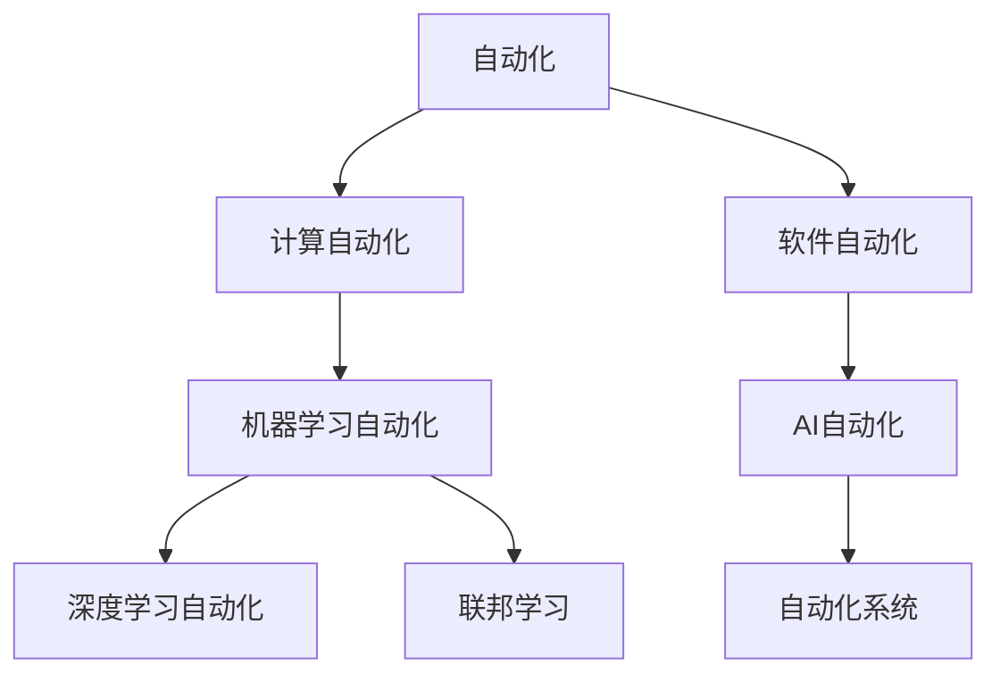

                 

## 1. 背景介绍

随着计算技术的飞速发展，自动化正在各个领域悄然改变我们的生活和工作方式。人工智能(AI)和机器学习(ML)技术的突破，赋予了计算能力以前所未有的强大生命力，开启了全新的自动化机遇。本文将系统探讨计算变化如何推动自动化的进程，并揭示自动化带来的新机遇和挑战。

### 1.1 计算技术的突破

过去十年，计算技术的迅猛发展主要体现在以下几个方面：

- **硬件设施的革新**：高性能计算集群、GPU/TPU加速器、边缘计算等新技术的推出，使得大规模计算变得高效、灵活。
- **算法与模型的演进**：深度学习、强化学习、联邦学习等先进算法的出现，为自动化提供了新的解决思路和工具。
- **数据获取与处理能力**：大数据、云计算、数据湖等技术使得数据的采集、存储、处理和分析变得更容易，为自动化的数据驱动决策提供了坚实基础。

这些突破不仅推动了科技的进步，还带来了经济、社会和文化的深刻变革。企业组织、政府机构、教育体系和日常生活正在以不同形式迎接计算技术带来的新机遇和挑战。

## 2. 核心概念与联系

### 2.1 核心概念概述

为了更好地理解自动化在计算技术推动下发展的核心概念，本节将介绍几个关键点：

- **自动化**：指通过计算机和软件技术，实现人工任务的自动化执行。自动化减少了人工干预，提高了工作效率和准确性。
- **计算自动化**：指利用计算机和算法技术，自动化地解决复杂计算问题。包括数值计算、符号计算、统计分析等。
- **机器学习自动化**：指利用机器学习模型，自动进行数据挖掘、模式识别、预测分析等任务。
- **深度学习自动化**：利用深度神经网络模型，自动学习并提取数据特征，实现更复杂和精准的自动化任务。
- **联邦学习**：一种分布式机器学习技术，可以在不共享原始数据的情况下，利用分布式设备计算更新模型参数，保障数据隐私与安全。

这些概念之间的逻辑关系可以通过以下Mermaid流程图来展示：



这个流程图展示了自动化技术从基础的计算自动化，逐步发展为机器学习、深度学习等高级自动化技术，并通过AI系统实现自动化的过程。

## 3. 核心算法原理 & 具体操作步骤
### 3.1 算法原理概述

计算技术驱动的自动化，主要依赖于以下算法原理：

- **数值优化算法**：如梯度下降、牛顿法、共轭梯度法等，用于求解最优解。
- **概率图模型**：如贝叶斯网络、马尔可夫随机场等，用于建模变量之间的概率关系。
- **强化学习算法**：如Q-learning、SARSA、策略梯度等，用于通过交互学习找到最优策略。
- **决策树与随机森林**：用于构建决策模型，自动预测和分类。
- **深度神经网络模型**：如卷积神经网络(CNN)、循环神经网络(RNN)、Transformer等，用于自动学习和提取复杂特征。
- **模型集成与融合**：通过组合不同模型的输出，提升自动化任务的准确性和鲁棒性。

这些算法通过自动化任务建模、特征提取、决策制定等步骤，实现自动化的高效运行。

### 3.2 算法步骤详解

基于计算技术的自动化一般包括以下几个关键步骤：

**Step 1: 数据准备与预处理**
- 收集和整理自动化任务所需的数据，包括原始数据、特征数据、标注数据等。
- 清洗数据，去除噪音，进行归一化和标准化处理。
- 使用数据增强技术，如旋转、缩放、扰动等，增加数据多样性。

**Step 2: 特征提取与表示**
- 利用特征提取算法，将原始数据转换为模型可接受的特征表示。
- 选择合适的特征提取方法，如传统机器学习算法、深度神经网络等。
- 特征工程，包括特征选择、特征降维等，提升模型效果。

**Step 3: 模型训练与优化**
- 选择合适的模型结构，如决策树、深度神经网络等，进行初始化。
- 设定模型的超参数，如学习率、批次大小、迭代次数等。
- 使用训练数据对模型进行迭代优化，通过梯度下降等优化算法更新参数。

**Step 4: 模型评估与部署**
- 在验证集上评估模型性能，计算准确率、召回率、F1值等指标。
- 根据评估结果调整模型参数，优化模型效果。
- 将优化后的模型部署到实际应用环境中，进行自动化任务处理。

### 3.3 算法优缺点

计算技术驱动的自动化具有以下优点：
- 效率高：自动化技术可以高速处理大量数据，完成复杂的计算任务。
- 准确性高：机器学习和深度学习模型通过大量数据训练，具备高精度的预测能力。
- 可扩展性强：计算技术可以在分布式环境中进行扩展，适应大规模任务。
- 成本低：自动化可以减少人工操作，降低运营成本。

同时，自动化也存在以下局限：
- 数据依赖：自动化技术高度依赖于数据质量，数据缺失或不准确会导致模型效果不佳。
- 算法复杂度：深度学习模型复杂，需要大量的计算资源和时间训练，且难以解释。
- 模型过拟合：自动化模型可能过拟合于训练数据，导致泛化能力不足。
- 安全与隐私：自动化过程中可能涉及敏感数据，安全与隐私保护需要特别关注。

尽管存在这些局限，但就目前而言，计算技术驱动的自动化已成为推动科技进步和工业发展的核心力量。未来相关研究的重点在于如何进一步降低算法的复杂度和数据依赖，提高自动化任务的泛化能力和解释性，同时兼顾安全性和隐私保护。

### 3.4 算法应用领域

计算技术驱动的自动化已广泛应用于各个领域，如金融、医疗、交通、物流、制造等。以下是几个典型应用场景：

**金融风险控制**：利用机器学习模型对海量交易数据进行分析，自动检测和防范金融欺诈、信用风险等。
**智能医疗诊断**：通过深度学习模型分析医学影像、基因数据等，辅助医生进行疾病诊断和治疗决策。
**智能交通管理**：使用计算技术优化交通信号控制、车辆调度等，提升城市交通效率。
**物流仓储管理**：采用自动化仓库系统，进行货物分拣、存储、追踪等，提升物流效率和准确性。
**制造业智能化改造**：利用AI技术对生产流程进行优化，实现智能制造和质量控制。

## 4. 数学模型和公式 & 详细讲解 & 举例说明
### 4.1 数学模型构建

自动化任务中的数学模型构建涉及多个数学分支，包括线性代数、概率论、统计学、优化理论等。这里重点介绍自动化任务中常用的数学模型：

- **线性回归模型**：用于预测和分析线性关系的数据，公式如下：

$$ y = \beta_0 + \beta_1 x_1 + \beta_2 x_2 + \cdots + \beta_n x_n + \epsilon $$

其中，$y$ 为输出变量，$x_i$ 为输入变量，$\beta_i$ 为模型参数，$\epsilon$ 为误差项。

- **决策树模型**：用于分类和回归任务，将数据划分为多个子集，公式如下：

$$ \text{if}\ x_i \leq \text{threshold}_i, \text{then}\ x_i \text{属于}\ \text{类别}\ C_i $$

其中，$x_i$ 为输入特征，$\text{threshold}_i$ 为划分阈值，$C_i$ 为类别。

- **支持向量机模型**：用于分类和回归任务，通过构建超平面划分不同类别，公式如下：

$$ \text{arg} \min_{w, \text{offset}} \frac{1}{2} \|w\|^2 + C \sum_{i=1}^n \text{loss}(y_i, \langle w, x_i \rangle + \text{offset}) $$

其中，$w$ 为模型参数，$\text{offset}$ 为偏移量，$\text{loss}$ 为损失函数。

### 4.2 公式推导过程

以决策树模型为例，进行详细推导：

**决策树构建流程**：
1. 计算每个输入特征的信息熵：
   $$ H(X_i) = -\sum_{c=1}^C p_c \log p_c $$

2. 选择信息增益最大的特征作为划分标准：
   $$ \text{Gain}(X_i) = H(X) - \sum_{c=1}^C H(X_c) $$

3. 递归地对子集进行划分，直至满足停止条件。

**公式推导过程**：
- 假设输入数据集为 $X=\{x_1, x_2, \cdots, x_n\}$，每个特征为 $x_i$，类别为 $C=\{1, 2, \cdots, K\}$，类别概率为 $p_c$。
- 计算数据集的信息熵：

$$ H(X) = -\sum_{c=1}^K p_c \log p_c $$

- 计算每个特征的信息熵：

$$ H(X_i) = -\sum_{c=1}^K \sum_{x \in X} \frac{p_{x,c}}{p_i} \log \frac{p_{x,c}}{p_i} $$

- 计算信息增益：

$$ \text{Gain}(X_i) = H(X) - \sum_{c=1}^K H(X_c) $$

- 选择信息增益最大的特征进行划分，递归计算子集的信息熵，直至停止条件。

通过上述公式，决策树模型能够自动化地对数据进行分类和回归，其构建过程具有高度的可解释性和灵活性。

### 4.3 案例分析与讲解

以**智能推荐系统**为例，详细分析基于计算技术的自动化推荐过程：

1. **数据准备**：收集用户历史行为数据，包括浏览、点击、评分、评论等，构建用户画像和物品特征向量。
2. **特征提取**：利用协同过滤、内容过滤等方法，将用户和物品的原始数据转换为高维特征向量。
3. **模型训练**：选择深度神经网络模型（如FM、DNN等），利用历史数据进行训练，学习用户与物品的交互模式。
4. **模型优化**：通过梯度下降等优化算法，调整模型参数，提高推荐准确性。
5. **模型评估**：在验证集上评估模型性能，计算推荐指标如精确率、召回率、F1值等。
6. **模型部署**：将优化后的模型部署到推荐系统中，实现实时推荐。

通过上述过程，智能推荐系统能够自动化地分析用户行为，推荐相关物品，显著提升用户的体验和满意度。

## 5. 项目实践：代码实例和详细解释说明
### 5.1 开发环境搭建

在进行自动化项目实践前，我们需要准备好开发环境。以下是使用Python进行TensorFlow开发的配置流程：

1. 安装Anaconda：从官网下载并安装Anaconda，用于创建独立的Python环境。

2. 创建并激活虚拟环境：
```bash
conda create -n tf-env python=3.8 
conda activate tf-env
```

3. 安装TensorFlow：根据CUDA版本，从官网获取对应的安装命令。例如：
```bash
conda install tensorflow -c conda-forge -c pytorch
```

4. 安装各类工具包：
```bash
pip install numpy pandas scikit-learn matplotlib tqdm jupyter notebook ipython
```

完成上述步骤后，即可在`tf-env`环境中开始自动化项目开发。

### 5.2 源代码详细实现

下面我们以智能推荐系统为例，给出使用TensorFlow进行推荐模型训练的代码实现。

首先，定义数据处理函数：

```python
import tensorflow as tf
import numpy as np

def load_data(filename):
    with open(filename, 'r') as f:
        lines = f.readlines()
    ids = np.array([line.split(' ')[0] for line in lines])
    ratings = np.array([float(line.split(' ')[1]) for line in lines])
    return ids, ratings
```

然后，定义模型和优化器：

```python
def build_model(input_shape):
    model = tf.keras.Sequential([
        tf.keras.layers.Dense(128, activation='relu', input_shape=input_shape),
        tf.keras.layers.Dense(64, activation='relu'),
        tf.keras.layers.Dense(1, activation='sigmoid')
    ])
    optimizer = tf.keras.optimizers.Adam(learning_rate=0.001)
    return model, optimizer
```

接着，定义训练和评估函数：

```python
def train_model(model, data, epochs, batch_size, validation_split=0.2):
    history = model.fit(
        x=data['ids'], 
        y=data['ratings'], 
        validation_split=validation_split,
        epochs=epochs,
        batch_size=batch_size,
        verbose=0)
    return history

def evaluate_model(model, data, batch_size):
    scores = model.evaluate(
        x=data['ids'], 
        y=data['ratings'], 
        batch_size=batch_size,
        verbose=0)
    return scores
```

最后，启动训练流程并在验证集上评估：

```python
input_shape = (1,)
ids, ratings = load_data('ratings.csv')
model, optimizer = build_model(input_shape)

history = train_model(model, (ids, ratings), epochs=10, batch_size=32)
evaluate_model(model, (ids, ratings), batch_size=32)
```

以上就是使用TensorFlow进行推荐模型训练的完整代码实现。可以看到，TensorFlow提供了强大的计算图和自动微分功能，使得模型训练和优化变得简洁高效。

### 5.3 代码解读与分析

让我们再详细解读一下关键代码的实现细节：

**load_data函数**：
- 读取数据文件，将ID和评分分离并返回。

**build_model函数**：
- 定义神经网络模型结构，包含输入层、隐藏层和输出层。
- 选择Adam优化器，设置学习率。

**train_model函数**：
- 使用模型训练数据对模型进行迭代优化，记录训练过程中的性能指标。

**evaluate_model函数**：
- 使用模型评估数据对模型进行验证，计算推荐指标。

**训练流程**：
- 定义输入形状，加载数据。
- 构建模型和优化器。
- 训练模型，在验证集上评估模型效果。

通过上述代码，用户可以方便地构建并训练推荐模型，实现自动化的推荐任务。TensorFlow还支持模型保存和导出，方便后续部署和应用。

## 6. 实际应用场景
### 6.1 智能客服系统

基于计算技术的自动化，智能客服系统能够自动理解用户问题，快速提供个性化服务。例如，使用自然语言处理(NLP)技术，结合决策树和随机森林等算法，可以实现自动问题分类和答案生成。具体流程如下：

1. **数据准备**：收集用户的历史对话记录，标注常见问题和最佳回答。
2. **特征提取**：利用NLP技术，提取对话文本的语义特征，生成特征向量。
3. **模型训练**：选择决策树或随机森林模型，利用标注数据进行训练。
4. **模型优化**：通过交叉验证和调参，优化模型性能。
5. **部署应用**：将训练好的模型部署到客服系统中，自动处理用户咨询。

智能客服系统能够大幅提升客服响应速度和用户满意度，减少人工干预，降低运营成本。

### 6.2 金融风险控制

在金融领域，利用计算技术驱动的自动化，可以实时监控市场变化，及时发现和防范风险。例如，使用强化学习算法，通过大量历史交易数据训练模型，学习最优的交易策略。具体流程如下：

1. **数据准备**：收集历史交易数据，包括交易时间、价格、成交量等。
2. **特征提取**：利用时间序列分析和特征工程技术，将原始数据转换为模型可接受的特征向量。
3. **模型训练**：选择强化学习算法，利用历史数据进行模型训练。
4. **模型优化**：通过实验对比和调参，优化模型性能。
5. **部署应用**：将训练好的模型部署到交易系统中，实时监控和调整交易策略。

金融风险控制自动化系统能够实时监测市场波动，预测和防范潜在的金融风险，保障投资安全。

### 6.3 智能医疗诊断

在医疗领域，利用计算技术驱动的自动化，可以辅助医生进行疾病诊断和治疗决策。例如，使用深度学习算法，分析医学影像和基因数据，识别病变和异常。具体流程如下：

1. **数据准备**：收集医学影像和基因数据，进行标注和预处理。
2. **特征提取**：利用深度学习技术，提取影像和基因数据的特征表示。
3. **模型训练**：选择深度神经网络模型，利用标注数据进行训练。
4. **模型优化**：通过验证集评估和调参，优化模型性能。
5. **部署应用**：将训练好的模型部署到医疗系统中，辅助医生进行诊断和治疗。

智能医疗诊断系统能够提升诊断的准确性和效率，减轻医生的工作负担，提高医疗服务质量。

## 7. 工具和资源推荐
### 7.1 学习资源推荐

为了帮助开发者系统掌握计算技术驱动的自动化理论基础和实践技巧，这里推荐一些优质的学习资源：

1. 《深度学习》（Ian Goodfellow等著）：全面介绍深度学习的基本概念和应用，适合深入学习和研究。
2. 《机器学习实战》（Peter Harrington著）：通过实战项目，讲解机器学习算法和应用，适合初学者和实践者。
3. 《TensorFlow官方文档》：提供TensorFlow的完整教程和API文档，适合开发者学习和使用。
4. Coursera《机器学习》课程（Andrew Ng主讲）：系统讲解机器学习算法和应用，适合在线学习和研究。
5. Google Colab：提供免费的GPU/TPU计算资源，适合快速实验和部署。

通过对这些资源的学习实践，相信你一定能够快速掌握计算技术驱动的自动化精髓，并用于解决实际的自动化问题。

### 7.2 开发工具推荐

高效的开发离不开优秀的工具支持。以下是几款用于自动化开发的常用工具：

1. TensorFlow：基于Python的开源深度学习框架，支持分布式计算，适合大规模自动化任务。
2. PyTorch：基于Python的开源深度学习框架，灵活性高，支持动态计算图。
3. Keras：高层API，简化深度学习模型的构建和训练，适合快速原型设计和实验。
4. Jupyter Notebook：交互式笔记本，支持代码编写和结果展示，适合自动化项目开发和协作。
5. Scikit-learn：基于Python的机器学习库，提供丰富的算法和工具，适合数据分析和模型构建。

合理利用这些工具，可以显著提升自动化开发的效率，加快创新迭代的步伐。

### 7.3 相关论文推荐

计算技术驱动的自动化技术在多个领域已经取得了显著成果。以下是几篇奠基性的相关论文，推荐阅读：

1. DeepMind的AlphaGo：利用强化学习技术，通过深度神经网络模型，成功训练出能够战胜人类顶尖选手的围棋AI。
2. OpenAI的GPT-3：利用大规模预训练和微调技术，实现自然语言处理的高性能。
3. Google的BERT：利用深度预训练和微调技术，大幅提升自然语言理解能力。
4. IBM的Watson：利用混合人工智能和自动化技术，提供医疗、金融、教育等领域的智能解决方案。

这些论文代表了大规模自动化技术的发展脉络。通过学习这些前沿成果，可以帮助研究者把握学科前进方向，激发更多的创新灵感。

## 8. 总结：未来发展趋势与挑战

### 8.1 总结

本文对计算技术驱动的自动化进行了全面系统的介绍。首先阐述了计算技术突破对自动化带来的影响，明确了自动化的高效、准确、可扩展等特点。其次，从原理到实践，详细讲解了自动化任务的数学模型和关键算法步骤，给出了自动化任务开发的完整代码实例。同时，本文还广泛探讨了自动化技术在智能客服、金融风险控制、智能医疗诊断等多个领域的应用前景，展示了计算技术在推动自动化发展中的强大潜力。

通过本文的系统梳理，可以看到，计算技术驱动的自动化正在改变各行各业的运营方式，其高效、准确、可扩展的特性，带来了巨大的经济效益和社会价值。未来，伴随计算技术的持续进步，自动化技术将在更多领域得到应用，为人类社会的发展带来深远影响。

### 8.2 未来发展趋势

展望未来，计算技术驱动的自动化将呈现以下几个发展趋势：

1. **智能化水平提升**：深度学习、强化学习等高级算法将进一步推动自动化系统智能化水平提升，能够自主学习和适应复杂环境。
2. **多模态融合**：自动化系统将融合视觉、语音、文本等多种模态信息，实现更全面和精准的任务处理。
3. **边缘计算普及**：随着边缘计算技术的发展，自动化系统将能够在本地设备上进行数据处理和决策，提升实时性和效率。
4. **联邦学习应用**：联邦学习技术将帮助自动化系统在保护数据隐私的同时，利用分布式计算资源进行模型优化。
5. **自动化与人类协作**：自动化系统将与人类进行更紧密的协作，实现人机协同优化，提升系统的综合性能。

以上趋势凸显了计算技术驱动的自动化的广阔前景。这些方向的探索发展，必将进一步提升自动化系统的性能和应用范围，为人类社会的发展带来深远影响。

### 8.3 面临的挑战

尽管计算技术驱动的自动化已经取得了显著成果，但在迈向更加智能化、普适化应用的过程中，它仍面临诸多挑战：

1. **数据获取与处理**：自动化系统的运行高度依赖于数据质量和数据量，数据获取和处理过程中的噪音和偏差可能影响系统性能。
2. **模型复杂度**：深度学习模型复杂，训练和优化过程中需要大量计算资源和时间，且难以解释和调试。
3. **模型泛化能力**：自动化系统可能对新数据和新任务泛化能力不足，需要在训练和优化过程中进行充分验证。
4. **安全与隐私**：自动化系统中可能涉及敏感数据和决策，安全与隐私保护需要特别关注。
5. **伦理与法律**：自动化系统可能涉及伦理和法律问题，需要制定相应的规范和标准。

尽管存在这些挑战，但通过持续的技术创新和跨学科合作，自动化技术在未来的应用前景仍然十分广阔。

### 8.4 研究展望

面对自动化技术面临的挑战，未来的研究需要在以下几个方面寻求新的突破：

1. **自动化系统智能化**：开发更加智能化和自适应能力的自动化系统，提高系统的自主学习和决策能力。
2. **数据获取与处理**：研究高效的数据获取和处理技术，提高数据质量，减少噪音和偏差。
3. **模型优化与解释**：开发更加高效和可解释的自动化模型，提升模型的泛化能力和可解释性。
4. **多模态融合**：研究多模态信息融合技术，提升自动化系统的综合感知和决策能力。
5. **隐私保护与伦理**：制定自动化系统的隐私保护和伦理规范，确保系统的安全性、公平性和透明性。

这些研究方向的探索，必将引领自动化技术迈向更高的台阶，为构建安全、可靠、可解释、可控的智能系统铺平道路。面向未来，自动化技术还需要与其他人工智能技术进行更深入的融合，如知识表示、因果推理、强化学习等，多路径协同发力，共同推动智能系统的进步。只有勇于创新、敢于突破，才能不断拓展自动化的边界，让智能技术更好地造福人类社会。

## 9. 附录：常见问题与解答

**Q1：如何提高自动化系统的泛化能力？**

A: 提高自动化系统的泛化能力需要从多个方面进行优化：
1. **增加数据量**：通过更多的训练数据，提升模型对新数据的适应能力。
2. **数据多样性**：增加数据的多样性，避免模型对特定数据分布的依赖。
3. **模型正则化**：使用L2正则、Dropout等正则化技术，避免模型过拟合。
4. **模型优化**：通过模型选择和调参，选择最优的模型结构和超参数。
5. **数据增强**：利用数据增强技术，如旋转、缩放、扰动等，增加数据多样性。

**Q2：自动化系统的可解释性如何进行改进？**

A: 自动化系统的可解释性可以通过以下方法进行改进：
1. **模型简化**：通过减少模型的复杂度，降低模型的黑盒程度，提高可解释性。
2. **模型可视化**：利用可视化工具，展示模型内部特征和决策过程，提高可解释性。
3. **模型解释器**：开发模型解释器，通过符号化的方法解释模型的内部机制。
4. **因果分析**：引入因果分析方法，识别模型的决策关键特征，增强输出的因果性和逻辑性。

**Q3：自动化系统如何应对数据质量问题？**

A: 自动化系统应对数据质量问题可以通过以下方法：
1. **数据清洗**：对原始数据进行清洗，去除噪音和偏差。
2. **数据增强**：通过数据增强技术，扩充训练数据集，提高数据多样性。
3. **模型鲁棒性**：开发鲁棒性更强的模型，减少数据偏差对模型的影响。
4. **模型自适应**：通过自适应学习，使模型能够适应数据分布的变化。
5. **多源数据融合**：融合多源数据，提高数据质量，减少单一数据源的偏差。

**Q4：自动化系统如何实现边缘计算？**

A: 自动化系统实现边缘计算可以通过以下方法：
1. **设备互联**：通过网络技术，实现设备之间的互联和通信。
2. **本地计算**：将计算任务分配到本地设备上进行处理，减少数据传输。
3. **边缘服务器**：构建边缘服务器，处理本地设备无法解决的复杂计算任务。
4. **分布式计算**：利用分布式计算技术，实现高性能的边缘计算。
5. **云-边协同**：利用云计算资源，提升边缘计算的资源和性能。

通过上述方法，自动化系统能够实现高效、实时、安全的数据处理和决策。

**Q5：自动化系统如何保证数据隐私与安全？**

A: 自动化系统保证数据隐私与安全可以通过以下方法：
1. **数据加密**：对数据进行加密处理，防止数据泄露。
2. **访问控制**：设置访问控制策略，限制数据访问权限。
3. **差分隐私**：通过差分隐私技术，添加随机噪音，保护数据隐私。
4. **联邦学习**：使用联邦学习技术，在保护数据隐私的同时，利用分布式计算资源进行模型优化。
5. **安全协议**：使用安全协议，如SSL/TLS，保护数据传输安全。

通过这些方法，自动化系统能够确保数据隐私和安全，提升系统的可信度。

**Q6：自动化系统如何实现人机协作？**

A: 自动化系统实现人机协作可以通过以下方法：
1. **用户交互设计**：设计友好的人机交互界面，提高用户的操作体验。
2. **自然语言处理**：利用自然语言处理技术，实现自动化的自然语言理解和生成。
3. **知识图谱**：构建知识图谱，提供丰富的知识信息，辅助人机决策。
4. **协作算法**：开发协作算法，优化人机协作的效率和效果。
5. **智能代理**：构建智能代理，自动处理一些简单的任务，减轻用户的负担。

通过这些方法，自动化系统能够更好地与用户协作，提升系统的综合性能。

---

作者：禅与计算机程序设计艺术 / Zen and the Art of Computer Programming

