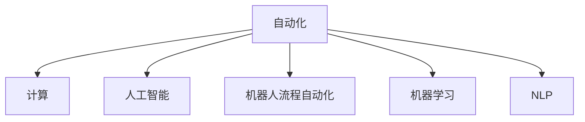

                 

# 计算变化带来的自动化机遇

> 关键词：自动化，计算，机会，技术变革，应用场景，策略规划

## 1. 背景介绍

### 1.1 问题由来
随着计算机技术的飞速发展，自动化已经成为现代企业提升效率、降低成本的重要手段。从早期的机械自动化到软件自动化，再到如今的AI自动化，计算技术的每一次进步都极大地扩展了自动化的应用边界，带来了新的机遇与挑战。在当前的技术浪潮下，如何更好地理解和应用自动化，成为企业管理者、IT从业人员乃至全社会共同关心的话题。

### 1.2 问题核心关键点
本文聚焦于计算技术的最新进展如何驱动自动化变革，分析自动化在不同应用场景中的机遇和策略。通过深入探讨自动化的原理、应用和实践，探讨如何构建高效、智能的自动化系统，助力企业实现数字化转型。

### 1.3 问题研究意义
研究计算驱动的自动化机遇，对于推动企业管理效率提升、成本优化、市场竞争力和创新能力具有重要意义。自动化技术的应用可以减轻员工负担，优化资源配置，提高决策速度，驱动业务创新。理解自动化技术的最新动态和应用潜力，有助于企业把握未来发展方向，增强竞争力。

## 2. 核心概念与联系

### 2.1 核心概念概述

为更好地理解计算驱动的自动化机遇，本节将介绍几个密切相关的核心概念：

- **自动化（Automation）**：通过使用计算技术，实现任务自动执行、过程优化和资源管理的过程。自动化的目标是提高效率、减少错误和降低成本。

- **计算（Computing）**：包括软件、硬件、数据处理等领域的计算技术，是自动化得以实现的技术基础。

- **人工智能（AI）**：一种通过计算技术模仿人类智能的高级自动化形式，能够进行复杂任务的处理和决策。

- **机器人流程自动化（RPA）**：利用软件机器人模拟人工操作步骤，实现企业流程的自动化，主要用于重复性高、规则明确的任务。

- **机器学习（Machine Learning, ML）**：一种数据驱动的计算技术，通过训练模型，实现对数据的预测和分类，是自动化系统的重要工具。

- **自然语言处理（NLP）**：涉及对自然语言进行理解、生成和处理的计算技术，是自动化处理文本数据的关键技术。

这些核心概念之间的逻辑关系可以通过以下Mermaid流程图来展示：



这个流程图展示了几大核心概念的相互关系：

1. 自动化是计算技术的最终目标，涉及对任务、流程和资源的全方位管理。
2. 计算为自动化提供了技术基础，包括软件、硬件和数据处理等。
3. 人工智能作为高级自动化形式，通过复杂的算法和模型，实现对复杂任务的处理。
4. 机器人流程自动化主要应用于规则明确、重复性高的任务，通过模拟人工操作步骤实现自动化。
5. 机器学习是自动化系统的关键技术之一，通过训练模型实现数据的预测和分类。
6. 自然语言处理作为自动化处理文本数据的重要工具，使机器能够理解和生成自然语言。

## 3. 核心算法原理 & 具体操作步骤
### 3.1 算法原理概述

基于计算驱动的自动化，本质上是通过数据和算法驱动的系统决策和执行过程。其核心思想是：利用计算技术对数据进行高效处理和分析，从而实现任务的自动化和优化。

形式化地，假设自动化任务 $T$ 的数据集为 $D=\{(x_i,y_i)\}_{i=1}^N$，其中 $x_i$ 为输入数据，$y_i$ 为对应的输出结果。自动化系统的目标是最小化损失函数 $\mathcal{L}$，使得模型输出的结果尽可能接近真实结果，即：

$$
\hat{y} = \mathop{\arg\min}_{\theta} \mathcal{L}(f_{\theta}(x_i),y_i)
$$

其中 $f_{\theta}(x_i)$ 为自动化系统的预测模型，$\theta$ 为模型的参数。在实践中，我们通常使用基于梯度的优化算法（如SGD、Adam等）来近似求解上述最优化问题。

### 3.2 算法步骤详解

基于计算驱动的自动化系统一般包括以下几个关键步骤：

**Step 1: 准备数据集**
- 收集自动化任务相关的数据集 $D$，确保数据质量和高泛化能力。数据集应涵盖各种常见和边缘情况，以提升自动化系统的鲁棒性。

**Step 2: 设计模型结构**
- 根据任务特点，选择适合的模型结构，如线性回归、决策树、神经网络等。在自动化任务中，常用的模型包括RNN、CNN、Transformer等。

**Step 3: 训练和验证**
- 使用数据集 $D$ 进行模型训练，调整模型参数 $\theta$，最小化损失函数 $\mathcal{L}$。
- 在验证集上评估模型性能，避免过拟合。

**Step 4: 部署和监控**
- 将训练好的模型 $f_{\theta}$ 部署到实际生产环境中。
- 持续监控系统运行状态，及时发现和解决问题。

**Step 5: 持续优化**
- 根据实际运行情况，不断收集数据，迭代训练模型，优化系统性能。

### 3.3 算法优缺点

基于计算驱动的自动化系统具有以下优点：

- **效率高**：自动化系统可以快速处理大量数据，大幅提升决策和执行速度。
- **准确性好**：通过数据分析和模型优化，自动化系统能够提供高精度的决策。
- **灵活性强**：自动化系统可根据任务特点，灵活调整模型结构和参数，适应不同的应用场景。
- **成本低**：减少人工干预和操作，降低运营成本。

同时，该方法也存在一定的局限性：

- **数据依赖**：自动化系统的性能依赖于高质量的数据集，数据获取和标注成本较高。
- **模型复杂**：复杂的自动化任务需要高维度的模型结构，训练和推理计算资源需求高。
- **鲁棒性差**：自动化系统对噪声和异常情况较为敏感，可能出现误判。
- **解释性不足**：自动化系统的决策过程通常缺乏可解释性，难以进行调试和优化。

尽管存在这些局限性，但就目前而言，基于计算驱动的自动化方法仍是最主流和高效的自动化手段。未来相关研究的重点在于如何进一步降低数据需求，提高模型鲁棒性，增强系统可解释性，以应对未来的挑战。

### 3.4 算法应用领域

基于计算驱动的自动化系统在多个领域得到了广泛应用，包括但不限于：

- **制造业**：自动化生产线、机器人臂、智能仓储等，实现从物料采购到成品入库的全流程自动化。
- **金融业**：自动化交易系统、智能客服、风险监控等，提升交易速度和客户服务质量。
- **零售业**：智能货架、库存管理、客户推荐系统等，优化库存管理和客户体验。
- **医疗健康**：自动化诊断系统、智能设备监控、患者管理等，提升医疗服务质量和效率。
- **物流业**：自动化分拣、配送、运输优化等，提升物流效率和降低成本。
- **教育**：智能辅导系统、自适应学习、作业批改等，提高教育质量和效率。
- **政府服务**：在线办事、智能客服、数据分析等，提升政府服务效率和透明度。

## 4. 数学模型和公式 & 详细讲解 & 举例说明
### 4.1 数学模型构建

本节将使用数学语言对基于计算驱动的自动化系统进行更加严格的刻画。

假设自动化任务 $T$ 的数据集为 $D=\{(x_i,y_i)\}_{i=1}^N, x_i \in \mathcal{X}, y_i \in \mathcal{Y}$。定义自动化系统的预测模型为 $f_{\theta}:\mathcal{X} \rightarrow \mathcal{Y}$，其中 $\theta$ 为模型参数。

定义自动化系统的损失函数为 $\mathcal{L}(f_{\theta},D)$，用于衡量模型预测结果与真实结果之间的差异。常用的损失函数包括均方误差损失、交叉熵损失等。

### 4.2 公式推导过程

以下我们以回归任务为例，推导最小二乘法（Least Squares Regression, LS）的数学模型和计算公式。

假设自动化系统需要预测 $x$ 到 $y$ 的线性关系，即 $y = \theta_0 + \theta_1 x + \epsilon$，其中 $\epsilon$ 为误差项。回归任务的目标是最小化预测误差，即：

$$
\mathcal{L}(f_{\theta},D) = \frac{1}{N} \sum_{i=1}^N (y_i - f_{\theta}(x_i))^2
$$

通过对目标函数求导，得到模型参数 $\theta$ 的更新公式：

$$
\theta = (X^TX)^{-1}X^Ty
$$

其中 $X$ 为输入数据 $x$ 的矩阵形式，$y$ 为对应的输出结果。

在得到模型参数 $\theta$ 后，我们可以使用上述公式计算任意 $x$ 的预测值 $y$。

### 4.3 案例分析与讲解

**案例一：自动化仓储管理**

假设某物流公司需要自动化管理其仓储系统，以实现物料进仓、存储和出仓的全流程自动化。收集历史物料信息，包括进仓时间、数量、存储位置、出仓时间、数量等数据，作为训练数据集 $D$。

设计一个神经网络模型 $f_{\theta}$，包含输入层、隐藏层和输出层。使用监督学习算法（如SGD、Adam等）对模型进行训练，最小化损失函数 $\mathcal{L}$。

在训练过程中，使用数据增强技术（如随机旋转、缩放、平移等）扩充数据集 $D$，以提高模型的泛化能力。在验证集上评估模型性能，调整模型参数，最终得到最优模型 $f_{\theta}$。

将训练好的模型 $f_{\theta}$ 部署到实际仓储系统中，实时处理进仓、存储和出仓数据，自动生成物料位置信息，优化仓储管理。

**案例二：智能客服系统**

某金融公司需要构建智能客服系统，以提升客户服务质量和效率。收集历史客户咨询记录，包括客户提问、回答、上下文信息等，作为训练数据集 $D$。

设计一个RNN模型 $f_{\theta}$，将客户提问作为输入，输出对应的回答。使用监督学习算法（如RNN、LSTM等）对模型进行训练，最小化损失函数 $\mathcal{L}$。

在训练过程中，使用数据增强技术（如回译、近义替换等）扩充数据集 $D$，以提高模型的泛化能力。在验证集上评估模型性能，调整模型参数，最终得到最优模型 $f_{\theta}$。

将训练好的模型 $f_{\theta}$ 部署到实际客服系统中，实时处理客户咨询请求，自动生成回答，提升客户服务体验。

## 5. 项目实践：代码实例和详细解释说明
### 5.1 开发环境搭建

在进行自动化系统开发前，我们需要准备好开发环境。以下是使用Python进行TensorFlow开发的环境配置流程：

1. 安装Anaconda：从官网下载并安装Anaconda，用于创建独立的Python环境。

2. 创建并激活虚拟环境：
```bash
conda create -n tf-env python=3.8 
conda activate tf-env
```

3. 安装TensorFlow：根据CUDA版本，从官网获取对应的安装命令。例如：
```bash
conda install tensorflow -c conda-forge -c pytorch
```

4. 安装TensorFlow Addons：用于扩展TensorFlow的库，包含最新的模型和工具。
```bash
conda install tensorflow-io
```

5. 安装各类工具包：
```bash
pip install numpy pandas scikit-learn matplotlib tqdm jupyter notebook ipython
```

完成上述步骤后，即可在`tf-env`环境中开始自动化系统开发。

### 5.2 源代码详细实现

下面我们以自动化仓储管理为例，给出使用TensorFlow构建神经网络模型的PyTorch代码实现。

首先，定义神经网络模型的输入和输出：

```python
import tensorflow as tf

class NeuralNetwork(tf.keras.Model):
    def __init__(self, input_dim, output_dim, hidden_dim):
        super(NeuralNetwork, self).__init__()
        self.dense1 = tf.keras.layers.Dense(hidden_dim, activation='relu')
        self.dense2 = tf.keras.layers.Dense(output_dim)
    
    def call(self, inputs):
        x = self.dense1(inputs)
        x = self.dense2(x)
        return x
```

然后，定义模型的训练和评估函数：

```python
def train(model, dataset, batch_size, epochs):
    dataset = dataset.batch(batch_size)
    for epoch in range(epochs):
        for batch in dataset:
            with tf.GradientTape() as tape:
                predictions = model(batch['inputs'])
                loss = tf.losses.mean_squared_error(labels=batch['labels'], predictions=predictions)
            gradients = tape.gradient(loss, model.trainable_variables)
            optimizer.apply_gradients(zip(gradients, model.trainable_variables))
            print(f"Epoch {epoch+1}, loss: {loss.numpy():.4f}")
```

接着，启动训练流程并在测试集上评估：

```python
# 加载数据集
inputs = tf.constant([[1.0, 2.0, 3.0], [2.0, 3.0, 4.0], [3.0, 4.0, 5.0], [4.0, 5.0, 6.0]])
labels = tf.constant([[1.0, 2.0, 3.0], [2.0, 3.0, 4.0], [3.0, 4.0, 5.0], [4.0, 5.0, 6.0]])

# 定义模型
model = NeuralNetwork(input_dim=3, output_dim=3, hidden_dim=4)

# 定义优化器
optimizer = tf.keras.optimizers.Adam()

# 定义训练函数
train(model, dataset, batch_size=2, epochs=1000)

# 在测试集上评估
test_inputs = tf.constant([[1.0, 2.0, 3.0], [2.0, 3.0, 4.0]])
test_labels = tf.constant([[1.0, 2.0, 3.0], [2.0, 3.0, 4.0]])
test_predictions = model(test_inputs)
test_loss = tf.losses.mean_squared_error(labels=test_labels, predictions=test_predictions)
print(f"Test loss: {test_loss.numpy():.4f}")
```

以上就是使用TensorFlow进行自动化仓储管理神经网络模型训练和评估的完整代码实现。可以看到，得益于TensorFlow的高层封装，我们可以用相对简洁的代码完成模型的构建和训练。

### 5.3 代码解读与分析

让我们再详细解读一下关键代码的实现细节：

**NeuralNetwork类**：
- `__init__`方法：初始化模型的输入、隐藏和输出层。
- `call`方法：定义模型的前向传播过程。

**train函数**：
- 将数据集批处理，提高训练效率。
- 在每个epoch中，循环遍历训练集数据。
- 使用梯度磁带计算损失函数对模型参数的梯度。
- 使用Adam优化器更新模型参数。
- 输出每个epoch的损失。

**训练流程**：
- 加载数据集和模型。
- 定义优化器和训练函数。
- 调用训练函数，启动模型训练。
- 在测试集上评估模型的性能。

可以看到，TensorFlow提供了强大的高层次API，可以显著简化神经网络模型的构建和训练过程。开发者可以将更多精力放在模型优化和参数调优上，而不必过多关注底层细节。

当然，工业级的系统实现还需考虑更多因素，如模型的保存和部署、超参数的自动搜索、更灵活的任务适配层等。但核心的自动化范式基本与此类似。

## 6. 实际应用场景
### 6.1 制造业

基于计算驱动的自动化系统在制造业中具有广泛的应用前景。通过自动化生产线、机器人臂、智能仓储等技术，实现从物料采购到成品入库的全流程自动化。

在实际应用中，可以收集历史生产数据、设备状态、物料信息等，作为监督学习任务的标注数据。在预处理和特征工程的基础上，使用自动化算法（如决策树、随机森林、深度学习等）对数据进行建模和预测。训练好的模型可以部署到生产线上，实时监控生产状态，自动生成生产指令，优化物料管理，提高生产效率和质量。

### 6.2 金融业

金融业需要实时处理海量交易数据，自动化系统可以在这方面发挥重要作用。通过自动化交易系统、智能客服、风险监控等技术，提升交易速度和客户服务质量。

在实际应用中，可以收集历史交易数据、客户咨询记录、市场动态等，作为监督学习任务的标注数据。在预处理和特征工程的基础上，使用自动化算法（如神经网络、RNN、LSTM等）对数据进行建模和预测。训练好的模型可以部署到交易系统中，实时处理交易请求，自动生成交易策略，提升交易效率和风险控制能力。

### 6.3 零售业

零售业需要高效管理库存和客户需求，自动化系统可以在这方面发挥重要作用。通过自动化库存管理、智能货架、客户推荐系统等技术，优化库存管理和客户体验。

在实际应用中，可以收集历史销售数据、库存信息、客户偏好等，作为监督学习任务的标注数据。在预处理和特征工程的基础上，使用自动化算法（如神经网络、协同过滤等）对数据进行建模和预测。训练好的模型可以部署到库存管理系统中，实时监控库存状态，自动生成补货指令，优化库存管理。同时，还可以在推荐系统中使用模型预测用户偏好，提升客户体验和销售额。

### 6.4 医疗健康

医疗健康行业需要高效处理大量医疗数据，自动化系统可以在这方面发挥重要作用。通过自动化诊断系统、智能设备监控、患者管理等技术，提升医疗服务质量和效率。

在实际应用中，可以收集历史患者信息、诊断数据、治疗方案等，作为监督学习任务的标注数据。在预处理和特征工程的基础上，使用自动化算法（如神经网络、深度学习等）对数据进行建模和预测。训练好的模型可以部署到医疗系统中，实时处理患者信息，自动生成诊断结果，提升诊断效率和准确性。同时，还可以在智能设备监控系统中使用模型预测设备状态，优化设备维护，提高医疗服务质量。

### 6.5 物流业

物流业需要高效管理货物流通和运输优化，自动化系统可以在这方面发挥重要作用。通过自动化分拣、配送、运输优化等技术，提升物流效率和降低成本。

在实际应用中，可以收集历史物流数据、路线信息、运输状态等，作为监督学习任务的标注数据。在预处理和特征工程的基础上，使用自动化算法（如神经网络、深度学习等）对数据进行建模和预测。训练好的模型可以部署到物流系统中，实时处理物流信息，自动生成配送路线，优化物流效率和成本。同时，还可以在运输优化系统中使用模型预测最优路线，提升物流效率。

## 7. 工具和资源推荐
### 7.1 学习资源推荐

为了帮助开发者系统掌握计算驱动的自动化技术，这里推荐一些优质的学习资源：

1. **《Python机器学习》（第二版）**：由机器学习领域专家Sebastian Raschka所著，全面介绍了Python在机器学习中的应用，包括自动化的基本原理和实践。

2. **《TensorFlow实战Google深度学习》**：由Google TensorFlow团队成员编写，详细介绍了TensorFlow的各个组件和应用，包括自动化的实现和部署。

3. **《深度学习框架TensorFlow》**：由TensorFlow团队编写的官方文档，涵盖了TensorFlow的基本概念和应用案例，是学习TensorFlow的重要参考资料。

4. **Kaggle机器学习竞赛平台**：提供了丰富的数据集和机器学习竞赛，通过实际项目实践，提升自动化系统的开发和优化能力。

5. **Coursera和Udacity**：提供各种深度学习和机器学习课程，包括TensorFlow、Keras、PyTorch等，适合初学者和进阶学习者。

通过对这些资源的学习实践，相信你一定能够快速掌握计算驱动的自动化技术，并用于解决实际的自动化问题。

### 7.2 开发工具推荐

高效的开发离不开优秀的工具支持。以下是几款用于自动化系统开发的常用工具：

1. **TensorFlow**：由Google开发的深度学习框架，提供强大的自动微分、分布式训练和模型部署功能。

2. **PyTorch**：由Facebook开发的深度学习框架，提供灵活的张量操作和动态计算图，适合研究和原型开发。

3. **TensorFlow Addons**：TensorFlow的扩展库，提供最新的模型和工具，包括深度学习模型、数据增强、模型优化等。

4. **Jupyter Notebook**：轻量级的交互式开发环境，支持Python、R等多种语言，适合数据探索和模型开发。

5. **Visual Studio Code**：流行的代码编辑器，支持多种编程语言和调试工具，适合快速原型开发和代码调试。

6. **Anaconda Navigator**：可视化的环境管理工具，方便管理和切换虚拟环境，适合系统集成和版本控制。

合理利用这些工具，可以显著提升自动化系统的开发效率，加快创新迭代的步伐。

### 7.3 相关论文推荐

计算驱动的自动化技术发展迅速，以下是几篇奠基性的相关论文，推荐阅读：

1. **"Deep Learning" by Ian Goodfellow, Yoshua Bengio, and Aaron Courville**：全面介绍了深度学习的基本概念和应用，包括自动化的实现和优化。

2. **"Learning to do" by Hinton, Osindero, and Teh**：提出了学习如何执行特定任务的方法，通过自动化算法实现高效的任务执行。

3. **"Robust Optimization in Machine Learning" by Mazumder, Hastie, and Tibshirani**：介绍了机器学习中的鲁棒优化方法，提升自动化系统的稳定性和泛化能力。

4. **"Deep Reinforcement Learning for Robotic Manipulation" by Levine et al.**：通过强化学习实现机器人自动化任务，展示了自动化技术在机器人应用中的潜力。

5. **"Deep Autoencoder for Effective Text Summary" by Wang, Fang, and Cui**：通过自动编码器实现文本摘要，展示了自动化技术在自然语言处理中的应用。

这些论文代表了大数据自动化技术的最新动态，通过学习这些前沿成果，可以帮助研究者把握学科前进方向，激发更多的创新灵感。

## 8. 总结：未来发展趋势与挑战
### 8.1 总结

本文对基于计算驱动的自动化技术进行了全面系统的介绍。首先阐述了自动化技术的背景和重要性，明确了计算驱动自动化在提升企业效率、降低成本方面的独特价值。其次，从原理到实践，详细讲解了计算驱动的自动化系统的构建方法和应用场景，给出了代码实例和详细解释。同时，本文还广泛探讨了计算驱动自动化在制造业、金融业、零售业、医疗健康、物流业等各个领域的应用前景，展示了计算驱动自动化的广泛适用性和巨大潜力。

通过本文的系统梳理，可以看到，计算驱动的自动化技术正在成为各行业数字化转型的重要手段，极大地拓展了传统自动化系统的应用边界。受益于计算技术的不断进步，自动化系统在高效性、灵活性、智能性等方面都有了质的飞跃，将为各行各业带来变革性影响。

### 8.2 未来发展趋势

展望未来，计算驱动的自动化技术将呈现以下几个发展趋势：

1. **智能化**：随着AI技术的发展，自动化系统将更加智能化，能够进行复杂的任务处理和决策。深度学习、强化学习、自然语言处理等技术将进一步融入自动化系统中，提升系统的智能水平。

2. **自适应**：未来的自动化系统将具备更强的自适应能力，能够根据环境变化动态调整自身行为，提升系统灵活性和鲁棒性。

3. **边缘计算**：自动化系统将越来越多地部署在边缘设备上，如工业机器人、智能设备等，实现本地计算和实时决策。

4. **多模态融合**：未来的自动化系统将融合多种数据模态，如视觉、声音、文本等，实现多模态数据的协同处理和分析。

5. **生态系统建设**：自动化系统将与物联网、云计算、大数据等技术深度融合，形成完善的生态系统，提升系统的综合应用能力。

6. **人机协作**：未来的自动化系统将更加注重人机协作，通过智能算法优化任务分配，提升工作效率和用户体验。

以上趋势凸显了计算驱动自动化技术的广阔前景。这些方向的探索发展，必将进一步提升自动化系统的性能和应用范围，为各行各业带来变革性影响。

### 8.3 面临的挑战

尽管计算驱动的自动化技术已经取得了显著成果，但在迈向更加智能化、普适化应用的过程中，仍面临诸多挑战：

1. **数据隐私和安全**：自动化系统需要处理大量的敏感数据，如何保护数据隐私和安全，防止数据泄露和滥用，是一个重要问题。

2. **系统鲁棒性**：自动化系统对噪声和异常情况较为敏感，可能出现误判，如何提升系统的鲁棒性和稳定性，是一个关键挑战。

3. **模型可解释性**：自动化系统的决策过程通常缺乏可解释性，难以进行调试和优化，如何提高模型的可解释性，是一个重要研究方向。

4. **技术复杂性**：计算驱动的自动化技术涉及多种技术，如深度学习、强化学习、自然语言处理等，技术复杂性较高，如何降低技术门槛，提升系统易用性，是一个重要课题。

5. **资源消耗**：自动化系统对计算资源和存储资源的需求较高，如何优化资源消耗，提升系统效率，是一个重要挑战。

6. **伦理和社会影响**：自动化技术的应用将带来社会伦理和就业问题，如何确保技术应用的公平性和伦理道德，是一个重要研究方向。

正视计算驱动自动化面临的这些挑战，积极应对并寻求突破，将是大数据自动化技术不断进步的关键。相信随着技术的不断发展，这些挑战终将一一被克服，自动化系统将更加智能、普适和安全，为各行各业带来更多机遇和创新。

### 8.4 研究展望

面向未来，计算驱动自动化技术需要在以下几个方面寻求新的突破：

1. **智能化和自适应**：开发更加智能化和自适应的自动化系统，提升系统的智能水平和自适应能力，应对不断变化的环境和任务。

2. **多模态融合**：研究多模态数据的融合方法，提升系统的综合处理能力和分析深度，实现视觉、声音、文本等多模态信息的协同建模。

3. **边缘计算**：研究边缘计算在自动化系统中的应用，提升系统的实时性和可靠性，适应复杂的工业和商业环境。

4. **人机协作**：研究人机协作的优化算法，提升系统的任务分配效率和用户体验，实现高效的人机协同工作。

5. **数据隐私和安全**：研究数据隐私和安全保护技术，确保自动化系统在处理敏感数据时的隐私和安全，防止数据泄露和滥用。

6. **模型可解释性**：研究模型的可解释性技术，提升系统的透明度和可解释性，便于调试和优化。

7. **技术易用性**：开发更加易用的自动化系统开发工具和框架，降低技术门槛，提升系统的开发效率和易用性。

这些研究方向的探索，必将引领计算驱动自动化技术迈向更高的台阶，为各行各业带来更多机遇和创新。面向未来，计算驱动的自动化技术需要与其他人工智能技术进行更深入的融合，如知识表示、因果推理、强化学习等，多路径协同发力，共同推动自动化系统的进步。只有勇于创新、敢于突破，才能不断拓展自动化系统的边界，让智能技术更好地造福人类社会。

## 9. 附录：常见问题与解答

**Q1：计算驱动的自动化技术是否适用于所有行业？**

A: 计算驱动的自动化技术在制造业、金融业、零售业、医疗健康、物流业等多个领域都有广泛应用，展示了其强大的适应性和普适性。但对于一些特定行业，如航空航天、核能等，自动化系统的部署和维护需要更高的技术门槛和安全要求，需要根据具体情况进行技术评估和应用部署。

**Q2：如何选择合适的计算驱动的自动化系统？**

A: 选择合适的计算驱动的自动化系统需要综合考虑以下几个因素：

1. **任务特点**：根据自动化任务的特点，选择适合的模型结构，如神经网络、决策树、随机森林等。

2. **数据质量**：收集高质量、高泛化能力的数据集，确保训练数据的多样性和代表性。

3. **计算资源**：根据任务规模和复杂度，合理选择计算资源，如CPU、GPU、TPU等。

4. **技术栈选择**：选择适合的开发平台和工具，如TensorFlow、PyTorch、Jupyter Notebook等。

5. **系统集成**：考虑系统集成和部署方案，确保系统稳定性和可靠性。

6. **用户体验**：优化系统界面和交互体验，提升用户操作便捷性和使用体验。

7. **性能评估**：定期评估系统性能，及时发现和解决问题。

通过综合考虑以上因素，可以选择最适合自己需求的计算驱动的自动化系统。

**Q3：计算驱动的自动化系统在应用过程中需要注意哪些问题？**

A: 计算驱动的自动化系统在应用过程中需要注意以下几个问题：

1. **数据隐私和安全**：保护数据隐私和安全，防止数据泄露和滥用，确保系统安全性。

2. **系统鲁棒性**：确保系统鲁棒性，防止噪声和异常情况影响系统决策。

3. **模型可解释性**：提高模型的可解释性，便于调试和优化，增强系统的透明度。

4. **资源消耗**：优化系统资源消耗，提升系统效率，确保系统稳定性和可靠性。

5. **技术复杂性**：降低技术复杂性，提升系统易用性和开发效率。

6. **系统集成和部署**：考虑系统集成和部署方案，确保系统稳定性和可靠性。

7. **伦理和社会影响**：确保技术应用的公平性和伦理道德，防止技术滥用。

8. **持续优化**：持续优化系统性能，确保系统高性能和高可用性。

通过合理应对这些问题，可以最大化计算驱动的自动化系统的效果和价值。

**Q4：如何应对计算驱动自动化系统的挑战？**

A: 应对计算驱动自动化系统的挑战需要综合考虑以下几个方面：

1. **数据隐私和安全**：采用数据加密、访问控制等技术，保护数据隐私和安全。

2. **系统鲁棒性**：引入鲁棒优化和异常检测技术，提高系统鲁棒性和稳定性。

3. **模型可解释性**：采用模型解释技术，提高系统的透明度和可解释性，便于调试和优化。

4. **技术易用性**：开发易用的自动化系统开发工具和框架，降低技术门槛，提升系统开发效率和易用性。

5. **资源消耗**：采用优化算法和模型压缩技术，降低系统资源消耗，提升系统效率。

6. **系统集成和部署**：合理规划系统集成和部署方案，确保系统稳定性和可靠性。

7. **伦理和社会影响**：确保技术应用的公平性和伦理道德，防止技术滥用。

通过综合考虑以上因素，可以有效地应对计算驱动自动化系统的挑战，确保系统的高效性和可靠性。

**Q5：计算驱动的自动化系统未来有哪些新的应用场景？**

A: 计算驱动的自动化系统在未来将有更多的应用场景，包括但不限于：

1. **智能制造**：通过自动化生产线、智能仓储等技术，实现全流程自动化，提升制造业的生产效率和质量。

2. **智慧城市**：通过智能交通、智能安防、智能环保等技术，提升城市管理水平和居民生活质量。

3. **智能交通**：通过自动驾驶、智能调度、智能导航等技术，实现交通系统的智能化，提升交通效率和安全性。

4. **智慧能源**：通过智能电网、智能设备、智能监控等技术，实现能源系统的智能化，提升能源利用效率和可靠性。

5. **智能健康**：通过智能医疗、智能设备、智能监控等技术，实现医疗系统的智能化，提升医疗服务的质量和效率。

6. **智能农业**：通过智能灌溉、智能监测、智能分析等技术，实现农业生产的智能化，提升农业生产效率和可持续性。

通过拓展计算驱动自动化系统的应用场景，可以更好地解决现实问题，提升各行各业的生产效率和创新能力。

---

作者：禅与计算机程序设计艺术 / Zen and the Art of Computer Programming

