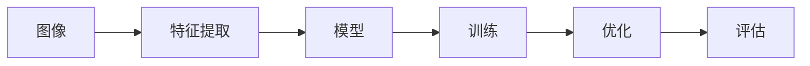

                 

# 计算机视觉 (Computer Vision) 原理与代码实例讲解

## 1. 背景介绍

### 1.1 问题由来

计算机视觉 (Computer Vision, CV) 是人工智能 (AI) 领域的重要分支，旨在使计算机能够“看”、“理解”、“解释”图像和视频内容。随着深度学习技术的兴起，特别是卷积神经网络 (Convolutional Neural Networks, CNNs) 的广泛应用，计算机视觉技术在图像分类、目标检测、图像分割、人脸识别、动作识别等任务上取得了显著进展。

计算机视觉技术的开发和应用不仅促进了自动驾驶、智能监控、医疗影像分析、零售分析等多个领域的智能化，也在推动社会的智能化转型和提升生活质量方面发挥着重要作用。然而，尽管取得了显著进展，计算机视觉技术仍然面临诸多挑战，如复杂环境下的鲁棒性、场景的多样性、数据量不足等问题，这些挑战限制了其更广泛的应用。

### 1.2 问题核心关键点

计算机视觉的核心问题可以归纳为以下几个关键点：

- **模型选择**：选择适合特定任务的模型架构，如CNN、RNN、Transformer等，是设计高性能计算机视觉系统的基础。
- **数据预处理**：高质量的图像和视频数据是训练高性能模型的前提，数据增强、归一化、标准化等预处理技术至关重要。
- **模型训练**：选择合适的训练方法（如监督学习、无监督学习、半监督学习）、优化算法和超参数配置，对模型性能有显著影响。
- **模型部署**：将训练好的模型转换为可部署的模型，如TensorFlow Serving、ONNX Runtime等，是模型实际应用的关键。
- **模型评估**：采用准确率、召回率、F1分数等指标对模型性能进行评估，是衡量模型有效性的重要手段。

### 1.3 问题研究意义

深入研究计算机视觉原理和代码实例，不仅能够帮助开发者掌握计算机视觉核心技术，提升模型性能，还能够为计算机视觉技术的工业化应用提供指导，推动技术的普及和落地。计算机视觉技术的普及和应用，将极大地提升各行业的智能化水平，促进社会进步和经济发展。

## 2. 核心概念与联系

### 2.1 核心概念概述

计算机视觉涉及多个核心概念，包括图像、特征提取、模型、训练、优化、评估等。这些概念通过一定的逻辑关系联结起来，构成了计算机视觉技术的整体框架。

- **图像 (Image)**：计算机视觉的基础数据。图像可以是一张静态图片或一段动态视频。
- **特征提取 (Feature Extraction)**：从图像中提取有意义的特征，用于描述图像内容。
- **模型 (Model)**：用于对图像特征进行建模，从而实现图像分类、目标检测、图像分割等任务。
- **训练 (Training)**：通过标注数据对模型进行训练，使其能够适应特定任务。
- **优化 (Optimization)**：优化模型参数，提高模型性能。
- **评估 (Evaluation)**：评估模型性能，确保模型能够满足实际需求。

这些概念之间的关系可以通过以下Mermaid流程图来展示：



这个流程图展示了从图像输入到模型输出的完整流程，以及各环节之间的逻辑关系。

## 3. 核心算法原理 & 具体操作步骤

### 3.1 算法原理概述

计算机视觉的核心算法包括特征提取和模型训练。本节将详细介绍这些算法的原理。

### 3.2 算法步骤详解

#### 3.2.1 特征提取

特征提取是计算机视觉的基础步骤，其目标是从原始图像中提取有意义的特征。常用的特征提取方法包括：

- **手工特征提取**：如SIFT、SURF、HOG等，通过手工设计特征描述子，提取图像的局部特征。
- **深度学习特征提取**：如卷积神经网络 (CNN)，通过学习图像的特征表示，提取图像的全局和局部特征。

#### 3.2.2 模型训练

模型训练的目的是通过标注数据对模型进行优化，使其能够适应特定任务。常用的模型训练方法包括：

- **监督学习**：通过带有标签的数据集对模型进行训练，使其能够分类或回归。
- **无监督学习**：通过未标记的数据集对模型进行训练，使其能够聚类或降维。
- **半监督学习**：结合少量标注数据和大量未标记数据，对模型进行训练，以提高模型性能。

#### 3.2.3 算法步骤

1. **数据预处理**：对原始图像进行归一化、标准化、缩放等预处理操作，以提高特征提取和模型训练的效率。
2. **特征提取**：使用深度学习模型（如CNN）对预处理后的图像进行特征提取，得到图像的特征表示。
3. **模型训练**：将特征表示作为输入，通过标注数据对模型进行训练，调整模型参数以提高模型性能。
4. **模型优化**：通过优化算法（如SGD、Adam）对模型参数进行优化，进一步提高模型性能。
5. **模型评估**：使用测试数据对模型进行评估，通过准确率、召回率、F1分数等指标衡量模型性能。

### 3.3 算法优缺点

#### 3.3.1 优点

- **高效性**：深度学习模型能够自动学习特征表示，减少了手工特征提取的工作量，提高了特征提取的效率。
- **鲁棒性**：深度学习模型对图像的噪声和变形具有一定的鲁棒性，能够适应复杂场景。
- **可扩展性**：深度学习模型可以通过添加或修改网络层结构，适应不同任务的特征提取需求。

#### 3.3.2 缺点

- **数据依赖**：深度学习模型需要大量的标注数据进行训练，数据获取成本高。
- **计算资源需求高**：深度学习模型通常需要高性能的计算资源进行训练和推理，计算成本高。
- **模型复杂**：深度学习模型结构复杂，容易过拟合，需要额外的正则化方法来避免过拟合。

### 3.4 算法应用领域

计算机视觉技术已经广泛应用于多个领域，如智能监控、自动驾驶、医疗影像分析、零售分析等。以下是一些具体的应用场景：

- **智能监控**：用于人脸识别、行为分析、异常检测等，提高公共安全。
- **自动驾驶**：用于图像分类、目标检测、动作识别等，实现无人驾驶。
- **医疗影像分析**：用于病灶检测、影像分割、病理分析等，辅助医生诊疗。
- **零售分析**：用于商品识别、顾客行为分析、库存管理等，优化零售策略。

## 4. 数学模型和公式 & 详细讲解 & 举例说明

### 4.1 数学模型构建

计算机视觉中的数学模型主要包括图像表示、特征提取、模型训练等。以下以卷积神经网络 (CNN) 为例，介绍其数学模型构建。

#### 4.1.1 图像表示

假设输入图像为 $I \in \mathbb{R}^{H \times W \times C}$，其中 $H$ 和 $W$ 为图像的高和宽，$C$ 为通道数（如RGB图像为3）。

#### 4.1.2 特征提取

卷积神经网络通过卷积层和池化层提取图像特征。假设卷积层参数为 $W_{c} \in \mathbb{R}^{k \times k \times C}$，其中 $k$ 为卷积核大小，$C$ 为输入通道数。卷积层的输出为 $O_{c} \in \mathbb{R}^{H' \times W' \times c'}$，其中 $H'$ 和 $W'$ 为输出特征图的高和宽，$c'$ 为输出通道数。

### 4.2 公式推导过程

#### 4.2.1 卷积层

卷积层的数学公式为：

$$
O_{c} = \sigma\left(\sum_{i=0}^{C-1} \sum_{j=0}^{C-1} W_{c}^{ij} \star I_{j} + b_{c}\right)
$$

其中 $\star$ 表示卷积操作，$\sigma$ 为激活函数（如ReLU），$b_{c}$ 为偏置项。

#### 4.2.2 池化层

池化层的数学公式为：

$$
O_{p} = \sigma\left(\sum_{i=0}^{H'} \sum_{j=0}^{W'} M_{p}^{ij} O_{c}^{ij} + b_{p}\right)
$$

其中 $M_{p}^{ij}$ 为池化核，$O_{c}^{ij}$ 为卷积层的输出，$\sigma$ 为激活函数，$b_{p}$ 为偏置项。

### 4.3 案例分析与讲解

#### 4.3.1 图像分类

假设输入图像为 $I \in \mathbb{R}^{H \times W \times C}$，输出标签为 $Y \in \{1,2,\ldots,C\}$，其中 $C$ 为类别数。

使用卷积神经网络对图像进行分类，其数学公式为：

$$
L = \sum_{i=1}^{N} \sum_{c=1}^{C} \mathbb{1}(Y_{i}=c) \log P_{c}(I_{i})
$$

其中 $N$ 为训练样本数，$Y_{i}$ 为第 $i$ 个样本的标签，$P_{c}(I_{i})$ 为第 $i$ 个样本属于第 $c$ 类的概率，$\mathbb{1}(\cdot)$ 为指示函数。

#### 4.3.2 目标检测

假设输入图像为 $I \in \mathbb{R}^{H \times W \times C}$，输出标签为 $(Y_{x}, Y_{y}, Y_{w}, Y_{h}) \in \{1,2,\ldots,C\}^4$，其中 $C$ 为类别数。

使用卷积神经网络对图像进行目标检测，其数学公式为：

$$
L = \sum_{i=1}^{N} \sum_{c=1}^{C} \mathbb{1}(Y_{i}=c) \left( \log P_{c}(I_{i}) + \log \mathcal{L}_{box}(Y_{x}, Y_{y}, Y_{w}, Y_{h}, I_{i}) \right)
$$

其中 $N$ 为训练样本数，$Y_{i}$ 为第 $i$ 个样本的标签，$P_{c}(I_{i})$ 为第 $i$ 个样本属于第 $c$ 类的概率，$\mathcal{L}_{box}$ 为目标检测的损失函数，用于衡量预测框与真实框之间的差异。

## 5. 项目实践：代码实例和详细解释说明

### 5.1 开发环境搭建

在进行计算机视觉项目开发前，需要准备好开发环境。以下是使用Python进行OpenCV和TensorFlow进行计算机视觉开发的简单环境配置流程：

1. 安装Anaconda：从官网下载并安装Anaconda，用于创建独立的Python环境。
2. 创建并激活虚拟环境：
```bash
conda create -n cv-env python=3.8 
conda activate cv-env
```
3. 安装必要的库：
```bash
pip install opencv-python numpy matplotlib scikit-image scikit-learn tensorboard
```

### 5.2 源代码详细实现

下面以图像分类为例，给出使用TensorFlow和Keras实现卷积神经网络 (CNN) 的代码实现。

首先，定义数据处理函数：

```python
from tensorflow.keras.preprocessing.image import ImageDataGenerator
from tensorflow.keras.applications.resnet50 import preprocess_input
import cv2
import numpy as np

def load_image(path):
    img = cv2.imread(path)
    img = cv2.resize(img, (224, 224))
    img = preprocess_input(img)
    return np.expand_dims(img, axis=0)

def prepare_dataset(train_dir, val_dir, batch_size):
    train_datagen = ImageDataGenerator(
        rescale=1./255,
        shear_range=0.2,
        zoom_range=0.2,
        horizontal_flip=True)
    val_datagen = ImageDataGenerator(rescale=1./255)

    train_generator = train_datagen.flow_from_directory(
        train_dir, 
        target_size=(224, 224), 
        batch_size=batch_size, 
        class_mode='categorical')
    val_generator = val_datagen.flow_from_directory(
        val_dir, 
        target_size=(224, 224), 
        batch_size=batch_size, 
        class_mode='categorical')

    return train_generator, val_generator
```

然后，定义模型和损失函数：

```python
from tensorflow.keras.models import Model
from tensorflow.keras.layers import Input, Conv2D, MaxPooling2D, Flatten, Dense

def create_model():
    base_model = tf.keras.applications.ResNet50(weights='imagenet', include_top=False, input_shape=(224, 224, 3))
    for layer in base_model.layers:
        layer.trainable = False

    x = base_model.output
    x = Flatten()(x)
    x = Dense(512, activation='relu')(x)
    predictions = Dense(10, activation='softmax')(x)
    
    model = Model(inputs=base_model.input, outputs=predictions)
    model.compile(optimizer='adam', loss='categorical_crossentropy', metrics=['accuracy'])
    return model
```

最后，启动训练流程并在验证集上评估：

```python
epochs = 10
batch_size = 32

model = create_model()
train_generator, val_generator = prepare_dataset(train_dir, val_dir, batch_size)

history = model.fit(train_generator, 
                    validation_data=val_generator, 
                    epochs=epochs)
```

以上就是使用TensorFlow实现卷积神经网络进行图像分类的完整代码实现。可以看到，Keras和TensorFlow的简单封装使得模型训练和评估变得非常便捷。

### 5.3 代码解读与分析

让我们再详细解读一下关键代码的实现细节：

**load_image函数**：
- 加载并预处理图像数据，使其符合模型的输入格式。

**prepare_dataset函数**：
- 定义数据增强技术，对训练集进行数据增强。
- 使用ImageDataGenerator生成训练集和验证集的DataLoader。
- 返回训练集和验证集的DataLoader。

**create_model函数**：
- 使用预训练的ResNet50模型作为基础模型。
- 冻结基础模型的所有层，只训练新增的全连接层。
- 添加全连接层，并定义分类输出层。
- 定义模型并编译，准备进行训练。

**训练流程**：
- 定义训练轮数和批量大小。
- 创建模型和DataLoader。
- 使用模型fit方法进行训练，并在验证集上评估模型性能。

## 6. 实际应用场景

### 6.1 智能监控

智能监控系统广泛应用于公共安全领域，用于人脸识别、行为分析、异常检测等。通过使用深度学习模型，智能监控系统能够实时监测公共场所中的行为，自动识别异常事件，提高公共安全。

具体实现时，可以使用卷积神经网络对监控摄像头拍摄的视频进行实时处理，提取图像特征，识别出其中的目标和行为，从而实现自动报警、自动分析等功能。

### 6.2 自动驾驶

自动驾驶是计算机视觉技术的重要应用之一，涉及图像分类、目标检测、动作识别等多个方面。通过使用深度学习模型，自动驾驶系统能够实时处理传感器数据，识别道路上的交通标志、行人和车辆，从而实现自动驾驶功能。

具体实现时，可以结合摄像头和雷达等传感器数据，使用卷积神经网络对图像进行分类和检测，识别出道路上的交通标志、行人和车辆，从而实现自动驾驶功能。

### 6.3 医疗影像分析

医疗影像分析是计算机视觉技术的重要应用之一，用于病灶检测、影像分割、病理分析等多个方面。通过使用深度学习模型，医疗影像分析系统能够自动识别医学影像中的异常情况，辅助医生进行诊断和治疗。

具体实现时，可以使用卷积神经网络对医学影像进行分类和检测，识别出影像中的病灶和异常情况，从而辅助医生进行诊断和治疗。

### 6.4 未来应用展望

随着深度学习技术的不断进步，计算机视觉技术将在更多领域得到应用，为各行各业带来变革性影响。

在智慧城市治理中，计算机视觉技术可以用于城市事件监测、舆情分析、应急指挥等环节，提高城市管理的自动化和智能化水平，构建更安全、高效的未来城市。

在智慧农业领域，计算机视觉技术可以用于作物识别、病虫害检测、农机自动化等，提升农业生产效率和产品质量。

在娱乐领域，计算机视觉技术可以用于游戏动作捕捉、虚拟现实、增强现实等，提升用户体验和互动性。

此外，在军事、航天、电力、航空等多个领域，计算机视觉技术也有广泛的应用前景。相信随着技术的不断进步和应用，计算机视觉技术将在更多领域大放异彩，推动社会的发展和进步。

## 7. 工具和资源推荐

### 7.1 学习资源推荐

为了帮助开发者系统掌握计算机视觉核心技术，这里推荐一些优质的学习资源：

1. 《计算机视觉基础》系列博文：由计算机视觉领域的知名专家撰写，深入浅出地介绍了计算机视觉基础概念和技术。
2. 《Deep Learning for Computer Vision》课程：斯坦福大学开设的计算机视觉课程，涵盖了计算机视觉的各个方面，包括图像分类、目标检测、图像分割等。
3. 《Hands-On Machine Learning with Scikit-Learn, Keras, and TensorFlow》书籍：这本书详细介绍了如何使用TensorFlow和Keras进行计算机视觉任务开发，包括数据处理、模型训练、模型评估等。
4. OpenCV官方文档：OpenCV是计算机视觉领域的重要库，提供了大量的预处理和算法工具，是学习计算机视觉不可或缺的资源。
5. Kaggle竞赛：Kaggle上有许多计算机视觉竞赛，可以通过参与竞赛来学习计算机视觉的最新技术和应用，提升实战能力。

通过对这些资源的学习实践，相信你一定能够快速掌握计算机视觉核心技术，并用于解决实际的计算机视觉问题。

### 7.2 开发工具推荐

高效的开发离不开优秀的工具支持。以下是几款用于计算机视觉开发的常用工具：

1. OpenCV：开源计算机视觉库，提供了大量的图像处理和算法工具，是计算机视觉开发的基础。
2. TensorFlow：Google开发的深度学习框架，提供了丰富的模型库和工具，适用于计算机视觉任务开发。
3. Keras：深度学习模型框架，提供了简单易用的API，适用于快速原型开发和实验。
4. PyTorch：Facebook开发的深度学习框架，提供了灵活的动态计算图，适用于模型训练和推理。
5. Jupyter Notebook：免费的交互式编程环境，适用于编写代码和调试模型。

合理利用这些工具，可以显著提升计算机视觉开发效率，加快技术迭代和创新。

### 7.3 相关论文推荐

计算机视觉技术的发展得益于学界的持续研究。以下是几篇奠基性的相关论文，推荐阅读：

1. AlexNet：深度卷积神经网络的经典之作，奠定了卷积神经网络在计算机视觉中的应用基础。
2. R-CNN: 目标检测任务的经典算法，提出了一种区域卷积神经网络架构，显著提升了目标检测的精度。
3. Mask R-CNN: 在R-CNN基础上增加了语义分割模块，实现了目标检测和语义分割的双重任务。
4. ResNet: 深度残差网络的提出，解决了深度神经网络训练过程中的梯度消失问题，提升了模型的训练效率和性能。
5. YOLO: 实时目标检测的经典算法，提出了单阶段检测网络，实现了高精度和实时性的平衡。

这些论文代表了大规模卷积神经网络在计算机视觉中的发展和突破，是学习计算机视觉技术的必读之作。

## 8. 总结：未来发展趋势与挑战

### 8.1 研究成果总结

计算机视觉技术经过多年的发展，已经取得了显著进展，在多个领域得到了广泛应用。未来，随着深度学习技术的不断进步和应用场景的不断拓展，计算机视觉技术将迎来更大的发展机遇。

### 8.2 未来发展趋势

展望未来，计算机视觉技术将呈现以下几个发展趋势：

1. **多模态融合**：未来的计算机视觉技术将更加注重多模态数据的融合，如将视觉数据与语音、文本等数据结合，实现更全面、准确的环境感知。
2. **自监督学习**：自监督学习技术将在大规模无标注数据上训练模型，减少对标注数据的需求，提升模型的鲁棒性和泛化能力。
3. **模型压缩和优化**：随着计算资源和存储成本的不断降低，模型压缩和优化技术将得到更广泛的应用，提升模型的实时性和可部署性。
4. **隐私保护**：数据隐私保护将成为计算机视觉技术发展的重要方向，未来的技术将更加注重隐私保护和数据安全。
5. **实时处理**：随着计算资源和硬件设备的不断升级，计算机视觉技术的实时处理能力将得到大幅提升，实现更快速、更准确的环境感知。

### 8.3 面临的挑战

尽管计算机视觉技术已经取得了显著进展，但仍面临诸多挑战：

1. **数据获取成本高**：大规模标注数据获取成本高，限制了计算机视觉技术的广泛应用。
2. **模型鲁棒性不足**：计算机视觉模型在复杂环境下鲁棒性不足，容易受到噪声、光照变化等因素的影响。
3. **计算资源需求高**：深度学习模型的计算资源需求高，限制了其在大规模数据上的应用。
4. **模型可解释性差**：深度学习模型往往“黑箱”化，难以解释其内部工作机制和决策逻辑，影响模型的可信度。

### 8.4 研究展望

未来的计算机视觉研究需要在以下几个方面寻求新的突破：

1. **无监督和半监督学习**：通过无监督和半监督学习，减少对标注数据的需求，提升模型的泛化能力和鲁棒性。
2. **模型压缩和优化**：开发更加高效的模型压缩和优化技术，减少计算资源需求，提升模型的实时性和可部署性。
3. **隐私保护技术**：开发更加安全的隐私保护技术，确保数据隐私和安全。
4. **多模态融合**：将视觉数据与语音、文本等数据结合，实现更全面、准确的环境感知。
5. **实时处理技术**：提升计算资源和硬件设备的性能，实现计算机视觉技术的实时处理。

总之，计算机视觉技术的发展需要不断突破现有技术的瓶颈，结合新思路和新方法，才能在更广泛的领域得到应用和推广。

## 9. 附录：常见问题与解答

**Q1: 计算机视觉的核心算法是什么？**

A: 计算机视觉的核心算法包括特征提取、模型训练、优化等。其中，卷积神经网络是计算机视觉领域最常用的模型，其核心算法包括卷积、池化、全连接等。

**Q2: 计算机视觉任务有哪些？**

A: 计算机视觉任务包括图像分类、目标检测、图像分割、人脸识别、动作识别等。具体任务可以根据实际需求进行选择和定制。

**Q3: 计算机视觉模型需要哪些超参数？**

A: 计算机视觉模型需要设置学习率、批大小、训练轮数等超参数。这些超参数的设置需要根据具体任务和数据集进行调整。

**Q4: 计算机视觉模型如何进行模型评估？**

A: 计算机视觉模型可以使用准确率、召回率、F1分数等指标进行评估。这些指标可以反映模型在分类、检测等任务上的性能。

**Q5: 计算机视觉技术的未来发展方向是什么？**

A: 计算机视觉技术的未来发展方向包括多模态融合、自监督学习、模型压缩和优化、隐私保护、实时处理等。这些方向将推动计算机视觉技术的进一步发展和应用。

总之，计算机视觉技术在多个领域已经取得了显著进展，但仍然面临诸多挑战。未来，需要不断突破现有技术的瓶颈，结合新思路和新方法，才能在更广泛的领域得到应用和推广。

