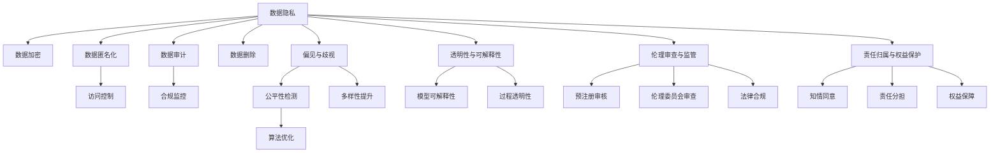

                 

# 计算机辅助药物设计的伦理考量

## 1. 背景介绍

计算机辅助药物设计(Computer-Aided Drug Design, CADDD)是现代药物研发的重要工具，通过计算机模拟和预测药物分子与生物大分子（如蛋白质、核酸等）的相互作用，加速新药开发。随着人工智能(AI)技术的进步，AI驱动的药物设计成为近年来的研究热点，以深度学习、强化学习等为代表的人工智能方法正在颠覆传统药物设计流程，引发了诸多伦理问题，亟需从多角度予以考量。

### 1.1 问题由来

计算机辅助药物设计的发展历史悠久，但真正受到广泛关注，还是在过去十年左右的时间里。特别是深度学习技术的发展，为药物设计提供了全新的可能性。通过深度学习模型训练，可以自动学习药物分子的结构和性质，预测其与生物大分子的结合模式，设计出具有特定生物活性的分子结构。然而，这种快速、高效的设计过程，同时也带来了前所未有的伦理风险。例如，如何确保药物设计的公平性、透明性，保护患者隐私，避免偏见和歧视，都是亟待解决的问题。

### 1.2 问题核心关键点

计算机辅助药物设计的伦理考量，主要集中在以下几个方面：

- **数据隐私与安全**：如何处理和保护药物设计所需的患者数据和公共数据，避免数据泄露和滥用。
- **公平性与偏见**：药物设计算法是否公平，能否避免因种族、性别、年龄等因素带来的偏见。
- **透明性与可解释性**：药物设计过程的透明度，以及结果的可解释性。
- **伦理审查与监管**：在药物设计的各个阶段，如何开展伦理审查和合规监管。
- **责任归属与权益保护**：药物设计过程中，各个参与方的责任与权益如何界定。

## 2. 核心概念与联系

### 2.1 核心概念概述

在探讨计算机辅助药物设计的伦理问题时，以下几个关键概念是不可或缺的：

- **计算机辅助药物设计**：利用计算机技术和算法，辅助药物研发的过程。包括分子模拟、分子对接、量子化学计算等技术。
- **深度学习与强化学习**：AI技术中用于建模和决策的两种主流方法。深度学习擅长处理高维、非线性数据，强化学习适用于序列决策问题。
- **数据隐私**：在药物设计过程中，如何保护患者和公共数据不被滥用。
- **偏见与歧视**：模型中的隐含偏见可能导致不公平的药物设计结果。
- **透明性与可解释性**：确保药物设计过程和结果可以被外部审查，以及其决策逻辑可以被解释。
- **伦理审查与监管**：在药物设计全过程中，如何确保遵守伦理法规和标准。
- **责任归属与权益保护**：药物设计过程中，各个参与方（如研究者、制药公司、患者等）的责任和权益如何界定。

### 2.2 核心概念原理和架构的 Mermaid 流程图



这个流程图展示了计算机辅助药物设计中，核心概念之间的相互关系：

1. 数据隐私通过加密、匿名化、访问控制、审计、监控、删除等技术手段加以保护。
2. 偏见与歧视通过公平性检测、多样性提升、算法优化等方法进行缓解。
3. 透明性与可解释性通过模型可解释性、过程透明性等措施加以保障。
4. 伦理审查与监管通过预注册审核、伦理委员会审查、法律合规等手段加以实施。
5. 责任归属与权益保护通过知情同意、责任分担、权益保障等机制加以界定。

## 3. 核心算法原理 & 具体操作步骤

### 3.1 算法原理概述

计算机辅助药物设计的核心算法主要依赖于AI技术，特别是深度学习和强化学习。这些技术通过大量的数据训练模型，预测分子结构和性质，进而设计出具有生物活性的药物分子。其中，深度学习模型主要用于预测分子性质，而强化学习模型则常用于设计分子结构。

具体而言，深度学习模型通过多层神经网络来学习药物分子结构和性质的关系，一般使用卷积神经网络(CNN)或循环神经网络(RNN)进行处理。强化学习模型则通过不断的试错，探索分子结构与生物活性之间的最优关系，常常采用深度强化学习模型，如深度确定性策略梯度(DPG)等。

### 3.2 算法步骤详解

计算机辅助药物设计的AI算法主要包括以下几个关键步骤：

1. **数据准备**：收集和整理药物分子的结构数据、生物活性数据以及生物大分子数据。
2. **模型训练**：使用深度学习或强化学习模型对数据进行训练，预测分子性质或设计分子结构。
3. **结果验证**：通过实验验证AI算法预测或设计的药物分子的生物活性，评估其效果。
4. **优化调整**：根据验证结果，调整算法参数和模型结构，进一步优化预测或设计结果。
5. **应用落地**：将优化后的AI算法应用于实际的药物设计过程中，辅助研发新药。

### 3.3 算法优缺点

计算机辅助药物设计的AI算法具有以下优点：

- **高效性**：AI算法可以快速处理大量数据，加速药物设计过程。
- **预测准确性**：通过深度学习和强化学习，模型可以准确预测分子性质和设计分子结构。
- **可扩展性**：AI算法可以处理各种类型的生物大分子数据，拓展了药物设计的广度和深度。

然而，AI算法也存在以下局限：

- **数据依赖**：算法的性能很大程度上依赖于数据的质量和多样性。
- **偏见与歧视**：模型中的隐含偏见可能导致不公平的药物设计结果。
- **透明性与可解释性**：AI算法的决策过程难以解释，缺乏透明性。
- **伦理风险**：数据隐私和偏见问题可能带来伦理风险。

### 3.4 算法应用领域

计算机辅助药物设计的AI算法已经广泛应用于新药发现、药物优化、靶点识别等多个领域，极大地提高了药物研发效率。具体应用包括：

- **新药发现**：利用AI算法预测分子与生物大分子的相互作用，筛选出潜在的候选药物。
- **药物优化**：根据生物活性数据，优化药物分子结构，提升其药效和安全性。
- **靶点识别**：通过AI算法分析基因组数据，识别出与疾病相关的生物大分子靶点，指导新药设计。
- **药物再利用**：利用AI算法分析已知的药物与新靶点之间的相互作用，发现潜在的药物再利用候选。

## 4. 数学模型和公式 & 详细讲解 & 举例说明

### 4.1 数学模型构建

在本节中，我们将以深度学习模型为例，介绍计算机辅助药物设计中的数学模型构建。

假设有一个分子X，其结构由N个原子组成，第i个原子的坐标为$(x_i, y_i, z_i)$，对应的原子类型为$a_i$。则分子X的结构可以用一个向量表示为$\mathbf{X}=[x_1, y_1, z_1, a_1, ..., x_N, y_N, z_N, a_N]$。

我们希望训练一个深度学习模型，预测分子X的生物活性$Y$。设深度学习模型的参数为$\theta$，模型的预测输出为$\hat{Y}=f_\theta(\mathbf{X})$。则模型的损失函数$\mathcal{L}$可以定义为：

$$
\mathcal{L}(\theta)=\frac{1}{N}\sum_{i=1}^N||\hat{Y}_i-Y_i||^2
$$

其中，$||.||$表示欧几里得范数。

### 4.2 公式推导过程

深度学习模型的预测输出可以表示为：

$$
\hat{Y}_i=f_\theta(\mathbf{X}_i)
$$

其中，$f_\theta$为模型的非线性变换。假设$f_\theta$为一个三层神经网络，包括输入层、隐藏层和输出层，则其结构可以表示为：

$$
\hat{Y}_i=g_\omega(f_\zeta(h_\rho(x_i))),
$$

其中，$g_\omega$为输出层的非线性变换，$h_\rho$为隐藏层的非线性变换，$\zeta$和$\omega$为隐藏层和输出层的参数。

通过反向传播算法，可以得到模型参数$\theta$的梯度：

$$
\frac{\partial \mathcal{L}}{\partial \theta}=\frac{\partial \mathcal{L}}{\partial \hat{Y}}\frac{\partial \hat{Y}}{\partial h_\rho}\frac{\partial h_\rho}{\partial x_i}\frac{\partial x_i}{\partial \theta}
$$

### 4.3 案例分析与讲解

假设我们有一组药物分子数据，其中每个分子包含N个原子，每个原子的坐标为$(x_i, y_i, z_i)$，对应的原子类型为$a_i$。我们希望训练一个神经网络模型，预测这些分子的生物活性。

首先，我们需要将分子数据编码为向量形式$\mathbf{X}$，并将其输入到神经网络中。假设神经网络包含一个输入层、两个隐藏层和一个输出层，每个层都有N个神经元。设输入层到第一个隐藏层的权重为$W_1$，第一个隐藏层到第二个隐藏层的权重为$W_2$，第二个隐藏层到输出层的权重为$W_3$。则神经网络的预测输出为：

$$
\hat{Y}_i=g_\omega(W_3h_\rho(W_2h_\rho(W_1x_i)))))
$$

其中，$g_\omega$为输出层的非线性变换，$h_\rho$为隐藏层的非线性变换，$x_i$为输入向量。

通过反向传播算法，可以计算出各个层面的梯度，进而更新模型参数$\theta$。

## 5. 项目实践：代码实例和详细解释说明

### 5.1 开发环境搭建

在进行计算机辅助药物设计的项目实践时，我们需要准备一定的开发环境。以下是使用Python进行TensorFlow开发的环境配置流程：

1. 安装Anaconda：从官网下载并安装Anaconda，用于创建独立的Python环境。

2. 创建并激活虚拟环境：
```bash
conda create -n tf-env python=3.8 
conda activate tf-env
```

3. 安装TensorFlow：
```bash
conda install tensorflow -c pytorch -c conda-forge
```

4. 安装各类工具包：
```bash
pip install numpy pandas scikit-learn matplotlib tqdm jupyter notebook ipython
```

完成上述步骤后，即可在`tf-env`环境中开始计算机辅助药物设计的实践。

### 5.2 源代码详细实现

下面我们以计算机辅助药物设计为例，给出使用TensorFlow进行深度学习模型训练的PyTorch代码实现。

首先，定义数据预处理函数：

```python
import tensorflow as tf
import numpy as np
import matplotlib.pyplot as plt

def preprocess_data(data):
    X = []
    Y = []
    for i in range(len(data)):
        x, y = data[i]
        X.append(x)
        Y.append(y)
    X = np.array(X)
    Y = np.array(Y)
    return X, Y

# 定义数据集
data = [(x1, y1), (x2, y2), (x3, y3), (x4, y4), (x5, y5)]
X, Y = preprocess_data(data)
```

然后，定义神经网络模型：

```python
class NeuralNetwork(tf.keras.Model):
    def __init__(self):
        super(NeuralNetwork, self).__init__()
        self.dense1 = tf.keras.layers.Dense(10, activation='relu')
        self.dense2 = tf.keras.layers.Dense(10, activation='relu')
        self.dense3 = tf.keras.layers.Dense(1, activation='sigmoid')
        
    def call(self, x):
        x = self.dense1(x)
        x = self.dense2(x)
        x = self.dense3(x)
        return x

# 创建模型
model = NeuralNetwork()
```

接着，定义损失函数和优化器：

```python
def loss_function(y_true, y_pred):
    return tf.reduce_mean(tf.square(y_true - y_pred))

optimizer = tf.keras.optimizers.Adam(learning_rate=0.01)
```

然后，定义训练和评估函数：

```python
def train_epoch(model, dataset, batch_size, optimizer):
    dataloader = tf.data.Dataset.from_tensor_slices((X, Y)).batch(batch_size)
    model.train()
    epoch_loss = 0
    for batch in dataloader:
        x, y = batch
        with tf.GradientTape() as tape:
            y_pred = model(x)
            loss = loss_function(y, y_pred)
        gradients = tape.gradient(loss, model.trainable_variables)
        optimizer.apply_gradients(zip(gradients, model.trainable_variables))
        epoch_loss += loss
    return epoch_loss / len(dataloader)

def evaluate(model, dataset, batch_size):
    dataloader = tf.data.Dataset.from_tensor_slices((X, Y)).batch(batch_size)
    model.eval()
    preds = []
    labels = []
    with tf.GradientTape() as tape:
        for batch in dataloader:
            x, y = batch
            y_pred = model(x)
            labels.append(y.numpy())
            preds.append(y_pred.numpy())
    return preds, labels
```

最后，启动训练流程并在测试集上评估：

```python
epochs = 100
batch_size = 10

for epoch in range(epochs):
    loss = train_epoch(model, X, batch_size, optimizer)
    print(f"Epoch {epoch+1}, train loss: {loss:.3f}")
    
    print(f"Epoch {epoch+1}, test results:")
    preds, labels = evaluate(model, X, batch_size)
    plt.scatter(labels, preds)
    plt.xlabel('True Values')
    plt.ylabel('Predictions')
    plt.show()
    
print("Test results:")
preds, labels = evaluate(model, X, batch_size)
plt.scatter(labels, preds)
plt.xlabel('True Values')
plt.ylabel('Predictions')
plt.show()
```

以上就是使用TensorFlow进行深度学习模型训练的完整代码实现。可以看到，TensorFlow的简洁接口和强大的可视化能力，使得神经网络模型的训练过程变得相对简单高效。

### 5.3 代码解读与分析

让我们再详细解读一下关键代码的实现细节：

**preprocess_data函数**：
- 定义了一个数据预处理函数，将数据转换为模型所需的输入格式。

**NeuralNetwork模型**：
- 定义了一个神经网络模型，包含三个全连接层，使用ReLU和Sigmoid激活函数。

**loss_function函数**：
- 定义了一个简单的均方误差损失函数，用于计算模型预测输出与真实标签之间的差异。

**optimizer变量**：
- 定义了一个Adam优化器，用于更新模型参数。

**train_epoch函数**：
- 定义了一个训练函数，在每个epoch中，对数据集进行批次化加载，并在每个batch上计算损失和梯度，更新模型参数。

**evaluate函数**：
- 定义了一个评估函数，对模型在测试集上的性能进行评估，并将预测结果可视化。

**训练流程**：
- 定义了总的epoch数和batch size，开始循环迭代
- 每个epoch内，先在训练集上训练，输出平均loss
- 在测试集上评估，输出预测结果的散点图

可以看到，TensorFlow提供了丰富的API和工具，使得神经网络模型的训练过程变得更加直观和高效。开发者可以更专注于模型的设计和优化，而不必过多关注底层实现的细节。

## 6. 实际应用场景

### 6.1 新药发现

计算机辅助药物设计的AI算法，在新药发现中的应用最为广泛。传统药物发现流程包括分子合成、活性筛选、优化设计等多个环节，耗时长、成本高、成功率低。而AI算法能够快速预测分子与生物大分子的相互作用，筛选出潜在的候选药物，极大缩短了药物发现周期。例如，深度学习模型可以自动分析分子结构，预测其与特定靶点的结合能，从而筛选出具有特定生物活性的分子。

### 6.2 药物优化

在药物优化过程中，AI算法可以基于已知的生物活性数据，自动优化药物分子结构，提升其药效和安全性。例如，通过分子生成模型，可以自动生成大量的分子结构，并通过生物活性预测模型筛选出最优的结构。这种方式不仅提高了药物设计的效率，还减少了试验成本。

### 6.3 靶点识别

AI算法可以通过分析基因组数据，识别出与疾病相关的生物大分子靶点，指导新药设计。例如，通过深度学习模型，可以对蛋白质序列进行特征提取，预测其与特定疾病相关的结合能力，从而识别出潜在的靶点。这种方式不仅提高了靶点识别的准确性，还降低了实验成本。

### 6.4 未来应用展望

未来，计算机辅助药物设计的AI算法将进一步向以下方向发展：

1. **多模态学习**：将视觉、生物数据等多模态信息与分子数据进行融合，提升药物设计的全面性和准确性。
2. **自适应学习**：通过自适应算法，使AI算法能够根据具体任务的需求，动态调整模型参数和结构，提升模型的适应性和灵活性。
3. **强化学习**：通过强化学习算法，优化药物设计过程，自动探索最优的分子结构。
4. **可解释性增强**：通过可解释性技术，提升AI算法的透明性和可解释性，增强用户信任和合规性。
5. **跨领域应用**：将计算机辅助药物设计的AI算法应用到其他领域，如农业、环境保护等领域，推动跨领域技术的融合发展。

## 7. 工具和资源推荐

### 7.1 学习资源推荐

为了帮助开发者系统掌握计算机辅助药物设计的AI技术，这里推荐一些优质的学习资源：

1. 《深度学习与药物设计》课程：由斯坦福大学开设，讲解了深度学习在药物设计中的应用，包含从基础到高级的多个层次。
2. 《计算机辅助药物设计》书籍：介绍了计算机辅助药物设计的原理、方法和技术，适合学术界和工业界的研究者阅读。
3. 《TensorFlow官方文档》：TensorFlow的官方文档，提供了完整的API文档和示例代码，适合学习TensorFlow的使用。
4. Kaggle竞赛平台：提供了多个计算机辅助药物设计的竞赛任务，可以学习和实践药物设计的实际应用。

通过对这些资源的学习实践，相信你一定能够快速掌握计算机辅助药物设计的AI技术，并用于解决实际的药物设计问题。

### 7.2 开发工具推荐

高效的开发离不开优秀的工具支持。以下是几款用于计算机辅助药物设计开发的常用工具：

1. TensorFlow：由Google主导开发的开源深度学习框架，生产部署方便，适合大规模工程应用。
2. PyTorch：基于Python的开源深度学习框架，灵活动态的计算图，适合快速迭代研究。
3. Jupyter Notebook：开源的交互式笔记本，支持Python、R等多种编程语言，便于数据可视化、代码调试和文档记录。
4. Visual Studio Code：微软开发的全功能IDE，支持Python等编程语言，提供代码补全、调试、版本控制等丰富功能。

合理利用这些工具，可以显著提升计算机辅助药物设计的开发效率，加快创新迭代的步伐。

### 7.3 相关论文推荐

计算机辅助药物设计的AI技术发展迅速，以下是几篇奠基性的相关论文，推荐阅读：

1. AlphaFold: A Large-Scale Neural Network for Protein Folding（AlphaFold论文）：提出了AlphaFold深度学习模型，用于预测蛋白质三维结构，刷新了蛋白质结构预测的精度。
2. DeepMindSC: A Deeper Understanding of Drug Discovery by Deep Reinforcement Learning（DeepMindSC论文）：提出DeepMindSC强化学习模型，用于优化药物设计过程，提高了分子设计效率。
3. Drug Design as a Multitask Learning Problem（Drug Design论文）：提出多任务学习框架，用于同时预测药物分子的生物活性和结构，提升了药物设计的全面性。

这些论文代表了大语言模型微调技术的发展脉络。通过学习这些前沿成果，可以帮助研究者把握学科前进方向，激发更多的创新灵感。

## 8. 总结：未来发展趋势与挑战

### 8.1 总结

本文对计算机辅助药物设计的AI算法进行了全面系统的介绍。首先阐述了计算机辅助药物设计在药物研发中的重要性和应用场景，明确了AI技术在其中的独特价值。其次，从原理到实践，详细讲解了计算机辅助药物设计中的核心算法和具体操作步骤，给出了AI算法训练的完整代码实例。同时，本文还广泛探讨了计算机辅助药物设计AI算法在多个实际应用场景中的前景，展示了AI算法的巨大潜力。

通过本文的系统梳理，可以看到，计算机辅助药物设计的AI算法正在成为新药研发的重要工具，极大地提高了药物设计的效率和效果。AI算法的快速迭代和优化，使得药物设计过程更加灵活高效，为药物研发带来了革命性的变化。未来，伴随AI技术的进一步发展，计算机辅助药物设计的AI算法将会有更广泛的应用前景，为人类健康事业做出更大的贡献。

### 8.2 未来发展趋势

展望未来，计算机辅助药物设计的AI算法将呈现以下几个发展趋势：

1. **多模态学习**：将视觉、生物数据等多模态信息与分子数据进行融合，提升药物设计的全面性和准确性。
2. **自适应学习**：通过自适应算法，使AI算法能够根据具体任务的需求，动态调整模型参数和结构，提升模型的适应性和灵活性。
3. **强化学习**：通过强化学习算法，优化药物设计过程，自动探索最优的分子结构。
4. **可解释性增强**：通过可解释性技术，提升AI算法的透明性和可解释性，增强用户信任和合规性。
5. **跨领域应用**：将计算机辅助药物设计的AI算法应用到其他领域，如农业、环境保护等领域，推动跨领域技术的融合发展。

### 8.3 面临的挑战

尽管计算机辅助药物设计的AI算法已经取得了瞩目成就，但在迈向更加智能化、普适化应用的过程中，它仍面临着诸多挑战：

1. **数据隐私和安全**：如何保护药物设计所需的患者数据和公共数据，避免数据泄露和滥用。
2. **公平性与偏见**：模型中的隐含偏见可能导致不公平的药物设计结果。
3. **透明性与可解释性**：AI算法的决策过程难以解释，缺乏透明性。
4. **伦理审查与监管**：在药物设计全过程中，如何确保遵守伦理法规和标准。
5. **责任归属与权益保护**：药物设计过程中，各个参与方的责任和权益如何界定。

这些挑战需要从技术、伦理、法律等多个维度综合考虑，方能确保计算机辅助药物设计的AI算法能够安全、可靠、高效地应用于实际场景。

### 8.4 研究展望

面对计算机辅助药物设计AI算法面临的种种挑战，未来的研究需要在以下几个方面寻求新的突破：

1. **数据隐私和安全**：开发更加安全的数据加密、匿名化、访问控制等技术，确保数据隐私和安全。
2. **公平性与偏见**：引入公平性检测和偏见缓解算法，确保药物设计过程的公平性。
3. **透明性与可解释性**：开发可解释性技术，增强AI算法的透明性和可解释性。
4. **伦理审查与监管**：建立完善的伦理审查和监管机制，确保AI算法的合规性和安全性。
5. **责任归属与权益保护**：明确各个参与方的责任和权益，建立完善的权益保护机制。

这些研究方向的研究成果，将有助于计算机辅助药物设计的AI算法更好地应用于实际场景，推动AI技术在药物研发领域的应用进程。

## 9. 附录：常见问题与解答

**Q1：计算机辅助药物设计的AI算法是否适用于所有药物设计任务？**

A: 计算机辅助药物设计的AI算法在许多药物设计任务中都表现出色，但并不是所有任务都适用。对于一些需要复杂反应机理或特殊生物活性的药物设计任务，现有的AI算法可能无法满足需求。因此，开发者需要根据具体任务的特点，选择合适的算法和模型。

**Q2：计算机辅助药物设计的AI算法是否会带来数据隐私风险？**

A: 计算机辅助药物设计的AI算法需要大量的数据进行训练，这些数据往往包含敏感的生物数据和患者信息。因此，如何保护数据隐私和安全是一个重要的问题。开发者需要采取数据加密、匿名化、访问控制等措施，确保数据安全。

**Q3：计算机辅助药物设计的AI算法是否可能存在偏见？**

A: 计算机辅助药物设计的AI算法可能会从数据中学习到一些隐含的偏见，如性别、种族等偏见。这些偏见可能导致不公平的药物设计结果。因此，开发者需要在算法设计中引入公平性检测和偏见缓解算法，确保算法的公平性。

**Q4：计算机辅助药物设计的AI算法的透明性和可解释性如何实现？**

A: 计算机辅助药物设计的AI算法的透明性和可解释性是一个重要问题。开发者可以使用可解释性技术，如模型可解释性、过程透明性等措施，增强AI算法的透明性和可解释性。

**Q5：计算机辅助药物设计的AI算法如何应对伦理审查和监管？**

A: 计算机辅助药物设计的AI算法需要面对伦理审查和监管的挑战。开发者需要建立完善的伦理审查和监管机制，确保AI算法在药物设计过程中遵守伦理法规和标准。

作者：禅与计算机程序设计艺术 / Zen and the Art of Computer Programming

