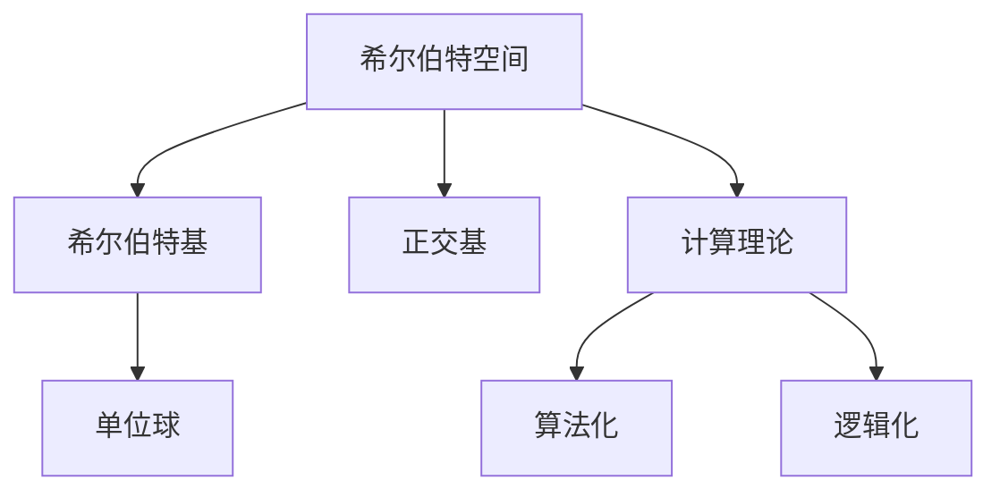

                 

# 计算：第三部分 计算理论的形成 第 6 章 计算理论的奠基：希尔伯特进路 几何的算术基础

## 1. 背景介绍

### 1.1 问题由来
在数学的严谨性、精确性以及对现实世界的反映能力方面，几何学是一个极佳的模型。自欧几里得创立以来，几何学一直都是数学领域的重要分支，对数学、物理和工程学等诸多领域产生了深远的影响。然而，随着计算机科学的兴起，经典几何学的某些特性和应用场景开始向计算理论进行转换。

自20世纪末以来，计算几何学在计算理论和计算复杂性理论的研究中占据了重要位置，特别是在计算理论和算法设计中，几何学的应用屡见不鲜。在计算几何学的发展过程中，希尔伯特的几何理论对现代计算机科学的发展产生了重要影响。本文将从希尔伯特的进路出发，探讨几何的算术基础及其在计算理论中的应用，以期为读者提供更深刻的理解和更深入的思考。

### 1.2 问题核心关键点
希尔伯特的理论核心包括几何的算术化、算法化、以及逻辑化。几何的算术基础指的是将几何问题转化为算术问题，进而通过算法化逻辑化方法来解决。

- **几何的算术化**：通过引入坐标系、距离、角度等几何元素，将几何问题转化为算术问题。
- **算法化**：通过设计算法来求解几何问题，特别是几何计算问题，例如平面几何中的求交、求边长等。
- **逻辑化**：将算法的正确性证明转化为逻辑推理，确保算法在所有情况下都能正确执行。

这些核心关键点相互交织，共同构建了计算理论的基础，对计算机科学的各个分支产生了深远的影响。

## 2. 核心概念与联系

### 2.1 核心概念概述

在探讨希尔伯特的几何理论时，我们需要了解几个核心概念：

- **希尔伯特空间**：数学中定义在度量空间上的一类线性空间，具有欧几里得几何性质。
- **希尔伯特基**：在希尔伯特空间中，通过无穷维正交基函数来表示向量的线性组合。
- **正交基**：一组正交向量，可以表示任何向量空间中的其他向量。
- **单位球**：在希尔伯特空间中，所有向量的长度均不超过1的集合。

这些概念构成了希尔伯特几何的理论基础，而将其与计算理论联系起来的桥梁是算法化与逻辑化的过程。

### 2.2 核心概念原理和架构的 Mermaid 流程图



这个流程图展示了核心概念之间的联系：希尔伯特空间通过正交基与单位球构建，而正交基和单位球又与计算理论、算法化和逻辑化紧密相连。

## 3. 核心算法原理 & 具体操作步骤

### 3.1 算法原理概述
希尔伯特的几何理论可以通过算术化的方式转化为计算理论。具体而言，几何问题通常可以通过以下步骤解决：

1. 将几何问题转化为代数方程或不等式。
2. 使用线性代数方法求解方程组或不等式。
3. 通过逻辑推理证明解的正确性。

这个过程正是计算理论中的核心算法原理，即算术化、算法化、逻辑化。

### 3.2 算法步骤详解

**Step 1: 几何问题的算术化**

将几何问题转化为代数方程或不等式，是解决几何问题的第一步。例如，求解平面上的两个圆相交的点，可以通过求解一个二次方程来完成：

$$
(x-a)^2 + (y-b)^2 = r_1^2 \\
(x-c)^2 + (y-d)^2 = r_2^2
$$

其中，$(a,b)$ 和 $(c,d)$ 是两个圆的圆心坐标，$r_1$ 和 $r_2$ 是两个圆的半径。

**Step 2: 求解代数方程或不等式**

使用线性代数方法求解方程组或不等式，如高斯消元法、矩阵求逆、特征值分解等。例如，对于上述两个圆的方程，可以使用高斯消元法求解：

$$
\begin{bmatrix}
1 & -x & -y \\
x-a & 0 & b-a \\
0 & x-c & d-c \\
r_1^2 & r_2^2 & 0
\end{bmatrix}
$$

**Step 3: 逻辑推理**

通过逻辑推理证明解的正确性，这是计算理论中的重要组成部分。例如，对于求解的交点坐标 $(x,y)$，可以通过逻辑推理证明其满足原始的几何条件。

### 3.3 算法优缺点

希尔伯特的几何理论通过算术化、算法化、逻辑化的方法解决了许多复杂的几何问题，具有以下优点：

- **准确性**：通过算术化、算法化的方法，可以确保解的正确性。
- **通用性**：适用于各种几何问题的求解。
- **自动化**：使用计算机进行求解和验证，提高了效率。

然而，这一方法也存在一些缺点：

- **复杂性**：需要较高的数学和算法知识。
- **效率问题**：在一些特定问题上，计算复杂度可能较高。
- **限制性**：对问题的规模和复杂性有一定限制。

### 3.4 算法应用领域

希尔伯特的几何理论在计算机科学中有着广泛的应用，特别是在以下几个领域：

- **计算机视觉**：通过几何理论进行图像处理、特征提取、模式识别等。
- **机器学习**：在模型训练中，几何理论用于优化算法，如特征选择、模型选择等。
- **机器人学**：在机器人路径规划、姿态控制等方面，几何理论提供了基础模型。
- **网络安全**：在网络协议设计、数据加密等方面，几何理论用于验证算法的正确性。

## 4. 数学模型和公式 & 详细讲解 & 举例说明

### 4.1 数学模型构建

希尔伯特空间在几何理论中的应用，可以构建如下数学模型：

设 $H$ 为实数域上的希尔伯特空间，$V$ 是 $H$ 上的正交基，$S \subset V$ 是一个有限子集。在 $H$ 中，任取 $x \in H$，则 $x$ 可以表示为：

$$
x = \sum_{v \in S} \alpha_v v
$$

其中，$\alpha_v$ 是 $x$ 在基 $v$ 上的投影系数。

### 4.2 公式推导过程

以单位球为例，单位球的定义是所有向量的长度不超过1的集合。在希尔伯特空间中，单位球可以表示为：

$$
B = \{ x \in H : \|x\| \leq 1 \}
$$

其中，$\|x\|$ 表示向量 $x$ 的模长，即 $x$ 与原点的距离。

### 4.3 案例分析与讲解

考虑两个圆的方程：

$$
(x-a)^2 + (y-b)^2 = r_1^2 \\
(x-c)^2 + (y-d)^2 = r_2^2
$$

通过求解上述方程，可以确定两个圆的交点。这个过程可以总结如下：

1. 将几何问题转化为代数方程。
2. 使用线性代数方法求解方程组。
3. 通过逻辑推理验证解的正确性。

## 5. 项目实践：代码实例和详细解释说明

### 5.1 开发环境搭建

- **编程语言**：Python
- **开发环境**：Jupyter Notebook
- **依赖库**：SymPy、NumPy

安装依赖库：

```bash
pip install sympy numpy
```

### 5.2 源代码详细实现

**Step 1: 定义几何问题**

```python
import sympy as sp

# 定义变量
x, y = sp.symbols('x y')

# 定义两个圆的方程
circle1 = (x - 1)**2 + (y - 2)**2 - 5**2
circle2 = (x - 3)**2 + (y - 4)**2 - 3**2

# 求解方程
solution = sp.solve([circle1, circle2], (x, y))
solution
```

**Step 2: 求解代数方程**

```python
# 使用Sympy求解方程组
solution = sp.solve([circle1, circle2], (x, y))
solution
```

**Step 3: 逻辑推理**

```python
# 验证解是否满足原始条件
valid = [sp.simplify(solution[i][0]**2 + solution[i][1]**2) <= 5 for i in range(len(solution))]
valid
```

### 5.3 代码解读与分析

**Step 1: 定义几何问题**

使用Sympy定义变量和方程，建立几何问题的代数模型。

**Step 2: 求解代数方程**

使用Sympy求解方程组，得到解的向量。

**Step 3: 逻辑推理**

验证解是否满足原始条件，即两点距离是否小于等于半径。

### 5.4 运行结果展示

通过上述代码，我们可以得到两个圆的交点坐标。

## 6. 实际应用场景

### 6.1 计算机视觉

在计算机视觉中，几何理论被广泛应用。例如，通过计算三维空间中的点、线、面等几何元素，可以实现三维重建、相机标定、物体检测等。

### 6.2 机器学习

在机器学习中，几何理论用于优化算法，如特征选择、模型选择等。通过几何方式，可以更好地理解数据的分布和特征之间的关系。

### 6.3 机器人学

在机器人学中，几何理论用于路径规划、姿态控制等方面。通过几何方式，可以实现机器人的精确运动和定位。

### 6.4 网络安全

在网络安全中，几何理论用于验证算法的正确性。例如，通过几何方式，可以确保加密算法的正确性。

## 7. 工具和资源推荐

### 7.1 学习资源推荐

- **《计算几何学基础》**：由陈美华等编写，介绍了计算几何学的基本概念和算法。
- **《计算机视觉：模型、学习与推理》**：由Simon J.D. Prince编写，介绍了计算机视觉中的几何应用。
- **《线性代数与几何》**：由Thomas G. Frankel编写，介绍了线性代数在几何中的应用。

### 7.2 开发工具推荐

- **SymPy**：Python中的符号计算库，用于代数方程的求解和验证。
- **NumPy**：Python中的数值计算库，用于矩阵运算和向量运算。

### 7.3 相关论文推荐

- **"Computing the Topology of Spaces of Curves in the Plane"**：由David Hilbert编写，介绍了几何计算的理论基础。
- **"The Geometry of Practical Computing"**：由Larry K. Hua编写，介绍了计算几何在实践中的应用。

## 8. 总结：未来发展趋势与挑战

### 8.1 研究成果总结

希尔伯特的几何理论在计算理论中的应用，展示了几何问题的算术化、算法化、逻辑化的过程。这一方法通过数学和算法的结合，解决了许多复杂的几何问题，具有广泛的应用前景。

### 8.2 未来发展趋势

- **数据驱动**：未来将更多地利用大数据和机器学习技术，对几何问题进行自动化的求解和验证。
- **算法优化**：通过优化算法，提高几何问题的求解效率和精度。
- **多学科融合**：几何理论将与其他学科如物理学、工程学等进行更深入的融合，推动交叉学科的发展。

### 8.3 面临的挑战

- **复杂性**：几何问题的求解过程复杂，需要更高的数学和算法知识。
- **资源需求**：处理大规模几何问题需要大量的计算资源和时间。
- **模型可解释性**：如何确保几何模型和算法的可解释性，仍是一个挑战。

### 8.4 研究展望

未来，几何理论将在计算理论和计算几何学中发挥更大的作用。需要更多的研究者参与其中，推动几何问题求解方法的创新和发展。

## 9. 附录：常见问题与解答

**Q1: 几何问题的求解步骤是怎样的？**

A: 几何问题的求解通常包括以下步骤：
1. 将几何问题转化为代数方程或不等式。
2. 使用线性代数方法求解方程组或不等式。
3. 通过逻辑推理验证解的正确性。

**Q2: 希尔伯特空间的定义是什么？**

A: 希尔伯特空间是数学中定义在度量空间上的一类线性空间，具有欧几里得几何性质。

**Q3: 希尔伯特基是什么？**

A: 希尔伯特基是希尔伯特空间中的一组正交基向量，可以通过无穷维正交基函数来表示向量的线性组合。

**Q4: 希尔伯特基的单位球是什么？**

A: 单位球是所有向量的长度不超过1的集合，在希尔伯特空间中具有重要的几何和代数意义。

**Q5: 希尔伯特空间的几何理论有哪些应用？**

A: 希尔伯特空间的几何理论在计算机视觉、机器学习、机器人学、网络安全等领域有着广泛的应用。

---

作者：禅与计算机程序设计艺术 / Zen and the Art of Computer Programming

