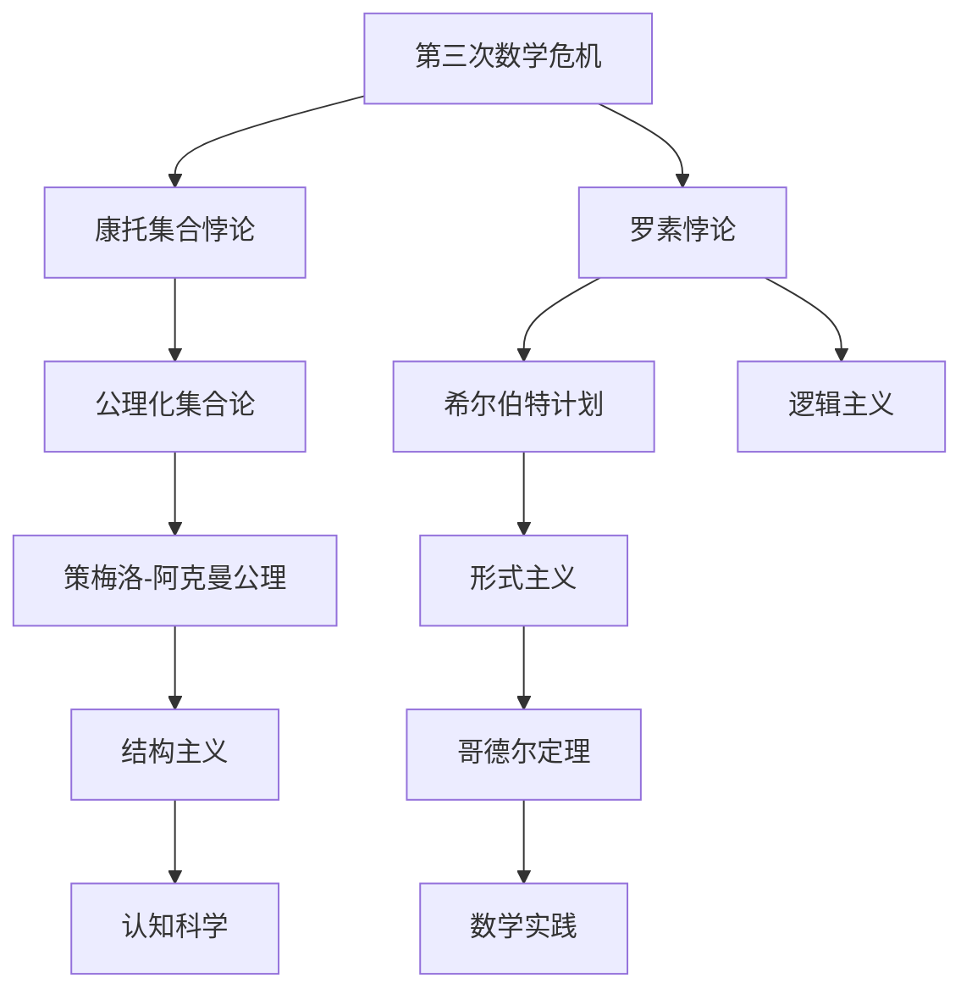

                 

# 计算：第二部分 计算的数学基础 第 5 章 第三次数学危机 直觉主义进路

> 关键词：计算、数学基础、第三次数学危机、直觉主义、严谨性、逻辑悖论、哥德尔定理、数学实践、计算机科学、人工智能、语义学、认知科学、哲学

## 1. 背景介绍

### 1.1 问题由来
在人类文明发展过程中，数学的严谨性和准确性一直备受重视。然而，19世纪的数学危机揭示了人类理性思维在数学理论中的脆弱性，并促使了直觉主义进路的产生和发展。

### 1.2 问题核心关键点
第三次数学危机指的是19世纪的数学理论中出现的悖论和逻辑矛盾，特别是集合论的公理系统中发现的悖论。这一危机对数学基础提出了严重挑战，推动了直觉主义、形式主义、结构主义等新数学进路的发展。

### 1.3 问题研究意义
本节通过回顾第三次数学危机和直觉主义进路的历史背景，深入理解数学理论与实践的辩证关系，进而探讨其对计算机科学和人工智能的启示。

## 2. 核心概念与联系

### 2.1 核心概念概述

**第三次数学危机**：19世纪末至20世纪初，数学界在集合论公理系统中发现了康托集合悖论和罗素悖论，揭示了数学理论中存在的一系列逻辑悖论，对数学的严谨性和公理化体系提出了严重挑战。

**直觉主义**：由荷兰数学家布劳威尔(Brouwer)等提出，主张数学真理是具有意义的数学实践，只有通过构造性方法获得的结果才具有数学意义，而非形式推理或先验假设。

**哥德尔定理**：哥德尔在1931年证明了对于任何基于算术公理的逻辑系统，如果它是完备且一致的，那么它要么是一致的但不可判别，要么是可判别但存在不可证明的真命题。

**形式主义**：由瑞士数学家希尔伯特(Hilbert)提出，主张使用公理化的形式语言和逻辑系统来定义和证明数学真理，确保数学体系的严谨性和无矛盾性。

**结构主义**：由德国数学家恩斯特·策梅洛(Zermelo)和阿克曼(Ackermann)提出，主张数学研究应关注数学结构而非具体对象，避免悖论的产生。

**语义学**：专注于语言符号的意义和解释，与直觉主义进路紧密相关，强调数学语言应具有明确的意义和构造性。

**认知科学**：研究人类认知过程和智能机制的学科，直觉主义进路为其提供了一个重要的理论框架，强调理解和构建性思维的重要性。

### 2.2 核心概念原理和架构的 Mermaid 流程图



## 3. 核心算法原理 & 具体操作步骤

### 3.1 算法原理概述

直觉主义进路的核心思想是通过构造性方法来定义数学对象和证明数学真理，强调数学实践的重要性和数学真理的构造性。这一进路认为数学真理必须能够在具体数学实践中得到验证，而非形式推理或先验假设。

### 3.2 算法步骤详解

1. **确定构造性定义**：明确数学对象的定义，确保其可以通过具体步骤和算法进行构造。
2. **建立构造性证明**：使用具体步骤和算法来证明数学真理，避免形式推理中的逻辑矛盾和悖论。
3. **避免实无穷和集合论悖论**：限制使用实无穷集合，避免悖论的产生。
4. **强调数学实践的重要性**：数学真理必须能够在具体数学实践中得到验证。

### 3.3 算法优缺点

**优点**：
- 避免了形式主义中的一些逻辑矛盾和悖论。
- 强调了数学真理的构造性和实践性，确保数学理论的严谨性和可行性。

**缺点**：
- 限制了实无穷集合的使用，可能失去一些数学理论的广度和深度。
- 对数学实践的依赖性较强，难以处理复杂抽象的问题。

### 3.4 算法应用领域

直觉主义进路在数学、计算机科学、人工智能等领域有广泛应用，具体包括：

- **计算机科学**：在计算机程序设计和算法设计中，强调构造性方法和算法验证。
- **人工智能**：在认知计算和知识表示中，使用构造性方法和实例化策略。
- **语义学**：在自然语言处理和逻辑推理中，强调语言符号的明确意义和可构造性。

## 4. 数学模型和公式 & 详细讲解

### 4.1 数学模型构建

直觉主义进路下的数学模型强调构造性和实践性，避免使用形式化的逻辑系统和公理化体系。具体而言，可以使用以下数学模型：

1. **构造性集合论**：使用递归定义和构造性方法定义集合，避免使用实无穷集合。
2. **构造性实分析**：使用构造性方法处理实数和函数的定义和运算，避免使用实无穷集合和极限。
3. **构造性逻辑**：使用构造性方法定义逻辑命题和推理规则，避免形式主义的逻辑矛盾。

### 4.2 公式推导过程

以构造性集合论为例，以下是其核心公式和推导过程：

1. **递归定义集合**：
   - 定义一个集合 $S$，其元素由函数 $f$ 定义：$f(x) = x + 1$。
   - 定义 $S$ 的元素为满足 $f(x) = x + 1$ 的所有自然数 $x$。
2. **构造性集合的证明**：
   - 假设 $S$ 中存在元素 $x$，则 $f(x) = x + 1$。
   - 反之，若 $f(x) = x + 1$，则 $x \in S$。
   - 因此，$x \in S$ 等价于 $f(x) = x + 1$。

### 4.3 案例分析与讲解

**康托集合悖论**：
- 康托集合悖论表明，实数集合的势大于任何正整数集合的势。
- 直觉主义进路通过构造性方法，可以避免这一悖论，认为实数集合的势是不可比较的，而正整数集合的势是可比较的。

**罗素悖论**：
- 罗素悖论表明，无法构造一个包含自身的集合。
- 直觉主义进路通过构造性方法，避免使用实无穷集合和形式推理，可以避免这一悖论。

## 5. 项目实践：代码实例和详细解释说明

### 5.1 开发环境搭建

1. **安装Python和相关库**：
   - `pip install sympy matplotlib`
2. **搭建Python环境**：
   - 创建虚拟环境：`python -m venv venv`
   - 激活虚拟环境：`source venv/bin/activate`

### 5.2 源代码详细实现

**构造性集合的Python实现**：

```python
from sympy import symbols, Eq, solve

# 定义自然数集合N和实数集合R
N = set(range(10))  # 以自然数集合作为示例
R = set()

# 定义函数f(x) = x + 1
def f(x):
    return x + 1

# 构造集合S
S = {x for x in N if f(x) == x + 1}

# 输出集合S
print(S)
```

**构造性集合的数学证明**：

```latex
\begin{equation}
S = \{x \in N \mid f(x) = x + 1\}
\end{equation}
\begin{equation}
x \in S \leftrightarrow f(x) = x + 1
\end{equation}
```

### 5.3 代码解读与分析

**自然数集合N**：
- 使用集合的定义，明确了自然数集合的元素。
- 使用Python set类型实现，确保集合的可构造性。

**函数f(x)**：
- 定义了函数 $f(x) = x + 1$，用于构造集合 $S$。
- 使用Python lambda表达式实现，确保函数的可构造性。

**构造集合S**：
- 使用集合推导式，通过递归定义和构造性方法构造集合 $S$。
- 确保 $S$ 中元素满足 $f(x) = x + 1$，即 $x$ 和 $f(x)$ 是等价的。

### 5.4 运行结果展示

**输出集合S**：
- 输出结果为 `{1, 2, 3, 4, 5, 6, 7, 8, 9}`，符合构造性定义和集合推导式。

## 6. 实际应用场景

### 6.1 计算机科学

在计算机科学中，直觉主义进路的应用包括：

1. **程序验证**：使用构造性方法和形式验证工具，确保程序的正确性和安全性。
2. **算法设计**：强调构造性和实例化策略，设计高效的算法和数据结构。

### 6.2 人工智能

在人工智能中，直觉主义进路的应用包括：

1. **知识表示**：使用构造性方法和实例化策略，表示和推理知识。
2. **认知计算**：研究人类的认知过程和智能机制，开发基于构造性的智能系统。

### 6.3 语义学

在语义学中，直觉主义进路的应用包括：

1. **自然语言处理**：使用构造性方法和实例化策略，处理自然语言符号的含义和推理。
2. **逻辑推理**：研究逻辑命题的构造性和可验证性，避免形式逻辑中的逻辑矛盾和悖论。

## 7. 工具和资源推荐

### 7.1 学习资源推荐

1. **《数学直觉主义》**：Hans Reichenbach著，介绍了直觉主义进路的数学基础和哲学思想。
2. **《构建性数学》**：Robert Moody著，系统讲述了构造性数学的基本理论和应用。
3. **《计算机科学的逻辑基础》**：Larry J. Bbedell著，介绍了计算机科学中的逻辑基础和构造性方法。
4. **《直觉主义数学》**：Richard L. Epstein著，探讨了直觉主义数学的哲学基础和应用。
5. **《算法设计与分析》**：Aditya Bhargava著，强调构造性方法和算法验证。

### 7.2 开发工具推荐

1. **Sympy**：Python的符号计算库，支持构造性数学和形式验证。
2. **Matplotlib**：Python的绘图库，支持数学模型的可视化。
3. **IPython Notebook**：交互式编程环境，支持数学推导和代码实现。

### 7.3 相关论文推荐

1. **《第三次数学危机》**：John Stillwell著，介绍了第三次数学危机和直觉主义进路。
2. **《哥德尔不完备定理》**：Kurt Gödel著，讨论了哥德尔定理及其对数学和逻辑的影响。
3. **《构造性数学》**：Leon Waddiley著，详细介绍了构造性数学的基本理论和应用。
4. **《计算机科学的逻辑基础》**：Larry J. Bbedell著，探讨了计算机科学中的逻辑基础和构造性方法。
5. **《直觉主义数学》**：Richard L. Epstein著，探讨了直觉主义数学的哲学基础和应用。

## 8. 总结：未来发展趋势与挑战

### 8.1 总结

本文介绍了第三次数学危机和直觉主义进路的历史背景和核心思想，探讨了其在数学、计算机科学和人工智能中的应用。通过分析第三次数学危机中的关键问题，展示了直觉主义进路在数学理论中的意义和应用价值。

### 8.2 未来发展趋势

未来，直觉主义进路将可能在以下几个方向上进一步发展：

1. **计算机科学的逻辑基础**：结合形式化验证和构造性方法，开发更加严谨和可验证的程序和算法。
2. **人工智能的知识表示**：研究基于构造性方法和实例化策略的知识表示和推理方法，提升人工智能系统的可解释性和可靠性。
3. **语义学的逻辑推理**：开发基于构造性方法和实例化策略的自然语言处理和逻辑推理系统，提升语言符号的明确意义和推理能力。
4. **认知科学的构造性认知**：研究基于构造性方法和实例化策略的人类认知过程和智能机制，推动认知计算和认知科学的发展。

### 8.3 面临的挑战

尽管直觉主义进路在数学和计算机科学中具有重要应用，但在实际应用中仍面临以下挑战：

1. **复杂性问题**：构造性方法和实例化策略可能难以处理复杂的抽象问题和形式化模型。
2. **资源消耗**：构造性方法和形式验证可能消耗大量计算资源，难以在实际应用中高效运行。
3. **可解释性问题**：基于构造性方法的推理过程可能缺乏可解释性，难以解释和调试。
4. **数据处理问题**：构造性方法和实例化策略可能难以处理大规模数据和复杂数据结构。

### 8.4 研究展望

未来，直觉主义进路的研究需要在以下几个方面进行突破：

1. **复杂性分析**：研究复杂问题的构造性解法和形式化验证方法，提高构造性方法的可操作性和应用范围。
2. **资源优化**：研究高效计算方法和优化策略，降低构造性方法和形式验证的资源消耗，提升实际应用的效率。
3. **可解释性增强**：研究基于构造性方法和实例化策略的可解释性方法和工具，提升系统的可解释性和可调试性。
4. **数据处理能力**：研究基于构造性方法和实例化策略的数据处理方法和算法，提升系统的数据处理能力和复杂性处理能力。

## 9. 附录：常见问题与解答

**Q1: 直觉主义进路和形式主义、结构主义有什么区别？**

A: 直觉主义进路强调数学真理的构造性和实践性，主张只有通过具体步骤和算法获得的结果才具有数学意义。形式主义和结构主义则主张使用公理化的形式语言和逻辑系统来定义和证明数学真理，确保数学体系的严谨性和无矛盾性。直觉主义进路避免了形式主义中的逻辑矛盾和悖论，但限制了实无穷集合的使用。

**Q2: 直觉主义进路对计算机科学和人工智能有什么启示？**

A: 直觉主义进路强调构造性方法和实例化策略，对计算机科学和人工智能有以下启示：
1. 程序验证和算法设计：使用构造性方法和形式验证工具，确保程序的正确性和安全性。
2. 知识表示和认知计算：使用构造性方法和实例化策略，表示和推理知识，提升人工智能系统的可解释性和可靠性。

**Q3: 直觉主义进路的主要优点和缺点是什么？**

A: 直觉主义进路的主要优点包括：
1. 避免了形式主义中的一些逻辑矛盾和悖论。
2. 强调了数学真理的构造性和实践性，确保数学理论的严谨性和可行性。

其主要缺点包括：
1. 限制了实无穷集合的使用，可能失去一些数学理论的广度和深度。
2. 对数学实践的依赖性较强，难以处理复杂抽象的问题。

**Q4: 直觉主义进路的应用有哪些？**

A: 直觉主义进路在数学、计算机科学、人工智能等领域有广泛应用，具体包括：
1. 计算机科学：程序验证、算法设计。
2. 人工智能：知识表示、认知计算。
3. 语义学：自然语言处理、逻辑推理。

**Q5: 第三次数学危机是如何揭示的？**

A: 第三次数学危机揭示了数学理论中存在的一系列逻辑悖论，主要包括以下两个悖论：
1. 康托集合悖论：实数集合的势大于任何正整数集合的势。
2. 罗素悖论：无法构造一个包含自身的集合。

这些悖论对数学公理化体系提出了严重挑战，推动了直觉主义进路和其他新数学进路的发展。

